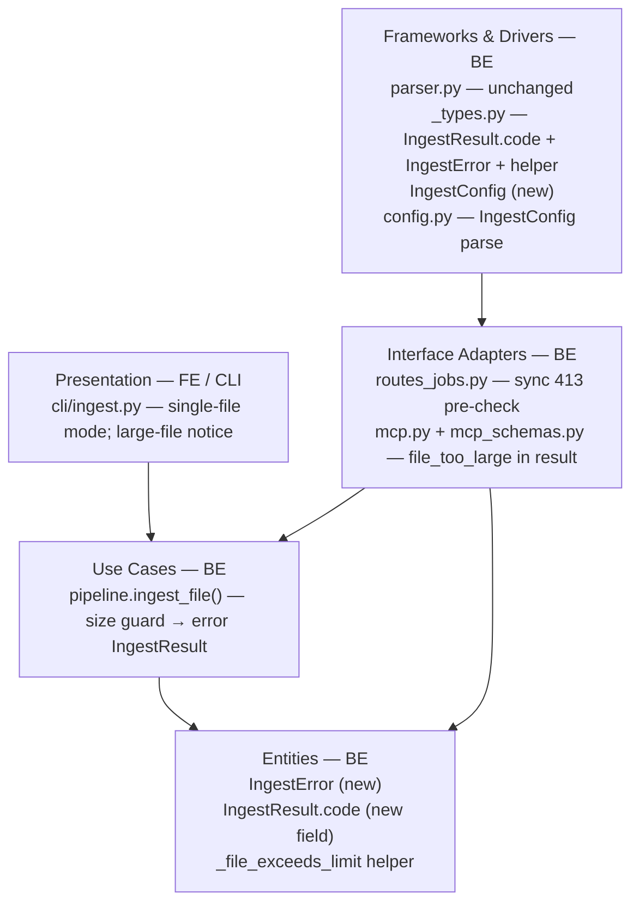
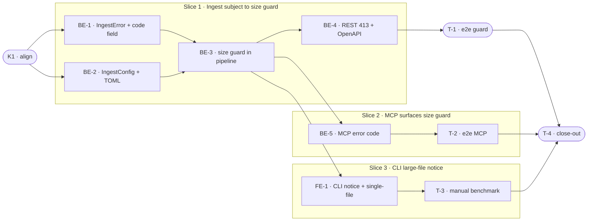

# E0d · PDF Large-File Support — Team Plan

**How to read this file**
- **Architecture approach:** Clean Architecture — default; no override skill requested. **Layers:** Presentation · Use Cases · Interface Adapters · Entities · Frameworks & Drivers. Dependencies point inward. Each task's first sub-bullet names the layer it touches.
- The **Frontend, Backend, and Tester** sections are the **depth view** — each role's work, grouped by layer.
- The **Task Breakdown** is the **order view** — every task is a single-role checkbox in execution order, opening with a dependency graph. Tick them off as they land.
- **Phases are vertical slices**: each delivers a working end-to-end increment, not a horizontal layer. No separate "integrate" phase — each slice integrates by construction. Sliced with the **`vertical-slicer` skill**.
- Each task carries the **role tag at the end of its title line**, then sub-bullets: **layer · estimate** (decimal hours), **needs · completes**, and a **Tests** block. **needs** = predecessor tasks; **completes** = the scenario `S#` it makes true, or the contract `C#` it realises.
- **Tests** are tagged by level. **Unit and integration tests belong to the implementing dev** (test-first); **e2e and manual tests are the tester's tasks**. The close-out task writes no tests.
- **Contracts** are typed as TypeSpec (v1.13.0 is available). Internal logical seams are core-construct `.tsp` files beside this plan (compiled clean). The HTTP/API seam (`POST /ingest` → 413) is a TypeSpec HTTP service in `api-contracts/` with an emitted `openapi.yaml`.
- **Role tags** (`#frontend-role`, `#backend-role`, `#tester-role`) mark each task and each role-owned section.
- IDs (`S#` scenarios, `C#` contracts, `BE-#`/`FE-#`/`T-#`/`K#` tasks, `Q#` questions) are the traceability thread.
- **Rule:** edit your own tasks freely; change a contract only by team agreement.
- **Frontend in this project** means the CLI Presentation layer (`archon_search/cli/`). There is no web UI.

---

## Background

PDF ingestion has an effective ~1 MB size limit that emerges from docling's full-document materialisation inside `convert()`. Users who ingest real-world PDFs (research papers, financial reports, manuals) hit a generic `ParseError` or a silent timeout with no actionable message. Docling does not expose a per-page streaming API (verified 2026-06-27 against docling 2.102.2) — the implementation therefore adds a pre-check (`os.path.getsize()`) before calling `convert()`, giving full control over the error message. Memory reduction for very large PDFs remains a D4 concern.

---

## Goal

PDF files (and any files) of any practical size ingest without error when no size guard is configured. When an operator sets `[ingest].max_file_mb`, a file exceeding the limit produces a clear, actionable error — not a silent timeout — naming the file size, the limit, and the config key.

---

## Scope

### In Scope
- New `[ingest]` TOML section with `max_file_mb: int` (default `0` = no limit)
- New `IngestError` exception with `code="file_too_large"` and human-readable message
- New `IngestResult.code` field to carry `"file_too_large"` through the pipeline return path
- Size guard in `pipeline.ingest_file()` — universal chokepoint (REST, MCP, CLI, watcher all route through it); the guard returns an error `IngestResult`, never raising out of the function
- Synchronous HTTP 413 pre-check in `POST /ingest` route handler: fires only when `body.path` is a single file path (not a directory, not a `documents` payload); returns 413 before job creation
- MCP `ingest_file` error handling: surface `code="file_too_large"` in the result schema
- CLI: single-file ingest support (`--path` routing to a file → `pipeline.ingest_file()`); pre-parse large-file notice printed to stderr for files > 10 MB
- OpenAPI snapshot regeneration (adds 413 response to `POST /ingest`)
- Documentation: `[ingest].max_file_mb` in UserManual; 413 taxonomy row in `Architecture/140`; remove implicit 1 MB limitation claim

### Out of Scope
- Memory reduction during docling conversion (deferred to D4 — streaming chunk emission)
- Per-page progress "Parsing page X/Y" (infeasible: docling `convert()` is opaque; replaced with a pre-parse notice)
- Splitting PDFs at the file level — user-side operation
- Password-protected, image-only (scanned) PDF handling beyond current docling behaviour
- Streaming HTTP upload — ingest operates on filesystem paths
- Parallelising page conversion across threads

---

## Acceptance criteria
- A PDF (or any file) with `max_file_mb=0` (default) ingests successfully regardless of size
- `max_file_mb > 0`: REST `POST /ingest` returns HTTP 413 with message "File size X MB exceeds the configured limit of Y MB (`[ingest].max_file_mb`). Raise the limit in `archon-search.toml` or split the file." when a single-file path exceeds the limit; no job is created
- `max_file_mb > 0`: MCP `ingest_file` returns `status="error"`, `code="file_too_large"` with the same message
- `max_file_mb > 0`: CLI `archon-search ingest --path <oversized-file>` exits non-zero with the actionable message on stderr
- `max_file_mb > 0`: boundary is strictly greater-than (file exactly at the limit is accepted)
- `max_file_mb = -1` (negative) in TOML raises `ConfigError` at server start
- CLI prints a pre-parse notice to stderr for any file > 10 MB: "Parsing large file (X MB); this may take a while…"
- CLI supports `--path` pointing to a single file (routes to `pipeline.ingest_file()`; collection name = `Path(path).stem`)
- Watcher ingest inherits the guard via `pipeline.ingest_file()` (`sync.py` calls it directly for file-changed/created events and also via `ingest_directory()` for initial sync — both paths are guarded) — zero additional code required in `sync.py`
- Full test suite passes; coverage ≥ 85%

---

## What does NOT change
- `parser.py` `_parse_with_docling` — docling conversion call is unchanged; no streaming
- `IngestResult` existing fields (`doc_id`, `chunks_created`, `status`, `error`, `needs_recompute`, `warnings`)
- `ParseError` exception type and its existing call sites
- Watcher `sync.py` code — soft-fail per-file is already the contract; guard applies automatically
- All non-PDF and small-file ingest paths — no regression
- Job model, async infrastructure — no change

---

## Known limitations / accepted trade-offs
- **E0d does NOT reduce memory during conversion.** docling still fully materialises the document inside `convert()`. Memory relief for very large PDFs is D4's scope.
- **Directory ingest (REST or CLI `--path <dir>`):** oversized individual files surface as per-file `IngestResult(status="error", code="file_too_large")` within the job. The job itself succeeds for other files. There is no synchronous 413 on directory ingest (the job is already created by the time individual files are processed). See Q1.
- **Per-page progress** is infeasible with the installed docling; downgraded to a pre-parse large-file notice.
- **`body.documents` payload:** When `POST /ingest` receives an inline `documents` list (no `path`), there is no file to size-check; the guard is skipped. This is correct behavior.
- **TOCTOU:** `os.path.getsize()` is called before docling's `convert()`. A file modified between the check and conversion (e.g., a log file still being written) may exceed the limit in practice. This is an accepted limitation of any pre-check approach.
- **10 MB notice vs. `max_file_mb`:** The CLI large-file notice fires for any file > 10 MB regardless of `max_file_mb`. If an operator sets `max_file_mb = 5`, the rejection happens at 5 MB but the notice threshold is still 10 MB — so no notice is printed for a 6 MB file that is rejected. The notice is an independent UX hint for slow parses, not tied to the size guard. This is deliberate and accepted.

---

## Approach & architecture

The guard is introduced at two levels: (1) `pipeline.ingest_file()` — the single chokepoint for REST, MCP, CLI (single-file), and watcher paths — constructs and returns an error `IngestResult` directly when the size limit is exceeded (no raise-then-catch; preserves the existing soft-fail contract for batch/watcher). (2) `POST /ingest` route handler adds a synchronous pre-check — `Path(body.path).is_file()` followed by `_file_exceeds_limit(path, max_file_mb)` — placed BEFORE `job_store.create()` to return HTTP 413 immediately for single-file REST ingest without creating a job. The check is skipped for directory paths and `body.documents` requests. Both sites call the shared helper `_file_exceeds_limit(path: Path, max_file_mb: int) -> bool` (defined in `_types.py`) to avoid divergence on boundary semantics. The new `IngestResult.code` field carries the error code to callers that inspect results.

**Layer map (and role mapping)**

| Layer | Role | Components touched by E0d |
|-------|------|--------------------------|
| Presentation | **Frontend** | `cli/ingest.py` — single-file mode; large-file notice |
| Use Cases | Backend | `pipeline.py` — `ingest_file()` size guard; `SearchPipeline.__init__()` gains `max_file_mb` param |
| Interface Adapters | Backend | `routes_jobs.py` — sync 413 pre-check; `mcp.py` — error code; `mcp_schemas.py` — `code` field + `from_result()` |
| Entities | Backend | `IngestError` (new); `IngestResult.code` (new field); `_file_exceeds_limit` helper — all in `_types.py` |
| Frameworks & Drivers | Backend | `IngestConfig` (new); `config.py` — `[ingest]` parse; `archon-search.toml.example` |

**What changes**
- `_types.py`: `IngestResult` gains `code: Literal["file_too_large"] | None = None` field; new `IngestError` exception in `_types.py` (note: `ParseError` lives in `parser.py`; `IngestError` is intentionally placed in `_types.py` at the Entities layer); new `_file_exceeds_limit(path: Path, max_file_mb: int) -> bool` helper (shared by route pre-check and pipeline guard — single source of truth for boundary semantics). Message format owned by `IngestError.__init__` — downstream (route, MCP, CLI) passes it through without reconstructing.
- `pipeline.py`: `SearchPipeline.__init__()` gains `max_file_mb: int = 0` constructor parameter; `create_pipeline()` (CLI path, `pipeline.py:1558`) and `app.py` (server path, direct `SearchPipeline` construction) both set it from `cfg.ingest.max_file_mb`. `ingest_file()` calls `_file_exceeds_limit(path, self._max_file_mb)` and returns error `IngestResult` directly when exceeded (no raise-then-catch; `IngestError` is instantiated to produce the message, not raised).
- `config.py`: new `IngestConfig` dataclass; `SearchConfig` gets `ingest: IngestConfig` field; `_apply_toml` parses `[ingest]`
- `routes_jobs.py`: `ingest()` handler adds sync pre-check — `p = Path(body.path)` + `p.is_file()` + `_file_exceeds_limit(p, max_file_mb)` — placed BEFORE `job_store.create()`; returns `HTTPException(413)` immediately for single-file oversized paths; skipped for directory paths and `body.documents` requests
- `mcp.py` + `mcp_schemas.py`: `IngestResultSchema` gains `code: str | None = None` field; `from_result()` maps it from `IngestResult.code`; `ingest_file` tool surfaces `code="file_too_large"`
- `cli/ingest.py`: `--path` routes to `pipeline.ingest_file()` when path is a file, `pipeline.ingest_directory()` when directory; collection-name for single-file mode: `Path(path).stem`; `--path` help text updated from "Directory to ingest" to "File or directory to ingest"; prints large-file notice to stderr for > 10 MB; renders error IngestResult message on non-zero exit

**Key decisions (from the brief)**
- Guard placement: `pipeline.ingest_file()` for universal coverage + route for synchronous 413
- `max_file_mb = 0` (default) disables the guard — "accept what the operator's hardware can handle"
- `ingest_file()` constructs and returns error `IngestResult` directly when size limit exceeded — no raise-then-catch pattern; preserves existing soft-fail batch/watcher contract
- `os.path.getsize()` follows symlinks — correct behaviour (actual file size matters)
- Memory reduction deferred to D4; E0d's value is the size guard and actionable error

---

## Contracts / seams

Boundaries where roles must agree. Logical only — no method bodies. TypeSpec v1.13.0 used.

**C1 — IngestError + IngestResult extension** *(Entities ↔ Use Cases)*
`IngestError` carries `code="file_too_large"` and a human-readable message. `IngestError` lives in `_types.py` alongside `IngestResult` (note: `ParseError` lives in `parser.py` — `IngestError` is intentionally placed in `_types.py` at the Entities layer, not in `parser.py`). `IngestResult` gains an optional `code: Literal["file_too_large"] | None = None` field — `None` on success, `"file_too_large"` on guard rejection. Using `Literal` rather than bare `str` enables exhaustive type-checking as new codes are added. `pipeline.ingest_file()` uses direct early return when `_file_exceeds_limit` returns true — `IngestError` is instantiated to produce the message, not raised. — see [`e0d-ingest-error.tsp`](e0d-ingest-error.tsp) (internal logical seam, compiled clean)
- Realised by: BE-1 · Verified by: BE-3, BE-5, FE-1

**C2 — IngestConfig** *(Frameworks & Drivers ↔ Use Cases)*
`IngestConfig(max_file_mb: int)` is the new `[ingest]` TOML section model. Default `0` (no limit). Negative values are invalid and raise `ConfigError` at load. Both `create_pipeline()` (CLI path) and `app.py`'s direct `SearchPipeline` construction (server path) pass `cfg.ingest.max_file_mb` to `SearchPipeline.__init__(max_file_mb=...)`. — see [`e0d-ingest-config.tsp`](e0d-ingest-config.tsp) (internal logical seam, compiled clean)
- Realised by: BE-2 · Verified by: BE-2, BE-3

**C3 — POST /ingest → 413** *(REST API seam: client ↔ server)*
When a single-file path exceeds `max_file_mb`, `POST /ingest` returns HTTP 413 with `{"detail": "<actionable message>"}`. The 202 response is unchanged. The 413 check is skipped for directory paths and for requests using the `documents` payload (no filesystem path) — these always return 202 regardless of `max_file_mb`. — see [`api-contracts/e0d-ingest-413.tsp`](api-contracts/e0d-ingest-413.tsp) + [`api-contracts/e0d-ingest-413.openapi.yaml`](api-contracts/e0d-ingest-413.openapi.yaml) (HTTP/API seam, compiled + OpenAPI emitted)
- Realised by: BE-4 · Verified by: BE-4, T-1

---

## Scenarios #tester-role

Behavioural only — step-level detail is produced by the tasks below.

| id | Scenario (Given / When / Then) |
|----|-------------------------------|
| **S1** | **Given** `max_file_mb=0` (default) · **When** a 30 MB PDF is ingested via `pipeline.ingest_file()` · **Then** `IngestResult(status="ok")` with chunks indexed; no size error |
| **S2** | **Given** `max_file_mb=100` · **When** a 150 MB single-file path is sent to `POST /ingest` · **Then** HTTP 413, message names both file size (150 MB) and limit (100 MB) and `[ingest].max_file_mb`; no job created; no chunks written |
| **S3** | **Given** `max_file_mb=50` · **When** `archon-search ingest --path /path/to/60MB.pdf` · **Then** CLI exits non-zero; actionable message on stderr; no chunks indexed |
| **S4** | **Given** `max_file_mb=50` · **When** MCP `ingest_file` called with path to 60 MB file · **Then** result has `status="error"`, `code="file_too_large"`, actionable message |
| **S5** | **Given** `max_file_mb=100` · **When** a file of exactly 100 MB is ingested · **Then** accepted (strictly greater-than: `size > limit`, not `>=`) |
| **S6** | **Given** `max_file_mb=100` · **When** path is a symlink to a 150 MB file · **Then** HTTP 413 (symlink target size used). Scope: applies to `ingest_file()` direct calls (REST single-file, watcher events, CLI single-file). `ingest_directory()` skips symlinks before reaching the guard — directory-path symlinks are not covered by this scenario. |
| **S7** | **Given** `[ingest] max_file_mb = -1` in TOML · **When** server loads config · **Then** `ConfigError` raised; server does not start |
| **S8** | **Given** no `[ingest]` section in TOML · **When** any file is ingested · **Then** `max_file_mb` defaults to `0`; no size check applied |
| **S9** | **Given** any file > 10 MB · **When** CLI ingests it · **Then** notice printed to stderr before parsing: "Parsing large file (X MB); this may take a while…" |
| **S10** | **Given** `max_file_mb=50` and a directory containing a 60 MB file and a 1 MB file · **When** `ingest_directory` processes both · **Then** 1 MB file indexed; 60 MB file returns error `IngestResult(code="file_too_large")`; batch does not abort |
| **S11** | **Given** `max_file_mb=50` · **When** watcher-triggered ingest processes a 60 MB file · **Then** error `IngestResult(code="file_too_large")` returned; watcher loop continues uninterrupted; no crash |

---

## Frontend — Presentation #frontend-role

**Scope:** CLI Presentation layer only. `archon_search/cli/ingest.py` — add single-file ingest mode and large-file pre-parse notice. Writes unit tests for its task.
**Owns layer:** Presentation.

**Tasks** *(checkable in the Task Breakdown)*
- Presentation: FE-1 — CLI single-file mode + large-file notice

**Done when**
- [ ] `archon-search ingest --path /path/to/file.pdf` works (single file, not just directory) — S3
- [ ] Large-file notice printed to stderr for files > 10 MB before parsing begins — S9
- [ ] File-too-large IngestResult rendered as actionable message, CLI exits non-zero — S3

---

## Backend — Entities · Use Cases · Interface Adapters · Frameworks & Drivers #backend-role

**Scope:** All layers except Presentation. Adds `IngestError`, `IngestConfig`, `IngestResult.code`, size guard in pipeline, REST 413 pre-check, MCP result code. Writes both unit and integration tests for its tasks.
**Owns layers:** Entities, Use Cases, Interface Adapters, Frameworks & Drivers.

**Tasks by layer** *(checkable in the Task Breakdown)*
- Entities: BE-1 — IngestError + IngestResult.code field
- Frameworks & Drivers: BE-2 — IngestConfig + [ingest] TOML section
- Use Cases: BE-3 — Size guard in pipeline.ingest_file()
- Interface Adapters: BE-4 — REST 413 pre-check + OpenAPI snapshot; BE-5 — MCP error code

**Done when**
- [ ] `IngestError(code="file_too_large")` type exists and `IngestResult.code` field is present — C1
- [ ] `IngestConfig(max_file_mb=0)` parsed from TOML; negative values fail at load — C2, S7, S8
- [ ] `pipeline.ingest_file()` returns error `IngestResult(code="file_too_large")` for oversized files — S1, S5, S6, S10, S11
- [ ] `POST /ingest` returns 413 before job creation for single-file oversized path — S2, C3
- [ ] MCP `ingest_file` result carries `code="file_too_large"` on oversized file — S4

---

## Tester #tester-role

**Scope:** the tester owns **e2e and manual** tests plus the project **close-out**. Unit and integration tests belong to the implementing dev, in each implementation task's `Tests` block.

**Tasks** *(checkable in the Task Breakdown)*
- T-1 — E2e: REST 413, CLI exit, directory mixed-size ingest
- T-2 — E2e: MCP file_too_large code
- T-3 — Manual: large-PDF acceptance benchmark (500-page / ~100 MB)
- T-4 — Project close-out

**Allocation** — each scenario at the cheapest level that proves it *(unit + integration are dev-written; e2e + manual are the tester's tasks)*

| Scenario | Cheapest level | Owner |
|----------|----------------|-------|
| S1 — large file ingests (no guard) | integration | BE-3 |
| S2 — REST 413 single file | e2e (TestClient) | T-1 |
| S3 — CLI exit non-zero | e2e (CliRunner) | T-1 |
| S4 — MCP file_too_large code | e2e (MCP TestClient) | T-2 |
| S5 — boundary exact size | unit | BE-3 |
| S6 — symlink size check | unit | BE-3 |
| S7 — negative config → ConfigError | unit | BE-2 |
| S8 — default no guard | unit | BE-2 |
| S9 — CLI large-file notice | unit (CliRunner) | FE-1 |
| S10 — directory: oversized skip, others continue | integration | BE-3 |
| S11 — watcher-triggered oversized file | integration | BE-3 |
| Large-PDF acceptance benchmark (500p / 100 MB) | manual | T-3 |

---

## Documentation update

Docs the feature touches — the close-out task works through this list. List only real files.

- [ ] `Documentation/Backlog/e0d-pdf-large-file-support-brief.md` — no changes needed (source brief)
- [ ] `Documentation/Backlog/e0d-pdf-large-file-support-team-plan.md` — this file; mark done at close-out
- [ ] `Documentation/Architecture/140_error_handling_strategy.md` — add `file_too_large` / HTTP 413 taxonomy row
- [ ] `Documentation/Architecture/110_component_catalog_and_layer_breakdown.md` — add `IngestError`, `IngestConfig`, `IngestResult.code` entries for `_types.py` / `config.py` / `pipeline.py`
- [ ] `Documentation/Architecture/600_api_reference_or_public_interface.md` — add 413 response to `POST /ingest` endpoint description
- [ ] `Documentation/UserManual/` — document `[ingest].max_file_mb`; remove implicit 1 MB limitation claim
- [ ] `CLAUDE.md` — add `[ingest]` section to the `config.py` description block
- [ ] `archon-search.toml.example` — add `[ingest]` section with `# max_file_mb = 0  # 0 = no limit` example
- [ ] `BREAKING.md` — `IngestResult.code` field added; `POST /ingest` now returns 413; `MCP IngestResultSchema` gains `code` field
- [ ] OpenAPI snapshot — regenerate with `uv run --python 3.12 pytest --update-openapi-snapshot` (or equivalent)
- [ ] `learnings.md` — post-feature observations

---

## Open questions

| id | Area | Question | Resolution |
|----|------|----------|------------|
| **Q1** | Product | For **directory ingest** (REST with a directory path, or CLI `--path <dir>`), oversized individual files surface as per-file `IngestResult(status="error", code="file_too_large")` in the job — the batch continues for other files. Is this acceptable, or should the job fail fast on the first oversized file and mark the whole job FAILED? | **Resolved (K1):** Batch continues — accepted trade-off. Per-file error `IngestResult(code="file_too_large")` is the correct signal for directory ingest; fail-fast would break valid files in the batch. See "Known limitations" for full rationale. S10 tests this behaviour. |

**Resolved in this revision:**
- *Per-page progress infeasible* → replaced with single pre-parse large-file notice (> 10 MB threshold)
- *CLI single-file mode missing* → in scope for E0d (FE-1 adds `--path <file>` routing)
- *Guard scope* → type-agnostic (all file types, not PDF-only)
- *Raise vs return in `ingest_file()`* → returns error `IngestResult`; route does its own pre-check for 413
- *Boundary* → strictly greater-than (`size > limit`)
- *All brief Open Questions* → already marked resolved in the brief
- *Q1 (directory fail-fast vs. continue)* → batch continues; oversized files produce per-file error IngestResult; resolved at K1

---

## Task Breakdown

Single-role tasks in execution order, grouped into **vertical slices**.

### Dependency graph

### Phase 0 · Kickoff *(prerequisite; the one cross-cutting step)*

- [x] **K1** — Agree contracts C1–C3 and scenarios S1–S11 with the team, resolve Q1 #team
    - — · 1.0h
    - agrees C1, C2, C3 (ratifies; code realization is BE-1, BE-2, BE-4)
    - Tests

### Slice 1 · Ingest subject to the configurable size guard *(walking skeleton: new types + guard + REST 413)*

- [x] **BE-1** — Add `IngestError` and `_file_exceeds_limit` helper to `_types.py`; add `code` field to `IngestResult` #backend-role
    - Entities · 2.0h
    - needs K1 · completes C1
    - `IngestError` lives in `_types.py` (note: `ParseError` lives in `parser.py`; `IngestError` is intentionally placed in `_types.py` at the Entities layer, not alongside `ParseError`). `_file_exceeds_limit(path: Path, max_file_mb: int) -> bool` is the shared size-check helper called by both the route pre-check and `ingest_file()`.
    - Tests
        - #unit_test — `test_ingest_error_carries_code_and_message` — IngestError(code="file_too_large") has expected fields
        - #unit_test — `test_ingest_error_message_format` — IngestError for file_size_mb=150, limit_mb=100 produces message `"File size 150 MB exceeds the configured limit of 100 MB (\`[ingest].max_file_mb\`). Raise the limit in \`archon-search.toml\` or split the file."`
        - #unit_test — `test_ingest_result_code_defaults_none` — IngestResult.code is None when not set
        - #unit_test — `test_ingest_result_code_set` — IngestResult.code="file_too_large" survives dataclass creation
        - #unit_test — `test_file_exceeds_limit_helper_boundary` — file exactly at max_file_mb returns False; one byte over returns True

- [x] **BE-2** — Add `IngestConfig` dataclass and `[ingest]` TOML section to `config.py` #backend-role
    - Frameworks & Drivers · 2.0h
    - needs K1 · completes C2, S7, S8
    - Tests
        - #unit_test — `test_ingest_config_default_max_file_mb_zero` — default `IngestConfig` has max_file_mb=0
        - #unit_test — `test_ingest_config_parsed_from_toml` — `[ingest] max_file_mb = 50` loads correctly
        - #unit_test — `test_ingest_config_negative_raises_config_error` — max_file_mb=-1 raises ConfigError
        - #unit_test — `test_ingest_config_zero_is_valid` — max_file_mb=0 is valid (boundary)
        - #unit_test — `test_ingest_config_float_raises_config_error` — max_file_mb=3.5 (TOML float) raises ConfigError
        - #unit_test — `test_ingest_config_string_raises_config_error` — max_file_mb="50" (string) raises ConfigError
        - #integration_test — `test_ingest_config_round_trip_via_make_real_app` — toml_content with [ingest] produces correct SearchConfig.ingest values

- [ ] **BE-3** — Size guard in `pipeline.ingest_file()`: call `_file_exceeds_limit`, return error `IngestResult` directly; wire `max_file_mb` into `SearchPipeline` #backend-role
    - Use Cases · 3.5h
    - needs BE-1, BE-2 · completes S1, S5, S6, S10, S11
    - `SearchPipeline.__init__()` gains `max_file_mb: int = 0`; both `create_pipeline()` and `app.py`'s direct construction set it from `cfg.ingest.max_file_mb`. `ingest_file()` uses direct early return (no raise) when `_file_exceeds_limit` returns true.
    - Tests
        - #unit_test — `test_size_guard_under_limit_ingests` — file under max_file_mb → IngestResult status="ok"
        - #unit_test — `test_size_guard_over_limit_returns_error_result` — file over max_file_mb → IngestResult(status="error", code="file_too_large"); message names both sizes and config key
        - #unit_test — `test_size_guard_exactly_at_limit_accepted` — file exactly == max_file_mb → accepted (S5)
        - #unit_test — `test_size_guard_zero_disables_check` — max_file_mb=0 → no check, any size accepted (S1)
        - #unit_test — `test_size_guard_follows_symlinks` — symlink to oversized file → error IngestResult (S6)
        - #integration_test — `test_pipeline_guard_no_chunks_on_oversize` — real pipeline + store; oversized file → IngestResult(status="error"); no chunks written to store
        - #integration_test — `test_pipeline_guard_directory_batch_continues` — ingest_directory with mixed sizes; oversized file errors; under-limit file succeeds (S10)
        - #integration_test — `test_pipeline_guard_watcher_path_continues` — simulate watcher call: pipeline.ingest_file() with oversized file; IngestResult(status="error", code="file_too_large") returned; no exception propagated (S11)

- [ ] **BE-4** — Sync 413 pre-check in `POST /ingest` route + regenerate OpenAPI snapshot #backend-role
    - Interface Adapters · 2.5h
    - needs BE-3 · completes S2, C3
    - Pre-check placement: `p = Path(body.path)` + `p.is_file()` check BEFORE `job_store.create()`; uses `_file_exceeds_limit` from `_types.py`.
    - Tests
        - #unit_test — `test_ingest_route_413_single_file_over_limit` — POST /ingest with oversized single-file path and max_file_mb set → 413 + actionable detail; no job in store
        - #unit_test — `test_ingest_route_413_no_job_in_store` — POST /ingest oversized single file → 413 AND job store contains zero jobs (verifies pre-check precedes job_store.create())
        - #unit_test — `test_ingest_route_202_single_file_under_limit` — under-limit → 202
        - #unit_test — `test_ingest_route_202_max_file_mb_zero` — max_file_mb=0 → no size check → 202 for any size
        - #unit_test — `test_ingest_route_202_directory_path_no_413` — directory path containing oversized file → 202 (no 413 at route level; oversized file surfaces in job)
        - #unit_test — `test_ingest_route_202_documents_payload_no_413` — body.documents payload (no path) → 202 (no size check)
        - #integration_test — `test_ingest_e2e_413_rest` — TestClient + make_real_app(toml_content="[ingest]\nmax_file_mb=1") + temp file > 1 MB → 413 + body.detail names sizes
        - #integration_test — `test_size_check_boundary_consistent` — file exactly at max_file_mb bytes: route returns 202 (not 413) AND pipeline returns IngestResult(status="ok"); verifies both use strictly-greater-than
        - #unit_test — `test_ingest_route_413_symlink_follows_target_size` — symlink to oversized file → 413 (route pre-check follows symlink via os.path.getsize) (S6 at route level)

- [ ] **T-1** — E2e: REST 413, CLI non-zero exit, directory mixed-size batch #tester-role
    - — · 2.0h
    - needs BE-4, FE-1 · completes S2, S3, S10
    - Tests
        - #e2e_test — `test_e2e_rest_413_single_file_over_limit` — TestClient POST /ingest oversized file → 413, message names both sizes and config key; no job created; no chunks in store
        - #e2e_test — `test_e2e_cli_single_file_over_limit_exits_nonzero` — CliRunner ingest --path oversized-file with toml max_file_mb=1 → exit non-zero; stderr contains actionable message
        - #e2e_test — `test_e2e_directory_mixed_sizes_oversized_skipped` — ingest_directory with 2 files (1 over limit, 1 under); under-limit file indexed; over-limit file has error IngestResult
        - #e2e_test — `test_e2e_rest_directory_with_oversized_file_returns_202` — POST /ingest with directory path containing 1 oversized + 1 normal file → 202 accepted (not 413); oversized file has error IngestResult in job; normal file indexed
        - #integration_test — `test_ingest_result_code_job_store_round_trip` — ingest_directory with oversized file → job completes → GET /jobs/{id}; per-file result contains code="file_too_large" (verifies code survives job_to_dict() JSON serialization)

### Slice 2 · MCP tool surfaces the size guard

- [ ] **BE-5** — MCP `ingest_file` error code propagation + `IngestResultSchema.code` field #backend-role
    - Interface Adapters · 2.0h
    - needs BE-3 · completes S4
    - Update `IngestResultSchema.from_result()` in `mcp_schemas.py` to include the new `code` field.
    - Tests
        - #unit_test — `test_mcp_ingest_file_too_large_code` — MCP ingest_file with oversized path and max_file_mb set → result dict has status="error", code="file_too_large", actionable message
        - #unit_test — `test_mcp_ingest_result_schema_code_field_defaults_none` — IngestResultSchema.code is None when not set
        - #integration_test — `test_mcp_ingest_file_too_large_integration` — real MCP app + oversized file → error result with code field

- [ ] **T-2** — E2e: MCP ingest_file returns file_too_large code #tester-role
    - — · 1.0h
    - needs BE-5 · completes S4
    - Tests
        - #e2e_test — `test_e2e_mcp_ingest_file_too_large` — MCP TestClient ingest_file with oversized path → status="error", code="file_too_large"; message is actionable

### Slice 3 · CLI shows large-file notice and supports single-file ingest

- [ ] **FE-1** — CLI: `--path` file-vs-directory routing + large-file notice to stderr #frontend-role
    - Presentation · 3.0h
    - needs BE-3 · completes S3, S9
    - If `Path(path).is_file()` → `pipeline.ingest_file()`; else → existing `pipeline.ingest_directory()`. Collection-name for single-file mode: `Path(path).stem` (filename without extension). Update `--path` help text from "Directory to ingest" to "File or directory to ingest".
    - Tests
        - #unit_test — `test_cli_ingest_single_file_path_accepted` — `--path /path/to/file.pdf` routes to ingest_file (not ingest_directory)
        - #unit_test — `test_cli_large_file_notice_printed_to_stderr` — file > 10 MB → notice on stderr before parsing (S9)
        - #unit_test — `test_cli_small_file_no_notice` — file ≤ 10 MB → no notice
        - #unit_test — `test_cli_file_too_large_error_exits_nonzero` — IngestResult(code="file_too_large") → stderr actionable message, exit code 1

- [ ] **T-3** — Manual: large-PDF acceptance benchmark (500-page / ~100 MB PDF) #tester-role
    - — · 1.5h
    - needs FE-1 · completes S1 (acceptance)
    - Tests
        - #manual_test — Large PDF benchmark — ingest a representative 500-page, ~100 MB PDF with max_file_mb=0; confirm completes without crash or timeout; chunks visible in search results; peak RSS delta during ingest < 800 MB (measured with `tracemalloc` or `psutil`); use a reproducible test PDF generated with `fpdf2` (500 pages of lorem ipsum) or a known public document ≥ 100 MB

### Phase N · Close-out

- [ ] **T-4** — Project close-out & acceptance fact-check #tester-role
    - — · 4.0h
    - needs T-1, T-2, T-3 · completes (acceptance gate)
    - Tests
    - Duties
        - Update all documentation per the "Documentation update" section — `140_error_handling_strategy.md`, `110_component_catalog`, `600_api_reference`, `UserManual/`, `CLAUDE.md`, `archon-search.toml.example`, `BREAKING.md`, OpenAPI snapshot, `learnings.md`.
        - Fix all build / compiler warnings, if any.
        - Run the full test suite (`uv run pytest`); fix every failing test, including any unrelated to this feature.
        - Validate every Acceptance criterion one-by-one with a fact check — grep for symbols, hit endpoints, read code — no assumptions; confirm each is genuinely done.

**Critical path:** K1 → BE-1 + BE-2 (parallel) → BE-3 → BE-4 → T-1 → T-4
