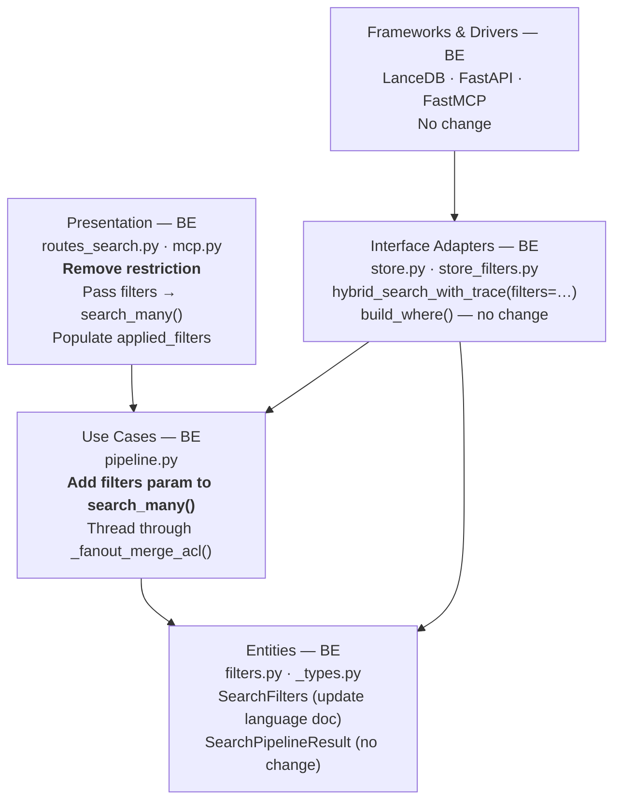
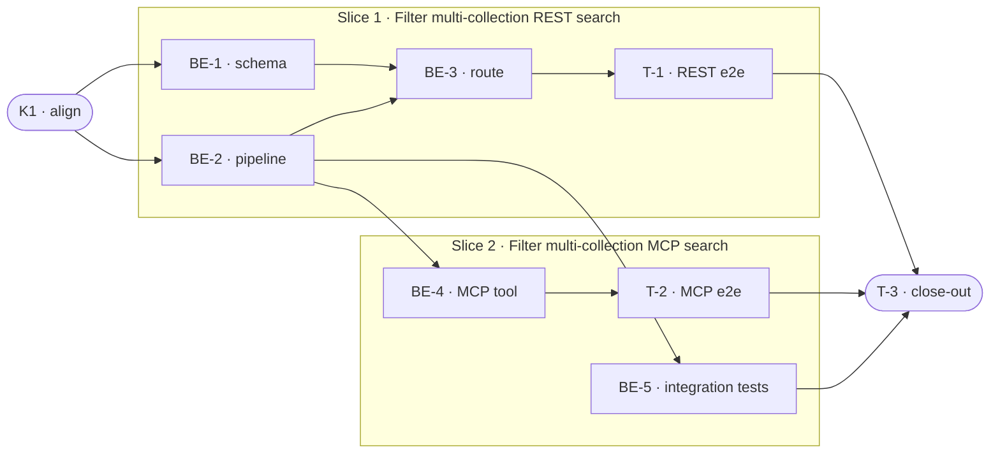

# E0e · Multi-Collection Filter Support — Team Plan

**How to read this file**
- **Architecture approach:** Clean Architecture (default). **Layers:** Presentation · Use Cases · Interface Adapters · Entities · Frameworks & Drivers. Each task's first sub-bullet names the layer it touches.
- The **Frontend, Backend, and Tester** sections are the **depth view** — each role's work, grouped by layer.
- The **Task Breakdown** is the **order view** — every task is a single-role checkbox in execution order, opening with a dependency graph.
- **Phases are vertical slices**: each delivers a working end-to-end increment. Sliced with the **`vertical-slicer` skill**.
- Each task carries the **role tag at the end of its title line**, then sub-bullets: **layer · estimate**, **needs · completes**, and a **Tests** block. **Unit and integration tests belong to the implementing dev** (test-first); **e2e tests are the tester's tasks**.
- **Contracts:** TypeSpec available (v1.13.0). HTTP/API seams authored as TypeSpec HTTP services under `api-contracts/` with emitted `openapi.yaml`; internal logical seams as core-construct `.tsp` beside the plan. Built-in fallback not used.
- IDs (`S#`, `C#`, `BE-#`/`T-#`/`K#`, `Q#`) are the traceability thread.

---

## Background

`POST /search` and the MCP `search` tool reject any request combining a `collections` list with a `filters` object — returning a 422 validation error ("filters are not supported for multi-collection search in v1"). The filter infrastructure in `store.hybrid_search()` already applies per-collection SQL predicates; the restriction exists only at the Presentation layer. Users who want to scope multi-collection results by file type, language, or source path are completely blocked.

---

## Goal

Filters compose with multi-collection search across every surface — REST `POST /search` and MCP `search` tool. A request with `collections: ["docs", "code"]` and `filters: {file_type: ".md"}` applies the filter to each collection leg independently and returns merged, reranked results scoped to the filter. The response echoes the applied filters in `applied_filters`.

---

## Scope

### In Scope
- Remove the v1 restriction in `SearchRequest._validate_collection_selection()` (`routes_search.py:84–85`).
- Add `filters: SearchFilters | None` parameter to `SearchPipeline.search_many()` and thread it through `_fanout_merge_acl()` → per-leg `store.hybrid_search_with_trace()` calls.
- Add `applied_filters: SearchFilters | None` field to `SearchResponse` (echoes the request `filters`; null when none provided).
- Remove the language-filter restriction from the MCP `search` tool (`mcp.py:291–295`); build a `SearchFilters` object for the multi-collection MCP path and pass it to `search_many()`.
- Update `SearchFilters.language` field description in `filters.py` (removes "single-collection queries only" caveat).
- Add integration tests (`tests/integration/`) exercising filter + multi-collection search with a real pipeline (eval harness extension is deferred).
- Update `Documentation/Architecture/600_api_reference_or_public_interface.md` and `Documentation/UserManual/05_searching.md` to remove the restriction note and document `applied_filters`.
- Add a note to `BREAKING.md` (relaxation — not a breaking change, but a behaviour change).

### Out of Scope
- Per-collection filter overrides (different filter per leg) — single shared `filters` object only.
- Filter support for `POST /explain` (REST) or the MCP `explain` tool — `ExplainRequest` has no filter fields; this is a separate feature.
- New filter types (date range UI, metadata key/value) — existing filter types only.
- Filter validation warnings per-collection.
- The MCP `explain` tool's reranking constraint (`mcp.py:711–715`) — a separate, unrelated restriction.
- The MCP `search_with_context` tool — single-collection only by design, no `collections` parameter.

---

## Acceptance criteria
- `POST /search` with `collections` + `filters` returns 200 with results filtered per-leg; previously returned 422.
- `SearchResponse.applied_filters` echoes the parsed, normalised `SearchFilters` object (e.g. `.md` → `md`); null when no filters were submitted.
- MCP `search` tool accepts `collections` + `language` filter without returning `validation_error`.
- MCP `search` tool with `collections` + any filter passes filters through to `search_many()`.
- Single-collection search with filters is unaffected (no regression).
- Multi-collection search without filters is unaffected (no regression).
- At least two integration tests cover filter + multi-collection retrieval with a real pipeline.
- All existing tests pass.

---

## What does NOT change
- `store.hybrid_search()` and `store.hybrid_search_with_trace()` — already accept `filters`; no store-layer changes.
- `store_filters.py` / `build_where()` — SQL predicate builder is unchanged.
- `acl.py` / ACL filter logic — applied once on the merged set after fan-out, unchanged.
- `fanout_leg_trim` behaviour — trim is applied per-leg after filtering, unchanged.
- `excluded_collections` semantics — only populated for embedding-model mismatches, never for empty-result legs.
- `POST /explain` REST endpoint — no filter support added in E0e.
- MCP `explain` tool — reranking constraint at `mcp.py:711–715` is unrelated to filters and unchanged.

---

## Known limitations / accepted trade-offs
- `source_path_glob` multi-collection glob post-filter is implemented per-leg in `_fanout_merge_acl()` — consistent with single-collection behaviour. The same per-leg glob post-filter is applied in the RAG Fusion multi-collection merge step.
- The `GLOB_OVERFETCH_FACTOR` adjustment for `source_path_glob` is applied in `search_many()` before the fanout, not inside `_fanout_merge_acl()`. This mirrors the approach in `_compute_fetch()` (used by single-collection path) applied at the right abstraction level.
- A strict filter on a collection with no matching documents returns zero results from that leg. This is correct and silent — empty-result legs are not listed in `excluded_collections`.
- The `language` filter uses exact SQL match per-leg; collections without language-tagged documents silently return no results (consistent with single-collection behaviour; existing `GET /status` collection warnings are the signal).
- `applied_filters` uses `SearchFilters` directly (the entity model) — no separate `SearchFiltersSchema` is needed; FastAPI serialises Pydantic models in response fields.
- `applied_filters` is constructed in the Presentation layer (`routes_search.py`) from the incoming request `filters`, not from `SearchPipelineResult`. This keeps `SearchPipelineResult` focused on retrieval results and ensures single-collection and multi-collection handlers echo filters symmetrically — Option B, chosen over adding `applied_filters` to the use-case return type.
- MCP `search` tool responses do not include `applied_filters` in E0e. The REST `POST /search` response has `applied_filters`; MCP response echoing is deferred.
- `include_metadata` flag on `SearchFilters` is NOT enforced in the REST multi-collection path (the single-collection path strips metadata at lines ~275-279 of `routes_search.py`). Multi-collection search always returns metadata fields regardless of `include_metadata`. This pre-existing limitation becomes reachable in E0e; a fix is deferred.
- `include_metadata` (a metadata-projection flag on `SearchFilters`) will appear in the serialized `applied_filters` response field since `SearchFilters` is used directly. This is accepted as a v1 trade-off — clients should treat `include_metadata` in `applied_filters` as informational.

---

## Approach & architecture

Remove a two-line Presentation-layer restriction, add one parameter at the Use Cases seam, and thread it through to the already-capable Interface Adapters layer. The Store layer requires no changes.

**Layer map (and role mapping)**

| Layer | Role | Components touched |
|-------|------|-------------------|
| Presentation | Backend | `routes_search.py` — `SearchRequest`, `SearchResponse`, `search()` handler; `mcp.py` — `search()` MCP tool |
| Use Cases | Backend | `pipeline.py` — `SearchPipeline.search_many()`, `_fanout_merge_acl()` |
| Interface Adapters | Backend | `store.py` — `hybrid_search_with_trace()` (already accepts `filters`, no change); `store_filters.py` — `build_where()` (no change) |
| Entities | Backend | `filters.py` — `SearchFilters` (language field description); `_types.py` or `pipeline.py` — `SearchPipelineResult` (no change — `applied_filters` lives in Presentation layer) |
| Frameworks & Drivers | Backend | LanceDB, FastAPI, FastMCP — no change |
| — | **Frontend** | **N/A** — pure Python backend, no browser UI |

**What changes**
- `routes_search.py:84–85` — delete the `if self.filters is not None: raise ValueError(...)` block.
- `routes_search.py` `SearchResponse` — add `applied_filters: SearchFilters | None = None`.
- `routes_search.py` `search()` handler (multi-collection path) — pass `body.filters` to `pipeline.search_many()`; set `applied_filters=body.filters` directly on the response (Presentation layer owns this — `SearchPipelineResult` does NOT carry `applied_filters`).
- `routes_search.py` `search()` handler (single-collection path, line ~300) — also set `applied_filters=body.filters` on the `SearchResponse`. This ensures both single-collection and multi-collection handlers echo applied filters symmetrically.
- `pipeline.py` `search_many()` — add `filters: SearchFilters | None = None` parameter; thread through ALL call sites: `_fanout_merge_acl()` (standard path), `_fanout_merge_acl()` (RAG Fusion embedding-failure fallback), RAG Fusion per-collection `hybrid_search_with_trace()` loop, and RAG Fusion FTS-only fallback.
- `pipeline.py` `_fanout_merge_acl()` — apply `fnmatch` glob post-filter per-leg after each `hybrid_search_with_trace()` call when `filters and filters.source_path_glob` is set (guard ensures `explain()` callers with `filters=None` are unaffected). `candidate_depth` adjustment (GLOB_OVERFETCH_FACTOR) is applied in `search_many()` before the fanout, not inside `_fanout_merge_acl()`.
- `pipeline.py` RAG Fusion multi-collection merge step — apply `fnmatch` glob post-filter after the per-collection merge (after line ~1253).
- `filters.py` `SearchFilters.language` — remove "single-collection queries only" from field description.
- `mcp.py` — remove `if language is not None: return McpErrorResponse(...)` block (lines 291–295); build `SearchFilters` for multi-collection; pass to `search_many()`. Note: `applied_filters` is NOT added to MCP responses in E0e — MCP parity for response echoing is deferred.

**Key decisions (from the brief)**
- Shared filter object across all legs: one `filters` object applied identically to every leg.
- `applied_filters` echoes the parsed, normalised `SearchFilters` object (e.g. `.md` → `md`); null when no filters were submitted.
- `applied_filters` is constructed in the Presentation layer (Option B): `routes_search.py` and `mcp.py` set `applied_filters=body.filters` directly from the incoming request — `SearchPipelineResult` does not carry this field. This eliminates the single-collection asymmetry and removes the need to update every `search_many()` return site.
- Store layer is already capable — no `store.py` or `store_filters.py` changes.
- MCP and REST fixed simultaneously (MCP language restriction is a parity bug, and ALL 6 filter types were silently dropped in the MCP multi-collection path, not just language).
- `SearchFilters` (entity) used directly as `SearchResponse.applied_filters` type — no wrapper schema needed.

---

## Contracts / seams

Boundaries where roles must agree. Logical, not code. Changing one requires team agreement.
TypeSpec v1.13.0 used. HTTP/API seams emit `openapi.yaml`; internal logical seam validated with `--no-emit`.

**C1 — POST /search response: applied_filters added** *(Presentation ↔ API clients)*
`SearchResponse` gains `applied_filters: SearchFilters | null`. `SearchRequest` validation no longer rejects `filters` + `collections` together. Clients must handle the new nullable field. See [`api-contracts/e0e-search-applied-filters.tsp`](api-contracts/e0e-search-applied-filters.tsp) + [`api-contracts/e0e-search-applied-filters.openapi.yaml`](api-contracts/e0e-search-applied-filters.openapi.yaml).
- Realised by: BE-1, BE-3 · Verified by: BE-3 (unit + integration), T-1 (e2e)

**C2 — search_many() use case interface: filters parameter** *(Presentation → Use Cases)*
`SearchPipeline.search_many()` gains `filters: SearchFilters | None = None`. `SearchPipelineResult` does NOT gain `applied_filters` (Option B: the Presentation layer constructs `applied_filters` directly from the incoming request). Every caller must pass the filters it holds (or omit for null). See [`e0e-search-many-filters.tsp`](e0e-search-many-filters.tsp) (compiled clean, `--no-emit`). The TypeSpec seam file is updated to reflect Option B — `SearchPipelineResult` does not carry `applied_filters`.
- Realised by: BE-2 · Verified by: BE-2 (unit + integration), BE-3 (integration)

**C3 — MCP search tool: language filter permitted in multi-collection** *(MCP Presentation ↔ MCP clients)*
The MCP `search` tool no longer returns `{code: "validation_error"}` when `language` is set and `collections` is provided. All filter params (`file_type`, `source_path_prefix`, `source_path_glob`, `indexed_after`, `indexed_before`, `language`) are forwarded to `search_many()` in multi-collection mode. No TypeSpec file: MCP tool schemas are authored in `mcp.py` directly; this seam is captured by the MCP smoke tests.
- Realised by: BE-4 · Verified by: BE-4 (unit), T-2 (e2e)

---

## Scenarios #tester-role

Behavioural only. Happy, unhappy, edge, and non-functional paths.

| id | Scenario (Given / When / Then) |
|----|-------------------------------|
| **S1** | **Given** two collections each containing `.md` and `.pdf` files · **When** `POST /search` with `collections: ["docs", "code"]` and `filters: {file_type: ".md"}` · **Then** 200, results contain only `.md` files from both legs, `applied_filters.file_type = "md"` (normalised), `excluded_collections: []` |
| **S2** | **Given** collections with docs at `/docs/en/` and `/docs/fr/` · **When** `POST /search` with `collections: ["a", "b"]`, `filters: {source_path_prefix: "/docs/en/", language: "en"}` · **Then** 200, results from `/docs/en/` language-tagged `en` only, `applied_filters` echoes both filter fields |
| **S3** | **Given** multi-collection request with no `filters` field · **When** `POST /search` with `collections: ["a", "b"]`, no `filters` · **Then** 200, `applied_filters: null`, merged results unchanged from current behaviour |
| **S4** | **Given** collection A has `.md` files, B has only `.pdf` files · **When** `POST /search` with `collections: ["A", "B"]`, `filters: {file_type: ".md"}` · **Then** 200, results only from A, B contributes nothing, `excluded_collections: []` (zero-result legs are not listed) |
| **S5** | **Given** neither collection contains `.md` files · **When** `POST /search` with `collections: ["A", "B"]`, `filters: {file_type: ".md"}` · **Then** 200, `results: []`, `applied_filters: {file_type: "md"}` non-null |
| **S6** | **Given** collections with files at varying paths · **When** `POST /search` with `collections: ["A", "B"]`, `filters: {source_path_glob: "*/docs/*.md"}` · **Then** 200, results match glob per-leg (Python post-filter after per-leg RRF), `applied_filters.source_path_glob` echoed |
| **S7** | **Given** a search request with an invalid filter value (e.g. `file_type: ""`) · **When** `POST /search` with `collections` + `filters: {file_type: ""}` · **Then** 422 (Pydantic validation on the filter model itself — unchanged behaviour) |
| **S8** | **Given** MCP `search` tool with `collections: ["a", "b"]` and `language: "fr"` (previously returned validation_error) · **When** MCP client calls `search` · **Then** result is non-error, results are filtered to `language = "fr"` per leg |
| **S9** | **Given** MCP `search` tool with `collections: ["a", "b"]` and `file_type: ".py"` · **When** MCP client calls `search` · **Then** result is non-error, results contain only `.py` files, tool response is schema-valid |
| **S10** | **Given** single-collection search with filters (existing behaviour) · **When** `POST /search` with `collection: "docs"`, `filters: {language: "en"}` · **Then** 200, results same as before E0e (no regression) |
| **S11** | **Given** multi-collection search without filters (existing behaviour) · **When** `POST /search` with `collections: ["a", "b"]`, no `filters` · **Then** 200, results same as before E0e, `applied_filters: null` (no regression) |
| **S12** | **Given** two collections, `rag_fusion: true`, and a `file_type` filter · **When** `POST /search` with `collections: ["a", "b"]`, `rag_fusion: true`, `filters: {file_type: ".py"}` · **Then** 200, only `.py` results from both legs after RAG Fusion; filter applied per-leg across all 4 RAG Fusion call sites (standard path, embedding-failure fallback, per-collection loop, FTS-only fallback) |

---

## Frontend #frontend-role

**N/A** — archon-search is a pure Python backend server (FastAPI REST + FastMCP). No browser UI exists. No frontend work for this feature.

---

## Backend — Entities · Use Cases · Adapters · Frameworks #backend-role

**Scope:** All implementation changes are backend. The backend dev writes unit and integration tests test-first for every implementation task.
**Owns layers:** Entities, Use Cases, Interface Adapters, Frameworks & Drivers (and the Presentation layer in this backend-only project).

**Tasks by layer** *(checkable in the Task Breakdown)*
- Entities: BE-1 — Add `applied_filters` to `SearchResponse` (Presentation schema only); update `SearchFilters.language` doc (no change to `SearchPipelineResult` — Option B)
- Use Cases: BE-2 — Add `filters` param to `search_many()` and thread through fanout
- Presentation (REST): BE-3 — Remove restriction, wire route handler
- Presentation (MCP): BE-4 — Remove MCP language restriction, pass filters to `search_many()`
- Frameworks & Drivers: BE-5 — Add integration tests for filter + multi-collection with real pipeline

**Done when**
- [ ] `POST /search` with `collections` + `filters` returns 200 — S1, S2, S4, S5, S6
- [ ] `applied_filters` is null when no filters submitted — S3, S11
- [ ] MCP `search` with `collections` + `language` succeeds — S8
- [ ] MCP `search` with `collections` + `file_type` succeeds — S9
- [ ] Single-collection + filter requests unchanged — S10
- [ ] Multi-collection no-filter requests unchanged — S11
- [ ] Integration tests for filter + multi-collection added and suite passes

---

## Tester #tester-role

**Scope:** The tester owns **e2e** integration tests (FastAPI `TestClient` + real `SearchStore`) and the project **close-out**. Unit and integration tests are backend-dev-written.

**Tasks** *(checkable in the Task Breakdown)*
- T-1 — REST filter+multi-collection e2e integration test (Slice 1)
- T-2 — MCP filter+multi-collection e2e integration test (Slice 2)
- T-3 — Project close-out & acceptance fact-check

**Allocation** — cheapest level that proves each scenario

| Scenario | Cheapest level | Notes |
|----------|---------------|-------|
| S1 | integration (e2e) | real store + TestClient; tester-owned |
| S2 | integration (e2e) | real store + TestClient; tester-owned |
| S3 | integration (e2e) | regression guard; tester-owned |
| S4 | integration (e2e) | zero-result leg behaviour; tester-owned |
| S5 | integration (e2e) | all-empty result; tester-owned |
| S6 | integration (e2e) | glob post-filter per-leg; tester-owned |
| S7 | unit | Pydantic validation — dev-written in BE-3 |
| S8 | integration (e2e) | MCP JSON-RPC transport; tester-owned |
| S9 | integration (e2e) | MCP JSON-RPC transport; tester-owned |
| S10 | integration (e2e) | regression; tester-owned in T-1 |
| S11 | integration (e2e) | regression; tester-owned in T-1 |
| S12 | unit + integration | RAG Fusion + filters path — dev-written in BE-2 (unit mocks) + BE-5 (real pipeline) |

---

## Documentation update

Docs the feature touches — the close-out task works through this list.

- [ ] `Documentation/Backlog/e0e-multi-collection-filters-brief.md` — no changes needed (source brief)
- [ ] `Documentation/Backlog/e0e-multi-collection-filters-team-plan.md` — this file; mark `status: done` on close-out
- [ ] `Documentation/Architecture/600_api_reference_or_public_interface.md` — remove line 145 restriction row; update `SearchResponse` to list `applied_filters`; update MCP `search` tool row (remove "single-collection only" from `language`); update filters table (line 172, `language` row)
- [ ] `Documentation/UserManual/05_searching.md` — update filter docs to remove multi-collection restriction note; document `applied_filters` in response
- [ ] `archon_search/filters.py` — `SearchFilters.language` field `description=` string: remove "single-collection queries only" caveat
- [ ] `BREAKING.md` — add E0e note: lifting the v1 filter+collections restriction is a relaxation (previously-rejected requests now succeed); note `applied_filters` additive field in `SearchResponse`
- [ ] `CLAUDE.md` (project) — no changes needed (no new conventions)
- [ ] Regenerate OpenAPI snapshot: `uv run python -m archon_search.server.snapshot` (or equivalent) — `GET /openapi.json` schema must reflect `applied_filters` in `SearchResponse`
- [ ] `Documentation/UserManual/05_searching.md` — document `include_metadata` appearing in `applied_filters` response field (informational; v1 trade-off)

---

## Open questions

| id | Area | Question |
|----|------|---------|
| **Q1** | Implementation | `SearchFiltersSchema` vs `SearchFilters` direct: can `SearchResponse.applied_filters: SearchFilters \| None` reference the entity directly without a wrapper schema? The brief uses the term `SearchFiltersSchema` but the entity is already Pydantic. Verify during BE-1. |

**Resolved in this revision:**
- *Brief line numbers for MCP restrictions (`mcp.py:302–304`, `664–666`) are stale.* Actual locations: language restriction `291–295`; explain reranking constraint `711–715`. The explain tool restriction is about reranking, not filters — it is **out of scope** for E0e. `search_with_context` has no multi-collection path and requires no change.
- *Brief says the error is HTTP 400.* Investigation confirms it is HTTP 422 (Pydantic `model_validator` raises `ValueError`, FastAPI converts to 422). Acceptance criteria updated to reflect this.
- *Brief says `search_with_context` has the same restriction.* Investigation confirms it is single-collection only and has no `collections` parameter. No change needed.

---

## Task Breakdown

Single-role tasks in execution order, grouped into vertical slices.

### Dependency graph

---

### Phase 0 · Kickoff *(prerequisite)*

- [x] **K1** — Agree the Contracts and Scenarios with the team #team
    - — · 0.5h
    - completes C1, C2, C3
    - Tests

---

### Phase 1 · Filter multi-collection REST search *(walking skeleton: thinnest end-to-end path)*

- [x] **BE-1** — Add `applied_filters` to `SearchResponse` (Presentation schema only); update `SearchFilters.language` doc #backend-role
    - Entities · 1.0h
    - needs K1 · completes C1
    - Note: `SearchPipelineResult` does NOT get `applied_filters` — the Presentation layer constructs it from the incoming request (Option B, see "Known limitations").
    - Tests
        - #unit_test — `test_search_response_applied_filters_null_by_default` — `SearchResponse` with no `applied_filters` serialises as null
        - #unit_test — `test_search_response_applied_filters_echoes_filters` — `SearchResponse` with `applied_filters=SearchFilters(file_type="md")` round-trips cleanly

- [x] **BE-2** — Add `filters` param to `search_many()` and thread through ALL call sites; add glob post-filter per-leg #backend-role
    - Use Cases · 3.0h
    - needs K1 · completes C2
    - **All 4 `hybrid_search_with_trace()` call sites in `search_many()` must receive `filters=`:**
        1. `_fanout_merge_acl()` call — standard path (line ~1289)
        2. `_fanout_merge_acl()` call — RAG Fusion embedding-failure fallback (line ~1183)
        3. `hybrid_search_with_trace()` calls in RAG Fusion per-collection loop (lines ~1218-1220)
        4. `hybrid_search_with_trace()` in RAG Fusion FTS-only fallback (lines ~1237-1239)
    - **`source_path_glob` post-filter (Python fnmatch, NOT SQL) must be applied explicitly (guarded by `if filters and filters.source_path_glob:`):**
        - Per-leg in `_fanout_merge_acl()` after each `hybrid_search_with_trace()` call
        - In the RAG Fusion multi-collection merge step (after line ~1253)
    - **`GLOB_OVERFETCH_FACTOR` headroom design:** `search_many()` computes `candidate_depth` for fanout calls. When `filters.source_path_glob` is set, multiply `candidate_depth` by `GLOB_OVERFETCH_FACTOR` (from `store_filters.py`) BEFORE passing it to `_fanout_merge_acl()` AND before the RAG Fusion per-collection loop. `_fanout_merge_acl()` itself does NOT compute the adjustment — it uses the value it receives. This ensures both the standard path and all RAG Fusion paths use the correct headroom.
    - **`explain()` compatibility:** `_fanout_merge_acl()` is also called by `explain()` with the default `filters=None`. The glob post-filter inside `_fanout_merge_acl()` MUST be guarded by `if filters and filters.source_path_glob:` (not just `if source_path_glob:`) to ensure `explain()` behaviour is unchanged.
    - Note: `SearchPipelineResult` does NOT get `applied_filters` — no return-site changes needed (Presentation layer owns `applied_filters`, see Option B in "Known limitations").
    - Tests
        - #unit_test — `test_search_many_passes_filters_to_each_leg` — mock store confirms `hybrid_search_with_trace` called with `filters=` on each leg
        - #unit_test — `test_search_many_no_filters_passes_none` — when `filters=None`, store called with `filters=None`
        - #unit_test — `test_search_many_rag_fusion_passes_filters_to_each_leg` — mock store, `rag_fusion=True` + `filters` set; mock collections as having vector indices; confirms call sites 2, 3 receive `filters=`
        - #unit_test — `test_search_many_rag_fusion_fts_only_collection_receives_filters` — mock one collection with `has_vector_index=False` (triggers FTS-only fallback, call site 4); assert `hybrid_search_with_trace` FTS-only call receives `filters=`
        - #unit_test — `test_explain_multi_collection_unaffected_by_filters_param` — call `explain()` multi-collection after `_fanout_merge_acl` gains `filters` parameter; assert no AttributeError and results are returned (regression guard for the `if filters and filters.source_path_glob:` guard)
        - #unit_test — `test_search_many_glob_post_filter_removes_non_matching_per_leg` — mock store returns candidates with mixed `source_path` values (some matching `*.md`, some not); pass `filters=SearchFilters(source_path_glob="*.md")`; assert only `.md` paths survive in results (standard path)
        - #unit_test — `test_search_many_rag_fusion_glob_post_filter_applied_after_fusion` — mock store, RAG Fusion enabled, candidates include non-matching paths; assert non-matching paths are absent from final results after the RAG Fusion multi-collection merge step
        - #unit_test — `test_search_many_glob_candidate_depth_uses_overfetch_factor` — when `filters.source_path_glob` is set, assert that `hybrid_search_with_trace` is called with `candidate_depth >= top_k * GLOB_OVERFETCH_FACTOR`; this ensures headroom is applied before both the standard fanout path and RAG Fusion per-collection loop
        - #integration_test — `test_search_many_file_type_filter_applied_per_leg` — real pipeline + real store: two collections, only one has matching file type; results from correct leg only

- [x] **BE-3** — Remove `SearchRequest` v1 restriction; wire `filters` + `applied_filters` through the `POST /search` handler #backend-role
    - Presentation · 1.0h
    - needs BE-1, BE-2 · completes S1, S3, S4, S5, S7, S10, S11 · enables S2, S6 (verified by T-1)
    - Note: `applied_filters=body.filters` is set directly in the handler (Presentation layer), NOT from `result.applied_filters`.
    - Tests
        - #unit_test — `test_search_request_collections_with_filters_now_valid` — `SearchRequest(collections=["a"], filters=SearchFilters(file_type="md"))` no longer raises
        - #unit_test — `test_search_request_invalid_filter_still_422` — empty `file_type` still raises (S7)
        - #integration_test — `test_post_search_multi_collection_with_file_type_filter` — TestClient: two collections, `filters={file_type: '.md'}` (with dot), 200, results filtered, `applied_filters.file_type == 'md'` (normalised, dot stripped)
        - #integration_test — `test_post_search_multi_collection_no_filters_applied_filters_null` — `applied_filters: null` when no filters sent (S3, S11)
        - #integration_test — `test_post_search_multi_collection_all_empty_after_filter` — all legs return nothing, 200 `results: []`, `applied_filters` non-null (S5)
        - #integration_test — `test_post_search_applied_filters_datetime_serialization` — send `filters: {indexed_after: "2024-01-15"}`, assert the exact JSON shape of `applied_filters.indexed_after` in the response body
        - #unit_test — `test_post_search_single_collection_with_filter_applied_filters_echoed` — single-collection search with `filters={language: "en"}` returns `applied_filters.language = "en"` in response (not null)

- [x] **T-1** — Integration e2e: REST filter + multi-collection search via TestClient #tester-role
    - — · 2.0h
    - needs BE-3 · completes S1, S2, S4, S5, S6, S10, S11
    - Tests
        - #e2e_test — `test_e2e_filter_multi_collection_file_type` — real app + ingest to two collections; `file_type` filter returns results from matching leg only (S1, S4)
        - #e2e_test — `test_e2e_filter_multi_collection_language_prefix_combined` — `language + source_path_prefix` applied per-leg; `applied_filters` echoes both (S2)
        - #e2e_test — `test_e2e_filter_multi_collection_all_empty` — filter produces no matches; `results: []`, `applied_filters` set (S5)
        - #e2e_test — `test_e2e_filter_multi_collection_glob` — `source_path_glob` applied per-leg (S6)
        - #e2e_test — `test_e2e_single_collection_filter_regression` — single-collection + filter unchanged (S10)
        - #e2e_test — `test_e2e_multi_collection_no_filter_regression` — multi-collection without filter unchanged, `applied_filters: null` (S11)
        - #e2e_test — `test_e2e_filter_multi_collection_indexed_after` — ingest docs to two collections; use `datetime.now(UTC)` captured BETWEEN the two ingest calls as the `indexed_after` value (full datetime string, not date-only). Assert only docs from the second ingest appear. The implementation should monkeypatch or record real timestamps rather than relying on natural microsecond separation.
        - #e2e_test — `test_e2e_filter_multi_collection_indexed_before` — ingest docs to two collections; use `datetime.now(UTC)` captured BETWEEN the two ingest calls as the `indexed_before` value. Assert only docs from the first ingest appear.

---

### Phase 2 · Filter multi-collection MCP search

- [x] **BE-4** — Remove MCP language restriction; build `SearchFilters` for multi-collection path; pass to `search_many()` #backend-role
    - Presentation · 1.5h
    - needs BE-2 · completes S8, S9, C3
    - **Note: BE-4 fixes a broader silent data loss bug.** The current MCP multi-collection path (`mcp.py:316-322`) passes NO filter params to `search_many()` at all — `file_type`, `source_path_prefix`, `source_path_glob`, `indexed_after`, `indexed_before` are all silently dropped. The language restriction (lines 291-295) is an explicit block on top of this silent drop. This is a behaviour fix, not just a restriction removal. ALL 6 filter types must be forwarded.
    - **`SearchFilters` construction:** Build `SearchFilters(file_type=file_type, source_path_prefix=source_path_prefix, source_path_glob=source_path_glob, indexed_after=indexed_after, indexed_before=indexed_before, language=language)` from individual filter args (mirroring the existing single-collection path at `mcp.py:~378-386`). Pass this `SearchFilters` instance to `search_many(filters=...)`. If ALL filter args are `None`, pass `filters=None` (not `SearchFilters()` with all defaults) to ensure `applied_filters` is null when no filters were submitted.
    - Note: `applied_filters` is NOT added to MCP responses in E0e — MCP parity for response echoing is deferred. Coverage of all 6 filter params forwarding is addressed by `test_mcp_search_multi_collection_all_filter_params_forwarded` below.
    - Tests
        - #unit_test — `test_mcp_search_multi_collection_language_filter_no_longer_rejected` — MCP `search` tool with `collections` + `language` no longer returns `code="validation_error"`
        - #unit_test — `test_mcp_search_multi_collection_file_type_filter_passed_to_pipeline` — mock pipeline confirms `search_many()` called with `filters.file_type` set
        - #unit_test — `test_mcp_search_multi_collection_no_filters_passes_none` — with no filter args, `search_many()` called with `filters=None`
        - #unit_test — `test_mcp_search_multi_collection_all_filter_params_forwarded` — mock pipeline, all 6 filter params set in the tool call (`file_type`, `source_path_prefix`, `source_path_glob`, `indexed_after`, `indexed_before`, `language`), assert `search_many()` receives a `SearchFilters` with all 6 fields populated
        - #integration_test — `test_mcp_search_tool_multi_collection_with_language_filter` — MCP JSON-RPC via TestClient: `collections` + `language` returns valid non-error response

- [ ] **BE-5** — Add integration test exercising filter + multi-collection search with real pipeline #backend-role
    - Frameworks & Drivers · 1.5h
    - needs BE-2 · completes (integration coverage)
    - Note: Extending the eval harness (`EvalQuery`, `eval/runner.py`) to support `collections` and `filters` fields is a separate task, deferred beyond E0e. This task adds a direct integration test using the real pipeline instead.
    - Tests
        - #integration_test — `test_search_many_filter_multi_collection_real_pipeline` — runs `search_many()` with real LanceDB store, two collections, `file_type` filter; asserts results from matching leg only; placed in `tests/integration/`
        - #integration_test — `test_search_many_filter_glob_real_pipeline` — runs `search_many()` with real store, `source_path_glob` filter; asserts glob post-filter removes non-matching paths from results; placed in `tests/integration/`

- [ ] **T-2** — Integration e2e: MCP search tool with filters + collections via JSON-RPC TestClient #tester-role
    - — · 1.5h
    - needs BE-4 · completes S8, S9
    - Tests
        - #e2e_test — `test_e2e_mcp_search_multi_collection_language_filter` — MCP tool with `collections` + `language: "fr"` returns non-error, language-filtered results (S8)
        - #e2e_test — `test_e2e_mcp_search_multi_collection_file_type_filter` — MCP tool with `collections` + `file_type: ".py"` returns non-error, file-type-filtered results (S9)

---

### Phase 3 · Close-out

- [ ] **T-3** — Project close-out & acceptance fact-check #tester-role
    - — · 3.0h
    - needs T-1, T-2, BE-5
    - Tests
    - Duties
        - Update all documentation per the "Documentation update" section — `600_api_reference_or_public_interface.md`, `05_searching.md`, `filters.py` language field description, `BREAKING.md`, this plan.
        - Fix all build / compiler warnings, if any.
        - Run the full test suite (`uv run pytest`); fix every failing test, including any unrelated to this feature.
        - Validate every Acceptance criterion one-by-one with a fact check — no assumptions; confirm each is genuinely done.

**Critical path:** K1 → BE-2 → BE-3 → T-1 → T-3.
