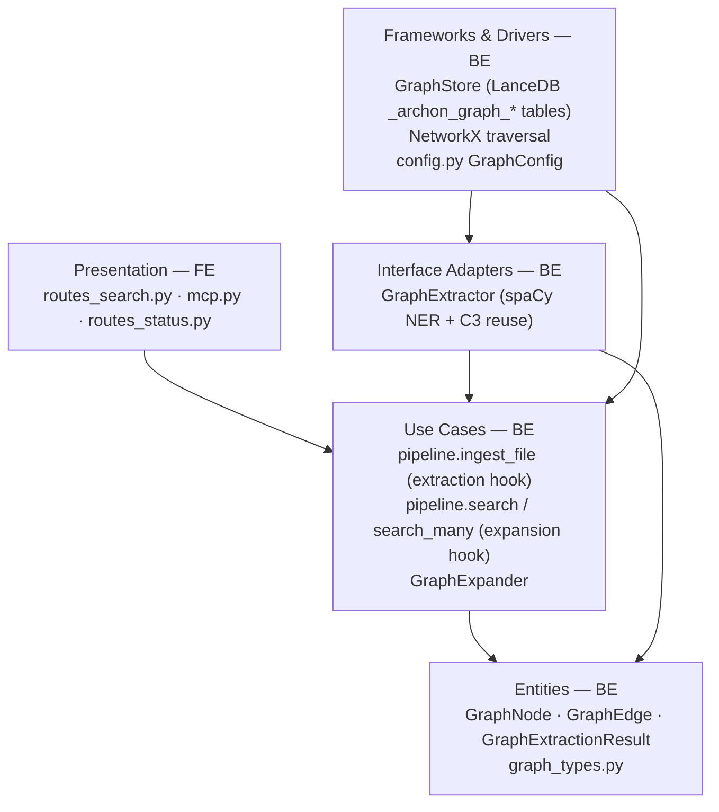
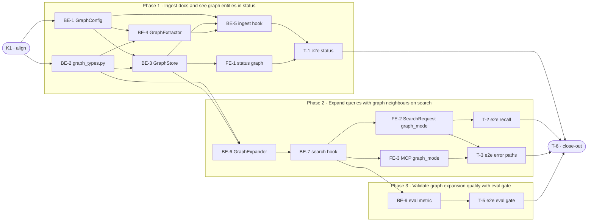

# E1a · GraphRAG Entity Extraction + Naive Query Expansion — Team Plan

**How to read this file**
- **Architecture approach:** Clean Architecture (default). **Layers:** Presentation · Use Cases · Interface Adapters · Entities · Frameworks & Drivers. Each task's first sub-bullet names the layer it touches.
- This is a server-only Python project. **Presentation = REST routes + MCP tools + CLI commands** (the "Frontend" role). Use Cases, Interface Adapters, Entities, Frameworks & Drivers = Backend role. There is no browser UI.
- The **Frontend, Backend, and Tester** sections are the **depth view** — each role's work, grouped by layer.
- The **Task Breakdown** is the **order view** — single-role checkboxes in execution order.
- **Phases are vertical slices** (each ships a demoable user-observable behavior end-to-end, not a layer). Sliced with the **`vertical-slicer` skill**.
- Each task: role tag at end of title, then **layer · estimate**, **needs · completes**, **Tests** block. **Unit + integration tests belong to the implementing dev**; **e2e + manual belong to the tester**.
- **Contracts:** TypeSpec is available (v1.13.0). All six contracts compiled clean with `tsp compile <file> --no-emit`. OpenAPI emission was skipped (npm install of `@typespec/openapi3` was blocked by the environment); the live `GET /openapi.json` remains the canonical HTTP contract.
- IDs (`S#`, `C#`, `BE-#`/`FE-#`/`T-#`/`K#`, `Q#`) are the traceability thread.
- **Rule:** edit your own tasks freely; change a contract only by team agreement.

---

## Background

archon-search currently ranks results purely on lexical and semantic similarity to the raw query string. When users search relationship-dense corpora (codebases, API documentation, research papers), entities mentioned in the query that have known relationships to other entities are never surfaced — a query for "AuthService" will never pull chunks about `TokenValidator` even if the codebase shows they depend on each other.

---

## Goal

After enabling `[graph] enabled = true` and re-ingesting, every document's chunks are entity-extracted into per-collection `_archon_graph_{col}_nodes` / `_archon_graph_{col}_edges` LanceDB tables. Adding `graph_mode=naive` to a `POST /search` or MCP `search` call expands the query with first-degree graph-neighbour entity names before the normal hybrid search pipeline runs, measurably increasing recall on relationship-aware queries. The eval gate `graph_mrr >= baseline_mrr` passes.

---

## Scope

### In Scope
- `[graph]` TOML section: `enabled`, `extraction_model` (optional LLM model string), `backend_threshold_edges` (int, default 10 000)
- `archon-search[graph]` optional extra: spaCy + NetworkX (Kuzu deferred to E1b)
- spaCy `en_core_web_sm` installed as pip extras dependency; if missing at runtime, auto-downloaded with INFO log (same user-visible transparency as fastembed)
- Per-collection `_archon_graph_{col}_nodes` / `_archon_graph_{col}_edges` LanceDB tables (under `_ARCHON_PREFIX`, invisible to `list_collections`)
- Stable entity IDs: SHA-256 hex of `f"{entity_type}:{entity_name.strip().lower()}"` (byte-encoded; type-prefix prevents collisions between entities with the same name but different types, e.g. "Mercury" as concept vs. person)
- Entity types: `person`, `concept`, `system`, `event`, `code_symbol` (spaCy NER label mapping + C3 enrichment reuse for code chunks)
- LLM typed relationship extraction: config-guarded stub in E1a (parses `extraction_model`, logs WARNING, proceeds spaCy-only; full LLM extraction deferred until eval baseline exists)
- `graph_mode=naive` parameter on `POST /search` and MCP `search` tool
- `SearchResponse.graph_expansion_applied: bool` transparency field
- NetworkX for in-memory traversal; WARNING log + `IngestResult.warnings` hint when edges ≥ `backend_threshold_edges`; Kuzu backend deferred to E1b
- Eval gate: `graph_mrr` added as optional metric in `EvalMetrics`; report-only initially
- `GET /status` exposes `graph: { enabled, backend_threshold_edges, collections: [{collection, node_count, edge_count}] } | null`

### Out of Scope
- Leiden community detection and `graph_mode=local` / `graph_mode=global` → E1b
- Graph-path provenance in `/explain` → E1c
- `graph_mode` parameter on `POST /explain` and MCP `explain` / MCP `search_with_context` → E1c. In E1a, passing `graph_mode` on `/explain` returns HTTP 422 (guarded in handler body).
- Auto-migration to Kuzu (no auto-migration in E1a)
- `archon-search graph drop <collection>` (tables preserved when graph disabled; cleanup deferred)
- Graph visualisation or admin UI → E8
- Full LLM typed relationship extraction (stubbed in E1a; deferred until eval baseline set)
- Kuzu backend for large-graph traversal → E1b (deferred; eval baseline will confirm scale need)
- `archon-search graph migrate <collection>` CLI command → E1b
- `STORE_SCHEMA_VERSION` bump (graph tables are auxiliary LanceDB tables outside `_schema()` / `_meta_schema()`)
- `archon-search graph` CLI group and all subcommands → deferred to E1b (no CLI group created in E1a)

---

## Acceptance criteria
- `[graph] enabled = true` + re-ingest → entities and edges written to graph tables; `GET /status` shows `node_count > 0`
- spaCy `en_core_web_sm` auto-downloaded on first ingest (logged at INFO); no silent download
- `POST /search` with `graph_mode=naive` → expanded query; `SearchResponse.graph_expansion_applied == true`
- `POST /search` with `graph_mode=naive` and `graph.enabled=false` → HTTP 422
- MCP `search` with `graph_mode=naive` → same expansion; standard result schema
- Edge count crossing `backend_threshold_edges` → WARNING log + hint in `IngestResult.warnings`; no auto-migration
- LLM extraction failure (when `extraction_model` set) → fallback to spaCy-only; job reaches DONE with warning; no job failure
- `archon-search[graph]` not installed + `graph.enabled=true` → `ConfigError` at startup with actionable install hint
- spaCy model absent on air-gapped install → `IngestResult.status=="error"` with actionable message
- `graph_mrr` metric wired in eval harness; test passes (report-only, not gated)
- Full test suite passes; coverage ≥ 85%; zero compiler warnings
- OpenAPI snapshot regenerated (Python 3.12)

---

## What does NOT change
- `SearchResult` schema (no new fields on results themselves in E1a)
- Existing hybrid search pipeline path when `graph_mode` is null/absent
- `STORE_SCHEMA_VERSION` (no bump; graph tables are per-collection auxiliaries)
- `_ARCHON_PREFIX` exclusion from `list_collections` (graph tables use the same prefix)
- ACL enforcement model (per-chunk post-retrieval; per-leg graph lookup is naturally scoped)
- Existing `IngestResult.warnings` accumulation pattern
- All 17 MCP tools except `search` (which gains one optional parameter)

---

## Known limitations / accepted trade-offs
- LLM typed relationship extraction is config-parseable but not implemented in E1a; setting `extraction_model` logs a warning and falls back to spaCy-only. Deferred until eval data exists to tune the prompt.
- Graph tables are accumulated on re-ingest (new nodes/edges upserted by stable ID); edges from deleted source documents are not pruned in E1a. See Q2.
- `graph_mrr` starts as report-only; promoting to a gated threshold requires calibration data from real corpora.
- NetworkX loads the full graph into memory per expansion call; Kuzu is the upgrade path for large collections (deferred to E1b).
- `GET /status` graph counts require a GraphStore read per collection per status call; no server-side caching in E1a. See Q7.
- Query-time entity matching uses exact (case-insensitive) string matching against node names, not NER. Entities that appear in the corpus but are not mentioned verbatim in the query will not trigger expansion.
- Expanding the query string for FTS (BM25) changes the term-frequency distribution of the query: appended neighbour entity names add new terms and shift BM25 scores for the original terms. This may demote exact-match results for the original query while surfacing related-entity chunks. This is an accepted trade-off for relationship-dense corpora; corpora where precision matters more than recall may prefer lower `top_k` with graph expansion disabled.
- `GraphNode.sourceDocId` is last-writer-wins: when the same entity (by stable ID) appears in multiple documents and is re-upserted, only the most recently ingested document's ID is stored. There is no multi-provenance tracking on nodes in E1a. `GraphEdge.sourceDocId` is likewise last-writer-wins. This is an accepted V1 trade-off; multi-provenance node tracking is a potential E1b enhancement.
- Namespace collision: graph table names are `_archon_graph_{collection}_nodes` — they do not include the namespace. Two collections with the same name in different namespaces share graph tables. **This creates a data-isolation boundary violation in multi-namespace deployments**: entities from one namespace will appear in graph expansion results for another. Operators running multi-namespace deployments must NOT enable `[graph] enabled = true` until E1b, which will add namespace-scoped table names. Single-namespace deployments are unaffected.
- In spaCy-only mode, edges are created by co-occurrence within a chunk (not by semantic relationship detection). For corpora where entities are mentioned across chunks but never in the same chunk, the graph will have nodes but no edges, making graph expansion a no-op. This is known and acceptable for E1a; the LLM extraction path will address it.

---

## Approach & architecture

New modules slot into existing Clean Architecture layers. `GraphExtractor` (Interface Adapters) wraps spaCy NER and the C3 code-symbol enrichment path. `GraphStore` (Frameworks & Drivers) wraps two new LanceDB tables per collection. `GraphExpander` (Use Cases) loads the graph and expands the query string. The pipeline (Use Cases) gains two new hooks: post-ingest extraction and pre-search expansion. The Presentation layer gains one new parameter (`graph_mode`) on two surfaces (REST + MCP) and one new CLI group.

> **Note — diagram direction:** Arrows show **data/call flow** (who calls whom), NOT dependency direction. In Clean Architecture dependency order, all arrows point inward: FW depends on UC/AD/EN; AD depends on UC/EN; UC depends on EN only. The call-flow direction is the inverse: P initiates calls to UC which calls AD; AD reads/writes via FW; FW provides data back to UC/AD. This diagram is the runtime call flow, not the compile-time dependency graph.

**Layer map (and role mapping)**

| Layer | Role | Components |
|-------|------|-----------|
| Presentation | **Frontend** | `routes_search.py` (`graph_mode` field), `mcp.py` (`search` tool `graph_mode`), `routes_status.py` (graph sub-object), `schemas.py` (`GraphStatusDetail`, `SearchResponse.graph_expansion_applied`) |
| Use Cases | Backend | `pipeline.ingest_file` (extraction hook), `pipeline.search` + `search_many` (expansion hook), new `GraphExpander` |
| Interface Adapters | Backend | New `GraphExtractor` (spaCy NER, C3 code-symbol path, LLM stub) |
| Entities | Backend | New `GraphNode`, `GraphEdge`, `GraphExtractionResult`, `ChunkInput` in `archon_search/graph_types.py` |
| Frameworks & Drivers | Backend | New `GraphStore` (LanceDB wrapper); `config.py` `GraphConfig` dataclass; NetworkX backend (Kuzu deferred to E1b) |

**What changes**
- `config.py`: new `GraphConfig` dataclass + `[graph]` `_apply_toml` block; `SearchConfig.graph` field. `tests/test_config_defaults.py` snapshot updated.
- `archon_search/graph_types.py`: new module for `GraphNode`, `GraphEdge`, `GraphExtractionResult`, `ChunkInput`.
- `archon_search/graph_extractor.py`: new `GraphExtractor` class.
- `archon_search/graph_store.py`: new `GraphStore` class; creates `_archon_graph_{col}_nodes` / `_archon_graph_{col}_edges` via `db.create_table(name, schema=..., exist_ok=True)` (same pattern as `store.py:ensure_collection`). SQL predicates via `_where_eq`/`_sql_quote_str` (never f-strings — `test_no_fstring_sql.py` guards this).
- `archon_search/graph_expander.py`: new `GraphExpander` class.
- `pipeline.py`: two new hooks; `SearchPipeline.__init__` gains `graph_extractor: GraphExtractor | None` and `graph_expander: GraphExpander | None` (optional, same pattern as `language_detector`).
- `server/routes_search.py`: `SearchRequest.graph_mode: Literal["naive"] | None`; `SearchResponse.graph_expansion_applied: bool`.
- `server/mcp.py`: `search` tool gains `graph_mode: str | None = None`.
- `server/schemas.py`: `GraphStatusDetail`, `GraphCollectionStats`; `StatusResponse.graph` field.
- `server/routes_status.py`: `_build_graph_status()` builder.
- `app.py`: constructs `GraphStore` + `GraphExtractor` + `GraphExpander` conditionally; `ConfigError` at startup if extras absent.
- `tests/conftest.py` or `tests/_search_stubs.py`: stub spaCy in `sys.modules`.
- `tests/eval/`: `EvalMetrics.graph_mrr`, `EvalQualityFloors.graph_mrr`, eval fixtures.

**Key decisions (from the brief)**
- Local NER default, LLM opt-in (config-guarded stub in E1a): preserves local-first posture.
- C3 enrichment reused for code chunks: `_symbol_type`/`_symbol_subtype` → `code_symbol` entity type; spaCy NER not run on C3-enriched code chunks (higher accuracy, no double-processing). Entity NAME for code_symbol entities comes from `_containing_function` (function-level chunks) or `_containing_class` (class-level chunks); fall back to `source_path` basename if both absent. `_symbol_subtype` maps to an optional `entity_subtype` field on `GraphNode`.
- spaCy label mapping (tight semantic): `PERSON→person`, `ORG/GPE/LOC/FAC/PRODUCT→system`, `EVENT→event`, `WORK_OF_ART/LAW/LANGUAGE/NORP→concept`; `DATE/TIME/MONEY/PERCENT/QUANTITY/ORDINAL/CARDINAL` skipped (noise).
- Stable entity ID formula: `hashlib.sha256(f"{entity_type}:{entity_name.strip().lower()}".encode()).hexdigest()`. A module-level `make_stable_entity_id(entity_type, entity_name) -> str` function in `graph_types.py` is the single source of truth — never inline the formula elsewhere.
- Warning + `backend_threshold_edges` config: no silent auto-migration. The `graph migrate` CLI command deferred to E1b.
- `graph_mode=naive` → HTTP 422 when graph is disabled (clear operational signal, not silent fallback).
- `graph_mode=naive` re-embeds the expanded query string (both FTS and vector expanded for maximum recall improvement).
- RAG Fusion / HyDE + `graph_mode=naive`: graph expansion applies to the ORIGINAL query only. RAG Fusion variants are searched with unexpanded text; HyDE vector generation uses the original (unexpanded) query. No 422 for these combinations. `graph_expansion_applied` reflects original-query expansion only.
- Edge creation heuristic (spaCy-only mode): entity co-occurrence within the same chunk produces `RELATED_TO` edges. This is the E1a default; LLM extraction (deferred to post-eval) will add typed relationships (`USES`, `IMPLEMENTS`, `DEPENDS_ON`). The accepted limitation is that all spaCy-mode relationships are undirected `RELATED_TO`.

---

## Contracts / seams

Boundaries where roles must agree. Authored as core-construct `.tsp` files (all compiled clean). OpenAPI was not emitted (npm install blocked); `GET /openapi.json` is the canonical HTTP contract.

**C1 — SearchRequest / SearchResponse graph_mode delta** *(Presentation ↔ Use Cases — HTTP/API seam)*
`POST /search` gains `graph_mode: Literal["naive"] | None = None`. `SearchResponse` gains `graph_expansion_applied: bool = False`. Route handler validates `graph_mode` in the handler body (422 if graph disabled). Pipeline receives `graph_mode` kwarg and passes it to `GraphExpander`. MCP error shape for `graph_mode` when graph disabled: return result dict with `code='graph_disabled'`, `message='graph_mode requires [graph] enabled=true'` (same pattern as E0d MCP `ingest_file` `file_too_large` error — NOT a Python exception). See [`e1a-search-graphmode-contract.tsp`](e1a-search-graphmode-contract.tsp).
- Realised by: BE-7, FE-2, FE-3 · Verified by: BE-7 (integration), FE-2 (integration), FE-3 (unit), T-2 (e2e)

**C2 — GET /status graph sub-object** *(Presentation ↔ Frameworks & Drivers — HTTP/API seam)*
`StatusResponse.graph: GraphStatusDetail | null`. `GraphStatusDetail` contains `enabled`, `backend_threshold_edges`, and a `collections` list with per-collection `{collection, node_count, edge_count}`. `null` when `config.graph.enabled = false`. See [`e1a-status-graph-contract.tsp`](e1a-status-graph-contract.tsp).
- Realised by: BE-3, FE-1 · Verified by: BE-3 (integration), FE-1 (integration), T-1 (e2e)

**C3 — Pipeline ↔ GraphExtractor** *(Use Cases ↔ Interface Adapters — internal)*
`GraphExtractor.extract(chunks: ChunkInput[], docId, collection) → GraphExtractionResult`. `ChunkInput` carries `chunkId`, `text`, `symbolType | null`, `symbolSubtype | null`. Result carries `nodes`, `edges`, `llmFallbackUsed`, `warnings`. GraphNode also carries `entity_subtype: str | null` (optional sub-label for code_symbol entities from `_symbol_subtype`). See [`e1a-graphextractor-contract.tsp`](e1a-graphextractor-contract.tsp).
- Realised by: BE-4, BE-5 · Verified by: BE-4 (unit), BE-5 (integration)

**C4 — Pipeline ↔ GraphStore** *(Use Cases ↔ Frameworks & Drivers — internal)*
`GraphStore` provides `ensureGraphTables`, `writeGraph`, `getNeighbours`, `edgeCount`, `nodeCount`, `findNodesByName`. (`getBackend` always returns `"networkx"` in E1a; `migrateToKuzu` deferred to E1b — include as no-op stubs if needed for interface compatibility.) GraphNode schema includes `entity_subtype: str | null`. Tables named `_archon_graph_{collection}_nodes` / `_archon_graph_{collection}_edges`. See [`e1a-graphstore-contract.tsp`](e1a-graphstore-contract.tsp).
- Realised by: BE-3 · Verified by: BE-3 (unit + integration), BE-5 (integration), BE-7 (integration)

**C5 — GraphExpander ↔ SearchPipeline** *(Use Cases ↔ Use Cases — internal)*
`GraphExpander.expand(query, collection) → ExpandedQuery`. Returns `expandedText` (original + neighbour names appended), `expansionApplied` flag. Pipeline re-embeds `expandedText` when `expansionApplied == true`. Query-time entity identification uses exact string matching against the `entity_name` index of the graph node table (case-insensitive), NOT a second spaCy NER pass. This is more reliable for code identifiers (e.g. "AuthService") and avoids spaCy latency at search time. Query-time entity matching: tokenize the query by whitespace (split); for each possible N-gram (N=1,2,3 contiguous tokens), look up the lowercase N-gram in the node table via `findNodesByName`. This handles both single-token identifiers ('AuthService') and multi-word entities ('Token Validator', 'machine learning'). Cap N at 3 to limit lookups. FTS index on `entity_name` column is used to make the lookup efficient. See [`e1a-graphexpander-contract.tsp`](e1a-graphexpander-contract.tsp).
- Realised by: BE-6, BE-7 · Verified by: BE-6 (unit), BE-7 (integration)

**C6 — GraphConfig** *(Frameworks & Drivers ↔ all consumers — internal)*
`GraphConfig(enabled, extractionModel, backendThresholdEdges)`. Injected via `SearchConfig.graph`. See [`e1a-graphconfig-contract.tsp`](e1a-graphconfig-contract.tsp).
- Realised by: BE-1 · Verified by: BE-1 (unit)

---

## Scenarios #tester-role

| id | Scenario (Given / When / Then) |
|----|-------------------------------|
| **S1** | **Given** `[graph] enabled = true`, spaCy cached, document ingested · **When** ingest completes · **Then** entities/edges written to graph tables with stable SHA-256 IDs; `IngestResult.status=="ok"` |
| **S2** | **Given** graph enabled, spaCy model NOT cached · **When** first ingest runs · **Then** model auto-downloaded (INFO log, same pattern as fastembed); extraction proceeds; job reaches DONE |
| **S3** | **Given** graph enabled, document ingested · **When** `GET /status` · **Then** collection entry shows `{backend:"networkx", node_count>0, edge_count>=0}` (per-collection entry, not a top-level field) |
| **S4** | **Given** collection with graph tables · **When** `POST /search` with `graph_mode="naive"` · **Then** query expanded with first-degree neighbour names; `graph_expansion_applied==true`; standard `SearchResult[]` returned |
| **S5** | **Given** `graph_mode="naive"`, no NER entities found in query · **When** `POST /search` · **Then** expansion is no-op; `graph_expansion_applied==false`; normal search result returned |
| **S6** | **Given** `graph.enabled=false` · **When** `POST /search` with `graph_mode="naive"` · **Then** HTTP 422 with error message |
| **S7** | **Given** `graph_mode="naive"`, multi-collection fanout · **When** `POST /search` · **Then** graph expansion applied per-collection independently (each leg queries its own graph tables); results merged via normal `_fanout_merge_acl` |
| **S8** | **Given** graph enabled · **When** MCP `search` called with `graph_mode="naive"` · **Then** same expansion logic as REST; standard MCP result schema; namespace from `_get_request_namespace()` |
| **S9** | **Given** edge count crosses `backend_threshold_edges` during ingest · **When** ingest completes · **Then** WARNING logged; `IngestResult.warnings` contains migration hint; no auto-migration |
| **S10** | **Given** `[graph] enabled=true`, `archon-search[graph]` NOT installed · **When** server starts · **Then** `ConfigError` raised with install hint; server does not start |
| **S11** | **Given** `[graph] enabled=true`, spaCy model absent on air-gapped install · **When** ingest runs · **Then** `IngestResult.status=="error"` with actionable manual-download message |
| **S12** | **Given** `extraction_model` set, LLM call fails · **When** ingest runs · **Then** `IngestResult.status=="ok"`, `warnings` contains fallback notice; spaCy-only nodes/edges written |
| **S13** | Kuzu backend migration deferred to E1b. |
| **S14** | Kuzu CLI command deferred to E1b. |
| **S15** | **Given** `[graph] enabled` toggled off after extraction · **When** server restarts · **Then** graph tables preserved; new ingests skip extraction; `GET /status` shows `graph:null` |
| **S16** | **Given** eval fixtures with `graph_mode=naive` queries, deterministic graph stub · **When** `pytest -m eval --thresholds-path thresholds.toml` · **Then** `graph_mrr` computed and reported; test passes (report-only) |

---

## Frontend — Presentation #frontend-role

**Scope:** REST route extension (`routes_search.py`), status route extension (`routes_status.py`, `schemas.py`), MCP tool extension (`mcp.py`), OpenAPI snapshot regen. Writes both unit and integration tests for Presentation-layer tasks.
**Owns layer:** Presentation.

**Tasks** *(checkable in the Task Breakdown)*
- Presentation: FE-1 (GET /status graph sub-object) · FE-2 (SearchRequest.graph_mode + route handler + explain 422 guard) · FE-3 (MCP search graph_mode)

**Done when**
- [ ] `GET /status` shows graph sub-object with correct per-collection stats — S3
- [ ] `POST /search` with `graph_mode="naive"` returns expanded results; 422 when graph disabled — S4, S6
- [ ] `POST /explain` with `graph_mode` returns 422 (deferred to E1c) — E1c guard
- [ ] MCP `search` with `graph_mode="naive"` returns expanded results; MCP error dict when graph disabled — S8
- [ ] OpenAPI snapshot regenerated and committed

---

## Backend — Entities · Use Cases · Adapters · Frameworks #backend-role

**Scope:** New entity types, GraphStore, GraphExtractor, GraphExpander; pipeline hooks for ingest and search; config additions; spaCy stub in test harness; eval metric wiring. Writes both unit and integration tests for its tasks.
**Owns layers:** Entities, Use Cases, Interface Adapters, Frameworks & Drivers.

**Tasks by layer** *(checkable in the Task Breakdown)*
- Entities: BE-2 (graph_types.py)
- Use Cases: BE-5 (pipeline ingest hook) · BE-6 (GraphExpander) · BE-7 (pipeline search hook)
- Interface Adapters: BE-4 (GraphExtractor)
- Frameworks & Drivers: BE-1 (GraphConfig) · BE-3 (GraphStore + LanceDB tables) · BE-9 (eval metric)

**Done when**
- [ ] Ingest with graph enabled writes entities/edges; spaCy auto-download logged; air-gap error actionable — S1, S2, S11
- [ ] LLM extraction failure falls back gracefully to spaCy-only — S12
- [ ] Threshold warning emitted and surfaced in warnings — S9
- [ ] `GraphExpander.expand()` returns non-empty neighbour names for known entities — S4, S5
- [ ] `pipeline.search` + `pipeline.search_many` thread `graph_mode` through; re-embed expanded query — S4, S7
- [ ] Startup ConfigError when extras absent — S10
- [ ] `graph_mrr` metric wired in eval harness — S16

---

## Tester #tester-role

**Scope:** the tester owns **e2e and manual** tests plus project **close-out**. Unit + integration tests belong to the implementing dev in each task's `Tests` block.

**Tasks** *(checkable in the Task Breakdown)*
- T-1 (e2e: ingest + status graph counts) · T-2 (e2e: graph_mode=naive search recall) · T-3 (e2e: error paths + MCP roundtrip) · T-5 (e2e: eval gate passes) · T-6 (close-out)

**Allocation** — each scenario at the cheapest level that proves it

| Scenario | Cheapest level |
|---|---|
| S6 (422 when disabled) | unit (handler body check) |
| S10 (ConfigError at startup) | unit |
| S14 (deferred to E1b) | n/a (deferred) |
| S5 (no-op when no entities found) | unit (GraphExpander) |
| S12 (LLM fallback) | unit (ANTHROPIC_API_KEY cleared by autouse) |
| S1 (entities written to graph tables) | integration (make_real_pipeline + GraphStore) |
| S2 (spaCy auto-download) | integration (stub download; test log output) |
| S9 (threshold warning) | integration (inject edges > threshold; assert warning) |
| S11 (air-gap error) | integration (patch sys.modules["spacy"] = None) |
| S15 (disabled mid-lifecycle) | integration |
| S3 (status graph counts) | e2e (T-1) |
| S4 (naive expansion improves recall) | e2e (T-2) |
| S7 (fanout per-collection) | e2e (T-2) |
| S8 (MCP graph_mode roundtrip) | e2e (T-3) |
| S13 (Kuzu migration) | deferred to E1b |
| S16 (eval gate) | e2e (T-5) |

No scenarios require manual testing. All are automatable with TestClient + in-process pipeline + stubs.

---

## Documentation update

- [ ] `Documentation/Backlog/e1a-graphrag-entity-extraction-naive-mode-brief.md` — no changes needed (source brief)
- [ ] `Documentation/Backlog/e1a-graphrag-entity-extraction-naive-mode-team-plan.md` — this file
- [ ] `archon-search.toml.example` — add `[graph]` section with commented defaults
- [ ] `CLAUDE.md` — add `GraphConfig`, `GraphStore`, `GraphExtractor`, `GraphExpander` to module bullets; add `graph_mode=naive` to route and MCP tool descriptions; add `[graph]` TOML section to config docs
- [ ] `Documentation/Architecture/110_component_catalog_and_layer_breakdown.md` — add all new modules to catalog
- [ ] `Documentation/Architecture/100_system_architecture_overview.md` — update pipeline overview for extraction + expansion hooks
- [ ] `Documentation/Architecture/600_api_reference_or_public_interface.md` — add `graph_mode` to POST /search, `graph` to GET /status, `graph_mode` to MCP `search` tool, `archon-search graph` CLI group
- [ ] `Documentation/UserManual/` — add section on enabling graph, re-ingesting, using `graph_mode=naive`, threshold warning and what to do about it
- [ ] `tests/server/openapi_snapshot.json` — regen with `uv run --python 3.12 pytest tests/server/test_openapi_snapshot.py --update-openapi-snapshot`
- [ ] `BREAKING.md` — graph tables created per-collection on re-ingest (additive, not breaking); `SearchResponse.graph_expansion_applied` is additive; note if `SearchRequest.graph_mode` added

---

## Open questions

Resolve before committing (status moves `draft → planned`).

| id | Area | Question |
|----|------|---------|
| **Q1** | Brief (from brief) | **RESOLVED.** spaCy entity categories map as follows: `PERSON→person`, `ORG/GPE/LOC/FAC/PRODUCT→system`, `EVENT→event`, `WORK_OF_ART/LAW/LANGUAGE/NORP→concept`; numeric/temporal categories (`DATE/TIME/MONEY/PERCENT/QUANTITY/ORDINAL/CARDINAL`) skipped as noise. |
| **Q2** | Brief (from brief) | **RESOLVED.** Code-symbol entities come from C3 enrichment (`_symbol_type`/`_symbol_subtype`) rather than re-running NER. More accurate; no double-processing. spaCy NER is not run on C3-enriched code chunks. |
| **Q3** | Brief (from brief) | **RESOLVED.** Deferred — E1a ships a config-guarded stub with a WARNING log. Full LLM extraction is E1b follow-on after eval baseline data exists. |
| **Q4** | Architecture | **RESOLVED.** Upsert-only: stable IDs deduplicate nodes; edges accumulate across re-ingests. Stale edges from deleted documents are a known V1 trade-off. `delete_by_source_path` does NOT extend to graph tables in E1a. |
| **Q5** | Architecture | **RESOLVED.** `graph_mode=naive` re-embeds the expanded query string for both vector and FTS (maximum recall improvement). The expanded text replaces the original for the full hybrid search pipeline leg. |
| **Q6** | Architecture | **RESOLVED.** RAG Fusion + `graph_mode=naive`: graph expansion applies to the ORIGINAL query only (not to each LLM-generated variant). This is simpler and avoids multiplicative expansion. RAG Fusion variants are searched with the original (unexpanded) text; only the base query for the primary search leg is expanded. HyDE + `graph_mode=naive`: graph expander sees and expands the ORIGINAL query first, producing `expandedText`. The FTS leg and the non-HyDE vector leg (if any) use `expandedText` (per Q5). The HyDE generator receives the ORIGINAL (unexpanded) query; the hypothetical document it generates is embedded separately and used for the HyDE vector leg. Both legs feed into the same `_search_standard` call. This means HyDE + graph_mode=naive produces two vector embeddings: one of `expandedText` and one of the HyDE hypothetical doc. If `rag_fusion=true` and `graph_mode=naive`: expansion runs first on the original, then RAG Fusion generates variants from the original (unexpanded) text. These combinations are allowed (no 422). The `graph_expansion_applied` flag reflects only whether the original query expansion occurred. |
| **Q7** | Architecture | **RESOLVED.** Live read from GraphStore per `GET /status` call (simple). Cache if benchmarking shows status latency regression — deferred until evidence. |
| **Q8** | Architecture | **RESOLVED.** Threshold warning emitted on every ingest after crossing `backend_threshold_edges` (simpler, no persistence). Persistence deferred if log noise is reported as a complaint. |
| **Q9** | Architecture | **RESOLVED.** `archon-search graph migrate <collection>` CLI command and the `graph_mode=local/global` path both deferred to E1b along with the Kuzu backend. E1a ships NetworkX-only with no CLI group. |
| **Q10** | Architecture | **RESOLVED.** `graph_mode` validation in route handler body (not Pydantic-level Literal alone) for consistency with the `fanout` and `top_k_max` patterns. Explicit 422 with actionable message when graph is disabled. |
| **Q11** | Architecture | **RESOLVED.** ACL enforcement: per-leg graph lookup is naturally scoped to each collection's own graph tables (table name includes collection name). No pre-flight ACL check needed on graph tables — graph tables are not user-visible collections. |

*Resolved in this revision: Q1 (spaCy label mapping confirmed), Q2 (C3 enrichment reuse confirmed), Q3 (LLM stub deferred), Q4 (upsert-only accepted), Q5 (re-embed both vector and FTS confirmed), Q6 (RAG Fusion + HyDE combination rules confirmed), Q7 (live read per status call confirmed), Q8 (emit on every ingest confirmed), Q9 (graph migrate CLI command: deferred to E1b along with the Kuzu backend), Q10 (graph_mode validation: handler body check for consistency with fanout and top_k_max patterns), Q11 (ACL enforcement — per-leg graph lookup is naturally scoped to each collection's own tables; no pre-flight ACL check needed). All questions resolved; plan status promoted from draft to planned.*

---

## Task Breakdown

Single-role tasks in execution order, grouped into **vertical slices**.

### Dependency graph

---

### Phase 0 · Kickoff *(prerequisite)*

- [x] **K1** — Agree contracts, scenarios, and open questions Q1–Q8 with team #team
    - — · 1.0h
    - completes C1, C2, C3, C4, C5, C6
    - Tests

---

### Phase 1 · Ingest docs and see graph entities in status *(walking skeleton: config → extraction → storage → status; carries the data/model foundation)*

- [x] **BE-1** — Add `GraphConfig` dataclass to `config.py`; `[graph]` `_apply_toml` block; update `test_config_defaults.py` snapshot. Also add `graph = ['spacy>=3.7', 'networkx>=3.0']` (and `en-core-web-sm` pinned URL) to `pyproject.toml [project.optional-dependencies]` — exact URLs/pins determined at implementation time; task must not ship without this entry. `en_core_web_sm` is installed as a pip package (via GitHub wheel URL in `pyproject.toml` optional extras) — not auto-downloaded at runtime. If the extras were installed but the model is somehow missing (e.g., manually deleted), `GraphExtractor` detects this at first call and calls `spacy.cli.download('en_core_web_sm')` with an INFO log. The normal path is `uv pip install 'archon-search[graph]'` which installs the model as part of the extras. The `[graph]` TOML section in `archon-search.toml.example` should document: `backend_threshold_edges` default 10,000 is a rough empirical threshold where NetworkX in-memory traversal (full LanceDB scan per expansion call) becomes latency-noticeable (~100–500ms). Adjust down if status latency matters more than simplicity; Kuzu migration for large graphs is deferred to E1b. #backend-role
    - Frameworks & Drivers · 2.0h
    - needs K1 · completes C6
    - Tests
        - #unit_test — `test_graph_config_defaults` — `enabled=False`, `extraction_model=None`, `backend_threshold_edges=10_000`
        - #unit_test — `test_graph_config_toml_loading` — TOML `[graph]` section parsed correctly into `GraphConfig`
        - #unit_test — `test_graph_config_snapshot` — `test_config_defaults.py` snapshot includes `graph` field
        - #unit_test — `test_backend_threshold_edges_rejects_bool` — TOML `backend_threshold_edges = true` raises `ConfigError`
        - #unit_test — `test_graph_config_extraction_model_rejects_empty_string` — `extraction_model=""` raises `ConfigError` at config parse time

- [ ] **BE-2** — Create `archon_search/graph_types.py` with `GraphNode`, `GraphEdge`, `GraphExtractionResult`, `ChunkInput` dataclasses. `GraphNode` includes an optional `entity_subtype: str | None` field (used for `code_symbol` sub-labels from `_symbol_subtype`). Also create a module-level `make_stable_entity_id(entity_type: str, entity_name: str) -> str` function: `hashlib.sha256(f"{entity_type}:{entity_name.strip().lower()}".encode()).hexdigest()`. Also create `make_stable_edge_id(source_id: str, target_id: str, relationship_type: str) -> str` function: `hashlib.sha256(f'{source_id}:{target_id}:{relationship_type}'.encode()).hexdigest()`. GraphStore uses this to deduplicate edges on upsert. `GraphExtractor` MUST call these functions — never inline the SHA-256 formula. #backend-role
    - Entities · 2.0h
    - needs K1 · completes C3, C4, C5
    - Tests
        - #unit_test — `test_graph_node_stable_id` — `make_stable_entity_id` for same type+name is identical across calls; different types with same name produce different IDs (e.g. "mercury" as "concept" vs "person")
        - #unit_test — `test_graph_edge_fields` — all required fields present; `RelationshipType` enum validates
        - #unit_test — `test_graph_extraction_result_defaults` — `warnings=[]`, `llmFallbackUsed=False` by default
        - #unit_test — `test_graph_edge_stable_id` — `make_stable_edge_id` produces same ID for same (source, target, type); different ID for different type or reversed direction

- [ ] **BE-3** — Implement `GraphStore` class wrapping `_archon_graph_{col}_nodes` / `_archon_graph_{col}_edges` LanceDB tables; `ensureGraphTables`, `writeGraph`, `getNeighbours`, `edgeCount`, `nodeCount` methods; SQL predicates via `_sql_quote_str` (never f-strings — `test_no_fstring_sql.py` guards this). Also implement `findNodesByName(collection, names: list[str]) -> list[GraphNode]` — case-insensitive lookup against the `entity_name` column; used by `GraphExpander` at query time. Validate the `collection` parameter against `_COLLECTION_RE` before constructing graph table names; raise `ValueError` if invalid (same defensive pattern as `store.py`). Table name construction must never accept unvalidated input. #backend-role
    - Frameworks & Drivers · 6.0h
    - needs BE-1, BE-2 · completes C4
    - Tests
        - #unit_test — `test_ensure_graph_tables_idempotent` — calling twice does not raise
        - #unit_test — `test_write_graph_upserts_by_stable_id` — re-writing same node ID does not duplicate
        - #unit_test — `test_write_graph_upserts_edges_by_stable_id` — write same edge twice (same source, target, relationship_type via `make_stable_edge_id`); assert edge count does not increase
        - #unit_test — `test_get_neighbours_returns_first_degree` — returns only direct neighbours of given entity IDs
        - #unit_test — `test_edge_count_zero_before_ingest` — returns 0 for empty collection
        - #unit_test — `test_graph_store_rejects_invalid_collection_name` — collection name that fails `_COLLECTION_RE` raises `ValueError` before table creation
        - #unit_test — `test_no_fstring_sql_graph_store` — extend `test_no_fstring_sql.py` to scan `archon_search/graph_store.py` for f-string-wrapped `.where()`/`.delete()`/`.count_rows()` calls; verify none exist
        - #unit_test — `test_find_nodes_by_name_case_insensitive` — `"AuthService"` and `"authservice"` match the same node; unknown names return empty list
        - #unit_test — `test_find_nodes_by_name_multi_word` — `findNodesByName` with `"token validator"` matches a node with `entity_name="Token Validator"`
        - #integration_test — `test_graph_store_roundtrip` — write nodes+edges; get_neighbours returns expected; edgeCount matches written count (real LanceDB in `tmp_path`)
        - #integration_test — `test_graph_table_names_use_archon_prefix` — table names start with `_archon_`; calling `store.list_collections()` after graph table creation confirms no `_archon_graph_*` tables appear in user-visible collection list
        - #integration_test — `test_reingest_same_document_edges_not_duplicated` — ingest same document twice; assert edge count after second ingest equals edge count after first ingest (edges upserted by stable ID, not duplicated)
        - #integration_test — `test_graph_tables_preserve_edges_after_document_deletion` — write graph tables for doc1 (edges A→B); delete doc1 from the search store via `delete_by_source_path`; assert graph tables still contain the A→B edge (graph tables are NOT pruned by document deletion in E1a; stale edges are a known V1 limitation)

- [ ] **BE-4** — Implement `GraphExtractor` class: spaCy `en_core_web_sm` auto-download on first call (INFO log); label → entity type mapping; C3 code-symbol path (reuses `symbolType`/`symbolSubtype`, entity NAME from `_containing_function`/`_containing_class`/basename fallback); LLM stub logs WARNING and returns spaCy-only result; air-gap error returns actionable message. All spaCy calls in `GraphExtractor.extract()` MUST be wrapped in `asyncio.to_thread()` since spaCy NER is CPU-bound and the pipeline is async. Edge creation in spaCy-only mode: for each pair of distinct entities co-occurring within the SAME CHUNK, create ONE directed edge per ordered pair where `source_id < target_id` (lexicographic comparison), making the graph de-facto undirected without doubling edges. For N entities co-occurring in one chunk, this produces N*(N-1)/2 edges total. Co-occurrence within a chunk is the heuristic for spaCy-only mode. LLM extraction (deferred) will replace this with typed relationship edges. Entity pairs that already share an edge (by stable edge ID) are upserted (no duplicates). #backend-role
    - Interface Adapters · 6.0h
    - needs BE-2 · completes C3
    - Tests
        - #unit_test — `test_extractor_label_mapping` — `PERSON→person`, `ORG→system`, `EVENT→event`, `WORK_OF_ART→concept`; `CARDINAL` skipped
        - #unit_test — `test_extractor_code_symbol_from_c3` — chunk with `symbol_type="class"` → entity type `code_symbol`; spaCy NER not called on code chunk
        - #unit_test — `test_extractor_llm_stub_warning` — `extraction_model` set → `llmFallbackUsed=True` in result, WARNING in warnings
        - #unit_test — `test_extractor_spacy_absent_returns_error` — spaCy absent (patched in `sys.modules`) → error result with actionable message
        - #unit_test — `test_extractor_stable_ids_match_formula` — entity ID = `hashlib.sha256(f"{entity_type}:{entity_name.strip().lower()}".encode()).hexdigest()` via `make_stable_entity_id`
        - #unit_test — `test_extractor_spacy_model_download_logs_info` — when `en_core_web_sm` is not in `spacy.util.get_installed_models()`, extractor triggers download and emits INFO log before proceeding (stub the actual download)
        - #unit_test — `test_extractor_spacy_call_wrapped_in_asyncio_to_thread` — patch `asyncio.to_thread`; call `GraphExtractor.extract()`; assert `asyncio.to_thread` was called with the spaCy NER function
        - #integration_test — `test_extractor_extract_from_real_chunks` — stub spaCy returns fixed entities; assert nodes/edges populated correctly
        - #unit_test — `test_extractor_cooccurrence_edge_count` — chunk with 3 entities A, B, C; assert exactly 3 edges (N*(N-1)/2 = 3), not 6 directed pairs
        - #unit_test — `test_extractor_code_symbol_name_fallback` — three code chunks: (1) has _containing_function="process", (2) has only _containing_class="Handler", (3) has neither; assert entity names are "process", "Handler", and source_path basename respectively

- [ ] **BE-5** — Wire `GraphExtractor` + `GraphStore` into `pipeline.ingest_file`: construct `ChunkInput` objects from the in-memory chunk records BEFORE the ingest lock is released (while enrichment metadata is still in scope, not requiring a second LanceDB read); call extraction within the ingest transaction; append extraction warnings to `IngestResult.warnings`; emit WARNING + hint when `edgeCount >= backend_threshold_edges`; skip entirely when `config.graph.enabled=False`; startup `ConfigError` when extras absent #backend-role
    - Use Cases · 4.0h
    - needs BE-3, BE-4 · completes S1, S2, S9, S10, S11, S12
    - Tests
        - #unit_test — `test_ingest_with_graph_disabled_skips_extraction` — `config.graph.enabled=False`; extractor never called
        - #unit_test — `test_ingest_with_graph_enabled_calls_extractor` — extractor called once per ingest; result warnings propagated
        - #unit_test — `test_ingest_threshold_warning_added_to_warnings` — edge count >= threshold → warning in `IngestResult.warnings` (threshold boundary: exactly at `backend_threshold_edges` triggers the warning)
        - #unit_test — `test_startup_config_error_when_extras_absent` — `archon-search[graph]` absent + `graph.enabled=True` → `ConfigError` at app construction
        - #unit_test — `test_llm_failure_falls_back_to_spacy` — LLM stub returns fallback; `IngestResult.status=="ok"`; warning present
        - #integration_test — `test_ingest_file_graph_entities_written` — real pipeline, stub extractor returning fixed nodes+edges; assert GraphStore contains expected nodes after ingest
        - #integration_test — `test_ingest_after_graph_disable_skips_extraction_preserves_tables` — ingest with graph enabled; disable graph (reconfigure); ingest again; assert (a) extractor not called on second ingest, (b) original graph tables still exist in LanceDB, (c) `GET /status` returns `graph:null`
        - #integration_test — `test_ingest_two_docs_merges_graph` — ingest doc1 (contains "AuthService" and "TokenValidator" in same chunk); ingest doc2 (contains "AuthService" and "UserStore" in same chunk); assert GraphStore has exactly one AuthService node with neighbours including both TokenValidator and UserStore

- [ ] **FE-1** — Add `GraphStatusDetail` + `GraphCollectionStats` to `schemas.py`; `StatusResponse.graph` field; `_build_graph_status()` builder in `routes_status.py`; regenerate OpenAPI snapshot #frontend-role
    - Presentation · 3.0h
    - needs BE-3 · completes C2, S3, S15
    - Tests
        - #unit_test — `test_build_graph_status_returns_none_when_disabled` — `config.graph.enabled=False` → `None`
        - #unit_test — `test_build_graph_status_includes_collection_stats` — stub GraphStore returns known counts; assert detail object fields
        - #unit_test — `test_status_response_graph_field_present` — `StatusResponse` has `graph: GraphStatusDetail | None`
        - #integration_test — `test_get_status_graph_subobject` — `TestClient` against app with graph enabled; `GET /status` response includes `graph` with `enabled:true`

- [ ] **T-1** — e2e: configure graph, ingest doc with entities, verify `GET /status` shows `node_count > 0` per collection #tester-role
    - — · 3.0h
    - needs BE-5, FE-1 · completes S3
    - Tests
        - #e2e_test — `test_e2e_ingest_and_graph_status` — `make_real_app(graph_enabled=True)`, ingest fixture doc with entity-rich text, `GET /status`, assert collection entry has `node_count > 0` and `backend == "networkx"`

---

### Phase 2 · Expand queries with graph neighbours on search *(graph_mode=naive works end-to-end: route → expander → hybrid search → result)*

- [ ] **BE-6** — Implement `GraphExpander` class: exact case-insensitive string matching against the `entity_name` index of the graph node table (NOT a second spaCy NER pass) → fetches node IDs from `GraphStore.findNodesByName(collection, tokens)` (case-insensitive lookup; the expander does NOT call `make_stable_entity_id` because entity_type is unknown at query time) → `GraphStore.getNeighbours()` → `ExpandedQuery` with expanded text and flags; no-op when no entities found or graph empty. Query-time entity matching: tokenize the query by whitespace (split); for each possible N-gram (N=1,2,3 contiguous tokens), look up the lowercase N-gram in the node table via `findNodesByName`. This handles both single-token identifiers ('AuthService') and multi-word entities ('Token Validator', 'machine learning'). Cap N at 3 to limit lookups. Batch ALL N-gram candidates into a single `findNodesByName(collection, all_ngrams)` call to avoid per-N-gram LanceDB round trips. FTS index on `entity_name` column is used to make the lookup efficient. The node table lookup (LanceDB query) must use `await`; any CPU-bound post-processing (tokenisation for matching) must use `asyncio.to_thread()`. #backend-role
    - Use Cases · 4.0h
    - needs BE-2, BE-3 · completes C5
    - Tests
        - #unit_test — `test_expander_appends_neighbour_names` — stub GraphStore returns fixed neighbours; assert `expandedText` contains original query + neighbour names
        - #unit_test — `test_expander_no_entities_is_noop` — no token matches any node name → `expansionApplied=False`; `expandedText==originalQuery`
        - #unit_test — `test_expander_empty_graph_is_noop` — entities found but GraphStore has no neighbours → `expansionApplied=False`
        - #unit_test — `test_expander_does_not_duplicate_entity_names` — entity already in query not appended again
        - #unit_test — `test_no_query_log_in_graph_expander` — scan `graph_expander.py` for any logging of the query string (same pattern as `test_no_query_log_in_hyde.py` and `test_no_query_log_in_rag_fusion.py`); verify none exist
        - #unit_test — `test_expander_matches_multi_word_entities` — query `"what does Token Validator do"` with a `"token validator"` node in the graph; assert neighbour names appear in `expandedText`
        - #integration_test — `test_expander_with_real_graph_store` — pre-seed graph tables with node+edge via direct insert; expand query containing the entity; assert neighbour name appears in `expandedText`

- [ ] **BE-7** — Wire `GraphExpander` into `pipeline.search` (single-collection) and `pipeline.search_many` (per-leg before hybrid search); re-embed expanded query when `expansionApplied=True`; populate `SearchPipelineResult.graph_expansion_applied` flag. Add `graph_expansion_applied: bool = False` field to the `SearchPipelineResult` dataclass (alongside existing `rag_fusion_applied`, `hyde_applied` etc.). #backend-role
    - Use Cases · 4.0h
    - needs BE-6 · completes S4, S5, S7
    - Tests
        - #unit_test — `test_search_with_graph_mode_naive_calls_expander` — `graph_mode="naive"` → expander called; expanded query passed to `_search_standard`
        - #unit_test — `test_search_without_graph_mode_skips_expander` — `graph_mode=None` → expander not called
        - #unit_test — `test_search_many_applies_expansion_per_leg` — fanout with two collections; expander called once per leg with the correct collection
        - #unit_test — `test_search_graph_expansion_applied_flag` — `graph_expansion_applied` in result reflects `expansionApplied` from expander
        - #unit_test — `test_search_graph_mode_with_rag_fusion_applies_expansion_to_original` — `rag_fusion=true` + `graph_mode=naive`; assert expansion applied to original query; RAG Fusion variants not expanded
        - #unit_test — `test_search_graph_mode_with_hyde_applies_expansion_to_original` — `graph_mode=naive` + `hyde=true`; assert graph expansion runs on original query; result has `graph_expansion_applied=True`
        - #unit_test — `test_search_expanded_text_reaches_embedder` — stub expander returns `expandedText="AuthService TokenValidator"`; assert the embedder is called with the expanded text, not the original query string
        - #integration_test — `test_pipeline_search_naive_expands_query` — stub expander appends "TokenValidator"; assert `_search_standard` called with expanded text; `graph_expansion_applied=True` in result

- [ ] **FE-2** — Add `graph_mode: Literal["naive"] | None = None` to `SearchRequest`; `graph_expansion_applied: bool = False` to `SearchResponse`; handler body 422 when `graph_mode` requested and `graph.enabled=False`; thread `graph_mode` to `pipeline.search` / `pipeline.search_many`; regen OpenAPI snapshot. Update `SearchResponse.expansion_used` computation: currently `hyde_applied or result.rag_fusion_applied`; update to `hyde_applied or result.rag_fusion_applied or result.graph_expansion_applied`. Note: `ExplainRequest` already has `ConfigDict(extra='forbid')`, so clients sending `graph_mode` on `/explain` receive a Pydantic 422 automatically (no handler-body guard needed). The error message will be 'Extra inputs are not permitted'. No code change is required on the explain handler. #frontend-role
    - Presentation · 2.0h
    - needs BE-7 · completes C1, S6
    - Tests
        - #unit_test — `test_search_request_graph_mode_field` — `SearchRequest` accepts `graph_mode="naive"` and `None`
        - #unit_test — `test_post_search_graph_mode_forwarded_to_pipeline` — `graph_mode="naive"` in request; assert `pipeline.search.call_args.kwargs["graph_mode"] == "naive"`
        - #unit_test — `test_post_search_graph_mode_422_when_disabled` — `graph.enabled=False`, `graph_mode="naive"` → 422 with error message
        - #unit_test — `test_post_search_graph_mode_invalid_value_returns_422` — `graph_mode="local"` or `"global"` → 422 (Pydantic `Literal` validation)
        - #unit_test — `test_post_explain_graph_mode_422` — `POST /explain` with extra field `graph_mode="naive"` → 422 via Pydantic `extra="forbid"` (no special handler needed)
        - #unit_test — `test_expansion_used_includes_graph_expansion` — `graph_mode=naive`, expander returns `expansionApplied=True`; assert `SearchResponse.expansion_used==True`
        - #integration_test — `test_post_search_graph_expansion_applied_in_response` — stub expander; POST with `graph_mode="naive"`; assert `graph_expansion_applied==True` in response

- [ ] **FE-3** — Add `graph_mode: str | None = None` to MCP `search` tool signature in `mcp.py`; validate in the tool body that `graph_mode in (None, 'naive')` and return `code='invalid_graph_mode'` for unknown values (same explicit validation as REST handler body, which uses `Literal["naive"]` Pydantic rejection); when graph disabled and `graph_mode="naive"`, return result dict with `code='graph_disabled'`, `message='graph_mode requires [graph] enabled=true'` (NOT a Python exception); thread valid `graph_mode` to pipeline call. Also add a guard to the MCP `search_with_context` tool: add `graph_mode: str | None = None` to the `search_with_context` function signature and return `code='graph_mode_not_supported', message='graph_mode on search_with_context is deferred to E1c'` when non-None. Also update all three `expansion_used` computations in `mcp.py` (single-collection search at line ~389, multi-collection search at line ~471, and `search_with_context` at line ~630) to include `result_obj.graph_expansion_applied`. Also add `graph_expansion_applied: bool = False` to `McpSearchResponse` in `mcp_schemas.py`. #frontend-role
    - Presentation · 2.0h
    - needs BE-7 · completes S8
    - Tests
        - #unit_test — `test_mcp_search_graph_mode_param_accepted` — MCP `search` tool schema includes `graph_mode`
        - #unit_test — `test_mcp_search_graph_mode_forwarded` — stub pipeline; assert `graph_mode` forwarded correctly
        - #unit_test — `test_mcp_search_graph_mode_disabled_returns_error_code` — `graph.enabled=False` + `graph_mode="naive"` in MCP → result with `code="graph_disabled"`
        - #unit_test — `test_mcp_search_graph_mode_unknown_value_returns_error` — `graph_mode="unknown"` → result with `code="invalid_graph_mode"`
        - #unit_test — `test_mcp_search_with_context_graph_mode_returns_error` — `search_with_context` with `graph_mode="naive"` → result with `code="graph_mode_not_supported"`
        - #integration_test — `test_mcp_search_graph_mode_roundtrip` — real app (graph enabled); MCP `search` with `graph_mode="naive"`; assert `graph_expansion_applied` present in response
        - #unit_test — `test_mcp_search_expansion_used_includes_graph_expansion` — MCP search with graph_mode=naive, expander returns expansionApplied=True; assert expansion_used==True in MCP response dict
        - #unit_test — `test_mcp_search_response_includes_graph_expansion_applied_field` — McpSearchResponse has graph_expansion_applied field; False by default; True when graph expanded

- [ ] **T-2** — e2e: ingest two related docs (one mentioning "AuthService", one mentioning "TokenValidator" in the same chunk as "AuthService"); search with `graph_mode=naive`; verify "TokenValidator" appears in results; also test multi-collection fanout #tester-role
    - — · 4.0h
    - needs FE-2, BE-7 · completes S4, S7
    - Tests
        - #e2e_test — `test_e2e_graph_naive_single_collection_recall` — ingest fixture with AuthService→TokenValidator relationship; search `"AuthService"` with `graph_mode="naive"`; assert results contain TokenValidator chunk
        - #e2e_test — `test_e2e_graph_naive_fanout_per_collection` — two collections with separate graphs; fanout search; verify expansion used per-collection independently; `graph_expansion_applied=True`

- [ ] **T-3** — e2e: graph disabled + `graph_mode=naive` → 422; `graph_mode=naive` + empty graph → no-op (200, `graph_expansion_applied=False`); MCP `graph_mode=naive` roundtrip (graph enabled) #tester-role
    - — · 2.0h
    - needs FE-2, FE-3 · completes S5, S6, S8
    - Tests
        - #e2e_test — `test_e2e_graph_mode_422_when_disabled` — graph disabled; POST with `graph_mode="naive"`; assert 422
        - #e2e_test — `test_e2e_graph_mode_noop_empty_graph` — graph enabled but zero nodes; `graph_mode="naive"`; assert 200, `graph_expansion_applied=False`
        - #e2e_test — `test_e2e_mcp_search_graph_mode` — MCP roundtrip with `graph_mode="naive"`; assert response well-formed
        - #e2e_test — `test_e2e_mcp_search_with_context_graph_mode` — MCP `search_with_context` with `graph_mode="naive"`; assert error code returned, not exception

---

### Phase 3 · Validate graph expansion quality with eval gate *(eval harness confirms naive expansion improves recall)*

> **Note:** Kuzu backend (BE-8), CLI graph migrate (FE-4), and T-4 e2e Kuzu migration are deferred to E1b. Eval baseline from E1a will confirm the scale need before implementing Kuzu.

- [ ] **BE-9** — Add `graph_mrr: float | None` to `EvalMetrics` + `EvalQualityFloors` in `archon_search/eval/types.py` + `runner.py`; add graph-mode query fixtures to `tests/eval/queries.jsonl` + `labels.jsonl` + `corpus/`; deterministic graph stub for eval backend; add report-only entry to `thresholds.toml`; recalibrate baseline #backend-role
    - Frameworks & Drivers · 4.0h
    - needs BE-7 · completes S16
    - Tests
        - #unit_test — `test_graph_mrr_optional_field_does_not_break_load_thresholds` — `thresholds.toml` without `graph_mrr` key still loads without error
        - #unit_test — `test_eval_metrics_graph_mrr_none_by_default` — `EvalMetrics()` has `graph_mrr=None`
        - #integration_test — `test_eval_suite_graph_mrr_computed` — eval runner with graph fixture queries; assert `graph_mrr` is float (not None) after run

- [ ] **T-5** — e2e: run full eval suite with graph fixtures; verify `graph_mrr` is computed and test passes (report-only) #tester-role
    - — · 2.0h
    - needs BE-9 · completes S16
    - Tests
        - #e2e_test — `test_e2e_eval_graph_mrr_passes` — `uv run pytest -m eval --thresholds-path tests/eval/thresholds.toml tests/eval/test_eval_suite.py`; assert `graph_mrr` key in metrics output; test passes

---

### Phase 4 · Close-out

- [ ] **T-6** — Project close-out & acceptance fact-check #tester-role
    - — · 4.0h
    - needs BE-1, BE-2, BE-3, BE-4, BE-5, BE-6, BE-7, BE-9, FE-1, FE-2, FE-3, T-1, T-2, T-3, T-5 · completes (acceptance gate)
    - Tests
    - Duties
        - Update all documentation per the "Documentation update" section — `archon-search.toml.example`, `CLAUDE.md`, 110 component catalog, 100 architecture overview, 600 API reference, UserManual/, OpenAPI snapshot (`uv run --python 3.12 pytest tests/server/test_openapi_snapshot.py --update-openapi-snapshot`), `learnings.md`.
        - Move brief and plan to `Documentation/Completed/` (`mv Documentation/Backlog/e1a-*.md Documentation/Completed/`).
        - Fix all build / compiler warnings, if any.
        - Run the full test suite (`uv run pytest`); fix every failing test, including any unrelated to this feature.
        - Validate every Acceptance criterion one-by-one with a fact check — grep for key symbols, read implementation, no assumptions.

**Critical path:** K1 → BE-1 ∥ BE-2 → BE-3 → BE-6 → BE-7 → FE-2 → T-2 → T-6. (BE-1 and BE-2 run in parallel after K1; both must complete before BE-3 starts.)
