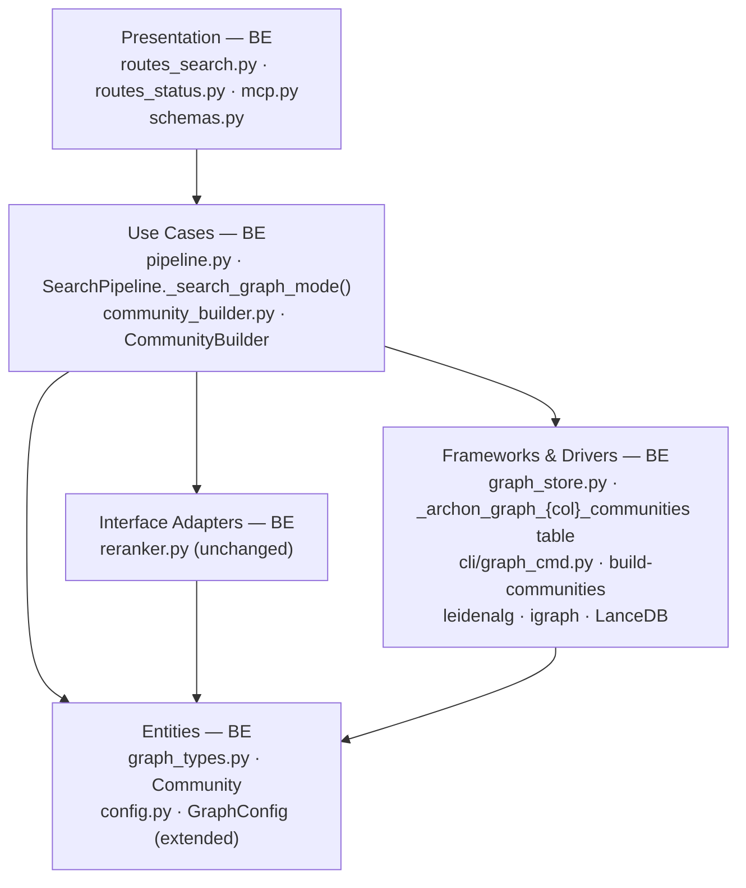

# E1B · GraphRAG Leiden Community Detection + Local/Global Retrieval Modes — Team Plan

**How to read this file**
- **Architecture approach:** Clean Architecture (default). **Layers:** Presentation · Use Cases · Interface Adapters · Entities · Frameworks & Drivers. Dependencies point inward.
- **This is a backend-only feature.** Frontend is N/A; archon-search is a Python FastAPI server with no web UI.
- The **Backend** section is the **depth view** — each role's work, grouped by layer.
- The **Task Breakdown** is the **order view** — every task is a single-role checkbox in execution order, opening with a dependency graph.
- **Phases are vertical slices** — each delivers a working end-to-end increment. Sliced with the **`vertical-slicer` skill**.
- Each task: **layer · estimate** (decimal hours), **needs · completes**, and a **Tests** block. Unit and integration tests belong to the implementing dev (test-first); e2e and manual tests are the tester's tasks.
- **Contracts** are logical; HTTP/API seams link `.tsp` + `.openapi.yaml` files; internal seams link `.tsp` files validated with `--no-emit`.
- **Prerequisite:** E1a must be complete before E1b work starts. E1b assumes these E1a artefacts exist: `GraphConfig` (with `enabled`, `extraction_model`, `backend_threshold_edges`), `_archon_graph_{col}_nodes` and `_archon_graph_{col}_edges` per-collection LanceDB tables (managed by `GraphStore`), `GraphExpander` for query-time n-gram entity matching, `graph_mode=naive` on `POST /search`.

---

## Background

archon-search supports hybrid vector+FTS retrieval. E1a (the preceding feature) added entity extraction and naive graph expansion (`graph_mode=naive`), storing entities and relationships in per-collection `_archon_graph_{col}_nodes` / `_archon_graph_{col}_edges` LanceDB tables (managed by `GraphStore`). However, naive single-entity expansion cannot answer cluster-level questions ("How does the auth subsystem work?") or broad synthesis questions ("What are the main architectural patterns?"). Both require community-level graph structure.

---

## Goal

After `archon-search graph build-communities <collection>`, Leiden community detection clusters the entity graph into coherent groups. Each community is represented by an MMR-selected set of member chunks (or an optional LLM-generated abstractive summary). Querying with `graph_mode=local` retrieves the community containing the query entities and their member chunks; `graph_mode=global` retrieves representative chunks from every community, reranked against the query. Both modes pass the eval gate: `graph_local_mrr >= baseline_mrr` (local mode) and `graph_global_mrr >= baseline_mrr` (global mode).

---

## Scope

### In Scope
- `archon-search graph build-communities <collection>` CLI command
- Leiden community detection via `leidenalg` + `igraph` (bundled in `archon-search[graph]` extra)
- Per-collection `_archon_graph_{col}_communities` LanceDB table: `community_id`, `entity_ids[]`, `representative_chunk_ids[]`, `summary_text` (null when LLM disabled), `built_at` (UTC timestamp)
- MMR over community member chunk embeddings for representative chunk selection (default, zero LLM)
- Optional LLM abstractive summary when `[graph].extraction_model` is set
- `graph_mode=local` and `graph_mode=global` on `POST /search` and MCP `search`
- Config additions: `[graph].leiden_resolution` (default `1.0`), `[graph].max_community_size` (default `10`), `[graph].community_summary_chunks` (default `3`), `[graph].max_global_candidates` (default `100`) — operator cap on the number of community representatives fed to the reranker in global mode
- `GET /status` community stats: `community_count`, `last_built_at` per collection
- Eval gate: `graph_local_mrr >= baseline_mrr` AND `graph_global_mrr >= baseline_mrr` as separate metrics (separate eval fixtures from E1a naive mode)

### Out of Scope
- Graph-path provenance in `/explain` (traversal chain display) → E1c
- Auto-triggering `build-communities` on ingest — explicit command only
- Cross-collection entity resolution → E8
- Graph visualisation or admin UI → E8
- `graph_mode=naive` changes — owned by E1a, unchanged here

---

## Acceptance criteria
- [ ] `archon-search graph build-communities <collection>` completes on a collection with E1a graph data; `_archon_graph_{col}_communities` table is written with `community_id`, `entity_ids[]`, `representative_chunk_ids[]`, `summary_text`.
- [ ] `POST /search` with `graph_mode=global` returns reranked community representative chunks (not 422) when communities are built.
- [ ] `POST /search` with `graph_mode=local` returns community representative chunks (see Known Limitations: member chunks) for the matched community, merged with hybrid search results, reranked.
- [ ] `POST /search` with `graph_mode=global` and no communities built returns HTTP 422 with code `graph_communities_not_built`.
- [ ] `GET /status` includes `community_count` (int) and `last_built_at` (ISO 8601 string or null) per collection.
- [ ] MCP `search` tool accepts `graph_mode` parameter and behaves identically to the REST route.
- [ ] `archon-search graph build-communities` before E1a extraction exits non-zero with a clear error.
- [ ] `leidenalg` absent → `build-communities` exits non-zero with error + install hint.
- [ ] `graph_local_mrr >= baseline_mrr` AND `graph_global_mrr >= baseline_mrr` pass in the eval harness as separate metrics.

---

## What does NOT change
- `graph_mode=naive` behaviour — unchanged (E1a owns it)
- Standard hybrid search path (no `graph_mode`) — unchanged
- Chunk table schema (`STORE_SCHEMA_VERSION` not bumped — `_archon_graph_{col}_communities` is per-collection graph table, not `_schema()` or `_meta_schema()`)
- REST API authentication and ACL behaviour
- Existing CLI commands (`ingest`, `sync`, `collection`, etc.)

---

## Known limitations / accepted trade-offs
- **Leiden parameter sensitivity:** `leiden_resolution=1.0` and `max_community_size=10` are standard defaults; they will be wrong for some corpora. Operators must tune via TOML. No auto-tuning in E1b.
- **Stale communities:** `_archon_graph_{col}_communities` is valid until `build-communities` is re-run. New entities from subsequent ingest are not reflected. `last_built_at` in `GET /status` lets operators detect staleness; auto-warn or auto-rebuild is a future iteration.
- **CPU-bound Leiden on large graphs:** No timeout, cancellation, or async support for the Leiden step. Operators with 100k+ entity graphs should expect minutes; progress logging is best-effort.
- **MMR implementation is local:** No reference to an existing MMR function in the codebase; new implementation in `community_builder.py`. Reranker (`reranker.py`) is not involved in MMR selection.
- **LLM summary is opt-in:** When `extraction_model` is not set, summaries are skipped. When set and LLM fails, the affected community falls back to MMR; a warning is emitted but `build-communities` does not abort.
- **Member chunks in local mode:** `GraphNode` does not store `chunk_id` (only `source_doc_id`). "Member chunks" in local mode (S3, BE-7a) means ONLY the `representative_chunk_ids[]` stored in `_archon_graph_{col}_communities` — there is no lookup of all chunks that contain member entities. True member-chunk retrieval would require adding `chunk_ids[]` to `GraphNode` during E1a extraction; that is out of scope for E1b.
- **422 error body shape:** The 422 for `graph_communities_not_built` uses `{"detail": {"code": "..."}}` (object-typed detail). The 422 for `graph.enabled=False` uses `{"detail": "..."}` (string-typed detail — the FastAPI/Pydantic default). These shapes are intentionally inconsistent with the E1a 422 and with each other. Standardising is a future cleanup; callers should handle both shapes.
- **S9 fallback result type ambiguity:** When local mode falls back to naive expansion (isolated nodes, S9), `graph_expansion_applied=True` is returned — but the underlying result is from a naive-expanded hybrid search, not from community representative chunks. This is indistinguishable from a true community result without inspecting debug metadata. The `_retrieval_source` field that would disambiguate is deferred to E1c (Q2). Operators relying on `graph_expansion_applied=True` to mean "community chunks served" must wait for E1c.
- **`source_doc_id` last-writer-wins bias in MMR candidate pool:** `GraphNode.source_doc_id` is last-writer-wins on upsert — if an entity appears in documents A, B, and C, only the last-ingested document's ID is stored. The MMR candidate pool in `CommunityBuilder.build()` (fetched via `get_chunks_for_doc(source_doc_id)`) is therefore biased toward recently-ingested documents. Earlier documents containing the same entities are excluded from representative selection. Accepted for E1b; true multi-doc sampling would require storing all `source_doc_ids` per entity.
- **`community_summary_chunks` controls both MMR representative count and LLM context size:** The config field is used as the MMR `K` (how many diverse representative chunks to select) AND as the number of chunk texts passed to the LLM summariser. These are different concerns — optimal MMR K for retrieval may differ from optimal LLM context size. Accepted for E1b; separate knobs are a future refinement.

---

## Approach & architecture

E1b adds a **community detection layer** on top of E1a's entity graph. A new `CommunityBuilder` service (Use Cases) orchestrates Leiden clustering via `leidenalg`, MMR representative selection, and optional LLM summarisation. Results are persisted to a new per-collection `_archon_graph_{col}_communities` LanceDB table (Frameworks & Drivers). At query time, `SearchPipeline.search()` (Use Cases) routes to a new `_search_graph_mode()` path that reads communities from the store and merges with hybrid search before reranking. `POST /search` and the MCP `search` tool (Presentation) accept `graph_mode` and thread it through.



**Layer map**

| Layer | Role | Components |
|-------|------|-----------|
| Presentation | Backend | `routes_search.py` (SearchRequest/Response + handler), `routes_status.py` (community stats), `mcp.py` (search tool), `schemas.py` (StatusCollectionEntry extensions) |
| Use Cases | Backend | `pipeline.py` (`SearchPipeline.search()` extension + `_search_graph_mode()`), `community_builder.py` (`CommunityBuilder` — Leiden + MMR + optional LLM summary) |
| Interface Adapters | Backend | `reranker.py` (unchanged) |
| Entities | Backend | `graph_types.py` (`Community` dataclass), `config.py` (`GraphConfig` extensions) |
| Frameworks & Drivers | Backend | `graph_store.py` (`_archon_graph_{col}_communities` table + CRUD, extending `GraphStore`), `cli/graph_cmd.py` (`build-communities` command + wire into `main.py`), `leidenalg`, `igraph`, LanceDB |

**What changes**
- `archon_search/graph_types.py` — new `Community` dataclass (alongside existing `GraphNode`, `GraphEdge`, `GraphExtractionResult`). Note: `SearchPipelineResult.graph_expansion_applied` and `graph_mode` param on `SearchPipeline.search()` already exist from E1a — do NOT re-add them.
- `archon_search/config.py` — extend `GraphConfig` with `leiden_resolution`, `max_community_size`, `community_summary_chunks`, `max_global_candidates` (default `100`); TOML parsing for these fields
- `archon_search/graph_store.py` — new `_archon_graph_{col}_communities` table schema + 5 CRUD methods (`ensure_communities_table`, `write_communities`, `get_communities_for_entities`, `list_community_representatives`, `get_community_stats`) added to the existing `GraphStore` class
- `archon_search/community_builder.py` — new file: `CommunityBuilder` class (Use Cases layer); also adds `leidenalg` to `pyproject.toml` `[graph]` extra
- `archon_search/pipeline.py` — extend `_search_graph_mode()` (local + global paths); extend `search_many()` for graph modes
- `archon_search/cli/graph_cmd.py` — new file: `build-communities` command
- `archon_search/cli/main.py` — register graph CLI group
- `archon_search/graph_expander.py` — NO structural change. `tokenize_and_generate_ngrams(query: str, max_n: int) -> list[str]` is already a module-level free function at line 81; `_MAX_NGRAM_SIZE` is already a module-level constant. BE-7a should import both directly from `graph_expander` (not wrap or duplicate them).
- `archon_search/server/routes_search.py` — add `local` and `global` to `SearchRequest.graph_mode` Literal; add validation for `GraphCommunitiesNotBuiltError` → 422; `SearchRequest.graph_mode` and `SearchResponse.graph_expansion_applied` already exist from E1a.
- `archon_search/server/routes_status.py` — extend per-collection status with community stats
- `archon_search/server/schemas.py` — extend `StatusCollectionEntry` with `community_count`, `last_built_at`
- `archon_search/server/mcp.py` — add `graph_mode` parameter to `search` tool

**Key decisions (from the brief)**
- MMR-over-embeddings is the local default; LLM synthesis is opt-in via `extraction_model`
- `build-communities` is always explicit — no auto-trigger on ingest
- Global mode = all community representatives fed to the reranker; bounded set
- `_archon_graph_{col}_communities` table stores memberships and representative IDs; no chunk content duplication
- Leiden defaults: `resolution=1.0`, `max_community_size=10`, `community_summary_chunks=3`, `max_global_candidates=100`

---

## Contracts / seams

TypeSpec 1.13.0 is available. HTTP/API seams are authored as TypeSpec HTTP services in `api-contracts/` with emitted `openapi.yaml`. Internal logical seams are core-construct `.tsp` files compiled with `--no-emit`.

**C1 — Search graph_mode extension** *(Presentation ↔ Use Cases — HTTP/API seam)*
`SearchRequest` gains `graph_mode: "naive" | "local" | "global" | null`; `SearchResponse` gains `graph_expansion_applied: bool`. Extends the E1a seam (`graph_mode=naive`). Route handler validates: if `graph_mode` is `local|global` and `graph.enabled=false` → 422; if `global` and no communities built → 422 `graph_communities_not_built`. See [`api-contracts/e1b-search-graphmode-contract.tsp`](api-contracts/e1b-search-graphmode-contract.tsp) + [`api-contracts/e1b-search-graphmode-contract.openapi.yaml`](api-contracts/e1b-search-graphmode-contract.openapi.yaml).
- Realised by: BE-5 (pipeline), BE-6 (routes) · Verified by: BE-6 integration tests, T-1, T-2

**C2 — Status community stats** *(Presentation — HTTP/API seam)*
`StatusCollectionEntry` gains `community_count: int` (0 if never built) and `last_built_at: string | null` (ISO 8601). See [`api-contracts/e1b-status-communities-contract.tsp`](api-contracts/e1b-status-communities-contract.tsp) + [`api-contracts/e1b-status-communities-contract.openapi.yaml`](api-contracts/e1b-status-communities-contract.openapi.yaml).
- Realised by: BE-8 (status route + schemas) · Verified by: BE-8 integration tests, T-3

**C3 — Community entity + store interface** *(Entities ↔ Frameworks & Drivers — internal logical)*
`Community` model (community_id, entity_ids[], representative_chunk_ids[], summary_text?) + `CommunityStore` interface (ensure, write, get_for_entities, list_representatives, get_stats). See [`e1b-community-store-contract.tsp`](e1b-community-store-contract.tsp) (compiled clean with `tsp compile --no-emit`).
- Realised by: BE-1 (entity), BE-2 (store) · Verified by: BE-2 unit + integration tests

**C4 — Pipeline graph_mode extension** *(Use Cases ↔ Interface Adapters — internal logical)*
`SearchPipeline.search()` gains `graph_mode: str | None` parameter (already exists from E1a). When `local|global`, delegates to `_search_graph_mode()` which reads from `CommunityStore`, fetches chunks, merges with hybrid candidates, reranks. `SearchPipelineResult` gains `graph_expansion_applied: bool` (already exists from E1a). Note: `e1b-pipeline-graphmode-contract.tsp` also declares `graphFallbackReason: string | null` — this field is deferred to E1c (along with `_retrieval_source`); do NOT implement it in E1b. See [`e1b-pipeline-graphmode-contract.tsp`](e1b-pipeline-graphmode-contract.tsp) (compiled clean with `tsp compile --no-emit`).
- Realised by: BE-3 (CommunityBuilder), BE-5 (pipeline global), BE-7a (pipeline local single-collection), BE-7b (pipeline local fanout) · Verified by: BE-5, BE-7a, BE-7b integration tests, T-1, T-2

---

## Scenarios #tester-role

| id | Scenario (Given / When / Then) |
|----|--------------------------------|
| **S1** | **Given** a collection with E1a graph data (`_archon_graph_{col}_nodes` + `_archon_graph_{col}_edges` populated) **When** operator runs `archon-search graph build-communities <collection>` **Then** `_archon_graph_{col}_communities` table is written with community_id, entity_ids[], representative_chunk_ids[], summary_text (null if no extraction_model); command exits 0 with a summary line |
| **S2** | **Given** communities are built for a collection **When** `POST /search` with `graph_mode=global` **Then** all community representative chunks are fetched, reranked against the query, and top-k results returned; `graph_expansion_applied=true` in response |
| **S3** | **Given** communities are built **When** `POST /search` with `graph_mode=local` and query contains recognisable entities **Then** the community containing those entities is found; its community representative chunks (see Known Limitations: member chunks) are merged with hybrid search candidates; the combined set is reranked and top-k returned |
| **S4** | **Given** communities are built **When** `GET /status` **Then** each collection entry includes `community_count: N` and `last_built_at: <ISO timestamp>` |
| **S5** | **Given** communities are built **When** MCP `search` tool called with `graph_mode="local"` or `"global"` **Then** result is identical to equivalent REST call |
| **S6** | **Given** `_archon_graph_{col}_nodes` table does not exist (E1a not run) **When** `archon-search graph build-communities <collection>` **Then** command exits non-zero with a clear error message ("entity graph not found; run ingest with graph.enabled=true first") |
| **S7** | **Given** the entity graph has fewer than 2 entities **When** `build-communities` **Then** entire graph treated as a single community; WARNING logged; command exits 0 |
| **S8** | **Given** Leiden produces a community with more entities than `max_community_size` **When** `build-communities` **Then** the oversized community is split by re-running Leiden at higher resolution (`resolution *= 2`) on its subgraph; recursion depth is capped at 5 levels; if still oversized after 5 levels, the community is accepted as-is with a WARNING; in the normal case, all output communities respect the size limit |
| **S9** | **Given** communities are built; query entities are in the graph but are isolated nodes (not in any community) **When** `POST /search` with `graph_mode=local` **Then** falls back silently to naive graph expansion; `graph_expansion_applied=true`; debug metadata notes the fallback |
| **S10** | **Given** communities are built; no graph entities recognised in the query **When** `POST /search` with `graph_mode=local` **Then** falls back to standard hybrid search; `graph_expansion_applied=false` |
| **S11** | **Given** no communities have been built for a collection **When** `POST /search` with `graph_mode=global` **Then** HTTP 422 with JSON `{"detail": {"code": "graph_communities_not_built"}}` |
| **S12** | **Given** `extraction_model` is set and the LLM call fails for community K **When** `build-communities` **Then** community K falls back to MMR representative chunks; other communities proceed normally; command exits 0 with a warning line naming the failed community |
| **S13** | **Given** `archon-search[graph]` is not installed (leidenalg absent) **When** `archon-search graph build-communities` **Then** command exits non-zero with error message and `pip install archon-search[graph]` hint |
| **S14** | **Given** communities are built; operator runs ingest on new documents **When** `GET /status` **Then** `last_built_at` shows the old timestamp, signalling that communities are stale and `build-communities` should be re-run |
| **S15** | **Given** a collection with ACL restrictions; communities built **When** `POST /search` with `graph_mode=local` from a namespace without access **Then** community representative chunks are subject to the same namespace ACL check as standard search results; no unauthorized content returned |
| **S16** | **Given** eval fixtures with queries and relevance labels for both local and global modes **When** eval suite runs **Then** `graph_mrr >= baseline_mrr` for local mode AND for global mode |

---

## Frontend — Presentation #frontend-role

N/A — archon-search has no frontend. It is a Python FastAPI server exposing REST and MCP endpoints. All `POST /search`, `GET /status`, and CLI interactions are backend code.

---

## Backend — Entities · Use Cases · Adapters · Frameworks #backend-role

**Scope:** All implementation tasks for this feature. Writes both unit and integration tests test-first.
**Owns layers:** Entities, Use Cases, Interface Adapters, Frameworks & Drivers.

**Tasks by layer**

- Entities: BE-1 (`Community` dataclass + `GraphConfig` extensions)
- Frameworks & Drivers: BE-2 (`_archon_graph_{col}_communities` store table + CRUD), BE-4 (`build-communities` CLI)
- Use Cases: BE-3a (`CommunityBuilder` — Leiden clustering + `max_community_size` split), BE-3b (`CommunityBuilder` — MMR selection + optional LLM summary), BE-5 (pipeline global mode), BE-7a (pipeline local single-collection + fallbacks), BE-7b (pipeline local fanout)
- Presentation: BE-6 (`POST /search` route + schema), BE-8 (`GET /status` community stats), BE-9 (MCP `search` tool)
- Frameworks & Drivers (eval): BE-10 (eval fixtures + thresholds for graph_mrr)

**Done when**
- [ ] `build-communities` completes on real E1a graph data — S1
- [ ] `graph_mode=global` returns reranked community representatives — S2
- [ ] `graph_mode=local` returns community-scoped + hybrid merged results — S3
- [ ] `GET /status` includes `community_count` + `last_built_at` — S4
- [ ] MCP `search` with `graph_mode` works — S5
- [ ] All error paths handled: no graph data (S6), no communities (S11), leidenalg absent (S13) — S6, S11, S13
- [ ] Eval fixtures and thresholds in place for eval gate — S16

---

## Tester #tester-role

**Scope:** e2e and manual tests plus the project close-out. Unit and integration tests belong to the backend dev, in each task's `Tests` block.

**Tasks**
- T-1: e2e — `build-communities` CLI + `graph_mode=global` (Phase 1)
- T-2: e2e — `graph_mode=local` including fallback behaviors (Phase 2)
- T-3: e2e — `GET /status` community stats + MCP `search` with graph_mode (Phase 3)
- T-4: eval gate — `graph_mrr >= baseline_mrr` for both modes (Phase 4)
- T-5: close-out (Phase 5)

**Allocation** *(unit + integration are dev-written; e2e + manual are tester tasks)*

| Scenario | Cheapest level |
|----------|----------------|
| S1 build-communities happy path | integration (BE-3b) + e2e CLI (T-1) |
| S2 global mode search | integration (BE-5) + e2e (T-1) |
| S3 local mode search | integration (BE-7a) + e2e (T-2) |
| S4 GET /status community stats | integration (BE-8) + e2e (T-3) |
| S5 MCP graph_mode | integration (BE-9) + e2e (T-3) |
| S6 build-communities before E1a | unit (BE-3a) |
| S7 graph < 2 entities → 1 community | unit (BE-3a) |
| S8 max_community_size split | unit (BE-3a) |
| S9 local no matched community → fallback naive | unit (BE-5/BE-7a) |
| S10 local no entities → fallback hybrid | unit (BE-7a) |
| S11 global no communities → 422 | integration (BE-6) + e2e (T-1) |
| S12 LLM summary failure → MMR fallback | unit (BE-3b) |
| S13 leidenalg absent → error | unit (BE-4) |
| S14 stale communities last_built_at | integration (BE-8) |
| S15 ACL on community chunks | integration (BE-7a) |
| S16 eval gate graph_mrr | e2e/eval (T-4) |

---

## Documentation update

Docs the feature touches — the close-out task works through this list.

- [ ] `Documentation/Backlog/e1b-graphrag-leiden-local-global-modes-brief.md` — no changes needed (source brief)
- [ ] `Documentation/Backlog/e1b-graphrag-leiden-local-global-modes-team-plan.md` — this file
- [ ] `Documentation/Architecture/100_system_architecture_overview.md` — update to mention community detection layer
- [ ] `Documentation/Architecture/110_component_catalog_and_layer_breakdown.md` — add `community_builder.py`, `cli/graph_cmd.py` entries
- [ ] `Documentation/Architecture/130_data_architecture_and_persistence.md` — document `_archon_graph_{col}_communities` table schema
- [ ] `Documentation/Architecture/600_api_reference_or_public_interface.md` — document `graph_mode=local|global` on POST /search, GET /status community fields, MCP search update
- [ ] `Documentation/UserManual/04_ingestion_and_collections.md` — add `build-communities` command workflow and when to re-run
- [ ] `Documentation/UserManual/05_searching.md` — document `graph_mode=local|global` parameter options and behaviour
- [ ] `CLAUDE.md` — update `config.py` description to include new GraphConfig fields; update `graph_store.py` description to include `_archon_graph_{col}_communities` table and new `GraphStore` methods; update MCP tools list if `search` tool signature change is breaking; update CLI description for `graph build-communities`
- [ ] `archon-search.toml.example` — add `[graph]` section with `leiden_resolution`, `max_community_size`, `community_summary_chunks`, `max_global_candidates`
- [ ] `BREAKING.md` — add entry if `SearchRequest.graph_mode` or `StatusCollectionEntry` changes are breaking (per `520_api_design_and_contracts.md`)

---

## Open questions

| id | Area | Question |
|----|------|----------|
| **Q1** | CLI | Should `build-communities` accept `--all` to rebuild across all collections in a namespace? (Mentioned as future iteration in brief; decision needed to avoid dead-end CLI design.) |
| **Q2** | Schema | Should `graph_mode=local` results carry a `_retrieval_source: "community"` field per result? Useful for E1c explain extension and operator debugging, but adds schema surface. (E1b brief open question.) |
| **Q3** | Entity resolver | RESOLVED — the "entity resolver" is `GraphExpander.expand()` (n-gram matching → `find_nodes_by_name` → `get_neighbours`). For local mode, BE-7a should call `graph_store.find_nodes_by_name(query_ngrams)` directly rather than going through `GraphExpander.expand()` (which appends neighbour terms to the query string — that is the naive expansion path). Specifically: extract candidate n-grams from the query (same logic as `GraphExpander`), call `graph_store.find_nodes_by_name()` to get matched entity_ids, then call `get_communities_for_entities(entity_ids)`. |
| **Q4** | Multi-collection | RESOLVED — each collection's graph is queried independently in multi-collection fanout. `search_many()` will call `_search_graph_mode()` per collection leg, then merge and rerank across collections using the same RRF/dedup logic as naive fanout. Communities are never merged across collections. |
| **Q5** | Leiden CPU | No timeout or async support for Leiden on large graphs. Should `build-communities` emit periodic progress logs (e.g., every N communities) to signal liveness? |
| **Q6** | ACL + community chunks | RESOLVED — silently skip stale chunk IDs at the pipeline layer. When `_search_graph_mode()` fetches chunks by `representative_chunk_ids[]`, any IDs that return no result (deleted, ACL-filtered, or otherwise absent) are silently dropped from the candidate set. The reranker operates on whatever non-empty set remains. If ALL representative chunk IDs are stale (empty candidate set), fall back to the standard hybrid search path for that collection and log a WARNING. Add `test_stale_chunk_ids_silently_skipped` to BE-5 test list. |

---

## Task Breakdown

Single-role tasks in execution order, grouped into vertical slices.

### Dependency graph

```mermaid
flowchart LR
  K1([K1 · align])

  subgraph P1["Phase 1 · Build communities + search corpus-wide"]
    BE1[BE-1 · Community entity + GraphConfig]
    BE2[BE-2 · _archon_graph_{col}_communities store table]
    BE3a[BE-3a · CommunityBuilder Leiden+split]
    BE3b[BE-3b · CommunityBuilder MMR+LLM]
    BE4[BE-4 · build-communities CLI]
    BE5[BE-5 · Pipeline global mode]
    BE6[BE-6 · POST /search route]
    T1[T-1 · e2e global mode]
  end

  subgraph P2["Phase 2 · Focus search on query-relevant community"]
    BE7a[BE-7a · Pipeline local single-collection]
    BE7b[BE-7b · Pipeline local fanout]
    T2[T-2 · e2e local mode]
  end

  subgraph P3["Phase 3 · Operational visibility + MCP parity"]
    BE8[BE-8 · GET /status community stats]
    BE9[BE-9 · MCP search graph_mode]
    T3[T-3 · e2e status + MCP]
  end

  subgraph P4["Phase 4 · Eval gate"]
    BE10[BE-10 · eval fixtures + thresholds]
    T4[T-4 · eval gate run]
  end

  T5([T-5 · close-out])

  K1 --> BE1
  BE1 --> BE2
  BE1 --> BE5
  BE2 --> BE3a
  BE2 --> BE5
  BE2 --> BE8
  BE3a --> BE3b
  BE3b --> BE4
  BE5 --> BE6
  BE4 --> T1
  BE6 --> T1
  T1 --> BE7a
  BE7a --> BE7b
  T1 --> BE8
  T1 --> BE9
  BE7b --> T2
  T2 --> T3
  BE8 --> T3
  BE9 --> T3
  T3 --> BE10
  BE10 --> T4
  T4 --> T5
```

---

### Phase 0 · Kickoff *(prerequisite; the one cross-cutting step)*

- [x] **K1** — Agree Contracts and Scenarios; confirm E1a is complete and entity resolver symbol is known (`GraphExpander.expand()` / `graph_store.find_nodes_by_name()`); ratify Q3, Q4, Q6 resolutions (n-gram-only entity lookup for local mode; per-collection community isolation in fanout; silent skip on stale chunk IDs with WARNING) #team
    - — · 1.0h
    - completes C1, C2, C3, C4
    - Tests

---

### Phase 1 · Build communities and search corpus-wide *(walking skeleton: data foundation + global mode end-to-end)*

- [x] **BE-1** — Add `Community` dataclass to `graph_types.py` (consistent with E1a graph entity convention — `GraphNode`, `GraphEdge`, `GraphExtractionResult` are all here); extend `GraphConfig` in `config.py` with `leiden_resolution`, `max_community_size`, `community_summary_chunks`, `max_global_candidates` (default `100`); TOML parsing for all fields. Note: `SearchPipelineResult.graph_expansion_applied` and `graph_mode` param on `search()` already exist from E1a — do NOT re-declare them. #backend-role
    - Entities · 1.5h
    - needs K1 · completes C3, C4
    - Tests
        - #unit_test — `test_community_dataclass_defaults` — Community instantiates with correct field types and defaults; summary_text nullable
        - #unit_test — `test_graph_config_leiden_fields` — GraphConfig parses leiden_resolution/max_community_size/community_summary_chunks/max_global_candidates from TOML; invalid resolution (<= 0) raises ConfigError; max_global_candidates <= 0 raises ConfigError

- [x] **BE-2** — Add `_archon_graph_{col}_communities` LanceDB table to `graph_store.py` (on the existing `GraphStore` class): schema (community_id, entity_ids[], representative_chunk_ids[], summary_text?, built_at), and methods `ensure_communities_table`, `write_communities`, `get_communities_for_entities`, `list_community_representatives`, `get_community_stats`. Note: LanceDB's `_where_in` helper generates simple equality predicates and cannot filter list-typed columns. `get_communities_for_entities` must use a scan + Python-side filter (fetch all communities for the collection, filter in-process where `any(eid in community.entity_ids for eid in entity_ids)`). This is acceptable for the expected community count per collection (<1000); document with a `# ponytail:` comment. Also add two new methods to `SearchStore` in `store.py` required by community retrieval: `get_chunks_by_ids(collection, chunk_ids: list[str]) -> list[dict]` (batch fetch chunk rows by chunk_id, returning only those found — missing IDs silently skipped) and `get_chunks_for_doc(collection, doc_id: str) -> list[dict]` (return all chunk rows for a given source document, used by `CommunityBuilder` to sample candidate chunks for MMR when only `source_doc_id` is known). Both methods must use `_where_eq`/`_where_in` predicates from `store_filters.py`, never f-strings. #backend-role
    - Frameworks & Drivers · 4.0h
    - needs BE-1 · completes C3
    - Tests
        - #unit_test — `test_communities_table_schema` — PyArrow schema has correct field types; list fields are list_(utf8)
        - #integration_test — `test_write_and_read_communities` — write 3 Community objects; read back with get_communities_for_entities; verify roundtrip fidelity
        - #integration_test — `test_get_community_stats_empty` — get_community_stats returns (0, None) when no communities built
        - #integration_test — `test_get_community_stats_after_write` — after write_communities, count and last built_at are correct
        - #integration_test — `test_list_community_representatives_all` — list_community_representatives returns all communities with representative_chunk_ids populated
        - #unit_test — `test_get_chunks_by_ids_returns_only_found` — store has 5 chunks; request 3 valid + 2 unknown IDs; only 3 returned; no error
        - #unit_test — `test_get_chunks_for_doc_returns_all_chunks` — store has 4 chunks for doc A + 2 for doc B; get_chunks_for_doc(doc_A) returns exactly 4

- [x] **BE-3a** — Create `archon_search/community_builder.py` with `CommunityBuilder` class: load graph nodes/edges from store; run Leiden (`leidenalg`); enforce `max_community_size` by re-running Leiden at higher resolution on oversized subgraphs (`resolution *= 2`, max 5 recursion levels; if still oversized after 5 levels, accept with a WARNING); handle edge cases (< 2 entities → 1 community + WARNING; leidenalg absent → ImportError with install hint); add `leidenalg` to `[project.optional-dependencies]` `[graph]` extra in `pyproject.toml`. `CommunityBuilder` receives `GraphStore` via constructor injection (same DI pattern as `GraphExpander` in E1a) — it must NOT import `GraphStore` or `leidenalg` at module scope in a way that couples Use Cases to Frameworks & Drivers unconditionally; use `TYPE_CHECKING` for type hints and lazy `import leidenalg` inside the method body. #backend-role
    - Use Cases · 4.0h
    - needs BE-1, BE-2 · completes S6, S7, S8, S13
    - Tests
        - #unit_test — `test_build_communities_no_graph_nodes_raises` — raises clear error when _archon_graph_{col}_nodes absent or empty (S6)
        - #unit_test — `test_build_communities_single_entity_one_community` — graph with 1 entity → 1 community, warning logged (S7)
        - #unit_test — `test_max_community_size_split` — community exceeding max_community_size is split via recursion; all output communities <= max_community_size (S8)
        - #unit_test — `test_max_community_size_split_depth_limit` — oversized community after 5 recursion levels is accepted with WARNING; no infinite loop (S8)
        - #unit_test — `test_leidenalg_absent_raises` — ImportError on leidenalg yields clear error with install hint (S13)
        - #unit_test — `test_build_communities_zero_edges_many_nodes` — graph with 10 isolated nodes (no edges); Leiden produces output without crash; at least 1 community written
        - #integration_test — `test_max_community_size_split_real_leiden` — real leidenalg + igraph; fixture graph guaranteed to produce a community larger than max_community_size=2; verify output has all communities ≤ 2 entities (S8 real-library integration)

- [x] **BE-3b** — Complete `CommunityBuilder.build()`: MMR selection of `community_summary_chunks` representatives per community; optional LLM summary via `extraction_model`; call `write_communities()` to persist results. MMR implementation detail: for each member entity in the community, call `store.get_chunks_for_doc(collection, entity.source_doc_id)` to discover candidate chunk rows (accounts for the fact that `GraphNode` only stores `source_doc_id`, not `chunk_id`); aggregate all candidate chunks across entities; then run MMR on the aggregated set (cosine similarity on stored vectors — no new embedding computation) to select `community_summary_chunks` diverse representatives; persist their chunk_ids as `representative_chunk_ids[]`. At search time, `store.get_chunks_by_ids()` fetches these by ID. When LLM fails for a community, fall back to MMR + emit WARNING; do not abort. #backend-role
    - Use Cases · 4.5h
    - needs BE-3a · completes C3, S1, S12
    - Tests
        - #unit_test — `test_mmr_selects_diverse_representatives` — MMR output has K items, each selected for diversity; no duplicate chunk IDs
        - #unit_test — `test_llm_summary_failure_falls_back_to_mmr` — when LLM raises, that community uses MMR representatives; other communities unaffected; warning emitted (S12)
        - #integration_test — `test_build_communities_real_graph` — build communities on a real fixture graph (nodes + edges in tmp LanceDB); verify communities written; at least 1 community; all representative_chunk_ids reference real chunk IDs
        - #integration_test — `test_llm_failure_community_still_written` — real store; CommunityBuilder.build() with mocked LLM that raises; all communities written with MMR representatives (no LLM summaries); no exception escapes build() (S12)
        - #integration_test — `test_build_communities_idempotent` — run build() twice on same collection; second run overwrites first; community count matches single-run count (no duplication)

- [x] **BE-4** — Create `archon_search/cli/graph_cmd.py` with `graph` Click group and `build-communities <collection>` subcommand; load config → connect store → call CommunityBuilder.build() → write_communities → print summary; wire into `archon_search/cli/main.py` #backend-role
    - Frameworks & Drivers · 2.0h
    - needs BE-3b · completes S1, S6, S13
    - Tests
        - #unit_test — `test_build_communities_cli_success` — CliRunner invocation with mocked CommunityBuilder; exit code 0; output contains community count
        - #unit_test — `test_build_communities_cli_no_graph_exits_nonzero` — mocked CommunityBuilder raises; exit code != 0; stderr has actionable message (S6)
        - #integration_test — `test_build_communities_cli_real_store` — real tmp store with fixture graph data; command writes _archon_graph_{col}_communities table; exit code 0

- [x] **BE-5** — Extend `SearchPipeline.search()` in `pipeline.py`: create `_search_graph_mode(mode, collection, query, ...)` private dispatch method. **Control-flow note:** the current naive expansion at line ~709 mutates `effective_query` BEFORE the RAG Fusion / HyDE branch (line ~716); those downstream branches consume `effective_query`. Moving naive into `_search_graph_mode()` must preserve this sequencing — `_search_graph_mode()` for naive should mutate `effective_query` and return early (bypassing RAG Fusion), NOT short-circuit at the top of `search()` before the HyDE/RAG-Fusion fork. The existing `search()` control flow should remain: for naive mode, call `_search_graph_mode("naive", ...)` which returns the expanded query string, then fall through to `_search_standard(effective_query, ...)`. For local/global, call `_search_graph_mode(mode, ...)` and return its result directly (bypasses RAG Fusion — community retrieval already produces final candidates). Same applies to `search_many()` (parallel naive per leg at line ~1402). Add global-mode path: fetch community representatives via `list_community_representatives`, fetch chunk rows via `store.get_chunks_by_ids()`, convert to `ScoredSearchCandidate` (construct `SearchScoreBreakdown(vector_rank=None, vector_score=None, vector_score_kind=None, fts_rank=None, fts_score=None, fts_score_kind=None, rrf_score=1.0, reranker_score=None)` — all other `ScoredSearchCandidate` fields from chunk row), cap at `config.graph.max_global_candidates` using insertion-order truncation, call `reranker.rerank_candidates`, return SearchPipelineResult with `graph_expansion_applied=True`); raise `GraphCommunitiesNotBuiltError` when global mode requested and no communities exist; silently skip stale/missing chunk IDs per Q6 resolution (if ALL stale, fall back to `_search_standard()` and log WARNING). Also extend `pipeline.search_many()` for `graph_mode=global`: per-collection legs. Note: `graph_mode` param on `search()` already exists from E1a. Enforce ACL on global-mode community chunks before passing to reranker (S15 extension). #backend-role
    - Use Cases · 3.0h
    - needs K1, BE-1, BE-2 · completes C4, S2, S11
    - Tests
        - #unit_test — `test_search_pipeline_global_mode_calls_community_store` — mock store returns 3 communities; pipeline.search(graph_mode="global") calls list_community_representatives and reranker
        - #unit_test — `test_search_pipeline_global_no_communities_raises` — store returns empty; raises GraphCommunitiesNotBuiltError (S11)
        - #unit_test — `test_search_pipeline_result_graph_expansion_applied_true` — global mode result has graph_expansion_applied=True
        - #unit_test — `test_search_many_global_mode_calls_per_collection` — mock store with 2 collections × 2 communities; search_many(graph_mode="global") calls list_community_representatives for each collection and returns merged results
        - #unit_test — `test_stale_chunk_ids_silently_skipped` — list_community_representatives returns chunk IDs; chunk fetch returns empty for 1 ID; remaining candidates passed to reranker; no error raised (Q6 resolution)
        - #integration_test — `test_pipeline_global_mode_real_communities` — real store with fixture communities; pipeline.search(graph_mode="global") returns results from representative chunks; graph_expansion_applied=True
        - #unit_test — `test_max_global_candidates_cap_enforced` — store returns 200 community representatives; pipeline.search(graph_mode="global") passes exactly 100 (max_global_candidates default) to reranker; no error
        - #unit_test — `test_all_stale_chunk_ids_falls_back_to_hybrid` — store.get_chunks_by_ids() returns empty for ALL IDs; pipeline falls back to _search_standard(); WARNING logged
        - #unit_test — `test_global_mode_acl_filters_cross_namespace` — community chunks include rows from a different namespace; ACL filter removes them before reranker call; graph_expansion_applied=True only if non-empty set remains
        - #unit_test — `test_global_mode_all_acl_filtered_falls_back_to_hybrid` — all community chunks removed by ACL filter; empty candidate set after filter; pipeline falls back to _search_standard(); WARNING logged
        - #unit_test — `test_naive_mode_routed_through_dispatch` — pipeline.search(graph_mode="naive") still produces same result as before BE-5 (regression guard that naive path moved into _search_graph_mode())
        - #unit_test — `test_naive_plus_rag_fusion_uses_original_query_for_variants` — pipeline.search(graph_mode="naive", rag_fusion=True); mock verifies RAG Fusion variant generation uses the ORIGINAL (unexpanded) query, not the naive-expanded effective_query; the expanded query is used for the embedding step only

- [x] **BE-6** — Extend `routes_search.py`: change `SearchRequest.graph_mode` Literal from `"naive"` to `"naive" | "local" | "global"` (already `Literal["naive"] | None` from E1a — extend the union, do not re-declare); `SearchResponse.graph_expansion_applied` already exists from E1a; add catch of `GraphCommunitiesNotBuiltError` → 422 with `{"detail": {"code": "graph_communities_not_built"}}`; `graph.enabled=False` → 422 guard already exists for "naive", extend to cover "local" and "global"; thread `graph_mode` to `pipeline.search()` and `pipeline.search_many()` #backend-role
    - Presentation · 2.5h
    - needs BE-5 · completes C1, S2, S11
    - Tests
        - #unit_test — `test_search_request_graph_mode_validation` — invalid value (e.g. "naive2") → ValidationError; valid values pass
        - #integration_test — `test_post_search_global_mode_200` — TestClient with real app + built communities; POST /search graph_mode=global → 200 + results + graph_expansion_applied=true (S2)
        - #integration_test — `test_post_search_global_no_communities_422` — communities not built; POST /search graph_mode=global → 422 graph_communities_not_built (S11)
        - #integration_test — `test_post_search_local_no_communities_fallback` — communities never built; POST /search graph_mode=local → 200 with standard hybrid results; graph_expansion_applied=false (not 422); WARNING logged
        - #integration_test — `test_post_search_local_no_entity_graph_expansion_false` — real app + built communities; POST /search graph_mode=local with query matching no graph entities → 200; response JSON has graph_expansion_applied=false (S10 HTTP-level check)
        - #integration_test — `test_global_mode_acl_filters_community_chunks_integration` — real app + communities built; community representative chunks include docs from namespace B; global mode search from namespace A returns no namespace B content (S15 global-mode path)
        - #integration_test — `test_post_search_graph_mode_disabled_422` — graph.enabled=False; any graph_mode (naive, local, global) → 422

- [x] **T-1** — e2e: (a) `build-communities` CLI via CliRunner on a real collection with fixture graph data; verify communities in store + exit 0 + summary output; (b) `POST /search` with `graph_mode=global` returns 200 + results from community representatives; (c) `POST /search` with `graph_mode=global` and no communities → 422 `graph_communities_not_built` #tester-role
    - — · 3.0h
    - needs BE-4, BE-6 · completes S1, S2, S11
    - Tests
        - #e2e_test — `test_e2e_build_communities_cli` — CliRunner + real tmp app; ingest fixture docs; build-communities exits 0; store has >= 1 community (S1)
        - #e2e_test — `test_e2e_global_mode_returns_results` — after build-communities; POST /search graph_mode=global → 200, results non-empty, graph_expansion_applied=true (S2)
        - #e2e_test — `test_e2e_global_mode_no_communities_422` — no build-communities; POST /search graph_mode=global → 422 (S11)

---

### Phase 2 · Focus search on query-relevant community

- [x] **BE-7a** — Add `graph_mode=local` single-collection path to `_search_graph_mode()` in `pipeline.py`: call `tokenize_and_generate_ngrams(query, _MAX_NGRAM_SIZE)` (import both from `graph_expander.py` — already module-level free function + constant, NO new extraction needed); call `graph_store.find_nodes_by_name(ngrams)` to get matched entity_ids; if no entities recognised → return `_search_standard()` result with `graph_expansion_applied=False` (S10); if `_archon_graph_{col}_communities` table not yet built (communities never run) → fall back to standard hybrid search with `graph_expansion_applied=False` and log a WARNING; look up communities via `get_communities_for_entities(entity_ids)`; if no match (isolated nodes) → delegate to `self._graph_expander.expand()` for naive expansion with debug metadata noting fallback reason (S9); otherwise fetch `representative_chunk_ids[]` from ALL matched communities (multi-community merge), apply stale-chunk skip (Q6), fetch chunk rows via `store.get_chunks_by_ids()`, convert to `ScoredSearchCandidate` (initial score=1.0), merge with hybrid search candidates, call `reranker.rerank_candidates`, return top-k with `graph_expansion_applied=True`; enforce ACL on fetched chunks (S15). #backend-role
    - Use Cases · 3.0h
    - needs K1, T-1 · completes C4, S3, S9, S10
    - Tests
        - #unit_test — `test_local_mode_no_entities_falls_back_to_hybrid` — entity resolver returns []; pipeline returns standard search result; graph_expansion_applied=False (S10)
        - #unit_test — `test_local_mode_isolated_node_falls_back_to_naive` — entity resolver returns entities; get_communities_for_entities returns []; pipeline falls back to naive expansion; debug note present (S9)
        - #unit_test — `test_local_mode_matched_community_merges_results` — community with 2 members + 2 hybrid candidates → merged, reranked, top-k returned; graph_expansion_applied=True
        - #unit_test — `test_local_mode_multiple_communities_matched` — query entities span 2 communities; representative_chunk_ids from both communities merged before reranking; graph_expansion_applied=True
        - #integration_test — `test_pipeline_local_mode_real` — real store + real communities fixture; query matching known entity; result includes community representative chunks
        - #integration_test — `test_local_mode_acl_filters_community_chunks` — real app + communities across namespaces; graph_mode=local returns only chunks in the requesting namespace (S15)
        - #unit_test — `test_local_mode_no_communities_table_falls_back_to_hybrid` — communities table does not exist for collection (build-communities never run); local mode falls back to standard hybrid search; graph_expansion_applied=False; WARNING logged
        - #unit_test — `test_local_mode_stale_chunk_ids_silently_skipped` — community matched; get_chunks_by_ids returns empty for 1 of 3 IDs; remaining 2 passed to reranker; no error (Q6 local path)
        - #unit_test — `test_local_mode_all_stale_chunk_ids_falls_back_to_hybrid` — community matched; get_chunks_by_ids returns empty for ALL IDs; pipeline falls back to _search_standard(); WARNING logged (Q6 local path)
        - #unit_test — `test_local_mode_empty_representative_chunk_ids` — matched community has representative_chunk_ids=[]; treated as empty candidate set; falls back to _search_standard(); WARNING logged

- [x] **BE-7b** — Add `pipeline.search_many()` local-mode fanout: per-collection entity resolution → community lookup → representative chunk fetch → merge with hybrid leg results (same per-collection isolation as global fanout; no cross-collection community merge; collections with no community match fall back to hybrid for that leg). #backend-role
    - Use Cases · 1.5h
    - needs BE-7a · completes S9 (fanout), S10 (fanout)
    - Tests
        - [x] #unit_test — `test_search_many_local_mode_per_collection_isolation` — 2 collections with different communities; local mode returns per-collection communities without cross-collection merge
        - [x] #unit_test — `test_search_many_local_mixed_match` — collection A has community match; collection B has no community (isolated nodes); collection A returns community result; collection B falls back to hybrid for that leg
        - [x] #unit_test — `test_search_many_local_one_leg_all_stale_falls_back` — collection A leg has community match but all-stale chunk IDs; falls back to hybrid for that leg; collection B leg unaffected; no exception raised

- [x] **T-2** — e2e: (a) `POST /search` with `graph_mode=local` and a query known to match a community entity → 200 + non-empty results + `graph_expansion_applied=true`; (b) `POST /search` with `graph_mode=local` and a query with no recognisable entities → 200 + standard results + `graph_expansion_applied=false` (fallback) #tester-role
    - — · 3.0h
    - needs BE-7b · completes S3, S9, S10
    - Tests
        - [x] #e2e_test — `test_e2e_local_mode_with_entity_match` — query containing a known entity returns community chunks; graph_expansion_applied=true (S3)
        - [x] #e2e_test — `test_e2e_local_mode_no_entities_fallback` — query with no entities returns standard results; graph_expansion_applied=false (S10)
        - [x] #e2e_test — `test_e2e_local_mode_isolated_node_fallback` — query containing a graph entity that is isolated (no community membership); response returns results; graph_expansion_applied=true (naive fallback); no 4xx error (S9)
        - [x] #e2e_test — `test_e2e_local_mode_multi_collection` — multi-collection fanout with graph_mode=local; one collection has communities, one does not; both legs return results (mixed-match case)

---

### Phase 3 · Surface community intelligence to operators and MCP clients

- [x] **BE-8** — Extend `schemas.py`: add `community_count: int = 0` and `last_built_at: str | None = None` to `StatusCollectionEntry`; extend `routes_status.py` status builder to call `store.get_community_stats(collection)` per collection and populate fields #backend-role
    - Presentation · 2.0h
    - needs BE-2, T-1 · completes C2, S4, S14
    - Tests
        - [x] #unit_test — `test_status_collection_entry_community_fields_default` — community_count=0, last_built_at=None when no communities
        - [x] #integration_test — `test_get_status_includes_community_count` — real app + built communities; GET /status → collection entry has community_count >= 1 and last_built_at non-null (S4)
        - [x] #integration_test — `test_status_last_built_at_shows_before_reingest` — build communities; ingest new doc; GET /status → last_built_at unchanged (stale detection) (S14)

- [x] **BE-9** — Extend MCP `search` tool in `mcp.py`: add `graph_mode: str | None = None` parameter; validate allowed values; thread to `pipeline.search()` with same error handling as REST route (catch `GraphCommunitiesNotBuiltError` → MCP error dict with code); update MCP tool docstring. Also verify that the existing `search_with_context` MCP tool guard covers `local` and `global` modes — it currently returns `{'error': 'graph_mode on search_with_context is deferred to E1c', 'code': 'graph_mode_not_supported'}` for any non-null graph_mode. No logic change needed; the guard is already mode-value-agnostic. Update the error string to list all three modes: `'graph_mode (naive, local, global) on search_with_context is not supported; use the search tool instead'`. #backend-role
    - Presentation · 1.5h
    - needs T-1 · completes C1, S5
    - Tests
        - [x] #unit_test — `test_mcp_search_global_mode_calls_pipeline` — mock pipeline.search; MCP search(graph_mode="global") → pipeline called with graph_mode="global"
        - [x] #unit_test — `test_mcp_search_invalid_graph_mode_returns_error` — MCP search(graph_mode="bad") → error dict with validation_error code
        - [x] #unit_test — `test_mcp_search_with_context_local_global_deferred` — MCP search_with_context(graph_mode="local") and search_with_context(graph_mode="global") both return `code="graph_mode_not_supported"` error dict
        - [x] #integration_test — `test_mcp_search_global_mode_real` — real app + communities; MCP search with graph_mode=global → result dict with results list (S5)
        - [x] #integration_test — `test_mcp_search_local_mode_real` — real app + communities; MCP search with graph_mode=local and entity-matching query → result dict with results list; verifies local mode parameter threading through MCP (S5)

- [x] **T-3** — e2e: (a) `GET /status` after `build-communities` shows correct `community_count` and `last_built_at` for the collection; (b) MCP `search` tool with `graph_mode=global` returns results; (c) MCP `search` tool with `graph_mode=local` returns results #tester-role
    - — · 2.0h
    - needs T-2, BE-8, BE-9 · completes S4, S5
    - Tests
        - [x] #e2e_test — `test_e2e_status_community_fields` — GET /status after build-communities; community_count > 0; last_built_at is ISO timestamp (S4)
        - [x] #e2e_test — `test_e2e_mcp_search_global_mode` — MCP search tool with graph_mode=global; result has results key non-empty (S5)
        - [x] #e2e_test — `test_e2e_mcp_search_local_mode` — MCP search tool with graph_mode=local; result has results key (S5)

---

### Phase 4 · Validate retrieval quality with eval gate

- [x] **BE-10** — Add graph_mode eval fixtures: add community-query pairs to `tests/eval/queries.jsonl` (with `graph_mode` field); add relevance labels to `tests/eval/labels.jsonl`; add `[quality_floors] graph_local_mrr` and `graph_global_mrr` entries to `tests/eval/thresholds.toml`; capture baseline in a preparatory run BEFORE the gate: run `uv run pytest -m eval` to produce baseline JSON, update `[quality_floors] graph_local_mrr` and `graph_global_mrr` in `tests/eval/thresholds.toml` to the observed values (not values from the same run the gate will read), commit the updated thresholds, then T-4 runs the gated eval against those frozen values. Eval backend: add a `CommunityStoreStub` to `archon_search/eval/backends.py` that returns deterministic community fixtures (same seeding pattern as existing retrieval stubs) so the eval harness does not require a real LanceDB community table. Eval runner partitioning: the eval harness must compute `graph_mrr` separately by `graph_mode` value — one metric for `local`, one for `global` — rather than aggregating all graph queries into a single `graph_mrr` metric. This ensures the `local` and `global` thresholds can diverge independently. See `tests/eval/README.md` for fixture schema requirements and threshold-lowering policy. #backend-role
    - Frameworks & Drivers · 3.0h
    - needs T-3 · completes S16
    - Tests
        - #unit_test — `test_eval_fixture_graph_query_schema` — all queries.jsonl entries with graph_mode have required fields; graph_mode value is valid (one of "local", "global")
        - #integration_test — `test_eval_suite_graph_mode_smoke` — eval suite runs without --thresholds-path; report contains graph_local_mrr and graph_global_mrr as separate metric keys, not a merged graph_mrr (smoke only, no gate)

- [x] **T-4** — Eval gate: run gated eval suite (`uv run pytest -m eval --thresholds-path tests/eval/thresholds.toml`) and confirm `graph_local_mrr >= baseline_mrr` and `graph_global_mrr >= baseline_mrr`; record result in baseline JSON #tester-role
    - — · 2.0h
    - needs BE-10 · completes S16
    - Tests
        - [x] #e2e_test — `test_eval_gate_graph_local_mrr` — gated eval; graph_local_mrr meets threshold (S16)
        - [x] #e2e_test — `test_eval_gate_graph_global_mrr` — gated eval; graph_global_mrr meets threshold (S16)

---

### Phase 5 · Close-out

- [x] **T-5** — Project close-out & acceptance fact-check #tester-role
    - — · 4.0h
    - needs T-4 · completes (acceptance gate)
    - Tests
    - Duties
        - Update all documentation per the "Documentation update" section — `CLAUDE.md`, architecture docs, user manual, `archon-search.toml.example`, `BREAKING.md` if applicable.
        - Fix all build / compiler warnings, if any.
        - Run the full test suite (`uv run pytest`); fix every failing test, including any unrelated to this feature.
        - Validate every Acceptance criterion one-by-one with a fact check — no assumptions; confirm each is genuinely done.

**Critical path:** K1 → BE-1 → BE-2 → BE-3a → BE-3b → BE-4 → T-1 → BE-7a → BE-7b → T-2 → BE-8 + BE-9 → T-3 → BE-10 → T-4 → T-5
