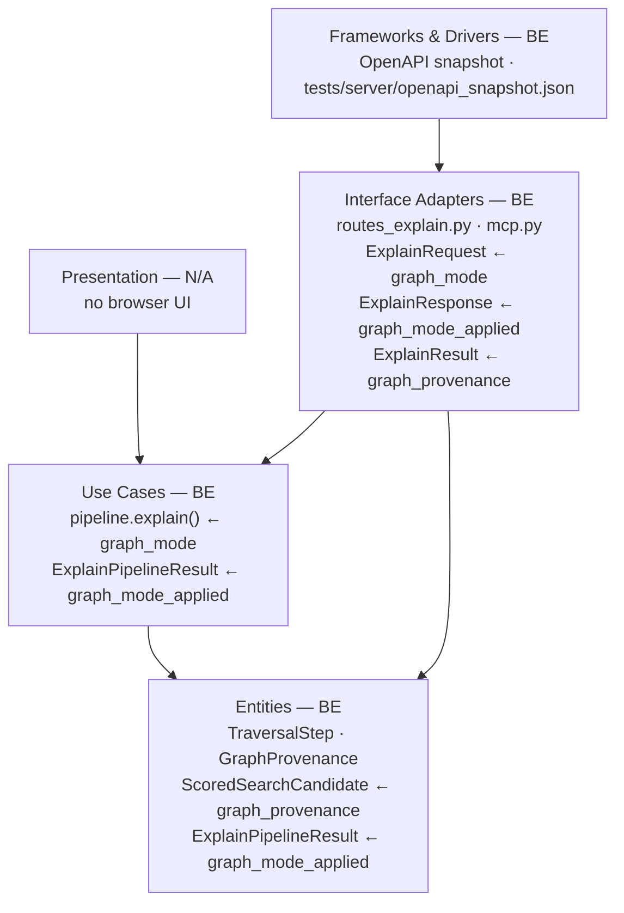
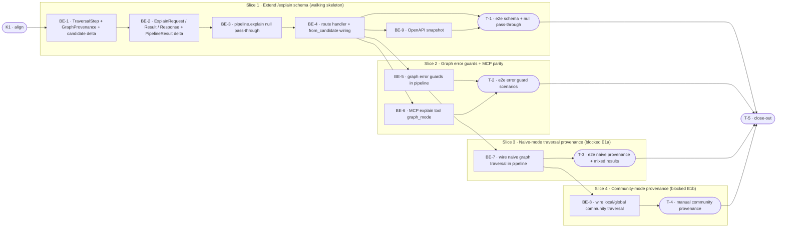

# E1c · Graph-Path Provenance in /explain — Team Plan

> **Prerequisite:** E1a (graph storage, entity extraction, naive traversal) and E1b (community detection, local/global modes) **must be stable before Slice 3 and Slice 4 begin**. Slices 1 and 2 are implementable now; Slices 3–4 are blocked. Assumed E1a artefacts: `GraphStore`, entity resolver (symbol TBD — see Q3), graph traversal function that returns provenance-enriched `ScoredSearchCandidate`. Assumed E1b artefacts: community index, `graph_mode=local/global` on `/search`.

**How to read this file**
- **Architecture approach:** Clean Architecture (default). **Layers:** Presentation · Use Cases · Interface Adapters · Entities · Frameworks & Drivers. Each task's first sub-bullet names the layer it touches.
- The **Frontend, Backend, and Tester** sections are the **depth view** — each role's work, grouped by layer.
- The **Task Breakdown** is the **order view** — every task is a single-role checkbox in execution order, opening with a dependency graph.
- **Phases are vertical slices**: each delivers a working end-to-end increment, not a horizontal layer. No separate "integrate" phase. Sliced with the **`vertical-slicer` skill**.
- Each task carries the **role tag at the end of its title line**, then sub-bullets: **layer · estimate** (decimal hours), **needs · completes**, and a **Tests** block. **needs** = predecessor tasks; **completes** = the scenario `S#` it makes true, or the contract `C#` it realises.
- **Tests** are tagged by level. **Unit and integration tests belong to the implementing dev** (test-first); **e2e and manual tests are the tester's tasks**. The close-out task writes no tests.
- **Contracts** are logical: C1 is authored as a TypeSpec HTTP service in `api-contracts/e1c-explain-graphprovenance-contract.tsp` with an emitted `api-contracts/e1c-explain-graphprovenance-contract.openapi.yaml`. C2 is a core-construct `.tsp` at `e1c-pipeline-explain-contract.tsp`.
- **Role tags** (`#backend-role`, `#tester-role`) mark each task and each role-owned section.
- IDs (`S#`, `C#`, `BE-#`, `T-#`, `K#`, `Q#`) are the traceability thread.
- **Rule:** edit your own tasks freely; change a contract only by team agreement.

---

## Background

`POST /explain` is operators' go-to debug tool for retrieval quality. When `graph_mode` is active on `/search` (E1a/E1b), each result may have been reached through a traversal chain — query entity → graph edges → chunk — that is currently invisible. Operators cannot tell why a specific chunk appeared, making it impossible to tune entity extraction or community parameters.

---

## Goal

`POST /explain` accepts `graph_mode` and returns a `graph_provenance` block on each graph-retrieved result showing the full traversal chain as a unified `list[TraversalStep]`. A response-level `graph_mode_applied` field confirms which mode was active. Non-graph results carry `graph_provenance: null`.

---

## Scope

### In Scope
- `graph_mode: Literal["naive", "local", "global"] | None = None` added to `ExplainRequest` (default None — caller opts in explicitly)
- `graph_mode_applied: Literal["naive", "local", "global"] | None` added to `ExplainResponse`
- `graph_provenance: GraphProvenance | None` added to `ExplainResult` (null for non-graph chunks)
- New Pydantic entities: `TraversalStep`, `GraphProvenance`
- `TraversalStep` fields: `entity: str`, `entity_id: str`, `relationship: str | None`, `community_id: str | None`, `chunk_id: str | None`; at least one of relationship/community_id/chunk_id must be set (Pydantic validator)
- Validation errors `graph_not_enabled` (plain string detail, no `code` field) and `graph_communities_not_built` (structured `code` field) — route-layer guards in `routes_explain.py` and `mcp.py`, matching the `/search` pattern
- `graph_mode_applied` semantics: set to the mode the pipeline ATTEMPTED to execute (not whether it yielded results). `graph_mode_applied=null` only when `graph_mode=null` was requested. When `graph_mode` is non-null, `hyde_applied` and `rag_fusion_applied` are `False`
- `graph_mode` with multi-collection fanout (`collections=["a","b"]`) → 422 — single-collection only for E1c
- `graph_mode` added to MCP `explain` tool in `mcp.py`
- OpenAPI snapshot regenerated
- Changelog entry

### Out of Scope
- Provenance on `near_misses` — consistent with their existing reduced schema (no `text`)
- Versioned `/v2/explain` endpoint — additive response fields are non-breaking
- Graph visualisation or interactive path explorer — E8 admin UI
- `graph_mode` on `POST /search` response schema changes — provenance lives in `/explain` only
- Implementing the graph layer (GraphStore, entity resolver, traversal algorithms) — E1a/E1b deliverables

---

## Acceptance criteria

- [ ] `POST /explain` with `graph_mode=null` (or omitted) returns the exact same response as today — zero behaviour change for non-graph callers
- [ ] `POST /explain` with `graph_mode="naive"` returns `graph_mode_applied="naive"` and `graph_provenance` populated on each graph-retrieved result
- [ ] `POST /explain` with `graph_mode="local"` or `"global"` returns community traversal steps with `community_id` set
- [ ] Standard hybrid-search results in the same response carry `graph_provenance: null`
- [ ] `graph_mode` requested but graph not enabled → 422 with plain string detail: `"graph_mode requires [graph] enabled=true in server config"` (no `code` field) — route-layer guard (inline check in `routes_explain.py`)
- [ ] `graph_mode=local/global` but communities not built → 422 with `code: "graph_communities_not_built"` — pipeline exception (`GraphCommunitiesNotBuiltError`) caught at the route layer
- [ ] `graph_mode` with multi-collection (`collections=[]`) returns 422 — single-collection only for E1c
- [ ] `TraversalStep` with all-null optional fields → Pydantic validation error
- [ ] Near misses carry no `graph_provenance` field (omission by design)
- [ ] MCP `explain` tool accepts `graph_mode` and surfaces `graph_provenance` in its result dict
- [ ] OpenAPI snapshot updated; `tests/server/test_openapi_snapshot.py` passes

---

## What does NOT change

- `ExplainNearMiss` schema — no provenance, consistent with its existing reduced contract
- Standard hybrid-search path in `pipeline.explain()` — non-graph candidates continue to set `graph_provenance: None`
- All existing `/explain` error codes and HTTP status codes (404, 422, 500, 503)
- `/search` response schema — provenance is explain-only
- Telemetry entry factory — no `query` parameter, per structural invariant
- Guard pattern mirrors `/search`: `graph_not_enabled` and multi-collection rejection are route-layer guards (inline checks in `routes_explain.py` and `mcp.py`); `graph_communities_not_built` is a pipeline exception (`GraphCommunitiesNotBuiltError`) caught at the route layer

---

## Known limitations / accepted trade-offs

- Empty traversal path (`steps: []`) is returned as-is rather than surfacing an error — signals a graph-layer bug to the operator without masking it
- Near-miss provenance deferred to a future iteration — the near-miss schema is effectively frozen for E1c
- `TraversalStep.relationship` is a free string (USES, DEPENDS_ON, etc.) — no enum constraint in E1c; relationship vocabulary is owned by E1a and may evolve

---

## Approach & architecture

E1c is a pure **threading exercise**: new types are defined at the Entities layer, the Use Cases layer passes `graph_mode` to the graph retrieval function (E1a/E1b artefact) and carries back provenance-enriched candidates, and the Interface Adapters layer maps them to the HTTP/MCP response schema. No new Frameworks & Drivers components are introduced by E1c itself.

**Layer map (and role mapping)**

| Layer | Role | Components |
|-------|------|-----------|
| Presentation | **Frontend** | N/A |
| Use Cases | Backend | `pipeline.explain()` — adds `graph_mode` param, calls graph layer, returns `graph_mode_applied` |
| Interface Adapters | Backend | `routes_explain.py` (`ExplainRequest`, `ExplainResponse`, `ExplainResult`); `mcp.py` `explain` tool |
| Entities | Backend | `TraversalStep`, `GraphProvenance` (new); `ScoredSearchCandidate.graph_provenance` field; `ExplainPipelineResult.graph_mode_applied` field |
| Frameworks & Drivers | Backend | `tests/server/openapi_snapshot.json` (regenerate) |

**What changes**
- `archon_search/server/routes_explain.py` — `ExplainRequest`, `ExplainResult`, `ExplainResponse`, route handler (`explain_endpoint`)
- `archon_search/_diagnostics.py` — `ScoredSearchCandidate` (add `graph_provenance`)
- `archon_search/pipeline.py` — `ExplainPipelineResult` (add `graph_mode_applied`), `explain()` method signature + dispatch
- `archon_search/server/mcp.py` — `explain` MCP tool signature + result mapping

**Layer seam note**
`TraversalStep` and `GraphProvenance` are defined as **dataclasses** in `archon_search/_diagnostics.py` alongside `ScoredSearchCandidate`. Corresponding Pydantic response models `TraversalStepResponse` and `GraphProvenanceResponse` (or the same names with `model_config = ConfigDict(from_attributes=True)`) live in `archon_search/server/routes_explain.py` alongside `ExplainResult`, `ExplainScoreBreakdown`, and the other explain-specific Pydantic models. `from_candidate()` on `ExplainResult` maps the dataclass `GraphProvenance` to the Pydantic response model. Do NOT put them in `schemas.py` (wrong file for explain-specific types) or `graph_types.py` (Entity-layer graph dataclasses, not provenance types).

**Key decisions (from the brief)**
- Unified `list[TraversalStep]` for all graph modes (naive + community) avoids client-side branching
- Response-level `graph_mode_applied` mirrors `hyde_applied` / `rag_fusion_applied` — one field, no result scanning required
- No provenance on near misses — secondary diagnostics; schema cost outweighs debugging value
- Additive change, no version bump — new response fields are non-breaking under HTTP conventions

---

## Contracts / seams

Boundaries where roles must agree. **Logical, not code.** Changing one requires team agreement.

**Contract tooling used:** TypeSpec is available (v1.13.0). C1 is authored as a TypeSpec HTTP service with an emitted `openapi.yaml`. C2 is an internal logical seam compiled as a core-construct `.tsp`.

---

**C1 — POST /explain HTTP wire contract** *(client ↔ server)*
New `graph_mode` input field; new `graph_mode_applied` + `graph_provenance` output fields; two new 422 error bodies (`graph_not_enabled`, `graph_communities_not_built`). Non-graph callers (`graph_mode: null`) see no behavioural change — existing fields unchanged, `graph_mode_applied: null`, all `graph_provenance: null`.
- See [`api-contracts/e1c-explain-graphprovenance-contract.tsp`](api-contracts/e1c-explain-graphprovenance-contract.tsp) + [`api-contracts/e1c-explain-graphprovenance-contract.openapi.yaml`](api-contracts/e1c-explain-graphprovenance-contract.openapi.yaml)
- Realised by: BE-1, BE-2, BE-3, BE-4 · Verified by: BE-2 (integration), BE-4 (integration), T-1, T-2

**C2 — Pipeline explain() ↔ route handler internal seam** *(Use Cases → Interface Adapters)*
`pipeline.explain()` gains a `graph_mode` kwarg. It returns `ExplainPipelineResult` with a new `graph_mode_applied` field; each `ScoredSearchCandidate` in `top_results` carries `graph_provenance: GraphProvenance | None`. The route handler reads `result.graph_mode_applied` and each `candidate.graph_provenance`, then maps them to the HTTP response via `ExplainResult.from_candidate()`.
- See [`e1c-pipeline-explain-contract.tsp`](e1c-pipeline-explain-contract.tsp)
- Realised by: BE-3, BE-4 · Verified by: BE-3 (integration), BE-4 (integration), T-1

**C3 — Graph layer ↔ pipeline explain (placeholder — blocked on E1a/E1b)**
Once E1a ships, the graph retrieval function returns `ScoredSearchCandidate` instances with `graph_provenance` already populated. E1c's `pipeline.explain()` calls this function when `graph_mode` is set. The exact symbol name, call signature, and return type are defined by E1a — confirm with the E1a team before BE-7 starts (see Q3).
- Contract `.tsp` deferred until E1a symbol is confirmed.
- Realised by: BE-7, BE-8 · Verified by: T-3, T-4

---

## Scenarios #tester-role

| id | Scenario (Given / When / Then) |
|----|-------------------------------|
| **S1** | **Given** a valid query and `graph_mode` omitted (or null) · **When** `POST /explain` is called · **Then** response is identical to pre-E1c: `graph_mode_applied: null`, all `graph_provenance: null`, no behaviour change |
| **S2** | **Given** graph is enabled, E1a deployed, valid query, `graph_mode: "naive"` · **When** `POST /explain` is called · **Then** graph-retrieved results carry `graph_provenance` with at least one `TraversalStep`; `graph_mode_applied: "naive"` on response root |
| **S3** | **Given** graph is enabled, E1b deployed + communities built, `graph_mode: "local"` · **When** `POST /explain` is called · **Then** results carry community traversal steps with `community_id` populated; `graph_mode_applied: "local"` |
| **S4** | **Given** graph is enabled, E1b deployed + communities built, `graph_mode: "global"` · **When** `POST /explain` is called · **Then** results carry global community traversal steps; `graph_mode_applied: "global"` |
| **S5** | **Given** graph is NOT enabled, `graph_mode: "naive"` requested · **When** `POST /explain` is called · **Then** 422 response with plain string detail: `"graph_mode requires [graph] enabled=true in server config"` (no `code` field) |
| **S6** | **Given** graph is enabled but communities NOT built, `graph_mode: "local"` or `"global"` (both tested) requested · **When** `POST /explain` is called · **Then** 422 response with `code: "graph_communities_not_built"` |
| **S7** | **Given** graph is enabled, mixed query that matches both graph-retrieved and standard hybrid chunks · **When** `POST /explain` is called with `graph_mode: "naive"` · **Then** graph-retrieved results carry `graph_provenance`, standard hybrid results carry `graph_provenance: null`; both appear in the same `results[]` |
| **S8** | **Given** a chunk is reachable both by graph traversal and standard hybrid search · **When** `POST /explain` is called with `graph_mode: "naive"` · **Then** the chunk appears once with `graph_provenance` populated (graph provenance takes precedence) |
| **S9** | **Given** a valid query with `graph_mode: "naive"` that produces near misses · **When** `POST /explain` is called · **Then** near misses carry no `graph_provenance` field — schema omission is intentional |
| **S10** | **Given** a `TraversalStep` payload where `relationship`, `community_id`, and `chunk_id` are all null · **When** submitted in a request or produced by the pipeline · **Then** Pydantic validation error — degenerate steps are rejected |
| **S11** | **Given** a graph-retrieval bug that produces an empty traversal path · **When** `POST /explain` is called · **Then** `graph_provenance: { steps: [] }` is returned (not null) — signals the bug without masking graph retrieval |
| **S12** | **Given** `graph_mode: "naive"` requested, MCP `explain` tool called · **When** the tool returns · **Then** result dict contains `graph_mode_applied` and each result item contains `graph_provenance` |
| **S13** | **Given** `graph_mode: null` explicitly set · **When** `POST /explain` is called · **Then** `graph_mode_applied: null`; standard explain runs; behaviour identical to S1 |
| **S14** | **Given** `graph_mode: "naive"` and `collections: ["a", "b"]` (multi-collection fanout) · **When** `POST /explain` is called · **Then** 422 response — `graph_mode` with multi-collection is not supported in E1c |
| **S15** | **Given** `graph_mode: "naive"` and `hyde: true` in the same request · **When** `POST /explain` is called · **Then** response.hyde_applied=False (HyDE silently ignored; graph_mode takes precedence); response.graph_mode_applied="naive" |

---

## Frontend — Presentation #frontend-role

N/A — no frontend work for this feature. This project has no browser UI. The CLI has no `explain` subcommand. All user-facing surface is the REST API and the MCP `explain` tool (both are backend-owned Interface Adapters).

---

## Backend — Entities · Use Cases · Interface Adapters · Frameworks & Drivers #backend-role

**Scope:** Adds new Pydantic entity types (`TraversalStep`, `GraphProvenance`), extends existing types (`ScoredSearchCandidate`, `ExplainPipelineResult`, `ExplainRequest`, `ExplainResult`, `ExplainResponse`), threads `graph_mode` through the pipeline, and adds error guards. Writes unit and integration tests for all tasks.

**Owns layers:** Entities, Use Cases, Interface Adapters, Frameworks & Drivers.

**Tasks by layer** *(checkable in the Task Breakdown)*
- Entities: BE-1 (TraversalStep, GraphProvenance + ScoredSearchCandidate delta), BE-2 (ExplainRequest/Result/Response + ExplainPipelineResult delta)
- Use Cases: BE-3 (pipeline.explain() null pass-through), BE-5 (error guards), BE-7 (naive traversal wiring — blocked E1a), BE-8 (community traversal wiring — blocked E1b)
- Interface Adapters: BE-4 (route handler + from_candidate()), BE-6 (MCP explain tool)
- Frameworks & Drivers: BE-9 (OpenAPI snapshot)

**Done when**
- [ ] `POST /explain` with `graph_mode=null` behaves identically to today — S1, S13
- [ ] `graph_provenance` and `graph_mode_applied` fields present and null on all non-graph results — S1
- [ ] Error guards return correct 422 codes — S5, S6
- [ ] MCP `explain` accepts `graph_mode` and surfaces provenance — S12
- [ ] Naive and community traversal provenance flows through to response — S2, S3, S4, S7, S8 (after E1a/E1b)
- [ ] OpenAPI snapshot up to date

---

## Tester #tester-role

**Scope:** the tester owns **e2e and manual** tests plus the project **close-out**. **Unit and integration** tests belong to the implementing dev, in each implementation task's `Tests` block.

**Tasks** *(checkable in the Task Breakdown)*
- T-1: E2e — schema extension + null pass-through scenarios (Slice 1)
- T-2: E2e — graph error guard scenarios (Slice 2)
- T-3: E2e — naive mode traversal provenance (Slice 3, blocked on E1a)
- T-4: Manual — community mode traversal provenance (Slice 4, blocked on E1b)
- T-5: Close-out

**Allocation** — each scenario at the cheapest level that proves it *(unit + integration are dev-written; e2e + manual are the tester's tasks)*

| Scenario | Cheapest level |
|----------|----------------|
| S1 — null graph_mode → no behaviour change | integration (dev) |
| S2 — naive mode provenance populated | e2e (tester, blocked on E1a) |
| S3 — local mode community traversal | manual (tester, blocked on E1b) |
| S4 — global mode community traversal | manual (tester, blocked on E1b) |
| S5 — graph_not_enabled 422 | integration (dev) |
| S6 — graph_communities_not_built 422 | integration (dev) |
| S7 — mixed results (graph + hybrid) | e2e (tester, blocked on E1a) |
| S8 — dedup: graph provenance wins | unit (dev) |
| S9 — near misses carry no provenance | unit (dev) |
| S10 — TraversalStep all-null → Pydantic error | unit (dev) |
| S11 — empty steps: [] returned not null | unit (dev) |
| S12 — MCP explain with graph_mode | e2e (tester, blocked on E1a) |
| S13 — graph_mode: null explicit → same as omitted | integration (dev) |
| S14 — graph_mode + multi-collection → 422 | integration (dev) |
| S15 — graph_mode + hyde=True → hyde_applied=False | integration (dev) |

---

## Documentation update

Docs the feature touches — the close-out task works through this list. List only real files.

- [ ] `Documentation/Backlog/e1c-graphrag-explain-provenance-brief.md` — no changes needed (source brief)
- [ ] `Documentation/Backlog/e1c-graphrag-explain-provenance-team-plan.md` — this file
- [ ] `Documentation/Architecture/600_api_reference_or_public_interface.md` — add `graph_mode` to `/explain` input table; add `graph_mode_applied`, `graph_provenance` to output table; add `TraversalStep` + `GraphProvenance` schema tables; add two new 422 error codes
- [ ] `Documentation/Architecture/110_component_catalog_and_layer_breakdown.md` — annotate `routes_explain.py`, `pipeline.py`, `_diagnostics.py`, `mcp.py` with E1c delta
- [ ] `Documentation/Architecture/100_system_architecture_overview.md` — note graph provenance as part of explain pipeline in the flow description if graph_mode is mentioned
- [ ] `Documentation/UserManual/` — if an explain endpoint reference exists, update with graph_mode parameter and provenance fields
- [ ] `CLAUDE.md` — update `routes_explain.py` and `pipeline.py` module bullets with E1c fields (`graph_mode`, `graph_provenance`, `graph_mode_applied`)
- [ ] `tests/server/openapi_snapshot.json` — regenerate with `uv run --python 3.12 pytest tests/server/test_openapi_snapshot.py --update-openapi-snapshot`
- [ ] `archon_search/server/routes_explain.py` inline comments / docstrings — no separate doc update needed (source of truth)
- [ ] `learnings.md` — post-implementation observations

---

## Open questions

| id | Area | Question |
|----|------|---------|
| **Q1** | Schema | Should `ExplainNearMiss` gain `graph_provenance` in a future iteration, or is the near-miss schema frozen? Decide before E1c ships to avoid a follow-up schema bump. Brief recommendation: treat it as frozen for E1c. |
| **Q2** | Error codes | Is `graph_not_enabled` a 422 (request validation error) or a 503 (service dependency missing)? Brief says "validation error" → 422, matching the `hyde` package-missing pattern. Confirm alignment with E1a team. |
| **Q3** | E1a artefact | What is the exact symbol name and call signature of the E1a graph retrieval function that `pipeline.explain()` will call? Required before BE-7 can start. |

**Resolved in this revision:**
- "Should `graph_mode` default to `None` or mirror `/search`?" → `None` by default; caller opts in explicitly, consistent with `hyde` and `rag_fusion`. *(Brief already answered.)*
- **Q4 resolved:** `graph_mode` is orthogonal to `hyde` and `rag_fusion` on `/explain`. When `graph_mode=local/global`, the pipeline enters the graph retrieval path that does not use HyDE vectors or RAG Fusion sub-queries. `hyde_applied` and `rag_fusion_applied` MUST be set to `False` when `graph_mode` is non-null — callers must not receive a misleading `hyde_applied=True` when HyDE was silently ignored. This invariant is enforced in BE-3 and BE-4.
- **Q5 resolved:** `graph_mode` is **rejected** with a 422 when `collections` (multi-collection fanout) is also specified. Each collection has independent graph tables; cross-collection graph merge is out of scope for E1c. The single-collection path supports `graph_mode`; the multi-collection fanout path returns 422 with a clear error code (see BE-5, S14). Deferred to E1c+ for multi-collection graph support.
- **Q6 resolved:** No new `stage_timings_ms` keys are added for graph traversal in E1c. Stage timing for graph lookup and entity resolution is deferred to E1d (observability sprint) when real graph call performance can be measured. BE-3 does not add graph timing keys.

---

## Task Breakdown

Single-role tasks in execution order, grouped into **vertical slices**.

### Dependency graph

---

### Phase 0 · Kickoff *(prerequisite; one cross-cutting step)*

- [x] **K1** — Agree contracts (C1, C2), resolve Q2/Q6, confirm E1a/E1b prerequisite gate (Q4 and Q5 resolved in this revision) #team
    - — · 1.0h
    - agrees C1, C2
    - Tests

---

### Phase 1 · Extend /explain schema for graph provenance *(walking skeleton: thinnest end-to-end path; carries entity + pipeline delta; all provenance null)*

- [x] **BE-1** — Add `TraversalStep`, `GraphProvenance` dataclasses; add `graph_provenance: GraphProvenance | None = None` field to `ScoredSearchCandidate` in `_diagnostics.py` #backend-role
    - `TraversalStep` and `GraphProvenance` are defined as **dataclasses** in `archon_search/_diagnostics.py` alongside `ScoredSearchCandidate`. This keeps the Entity layer dependency-free from Interface Adapters. Corresponding Pydantic response models `TraversalStepResponse` and `GraphProvenanceResponse` (or the same names with `model_config = ConfigDict(from_attributes=True)`) go in `archon_search/server/routes_explain.py` alongside `ExplainResult`, `ExplainScoreBreakdown`, and the other explain-specific Pydantic models — where ALL other explain Pydantic models live. `from_candidate()` on `ExplainResult` maps the dataclass `GraphProvenance` to the Pydantic response model. Do NOT put them in `schemas.py` (wrong file for explain-specific types) or `graph_types.py` (Entity-layer graph dataclasses, not provenance types).
    - Entities · 2.0h
    - needs K1 · completes C1 (partial), C2 (partial)
    - Tests
        - #unit_test — `test_traversal_step_valid_naive` — entity + relationship set, community_id/chunk_id null → valid
        - #unit_test — `test_traversal_step_valid_community` — entity + community_id set, relationship null → valid
        - #unit_test — `test_traversal_step_terminal_step` — entity + chunk_id set → valid
        - #unit_test — `test_traversal_step_all_null_optionals_rejected` — relationship/community_id/chunk_id all null → Pydantic ValidationError (S10)

- [x] **BE-2** — Add `graph_mode: Literal["naive","local","global"] | None = None` to `ExplainRequest`; add `graph_provenance: GraphProvenance | None = None` to `ExplainResult` and update `from_candidate()`; add `graph_mode_applied: Literal["naive","local","global"] | None = None` to `ExplainResponse` and `from_pipeline_result()`; add `graph_mode_applied` field to `ExplainPipelineResult` dataclass in `pipeline.py` #backend-role
    - Update or remove `test_post_explain_graph_mode_422` in `tests/server/test_e1a_fe2_routes_search_graph_mode.py` — this test currently asserts that `graph_mode` on `/explain` returns 422 because it's an unknown field; once BE-2 adds `graph_mode` to `ExplainRequest`, the test must be updated to test a different invalid value (e.g. `graph_mode="NAIVE"` wrong case) instead.
    - Entities · 2.5h
    - needs BE-1 · completes C1 (partial), C2
    - Tests
        - #unit_test — `test_explain_request_graph_mode_defaults_none` — omitting graph_mode → field is None
        - #unit_test — `test_explain_request_invalid_graph_mode_rejected` — `ExplainRequest(graph_mode="invalid")` → Pydantic ValidationError
        - #unit_test — `test_explain_result_from_candidate_no_provenance` — ScoredSearchCandidate with graph_provenance=None → ExplainResult.graph_provenance is None
        - #unit_test — `test_explain_result_from_candidate_with_provenance` — ScoredSearchCandidate with populated GraphProvenance → ExplainResult.graph_provenance matches (general provenance happy path)
        - #unit_test — `test_explain_result_from_candidate_empty_steps_preserved` — ScoredSearchCandidate with GraphProvenance(steps=[]) → ExplainResult.graph_provenance is not None; graph_provenance.steps == [] (empty list, NOT coerced to null) (S11)
        - #unit_test — `test_explain_response_graph_mode_applied_null` — ExplainResponse.from_pipeline_result with graph_mode_applied=None → field is None
        - #integration_test — `test_explain_schemas_extra_forbid_graph_mode` — ExplainRequest rejects unknown fields per extra="forbid"
        - #integration_test — `test_explain_route_invalid_graph_mode_returns_422` — POST /explain with `graph_mode="NAIVE"` (wrong case) → 422

- [x] **BE-3** — Add `graph_mode: Literal["naive","local","global"] | None = None` parameter to `pipeline.explain()`; set `graph_mode_applied` in returned `ExplainPipelineResult`; all candidates keep `graph_provenance=None` in the null pass-through path (before E1a wiring). **Invariant:** when `graph_mode` is non-null, the pipeline's `graph_mode` path does not call `_rag_fusion_search`; ensure `ExplainPipelineResult.rag_fusion_applied=False` in this path. Note: `hyde_applied` is NOT returned by the pipeline — it is computed by the route handler. BE-4 is responsible for setting `hyde_applied=False` in the response when `graph_mode` is non-null #backend-role
    - Use Cases · 2.5h
    - needs BE-2 · completes C2, S1, S13
    - Tests
        - #unit_test — `test_pipeline_explain_graph_mode_none_returns_null_applied` — graph_mode=None → result.graph_mode_applied is None
        - #unit_test — `test_pipeline_explain_graph_mode_naive_stub_returns_applied` — graph_mode="naive" with stub graph layer → result.graph_mode_applied="naive", all candidates have graph_provenance=None (stub pre-E1a)
        - #unit_test — `test_pipeline_explain_graph_mode_sets_rag_fusion_applied_false` — graph_mode="naive" → result.rag_fusion_applied=False (graph_mode path does not call `_rag_fusion_search`). Note: hyde_applied is not pipeline-owned; it is enforced in BE-4 by the route handler.
        - #unit_test — `test_explain_result_from_candidate_graph_provenance_round_trip` — Construct a `ScoredSearchCandidate` with a non-null `GraphProvenance(steps=[TraversalStep(entity="E", entity_id="abc123", chunk_id="chunk1")])`; pass through `ExplainResult.from_candidate()`; verify `ExplainResult.graph_provenance` is populated and serializes correctly to JSON
        - #integration_test — `test_pipeline_explain_graph_mode_none_real_pipeline` — real SearchPipeline with graph_mode=None → result identical to pre-E1c explain call; graph_mode_applied is None

- [ ] **BE-4** — Update `explain_endpoint()` in `routes_explain.py` to pass `graph_mode=body.graph_mode` to the relevant `pipeline.explain()` call site; set `graph_mode_applied=result.graph_mode_applied` in `ExplainResponse.from_pipeline_result()` at both response construction sites. Wire `graph_mode=body.graph_mode` to the single-collection call site (~line 525) only. Do NOT wire it to the multi-collection call site (~line 397) — BE-5 will add a guard that rejects `graph_mode` + `body.collections` before the multi-collection pipeline call, making `graph_mode` on that path unreachable dead code. Leave the multi-collection `pipeline.explain()` call unchanged (it defaults to `graph_mode=None`). Of the four call sites referenced in this feature: (1) `routes_explain.py` single-collection path (~line 525) — wired in BE-4; (2) `routes_explain.py` multi-collection fanout path (~line 397) — NOT wired here; BE-5 guards against this path instead; (3) `mcp.py` multi-collection path (~line 774) — BE-6's responsibility; (4) `mcp.py` single-collection path (~line 880) — BE-6's responsibility. So BE-4 only wires to 1 call site in `routes_explain.py`. **Invariant (from BE-3):** when `body.graph_mode is not None`, pass `hyde_applied=False` to `ExplainResponse.from_pipeline_result()` regardless of what `resolve_hyde_vector()` returned — HyDE cannot run alongside graph_mode #backend-role
    - Interface Adapters · 2.0h
    - needs BE-3 · completes C1, S1, S13, S9
    - Tests
        - #unit_test — `test_explain_endpoint_graph_mode_none_forwarded` — body.graph_mode=None → pipeline.explain called with graph_mode=None; response.graph_mode_applied=None
        - #unit_test — `test_explain_endpoint_graph_mode_naive_forwarded` — body.graph_mode="naive" → pipeline.explain called with graph_mode="naive"; response.graph_mode_applied="naive"
        - #unit_test — `test_near_miss_no_graph_provenance_field` — ExplainNearMiss schema has no graph_provenance attribute (S9)
        - #integration_test — `test_explain_route_graph_mode_null_response_structure` — real app + TestClient; POST /explain with graph_mode=null → 200; response fields graph_mode_applied=null; all result.graph_provenance=null
        - #integration_test — `test_explain_route_graph_mode_and_hyde_true_returns_hyde_applied_false` — POST /explain graph_mode="naive" + hyde=True → 200; response.hyde_applied=False; response.graph_mode_applied="naive" (S15)

- [ ] **BE-9** — Regenerate `tests/server/openapi_snapshot.json` to include new ExplainRequest/ExplainResponse fields #backend-role
    - Frameworks & Drivers · 0.5h
    - needs BE-4 · completes (snapshot gate)
    - Tests
        - #integration_test — `test_openapi_snapshot` — run `tests/server/test_openapi_snapshot.py` with `--update-openapi-snapshot`; verify snapshot diff contains graph_mode, graph_mode_applied, graph_provenance, TraversalStep, GraphProvenance

- [ ] **T-1** — E2e smoke — schema extension + null pass-through #tester-role
    - — · 2.0h
    - needs BE-4, BE-9 · completes S1, S13
    - Tests
        - #e2e_test — `test_explain_graph_mode_omitted_response_unchanged` — real deployed app; POST /explain without graph_mode; assert response identical to pre-E1c (no new fields break existing callers); graph_mode_applied is null
        - #e2e_test — `test_explain_graph_mode_null_explicit_response_unchanged` — POST /explain with graph_mode: null explicitly; same assertion as above (S13)

---

### Phase 2 · Guard graph errors and add MCP parity

- [ ] **BE-5** — Add guards for graph error conditions, split by what information is needed. Route-layer guards (inline checks in `routes_explain.py` and `mcp.py`): (1) `graph_not_enabled` — `if body.graph_mode is not None and not config.graph.enabled:` → `JSONResponse(status_code=422, content={"detail": "graph_mode requires [graph] enabled=true in server config"})` — plain string, no `code` field, matching `/search` exactly; (2) `graph_mode_with_collections` (S14) — `if body.graph_mode is not None and body.collections is not None:` → 422. Pipeline exception caught at route layer (matching `/search` pattern): (3) `graph_communities_not_built` — reuse the existing `GraphCommunitiesNotBuiltError` exception from `pipeline.py` — the pipeline raises it when `graph_mode=local/global` and communities are not built; add `except GraphCommunitiesNotBuiltError` handlers in `routes_explain.py` and `mcp.py`, matching the pattern in `routes_search.py` (~line 196); return 422 with structured `{"detail": {"code": "graph_communities_not_built", "message": "..."}}` body. Add `except GraphCommunitiesNotBuiltError` handlers to BOTH call sites in `routes_explain.py`: (1) the multi-collection fanout path (~line 397) AND (2) the single-collection path (~line 525), matching the dual-handler pattern already used in `routes_search.py` (lines ~196 and ~339). An implementer who adds only one handler will pass all current tests since tests don't target a specific call site — explicitly name both. #backend-role
    - Interface Adapters · 2.0h
    - needs BE-4 · completes S5, S6, S14
    - Tests
        - #integration_test — `test_explain_route_graph_not_enabled_returns_422` — real TestClient; POST /explain with graph_mode="naive" + graph disabled in config → 422; body.detail is a plain string `"graph_mode requires [graph] enabled=true in server config"` (no `code` field) (S5)
        - #integration_test — `test_explain_route_communities_not_built_returns_422` — graph_mode="local" + communities not built → 422; body.detail.code == "graph_communities_not_built" (S6)
        - #integration_test — `test_explain_route_communities_not_built_global_returns_422` — graph_mode="global" + communities not built → 422; body.detail.code == "graph_communities_not_built" (S6)
        - #integration_test — `test_explain_route_graph_mode_with_collections_rejected_422` — POST /explain with graph_mode="naive" + collections=["a","b"] → 422 (S14)

- [ ] **BE-6** — Add `graph_mode: str | None = None` parameter to MCP `explain` tool in `mcp.py`; forward it to the single-collection `pipeline.explain()` call site (~line 880) only; include `graph_mode_applied` and per-result `graph_provenance` in the returned dict. The multi-collection path (~line 774) gets the rejection guard, not forwarding — return an error result when `graph_mode is not None and collections is not None`. Add `_VALID_GRAPH_MODES` validation in the MCP explain tool, mirroring the validation at `mcp.py` search tool (~line 272) — reject invalid values with a structured error result before calling the pipeline. MCP guard responses use `McpErrorResponse` (matching the MCP search tool's pattern at ~line 277), NOT `JSONResponse`. The error code format differs from REST: MCP uses `code="graph_disabled"` (matching the existing MCP search tool), REST uses a plain string detail. Add `except GraphCommunitiesNotBuiltError` handler to the MCP explain single-collection try/except block (~line 880), returning `McpErrorResponse` with the appropriate code, matching the MCP search tool's exception handling pattern (~line 364 in mcp.py). The `GraphCommunitiesNotBuiltError` is raised by the pipeline when `graph_mode=local/global` and communities are not built. #backend-role
    - Interface Adapters · 1.5h
    - needs BE-5 · completes S12
    - Tests
        - #unit_test — `test_mcp_explain_tool_graph_mode_parameter_accepted` — MCP explain tool accepts graph_mode=None and graph_mode="naive" without error
        - #unit_test — `test_mcp_explain_tool_graph_mode_naive_forwarded_single_collection` — mock pipeline.explain; assert call_args.kwargs["graph_mode"] == "naive" on single-collection path (~line 880)
        - #unit_test — `test_mcp_explain_tool_graph_mode_with_collections_rejected` — MCP explain tool; graph_mode="naive" + collections=["a","b"] → error result with code for multi-collection not supported (not a pipeline call)
        - #unit_test — `test_mcp_explain_tool_invalid_graph_mode_rejected` — MCP explain with graph_mode="invalid" → error result (via `_VALID_GRAPH_MODES` validation, no pipeline call)
        - #unit_test — `test_mcp_explain_graph_not_enabled_returns_error` — MCP explain tool with graph_mode="naive" + graph disabled → McpErrorResponse with code "graph_disabled" (matching MCP search tool pattern at mcp.py ~line 277)
        - #unit_test — `test_mcp_explain_communities_not_built_returns_error` — MCP explain tool with graph_mode="local" + no communities → McpErrorResponse with code for communities not built
        - #integration_test — `test_mcp_explain_graph_mode_none_result_dict` — real TestClient MCP call; graph_mode=None → result dict contains graph_mode_applied=null; all result items have graph_provenance=null (S12 partial — full requires E1a)

- [ ] **T-2** — E2e — graph error guard scenarios #tester-role
    - — · 1.5h
    - needs BE-5, BE-6 · completes S5, S6
    - Tests
        - #e2e_test — `test_explain_graph_not_enabled_e2e` — real deployed app with graph disabled; POST /explain graph_mode="naive" → 422; assert body.detail is plain string "graph_mode requires [graph] enabled=true in server config" (S5)
        - #e2e_test — `test_explain_communities_not_built_e2e` — real deployed app with E1a but no E1b communities; POST /explain graph_mode="local" → 422; assert body.detail.code=="graph_communities_not_built" (S6)

---

### Phase 3 · Return naive-mode traversal provenance *(blocked on E1a)*

- [ ] **BE-7** — Wire real naive graph traversal in `pipeline.explain()`: when `graph_mode="naive"`, call the E1a graph retrieval function (symbol confirmed via Q3); attach returned `GraphProvenance` to each graph-retrieved `ScoredSearchCandidate`; handle dedup (graph provenance wins over pure hybrid for same chunk); set `graph_mode_applied="naive"` on result #backend-role
    - Use Cases · 4.0h
    - needs BE-5, E1a-stable · completes S2, S7, S8, S11
    - Tests
        - #unit_test — `test_pipeline_explain_naive_graph_provenance_attached` — mock E1a graph retrieval returning two candidates with stub provenance; pipeline.explain with graph_mode="naive" → top_results carry GraphProvenance (S2)
        - #unit_test — `test_pipeline_explain_naive_dedup_graph_wins` — chunk appears in both graph and hybrid candidates; after merge, chunk appears once with graph_provenance populated (S8) *(unit with mocks — see also S7 e2e for real pipeline validation)*
        - #unit_test — `test_pipeline_explain_naive_hybrid_chunks_null_provenance` — non-graph candidates in mixed result → graph_provenance is None (S7)
        - #integration_test — `test_pipeline_explain_naive_real_graph_layer` — real SearchPipeline + stubbed E1a graph layer; graph_mode="naive" → ExplainPipelineResult.graph_mode_applied=="naive"; at least one candidate has non-null graph_provenance

- [ ] **T-3** — E2e — naive mode traversal provenance and mixed results #tester-role
    - — · 2.5h
    - needs BE-7 · completes S2, S7, S8, S12
    - Tests
        - #e2e_test — `test_explain_naive_provenance_e2e` — real deployed app post-E1a; ingest docs; POST /explain graph_mode="naive"; assert results contain at least one item with non-null graph_provenance and valid TraversalStep structure (S2)
        - #e2e_test — `test_explain_naive_mixed_results_e2e` — query that yields both graph and hybrid results; assert graph-retrieved items have graph_provenance, hybrid items have graph_provenance=null (S7)
        - #e2e_test — `test_mcp_explain_naive_provenance_e2e` — MCP explain tool; graph_mode="naive"; assert result dict carries graph_mode_applied and provenance in result items (S12)

---

### Phase 4 · Community-mode traversal provenance *(blocked on E1b)*

- [ ] **BE-8** — Wire `graph_mode="local"` and `"global"` community traversal in `pipeline.explain()`: call the E1b community graph function; populate `community_id` in `TraversalStep`; set `graph_mode_applied` correctly #backend-role
    - Use Cases · 3.0h
    - needs BE-7, E1b-stable · completes S3, S4
    - Tests
        - #unit_test — `test_pipeline_explain_local_community_steps` — mock E1b returning community candidates; TraversalStep has community_id set, relationship null (S3)
        - #unit_test — `test_pipeline_explain_global_community_steps` — same for global mode (S4)
        - #integration_test — `test_pipeline_explain_community_modes_real` — real pipeline + stubbed E1b; (a) graph_mode="local" → graph_mode_applied=="local"; steps carry community_id; (b) graph_mode="global" → graph_mode_applied=="global"; steps carry community_id (S3, S4)

- [ ] **T-4** — Manual — community mode traversal provenance #tester-role
    - — · 3.0h
    - needs BE-8 · completes S3, S4
    - Tests
        - #manual_test — Community local mode provenance — operator ingests a corpus, runs E1b community detection, calls POST /explain graph_mode="local", inspects TraversalStep.community_id values; verifies they match known community assignments (S3)
        - #manual_test — Community global mode provenance — same corpus, graph_mode="global"; verifies global community representative steps appear in TraversalStep chain (S4)

---

### Phase 5 · Close-out

- [ ] **T-5** — Project close-out & acceptance fact-check #tester-role
    - — · 4.0h
    - needs BE-1, BE-2, BE-3, BE-4, BE-5, BE-6, BE-7, BE-8, BE-9, T-1, T-2, T-3, T-4
    - Tests
    - Duties
        - Update all documentation per the "Documentation update" section — `600_api_reference`, `110_component_catalog`, `100_system_architecture_overview`, UserManual, `CLAUDE.md`; move brief + plan to `Documentation/Completed/`.
        - Fix all build / compiler warnings, if any.
        - Run the full test suite (`uv run pytest`); fix every failing test, including any unrelated to this feature.
        - Validate every Acceptance criterion one-by-one with a fact check — no assumptions; confirm each is genuinely done (grep for symbol names, read response payloads, run snapshot test).

**Critical path:** K1 → BE-1 → BE-2 → BE-3 → BE-4 → BE-5 → BE-7 → BE-8 → T-4 → T-5.
