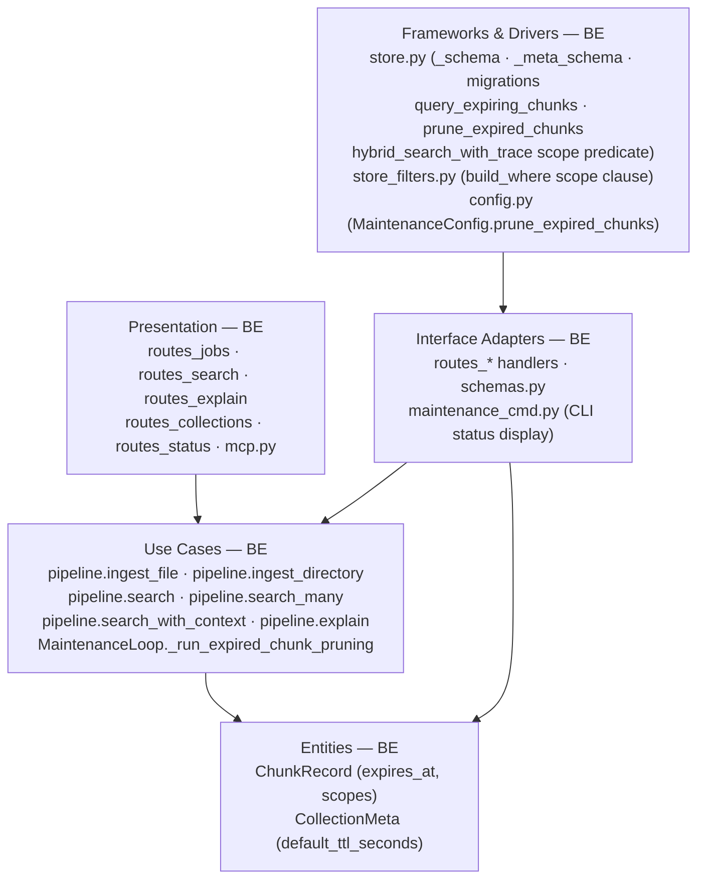
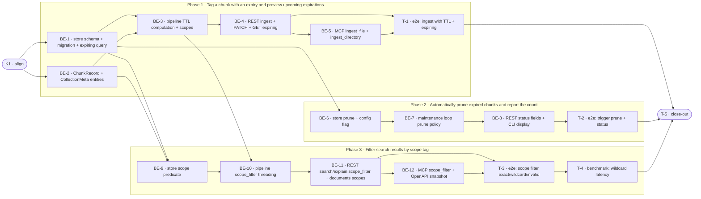

# E2a · TTL and Scoping — Team Plan

**How to read this file**
- **Architecture approach:** Clean Architecture (default). **Layers:** Presentation · Use Cases · Interface Adapters · Entities · Frameworks & Drivers. Each task's first sub-bullet names the layer it touches. Dependencies point inward.
- **Phases are vertical slices**: each delivers a working end-to-end increment, not a horizontal layer. No separate "integrate" phase. Sliced with the **`vertical-slicer` skill**.
- The **Frontend, Backend, and Tester** sections are the **depth view** (role scope + layer tasks). The **Task Breakdown** is the **order view** (single-role checkboxes in execution order with dependency graph).
- Each task: **role tag at end of title**, then sub-bullets `Layer · estimate`, `needs · completes`, and a `Tests` block. **Unit and integration tests belong to the implementing dev** (test-first); **e2e and benchmark belong to the tester**.
- **Contracts** are authored as TypeSpec HTTP service `.tsp` files (HTTP/API seams, with emitted `openapi.yaml`) and one core-construct `.tsp` (internal seam). TypeSpec 1.13.0 compiled all five clean.
- IDs (`S#`, `C#`, `BE-#`/`T-#`/`K#`, `Q#`) are the traceability thread. Never renumber on edits.
- **Rule:** edit your own tasks freely; change a contract only by team agreement.

---

## Background

Every ingested chunk lives forever and is visible to every search in its collection. Callers who need ephemeral session data must implement their own cleanup, and multi-agent/multi-user corpora have no way to isolate per-caller views within a single collection.

---

## Goal

After E2a, every chunk can carry an optional `expires_at` timestamp (computed from `ttl_seconds`) and an optional `scopes` list. The D5 maintenance loop prunes expired chunks automatically. `POST /search` and `POST /explain` accept a `scope_filter` that restricts results to chunks whose scopes match. Neither feature is on by default — existing behaviour is unchanged for callers that omit both fields.

---

## Scope

### In Scope
- `expires_at: utf8 | null` and `scopes: list<utf8>` columns added to the chunk table in one migration; `STORE_SCHEMA_VERSION` bumped 0 → 1.
- `CollectionMeta.default_ttl_seconds: int | null` and `_meta_schema()` `default_ttl_seconds` column with `migrate_default_ttl` migration.
- `SearchConfig` gains `[maintenance].prune_expired_chunks: bool = true`.
- D5 `MaintenanceLoop._run_expired_chunk_pruning()` policy — runs after orphan cleanup; logs `WARNING: pruned {n} expired chunks from {collection}` with doc_ids.
- `GET /collections/{name}/expiring?within_hours={n}` endpoint (cursor-paginated, `within_hours: int = Query(ge=1, le=8760)`).
- `PATCH /collections/{name}` gains `default_ttl_seconds` field (forward-only).
- `POST /search` and `POST /explain` gain `scope_filter: str | None`.
- `POST /ingest` and `POST /ingest/directory` gain `chunk_ttl_seconds: int | None` and `chunk_scopes: list[str] | None` at request level.
- MCP `ingest_file`, `ingest_directory`, `search`, `search_with_context`, `explain` gain corresponding parameters.
- `GET /status` maintenance sub-object gains `expired_chunk_count: int` (always non-null, 0 or more) and `last_expired_pruned_at: str | null`.
- `GET /collections/{name}/documents` response includes `scopes: list[str]` per document.
- `schemas.py`: `SearchRequest`, `ExplainRequest`, `IngestRequest`, `PatchCollectionBody`, `ExpiringChunksResponse`, `DocumentInfoItem`.
- `BREAKING.md`: additive chunk-table and meta-table columns; no removals.
- Doc updates: `130_data_architecture_and_persistence.md`, `160_operational_readiness_monitoring_and_reliability.md`, `600_api_reference_or_public_interface.md`, `archon-search.toml.example`.

### Out of Scope
- Entity graph endpoints (`GET /graph/`) — split to E2b, blocked on E1.
- Mutation history log entries for TTL deletions — deferred to G2.
- Scope hierarchy enforcement or scope registry.
- TTL on collection-level resources (collections themselves).
- UI for TTL/scope management — E8.
- `include_expired=true` search flag — no use case identified.

---

## Acceptance criteria
- Chunk with `expires_at < now_utc` is deleted by the maintenance loop; chunk with `expires_at >= now_utc` is not.
- TTL precedence: request-level `chunk_ttl_seconds` > `default_ttl_seconds` > null (no expiry). Per-chunk metadata dict `ttl_seconds` override is deferred to v2 — no pipeline injection mechanism exists yet.
- `scope_filter="user:alice"` returns only chunks with exactly `"user:alice"` in scopes; excludes `"user:alice:thread-1"` and `"user:bob"`.
- `scope_filter="user:alice*"` matches `"user:alice"` and `"user:alice:thread-1"`; excludes `"user:bob"`.
- Collection with no scoped chunks + any `scope_filter` returns all top-k candidates (no error, no empty result from filter alone). Unscoped chunks (`scopes = null` or `scopes = []`) are treated as shared/global and always match any `scope_filter`. Mixed collections (some scoped, some unscoped) include both the scope-matching scoped chunks and all unscoped chunks.
- `"*"`, `"user:*alice"`, `"user:**"` as `scope_filter` → 400 with human-readable error.
- `scope_filter` + any `graph_mode` value → 422 with `detail` explaining incompatibility.
- `GET /expiring?within_hours=24` returns only chunks with `expires_at` in `[now_utc, now_utc + 24h)`; excludes already-expired and never-expiring.
- After a prune run, `last_expired_pruned_at` is set; `expired_chunk_count` is always an integer (never null) reflecting the live point-in-time count of chunks with `expires_at < now_utc` in the caller's namespace (not the prune-run delta).
- Running `migrate_expires_at_and_scopes` twice produces no error and no data change.
- `ttl_seconds=0`, `ttl_seconds=-1`, scope string of 256 chars, scope list of 101 items → 422.
- `scope_filter="user:*"` at `top_k=1000` adds <10ms p99 overhead (measured in benchmark test via per-trial pairing: 100 interleaved paired trials, `percentile(overhead_i, 99) < 10ms` — see T-4 for methodology).

---

## What does NOT change
- Existing chunks without `expires_at` or `scopes` behave exactly as today (null = never expires; null = unscoped).
- `chunk_scopes=[]` (explicit empty list) at ingest time is **normalized to null** by the pipeline before storage (BE-3). This keeps the SQL predicate simple — only `(scopes IS NULL OR list_has(scopes, '<value>'))` is needed; no separate empty-list branch required.
- All existing search, ingest, and maintenance parameters remain optional with the same defaults.
- `STORE_SCHEMA_VERSION = 0` migrations (`migrate_namespace`, `migrate_acl`, etc.) are not touched.
- The D5 maintenance loop's existing policies (FTS optimize, orphan cleanup, failed-ingest retry) are unchanged.
- The `source_path_glob` post-retrieval filter and ACL filter are orthogonal to `scope_filter`.
- Chunks ingested without `chunk_scopes` have `scopes = null` and remain visible to all scoped searches (backward compatible).

---

## Known limitations / accepted trade-offs
- **Wildcard post-filter cost**: `scope_filter` with `*` suffix is applied Python-side on the top-k candidate set after LanceDB retrieval. Negligible at typical `top_k` values; accepted.
- **`expires_at` precision**: ISO 8601 UTC string (seconds granularity). No sub-second precision; acceptable for session/task TTL use cases.
- **Pruning + watcher**: After pruning, watcher-managed files whose chunks were pruned will NOT be automatically re-ingested — the watcher tracks by file mtime, not chunk presence in LanceDB. Pruned chunks disappear permanently until the source file is modified on disk. This is by design: TTL chunks are intentionally ephemeral. Callers who need durable storage should not set TTL.
- **`PATCH default_ttl_seconds` is forward-only**: changing the collection default does not retroactively update existing chunks. Operators must re-ingest to update existing chunks.
- **`expired_chunk_count` in `/status` is a point-in-time snapshot** at call time, not the prune-run delta.
- **Mixed-collection scope semantics**: `scope_filter` uses `(scopes IS NULL OR list_has(scopes, '<value>'))` so unscoped chunks are always visible — a caller cannot scope-restrict shared/unscoped content. This is intentional; callers who want strict isolation must ensure all chunks have scopes.
- **`scopes=[]` normalized to null**: `chunk_scopes=[]` is coerced to `null` during ingest (pipeline.py). Callers who pass an empty list get the same behavior as passing `null` — chunks are shared/global. This avoids SQL predicate complexity (`OR list_length(scopes) = 0`).
- **`expired_chunk_count` scan cost**: computed live on every `GET /status` call by scanning `expires_at < now_utc` across all collections in the caller's namespace. For deployments with many large collections and high `/status` poll frequency (every 10-30s), this is O(N×table_size). Mitigation: cache the count per namespace with a short TTL (e.g., 60s) — add as a follow-up ticket if observed in production. Not blocking for v1 given typical collection sizes.
- **`list_documents` scopes may be incomplete for high-chunk-count documents**: `store.list_documents` pre-fetches `limit * 50` rows for aggregation. A document with more than `50` chunks may have scopes visible only in later chunks that fall outside the pre-fetch window — those scopes will be absent from the aggregated result. This is the same known limitation as chunk_count inaccuracy (the pre-fetch bound). Scope-filtered searches still work correctly (they use the store predicate on chunk rows, not the document-level aggregation) — the incompleteness only affects the `GET /documents` response display.
- **Watcher-ingested files**: files ingested via the background watcher (`watcher.py` / `sync.py`) always use `chunk_ttl_seconds=None` and `chunk_scopes=None`. The collection `default_ttl_seconds` still applies (if set), but per-request scopes cannot be specified for watcher-triggered ingests. Callers needing scoped watcher ingests must re-ingest via REST or MCP after the watcher triggers.
- **scope_filter + graph_mode (naive) deferred**: Naive graph mode uses `hybrid_search_with_trace` and could support `scope_filter`, but E2a applies the same 422 guard for all graph modes uniformly. Narrowing the guard to allow `scope_filter + graph_mode=naive` is a future enhancement.

---

## Approach & architecture

E2a adds two new columns to the LanceDB chunk table (single migration), one column to the meta table, and threads the new fields upward through the Clean Architecture layers. The scope pre-retrieval predicate is injected into the existing `build_where` path; wildcard matching falls back to Python-side post-filter on the top-k set.



**Layer map and role mapping**

| Layer | Role | Components |
|-------|------|-----------|
| Presentation | **Backend** (no browser UI; N/A for frontend role) | `routes_jobs.py`, `routes_search.py`, `routes_explain.py`, `routes_collections.py`, `routes_status.py`, `mcp.py`, `maintenance_cmd.py` |
| Use Cases | Backend | `pipeline.py` (ingest + search + explain), `jobs/maintenance_loop.py` |
| Interface Adapters | Backend | `schemas.py` (Pydantic models), `maintenance_cmd.py` CLI status display | Note: route handler bodies bridge Presentation and Interface Adapters — the FastAPI handler function IS the adapter; the distinction is that Presentation = HTTP routing/framework wiring, Interface Adapters = request/response translation to/from domain types |
| Entities | Backend | `_types.py` (`ChunkRecord`), `collection_meta.py` (`CollectionMeta`) |
| Frameworks & Drivers | Backend | `store.py`, `store_filters.py`, `config.py` |

**What changes**
- `_types.py`: `ChunkRecord` gains `expires_at: str | None` and `scopes: list[str] | None`.
- `collection_meta.py`: `CollectionMeta` gains `default_ttl_seconds: int | None`.
- `store.py`: `_schema()` +2 columns, `_meta_schema()` +1 column, `STORE_SCHEMA_VERSION` 0→1, one new migration, two new store methods.
- `store_filters.py`: `build_where()` gains scope predicate clause.
- `config.py`: `MaintenanceConfig` gains `prune_expired_chunks: bool = True`.
- `pipeline.py`: `ingest_file`/`ingest_directory` compute `expires_at` and assign `scopes`; `search`/`search_many`/`search_with_context`/`explain` accept `scope_filter`.
- `jobs/maintenance_loop.py`: new `_run_expired_chunk_pruning` policy; `_EMPTY_HEALTH_ENTRY` gains `expired_chunks_removed_last_run`.
- `server/schemas.py`: `IngestRequest`, `PatchCollectionBody`, `ExpiringChunksResponse`, `DocumentInfoItem` updated.
- `server/routes_jobs.py`, `routes_search.py`, `routes_explain.py`, `routes_collections.py`, `routes_status.py`: handlers gain new fields and thread them to pipeline/store.
- `server/mcp.py`: 5 tools updated.
- `maintenance_cmd.py`: CLI status display gains `expired_chunk_count`/`last_expired_pruned_at`.

**Key decisions (from the brief)**
- Request-level `chunk_ttl_seconds` wins over collection default; null on both = no expiry. Per-chunk metadata dict `ttl_seconds` override is deferred to v2 (no pipeline injection mechanism exists).
- Both schema columns land in one `STORE_SCHEMA_VERSION` bump; avoids two sequential bumps. **Migration note**: The brief says "one migration, one version increment." The plan correctly implements this as TWO `MigrationSpec` entries under the same `STORE_SCHEMA_VERSION = 1` (one for the chunk table via `migrate_expires_at_and_scopes`, one for the meta table via `migrate_default_ttl_seconds`). These are logically one migration event (one version bump) implemented as two idempotent migration functions. The brief's phrasing is slightly imprecise — it means one version bump, not one function.
- Wildcard post-filter is Python-side on top-k set; LanceDB exact-match via `list_has(scopes, '<value>')` (confirmed LanceDB 0.30.2). Predicate is `(scopes IS NULL OR list_has(scopes, '<value>'))` to include unscoped chunks.
- `expired_chunk_count` is point-in-time at `GET /status` call time, not last-prune delta.
- `PATCH default_ttl_seconds` is forward-only.
- Pruning logs warnings (not durable mutation records — G2 will add those).

---

## Contracts / seams

TypeSpec 1.13.0 is available; `api-contracts/node_modules` already has `@typespec/openapi3`. HTTP/API seams are authored as TypeSpec HTTP services (`.tsp`) in `api-contracts/` and emit `openapi.yaml`. The internal seam is a core-construct `.tsp` beside the plan (no HTTP decorators, compiled with `--no-emit`). All five files compiled clean.

**C1 — Ingest TTL + Scopes API** *(REST: Presentation ↔ Use Cases)*
`POST /ingest` and `POST /ingest/directory` gain `chunk_ttl_seconds?: int32 | null` and `chunk_scopes?: string[] | null`. Validation: `ttl_seconds` ∈ [1, 2^31-1]; scopes 0–100 items, each 1–255 chars. MCP `ingest_file`/`ingest_directory` receive the same parameters.
See [`api-contracts/e2a-ingest-ttl-scopes.tsp`](api-contracts/e2a-ingest-ttl-scopes.tsp) + [`api-contracts/e2a-ingest-ttl-scopes.openapi.yaml`](api-contracts/e2a-ingest-ttl-scopes.openapi.yaml)
- Realised by: BE-3, BE-4, BE-5 · Verified by: BE-3 (integration), BE-4 (integration), T-1 (e2e)

**C2 — Search + Explain Scope Filter API** *(REST: Presentation ↔ Use Cases)*
`POST /search` and `POST /explain` gain `scope_filter?: string | null`. Validation: 1–255 chars, allowed chars alphanumeric/`_`/`-`/`:`/`.`/`/`, at most one trailing `*`; bare `*`/leading `*`/mid-string `*` → 400. MCP `search`/`search_with_context`/`explain` receive the same parameter.
Guard: `scope_filter` is not supported when `graph_mode` is set; returns 422 `{"detail": "scope_filter is not supported with graph_mode"}`. Add this guard to `SearchRequest` and `ExplainRequest` validators alongside the existing `graph_mode` guards. Rationale: `local` and `global` modes use `store.get_chunks_by_ids()` which bypasses scope predicates entirely; `naive` mode uses `hybrid_search_with_trace` (the same call path as standard search) and could theoretically support `scope_filter`, but the guard is applied uniformly across all `graph_mode` values for implementation simplicity in E2a. `scope_filter` + `graph_mode=naive` is deferred to a future release.
See [`api-contracts/e2a-search-scope-filter.tsp`](api-contracts/e2a-search-scope-filter.tsp) + [`api-contracts/e2a-search-scope-filter.openapi.yaml`](api-contracts/e2a-search-scope-filter.openapi.yaml)
- Realised by: BE-9, BE-10, BE-11, BE-12 · Verified by: BE-11 (integration), T-3 (e2e)

**C3 — Collections TTL + Expiring + Documents Scopes API** *(REST: Presentation ↔ Use Cases)*
`PATCH /collections/{name}` gains `default_ttl_seconds?: int32 | null`. New `GET /collections/{name}/expiring?within_hours={n}` (cursor-paginated, `within_hours` ∈ [1, 8760]) returns `ExpiringChunksResponse`. `GET /collections/{name}/documents` items gain `scopes: string[]`.
See [`api-contracts/e2a-collections-ttl.tsp`](api-contracts/e2a-collections-ttl.tsp) + [`api-contracts/e2a-collections-ttl.openapi.yaml`](api-contracts/e2a-collections-ttl.openapi.yaml)
- Realised by: BE-1 (store), BE-2 (entities), BE-3 (pipeline), BE-4 (routes) · Verified by: BE-4 (integration), T-1 (e2e), T-3 (e2e)

**C4 — Status Maintenance Detail API** *(REST: Presentation ↔ Use Cases)*
`GET /status` maintenance sub-object (`MaintenanceStatusDetail`) gains `expired_chunk_count: int` (Always 0 or more — live query result, not a maintenance-run artifact) and `last_expired_pruned_at: string | null`. `expired_chunk_count` is always an integer (non-nullable); `last_expired_pruned_at` is null before first prune run.
See [`api-contracts/e2a-status-maintenance.tsp`](api-contracts/e2a-status-maintenance.tsp) + [`api-contracts/e2a-status-maintenance.openapi.yaml`](api-contracts/e2a-status-maintenance.openapi.yaml)
- Realised by: BE-6, BE-7, BE-8 · Verified by: BE-8 (integration), T-2 (e2e)

**C5 — Chunk Schema Internal Seam** *(Frameworks & Drivers ↔ Entities ↔ Use Cases)*
`ChunkRecord` gains `expires_at: str | None` and `scopes: list[str] | None`. `CollectionMeta` gains `default_ttl_seconds: int | None`. Store gains `migrate_expires_at_and_scopes()`, `prune_expired_chunks(collection, ns) -> list[str]` (returns list of deleted doc_ids; len() gives the count), and `query_expiring_chunks(collection, ns, within_seconds)`. `scope_filter` is NOT added to `SearchFilters`; it is passed as a sibling parameter to `hybrid_search_with_trace`. `build_where` gains a second parameter `scope_filter: str | None = None`; the scope clause is composed inside `build_where` and AND-ed with the `SearchFilters` clause. `scope_filter` is intentionally NOT a field of `SearchFilters` because wildcard post-filter logic (Python-side) must run in the caller, not in the predicate builder.
See [`e2a-chunk-schema.tsp`](e2a-chunk-schema.tsp) (core-construct, compiled with `--no-emit`)
- Realised by: BE-1, BE-2, BE-3, BE-6, BE-9 · Verified by: BE-1 (unit+integration), BE-3 (unit+integration), BE-6 (unit+integration), BE-9 (unit+integration)

---

## Scenarios #tester-role

| id | Scenario (Given / When / Then) |
|----|-------------------------------|
| **S1** | **Given** caller ingests a file with `chunk_ttl_seconds=3600` and a collection with `default_ttl_seconds=7200` · **When** `pipeline.ingest_file` runs · **Then** chunk rows have `expires_at = now_utc + 3600s` (request level wins over collection default) |
| **S2** | **Given** collection has `default_ttl_seconds=7200`; caller ingests with no `chunk_ttl_seconds` · **When** `pipeline.ingest_file` runs · **Then** chunk rows have `expires_at = now_utc + 7200s` (collection default applies) |
| **S3** | **Given** all three TTL sources are null (no per-chunk, no request-level, no collection default) · **When** `pipeline.ingest_file` runs · **Then** chunk row `expires_at` is null (no expiry) |
| **S4** | **Given** operator PATCHes a collection with `default_ttl_seconds=3600`, and 5 existing chunks already have `expires_at=null` · **When** caller ingests a new file (no `chunk_ttl_seconds`) · **Then** new chunks have `expires_at = now_utc + 3600s`; existing 5 chunks still have `expires_at=null` (forward-only) |
| **S5** | **Given** collection has chunks with `expires_at = now_utc - 1s`, `expires_at = now_utc + 1h`, and `expires_at=null` · **When** `GET /collections/{name}/expiring?within_hours=24` · **Then** response items include only the `now_utc + 1h` chunk; already-expired and never-expiring are excluded |
| **S6** | **Given** chunks with `expires_at < now_utc` exist across two collections · **When** maintenance loop runs `_run_expired_chunk_pruning` · **Then** expired chunks are deleted; chunks with `expires_at >= now_utc` and null-expiry chunks are not deleted; maintenance logs WARNING with doc_ids |
| **S7** | **Given** `GET /status` is called after a successful prune run · **Then** `maintenance.last_expired_pruned_at` is a valid ISO 8601 timestamp; `maintenance.expired_chunk_count` is always an integer (never null) — count of chunks with `expires_at < now_utc` in the caller's namespace at call time (not the prune-run delta) |
| **S8** | **Given** collection has chunks with `scopes=["user:alice"]`, `scopes=["user:alice:thread-1"]`, and `scopes=["user:bob"]` · **When** `POST /search` with `scope_filter="user:alice"` · **Then** only chunks with exactly `"user:alice"` in scopes are returned; `"user:alice:thread-1"` and `"user:bob"` are excluded |
| **S9** | **Given** same collection as S8 · **When** `POST /search` with `scope_filter="user:alice*"` · **Then** chunks with `"user:alice"` and `"user:alice:thread-1"` are returned; `"user:bob"` is excluded |
| **S10** | **Given** collection with no chunks carrying any scopes · **When** `POST /search` with `scope_filter="user:alice"` · **Then** all top-k candidates are returned (scope filter is a no-op); no error. Unscoped chunks (`scopes = null` or `scopes = []`) are treated as shared/global and always match any `scope_filter`. Mixed collections (some scoped, some unscoped) include both the scope-matching scoped chunks and all unscoped chunks. |
| **S11** | **Given** caller sends `POST /search` with `scope_filter="*"` (bare wildcard) · **Then** 400 with human-readable error `"invalid scope_filter syntax"` |
| **S12** | **Given** `scope_filter="user:*alice"` (leading-wildcard) or `scope_filter="user:**"` (double-wildcard) · **When** `POST /search` · **Then** 400 with human-readable error |
| **S13** | **Given** caller sends `GET /collections/{name}/documents` on a collection with scoped chunks · **Then** each document item includes `scopes: list[str]` (deduplicated set-union of all scope tags across that document's chunks, sorted alphabetically; e.g. chunks with `["a"]`, `["b"]`, `["a","c"]` → document `scopes: ["a","b","c"]`) |
| **S14** | **Given** `migrate_expires_at_and_scopes` has already run (columns exist) · **When** migration runs again · **Then** no error, no data change, columns remain null for pre-E2a chunks |
| **S15** | **Given** `chunk_ttl_seconds=0` or `chunk_ttl_seconds=-1` in ingest request · **Then** 422 with validation error |
| **S16** | **Given** ingest request with `chunk_scopes=["a" * 256]` (256-char scope) or `chunk_scopes` with 101 items · **Then** 422 with validation error |
| **S17** | **Given** `POST /search` with `scope_filter="user:*"` and a collection with 1000+ chunks · **When** measured over 100 trials · **Then** p99 overhead from wildcard post-filter is <10ms |

---

## Frontend — Presentation #frontend-role

N/A — no frontend work for this feature. This is a REST+MCP server with no browser UI. All Presentation-layer work (routes, MCP tool wiring, CLI) belongs to the backend role. UI for TTL/scope management is deferred to E8.

---

## Backend — Entities · Use Cases · Adapters · Frameworks #backend-role

**Scope:** All layers. Writes both unit and integration tests for every task (test-first).
**Owns layers:** Entities, Use Cases, Interface Adapters, Frameworks & Drivers, Presentation (routes + MCP).

**Tasks by layer** *(checkable in the Task Breakdown)*
- Entities: BE-2 (ChunkRecord + CollectionMeta fields)
- Use Cases: BE-3 (pipeline TTL + scopes), BE-7 (maintenance loop prune policy), BE-10 (pipeline scope_filter threading)
- Interface Adapters: BE-4 (REST ingest + collections routes), BE-8 (REST status route + CLI display), BE-11 (REST search/explain scope_filter + documents scopes)
- Frameworks & Drivers: BE-1 (store schema + migration + expiring query), BE-6 (store prune method + config), BE-9 (store scope predicate)
- Presentation: BE-5 (MCP ingest), BE-12 (MCP search/explain + OpenAPI snapshot)

**Done when**
- [ ] Ingest with `chunk_ttl_seconds` stores correct `expires_at` on chunks — S1, S2, S3
- [ ] Collection default TTL is forward-only — S4
- [ ] `GET /expiring` returns correct window of chunks — S5
- [ ] Maintenance loop prunes expired chunks — S6
- [ ] `/status` maintenance fields are correct — S7
- [ ] Search with exact `scope_filter` returns only matching chunks — S8
- [ ] Search with wildcard `scope_filter` returns prefix-matched chunks — S9
- [ ] Scope no-op on unscoped collection — S10
- [ ] Invalid `scope_filter` syntax → 400 — S11, S12
- [ ] `GET /documents` includes scopes per document — S13
- [ ] Migration is idempotent — S14
- [ ] Input validation rejects bad TTL and scopes values → 422 — S15, S16

---

## Tester #tester-role

**Scope:** e2e tests across full stack; benchmark test for wildcard latency; project close-out.

**Tasks** *(checkable in the Task Breakdown)*
- T-1: E2e — Ingest with TTL; preview expiring; collection default; migration idempotency; validation 422s (S1, S3, S4, S5, S14, S15, S16)
- T-2: E2e — Trigger maintenance prune; verify deletion + /status fields (S6, S7)
- T-3: E2e — Scope filter exact/wildcard/no-op/invalid; /documents includes scopes (S8, S9, S10, S11, S12, S13)
- T-4: Benchmark — wildcard latency at `top_k=1000` (S17)
- T-5: Project close-out

**Allocation** — cheapest level that proves each scenario

| Scenario | Cheapest level | Who |
|----------|----------------|-----|
| S1 — TTL precedence (request > collection default) | integration | BE-3 |
| S2 — Collection default TTL applies when no request-level TTL | integration | BE-3 |
| S3 — Null on all three → no expiry | unit | BE-3 |
| S4 — PATCH default_ttl forward-only (existing chunks unchanged) | integration | BE-4 |
| S5 — GET /expiring window filtering | e2e | T-1 |
| S6 — Maintenance loop prunes expired chunks | e2e | T-2 |
| S7 — /status maintenance fields after prune | e2e | T-2 |
| S8 — scope_filter exact match | e2e | T-3 |
| S9 — scope_filter wildcard match | e2e | T-3 |
| S10 — scope_filter no-op on unscoped collection | e2e | T-3 |
| S11 — bare `*` → 400 | unit | BE-11 |
| S12 — leading `*` / double `*` → 400 | unit | BE-11 |
| S13 — GET /documents includes scopes | e2e | T-3 |
| S14 — migration idempotency | integration | BE-1 |
| S15 — ttl_seconds=0/-1 → 422 | unit | BE-4 |
| S16 — scope string 256 chars / list 101 items → 422 | unit | BE-4 |
| S17 — wildcard latency p99 <10ms at top_k=1000 (computed via per-trial pairing, see T-4) | benchmark | T-4 |

---

## Documentation update

- [ ] `Documentation/Backlog/e2a-ttl-scoping-brief.md` — no changes needed (source brief)
- [ ] `Documentation/Backlog/e2a-ttl-scoping-team-plan.md` — this file
- [ ] `Documentation/Architecture/130_data_architecture_and_persistence.md` — add `expires_at` and `scopes` chunk-table columns; `default_ttl_seconds` meta column; `STORE_SCHEMA_VERSION` bump note
- [ ] `Documentation/Architecture/160_operational_readiness_monitoring_and_reliability.md` — add TTL pruning runbook section (concurrent re-ingest, forward-only default, point-in-time expired_chunk_count)
- [ ] `Documentation/Architecture/600_api_reference_or_public_interface.md` — new GET /expiring endpoint; `scope_filter` on search/explain; `chunk_ttl_seconds`/`chunk_scopes` on ingest; `default_ttl_seconds` on PATCH; maintenance status fields; MCP tool updates
- [ ] `archon-search.toml.example` — add `prune_expired_chunks = true` under `[maintenance]`
- [ ] `BREAKING.md` — two additive chunk-table columns and one meta-table column; no removals; forward-only PATCH semantics
- [ ] `CLAUDE.md` — update `config.py` MaintenanceConfig entry; update `store.py` STORE_SCHEMA_VERSION note; update `routes_collections.py`, `routes_search.py`, `routes_explain.py`, `routes_status.py`, `mcp.py` descriptions

---

## Open questions

All decisions resolved in the brief. Investigation surfaced one technical unknown that needs a spike:

| id | Area | Question |
|----|------|----------|
*None — all resolved.*

**Resolved in this revision:**
- **Q1 (LanceDB array predicate syntax):** Empirically tested against LanceDB 0.30.2. Use `list_has(scopes, <quoted_value>)` in `build_where`. `array_has_any` and `array_contains` also work; `ANY(...)` does not. `list_has` is preferred — no array literal needed, integrates cleanly with `_sql_quote_str`. Wildcard path stays Python-side post-filter regardless.
- Per-chunk TTL override scope: **deferred to v2**. `ChunkRecord.metadata` is `dict[str, str]` (front matter/enrichment) with no pipeline injection path for per-chunk TTL. The two-tier model (request-level > collection default > null) is what C1 and the API contracts implement.
- `expired_chunk_count` semantics: point-in-time live query in the caller's namespace; always an integer (never null — 0 when no expired chunks); `last_expired_pruned_at` is null before first prune run.
- Input validation constraints: all ranges and character rules specified in brief.
- `scope_filter` invalid syntax → 400.
- `PATCH default_ttl_seconds` is forward-only: documented in Key Decisions.
- Wildcard latency acceptance criterion: <10ms p99 at `top_k=1000`.
- Frontend role: confirmed N/A (no browser UI; Presentation-layer work in routes/MCP belongs to backend).
- `scope_filter` placement: sibling parameter (not added to `SearchFilters`), keeping special wildcard logic separate from the predicate builder's standard filter path.
- `expired_chunk_count` + `last_expired_pruned_at` scope: namespace-scoped in `MaintenanceStatusDetail` (aggregated across all collections in the caller's namespace, consistent with `_build_maintenance_status()` `ns_prefix` filtering), not per-collection in `CollectionHealthEntry`. `expired_chunk_count` is always an integer — never null.

**Status:** `planned`

---

## Task Breakdown

Single-role tasks in execution order, grouped into vertical slices. Each tester task is in the slice whose scenarios it verifies.

### Dependency graph



---

### Phase 0 · Kickoff

- [x] **K1** — Agree contracts (C1–C5) and scenarios (S1–S17) with the team #team
    - — · 1.0h
    - agrees C1, C2, C3, C4, C5
    - Tests

---

### Phase 1 · Tag a chunk with an expiry and preview upcoming expirations *(walking skeleton: data/model foundation + ingest + expiring endpoint)*

- [x] **BE-1** — Add `expires_at` + `scopes` to chunk schema; `default_ttl_seconds` to meta schema; bump `STORE_SCHEMA_VERSION` 0→1; add TWO migrations: (1) `migrate_expires_at_and_scopes` — adds `expires_at` (utf8|null) and `scopes` (list<utf8>|null) to every collection's chunk table; (2) `migrate_default_ttl_seconds` — adds `default_ttl_seconds` (int64|null) to `_archon_collection_meta` table. Both migrations must guard against pre-existing columns (use `if col_name not in existing_schema` pattern, matching `migrate_acl` in store.py). Both migrations must have `introduced_at = 1` in their `MigrationSpec` entries (matching the `STORE_SCHEMA_VERSION` bump to 1; `pending_migrations()` returns specs where `introduced_at > current_version`). Also update `_do_ingest` row-building dict to include `'expires_at': c.expires_at` and `'scopes': c.scopes` for each chunk. Without this, LanceDB silently null-fills the new columns regardless of the values computed in BE-3. This is part of BE-1 (store layer) because it touches the store's ingest method. Migration trigger: E2a migrations (`introduced_at=1`) are triggered via the existing `POST /collections/{name}/migrate` endpoint — this calls `apply_in_place_migrations()` for the named collection. `_run_startup_migrations()` is NOT updated (it only handles the five v0 migrations that pre-date the migration framework). **Operator runbook**: after upgrading to E2a, run `POST /collections/{name}/migrate` for each collection before ingesting with TTL or scopes. Until migrated, TTL data is silently null-filled (see schema check below — no crash, but no TTL is stored). LanceDB extra-key behavior: before adding rows with `expires_at`/`scopes` keys, `_do_ingest` must check whether the table schema has those columns. If columns are absent (un-migrated), omit those keys from the row dict. Pattern: `has_ttl_cols = 'expires_at' in [f.name for f in table.schema]`; then include `'expires_at': c.expires_at, 'scopes': c.scopes` only when `has_ttl_cols` is True. **Do NOT rely on LanceDB's schema-evolution-on-write behavior** — adding extra keys to an un-migrated table may silently auto-add columns, bypassing the migration framework and leaving `schema_version` inconsistent. The schema check is the safe path. Add this requirement to T-5 (close-out checklist). Migration method design: `migrate_expires_at_and_scopes` and `migrate_default_ttl_seconds` are zero-arg global methods (same pattern as `migrate_acl`) — they iterate ALL collections/meta internally and guard per-table with schema inspection. This means `POST /collections/foo/migrate` triggers E2a migrations across all collections, not just `foo`. The `schema_version` is still bumped only for the requested collection in the meta table. This is the same behavior as v0 migrations. Accept the cross-collection side-effect as an idempotent optimization; document in the operator runbook that running `POST /migrate` on any collection applies E2a schema globally. Add `query_expiring_chunks` store method. The store method sorts results by `expires_at` ASC, `chunk_id` ASC (tiebreaker). Cursor design: composite opaque string `f"{expires_at_iso}::{chunk_id}"`. Filter: `(expires_at > cursor_expires_at) OR (expires_at = cursor_expires_at AND chunk_id > cursor_chunk_id)`. This is consistent with the two-column sort order `(expires_at ASC, chunk_id ASC)`. A single-column cursor on `chunk_id` is invalid here because two chunks can have the same `expires_at` and sorting on both columns requires both values to paginate correctly. Update `store.list_documents` to aggregate `scopes` per doc_id (set-union, deduplicated, sorted) and include them in returned rows. Implementation note: extend the `.select([...])` projection in `store.list_documents` to include `"scopes"` (i.e., `.select(["doc_id", "source_path", "indexed_at", "scopes"])`) — without this, the scopes aggregation will KeyError at runtime since LanceDB's `.select()` filters returned columns. Prerequisite: `DocumentInfo.scopes: list[str]` must exist in `_types.py` (BE-2) before this method can populate it. #backend-role
    - Frameworks & Drivers · 4.0h
    - needs K1 · completes C5, S14
    - Tests
        - #unit_test — `test_schema_has_expires_at_and_scopes` — `_schema()` and `_meta_schema()` contain the new fields
        - #unit_test — `test_store_schema_version_is_1` — `STORE_SCHEMA_VERSION == 1`; both migration MigrationSpec entries have `introduced_at = 1`
        - #unit_test — `test_query_expiring_chunks_returns_within_window` — chunks outside the window excluded
        - #unit_test — `test_query_expiring_chunks_excludes_already_expired` — `expires_at < now_utc` not returned
        - #unit_test — `test_query_expiring_chunks_excludes_null_expires` — null expires_at chunks not returned
        - #integration_test — `test_migrate_expires_at_and_scopes_idempotent` — running migration method twice directly (bypassing schema_version gate) produces no error and no data change; proves column-existence guard works (S14)
        - #integration_test — `test_migrate_default_ttl_seconds_idempotent` — running meta migration twice produces no error; column remains null for pre-E2a collections
        - #integration_test — `test_schema_version_upgrade_0_to_1_runs_both_migrations` — open a real LanceDB store at version 0 (no expires_at, no scopes, no default_ttl_seconds); call `store.pending_migrations(collection, ns)` then `store.apply_in_place_migrations(collection, ns, pending)` (the actual E2a migration trigger path — NOT `_run_startup_migrations()`); verify (1) chunk table has `expires_at` and `scopes` columns, (2) meta table has `default_ttl_seconds` column, (3) `STORE_SCHEMA_VERSION` is now 1
        - #integration_test — `test_query_expiring_chunks_real_store` — ingest chunk with expires_at, verify query returns it within window
        - #integration_test — `test_list_documents_scopes_are_set_union` — document with 3 chunks having scopes ["a"],["b"],["a","c"] returns scopes=["a","b","c"] (deduplicated set union)

- [x] **BE-2** — Extend `ChunkRecord` with `expires_at: str | None` and `scopes: list[str] | None`; extend `CollectionMeta` with `default_ttl_seconds: int | None`; extend `DocumentInfo` (`_types.py`) with `scopes: list[str]` (default `[]`) #backend-role
    - Entities · 1.0h
    - needs K1 · completes C5
    - Tests
        - [x] #unit_test — `test_chunk_record_default_expires_at_is_none` — default value is None
        - [x] #unit_test — `test_chunk_record_default_scopes_is_none` — default value is None
        - [x] #unit_test — `test_collection_meta_default_ttl_seconds_is_none` — default value is None
        - [x] #unit_test — `test_document_info_default_scopes_is_empty_list` — default value is []

- [x] **BE-3** — Implement TTL computation + scopes assignment in `pipeline.ingest_file` and `pipeline.ingest_directory`; implement TTL precedence (per-chunk > request-level > collection default > null); update `ingest_chunks` call to pass new fields. Format requirement: `expires_at` must be formatted via `normalize_iso_utc` (from `archon_search._types`), the same helper used for `indexed_at`. Example: `normalize_iso_utc(datetime.now(UTC) + timedelta(seconds=ttl_seconds))`. Do NOT use `datetime.isoformat()` — the format produced by `normalize_iso_utc` is fixed-width (guarantees lexicographic = chronological sort), while `.isoformat()` produces variable-width output that breaks string-comparison predicates. Also update `pipeline.ingest_directory(...)` signature to accept `chunk_ttl_seconds: int | None = None, chunk_scopes: list[str] | None = None` and forward both to each `pipeline.ingest_file(...)` call inside. The BE-4 route and BE-5 MCP changes depend on this signature being in place. #backend-role
    - Use Cases · 3.0h
    - needs BE-1, BE-2 · completes C1, S1, S2, S3
    - Tests
        - #unit_test — `test_ingest_request_ttl_wins_over_collection_default` — expires_at = now + chunk_ttl_seconds (S1)
        - #unit_test — `test_ingest_collection_default_ttl_applies_when_no_request_ttl` — expires_at = now + default_ttl_seconds (S2)
        - #unit_test — `test_ingest_null_all_ttl_sources_no_expiry` — expires_at is None (S3)
        - #unit_test — `test_ingest_scopes_assigned_to_all_chunks` — each ChunkRecord.scopes matches request scopes
        - #unit_test — `test_ingest_empty_scopes_normalization` — **parameterized** with `@pytest.mark.parametrize('chunk_scopes', [[], None])`: both `chunk_scopes=[]` and `chunk_scopes=None` inputs produce `chunk.scopes is None` in the stored `ChunkRecord`; proves normalization applies to explicit empty list AND null passthrough identically
        - #integration_test — `test_ingest_with_chunk_ttl_seconds_stores_expires_at` — real pipeline, real store; chunk has expected expires_at
        - #integration_test — `test_ingest_with_collection_default_ttl_stores_expires_at` — collection meta default applied at ingest time
        - #integration_test — `test_watcher_ingest_respects_collection_default_ttl` — set `default_ttl_seconds=3600` on a collection; trigger watcher ingest (call `pipeline.ingest_file` without `chunk_ttl_seconds`, simulating watcher); verify resulting chunks have `expires_at ≈ now + 3600s` (±30s)

- [x] **BE-4** — REST: `IngestRequest` gains `chunk_ttl_seconds` + `chunk_scopes`; `PatchCollectionBody` gains `default_ttl_seconds`; new `ExpiringChunksResponse` + `ExpiringChunkItem` schemas; new `GET /collections/{name}/expiring` route (cursor-paginated, `within_hours` ∈ [1, 8760]; cursor is a composite opaque string `f"{expires_at_iso}::{chunk_id}"` — see C5/BE-1 for filter logic; sorted by `expires_at` ASC then `chunk_id` ASC; behavior when cursor not found: resume from next position silently); `PATCH /collections/{name}` threads `default_ttl_seconds` to collection meta; `routes_jobs.py` threads `chunk_ttl_seconds` + `chunk_scopes` to pipeline; input validation (ttl_seconds [1, 2^31-1], scopes 0–100 items × 1–255 chars). Breaking change prerequisite: `PatchCollectionBody.embedding_model` must become optional (`embedding_model: str | None = None`) to support TTL-only PATCH requests. Update the handler to only trigger reindex logic when `embedding_model` is present in the `exclude_unset` payload. Add a `BREAKING.md` entry: 'E2a: `PATCH /collections/{name}` `embedding_model` field is now optional (was required). Existing callers that always provide it are unaffected.' The OpenAPI snapshot changes and T-5 must regenerate it. Validator update required: the existing `validate_embedding_model_not_empty` field_validator in `PatchCollectionBody` checks `if not v` — this raises on `None`, rejecting explicit `{'embedding_model': null}` bodies with a spurious 422. Update the validator body to: `if v is not None and not v: raise ValueError(...)`. This makes `None` a valid value meaning 'no change to embedding model'. Handler restructuring required: the current handler at `routes_collections.py:441-487` calls `validate_embedding_model(body.embedding_model)` and `get_stored_vector_dimension(body.embedding_model)` unconditionally. Restructure: parse `payload = body.model_dump(exclude_unset=True)`, then gate ALL embedding model logic (`validate_embedding_model`, dimension check, reindex trigger) behind `if 'embedding_model' in payload`. Only set `default_ttl_seconds` when `'default_ttl_seconds' in payload`. This is a material handler refactor, not just a type change. PATCH semantics for `default_ttl_seconds`: `null` (explicitly sent) CLEARS the collection default (sets column to null in meta table). Field absent (not in request body) = no change. Implement via `PatchCollectionBody.model_dump(exclude_unset=True)` — only included fields are applied. This is consistent with the existing `PATCH` handling pattern in `routes_collections.py`. #backend-role
    - Interface Adapters · 4.0h
    - needs BE-3 · completes C1, C3, S4, S5, S15, S16
    - Tests
        - [x] #unit_test — `test_ingest_request_chunk_ttl_seconds_range` — `ttl_seconds=0` and `ttl_seconds=-1` raise 422 (S15)
        - [x] #unit_test — `test_ingest_request_scope_string_max_length` — scope string of 256 chars raises 422 (S16)
        - [x] #unit_test — `test_ingest_request_scope_list_max_items` — scope list of 101 items raises 422 (S16)
        - [x] #unit_test — `test_expiring_chunks_response_schema` — `ExpiringChunksResponse` fields present
        - [x] #unit_test — `test_get_expiring_within_hours_ge1` — `within_hours=0` raises 422
        - [x] #integration_test — `test_patch_collection_default_ttl_forward_only` — real store: ingest 5 chunks with no TTL; PATCH collection `default_ttl_seconds=3600`; read chunk rows; assert all 5 still have `expires_at=null` (S4)
        - [x] #integration_test — `test_get_expiring_returns_correct_window` — ingest with TTL; GET /expiring with within_hours; correct chunks returned (S5)
        - [x] #integration_test — `test_get_expiring_excludes_already_expired` — already-expired chunk not in response
        - [x] #integration_test — `test_get_expiring_chunks_cursor_pagination` — ingest 3 chunks with distinct `expires_at` values; GET /expiring with `limit=1`; assert one chunk returned and `next_cursor` present; GET /expiring again with that cursor; assert second chunk returned; repeat for third; fourth call returns empty and `next_cursor=null`
        - [x] #integration_test — `test_get_expiring_chunks_cursor_tiebreak_same_expires_at` — ingest 2 chunks with identical `expires_at` values; verify pagination uses `chunk_id` as tiebreaker: page 1 returns lower `chunk_id` first, cursor advances correctly to page 2
        - [x] #integration_test — `test_patch_collection_default_ttl_new_ingest_picks_it_up` — PATCH then ingest; new chunk has expires_at (S4)
        - [x] #unit_test — `test_patch_collection_default_ttl_only_no_embedding_model_required` — PATCH body with only `{'default_ttl_seconds': 3600}` (no `embedding_model`) returns 200 and updates TTL; no reindex triggered
        - [x] #unit_test — `test_patch_collection_embedding_model_only_still_works` — PATCH body with only `embedding_model` (no `default_ttl_seconds`) still triggers reindex correctly
        - [x] #unit_test — `test_patch_collection_embedding_model_explicit_null_accepted` — PATCH body `{'embedding_model': null, 'default_ttl_seconds': 3600}` returns 200; no reindex triggered; only TTL updated

- [ ] **BE-5** — MCP: `ingest_file` and `ingest_directory` tools gain `chunk_ttl_seconds: int | None` and `chunk_scopes: list[str] | None`; thread to `pipeline.ingest_file`/`pipeline.ingest_directory`. MCP validation: MCP `ingest_file` and `ingest_directory` tools must validate `chunk_ttl_seconds` (if set: must be integer in [1, 2^31-1]; 0 or negative → error) and `chunk_scopes` (if set: max 100 items, each 1-255 UTF-8 chars; violations → error). Return `{'code': 'invalid_parameter', 'error': '<message>'}` in the result dict, consistent with existing MCP ingest error patterns. #backend-role
    - Presentation · 1.5h
    - needs BE-4 · completes C1
    - Tests
        - Note: BE-5 test file must include `pytestmark = [pytest.mark.integration, pytest.mark.xdist_group("mcp")]` and use `AsyncMock` for async pipeline methods.
        - #unit_test — `test_mcp_ingest_file_accepts_chunk_ttl_seconds` — tool accepts param, passes to pipeline
        - #unit_test — `test_mcp_ingest_directory_accepts_chunk_scopes` — tool accepts param, passes to pipeline
        - #unit_test — `test_mcp_ingest_file_invalid_ttl_zero_returns_error` — `chunk_ttl_seconds=0` → result contains `code='invalid_parameter'`
        - #unit_test — `test_mcp_ingest_file_invalid_scopes_overlong_returns_error` — scope string of 256 chars → result contains `code='invalid_parameter'`
        - #integration_test — `test_mcp_ingest_file_with_ttl_stores_expires_at` — MCP call → store has expires_at

- [ ] **T-1** — E2e: ingest a file with `chunk_ttl_seconds`; verify `GET /collections/{name}/expiring` returns it within window; verify ingest via `POST /ingest` with PATCH-set collection default TTL; verify `chunk_ttl_seconds=0` → 422; verify `chunk_scopes=[...×101]` → 422; run migration twice; verify no error and no data change #tester-role
    - — · 2.5h
    - needs BE-4, BE-5 · completes S1, S3, S4, S5, S14, S15, S16
    - Tests
        - #e2e_test — `test_ingest_with_ttl_appears_in_expiring_endpoint` — PATCH collection to set `default_ttl_seconds=7200` first; POST /ingest with `chunk_ttl_seconds=3600`; record `now` immediately before the ingest call; GET /expiring?within_hours=2; chunk present; parse `expires_at` ISO string; assert `abs(datetime.fromisoformat(actual_expires_at) - (recorded_now + timedelta(seconds=3600))) < timedelta(seconds=30)` — 30s tolerance for e2e clock skew and processing time (not 7200s — proves request-level wins over collection default; S1, S5)
        - #e2e_test — `test_patch_collection_default_ttl_applies_to_new_ingest` — PATCH → ingest → GET /expiring, chunk appears (S4)
        - #e2e_test — `test_ingest_null_ttl_not_in_expiring` — ingest without TTL, GET /expiring → chunk absent (S3)
        - #e2e_test — `test_ingest_invalid_ttl_422` — POST /ingest with chunk_ttl_seconds=0 → 422 (S15)
        - #e2e_test — `test_ingest_invalid_scopes_list_422` — POST /ingest with 101-item scopes → 422 (S16)
        - #e2e_test — `test_post_migrate_idempotency_e2e` — call `POST /collections/{name}/migrate` twice on a real server; verify both calls return 200 and no error; verify collection schema has `expires_at` and `scopes` columns after first call; second call is a no-op (idempotent). This is the actual e2e verification for S14 (E2a migration trigger path is `POST /migrate`, not server startup).

---

### Phase 2 · Automatically prune expired chunks and report the count

- [ ] **BE-6** — Store: `prune_expired_chunks(collection, ns) -> list[str]` method — Implementation: (1) SELECT query — `table.search()` or `table.to_pandas()` filtered by `expires_at IS NOT NULL AND expires_at < '{now_utc_iso}'` to collect `doc_ids` for the log; (2) DELETE operation — `table.delete('expires_at IS NOT NULL AND expires_at < \'{now_utc_iso}\'')` (predicate-based, NOT doc_id-based). Predicate construction safety: the CI guard at `tests/test_no_fstring_sql.py` fails if any f-string appears in a `.delete()`, `.where()`, or `.count_rows()` call in `store.py`. Build the compound predicate via string concatenation using `_sql_quote_str` from `store_filters.py`:
```python
pred = 'expires_at IS NOT NULL AND expires_at < ' + _sql_quote_str(now_utc_iso)
```
Do NOT write `f"expires_at IS NOT NULL AND expires_at < '{now_utc_iso}'"`. Same rule applies to the SELECT predicate used for logging. There is no `_where_lt` helper — the above concatenation pattern is the correct approach. The delete predicate is timestamp-based to avoid deleting newly-ingested chunks that share a doc_id with an expired chunk. The SELECT is for logging only — the doc_ids returned are from the SELECT snapshot and may not exactly match what the DELETE removes (due to the race window), which is acceptable. Returns the doc_ids from the SELECT snapshot; use `len()` for count. Runtime timestamps: the `now_utc_iso` value used in the DELETE predicate and the SELECT filter must be generated via `normalize_iso_utc(datetime.now(UTC))` (same function as stored `expires_at`). Do NOT use `datetime.now(UTC).isoformat()` — format mismatch causes incorrect predicate results. Pre-migration guard: same as `count_expired_chunks` — check `'expires_at' not in [f.name for f in table.schema]`; return `[]` immediately if absent. Both the SELECT and DELETE steps must be skipped on un-migrated collections. `MaintenanceConfig` gains `prune_expired_chunks: bool = True`; TOML parsing for new field. Add `async def count_expired_chunks(collection: str, ns: str) -> int` to the store: count rows where `expires_at IS NOT NULL AND expires_at < now_utc` in the named collection. Used by BE-8's `expired_chunk_count` field in `GET /status`. Uses `table.count_rows(predicate)` directly (like existing count helpers); Pre-migration guard: check `'expires_at' not in [f.name for f in table.schema]` before the count query; return 0 immediately if the column is absent (pre-migration collections have no `expires_at`). Do NOT rely on try/except — schema inspection is explicit and avoids masking real predicate errors. #backend-role
    - Frameworks & Drivers · 2.0h
    - needs BE-1 · completes C4, C5
    - Tests
        - #unit_test — `test_maintenance_config_prune_expired_chunks_default_true` — default is True
        - #unit_test — `test_maintenance_config_prune_false_from_toml` — can be disabled via TOML
        - #unit_test — `test_prune_expired_chunks_returns_doc_ids` — mock: 3 expired rows → returns list of 3 doc_ids
        - #unit_test — `test_prune_expired_chunks_does_not_delete_future_expires` — future expires_at not in returned doc_ids
        - #unit_test — `test_prune_expired_chunks_does_not_delete_null_expires` — null expires_at not deleted
        - #integration_test — `test_prune_expired_chunks_real_store` — ingest with past expires_at; prune; row gone; ingest with future expires_at; prune; row remains

- [ ] **BE-7** — `MaintenanceLoop._run_expired_chunk_pruning` policy: check `config.maintenance.prune_expired_chunks`; call `store.prune_expired_chunks` per collection; update `_EMPTY_HEALTH_ENTRY` with `expired_chunks_removed_last_run`; integrate into `_run_one_pass` (runs after orphan cleanup). Position in `_run_one_pass`: add `_run_expired_chunk_pruning` as a THIRD per-collection try/except block inside the existing collection for-loop, after `_run_orphan_cleanup`. This follows the same pattern as FTS optimize and orphan cleanup — each runs per-collection in its own try/except. `expired_chunk_count` does NOT get a pass-level aggregation at this stage. Log `WARNING: pruned {n} expired chunks from {collection}` with doc_ids. State write: after `_run_expired_chunk_pruning` runs for a collection, set `col_health['expired_chunks_removed_last_run'] = len(pruned_doc_ids)` (the count of chunks deleted in this run). This value persists in `.maintenance-state.json` per collection and is reset to 0 at the start of each pass (via `_EMPTY_HEALTH_ENTRY`). It is NOT accumulated across runs — it reflects only the most recent prune pass. State write for `last_expired_pruned_at`: after the full collection for-loop completes (not per-collection), write `state['last_expired_pruned_at'] = now_str` to the pass-level state dict (the same dict that holds `last_run_at`). This matches the pattern of `last_run_at` — it records the most recent pass that included the pruning policy. `_run_one_pass` then atomically persists this via its existing state-file write at the end of the pass. #backend-role
    - Use Cases · 2.5h
    - needs BE-6 · completes C4, S6
    - Tests
        - #unit_test — `test_run_expired_chunk_pruning_skips_when_disabled` — `prune_expired_chunks=False` → store not called
        - #unit_test — `test_run_expired_chunk_pruning_calls_store_per_collection` — 2 collections → store called twice
        - #unit_test — `test_run_expired_chunk_pruning_updates_health_entry` — `expired_chunks_removed_last_run` updated
        - #unit_test — `test_run_expired_chunk_pruning_logs_warning_with_doc_ids` — caplog assertion: WARNING contains pruned doc_ids returned by store (S6 logging requirement)
        - #unit_test — `test_run_one_pass_includes_prune_policy` — `_run_expired_chunk_pruning` called in correct order
        - #unit_test — `test_run_expired_chunk_pruning_continues_on_exception` — exception on one collection → others still pruned
        - #integration_test — `test_maintenance_loop_prune_deletes_expired_and_updates_state` — real maintenance loop run; expired chunk deleted; `.maintenance-state.json` updated

- [ ] **BE-8** — `MaintenanceStatusDetail` gains `expired_chunk_count: int` (non-nullable, always 0 or more) and `last_expired_pruned_at: str | null`; `_build_maintenance_status()` in `routes_status.py` populates them (count populated via `store.count_expired_chunks(collection, ns)` per collection (sum across all collections in namespace); this store method is defined in BE-6 (consistent with existing `_build_maintenance_status()` which filters by `ns_prefix = f"{ns}/"` at `routes_status.py`); timestamp = state file); `maintenance_cmd.py` CLI status display shows both new fields; regenerate OpenAPI snapshot. Semantics: `expired_chunk_count` and `last_expired_pruned_at` are both sourced live at `GET /status` call time via store query. `expired_chunk_count` is ALWAYS an integer (never null) — it reflects chunks currently past their `expires_at`. `last_expired_pruned_at` is null until the first prune run (read from `.maintenance-state.json`). Update the Pydantic field to `expired_chunk_count: int = 0` (non-nullable). API exposure: `expired_chunks_removed_last_run` is NOT added to `CollectionHealthEntry` in `schemas.py` (keeping the API surface minimal). It lives in `.maintenance-state.json` only. `GET /status` exposes only the namespace-level `expired_chunk_count` (live query) and `last_expired_pruned_at`. Implementation change: `_build_maintenance_status(request, config, ns)` must become `async def _build_maintenance_status(request, config, ns, store, ns_collection_names: list[str])`. Note: `_build_maintenance_status` has explicit `store: SearchStore` and `ns_collection_names: list[str]` parameters, unlike `_build_graph_status` (which reads `graph_store` from `request.app.state` internally at routes_status.py:332). The explicit parameters are preferred here for testability. The actual `_build_graph_status` signature is `async def _build_graph_status(request: Request, config: SearchConfig, ns_collection_names: list[str])` — no `store` parameter. Add `store: SearchStore` as a fourth parameter and `ns_collection_names: list[str]` as a fifth. Update the call site at line 141 inside `async def status(request: Request)` in `routes_status.py` — change `maintenance_detail = _build_maintenance_status(request, config, ns)` to `maintenance_detail = await _build_maintenance_status(request, config, ns, request.app.state.search_store, sorted(ns_names))`. Note: there is NO `_build_status_response` helper function — the call is directly inside the `status()` route handler. Use `request.app.state.search_store` (consistent with existing `routes_status.py` convention at line 54) rather than `request.app.state.pipeline.store`. The `count_expired_chunks` call is `await store.count_expired_chunks(collection, ns)` per collection in `ns_collection_names`, summed across all collections in the namespace. Test migration note: any existing unit tests that mock or call `_build_maintenance_status` synchronously must be updated to `async def` test functions (or use `asyncio.run()`). Verify the calling route handler `async def status(request: Request)` is already `async def` (it is — the `status()` route handler at `routes_status.py`) so `await _build_maintenance_status(...)` is valid at the call site. #backend-role
    - Interface Adapters · 2.0h
    - needs BE-7 · completes C4, S7
    - Tests
        - #unit_test — `test_maintenance_status_detail_has_expired_chunk_count` — field present; always an integer (0 when no expired chunks exist; never null)
        - #unit_test — `test_maintenance_status_detail_has_last_expired_pruned_at` — field present; null before first prune
        - #unit_test — `test_expired_chunk_count_is_point_in_time` — count reflects live store state, not last-prune delta
        - #integration_test — `test_get_status_maintenance_fields_after_prune` — run prune; GET /status; both fields set; then seed a NEW expired chunk (after prune); GET /status again; verify `expired_chunk_count` increased (proves live point-in-time, not cached prune delta — S7)
        - #integration_test — `test_expired_chunk_count_is_scoped_to_caller_namespace` — seed expired chunks in namespace "ns_a" and "ns_b"; GET /status as "ns_a"; verify `expired_chunk_count` reflects only ns_a chunks
        - #unit_test — `test_build_maintenance_status_receives_store_parameter` — verify `_build_maintenance_status` signature accepts `store` and is `async`; mock `store.count_expired_chunks` to return 5; verify `expired_chunk_count=5` in response

- [ ] **T-2** — E2e: ingest a chunk with a past `expires_at` (via mocked time or direct store write); trigger maintenance loop; verify chunk deleted; verify `GET /status` shows `last_expired_pruned_at` set and `expired_chunk_count` reflects live state #tester-role
    - — · 2.0h
    - needs BE-8 · completes S6, S7
    - Tests
        - #e2e_test — `test_maintenance_prune_deletes_expired_chunk` — seed expired chunk; POST /maintenance/trigger; poll until done; verify chunk absent from store (S6)
        - #e2e_test — `test_maintenance_prune_preserves_non_expired_chunks` — seed expired + non-expired; trigger; non-expired remains (S6)
        - #e2e_test — `test_status_maintenance_fields_after_prune` — after trigger; GET /status; last_expired_pruned_at is set; expired_chunk_count is int (S7)

---

### Phase 3 · Filter search results by scope tag

- [ ] **BE-9** — Store `store_filters.py`: extend `build_where()` with scope predicate; exact match: `(scopes IS NULL OR list_has(scopes, '<value>'))` (includes unscoped chunks as shared/global); wildcard match is Python-side post-filter in caller (store provides exact predicate only); update `hybrid_search_with_trace` to accept `scope_filter: str | None` and apply predicate; `build_where()` signature changes to `build_where(filters: SearchFilters, scope_filter: str | None = None) -> str`. Design note: `scope_filter` is intentionally added as a second parameter to `build_where` (not added to `SearchFilters`) because `scope_filter` applies to some callers but not others (e.g., excluded from graph-mode paths via the 422 guard), whereas `SearchFilters` fields apply uniformly. An alternative is to compose the scope clause externally via `_where_list_has_or_null` and AND it at the call site — either approach is acceptable; the plan specifies the second-parameter form for minimal diff size. The scope predicate `(scopes IS NULL OR list_has(scopes, '<value>'))` is AND-ed with the SearchFilters result inside `build_where`. Add a new helper `_where_list_has_or_null(col: str, value: str) -> str` to `store_filters.py` that returns `f"({col} IS NULL OR list_has({col}, {_sql_quote_str(value)}))"` — this is the ONLY place where a controlled f-string is acceptable for the scope predicate (helper is a factory, not an ad-hoc inline). Note: `test_no_fstring_sql.py` currently scans only `store.py` and `graph_store.py` — the helper in `store_filters.py` is deliberately outside that scope because `store_filters.py` is a pure builder (no direct LanceDB calls); if the guard is ever extended to cover `store_filters.py`, this helper needs to be exempt or refactored to use string concatenation. The helper is invoked from `build_where` when `scope_filter` is set (and is not a wildcard). Add a unit test: `test_where_list_has_or_null_uses_sql_quote_str` — verifies the helper uses `_sql_quote_str` and produces `(col IS NULL OR list_has(col, '<quoted_value>'))` for a given value #backend-role
    - Frameworks & Drivers · 3.0h
    - needs BE-1, BE-2 · completes C2, C5
    - Tests
        - #unit_test — `test_where_list_has_or_null_helper` — `_where_list_has_or_null("scopes", "user:alice")` returns `(scopes IS NULL OR list_has(scopes, 'user:alice'))`
        - #integration_test — `test_scope_filter_with_single_quote_roundtrip` — ingest chunk with `scopes=["user:o'malley"]`; call scope-filtered search with `scope_filter="user:o'malley"`; assert chunk is returned; verifies `_sql_quote_str` escaping works through the full LanceDB predicate roundtrip
        - #unit_test — `test_build_where_scope_exact_match` — exact `scope_filter` → `list_has(scopes, '<value>')` predicate
        - #unit_test — `test_build_where_scope_wildcard_not_in_predicate` — wildcard `scope_filter` → predicate omitted (post-filter handles it)
        - #unit_test — `test_build_where_scope_none` — no scope_filter → predicate unchanged
        - #unit_test — `test_hybrid_search_with_trace_passes_scope_predicate` — exact scope_filter → `where()` applied to both legs
        - #integration_test — `test_scope_exact_predicate_filters_store` — ingest scoped chunks; query with exact scope; only matching returned
        - #integration_test — `test_scope_predicate_passes_through_null_scoped_chunks` — real LanceDB store; ingest one chunk with `scopes=['user:alice']`, one with `scopes=null` (pre-E2a row); call `store.hybrid_search_with_trace` or the store's scope predicate helper with `scope_filter='user:alice'`; assert BOTH chunks are returned (null-scoped chunk passes through the `scopes IS NULL` arm); verifies LanceDB evaluates the compound predicate correctly with null column values
        - #integration_test — `test_scope_predicate_no_match_returns_empty` — fixture contains ONLY chunks with `scopes=['user:bob']` (no unscoped chunks); `scope_filter='user:alice'` returns empty set; explicitly documents that unscoped chunks are absent from fixture so the empty result is valid

- [ ] **BE-10** — Pipeline: `search`, `search_many`, `search_with_context`, `explain` gain `scope_filter: str | None = None`; thread to `hybrid_search_with_trace`; apply Python-side wildcard post-filter after retrieval when `scope_filter` ends with `*`; wildcard post-filter must explicitly pass through chunks where `chunk.scopes is None or chunk.scopes == []` — these are shared/global and always match, regardless of the wildcard prefix. Timing: wildcard post-filter must be applied to the candidate set BEFORE reranking on BOTH search and explain paths. This ensures `near_misses` in the explain response also contain only scope-matching or unscoped chunks. Multi-collection placement: for multi-collection paths (`search_many`, multi-collection explain), the wildcard post-filter is applied per-collection BEFORE merge (i.e., inside each per-collection leg), NOT after `_fanout_merge_acl` returns. This is consistent with the ACL filter which also applies per-leg. The effect: only scope-matching and unscoped chunks from each collection enter the merge and rerank stages. Thread through ALL `hybrid_search_with_trace` call sites in `pipeline.py` (13 total (7 need `scope_filter` threading; 6 are graph-mode-guarded via the 422 guard + defensive `assert scope_filter is None` assertions) — search, search_many, search_with_context, explain, and all RAG Fusion variants). Missing any call site silently leaks cross-scope results. Note: `_explain_naive_graph_candidates` (pipeline.py) calls `hybrid_search_with_trace` without threading `scope_filter` through to it. This gap is covered by the 422 guard in BE-11 — `scope_filter` + `graph_mode` is rejected at the route layer before reaching the pipeline, so this call site does NOT need `filters` threading. Do not add `filters` to this call site. Defensive coding: add `scope_filter: str | None = None` to the signatures of `_search_graph_mode`, `_explain_naive_graph_candidates`, `_explain_community_candidates`, and `_explain_merge_and_rank`; add `assert scope_filter is None, 'scope_filter must be None in graph-mode paths — check the 422 guard'` as the FIRST line of each method body. These assertions document the coupling between the route-layer 422 guard and the pipeline's lack of scope_filter threading. Any future feature that removes or narrows the 422 guard must address these assertions first. Caller forwarding required: the callers of these four methods inside `explain()` and `search()` MUST explicitly pass `scope_filter=scope_filter` to make the assertions reachable. Without forwarding, the default `None` means the assertion is dead code. Call sites to update:
  - `search()` at ~line 752: `self._search_graph_mode(graph_mode, ..., scope_filter=scope_filter)`
  - `search()` at ~line 757: `self._search_graph_mode('naive', ..., scope_filter=scope_filter)`
  - `explain()` at ~lines 1395, 1411, 1420, 1436: pass `scope_filter=scope_filter` to `_explain_naive_graph_candidates`, `_explain_merge_and_rank`, and `_explain_community_candidates`
Add test: `test_graph_mode_defensive_assertion_fires` — call any of the four methods directly with `scope_filter='user:alice'`; assert `AssertionError` is raised. This verifies the assertion is live code, not dead code. Threading detail for `explain()`: must add `scope_filter: str | None = None` to the signatures of (1) `explain()`, (2) `_explain_standard()`. `_explain_standard` call site note: This function is called from ~7 sites in `pipeline.py`. ALL must forward `scope_filter`. Key call sites to verify when implementing BE-10:
  - `explain()` primary dispatch (calls `_explain_standard` for non-graph mode)
  - RAG Fusion fallback paths at ~lines 1458, 1473, 1491, 1522 (call `_explain_standard` directly, NOT `hybrid_search_with_trace`)
  - Graph-mode fallback paths at ~lines 1402 and 1427 (inside `if graph_mode is not None:` — `scope_filter` is guaranteed `None` here by the 422 guard, but must still be forwarded as `scope_filter=scope_filter` for signature consistency and to make the defensive assertion reachable).
  Since `scope_filter` defaults to `None`, omitted call sites silently disable scope filtering on explain paths. The implementer MUST grep for all `_explain_standard(` call sites and verify each forwards `scope_filter`. (3) the inline RAG Fusion explain branch (~pipeline.py line 1500), (4) `_fanout_merge_acl()` — the multi-collection explain merge function which also calls `hybrid_search_with_trace` internally. `_fanout_merge_acl` receives `scope_filter: str | None = None` and forwards it to each per-collection `hybrid_search_with_trace` call. `_fanout_merge_acl` has THREE callers — ALL must forward `scope_filter`:
  (a) `explain()` multi-collection explain path at ~line 1369 — this is the most commonly missed site; the 422 guard allows `scope_filter` here, so silent omission causes scope leakage on multi-collection explain
  (b) `search_many` RAG Fusion embedding-failure fallback at ~line 2095
  (c) `search_many` standard path at ~line 2529
(5) `search_many` RAG Fusion path: the RAG Fusion branch inside `search_many` (~pipeline.py lines 2130, 2149) calls `hybrid_search_with_trace` directly in a per-collection loop — it does NOT go through `_fanout_merge_acl`. These call sites also need `scope_filter` forwarded. There are thus TWO `search_many` code paths: the standard path via `_fanout_merge_acl`, and the RAG Fusion path via direct per-collection calls. Both must receive `scope_filter`. Also: a third `search_many` call site — the RAG Fusion embedding-failure fallback at ~line 2095 calls `_fanout_merge_acl` directly. This call site must also forward `scope_filter`. In total, `search_many` has THREE `scope_filter` call sites: (a) direct RAG Fusion at ~2130/2149, (b) `_fanout_merge_acl` primary path, (c) `_fanout_merge_acl` embedding-failure fallback at ~2095. Implementation note: the explain-path `hybrid_search_with_trace` call sites (lines 1500, 1973, and inside `_fanout_merge_acl`) currently pass NO `filters` parameter — `scope_filter` is the first filter-like parameter being added to these call sites. This is different from the search path which already passes `filters`. Add only `scope_filter` (do not add a `filters` parameter — the explain path does not use `SearchFilters`). Each call site that invokes `hybrid_search_with_trace` inside the explain path must forward `scope_filter`. Note: `_explain_naive_graph_candidates`, `_explain_merge_and_rank`, and `_explain_community_candidates` receive `scope_filter: str | None = None` **only to enable the defensive assertion** — they do not use it in any predicate or filter. The assertion `assert scope_filter is None, '...'` is the FIRST line of each method body, making the 422-guard coupling explicit and catching any future loosening of the guard at the earliest possible point. Threading detail for `search_with_context()`: add `scope_filter: str | None = None` to `pipeline.search_with_context()` and forward it to the `self.search()` call inside. No additional threading needed — `search_with_context` delegates entirely to `search()`. The MCP `search_with_context` tool already permanently rejects `graph_mode` (guard exists), so no `scope_filter + graph_mode` guard is needed here. #backend-role
    - Use Cases · 2.0h
    - needs BE-9, BE-3 · completes C2, S8, S9, S10
    - Tests
        - #unit_test — `test_pipeline_search_threads_scope_filter_exact` — scope_filter forwarded to store with exact predicate
        - #unit_test — `test_pipeline_search_wildcard_applies_postfilter` — wildcard: store called without predicate; post-filter applied; unscoped chunks (scopes=None) pass through unconditionally alongside prefix-matched scoped chunks
        - #unit_test — `test_pipeline_search_wildcard_includes_null_scoped_chunks` — chunk with `scopes=None` is included in wildcard post-filter result alongside matching scoped chunk; unmatched scoped chunk is excluded
        - #unit_test — `test_pipeline_search_no_scope_filter_no_op` — no scope_filter → all candidates pass (S10)
        - #unit_test — `test_pipeline_search_all_callsites_receive_scope_filter` — verify ALL `hybrid_search_with_trace` callsites receive scope_filter by inspecting each call path (search, search_many, search_with_context, explain, RRF fusion variants); adjust the count comment if pipeline.py changes
        - #unit_test — `test_explain_scope_filter_forwarded_through_all_internal_paths` — call `explain()` with `scope_filter='user:alice'`; verify `_explain_standard` receives `scope_filter='user:alice'` across all 5 non-graph call paths (standard, RAG Fusion FTS guard ~1458, RAG Fusion variant failure ~1473, RAG Fusion embedding failure ~1491, RAG Fusion all-searches-failed ~1522)
        - #integration_test — `test_pipeline_search_with_context_scope_filter_applied` — ingest scoped and unscoped chunks; call `pipeline.search_with_context(query, scope_filter='user:alice')`; verify context results contain only alice-scoped and unscoped chunks; bob-scoped chunks absent
        - #integration_test — `test_pipeline_search_many_scope_filter_filters_across_collections` — ingest 4 chunks across 2 real collections: 1 scoped to 'user:alice' and 1 unscoped in each collection; call `search_many` with `scope_filter='user:alice'`; verify only alice-scoped and unscoped chunks appear in results from BOTH collections; bob-scoped chunks absent
        - #integration_test — `test_pipeline_search_scope_exact_returns_only_matching` — real pipeline; exact scope → S8 semantics
        - #integration_test — `test_pipeline_search_scope_wildcard_returns_prefix_matching` — real pipeline; wildcard → S9 semantics

- [ ] **BE-11** — REST: `SearchRequest` gains `scope_filter: str | None` with validator (reject bare `*`, leading `*`, mid-string `*`, multiple `*` → 400) — implement via `HTTPException(status_code=400, detail={"code": "invalid_scope_filter", "message": "..."})` in the route handler body, NOT as a Pydantic field_validator (which would return 422); also reject `scope_filter` when `graph_mode` is set → 422 (guard: graph retrieval paths bypass scope predicates; note: the rationale applies fully to `local`/`global` modes which use `get_chunks_by_ids`; for `naive` mode the guard is a deliberate simplification — `scope_filter` threading through the naive graph path is deferred); Multi-collection explain: `scope_filter` is supported with multi-collection explain (multiple `collections` in request). The same scope predicate applies uniformly to all collections in the fan-out — there is no per-collection scope override. This is consistent with how other parameters like `query` apply uniformly. Note: the existing `graph_mode` + multi-collection 422 guard is separate from `scope_filter` + multi-collection, which is NOT guarded. `ExplainRequest` gains same; route handlers thread to pipeline; Forwarding: `scope_filter` must be forwarded to BOTH `pipeline.search(...)` (single-collection path) AND `pipeline.search_many(...)` (multi-collection path) in `routes_search.py`. Similarly, the MCP `search` tool has a `search_many` branch (mcp.py ~line 354) that must also forward `scope_filter`. Omitting either call site causes silent unfiltered results on multi-collection queries. `DocumentInfoItem` in `schemas.py` gains `scopes: list[str]`; `list_documents` response builder reads scopes from store-returned `DocumentInfo` (scopes aggregation is BE-1's responsibility); input validation unit tests; regenerate OpenAPI snapshot #backend-role
    - Interface Adapters · 3.0h
    - needs BE-10 · completes C2, C3, S11, S12, S13, S15, S16
    - Tests
        - #unit_test — `test_search_request_scope_filter_bare_wildcard_400` — `scope_filter="*"` → 400 (S11)
        - #unit_test — `test_search_request_scope_filter_leading_wildcard_400` — `scope_filter="user:*alice"` → 400 (S12)
        - #unit_test — `test_search_request_scope_filter_double_wildcard_400` — `scope_filter="user:**"` → 400 (S12)
        - #unit_test — `test_search_request_scope_filter_valid_exact` — bare string passes validation
        - #unit_test — `test_search_request_scope_filter_valid_wildcard_suffix` — trailing `*` passes validation
        - #unit_test — `test_search_request_scope_filter_with_graph_mode_422` — `scope_filter` + any `graph_mode` value → 422 (incompatible combination)
        - #unit_test — `test_explain_request_scope_filter_with_graph_mode_422` — same for ExplainRequest
        - #e2e — `test_explain_scope_filter_with_graph_mode_422_e2e` — real HTTP; POST /explain with both `scope_filter='user:alice'` and `graph_mode='naive'`; assert 422 response; confirms route-layer guard fires through the actual HTTP stack (not just schema validation)
        - #unit_test — `test_document_info_item_has_scopes_field` — `DocumentInfoItem` has `scopes: list[str]`
        - #integration_test — `test_get_documents_includes_scopes_per_document` — ingest with scopes; GET /documents; scopes present (S13)
        - #integration_test — `test_get_documents_scopes_are_deduplicated_set_union` — **integration, uses `make_real_app`** (real store, not mocked); document with 3 chunks: scopes=['a'], ['b'], ['a','c']; GET /documents; document.scopes=['a','b','c']; verifies store aggregation flows through to HTTP response (S13)
        - #integration_test — `test_post_search_scope_filter_forwarded_to_pipeline` — handler forwards scope_filter to pipeline.search call_args
        - #unit_test — `test_post_search_scope_filter_forwarded_to_pipeline_multi_collection` — POST /search with `collections: ['c1', 'c2']` and `scope_filter='user:alice'`; verify `pipeline.search_many` (not `pipeline.search`) receives `scope_filter='user:alice'`
        - #integration_test — `test_post_explain_scope_filter_forwarded_to_pipeline` — handler forwards scope_filter to pipeline.explain call_args

- [ ] **BE-12** — MCP: `search`, `search_with_context`, `explain` tools gain `scope_filter: str | None`; thread to pipeline methods; update OpenAPI/MCP schema snapshot. Update `DocumentInfoSchema` in `mcp_schemas.py`: add `scopes: list[str] = []` field and update `from_result()` to map `result.scopes` to this field. Without this, the MCP `list_documents` tool silently drops scopes from every response. MCP validation: MCP `search`, `search_with_context`, and `explain` tools must independently validate `scope_filter` using the same rules as the REST 400 guard (bare `*`, leading `*`, mid-string `*`, multiple `*`, empty string → error). Return `McpErrorResponse` with `code='invalid_scope_filter'` (matching the existing MCP error response pattern for tool-level guards). Do NOT delegate to REST route handlers — MCP tools are a parallel validation boundary. MCP mutual exclusion guard: MCP `search` and `explain` tools must also guard `scope_filter` + any `graph_mode` value → `McpErrorResponse(code='scope_filter_graph_mode_incompatible', error='scope_filter is not supported with graph_mode; use scope_filter without graph_mode or use graph_mode without scope_filter')`. The MCP `search_with_context` tool already permanently rejects `graph_mode`, so this guard is implicitly satisfied there. #backend-role
    - Presentation · 1.5h
    - needs BE-11 · completes C2
    - Tests
        - #unit_test — `test_mcp_search_scope_filter_forwarded` — MCP call with scope_filter → pipeline.search called with scope_filter
        - #unit_test — `test_mcp_search_with_context_scope_filter_forwarded` — same for search_with_context
        - #unit_test — `test_mcp_explain_scope_filter_forwarded` — same for explain
        - #unit_test — `test_document_info_schema_includes_scopes` — `DocumentInfoSchema.from_result(doc_info_with_scopes)` produces `scopes=['tag1', 'tag2']`; `from_result(unscoped_doc_info)` produces `scopes=[]`
        - #integration_test — `test_mcp_search_with_scope_filter_returns_filtered_results` — MCP search with scope → results match scope
        - #unit_test — `test_mcp_search_scope_filter_bare_wildcard_returns_error` — `scope_filter='*'` → `McpErrorResponse(code='invalid_scope_filter')`
        - #unit_test — `test_mcp_search_scope_filter_leading_wildcard_returns_error` — `scope_filter='user:*alice'` (mid-string wildcard) → `McpErrorResponse(code='invalid_scope_filter')`
        - #unit_test — `test_mcp_explain_scope_filter_invalid_syntax_returns_error` — `scope_filter='**'` → `McpErrorResponse(code='invalid_scope_filter')`
        - #unit_test — `test_mcp_search_scope_filter_with_graph_mode_returns_error` — `scope_filter='user:alice'` + `graph_mode='naive'` → `McpErrorResponse(code='scope_filter_graph_mode_incompatible')`
        - #unit_test — `test_mcp_explain_scope_filter_with_graph_mode_returns_error` — same pattern for explain tool

- [ ] **T-3** — E2e: ingest chunks with different scopes; search with exact scope_filter (verify S8); search with wildcard (verify S9); search on unscoped collection (verify S10); test bare `*` → 400 (S11); test leading `*` → 400 (S12); verify `GET /documents` includes scopes (S13) #tester-role
    - — · 3.0h
    - needs BE-11, BE-12 · completes S8, S9, S10, S11, S12, S13
    - Tests
        - #e2e_test — `test_scope_exact_match_e2e` — ingest scoped chunks; POST /search scope_filter="user:alice"; only alice chunks returned (S8)
        - #e2e_test — `test_scope_wildcard_match_e2e` — POST /search scope_filter="user:alice*"; alice and alice:thread-1 returned; bob excluded (S9)
        - #e2e_test — `test_scope_noop_on_unscoped_collection_e2e` — collection with no scoped chunks; scope_filter returns all top-k; no error (S10)
        - #e2e_test — `test_scope_filter_bare_wildcard_400_e2e` — POST /search scope_filter="*" → 400 (S11)
        - #e2e_test — `test_scope_filter_leading_wildcard_400_e2e` — POST /search scope_filter="user:*alice" → 400 (S12)
        - #e2e_test — `test_scope_filter_on_explain_e2e` — **e2e, not a smoke test**: ingest 3 chunks: `scopes=['user:alice']`, `scopes=['user:bob']`, `scopes=null` (unscoped); POST /explain `query='...' scope_filter='user:alice'`; assert candidates contain alice-scoped chunk and unscoped chunk; assert bob-scoped chunk is absent from both `results` and `near_misses`
        - #e2e_test — `test_get_documents_includes_scopes_e2e` — ingest with chunk_scopes; GET /documents; scopes field populated (S13)
        - #integration_test — `test_pipeline_explain_wildcard_scope_filter_applied` — ingest chunks with `scopes=['user:alice']`, `scopes=['user:bob']`, `scopes=null`; call `pipeline.explain(query, scope_filter='user:*')`; verify results and near_misses contain only alice-scoped, bob-scoped (both match `user:*`), and unscoped chunks; no cross-prefix chunks present
        - #e2e_test — `test_explain_scope_filter_multi_collection_e2e` — ingest scoped chunks in 2 collections; POST /explain with `collections: ['c1', 'c2']` and `scope_filter='user:alice'`; verify only alice-scoped and unscoped chunks appear in results

- [ ] **T-4** — Benchmark: pre-seed 1000+ chunks with mixed scopes; run `POST /search` with `scope_filter="user:*"` 100 times at `top_k=1000`; measure p99 wildcard post-filter overhead; assert <10ms p99 #tester-role
    - — · 1.5h
    - needs T-3 · completes S17
    - Tests
        - #benchmark — `test_scope_wildcard_latency_p99_under_10ms` — pre-seed 1000+ chunks with mixed scopes; run 100 paired trials, interleaved (not batched). Per trial i: measure `latency_with_i` (scope_filter="user:*" set) and `latency_without_i` (scope_filter null). Compute `overhead_i = latency_with_i - latency_without_i`. Acceptance threshold: `percentile(overheads, 99) < 10ms`. Use `numpy.percentile` or `statistics.quantiles` (S17, computed via per-trial pairing). Must carry `@pytest.mark.benchmark` and `xdist_group("benchmark")`.

---

### Phase N · Close-out

- [ ] **T-5** — Project close-out & acceptance fact-check #tester-role
    - — · 4.0h
    - needs T-1, T-2, T-4
    - Tests
    - Duties
        - Update all documentation per the "Documentation update" section — `130_data_architecture.md`, `160_operational_readiness.md`, `600_api_reference.md`, `archon-search.toml.example`, `BREAKING.md`, `CLAUDE.md`, architecture module catalog.
        - Fix all build / compiler warnings, if any.
        - Regenerate the OpenAPI snapshot ONE FINAL TIME after all BE tasks are complete (`uv run --python 3.12 pytest tests/server/test_openapi_snapshot.py --update-openapi-snapshot`). Intermediate snapshots from BE-8 and BE-11 are expected to be stale by the time Phase 3 is done.
        - Run the full test suite (`uv run pytest`); fix every failing test, including any unrelated to this feature.
        - Validate every acceptance criterion one-by-one with a fact check — grep for key symbols, read actual code; no assumptions. Confirm: `STORE_SCHEMA_VERSION == 1`; `migrate_expires_at_and_scopes` exists; `prune_expired_chunks` method exists; `scope_filter` validated in SearchRequest; `GET /expiring` route registered; `expired_chunk_count` in MaintenanceStatusDetail; `ExpiringChunksResponse` in schemas; MCP tools updated; OpenAPI snapshot regenerated; `prune_expired_chunks = true` in toml.example. Operator runbook note: document in `Documentation/UserManual/` that after upgrading to E2a, operators must run `POST /collections/{name}/migrate` for each collection before using TTL or scopes features.

**Critical path:** K1 → BE-1 → BE-3 → BE-4 → BE-5 → T-1 → T-5. Parallel branches: (P2) K1 → BE-1 → BE-6 → BE-7 → BE-8 → T-2 → T-5; (P3) K1 → BE-1 → BE-9 → BE-10 → BE-11 → BE-12 → T-3 → T-4 → T-5. All three branches converge at T-5.

**BE-1/BE-2 dependency note:** BE-2 adds `scopes: list[str]` to `DocumentInfo` in `_types.py` — this must be done before or alongside BE-1's store changes (since `store.list_documents` populates `DocumentInfo.scopes`). Treat BE-2 as a prerequisite for the `list_documents` portion of BE-1, even if the overall tasks run in the same phase. The dependency graph shows K1 → BE-1 and K1 → BE-2 as parallel, but the `list_documents` aggregation code in BE-1 cannot be written until `DocumentInfo.scopes` exists (BE-2).
