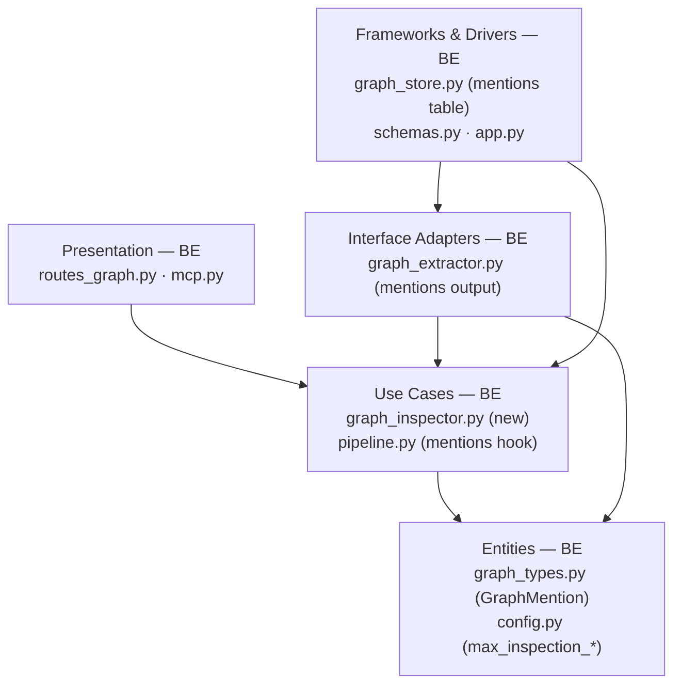
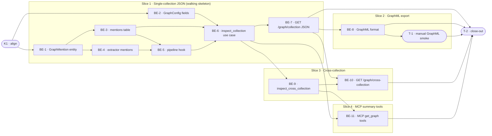

# E2b · Entity Graph Inspection Endpoint — Team Plan

**How to read this file**
- **Architecture approach:** Clean Architecture (default). **Layers:** Presentation · Use Cases · Interface Adapters · Entities · Frameworks & Drivers. Each task's first sub-bullet names the layer it touches.
- The **Frontend, Backend, and Tester** sections are the **depth view** — each role's work, grouped by layer.
- The **Task Breakdown** is the **order view** — every task is a single-role checkbox in execution order, opening with a dependency graph.
- **Phases are vertical slices**: each delivers a working end-to-end increment. No separate "integrate" phase. Sliced with the **`vertical-slicer` skill**.
- Each task carries the **role tag at the end of its title line**, then sub-bullets: **layer · estimate** (decimal hours), **needs · completes**, and a **Tests** block.
- **Tests** are tagged by level. **Unit and integration tests belong to the implementing dev** (test-first); **manual tests are the tester's tasks**. The close-out task writes no tests.
- **Contracts:** HTTP/API seam authored as TypeSpec HTTP service with emitted OpenAPI YAML in `api-contracts/`; internal logical seams as core-construct `.tsp` files beside this plan (all compiled clean).
- **Role tags** (`#backend-role`, `#tester-role`) mark each task and each role-owned section.
- IDs (`S#`, `C#`, `BE-#`/`T-#`/`K#`, `Q#`) are the traceability thread.

---

## Background

After E1 graph extraction runs, the knowledge graph is a write-only black box — `GET /status` exposes aggregate counts only. Operators and developers cannot verify extraction quality, debug missing relationships, or export the graph to external tools. The `_archon_graph_{col}_nodes` and `_archon_graph_{col}_edges` tables are populated by ingest but have no read surface.

---

## Goal

Two REST endpoints expose the E1 knowledge graph as structured adjacency JSON with derived salience and co-occurrence metrics, plus GraphML export, enabling inspection, visualisation, and export. Two MCP summary tools give LLM agents a bounded summary view. A new `_archon_graph_{col}_mentions` incidence table — written by the ingest pipeline alongside nodes/edges — backs all derived fields without modifying existing node/edge schemas.

---

## Scope

### In Scope
- `GET /graph/{collection}` — full node list with `chunk_count`/`salience` and edge list with `weight`/`source_chunk_ids`; `?format=json|graphml`
- `GET /graph/cross-collection?collections=a,b` — merged view with node dedup by `entity_id` and edge dedup by edge `id`; same `format` param
- New `_archon_graph_{col}_mentions` table (`entity_id`, `chunk_id`, `doc_id`); written by pipeline hook (delete-then-add per `doc_id`; idempotent on re-ingest)
- `GraphExtractionResult` gains `mentions: list[GraphMention]`; extractor accumulates mentions without discarding per-chunk incidence
- Derived-at-read fields: `chunk_count` (distinct mention chunks per entity), `salience` (`chunk_count / collection_meta.chunk_count`), `weight` (co-occurrence chunk count per edge), `source_chunk_ids` (capped at 20)
- Deterministic truncation: nodes sorted `(chunk_count desc, entity_id asc)`, top `max_inspection_nodes`; edges filtered to survivors — an edge is retained only if BOTH its `source_entity_id` and `target_entity_id` are present in the surviving node set after node truncation — sorted `(weight desc, id asc)`, top `max_inspection_edges`; `truncated: true` when either cap fires
- `node_count` and `edge_count` in the response reflect **total count before truncation**: `node_count` is the total number of nodes in the graph table; `edge_count` is the number of edges where **both** endpoints survive the node filter (i.e., after the node-survival filter but before the edge cap). When `truncated=true`, `node_count` may exceed `len(nodes)` and `edge_count` may exceed `len(edges)`.
- `[graph] max_inspection_nodes = 5000` and `[graph] max_inspection_edges = 25000` in `GraphConfig`
- GraphML export via networkx (`networkx>=3.0` is already in the `[graph]` extras)
- MCP `get_graph` and `get_graph_cross_collection` tools: summary form (node/edge counts, entity type distribution, top-20 highest-salience nodes, top-20 highest-weight edges)
- 422 guard for `graph.enabled = false`; 404 for unknown collection; 422 for cross-collection with <2 collections
- OpenAPI snapshot regeneration; BREAKING.md entry if any graph fields change
- Pre-E2b nodes/edges (no mentions) read as `chunk_count=0`, `salience=0.0`, `weight=0`, `source_chunk_ids=[]`

### Out of Scope
- TF-IDF cross-collection salience (E2c)
- Graph GC / stale-row reconciliation (E2d)
- Namespace-scoped graph table names (E2d)
- Pagination (truncation + `truncated` flag is the E2b strategy)
- Graph filtering by entity type, relationship type, or depth
- Built-in HTML graph viewer (E2j)
- Mermaid / DOT / Cypher export formats

---

## Acceptance criteria
- `GET /graph/{collection}` returns 200 JSON with `nodes`, `edges`, `truncated` for a collection with graph data
- Each node has `chunk_count >= 1` and `salience > 0.0` after at least one ingest; pre-E2b nodes read as 0/0.0
- Each edge has `weight >= 1` and `source_chunk_ids` (≤ 20 ids) after ingest; pre-E2b edges read as 0/[]
- Re-ingesting the same file yields identical `chunk_count` / `weight` values (not doubled)
- `GET /graph/{collection}?format=graphml` returns `Content-Type: application/xml` with a valid GraphML document
- `GET /graph/cross-collection?collections=a,b` returns merged nodes (same entity → one node, `chunk_count` summed) and merged edges (same edge id → one edge, `weight` summed)
- `graph.enabled = false` → 422 on both endpoints; unknown collection → 404; cross-collection with <2 collections → 422
- Graph with 0 nodes/edges returns 200 with `nodes: [], edges: [], truncated: false` (not 404)
- MCP `get_graph` returns a dict with `node_count`, `edge_count`, `entity_type_distribution`, `top_nodes` (≤ 20), `top_edges` (≤ 20)
- OpenAPI snapshot passes after snapshot regeneration

---

## What does NOT change
- `GraphNode`, `GraphEdge`, `Community` LanceDB schemas (no new columns)
- `get_all_nodes` / `get_all_edges` signatures in `graph_store.py` (already exist at lines 629–657)
- `write_graph` signature in `graph_store.py` (nodes + edges passed as lists)
- All existing search, explain, and ingest endpoints
- Namespace multi-collection sharing behaviour (documented limitation, deferred to E2d)

---

## Known limitations / accepted trade-offs
- Stale mentions until E2d: document delete, TTL expiry, and orphan cleanup do not touch `_archon_graph_*` tables; `source_chunk_ids` may reference dead chunks; inspection exposes this, does not cause it. Consequence: `chunk_count` from mentions may exceed the current `collection_meta.chunk_count` denominator after document deletion or TTL expiry. The inspector clamps salience: `salience = min(chunk_count / total_chunk_count, 1.0)` when `total_chunk_count > 0`. S1's `salience ≤ 1` assertion holds by construction.
- Pre-E2b nodes/edges without mentions show `chunk_count=0`; operators must re-ingest to populate
- Namespace sharing: same-named collections in different namespaces share graph tables (existing documented limitation; E2d defers fix)
- `delete_mentions_by_doc` + `write_mentions` is not atomic; the failure mode is re-ingest to recover (same as `write_communities`)
- Cross-collection namespace isolation gap: same-named collections in different namespaces share the same `_archon_graph_{col}_*` tables. A cross-collection request from namespace A will include graph data from namespace B's "docs" collection if both exist. The 404 guard for unknown collections is namespace-aware, but the underlying table read is not. This is a deferred concern (E2d). Operator mitigation: use distinct collection names per namespace until E2d resolves this.

---

## Approach & architecture

E2b adds a read path to the existing graph write infrastructure. A new `_archon_graph_{col}_mentions` table captures per-chunk entity incidence during ingest (Frameworks & Drivers). The extractor (Interface Adapters) stops discarding this data. A new `graph_inspector.py` use case (Use Cases) reads all three tables, derives the response fields in-process, and applies deterministic truncation. Two new REST routes (Presentation) expose JSON and GraphML outputs; two new MCP tools expose a summary.

**Layer map**

| Layer | Role | Components |
|---|---|---|
| Presentation | Backend | `archon_search/server/routes_graph.py` (new), `archon_search/server/mcp.py` (2 new tools) |
| Use Cases | Backend | `archon_search/graph_inspector.py` (new), `archon_search/pipeline.py` (mentions write) |
| Interface Adapters | Backend | `archon_search/graph_extractor.py` (accumulate mentions) |
| Entities | Backend | `archon_search/graph_types.py` (GraphMention + field on GraphExtractionResult), `archon_search/config.py` (GraphConfig fields) |
| Frameworks & Drivers | Backend | `archon_search/graph_store.py` (mentions table + 4 new methods), `archon_search/server/schemas.py` (new response models), `archon_search/server/app.py` (router registration + pass graph_store to MCP) |

**What changes**
- `graph_types.py`: new `GraphMention` dataclass; `GraphExtractionResult` gains `mentions: list[GraphMention]`
- `config.py`: `GraphConfig` gains `max_inspection_nodes: int = 5000`, `max_inspection_edges: int = 25000` with TOML parser
- `graph_store.py`: new `_mentions_table_name`, `_mentions_schema`, extended `ensure_graph_tables`, plus `write_mentions`, `delete_mentions_by_doc`, `get_all_mentions`
- `graph_extractor.py`: zip `chunk_entity_ids` with `ChunkInput.chunk_id` values to produce `mentions`; populate all 4 `return GraphExtractionResult(...)` sites
- `pipeline.py`: in post-ingest graph hook (line 628+), after `write_graph`: `delete_mentions_by_doc(collection, doc_id)` then `write_mentions(collection, mentions)`
- `graph_inspector.py` (new): `inspect_collection()` and `inspect_cross_collection()` use cases. **Weight derivation algorithm (BE-6):** Build a `dict[str, set[str]]` index `entity_chunks` mapping `entity_id → set(chunk_id)` from all mention rows. For each edge `(source_entity_id, target_entity_id)`, `cooccur = entity_chunks.get(source_entity_id, set()) & entity_chunks.get(target_entity_id, set())`. Then `weight = len(cooccur)` and `source_chunk_ids = sorted(cooccur)[:MAX_SOURCE_CHUNK_IDS]` (lexicographic ascending, capped at 20). This is O(mentions + edges) when the index is built once. Extract truncation into a private `_truncate_graph(nodes, edges, max_nodes, max_edges) -> tuple[list, list, bool]` helper within `graph_inspector.py`; `inspect_cross_collection` reuses the same helper.
- `routes_graph.py` (new): `GET /graph/{collection}` and `GET /graph/cross-collection` (cross-collection route registered first to avoid FastAPI path collision)
- `mcp.py`: 2 new tools; `graph_store` param added to `create_app()` and `create_mcp_http_app()`
- `app.py`: `include_router(graph_router)`, pass `graph_store` to MCP mount
- `schemas.py`: `GraphNodeResponse`, `GraphEdgeResponse`, `GraphInspectionResponse`, `CrossCollectionGraphInspectionResponse`, `McpGraphSummary`
- `tests/server/openapi_snapshot.json`: regenerated

**Key decisions (from brief)**
- Mentions incidence table instead of counter columns — LanceDB merge_insert cannot increment; delete-then-add per doc_id is idempotent
- Salience = chunk frequency / collection chunk count (not degree centrality)
- Weight = co-occurrence chunk count (not extractor confidence)
- Cross-collection node merge = chunk-count-weighted average salience
- Cross-collection edges deduplicated by edge id with weights summed
- Deterministic truncation: highest-signal-first sort before cap
- GraphML as the one export format (networkx already in `[graph]` extras)
- Note: GraphML content type is `application/xml` (not `application/graphml+xml`). The `application/xml` media type is the registered MIME type; `application/graphml+xml` is used by some tools but is not the plan's target. Scenarios S2 and S4 assert `Content-Type: application/xml`.
- MCP tools return summary (top-20), not full adjacency

---

## Contracts / seams

Boundaries where roles must agree. Changing one requires team agreement. TypeSpec used throughout.

**C1 — HTTP/API seam: Graph Inspection REST endpoints** *(Client ↔ Server)*
`GET /graph/{collection}` returns `GraphInspectionResponse` (nodes, edges, truncated, node_count, edge_count). `GET /graph/cross-collection?collections=a,b` returns `CrossCollectionGraphInspectionResponse`. Both support `?format=json|graphml`. 422 when `graph.enabled=false`; 404 when collection unknown; 422 when <2 collections on cross-collection. GraphML response: `Content-Type: application/xml`.
— see [`api-contracts/e2b-graph-inspection-contract.tsp`](api-contracts/e2b-graph-inspection-contract.tsp) + [`api-contracts/e2b-graph-inspection-contract.openapi.yaml`](api-contracts/e2b-graph-inspection-contract.openapi.yaml)
- Realised by: BE-7, BE-8, BE-9, BE-10 · Verified by: BE-7 (integration), BE-9 (integration), BE-10 (integration), T-1 (manual)

**C2 — Internal seam: GraphMention entity + mentions table operations** *(Interface Adapters → Use Cases → Frameworks & Drivers)*
`GraphMention(entity_id, chunk_id, doc_id)` is the incidence record. `GraphStore` exposes `ensure_mentions_table`, `write_mentions`, `delete_mentions_by_doc`, `get_all_mentions`. Write contract: delete WHERE `doc_id = X`, then append new mentions. `GraphExtractionResult` gains `mentions: list[GraphMention]`.
— see [`e2b-graph-mention-seam.tsp`](e2b-graph-mention-seam.tsp)
- Realised by: BE-1, BE-3, BE-4, BE-5 · Verified by: BE-3 (store integration), BE-4 (unit), BE-5 (unit)

**C3 — Internal seam: graph inspection use case** *(Presentation → Use Cases)*
`graph_inspector.inspect_collection(collection, total_chunk_count, max_nodes, max_edges)` → `CollectionGraphView`. `graph_inspector.inspect_cross_collection(collections, total_chunk_counts, max_nodes, max_edges)` → `CrossCollectionGraphView`. `chunk_count` denominator = `CollectionMeta.chunk_count` passed in by route handler. Both return empty nodes/edges (not error) when tables absent.

Note: `inspect_collection` receives `total_chunk_count: int` (from `CollectionMeta.chunk_count`) and `inspect_cross_collection` receives `total_chunk_counts: dict[str, int]` (per-collection chunk counts) for salience computation.
— see [`e2b-graph-inspector-seam.tsp`](e2b-graph-inspector-seam.tsp)
- Realised by: BE-6, BE-9 · Verified by: BE-6 (unit + integration), BE-9 (unit + integration)

---

## Scenarios #tester-role

| id | Scenario (Given / When / Then) |
|----|-------------------------------|
| **S1** | **Given** `graph.enabled=true`, collection "docs" exists with graph data and mentions · **When** `GET /graph/docs` · **Then** 200 JSON; each node has `chunk_count ≥ 1`, `0 < salience ≤ 1`; each edge has `weight ≥ 1`, `source_chunk_ids` non-empty (≤ 20); `truncated: false` |
| **S2** | **Given** same as S1 · **When** `GET /graph/docs?format=graphml` · **Then** 200, `Content-Type: application/xml`, valid GraphML with `<node>` and `<edge>` elements; `truncated` present as graph-level `<data>` |
| **S3** | **Given** `graph.enabled=true`, collections "a" and "b" both exist with graph data · **When** `GET /graph/cross-collection?collections=a,b` · **Then** 200 JSON; `collections=["a","b"]`; merged nodes and edges; `truncated: false` |
| **S4** | **Given** same as S3 · **When** `GET /graph/cross-collection?collections=a,b&format=graphml` · **Then** 200, `Content-Type: application/xml`, valid GraphML for merged graph |
| **S5** | **Given** `graph.enabled=false` · **When** `GET /graph/docs` or `GET /graph/cross-collection?collections=a,b` · **Then** 422 `{"detail": "graph inspection requires [graph] enabled=true in server config"}` |
| **S6** | **Given** `graph.enabled=true` · **When** `GET /graph/nonexistent` where "nonexistent" not registered in namespace · **Then** 404 `{"detail": "collection not found"}` |
| **S7** | **Given** `graph.enabled=true` · **When** `GET /graph/cross-collection?collections=only-one` · **Then** 422 with detail requiring ≥ 2 distinct collections |
| **S8** | **Given** `graph.enabled=true`, collection "docs" registered but no ingest run · **When** `GET /graph/docs` · **Then** 200 `{"nodes": [], "edges": [], "truncated": false}` — not 404 |
| **S9** | **Given** collection has more nodes than `max_inspection_nodes` (or edges than `max_inspection_edges`) · **When** `GET /graph/docs` · **Then** 200 with `truncated: true`; nodes sorted `(chunk_count desc, entity_id asc)`; edges filtered to surviving nodes then sorted `(weight desc, id asc)` |
| **S10** | **Given** nodes and edges exist from pre-E2b ingest (mentions table absent or empty) · **When** `GET /graph/docs` · **Then** 200 with all nodes having `chunk_count=0`, `salience=0.0`; all edges `weight=0`, `source_chunk_ids=[]` |
| **S11** | **Given** a document has been ingested and mentions written · **When** the same file is re-ingested · **Then** `chunk_count`, `salience`, and `weight` are unchanged (not doubled) — delete-then-add idempotency |
| **S12** | **Given** collection triggers node truncation · **When** `GET /graph/docs?format=graphml` · **Then** GraphML output includes `<data key="truncated">true</data>` at graph level |
| **S13** | **Given** entity with same `entity_id` hash exists in both collection "a" and "b" with N₁ and N₂ mention-chunks · **When** `GET /graph/cross-collection?collections=a,b` · **Then** exactly one merged node; `chunk_count = N₁ + N₂`; `salience` is chunk-count-weighted average |
| **S14** | **Given** same logical edge (same `make_stable_edge_id` result) in both collections with weight W₁ and W₂ · **When** `GET /graph/cross-collection?collections=a,b` · **Then** exactly one merged edge; `weight = W₁ + W₂`; `source_chunk_ids` is unioned and capped at 20 |
| **S15** | **Given** `graph.enabled=true`, collection with graph data · **When** MCP `get_graph(collection="docs")` · **Then** summary dict: `node_count`, `edge_count`, `entity_type_distribution`, `top_nodes` (≤ 20 by salience desc), `top_edges` (≤ 20 by weight desc) — not full adjacency |
| **S16** | **Given** `graph.enabled=true`, ≥ 2 collections with graph data · **When** MCP `get_graph_cross_collection(collections=["a","b"])` · **Then** same summary dict shape for merged graph |
| **S17** | **Given** collection "a" has graph data, collection "b" has no graph tables · **When** `GET /graph/cross-collection?collections=a,b` · **Then** 200 with data from "a" only; "b" contributes zero nodes/edges |
| **S18** | **Given** `graph.enabled=false` · **When** MCP `get_graph(collection="docs")` · **Then** `{"error": "...", "code": "graph_disabled"}` (McpErrorResponse pattern from `mcp.py`) |

---

## Frontend — Presentation #frontend-role

N/A — no frontend work for this feature. The project is a pure Python backend (no `web/`, `ui/`, or `frontend/` directory; no HTML rendering in `archon_search/server/`). The HTML graph viewer is deferred to E2j.

---

## Backend — Entities · Use Cases · Adapters · Frameworks #backend-role

**Scope:** All work for E2b is backend. Writes unit and integration tests test-first for every implementation task.
**Owns layers:** Entities, Use Cases, Interface Adapters, Frameworks & Drivers, Presentation (REST + MCP).

**Tasks by layer** *(checkable in the Task Breakdown)*

- Entities: BE-1 (GraphMention + GraphExtractionResult.mentions), BE-2 (GraphConfig inspection fields)
- Frameworks & Drivers: BE-3 (mentions table in GraphStore), schemas.py additions wired in BE-7/BE-10
- Interface Adapters: BE-4 (GraphExtractor accumulates mentions)
- Use Cases: BE-5 (pipeline hook writes mentions), BE-6 (graph_inspector.py single-collection), BE-9 (graph_inspector.py cross-collection)
- Presentation: BE-7 (GET /graph/{collection} JSON + guards), BE-8 (GraphML format), BE-10 (GET /graph/cross-collection), BE-11 (MCP tools + wiring)

**Done when**
- [ ] `GET /graph/{collection}` returns derived fields from live mentions data — S1
- [ ] `GET /graph/{collection}?format=graphml` returns valid GraphML — S2
- [ ] Re-ingest is idempotent — S11
- [ ] Truncation fires and is signalled — S9, S12
- [ ] Cross-collection merge correct — S3, S13, S14
- [ ] All 422/404 guards work — S5, S6, S7, S18
- [ ] MCP summary tools respond — S15, S16
- [ ] OpenAPI snapshot passes

---

## Tester #tester-role

**Scope:** The tester owns **manual** tests and the project **close-out**. All scenarios S1–S18 are achievable at the integration level (real LanceDB in `tmp_path`, `TestClient`, `make_real_app(graph_enabled=True)`) and are dev-written integration tests. The tester owns one manual verification (GraphML interchange) and the mandatory close-out.

**Tasks** *(checkable in the Task Breakdown)*
- T-1: Manual smoke — GraphML import into Gephi or yEd (Slice 2)
- T-2: Project close-out (Close-out)

**Allocation** — each scenario at the cheapest level that proves it

| Scenario | Cheapest level |
|---|---|
| S1 | integration |
| S2 | integration |
| S3 | integration |
| S4 | integration |
| S5 | integration |
| S6 | integration |
| S7 | integration |
| S8 | integration |
| S9 | integration |
| S10 | integration |
| S11 | integration |
| S12 | integration |
| S13 | integration |
| S14 | integration |
| S15 | integration |
| S16 | integration |
| S17 | integration |
| S18 | integration |

One manual test (T-1) verifies the GraphML file is consumable by a real graph tool — this cannot be automated within the TestClient harness.

---

## Documentation update

Docs the feature touches — the close-out task works through this list.

- [ ] `Documentation/Backlog/e2b-graph-inspection-brief.md` — no changes needed (source brief)
- [ ] `Documentation/Backlog/e2b-graph-inspection-team-plan.md` — this file
- [ ] `Documentation/Architecture/100_system_architecture_overview.md` — add graph inspection to C4 diagram
- [ ] `Documentation/Architecture/110_component_catalog_and_layer_breakdown.md` — add `graph_inspector.py`, `routes_graph.py` to layer table
- [ ] `Documentation/Architecture/600_api_reference_or_public_interface.md` — add `GET /graph/{collection}`, `GET /graph/cross-collection`, MCP `get_graph`, `get_graph_cross_collection`
- [ ] `Documentation/Architecture/130_data_architecture_and_persistence.md` — add `_archon_graph_{col}_mentions` table schema
- [ ] `CLAUDE.md` — update graph section: add `GraphMention`, mentions table, E2b route and MCP tools; update `GraphConfig` description; note `get_all_nodes`/`get_all_edges` exist
- [ ] `archon-search.toml.example` — add `max_inspection_nodes` and `max_inspection_edges` under `[graph]`
- [ ] `BREAKING.md` — entry if any existing graph status fields change
- [ ] `tests/server/openapi_snapshot.json` — regenerated (commit alongside implementation)

---

## Open questions

All decisions resolved in the brief. Investigation surfaced one routing implementation note (not a decision gap):

| id | Area | Question |
|----|------|----------|
| **Q1** | Presentation | FastAPI registers routes in declaration order: `GET /graph/cross-collection` **must** be declared before `GET /graph/{collection}` in `routes_graph.py` to prevent `cross-collection` being matched as a `{collection}` path parameter. Implementation must confirm this ordering. |

**Resolved in this revision:**
- Mentions table schema includes `doc_id` for delete-by-doc idempotency (C2, confirmed)
- `get_all_nodes` and `get_all_edges` already exist in `graph_store.py` lines 629–657 (no new methods needed)
- networkx is already in `[graph]` extras (`networkx>=3.0`) — zero new dependencies
- Salience denominator is `CollectionMeta.chunk_count`, fetched by route handler and passed to the inspector
- All 18 scenarios are integration-testable; tester owns one manual (T-1) and Close-out (T-2)

---

## Task Breakdown

Single-role tasks in execution order, grouped into vertical slices.

### Dependency graph

---

### Phase 0 · Kickoff *(prerequisite)*

- [x] **K1** — Agree the Contracts (C1, C2, C3) and Scenarios (S1–S18) with the team #team
    - — · 1.0h
    - completes C1, C2, C3
    - Tests

---

### Slice 1 · Single-collection JSON inspection *(walking skeleton: mentions table → extractor change → pipeline hook → inspection use case → GET /graph/{collection})*

- [x] **BE-1** — Add `GraphMention` dataclass and `GraphExtractionResult.mentions` field to `graph_types.py` #backend-role
    - Entities · 1.0h
    - needs K1 · completes C2
    - Tests
        - #unit_test — `test_graph_mention_dataclass_fields` — entity_id, chunk_id, doc_id present; dataclass equality
        - #unit_test — `test_extraction_result_mentions_defaults_to_empty` — `GraphExtractionResult().mentions == []`

- [x] **BE-2** — Add `max_inspection_nodes` and `max_inspection_edges` to `GraphConfig`; extend TOML parser in `_apply_toml()` (`config.py`) #backend-role
    - Entities · 1.0h
    - needs K1 · completes C3
    - Tests
        - #unit_test — `test_graph_config_inspection_defaults` — defaults are 5000 / 25000
        - #unit_test — `test_graph_config_toml_inspection_fields` — TOML `[graph] max_inspection_nodes = 100` parsed correctly
        - #unit_test — `test_graph_config_inspection_rejects_zero` — zero or negative value raises `ConfigError`

- [x] **BE-3** — Add mentions table to `GraphStore`: `_mentions_table_name`, `_mentions_schema` (entity_id, chunk_id, doc_id), extend `ensure_graph_tables` to also create mentions table, `write_mentions` (append; no upsert key needed since delete-then-add makes it idempotent), `delete_mentions_by_doc` (uses `_where_eq("doc_id", ...)`), `get_all_mentions(collection, limit: int | None = None) -> list[GraphMention]` — accepts an optional row limit; when limit is provided and the table has more rows, returns only the first `limit` rows (`graph_store.py`). Note: mentions table allows duplicate rows with same `(entity_id, chunk_id)` if the extractor produces the same entity twice in one chunk. `get_all_mentions` returns all rows; dedup is the inspector's responsibility. #backend-role
    - Frameworks & Drivers · 3.0h
    - needs BE-1 · completes C2
    - Tests
        - #unit_test — `test_mentions_table_name_format` — `_archon_graph_col_mentions` pattern
        - #unit_test — `test_mentions_schema_columns` — entity_id, chunk_id, doc_id all utf8
        - #unit_test — `test_delete_mentions_uses_safe_predicate` — no f-string in `.delete()` call; uses `_where_eq`
        - #integration_test — `test_mentions_write_and_read_roundtrip` — write 3 mentions, get_all returns 3; with real LanceDB in tmp_path
        - #integration_test — `test_mentions_delete_by_doc_then_write_is_idempotent` — write, delete, re-write; get_all returns same count not doubled

- [x] **BE-4** — Extend `GraphExtractor.extract()` to accumulate `mentions: list[GraphMention]` from per-chunk entity IDs: fix text-chunk loop to `zip(text_chunks, ner_per_chunk)` to preserve `chunk_id`; populate mentions in both code-symbol and NER paths; add `mentions=mentions` (or `mentions=[]` for early-exit paths) to all 4 `return GraphExtractionResult(...)` sites (`graph_extractor.py`) #backend-role
    - Interface Adapters · 2.0h
    - needs BE-1 · completes C2
    - Tests
        - #unit_test — `test_extractor_code_symbol_mentions` — code-symbol chunk produces `GraphMention` with correct `chunk_id` and `entity_id`
        - #unit_test — `test_extractor_ner_mentions` — provide 3 ChunkInput objects with distinct chunk_ids; spaCy NER stub produces entities in chunks 0 and 2 but not 1; assert mentions contain exactly two GraphMention objects referencing chunk_ids[0] and chunk_ids[2] respectively (not chunk_ids[1]); verifies zip alignment is correct
        - #unit_test — `test_extractor_early_exit_mentions_empty` — when spaCy not importable, `mentions=[]` on returned result

- [x] **BE-5** — In `pipeline.py` post-ingest graph hook (lines 628+): after `write_graph(...)`, call `self._graph_store.delete_mentions_by_doc(collection, doc_id)` then `self._graph_store.write_mentions(collection, _extraction_result.mentions)`. Both `delete_mentions_by_doc` and `write_mentions` are inside the same `try/except Exception` block that wraps the existing `write_graph` call (lines 629+). If delete fails, write is skipped and the exception is appended to warnings — same pattern as the existing graph write error handling. #backend-role
    - Use Cases · 1.0h
    - needs BE-3, BE-4 · completes S11
    - Tests
        - #unit_test — `test_pipeline_hook_deletes_before_writing_mentions` — mock `graph_store`; assert `delete_mentions_by_doc` called with correct doc_id before `write_mentions`
        - #unit_test — `test_pipeline_hook_swallows_mention_write_exception` — exception in `write_mentions` is caught and appended to warnings (mirrors existing graph write exception pattern)
        - #unit_test — `test_pipeline_hook_swallows_mention_delete_exception` — mock graph_store.delete_mentions_by_doc raises an exception; assert the exception is caught (same try/except as write_mentions swallow test); write_mentions is NOT called when delete fails (exception exits the try block early)
        - #integration_test — `test_ingest_writes_mentions_then_reingest_is_idempotent` — ingest file, check mention count; re-ingest same file; check mention count unchanged

- [ ] **BE-6** — New `archon_search/graph_inspector.py` (Use Cases): `inspect_collection(graph_store, collection, total_chunk_count, max_nodes, max_edges) -> CollectionGraphView` — reads all nodes (`get_all_nodes`), edges (`get_all_edges`), mentions (`get_all_mentions`); derives `chunk_count`, `salience`, `weight`, `source_chunk_ids` in-process; applies deterministic truncation; handles absent/empty tables gracefully; handles zero `total_chunk_count` (salience=0.0). Pass the result of `CollectionMeta.chunk_count` from the route handler; the inspector does not fetch meta. **Weight derivation algorithm:** Build a `dict[str, set[str]]` index `entity_chunks` mapping `entity_id → set(chunk_id)` from all mention rows (using sets so duplicate `(entity_id, chunk_id)` pairs collapse). For each edge `(source_entity_id, target_entity_id)`, `cooccur = entity_chunks.get(source_entity_id, set()) & entity_chunks.get(target_entity_id, set())`. Then `weight = len(cooccur)` and `source_chunk_ids = sorted(cooccur)[:MAX_SOURCE_CHUNK_IDS]` (lexicographic ascending, capped at 20). This is O(mentions + edges) when the index is built once. **Mentions scan ceiling:** Define a module-level constant `_MENTIONS_SCAN_CEILING = 500_000` in `graph_inspector.py`. Pass `limit=_MENTIONS_SCAN_CEILING` to `get_all_mentions`. When `len(raw_mentions) >= _MENTIONS_SCAN_CEILING`, set `truncated=True` (the ceiling was hit, so derived counts cover only the scanned subset). Document this constant with a comment explaining its purpose: "Safety valve against OOM on pathologically large mention tables; adjust via operator-level config if needed." **Edge filtering:** an edge is retained only if BOTH its `source_entity_id` and `target_entity_id` are present in the surviving node set after node truncation. **Salience clamping:** `salience = min(chunk_count / total_chunk_count, 1.0)` when `total_chunk_count > 0`; `0.0` otherwise. **Truncation helper:** Extract truncation into a private `_truncate_graph(nodes, edges, max_nodes, max_edges) -> tuple[list, list, bool]` helper in `graph_inspector.py`. The helper: (1) sorts nodes `(chunk_count desc, entity_id asc)` and caps at `max_nodes`, building `surviving_entity_ids` from the resulting list; (2) filters `edges` to those where BOTH `source_entity_id` and `target_entity_id` are in `surviving_entity_ids`; (3) sorts surviving edges `(weight desc, id asc)` and caps at `max_edges`; (4) returns `(nodes_out, edges_out, truncated)` where `truncated=True` if either cap fired or the mentions ceiling was hit. `inspect_cross_collection` (BE-9) calls this same helper on the merged node+edge sets. **`node_count` and `edge_count`** in the returned view reflect total count before truncation (not the length of the returned lists). **Clean Architecture:** type-annotate `graph_store` with `TYPE_CHECKING` guard (same pattern as `pipeline.py`) — `from archon_search.graph_store import GraphStore` inside `if TYPE_CHECKING` block, with `graph_store: 'GraphStore'` annotation at runtime. The concrete instance is passed in from the route handler (Presentation), maintaining the inward dependency flow. #backend-role
    - Use Cases · 4.0h
    - needs BE-2, BE-3, BE-5 · completes S1, S8, S9, S10
    - Tests
        - #unit_test — `test_inspect_derives_chunk_count_from_mentions` — 2 mentions for entity → chunk_count=2
        - #unit_test — `test_inspect_salience_formula` — salience = min(chunk_count / total_chunk_count, 1.0); returns 0.0 when denominator is 0; returns 1.0 when chunk_count > total_chunk_count (stale mentions case — clamped, not >1)
        - #unit_test — `test_inspect_weight_is_cooccurrence_count` — edge weight = distinct chunks where both endpoints mentioned
        - #unit_test — `test_inspect_source_chunk_ids_capped_at_20` — given two entities that co-occur in 30 distinct chunks (intersection of their mention-chunk sets has 30 elements), the edge's source_chunk_ids has len=20 (capped) and is sorted lexicographically
        - #unit_test — `test_inspect_truncation_node_sort_order` — truncation sorts nodes (chunk_count desc, entity_id asc); sets truncated=True
        - #unit_test — `test_inspect_empty_tables_returns_empty_view` — absent/empty graph tables → CollectionGraphView with nodes=[], edges=[], truncated=False
        - #unit_test — `test_inspect_pre_e2b_nodes_read_as_zero` — nodes with no mentions → chunk_count=0, salience=0.0; edges with no co-occurrence → weight=0, source_chunk_ids=[]
        - #unit_test — `test_inspect_edge_filtering_removes_dangling_edges` — with max_nodes=3 and 5 nodes, edges where one endpoint was truncated are excluded from results; only edges where both endpoints survived are returned
        - #unit_test — `test_inspect_chunk_count_deduplicates_entity_chunk_pairs` — given 3 mention rows where 2 share (entity_id, chunk_id), chunk_count = 2 (not 3); the entity_chunks index uses sets so duplicates collapse
        - #unit_test — `test_inspect_node_count_is_pretruncation_total` — when max_nodes=3 and 5 nodes exist, response has node_count=5 but len(nodes)=3 and truncated=True
        - #unit_test — `test_inspect_edge_count_is_post_node_filter_pre_edge_cap` — with 5 nodes, 8 edges where 3 edges have both endpoints in the surviving 3 nodes, max_nodes=3, max_edges=2: edge_count=3 (edges where BOTH endpoints survive node filter), len(edges)=2 (edge cap fires), truncated=True
        - #unit_test — `test_inspect_sets_truncated_when_mentions_exceed_ceiling` — when get_all_mentions returns exactly _MENTIONS_SCAN_CEILING rows (ceiling hit), truncated=True regardless of node/edge counts
        - #integration_test — `test_inspect_collection_end_to_end` — real GraphStore in tmp_path; write 2 nodes + 1 edge + 3 mentions; inspect returns correct derived fields

- [ ] **BE-7** — New `archon_search/server/routes_graph.py`: `router = APIRouter()`; `GET /graph/{collection}` with `?format` param; `schemas.py` additions (`GraphNodeResponse`, `GraphEdgeResponse`, `GraphInspectionResponse`); all guards (422 for `graph.enabled=false`, 404 for collection not found); `graph.enabled=true` but tables absent → 200 empty; register in `app.py` with `include_router` #backend-role
    - Presentation · 3.0h
    - needs BE-6 · completes S1, S5, S6, S8, S17
    - Tests
        - #unit_test — `test_graph_route_422_when_graph_disabled` — mock app state; `graph.enabled=False` → 422
        - #unit_test — `test_graph_route_404_collection_not_found` — `pipeline.get_collection_meta` returns None → 404
        - #unit_test — `test_graph_route_invalid_format_returns_422` — GET /graph/col?format=svg returns 422 (FastAPI enum validation); prevents silent bypass of the JSON/GraphML branch
        - #integration_test — `test_get_graph_json_returns_200_with_data` — `make_real_app(graph_enabled=True)` + spaCy stub + `ingest_file_via_path` → GET /graph → 200 JSON; nodes non-empty; chunk_count ≥ 1
        - #integration_test — `test_get_graph_empty_returns_200_not_404` — graph enabled, collection registered, no ingest → GET /graph → 200 nodes=[]
        - #integration_test — `test_get_graph_truncation_fires_when_max_exceeded` — make_real_app with max_inspection_nodes=2; ingest a document that produces 3+ entities; GET /graph/col returns truncated=true with exactly 2 nodes sorted by (chunk_count desc, entity_id asc); verifies config wiring is correct end-to-end (S9)

---

### Slice 2 · GraphML export *(adds format=graphml to the single-collection path)*

- [ ] **BE-8** — Add `to_graphml(view: CollectionGraphView | CrossCollectionGraphView) -> bytes` to `graph_inspector.py`; add `?format=graphml` branch to `GET /graph/{collection}` route returning `Response(content=..., media_type="application/xml")`; include `truncated` as graph-level GraphML `<data>` attribute; guard against networkx ImportError with clear 500 message (`archon_search/server/routes_graph.py`). Note: `to_graphml()` is placed in `graph_inspector.py` (Use Cases layer) as a pragmatic simplification — it avoids a separate serializer module for a one-export-format feature. This introduces a `networkx` framework dependency into the Use Cases layer. Accepted trade-off for E2b scope; the function is guarded with an `ImportError` handler. If a second export format (DOT, Cypher) is added in a future epic, extract `to_graphml()` into a `graph_serializers.py` Frameworks & Drivers adapter at that point. #backend-role
    - Presentation · 2.0h
    - needs BE-7 · completes S2, S12
    - Tests
        - #unit_test — `test_to_graphml_produces_valid_xml` — parse bytes with `xml.etree.ElementTree`; root tag is `graphml`
        - #unit_test — `test_to_graphml_includes_truncated_attribute` — graph with truncated=True → `<data key="truncated">true</data>` in output
        - #unit_test — `test_graphml_networkx_import_error_yields_clear_message` — mock networkx import failure → 500 with actionable message
        - #integration_test — `test_get_graph_graphml_content_type` — GET /graph/col?format=graphml → 200, `Content-Type: application/xml`; valid GraphML parseable by `xml.etree.ElementTree`

- [ ] **T-1** — Manual: export a real corpus via `GET /graph/col?format=graphml`; import the file into Gephi or yEd; verify nodes and edges render with correct attributes; check truncated flag appears when graph is large #tester-role
    - — · 1.0h
    - needs BE-8 · completes S2
    - Tests
        - #manual_test — GraphML import into Gephi/yEd — verify node attributes (chunk_count, salience) and edge attributes (weight) are readable in external tool; verify truncated graph-level flag is present on oversized corpus

---

### Slice 3 · Cross-collection merged graph *(adds GET /graph/cross-collection)*

- [ ] **BE-9** — Add `inspect_cross_collection(graph_store, collections, total_chunk_counts, max_nodes, max_edges) -> CrossCollectionGraphView` to `graph_inspector.py`: merge nodes by `entity_id` (sum chunk_counts, weighted-avg salience), merge edges by edge `id` (sum weights, union source_chunk_ids capped at 20), apply truncation. When merging `source_chunk_ids` across collections: take the union of all chunk_ids, sort lexicographically, cap at `MAX_SOURCE_CHUNK_IDS` (20). This is deterministic. Reuses `_truncate_graph(nodes, edges, max_nodes, max_edges)` helper from BE-6. #backend-role
    - Use Cases · 3.0h
    - needs BE-6 · completes S3, S13, S14, S17
    - Tests
        - #unit_test — `test_cross_collection_node_dedup_sums_chunk_counts` — same entity_id in 2 collections → merged node with chunk_count = sum
        - #unit_test — `test_cross_collection_salience_weighted_avg` — entity X exists in collection "a" with chunk_count=4 (total_chunk_count=10 → salience_a=0.4) and in collection "b" with chunk_count=2 (total_chunk_count=5 → salience_b=0.4); merged salience = (4*0.4 + 2*0.4)/(4+2) = 0.4; also test asymmetric case: chunk_count_a=6, salience_a=0.6, chunk_count_b=2, salience_b=0.2 → merged = (6*0.6 + 2*0.2)/8 = (3.6+0.4)/8 = 0.5; verifies the weighted-average formula
        - #unit_test — `test_cross_collection_edge_dedup_sums_weights` — same edge id in 2 collections → merged edge with weight = sum
        - #unit_test — `test_cross_collection_source_chunk_ids_unioned_and_capped` — union of source_chunk_ids across collections capped at 20
        - #unit_test — `test_cross_collection_one_empty_collection_contributes_zero` — one collection with absent tables → result contains only the non-empty collection's data
        - #unit_test — `test_cross_collection_truncation_fires_after_merge` — two collections, each with 3 distinct nodes, max_nodes=4: merged graph has 6 nodes (assuming no entity_id overlap), truncation fires and truncated=True with 4 nodes in result; verifies _truncate_graph is called on the merged (post-dedup) graph, not on individual collections
        - #integration_test — `test_inspect_cross_collection_real_store` — real GraphStore; write to 2 collections with shared entity; inspect_cross_collection yields 1 merged node

- [ ] **BE-10** — Add `GET /graph/cross-collection` route to `routes_graph.py` (declared **before** `GET /graph/{collection}` to prevent path collision); query param `collections: str` (comma-separated, deduped, ≥2 required → 422); same `?format=graphml` support; same collection-not-found 404 guard per collection; `schemas.py` addition `CrossCollectionGraphInspectionResponse`. Guard evaluation order for the `collections` query parameter: (1) check that `collections` query param is present and non-empty → 422 if absent or empty string; (2) split on comma and deduplicate; (3) check count ≥ 2 after dedup → 422; (4) per-collection existence check → 404 per missing collection. FastAPI should enforce the parameter as required (no default). #backend-role
    - Presentation · 2.0h
    - needs BE-9, BE-7 · completes S3, S4, S7
    - Tests
        - #unit_test — `test_cross_collection_route_422_less_than_two` — collections=only-one → 422
        - #unit_test — `test_cross_collection_route_missing_param_returns_422` — GET /graph/cross-collection with no `collections` query param returns 422 (required parameter missing); separate from the <2 collections 422
        - #unit_test — `test_cross_collection_route_empty_param_returns_422` — GET /graph/cross-collection?collections= (empty string) returns 422
        - #unit_test — `test_cross_collection_route_deduplicates_collections` — collections=a,a,b → treated as a,b
        - #integration_test — `test_get_cross_collection_json_merged_nodes` — 2 collections, shared entity → GET /graph/cross-collection → one merged node with summed chunk_count
        - #integration_test — `test_get_cross_collection_graphml_valid` — `?format=graphml` → 200, valid XML
        - #integration_test — `test_cross_collection_route_not_captured_by_collection_param` — GET /graph/cross-collection?collections=a,b returns the merged graph response (not a 404 for collection named "cross-collection"); guards the route declaration order invariant

---

### Slice 4 · MCP summary tools *(adds get_graph and get_graph_cross_collection MCP tools)*

- [ ] **BE-11** — Add `get_graph` and `get_graph_cross_collection` tools to `mcp.py`; add `graph_store` as an optional keyword parameter with a default of `None` to both `create_app()` and `create_mcp_http_app()` — `graph_store: GraphStore | None = None` — so existing test call sites do not break; update `app.py` lifespan to pass `graph_store=app.state.graph_store`; both tools guard on `config.graph.enabled` and `graph_store is not None`; summary response: `node_count`, `edge_count`, `entity_type_distribution`, `top_nodes` (top-20 by salience), `top_edges` (top-20 by weight); use `McpErrorResponse` pattern for `graph.enabled=false` #backend-role
    - Presentation · 3.0h
    - needs BE-6, BE-9 · completes S15, S16, S18
    - Tests
        - #unit_test — `test_mcp_get_graph_disabled_returns_mcp_error` — `graph.enabled=False` → McpErrorResponse with `code="graph_disabled"`
        - #unit_test — `test_mcp_get_graph_cross_collection_disabled_returns_mcp_error` — graph.enabled=False; call MCP get_graph_cross_collection; assert McpErrorResponse with code="graph_disabled" (mirrors S18 for the cross-collection tool); verifies the guard fires before the collections parameter is validated
        - #unit_test — `test_mcp_get_graph_summary_shape` — mock inspector; result contains `top_nodes` (≤20), `top_edges` (≤20), `entity_type_distribution`
        - #integration_test — `test_mcp_get_graph_tool_registered` — `make_real_app(graph_enabled=True, mcp_enabled=True)` + spaCy stub; MCP tools/list includes `get_graph` and `get_graph_cross_collection`
        - #integration_test — `test_mcp_get_graph_returns_summary_after_ingest` — ingest doc; MCP `tools/call get_graph` → 200; `top_nodes` non-empty; `len(top_nodes) ≤ 20`
        - #integration_test — `test_mcp_get_graph_cross_collection_returns_merged_summary` — ingest a document into two collections; call MCP `tools/call get_graph_cross_collection` with both collection names; assert result contains `node_count`, `edge_count`, `top_nodes` (list), `top_edges` (list); verifies S16

---

### Phase N · Close-out

- [ ] **T-2** — Project close-out & acceptance fact-check #tester-role
    - — · 4.0h
    - needs BE-7, BE-8, BE-10, BE-11, T-1 · completes (acceptance gate)
    - Tests
    - Duties
        - Update all documentation per the "Documentation update" section — CLAUDE.md, architecture docs, API reference, `archon-search.toml.example`, BREAKING.md if applicable
        - Fix all build / compiler warnings, if any
        - Run the full test suite (`uv run pytest`); fix every failing test, including any unrelated to this feature; regenerate OpenAPI snapshot (`uv run pytest tests/server/test_openapi_snapshot.py --update-openapi-snapshot`) and commit `tests/server/openapi_snapshot.json`
        - Validate every Acceptance criterion one-by-one with a fact check — no assumptions; confirm each is genuinely done

**Critical path:** K1 → BE-1 → BE-3 → BE-5 → BE-6 → BE-9 → BE-10 → BE-11 → T-2 (22.0h on the critical chain).
