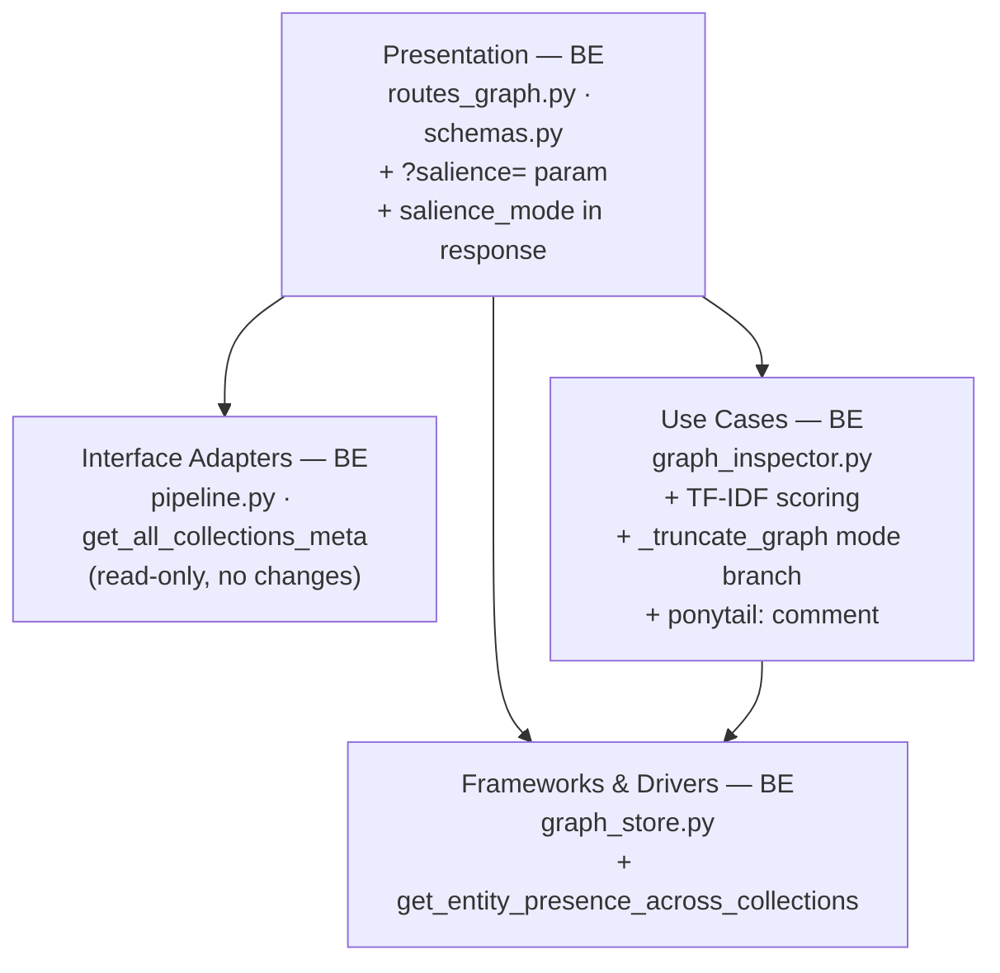
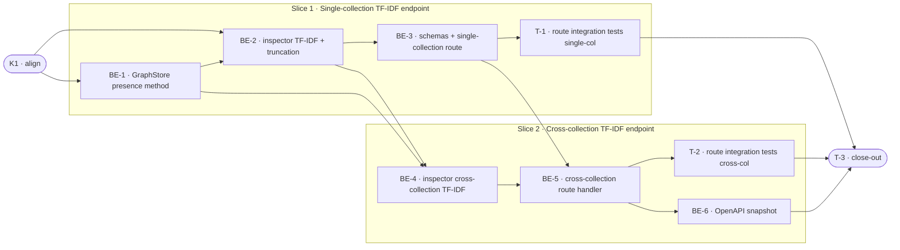

# E2c · Graph Salience Upgrade (TF-IDF Entity Scoring) — Team Plan

**How to read this file**
- **Architecture approach:** Clean Architecture (default). **Layers:** Presentation · Use Cases · Interface Adapters · Entities · Frameworks & Drivers. Each task's first sub-bullet names the layer it touches.
- The **Frontend, Backend, and Tester** sections are the **depth view** — each role's work, grouped by layer.
- The **Task Breakdown** is the **order view** — every task is a single-role checkbox in execution order, opening with a dependency graph.
- **Phases are vertical slices**: each delivers a working end-to-end increment. Sliced with the **`vertical-slicer`** skill (installed).
- Each task carries the **role tag at the end of its title line**, then sub-bullets: **layer · estimate**, **needs · completes**, and a **Tests** block.
- **Tests** are tagged by level. Unit and integration tests belong to the implementing dev (test-first); e2e and manual tests are the tester's tasks.
- **Contracts** are logical: C1 is authored as a TypeSpec HTTP service with a linked OpenAPI YAML; C2 and C3 are internal TypeSpec core-construct files, both compiled clean.
- IDs (`S#`, `C#`, `BE-#`/`T-#`/`K#`, `Q#`) are the traceability thread.

---

## Background

Graph inspection endpoints (`GET /graph/{collection}` and `GET /graph/cross-collection`) currently rank nodes by raw chunk-mention frequency (`chunk_count / total_chunks_in_collection`), which over-ranks ubiquitous entities — company names, common technical terms — that appear in every collection and so provide no signal about what makes a collection distinctive. The E2b feature shipped the mentions incidence table that makes IDF computation cheap.

---

## Goal

Both graph inspection endpoints return nodes ranked by a TF-IDF salience score when `?salience=tfidf` is passed. Domain-specific entities (high TF, low df) outrank ubiquitous noise (high TF, high df). Single-collection graphs produce identical ordering under both modes **when the namespace contains exactly one collection** (IDF degenerates to a constant factor `log(2)` that cancels in ranking). When a namespace has multiple collections but a single collection is inspected, entities with different cross-collection presence get different IDF scores, so tfidf ordering MAY differ from frequency ordering — this is correct and intentional behavior. Callers that omit `?salience=` receive unchanged frequency-mode behaviour.

---

## Scope

### In Scope
- `?salience=frequency|tfidf` query parameter on both `GET /graph/{collection}` and `GET /graph/cross-collection`
- Batched request-time IDF computation: one LanceDB read per collection node table, no per-entity fan-out
- `salience_mode: Literal["frequency", "tfidf"]` added to `GraphInspectionResponse` and `CrossCollectionGraphInspectionResponse` schemas
- New `GraphStore.get_entity_presence_across_collections(collection_names: list[str]) -> dict[str, int]` method
- IDF denominator scoped strictly to the requesting namespace
- Fix pre-existing namespace gap in `routes_graph.py` (neither handler reads `request.state.namespace` today)
- `ponytail:` comment in `graph_inspector.py` naming the N-table ceiling and pre-computation upgrade path
- Unit tests: multi-collection fixture confirms domain-specific entities outrank ubiquitous ones under tfidf; single-collection **namespace** confirms identical ordering between modes (when namespace has exactly 1 collection, IDF degenerates to a constant log(2))

### Out of Scope
- Storing or pre-computing IDF values
- Changing the default salience mode (`frequency` remains default)
- MCP tools (`get_graph`, `get_graph_cross_collection`) gaining a `salience_mode` parameter
- Cross-namespace IDF computation

---

## Acceptance criteria
- `GET /graph/{collection}?salience=tfidf` returns 200 with `salience_mode: "tfidf"` in the response body
- `GET /graph/cross-collection?...&salience=tfidf` returns 200 with `salience_mode: "tfidf"` in the response body
- On a multi-collection fixture, an entity unique to one collection ranks above an entity shared across all collections under tfidf
- On a single-collection namespace, node order under tfidf is identical to node order under frequency
- Omitting `?salience=` produces `salience_mode: "frequency"` and unchanged node ordering (no breaking change)
- `?salience=invalid` returns 422
- `uv run pytest` passes with ≥ 85% coverage

---

## What does NOT change
- `frequency` mode behaviour and default
- MCP tools `get_graph` and `get_graph_cross_collection`: they call `inspect_collection`/`inspect_cross_collection` with the default `salience_mode="frequency"`. Their single-collection node ordering is unchanged (frequency salience ∝ chunk_count); their cross-collection ordering is preserved by the conditional sort-key branch introduced in BE-2/BE-4 (`-chunk_count` in frequency mode, `-salience` in tfidf mode). Regression tests at lines 350/388 verify the frequency path is not disturbed.
- GraphML export format (node `salience` attribute continues to reflect whichever mode is active)
- `truncated` flag semantics and `max_inspection_nodes` / `max_inspection_edges` config ceiling
- Existing 422/404 guards in `routes_graph.py`

---

## Known limitations / accepted trade-offs
- **Request-time batch scan**: IDF is computed on every tfidf request (one node-table read per namespace collection). For namespaces with hundreds of collections this adds latency. The `ponytail:` comment marks the pre-computation upgrade path. Acceptable at current scale (measured: ~2ms per table read; threshold for pre-computation: ≥50 collections or ≥100ms observed latency). Acceptable at current scale.
- **No IDF caching or invalidation**: request-time batch is correct by definition (always fresh) and avoids invalidation complexity.
- **Namespace isolation**: IDF denominator counts only collections in the requesting namespace; cross-namespace IDF would silently leak tenancy information.
- **Single-collection IDF**: when namespace has exactly one collection, every entity gets the same IDF factor `log(2)`, which cancels in ranking — ordering is identical to frequency mode. This is correct and documented behaviour.

---

## Approach & architecture

E2c adds a new scoring dimension to the existing graph inspection pipeline. The route handler resolves the namespace-scoped collection list and calls the new `GraphStore` method to build the IDF denominator map; `graph_inspector.py` branches on `salience_mode` to compute TF-IDF scores and sort/truncate accordingly; the schema grows a `salience_mode` echo field. Four files change; MCP tools are untouched.

**Layer map (and role mapping)**

| Layer | Role | Components touched |
|---|---|---|
| Presentation | Backend | `archon_search/server/routes_graph.py` (route handlers), `archon_search/server/schemas.py` (response models) |
| Use Cases | Backend | `archon_search/graph_inspector.py` (`inspect_collection`, `inspect_cross_collection`, `_truncate_graph`, `CollectionGraphView`, `CrossCollectionGraphView`) |
| Interface Adapters | Backend | `archon_search/pipeline.py` — `get_all_collections_meta(ns)` used read-only by route handler (no changes) |
| Entities | Backend | `archon_search/graph_types.py` — no changes |
| Frameworks & Drivers | Backend | `archon_search/graph_store.py` — new `get_entity_presence_across_collections` |

**What changes**
- `graph_store.py`: new method `get_entity_presence_across_collections(collection_names: list[str]) -> dict[str, int]`
- `graph_inspector.py`: `inspect_collection` and `inspect_cross_collection` gain `salience_mode`, `entity_presence`, `num_collections`; `_truncate_graph` gains `salience_mode` branch; both view dataclasses gain `salience_mode` field; `ponytail:` comment added; `GraphNodeInspection.salience` docstring updated to reflect unbounded tfidf range
- `schemas.py`: `GraphInspectionResponse` and `CrossCollectionGraphInspectionResponse` gain `salience_mode`
- `routes_graph.py`: both handlers gain `salience` query param; namespace gap fixed (`ns = request.state.namespace` added to both handlers; `get_collection_meta` calls gain `namespace=ns`). When `salience_mode == 'tfidf'`, both handlers resolve `all_ns_collection_names = [c.name for c in pipeline.get_all_collections_meta(ns)]`, call `graph_store.get_entity_presence_across_collections(all_ns_collection_names)`, and pass `entity_presence` and `num_collections=len(all_ns_collection_names)` into the inspector function. (The single-collection handler needs all namespace collections for IDF denominator; only the cross-collection handler additionally maintains a separate `listed_collections` for node merging — see Two-list pattern note.)

**Two-list pattern (critical for BE-5):** The cross-collection handler must maintain two distinct collection lists: (1) `all_ns_collection_names = [c.name for c in pipeline.get_all_collections_meta(ns)]` — used as input to `get_entity_presence_across_collections` and as `num_collections`; (2) `listed_collections` — the user-requested `?collections=` subset, used for `inspect_cross_collection` node merging. Passing `listed_collections` to both is a silent IDF-denominator bug (S13 would fail). Note: `pipeline.get_all_collections_meta(ns)` returns `list[CollectionMeta]` objects; always extract `.name` before passing to `get_entity_presence_across_collections`.

**Key decisions**
- `get_entity_presence_across_collections` takes `collection_names: list[str]`, not `namespace` — `GraphStore` has no namespace concept; the route handler resolves the mapping via `pipeline.get_all_collections_meta(ns)` (already exists)
- `_truncate_graph` sort key changes to `(-n.salience, n.entity_id)`. For `inspect_collection` (single-collection), this preserves frequency-mode ordering because salience is monotonic in chunk_count for a fixed denominator. For `inspect_cross_collection`, merged_salience is a chunk-count-weighted average and is NOT monotonic in chunk_count — therefore the sort key must be **conditional**: `(-n.salience, n.entity_id)` in tfidf mode, `(-n.chunk_count, n.entity_id)` in frequency mode on the cross-collection path. BE-2 and BE-4 must implement this conditional branch.
- IDF formula: `log((total_collections + 1) / collections_containing_entity)` — the only formula consistent with all three brief edge cases (see Q1 — Resolved)
- Namespace fix in `routes_graph.py` is in-scope for E2c because tfidf requires it; frequency mode also benefits from the correctness fix
- **TF formula:** `TF(entity, collection) = chunk_count / total_chunks_in_collection` where `chunk_count` comes from the mentions table and `total_chunks_in_collection` comes from `CollectionMeta.chunk_count`. **Zero guard:** if `total_chunks_in_collection == 0`, set `TF = 0.0` (avoids division by zero; S7 behavior). This guard must be in both `inspect_collection` and `inspect_cross_collection` tfidf paths.
- **Salience range:** In tfidf mode, raw TF-IDF values (TF × IDF) can exceed 1.0. The `salience` field stores the raw unclamped TF-IDF score in tfidf mode; the `[0.0, 1.0]` clamp documented on the field applies ONLY to frequency mode. BE-2 must update the `GraphNodeInspection.salience` docstring to reflect: 'In frequency mode, clamped to [0.0, 1.0]. In tfidf mode, unbounded (TF × IDF).' No field split is required since callers who omit `?salience=` continue to receive clamped frequency values.
- **Layer assignment for IDF scan:** The route handler (Presentation) calls `pipeline.get_all_collections_meta(ns)` to resolve collection names, then calls `graph_store.get_entity_presence_across_collections(collection_names)` directly. This is an accepted pragmatic exception: the graph_store is already injected into the pipeline which the route holds, and adding an intermediate use-case wrapper for a single read-only fanout call is unnecessary abstraction. Document this in a comment at the call site.
- **Presence fallback invariant:** `entity_presence.get(entity_id, 1)` uses df=1 as fallback. Since `get_entity_presence_across_collections` always scans all namespace collections INCLUDING the target collection, every entity in the target's node table MUST appear in the presence map (df ≥ 1). The fallback fires only if there is a desync (concurrent delete, corrupt table). When it fires, the entity receives maximum IDF boost — a conservative default that errs toward surfacing rather than suppressing. Log a WARNING at the call site when the fallback is used: `logger.warning('entity_id %s missing from presence map — using df=1', entity_id)`.

---

## Contracts / seams

Boundaries where roles must agree. Logical, not code. Changing one requires team agreement.
TypeSpec is available; internal seams are compiled core-construct `.tsp` files; the HTTP seam is a TypeSpec HTTP service that emits `openapi.yaml`.

**C1 — REST graph inspection endpoints** *(HTTP/API seam — Presentation exposed to callers)*
Both `GET /graph/{collection}` and `GET /graph/cross-collection` gain an optional `?salience=` query parameter (default `"frequency"`) and both response bodies gain a `salience_mode` echo field. Backward-compatible: existing callers receive `salience_mode: "frequency"` without changes.
See [`api-contracts/e2c-graph-salience-contract.tsp`](api-contracts/e2c-graph-salience-contract.tsp) + [`api-contracts/e2c-graph-salience-contract.openapi.yaml`](api-contracts/e2c-graph-salience-contract.openapi.yaml)
- Realised by: BE-3, BE-5 · Verified by: BE-3 (integration), BE-5 (integration), T-1, T-2

**C2 — `inspect_collection` / `inspect_cross_collection` call boundary** *(internal seam — Presentation → Use Cases)*
Both functions gain three new parameters: `salience_mode: Literal["frequency", "tfidf"]`, `entity_presence: dict[str, int] | None`, `num_collections: int`. Return types (`CollectionGraphView`, `CrossCollectionGraphView`) gain a `salience_mode` field. Existing callers in `mcp.py` continue to work via default parameter values.
Default values: `salience_mode: Literal['frequency', 'tfidf'] = 'frequency'`, `entity_presence: dict[str, int] | None = None`, `num_collections: int = 1`. Guard: if `salience_mode == 'tfidf'` and `entity_presence is None`, raise `ValueError('entity_presence required for tfidf mode')`. This guard prevents a future caller from accidentally enabling tfidf without the presence map.
See [`e2c-c2-inspector-seam.tsp`](e2c-c2-inspector-seam.tsp) *(compiled clean)*
- Realised by: BE-2, BE-4 · Verified by: BE-2 (unit), BE-4 (unit), T-1, T-2

**C3 — `GraphStore.get_entity_presence_across_collections`** *(internal seam — Presentation → Frameworks & Drivers, via pragmatic exception; see layer-assignment note in Key Decisions)*
New method: `get_entity_presence_across_collections(collection_names: list[str]) -> dict[str, int]`. One node-table read per collection. Empty list returns `{}`. Absent tables are skipped.
See [`e2c-c3-graphstore-presence-seam.tsp`](e2c-c3-graphstore-presence-seam.tsp) *(compiled clean)*
- Realised by: BE-1 · Verified by: BE-1 (unit), BE-3 (integration), T-1

---

## Scenarios #tester-role

| id | Scenario (Given / When / Then) |
|----|-------------------------------|
| **S1** | **Given** collection exists, graph enabled, no `?salience=` · **When** `GET /graph/{collection}` · **Then** 200, `salience_mode: "frequency"`, nodes sorted `(chunk_count desc, entity_id asc)` |
| **S2** | **Given** same · **When** `GET /graph/{collection}?salience=frequency` · **Then** response body identical to S1 |
| **S3** | **Given** namespace has 3 collections; target collection has entity A in 5/20 chunks shared across all 3 collections; entity B in 4/20 chunks unique to target · **When** `GET /graph/{collection}?salience=tfidf` · **Then** 200, `salience_mode: "tfidf"`, entity B ranks above entity A |
| **S4** | **Given** namespace has exactly 1 collection · **When** `GET /graph/{collection}?salience=tfidf` · **Then** 200, `salience_mode: "tfidf"`, node rank order identical to `salience=frequency` |
| **S5** | **Given** entity present in all N namespace collections · **When** `GET /graph/{collection}?salience=tfidf` · **Then** entity `salience` is lower than any entity present in fewer collections (IDF factor = log((N+1)/N) = log(1+1/N), which approaches 0 as N grows but is not near 0 for small N — e.g. log(4/3)≈0.29 at N=3); entity is effectively suppressed in relative ranking |
| **S6** | **Given** entity present only in target collection (df=1) · **When** `GET /graph/{collection}?salience=tfidf` · **Then** entity receives maximum IDF boost `log((N+1)/1)` |
| **S7** | **Given** collection has 0 chunks (chunk_count=0) · **When** `GET /graph/{collection}?salience=tfidf` · **Then** all `node.salience = 0.0`, rank tiebreak by `entity_id asc` |
| **S8** | **Given** max_inspection_nodes=1; node A high chunk_count but present everywhere; node B lower chunk_count but unique · **When** `GET /graph/{collection}?salience=tfidf` · **Then** only node B survives truncation; `truncated: true` |
| **S9** | **Given** graph enabled, collection exists · **When** `GET /graph/{collection}?salience=bm25` · **Then** 422 |
| **S10** | **Given** graph disabled · **When** `GET /graph/{collection}?salience=tfidf` · **Then** 422 (existing guard unchanged) |
| **S11** | **Given** unknown collection · **When** `GET /graph/nonexistent?salience=tfidf` · **Then** 404 (existing guard unchanged) |
| **S12** | **Given** any valid salience value · **When** either endpoint called · **Then** `salience_mode` field is always present in JSON response |
| **S13** | **Given** namespace has 4 collections; request specifies 2 · **When** `GET /graph/cross-collection?collections=a,b&salience=tfidf` · **Then** IDF denominator = 4 (all namespace collections); `salience_mode: "tfidf"` |
| **S14** | **Given** cross-collection: entity shared across all listed AND other namespace collections; entity unique to listed collections · **When** `GET /graph/cross-collection?...&salience=tfidf` · **Then** unique entity ranks above ubiquitous one |
| **S15** | **Given** collection B exists but has no nodes · **When** `GET /graph/cross-collection?collections=a,b&salience=tfidf` · **Then** 200; result contains only A's nodes; B contributes to IDF denominator (boosts entities unique to A) |
| **S16** | **Given** valid collections, cross-collection · **When** `GET /graph/cross-collection?collections=a,b&salience=invalid` · **Then** 422 |
| **S17** | **Given** tfidf mode, valid collection · **When** `GET /graph/{collection}?salience=tfidf&format=graphml` · **Then** 200 `application/xml`; node `salience` attribute reflects TF-IDF score |
| **S18** | **Given** 3 collections; entity X in collections A and B; entity Y only in C · **When** `get_entity_presence_across_collections(["A","B","C"])` · **Then** X → 2, Y → 1 |
| **S19** | **Given** empty collection list · **When** `get_entity_presence_across_collections([])` · **Then** returns `{}` |
| **S20** | **Given** pre-E2b nodes (mentions table absent) · **When** `GET /graph/{collection}?salience=tfidf` · **Then** all nodes `chunk_count=0, salience=0.0`; `salience_mode: "tfidf"` still echoed |

---

## Frontend — Presentation #frontend-role

N/A — no frontend work for this feature. `archon-search` is a pure REST/MCP server with no web UI. The CLI `graph_cmd.py` only prints community-count summaries and does not render graph inspection responses.

---

## Backend — Entities · Use Cases · Adapters · Frameworks #backend-role

**Scope:** All four files touched: `graph_store.py`, `graph_inspector.py`, `routes_graph.py`, `schemas.py`. Writes both unit and integration tests for its tasks.
**Owns layers:** Entities (no changes), Use Cases, Interface Adapters, Frameworks & Drivers.

**Tasks by layer** *(checkable in the Task Breakdown)*
- Frameworks & Drivers: BE-1 (`get_entity_presence_across_collections` in `graph_store.py`), BE-6 (OpenAPI snapshot)
- Use Cases: BE-2 (`inspect_collection` TF-IDF + `_truncate_graph` mode branch in `graph_inspector.py`), BE-4 (`inspect_cross_collection` TF-IDF in `graph_inspector.py`)
- Presentation: BE-3 (schemas + single-collection route handler in `schemas.py` + `routes_graph.py`), BE-5 (cross-collection route handler in `routes_graph.py`)

**Done when**
- [ ] `GET /graph/{collection}?salience=tfidf` returns 200 with `salience_mode: "tfidf"` echoed — S3, S12
- [ ] Domain-specific entity outranks ubiquitous entity in tfidf mode — S3
- [ ] Single-collection namespace ordering identical under both modes — S4
- [ ] `GET /graph/cross-collection?salience=tfidf` returns 200 with namespace-scoped IDF — S13
- [ ] `?salience=invalid` returns 422 on both endpoints — S9, S16
- [ ] All existing tests still pass (no regression in frequency mode) — S1, S2
- [ ] OpenAPI snapshot updated — BE-6
- [ ] `BREAKING.md` updated with both: (1) additive `salience_mode` field in both response schemas; (2) namespace-resolution scoping change in both handlers

---

## Tester #tester-role

**Scope:** the tester owns **e2e and manual** tests plus the project **close-out**. Unit and integration tests belong to the implementing dev. Note: this project has no standalone e2e harness; the tester's tests use `TestClient` route integration tests (the closest proving level available), marked `@pytest.mark.integration`.

**Tasks** *(checkable in the Task Breakdown)*
- T-1: Route integration tests — single-collection endpoint (Slice 1)
- T-2: Route integration tests — cross-collection endpoint (Slice 2)
- T-3: Project close-out

**Allocation** — cheapest level that proves each scenario

| Scenario | Cheapest level | Owner |
|---|---|---|
| S1, S2 (frequency default/explicit) | unit (`test_graph_inspector.py`) | dev |
| S3 (tfidf ranks domain-specific higher) | unit (`test_graph_inspector.py`) | dev |
| S4 (single-collection equivalence) | unit | dev |
| S5 (entity in all collections → near 0) | unit | dev |
| S6 (entity unique → max boost) | unit | dev |
| S7 (zero chunks) | unit | dev |
| S8 (tfidf truncation sort key) | unit | dev |
| S9 (invalid salience → 422) | route integration (`test_routes_graph.py`) | tester |
| S10 (graph disabled → 422) | route integration | tester |
| S11 (unknown collection → 404) | route integration (pre-existing) | tester |
| S12 (salience_mode always echoed) | route integration | tester |
| S13 (cross-collection namespace IDF) | unit (`inspect_cross_collection`) | dev |
| S14 (cross-collection ranking) | unit | dev |
| S15 (empty collection in cross-collection) | unit | dev |
| S16 (cross-collection invalid salience → 422) | route integration | tester |
| S17 (GraphML with tfidf) | route integration | tester |
| S18, S19 (get_entity_presence) | unit (`test_graph_store.py`) | dev |
| S20 (pre-E2b nodes) | unit | dev |

---

## Documentation update

Docs the feature touches — the close-out task works through this list.

- [ ] `Documentation/Backlog/e2c-graph-salience-tfidf-brief.md` — Edge Cases line 42 still uses old-style `log(1/1 + 1)` notation; update to `log((1+1)/1) = log(2)` for consistency with Q1 formula. Lines 43–44 were updated in C1 reviews and now use correct `log((N+1)/N)` / `log((N+1)/1)` notation.
- [ ] `Documentation/Backlog/e2c-graph-salience-tfidf-team-plan.md` — this file
- [ ] `Documentation/Backlog/e2c-c2-inspector-seam.tsp` — this plan (Realised by / Verified by task IDs already filled)
- [ ] `Documentation/Backlog/e2c-c3-graphstore-presence-seam.tsp` — this plan (Realised by / Verified by already filled)
- [ ] `Documentation/Backlog/api-contracts/e2c-graph-salience-contract.tsp` — this plan (already filled)
- [ ] `Documentation/Backlog/api-contracts/e2c-graph-salience-contract.openapi.yaml` — regenerate if contract changes during implementation
- [ ] `CLAUDE.md` — update `graph_inspector.py` and `routes_graph.py` inline docs to reference E2c
- [ ] `Documentation/Architecture/600_api_reference_or_public_interface.md` — add `?salience=` param to both endpoints
- [ ] `Documentation/Architecture/130_data_architecture_and_persistence.md` — note TF-IDF scoring in graph inspection section
- [ ] `BREAKING.md` — `salience_mode` field added to both response schemas (additive, non-breaking for lenient clients; may break strict deserialisers)
- [ ] `BREAKING.md` — add entry: behavior change: `GET /graph/{collection}` and `GET /graph/cross-collection` now resolve collection names within the authenticated namespace only; collections that exist in other namespaces now return 404 rather than the pre-namespace-fix behavior (which silently resolved against DEFAULT_NAMESPACE)
- [ ] `learnings.md` — post-task observations

---

## Open questions

| id | Area | Question |
|----|------|----------|
| **Q1** | IDF formula | **Resolved.** Use `math.log((num_collections + 1) / df)` where `df = entity_presence.get(entity_id, 1)`. The brief's written formula had an ambiguity; only this version passes all three stated edge cases (single-collection → log(2); entity-in-all → ≈0 for large N; entity-unique → log(N+1)). |
| **Q2** | Cross-collection TF denominator | **Resolved.** IDF is computed once globally (namespace-scoped, via `get_entity_presence_across_collections` on all namespace collections). TF-IDF blending across listed collections is equivalent to `merged_salience_freq × IDF(entity)` where `merged_salience_freq` is the already-computed chunk-count-weighted frequency salience from the existing merge loop. This algebraic identity (`IDF × Σ(cc·TF)/Σcc = IDF × merged_freq_salience`) means no restructuring of the merge loop is needed — only a post-merge multiplication by the entity's IDF factor. |
| **Q3** | `salience_mode` in response | **Resolved.** Include the field in both response schemas with a Pydantic default of `"frequency"`. Callers that don't send `?salience=` receive `"frequency"` back; old parsing code that ignores unknown fields is unaffected. Document in `BREAKING.md` as additive. |
| **Q4** | Python type for `salience_mode` param | **Resolved.** Use `Literal["frequency", "tfidf"]` throughout — function signatures, dataclass fields, route handler query params. Consistent with how `graph_mode` is typed in `SearchRequest` and `ExplainRequest`. |
| **Q5** | `get_entity_presence_across_collections` layer | **Resolved.** Method belongs on `GraphStore` (Frameworks & Drivers) — it owns all LanceDB table access. `graph_inspector.py` (Use Cases) must not reach into LanceDB directly. |

---

## Task Breakdown

Single-role tasks in execution order, grouped into vertical slices.

### Dependency graph

---

### Phase 0 · Kickoff

- [x] **K1** — Agree contracts and scenarios with the team #team
    - — · 1.0h
    - completes C1, C2, C3
    - Tests

---

### Phase 1 · Single-collection TF-IDF endpoint *(walking skeleton: GET /graph/{col}?salience=tfidf works end-to-end)*

- [x] **BE-1** — Add `get_entity_presence_across_collections` to `graph_store.py` #backend-role
    - Frameworks & Drivers · 2.0h
    - needs K1 · completes C3, S18, S19
    - Tests
        - [x] #unit_test — `test_get_entity_presence_across_collections_basic` — entity in 2 of 3 collections → count=2; unique entity → count=1
        - [x] #unit_test — `test_get_entity_presence_empty_collections` — empty list returns {}
        - [x] #unit_test — `test_get_entity_presence_absent_table_skipped` — absent table contributes 0, no exception

- [x] **BE-2** — Add TF-IDF scoring to `inspect_collection`, mode branch to `_truncate_graph`, `salience_mode` to `CollectionGraphView`, ponytail comment in `graph_inspector.py` #backend-role
    - Use Cases · 3.0h
    - needs BE-1 · completes C2 (partial), S3, S4, S5, S6, S7, S8, S20
    - Also in scope: update the secondary sort in `inspect_collection` at line ~239 (used for `edge_count` computation) to use the same conditional key `(-n.salience if salience_mode == 'tfidf' else -n.chunk_count, n.entity_id)` to keep the edge_count's surviving-node set in sync with `_truncate_graph`'s output.
    - Tests
        - [x] #unit_test — `test_inspect_collection_tfidf_domain_specific_outranks_ubiquitous` — entity unique to collection ranks above entity shared across all 3 namespace collections
        - [x] #unit_test — `test_inspect_collection_tfidf_single_namespace_collection_same_order` — with 1 namespace collection, tfidf rank order equals frequency rank order
        - [x] #unit_test — `test_inspect_collection_tfidf_entity_in_all_collections_near_zero` — entity in all N collections has salience approaching 0 as N grows
        - [x] #unit_test — `test_inspect_collection_tfidf_truncation_uses_salience_not_chunk_count` — node with lower chunk_count but higher TF-IDF score survives cap over higher-frequency ubiquitous node
        - [x] #unit_test — `test_inspect_collection_tfidf_zero_chunks` — collection with 0 total chunks → all salience=0.0
        - [x] #unit_test — `test_inspect_collection_tfidf_pre_e2b_nodes` — absent mentions table → chunk_count=0, salience=0.0, salience_mode echoed
        - [x] #unit_test — `test_inspect_collection_frequency_unchanged` — frequency mode produces same results as before (regression)
        - [x] #unit_test — `test_inspect_collection_tfidf_edge_count_consistent_with_node_set` — verifies that edge_count only counts edges where both endpoints are in the returned node set
        - [x] #unit_test — `test_inspect_collection_tfidf_equal_salience_tiebreak_entity_id` — two entities with identical TF-IDF salience; verify deterministic ordering by entity_id ascending
        - [x] #unit_test — `test_mcp_get_graph_still_returns_summary_after_signature_change` — call `inspect_collection` with no new params (defaults only); verify it returns a valid `CollectionGraphView` with `salience_mode='frequency'` and the summary dict structure mcp.py expects is unchanged
        - [x] #integration_test — `test_inspect_collection_tfidf_idf_formula` — verifies `log((N+1)/df)` formula against hand-calculated expected values
        - [x] #unit_test — `test_inspect_collection_tfidf_entity_presence_none_raises` — calling `inspect_collection(salience_mode='tfidf', entity_presence=None)` raises `ValueError('entity_presence required for tfidf mode')`

- [x] **BE-3** — Add `salience_mode` to `GraphInspectionResponse` in `schemas.py`; add `?salience=` param, namespace fix, and `_view_to_response` update to single-collection handler in `routes_graph.py` #backend-role
    - Presentation · 2.0h
    - needs BE-2 · completes C1 (partial), S1, S2, S9, S10, S11, S12, S17
    - When `salience_mode == 'tfidf'`: resolve `all_ns_collection_names = [c.name for c in pipeline.get_all_collections_meta(ns)]`, call `entity_presence = graph_store.get_entity_presence_across_collections(all_ns_collection_names)`, then pass `salience_mode`, `entity_presence`, and `num_collections=len(all_ns_collection_names)` to `inspect_collection`. (No `listed_collections` split needed here — `all_ns_collection_names` feeds only the IDF denominator; the node source remains the single target `{collection}` passed to `inspect_collection`.)
    - Tests
        - [x] #unit_test — `test_view_to_response_includes_salience_mode` — `_view_to_response` propagates `salience_mode` field to `GraphInspectionResponse`
        - [x] #integration_test — `test_graph_route_salience_frequency_default` — no `?salience=` param → `salience_mode: "frequency"` in response
        - [x] #integration_test — `test_graph_route_salience_invalid_returns_422` — `?salience=bm25` → 422
        - Note: `salience` is declared as a `Literal["frequency", "tfidf"]` FastAPI query param, so framework-level 422 fires before the handler runs — invalid-salience error takes precedence over 404 and graph-disabled-422. No separate combined-guard test is needed; the invalid-salience 422 occurs at the parameter-binding layer.
        - [x] #integration_test — `test_graph_route_salience_tfidf_returns_salience_mode` — `?salience=tfidf` → 200, `salience_mode: "tfidf"` in response (empty-graph smoke test; full IDF ranking proof deferred to T-1)
        - [x] #integration_test — `test_graph_route_cross_namespace_collection_returns_404` — collection exists in namespace B; request authenticated as namespace A; verify 404 (not 200 as before the namespace fix)
        - [x] After implementing, run: `uv run --python 3.12 pytest tests/server/test_openapi_snapshot.py --update-openapi-snapshot -n0 -x` to keep the snapshot current. (BE-6 will do the final regen after BE-5; this intermediate regen prevents T-1 from running against a stale snapshot.)

- [x] **T-1** — Route integration tests for single-collection endpoint #tester-role
    - — · 2.0h
    - needs BE-3 · completes S9, S10, S12, S17
    - Tests
        - [x] #e2e_test — `test_get_graph_tfidf_echoes_salience_mode` — `GET /graph/{col}?salience=tfidf` → 200, `response.json()["salience_mode"] == "tfidf"`
        - [x] #e2e_test — `test_get_graph_tfidf_reranks_nodes_end_to_end` — multi-collection namespace fixture (domain-specific entity D in 1 collection, ubiquitous entity U in all 3 collections); `GET /graph/{col}?salience=tfidf` → response JSON node list has D ranked above U; same request with `?salience=frequency` → U ranks above D (proving the handler correctly wired entity_presence, not just echoed the mode)
        - [x] #e2e_test — `test_get_graph_frequency_default_echoes_salience_mode` — no `?salience=` → `salience_mode == "frequency"`
        - [x] #e2e_test — `test_get_graph_explicit_frequency_identical_to_default` — `?salience=frequency` explicit → response body identical to omitting `?salience=`
        - [x] #e2e_test — `test_get_graph_invalid_salience_422` — `?salience=bm25` → 422
        - [x] #e2e_test — `test_get_graph_tfidf_graphml_returns_xml` — `?salience=tfidf&format=graphml` → 200 `application/xml`; parse returned XML and assert that at least one node's `salience` attribute is a float value consistent with TF-IDF scoring (i.e., greater than 0 for a node with known chunk mentions, and the value differs from the same node's salience under `?salience=frequency` on a multi-collection fixture)
        - [x] #e2e_test — `test_get_graph_tfidf_graph_disabled_422` — graph disabled → 422 (existing guard)
        - [x] #e2e_test — `test_get_graph_tfidf_namespace_idf_isolation` — two namespaces ns-A (3 collections) and ns-B (1 collection); entity E with identical chunk_count=5 and total_chunks=20 in one collection of each namespace; in ns-A: E appears in all 3 collections (df=3, IDF=log(4/3)), so salience_A = (5/20)×log(4/3); in ns-B: E appears in 1 of 1 collection (df=1, IDF=log(2)), so salience_B = (5/20)×log(2); assert `salience_A < salience_B` (because log(4/3) < log(2)); if the handler used a global denominator instead of namespace-scoped, salience_A would be miscalculated using N=4, producing a wrong IDF

---

### Phase 2 · Cross-collection TF-IDF endpoint

- [x] **BE-4** — Add TF-IDF scoring to `inspect_cross_collection`, `salience_mode` to `CrossCollectionGraphView` in `graph_inspector.py` #backend-role
    - Use Cases · 2.0h
    - needs BE-1, BE-2 · completes C2 (complete), S13, S14, S15, S20
    - When calling `_truncate_graph` for cross-collection tfidf, ensure `salience_mode` is forwarded so the conditional sort key (`-salience` for tfidf, `-chunk_count` for frequency) is respected. BE-2 implements the branch in the shared helper; BE-4 only needs to pass the flag through correctly.
    - Tests
        - [x] #unit_test — `test_inspect_cross_collection_tfidf_namespace_scoped_idf` — IDF denominator = all namespace collections, not just listed ones
        - [x] #unit_test — `test_inspect_cross_collection_tfidf_domain_specific_outranks_ubiquitous` — entity unique to listed collections ranks above entity shared across all namespace collections
        - [x] #unit_test — `test_inspect_cross_collection_tfidf_empty_collection_contributes_to_idf` — empty collection still counted in denominator
        - [x] #unit_test — `test_inspect_cross_collection_frequency_unchanged` — frequency mode produces same output as before (regression); fixture MUST have at least two nodes where `chunk_count`-sum order disagrees with `merged_salience` order (i.e., node A has higher total chunk_count across listed collections but lower weighted-average salience than node B) so that using `-salience` instead of `-chunk_count` in frequency mode would produce a different ranking and be caught by this test
        - [x] #unit_test — `test_mcp_get_graph_cross_collection_still_returns_summary_after_signature_change` — same for `inspect_cross_collection`
        - [x] #unit_test — `test_inspect_cross_collection_tfidf_blend_formula` — 2-collection fixture with controlled TF values and known IDF; verifies `merged_salience_tfidf = merged_freq_salience × IDF(entity)` produces the hand-calculated expected salience value (pins the Q2 algebraic identity and catches IDF-applied-per-collection-before-merge misimplementation)
        - [x] #unit_test — `test_inspect_cross_collection_tfidf_entity_presence_none_raises` — calling `inspect_cross_collection(salience_mode='tfidf', entity_presence=None)` raises `ValueError('entity_presence required for tfidf mode')`

- [ ] **BE-5** — Add `?salience=` param, namespace fix, and `_cross_collection_view_to_response` update to cross-collection handler in `routes_graph.py`; add `salience_mode` to `CrossCollectionGraphInspectionResponse` in `schemas.py` #backend-role
    - Presentation · 1.5h
    - needs BE-4, BE-3 · completes C1 (complete), S13, S15, S16
    - Note: **Two-list pattern** — maintain `all_ns_collection_names = [c.name for c in pipeline.get_all_collections_meta(ns)]` (all namespace collections, for IDF denominator and `num_collections`) and `listed_collections` (user-requested `?collections=` subset, for node merging). See the two-list pattern note in "What changes" above. **Important:** `pipeline.get_all_collections_meta(ns)` returns `list[CollectionMeta]`; extract `.name` before passing to `get_entity_presence_across_collections`.
    - Tests
        - #unit_test — `test_cross_collection_view_to_response_includes_salience_mode` — helper propagates `salience_mode`
        - #integration_test — `test_cross_collection_route_salience_invalid_returns_422` — `?salience=bad` → 422
        - #integration_test — `test_cross_collection_route_salience_frequency_default` — no `?salience=` → `salience_mode: "frequency"` in response

- [ ] **BE-6** — Final OpenAPI snapshot regen after all schema and route changes #backend-role
    - Frameworks & Drivers · 0.5h
    - needs BE-5 · completes (OpenAPI snapshot sync — final regen after BE-3, BE-5 changes)
    - Tests

- [ ] **T-2** — Route integration tests for cross-collection endpoint #tester-role
    - — · 1.5h
    - needs BE-5 · completes S16
    - Note: S13, S14, S15 are verified by BE-4 unit tests; T-2 adds route-level verification of S16 and the salience_mode echo.
    - Tests
        - #e2e_test — `test_cross_collection_tfidf_echoes_salience_mode` — `?salience=tfidf` → 200, `salience_mode == "tfidf"`
        - #e2e_test — `test_cross_collection_invalid_salience_422` — `?salience=bm25` → 422
        - #e2e_test — `test_cross_collection_frequency_default_echoes_salience_mode` — no `?salience=` → `salience_mode == "frequency"`
        - #e2e_test — `test_cross_collection_explicit_frequency_identical_to_default` — same for cross-collection
        - #e2e_test — `test_cross_collection_graph_disabled_422` — graph disabled → GET /graph/cross-collection → 422 (mirrors T-1's test_get_graph_tfidf_graph_disabled_422)
        - #e2e_test — `test_cross_collection_tfidf_idf_denominator_is_all_namespace_collections` — namespace has 4 collections (A, B, C, D); request specifies only A and B; fixture has entity X appearing in all 4 collections (df=4) and entity Y appearing only in A (df=1); under tfidf, entity Y's salience must exceed entity X's salience (because IDF(Y)=log(5/1)>>IDF(X)=log(5/4)); if the IDF denominator incorrectly used only the 2 listed collections (df_wrong: X→2, Y→1), both entities would have IDF(X)=log(3/2) and IDF(Y)=log(3/1) which produces the same ranking direction — so the test must assert the absolute salience of Y matches the hand-computed value using N=4 (not N=2)

---

### Phase 3 · Close-out

- [ ] **T-3** — Project close-out & acceptance fact-check #tester-role
    - — · 4.0h
    - needs T-1, T-2, BE-6
    - Tests
    - Duties
        - Update all documentation per the "Documentation update" section — `CLAUDE.md`, `BREAKING.md`, Architecture docs, `learnings.md`.
        - Fix all build / compiler warnings, if any.
        - Run the full test suite (`uv run pytest`); fix every failing test, including any unrelated to this feature.
        - Validate every Acceptance criterion one-by-one with a fact check — no assumptions; confirm each is genuinely done.

**Critical path:** K1 → BE-1 → BE-2 → BE-3 → T-1 → T-3 (also: → BE-4 → BE-5 → BE-6 → T-3).
