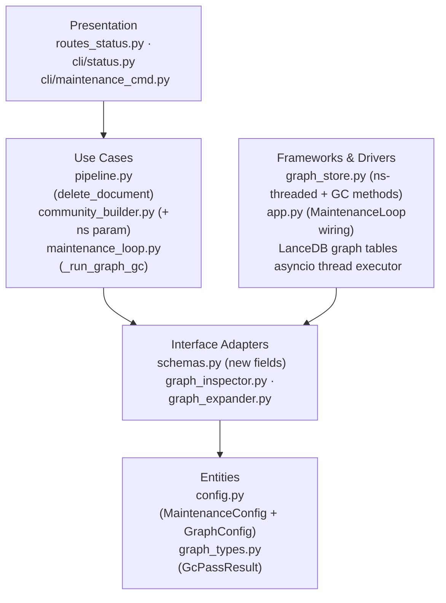
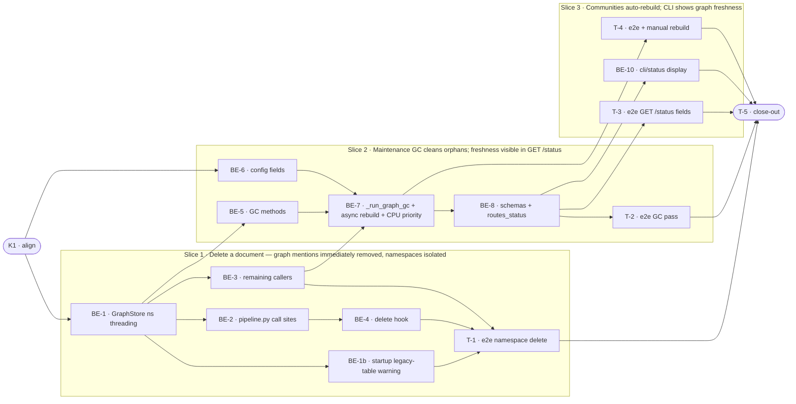

# E2d · Graph Lifecycle Hygiene — Team Plan

**How to read this file**
- **Architecture approach:** Clean Architecture — the default; no override skill requested. **Layers:** Presentation · Use Cases · Interface Adapters · Entities · Frameworks & Drivers. Each task's first sub-bullet names the layer it touches.
- The **Frontend, Backend, and Tester** sections are the **depth view** — each role's work, grouped by layer.
- The **Task Breakdown** is the **order view** — every task is a single-role checkbox in execution order, opening with a dependency graph.
- **Phases are vertical slices**: each delivers a working end-to-end increment. No separate "integrate" phase. Sliced with the **`vertical-slicer` skill**.
- Each task carries the **role tag at the end of its title line**, then sub-bullets: **layer · estimate** (decimal hours), **needs · completes**, and a **Tests** block. **needs** = predecessor tasks; **completes** = the scenario `S#` it makes true, or the contract `C#` it realises.
- **Tests** are tagged by level. **Unit and integration tests belong to the implementing dev** (test-first); **e2e and manual tests are the tester's tasks**. The close-out task writes no tests.
- **Contracts** are logical: C1 is authored as a TypeSpec HTTP service that emits an `openapi.yaml` (see links); C2 and C3 are internal logical seams authored as core-construct `.tsp` files compiled clean with `--no-emit`.
- **Role tags** (`#frontend-role`, `#backend-role`, `#tester-role`) mark each task and each role-owned section.
- IDs (`S#`, `C#`, `BE-#`/`T-#`/`K#`, `Q#`) are the traceability thread.
- **Rule:** edit your own tasks freely; change a contract only by team agreement.

---

## Background

Graph tables (`_archon_graph_{col}_nodes/edges/communities/mentions`) grow monotonically: document deletion never removes mention rows, TTL-pruned chunks leave orphan mentions, and orphaned nodes and edges accumulate silently. Two namespaces sharing a collection name point to the same four graph tables, breaking multi-namespace isolation entirely. Communities built from stale graph data cause `local`/`global` search to surface ghost entities.

---

## Goal

After this feature ships: deleting a document immediately removes its mention rows from the graph; the maintenance GC pass drops orphan nodes/edges and prunes mentions for expired or deleted chunks; communities are automatically invalidated and asynchronously rebuilt at low CPU priority after GC; two namespaces with identically-named collections write to distinct graph tables (`_archon_graph_{ns}__{col}_*`); and `GET /status` surfaces `stale_mention_count` and `last_graph_gc_at` so operators can observe graph freshness without running a manual query.

---

## Scope

### In Scope
- Wire `graph_store.delete_mentions_by_doc` into `pipeline.delete_document` (and by extension maintenance orphan cleanup at the loop layer)
- New `GraphStore` methods: `delete_orphan_nodes_and_edges(ns, collection)` and `prune_stale_mentions(ns, collection)` for the GC pass
- New maintenance policy `[maintenance] graph_gc = true` (default `true`; skips silently when `graph.enabled = false`)
- Community invalidation: clear communities table when GC removes nodes; `communities_invalidated: bool` per collection in `GraphCollectionStats`
- Async community rebuild job via `asyncio.create_task` after GC; configurable via `[graph] gc_rebuild_communities = true` and `[graph] gc_rebuild_cpu_priority = "low"` (low/normal/high)
- `GraphStatusDetail` gains `stale_mention_count: int`; `MaintenanceStatusDetail` gains `last_graph_gc_at: str | null` (written to `.maintenance-state.json` after each GC pass)
- Namespace-scoped graph table names: rename all four table-name helpers in `GraphStore` from `_archon_graph_{col}_*` to `_archon_graph_{ns}__{col}_*`; thread `ns: str` through all `GraphStore` public method signatures
- Trailing/leading `_` AND internal `__` guard in `GraphStore._validate_collection` and `constants.py _validate_namespace` (separator-collision prevention; makes `_archon_graph_{ns}__{col}_*` an injective mapping)
- `cli/status.py` Presentation display of `stale_mention_count` and `last_graph_gc_at`
- `POST /maintenance/trigger` already exists — no new CLI command needed for on-demand GC

### Out of Scope
- Per-collection GC exclusion patterns (use existing `[maintenance] exclude`)
- Incremental community update (full rebuild only; incremental is a future optimisation)
- Stale centroid statistics from TTL pruning
- Multi-namespace graph cross-collection queries (route already resolves namespace via `request.state.namespace`; table rename makes it correct end-to-end without further route changes)
- Automated data migration for existing `_archon_graph_{col}_*` tables — operators must manually delete old tables after upgrade (documented in `BREAKING.md`). A startup WARNING (BE-1b) lists any legacy tables found.

---

## Acceptance criteria
- `pipeline.delete_document` calls `graph_store.delete_mentions_by_doc(collection, doc_id, namespace)` before returning
- After maintenance GC, all nodes with zero remaining mentions are absent from graph tables
- After maintenance GC, all edges whose source or target node was removed are absent
- After maintenance GC, all mention rows whose `chunk_id` no longer exists in the vector store are pruned
- When GC removes ≥1 node, the communities table is cleared and an async rebuild is enqueued
- `GET /status` `graph` sub-object contains `stale_mention_count: int` after at least one GC pass; `maintenance` sub-object contains `last_graph_gc_at: str | null`
- `GraphCollectionStats` contains `communities_invalidated: bool`
- Graph tables follow `_archon_graph_{ns}__{col}_*` naming; two namespaces with identical collection names have distinct tables and distinct data
- Collection and namespace names ending or starting with `_` are rejected by validation
- GC passes silently when `graph.enabled = false`; no exception, no log error
- CPU priority reduction degrades gracefully when `os.setpriority()` is unavailable or raises (WARNING logged, rebuild continues at normal priority)

---

## What does NOT change
- `POST /maintenance/trigger` endpoint — on-demand GC uses it as-is
- `graph build-communities` CLI command — manual rebuild path, unchanged
- `GET /graph/cross-collection` route — namespace resolution already correct via `request.state.namespace`
- The Leiden community detection algorithm — full rebuild only
- `IngestResult.warnings` — graph edge-count warning already in place

---

## Known limitations / accepted trade-offs
- `stale_mention_count` is cached from the last GC run (O(1) state-file read); live accuracy depends on maintenance interval
- Community rebuild is a full replace, not incremental; large graphs may take seconds to rebuild after GC
- `os.setpriority(os.PRIO_PROCESS, 0, nice_value)` (absolute) is used rather than `os.nice()` (relative), preventing cumulative drift from thread reuse. CPU priority reduction is **Linux-only**. On Linux, each thread has its own scheduler niceness; calling `os.setpriority(os.PRIO_PROCESS, 0, cpu_nice)` inside the `asyncio.to_thread` Leiden worker scopes the priority reduction to that thread. On macOS/BSD, `os.nice()` is per-process and would permanently deprioritize the entire server — the implementation must gate this call: `if sys.platform == 'linux': os.setpriority(os.PRIO_PROCESS, 0, cpu_nice)`. On Windows, `os.setpriority` may not exist (`AttributeError` caught). The `gc_rebuild_cpu_priority` config is a no-op on all non-Linux platforms; a WARNING is logged at startup when `gc_rebuild_cpu_priority != 'normal'` on a non-Linux system. Priority is restored to the thread's original nice value (captured via `os.getpriority` before the `setpriority` call) via `finally` on the same thread after the Leiden worker exits — thread reuse in the `ThreadPoolExecutor` does not propagate lowered priority to unrelated tasks.
- No per-collection GC scheduling; all collections in one namespace run GC in the same pass
- GC iterates full mention/node tables per collection; no ceiling is applied. For very large graphs (>100K rows), a single GC pass may take several seconds. Add resumable GC pagination as a future optimization if needed.
- Collection and namespace names may not contain `__`; this is a new constraint. Pre-existing collections/namespaces with `__` in their names must be renamed before upgrading.
- The namespace table rename (`_archon_graph_{col}_*` → `_archon_graph_{ns}__{col}_*`) is a breaking change for any deployment with existing graph data. Old tables must be deleted manually. The startup WARNING (BE-1b) identifies them. Graph data is rebuildable via re-ingest.
- The trailing/leading-`_` validation guard is NEW in E2d. If any live collection or namespace name ends with `_` (previously valid per the existing regex), that name will now raise `ValueError` on graph operations. Operators must rename such collections before upgrading if graph is enabled.
- The live-set fetch for GC iterates all chunk rows and retains only `chunk_id` strings. For large collections (millions of chunks), this is a frozenset of strings — manageable, but operator-visible memory use during GC passes.

---

## Approach & architecture

This feature is a set of vertical changes across the persistence (graph tables), domain (pipeline, maintenance loop), and observation (status API) layers. The namespace-scoped table-name rename is the foundational change that all other work threads through; it is carried inside the first demoable behavior (document delete) rather than as a standalone setup phase.



**Layer map (and role mapping)**

| Layer | Role | Components touched |
|-------|------|-------------------|
| Presentation | **Frontend — N/A** (no web UI) | — |
| Presentation | Backend | `routes_status.py`, `cli/status.py`, `cli/maintenance_cmd.py` |
| Use Cases | Backend | `pipeline.py` (`delete_document` hook), `community_builder.py` (`+ns`), `maintenance_loop.py` (`_run_graph_gc`) |
| Interface Adapters | Backend | `schemas.py` (new fields), `graph_inspector.py`, `graph_expander.py`, `routes_graph.py` |
| Entities | Backend | `config.py` (`MaintenanceConfig.graph_gc`, `GraphConfig.gc_rebuild_*`), `graph_types.py` (gains `GcPassResult`) |
| Frameworks & Drivers | Backend | `graph_store.py` (ns threading + 3 new GC methods), `app.py` (pass `graph_store` to `MaintenanceLoop`), LanceDB table access, `eval/backends.py` (`CommunityStoreStub`) |

**What changes**
- `graph_types.py`: gains `GcPassResult` dataclass: `orphan_nodes_removed: int`, `orphan_edges_removed: int`, `communities_invalidated: bool` — computed in `__post_init__`: `self.communities_invalidated = self.orphan_nodes_removed > 0`. Not directly settable; default is derived.
- `graph_store.py`: 4 table-name helpers produce `_archon_graph_{ns}__{col}_*`; all ~18 public methods gain `ns: str` as their LAST parameter, matching the `store.py` trailing-namespace convention; trailing/leading-`_` AND internal `__` validation guard added; 3 new GC methods: `delete_orphan_nodes_and_edges`, `prune_stale_mentions(collection, live_chunk_ids, ns)`, `count_stale_mentions(collection, live_chunk_ids, ns)`. **Keyword-only `ns` for methods with optional parameters:** Any GraphStore method that accepts both an optional positional parameter (e.g. `limit=None`) and the required `ns` parameter MUST declare `ns` as keyword-only via `*`: `def get_all_mentions(self, collection, limit=None, *, ns)`. The `*` marker makes `ns` keyword-only and required; Python allows this even though `ns` has no default and comes after `limit=None`.
- `pipeline.py`: `delete_document` gains a graph hook; all existing `_graph_store.*` call sites gain `namespace` argument
- `community_builder.py`: `build(collection)` gains `build(collection, ns)`; `build()` already offloads CPU work via `asyncio.to_thread`; `os.setpriority()` must be called INSIDE the `to_thread` callable
- `maintenance_loop.py`: `__init__` gains `graph_store: GraphStore | None`; new `_run_graph_gc` policy; state file gains `last_graph_gc_at` and per-collection `communities_invalidated` + GC counts; gains `_rebuild_state: dict[tuple[str,str], RebuildState]` — a per-`(ns, col)` record replacing the three separate `_rebuild_tasks`, `_rebuild_completed`, `_rebuild_pending` dicts. `RebuildState` is a local dataclass with fields: `task: asyncio.Task`, `pending: bool = False`, `completed: bool = False`. The done-callback updates `state.completed = True` and `state.pending = False` on success (or re-enqueues if `state.pending is True`). `_run_one_pass` reads and clears `state.completed` before running GC for each collection (so a fresh invalidation after completion is not conflated). Entries are removed when both task is done AND no pending rebuild remains. Excluded/deleted collections' entries are cleared at the start of each pass.
- `config.py`: `MaintenanceConfig.graph_gc: bool = True`; `GraphConfig.gc_rebuild_communities: bool = True`, `gc_rebuild_cpu_priority: str = "low"` (valid values: `"low"` → `os.setpriority(os.PRIO_PROCESS, 0, 10)`, `"normal"` → `os.setpriority(os.PRIO_PROCESS, 0, 0)`, `"high"` → `os.setpriority(os.PRIO_PROCESS, 0, -5)` — may require privilege; `OSError` is caught and degraded gracefully)
- `schemas.py`: `GraphCollectionStats.communities_invalidated: bool = False`; `GraphStatusDetail.stale_mention_count: int = 0`; `MaintenanceStatusDetail.last_graph_gc_at: str | null`
- `routes_status.py`: `_build_graph_status` and `_build_maintenance_status` updated
- `cli/status.py`: display graph GC fields
- `app.py`: wire `graph_store` into `MaintenanceLoop` constructor
- **Namespace threading at call sites**: `graph_inspector.py`, `graph_expander.py`, `routes_graph.py`, `routes_status.py`, `cli/graph_cmd.py`, `eval/backends.py`

**Key decisions (from the brief)**
- Namespace in method signatures (not constructor) as the LAST parameter — matches `store.py` per-call pattern (`namespace: str = DEFAULT_NAMESPACE` trailing position); one pipeline instance serves multiple namespaces
- Hybrid GC timing: mention deletion is immediate (cheap); orphan node/edge detection is batched in maintenance (cross-table scan)
- `asyncio.create_task` with a kept reference and done-callback (not fire-and-forget) — task reference and state stored in `_rebuild_state[(ns, col)]` (`RebuildState` dataclass), preventing CPython GC mid-run; exceptions surfaced at ERROR log level, `completed` flag cleared only on success; duplicate rebuild tasks are suppressed if one is already in-flight via `state.pending` flag
- `communities_invalidated` persisted in `.maintenance-state.json` per-collection health entry — survives restarts; always accurate; O(1) read
- `stale_mention_count` measured by `count_stale_mentions` BEFORE prune at the start of each GC pass (not after, which would always return ~0); cached in state file — live scan would require a cross-table join on every `GET /status` poll
- CPU priority is applied inside the `asyncio.to_thread` Leiden worker, scoped to that thread only. Calling `os.nice()` from the coroutine would affect the entire server process.
- State-file writes are serialized through `_run_one_pass`'s single `_save_state` call — rebuild done-callbacks never touch the state file directly. This eliminates the read-modify-write race between concurrent writers.

---

## Contracts / seams

Boundaries where roles must agree. **Logical, not code.** Changing one requires team agreement.

**TypeSpec used.** C1 is an HTTP/API seam (emits OpenAPI). C2 and C3 are internal logical seams (core-construct `.tsp`, compiled clean with `--no-emit`).

---

**C1 — GET /status graph and maintenance schema** *(Interface Adapters ↔ HTTP clients)*

`GraphCollectionStats` gains `communities_invalidated: bool`. `GraphStatusDetail` gains `stale_mention_count: int` (aggregate cached count from last GC run). `MaintenanceStatusDetail` gains `last_graph_gc_at: str | null` (ISO-8601 timestamp of last GC pass) — consistent with `last_expired_pruned_at` precedent from E2a. All fields are additive and backward-compatible.

- See [`api-contracts/e2d-graph-lifecycle-hygiene-status-contract.tsp`](api-contracts/e2d-graph-lifecycle-hygiene-status-contract.tsp) + [`api-contracts/e2d-graph-lifecycle-hygiene-status-contract.openapi.yaml`](api-contracts/e2d-graph-lifecycle-hygiene-status-contract.openapi.yaml)
- Realised by: BE-8 · Verified by: BE-8 (integration), T-3 (e2e)

---

**C2 — GraphStore namespace-threaded interface** *(Frameworks & Drivers ↔ Use Cases)*

Every `GraphStore` public method gains `ns: str` as their LAST parameter, matching the `store.py` per-call convention (`namespace: str = DEFAULT_NAMESPACE` trailing position). This is NOT the first positional.

**Parameter order:** `ns` is the LAST parameter on all methods, e.g.: `deleteMentionsByDoc(collection, docId, ns): void`, `deleteOrphanNodesAndEdges(collection, ns): GcPassResult`, `pruneStaleMentions(collection, liveChunkIds, ns): int`, `countStaleMentions(collection, liveChunkIds, ns): int`. All other methods follow `method_name(collection, ..., ns: str)`.

Table names follow `_archon_graph_{ns}__{col}_*`.

**GcPassResult dataclass (Entities layer, graph_types.py):**
- `orphan_nodes_removed: int` — number of nodes deleted
- `orphan_edges_removed: int` — number of edges deleted
- `communities_invalidated: bool` — set by `__post_init__` as `orphan_nodes_removed > 0`; not an `init` parameter.

Three new GC methods:
- `delete_orphan_nodes_and_edges(collection, ns) → GcPassResult`
- `prune_stale_mentions(collection, live_chunk_ids: frozenset[str], ns) → int` — deletes mention rows whose `chunk_id` is NOT in `live_chunk_ids`
- `count_stale_mentions(collection, live_chunk_ids: frozenset[str], ns) → int` — counts mention rows whose `chunk_id` is NOT in `live_chunk_ids`. Used to pre-measure stale mention count at the START of a GC pass (before prune), so the cached `stale_mention_count` reflects what was stale before cleanup, not the post-cleanup ~0 value. NOT called from `GET /status` directly.

Note: `prune_stale_mentions` does not guard against empty `live_chunk_ids` — it is the Use Case's responsibility to verify the live-set read is valid before calling this method.

All call sites in `pipeline.py`, `community_builder.py`, `graph_inspector.py`, `graph_expander.py`, `routes_graph.py`, `routes_status.py`, `cli/graph_cmd.py`, and `eval/backends.py` must supply `ns`.

**Name constraint:** Collection and namespace names must NOT contain the substring `__` (two consecutive underscores). `GraphStore._validate_collection` and `constants.py _validate_namespace` enforce this. This makes `_archon_graph_{ns}__{col}_*` an injective mapping — no two distinct `(ns, col)` pairs produce the same table name.

- See [`e2d-c2-graphstore-namespace-seam.tsp`](e2d-c2-graphstore-namespace-seam.tsp)
- Realised by: BE-1, BE-5 · Verified by: BE-1 (unit + integration), BE-5 (unit + integration)

---

**C3 — MaintenanceLoop graph GC policy** *(Use Cases ↔ Frameworks & Drivers)*

`MaintenanceLoop.__init__` gains `graph_store: GraphStore | None` and `_rebuild_state: dict[tuple[str,str], RebuildState]`. `MaintenanceConfig` gains `graph_gc: bool = True`. `GraphConfig` gains `gc_rebuild_communities: bool = True` and `gc_rebuild_cpu_priority: "low" | "normal" | "high"`.

**`_run_graph_gc(col, ns)` policy:**
1. No-op if `graph_store is None` or `graph.enabled = false`; returns immediately with no calls, no error.
2. GC is inserted as the LAST per-collection policy in `_run_one_pass`, after `_run_expired_chunk_pruning`. This ensures TTL-expired chunks are already removed from the vector store before `live_chunk_ids` is computed, so their mentions are correctly classified as stale in the same pass.
3. Fetch live chunk ids: `live_chunk_ids = frozenset()`. Call `list_chunks_raw(collection, ns)` inside a try/except. If an exception is raised (I/O error, table missing, any `Exception`), abort GC for this collection with a WARNING log (`'list_chunks_raw failed for {collection}: {e} — skipping GC to prevent data loss'`) and skip to the next collection; do NOT call `prune_stale_mentions`. If `list_chunks_raw` succeeds — empty or non-empty — trust the result and proceed. Note: the Use Case layer (`_run_graph_gc`) is responsible for passing the correct namespace; passing a wrong namespace is a caller bug, not a condition this method guards against. Note: `meta.chunk_count` is NOT a reliable guard here because `prune_expired_chunks` never decrements it — a TTL-emptied collection retains a positive `meta.chunk_count` indefinitely.
4. GC policy order: (a) call `count_stale_mentions(collection, live_chunk_ids, ns)` and cache result as `stale_count`; (b) call `prune_stale_mentions(collection, live_chunk_ids, ns)`; (c) call `delete_orphan_nodes_and_edges(collection, ns)` → `GcPassResult`; (d) pass `stale_count` (measured before prune) back to `_run_one_pass` for state-file write. `stale_mention_count` in `GraphStatusDetail` is the **sum** of per-collection stale counts. `_run_one_pass` accumulates: `new_state['stale_mention_count'] = sum(per_collection_stale_counts)` before the single `_save_state` call. It must not overwrite (last-collection-wins), average, or max the values.
5. If `communities_invalidated` **and `config.gc_rebuild_communities` is `True`**: check `_rebuild_state.get((ns, col))`. 
   - If no entry or the previous task is done: create a new task, store `RebuildState(task=new_task, pending=False)` in `_rebuild_state[(ns, col)]`. Attach a done-callback that: (a) logs exceptions at ERROR, (b) if `state.pending is True` — clear `pending`, enqueue a NEW task (updating `state.task`) — the new task MUST have the same done-callback attached to it, otherwise the second rebuild has no error logging and no completion signaling; otherwise set `state.completed = True`, (c) never writes to the state file.
   - If an entry exists and the task is still in-flight: set `state.pending = True` only. Do NOT enqueue a second task.
6. CPU priority: Use `os.setpriority(os.PRIO_PROCESS, 0, cpu_nice_value)` (Linux only, absolute nice level) rather than `os.nice()` (relative). This prevents cumulative drift when `ThreadPoolExecutor` reuses the same worker thread across rebuilds. `os.setpriority` with `PRIO_PROCESS` and pid 0 sets the calling thread's nice level on Linux. This call is made at the start of the `asyncio.to_thread` Leiden worker, but ONLY when `sys.platform == 'linux'` — on macOS/BSD, `os.nice` is per-process and would degrade the entire server permanently. On non-Linux platforms, the priority step is silently skipped. Priority MUST be restored after the Leiden work completes. The enter-`setpriority` call and the Leiden work MUST be independently guarded:
```python
original_nice = None  # initialize before try
# Enter: independent try/except — failure does NOT skip Leiden
if sys.platform == 'linux':
    try:
        original_nice = os.getpriority(os.PRIO_PROCESS, 0)
        os.setpriority(os.PRIO_PROCESS, 0, cpu_nice_value)
    except (PermissionError, AttributeError, OSError) as e:
        log.warning('Could not set CPU priority: %s — rebuild continues at normal priority', e)
else:
    original_nice = None

# Leiden work — always runs regardless of enter-setpriority outcome
try:
    <leiden work here>
finally:
    if sys.platform == 'linux' and original_nice is not None:
        try:
            os.setpriority(os.PRIO_PROCESS, 0, original_nice)
        except (PermissionError, AttributeError, OSError):
            pass  # best-effort restore
```
The `finally` restores `original_nice` (captured via `os.getpriority` before the call), not hardcoded 0. This preserves a pre-existing process nice value (e.g. `Nice=5` from systemd) after the worker exits.
7. At the START of each collection's GC, `_run_one_pass` checks `_rebuild_state.get((ns, col))`: if `state.completed is True`, record `communities_invalidated=False` in the working state and remove the entry. This must happen BEFORE running GC so a fresh invalidation in the same pass is correctly detected as new.

At the start of each `_run_one_pass`, remove `_rebuild_state` entries for collections not in the current namespace's active collection set (handles excluded/deleted collections).
8. `_run_graph_gc` follows the same per-policy try/except pattern as other `_run_one_pass` policies: any exception is caught, recorded in `col_health['last_error']`, and the pass continues to the next collection. Partial GC (prune succeeded, orphan delete failed) is safe because both operations are idempotent — the next pass retries. NOTE: Idempotency guarantees a retry produces the same state; it does NOT restore mention rows that were deleted. The empty-set guard in `_run_graph_gc` (C3) prevents mass deletion from bad live-set reads. A partial GC failure after a valid prune is safe to retry; a partial GC failure after a corrupted-input prune may leave the graph in a state requiring full re-ingest.

- See [`e2d-c3-maintenance-gc-seam.tsp`](e2d-c3-maintenance-gc-seam.tsp)
- Realised by: BE-6, BE-7 · Verified by: BE-7 (unit + integration), T-2 (e2e)

---

## Scenarios #tester-role

Behavioural only. Cover happy, unhappy, edge, and non-functional paths.

| id | Scenario (Given / When / Then) |
|----|-------------------------------|
| **S1** | **Given** a document is ingested with graph enabled and its mention rows exist in the mentions table · **When** `pipeline.delete_document(doc_id, collection, namespace)` is called · **Then** `graph_store.delete_mentions_by_doc(collection, doc_id, namespace)` is called; the mentions table contains zero rows for that `doc_id` |
| **S2** | **Given** a document was deleted (mentions removed); its node and edge rows remain because no other mention references them · **When** the maintenance GC pass runs · **Then** nodes with zero remaining mentions are deleted; edges whose source or target node was deleted are deleted; per-collection GC counts are updated in the state file |
| **S3** | **Given** TTL-expired chunks were pruned from the vector store but their mention rows were not removed · **When** the maintenance GC pass runs · **Then** mentions whose `chunk_id` no longer exists in the vector store at the time of the GC pass are pruned; subsequent status shows reduced `stale_mention_count`. Note: `prune_stale_mentions` keys on chunk EXISTENCE (chunk_id not in live set), not directly on `expires_at`. Chunks expired-but-not-yet-pruned still appear in the live set and their mentions are NOT pruned until the chunk is removed by `_run_expired_chunk_pruning`. GC runs after expired-chunk pruning, so both are cleaned in the same pass. |
| **S4** | **Given** GC deleted ≥1 node from a collection · **When** the GC pass completes · **Then** the communities table for that collection is cleared; an async rebuild task is enqueued via `asyncio.create_task`; `communities_invalidated` is `true` until the rebuild task finishes |
| **S5** | **Given** at least one GC pass has completed · **When** `GET /status` is called · **Then** `graph.stale_mention_count` is a cached integer (O(1) read from state file) and `maintenance.last_graph_gc_at` is an ISO-8601 timestamp |
| **S6** | **Given** namespace `ns_a` and `ns_b` both have a collection named `docs` · **When** graph data is ingested into both, then a document is deleted from `ns_a/docs` · **Then** each namespace writes to distinct tables (`_archon_graph_ns_a__docs_nodes` vs `_archon_graph_ns_b__docs_nodes`); only `ns_a/docs` graph data is affected |
| **S7** | **Given** entity E appears in documents D1 and D2 with mention rows for both · **When** D1 is deleted · **Then** D1's mentions are removed; E's node is NOT deleted (D2's mention remains); GC confirms node survival |
| **S8** | **Given** `graph.enabled = false` in config · **When** the maintenance GC pass runs · **Then** `_run_graph_gc` returns immediately; no `GraphStore` methods are called; no error is logged; pass completes normally |
| **S9** | **Given** a second GC pass fires while an async community rebuild is still in-flight (tracked in `_rebuild_state`) · **When** the second GC pass evaluates whether to enqueue a rebuild · **Then** the second GC pass detects the existing in-flight task and does NOT spawn a new one. When the in-flight task completes, `write_communities` performs a full replace. No duplicate communities. No exception raised. If a third invalidating GC fires while the rebuild from S4 is still in-flight, `_rebuild_state[(ns,col)].pending` is set to `True`. When the in-flight rebuild completes, `_rebuild_state[(ns,col)].pending == True` causes the done-callback to enqueue a fresh rebuild rather than reporting `communities_invalidated=False`. |
| **S10** | **Given** the rebuild thread uses independently guarded enter-`setpriority` and Leiden work (Linux only): enter is wrapped in its own `try/except`, capturing `original_nice` via `os.getpriority` before the call; Leiden work runs in a separate `try/finally` that restores `original_nice` · **When** the community rebuild worker starts and enter-`os.setpriority` raises (`PermissionError`, `AttributeError`, or `OSError`) · **Then** the exception is caught; a WARNING is logged; the Leiden work still completes (communities produced); the `finally` block runs and calls `os.setpriority(os.PRIO_PROCESS, 0, original_nice)` to restore (even if that too raises, it is caught) |
| **S11** | **Given** a collection name ending with `_` (e.g. `docs_`) or starting with `_` (e.g. `_internal`) · **When** `GraphStore._validate_collection` is invoked · **Then** `ValueError` is raised; no graph tables are created |
| **S12** | **Given** document D was deleted (mentions removed) · **When** D is re-ingested with graph enabled · **Then** `delete_mentions_by_doc` is called again (no-op); new mentions are written; no duplicate rows |
| **S13** | **Given** GC runs and finds all nodes have ≥1 mention row remaining · **When** the orphan node/edge check executes · **Then** no nodes or edges are deleted; `write_communities` is NOT called; communities remain intact; `stale_mention_count` is 0 |

---

## Frontend — Presentation #frontend-role

N/A — no web UI. This is a single-tier backend application. The Presentation layer is the HTTP routes and CLI, both co-deployed with the server. Frontend work does not apply to this feature.

---

## Backend — Entities · Use Cases · Adapters · Frameworks #backend-role

**Scope:** All Clean Architecture layers (Entities through Frameworks & Drivers) plus the CLI and HTTP Presentation layer. Writes unit and integration tests test-first for every implementation task.

**Owns layers:** Entities, Use Cases, Interface Adapters, Frameworks & Drivers, and Presentation (routes + CLI).

**Tasks by layer** *(checkable in the Task Breakdown)*
- Frameworks & Drivers: BE-1 (`GraphStore` namespace threading), BE-1b (startup legacy-table warning), BE-5 (GC methods), BE-10 (`app.py` wiring via BE-7)
- Entities: BE-6 (config fields)
- Use Cases: BE-2 (`pipeline.py` call sites), BE-4 (delete hook), BE-7 (`MaintenanceLoop._run_graph_gc` + async rebuild + CPU priority — merged from former BE-9)
- Interface Adapters: BE-3 (remaining callers), BE-8 (schemas + `routes_status.py`)
- Presentation: BE-10 (`cli/status.py` display)

**Done when**
- [ ] `pipeline.delete_document` always calls `delete_mentions_by_doc` before returning — S1
- [ ] Graph tables use `_archon_graph_{ns}__{col}_*` naming; two namespaces with same collection name are isolated — S6
- [ ] Trailing/leading `_` in collection or namespace names raises `ValueError` — S11
- [ ] Maintenance GC pass removes orphan nodes/edges and prunes stale mentions — S2, S3
- [ ] GC invalidates communities and enqueues async rebuild when nodes are removed — S4
- [ ] `GET /status` contains `stale_mention_count` and `last_graph_gc_at` after GC — S5
- [ ] GC is a no-op when `graph.enabled = false` — S8
- [ ] `os.setpriority()` failure degrades gracefully to normal priority — S10

---

## Tester #tester-role

**Scope:** the tester owns **e2e and manual** tests plus the project **close-out**. **Unit and integration** tests belong to the implementing backend dev, written test-first in each implementation task's `Tests` block.

**Tasks** *(checkable in the Task Breakdown)*
- Slice 1: T-1 (e2e: namespace-isolated delete + shared-entity survival)
- Slice 2: T-2 (e2e: maintenance GC → orphans cleaned + stale_mention_count in status)
- Slice 3: T-3 (e2e: GET /status fields correct after GC), T-4 (e2e + manual: communities auto-rebuild + CPU priority)
- Close-out: T-5

**Allocation** — each scenario at the cheapest level that proves it

| Scenario | Cheapest level | Notes |
|----------|----------------|-------|
| S1 | unit + integration | Dev-owned (BE-4); unit: mock `_graph_store`; integration: `make_real_app(graph_enabled=True)` + delete |
| S2 | unit + integration + e2e | Dev unit+integration (BE-7); tester e2e: T-2 |
| S3 | unit + integration + e2e | Dev unit+integration (BE-5, BE-7); tester e2e: T-2 |
| S4 | unit + integration + e2e | Dev unit+integration (BE-7); tester e2e: T-4 |
| S5 | integration + e2e | Dev integration (BE-8); tester e2e: T-3 |
| S6 | integration + e2e | Dev integration (BE-1); tester e2e: T-1 |
| S7 | e2e | Tester: T-1 (shared-entity check is a cross-document concern) |
| S8 | unit | Dev-owned (BE-7): `graph.enabled=false` early-return test |
| S9 | unit | Dev-owned (BE-7): single-flight rebuild guard; second GC detects in-flight task and skips |
| S10 | unit + manual | Dev unit (BE-7): mock `os.setpriority` to raise `PermissionError`, `AttributeError`, or `OSError`; tester T-4 manual: restricted-permissions environment |
| S11 | unit | Dev-owned (BE-1): regex guard test |
| S12 | integration | Dev-owned (BE-4): re-ingest after delete |
| S13 | unit | Dev-owned (BE-7): GC finds 0 orphans → no invalidation |

---

## Documentation update

Docs the feature touches — the close-out task works through this list. List only real files.

- [ ] `Documentation/Backlog/e2d-graph-lifecycle-hygiene-brief.md` — no changes needed (source brief)
- [ ] `Documentation/Backlog/e2d-graph-lifecycle-hygiene-team-plan.md` — this file
- [ ] `CLAUDE.md` — add E2d description: GC policy, namespace-scoped table names, `MaintenanceLoop.graph_store` param, new `GraphStore` methods, `communities_invalidated` lifecycle
- [ ] `Documentation/Architecture/110_component_catalog_and_layer_breakdown.md` — `GraphStore` new methods + `MaintenanceLoop` new param
- [ ] `Documentation/Architecture/130_data_architecture_and_persistence.md` — graph table naming convention (`_archon_graph_{ns}__{col}_*`)
- [ ] `Documentation/Architecture/160_operational_readiness_monitoring_and_reliability.md` — new `graph_gc` maintenance policy + GC status fields
- [ ] `Documentation/Architecture/600_api_reference_or_public_interface.md` — `GET /status` new graph fields (`stale_mention_count`, `last_graph_gc_at`, `communities_invalidated`)
- [ ] `BREAKING.md` — (a) namespace table rename orphans existing graph tables (`_archon_graph_{col}_*` must be deleted manually after upgrade; BE-1b WARNING identifies them); (b) document the separator charset constraint (collection and namespace names must not contain `__`)
- [ ] `archon-search.toml.example` — add `[maintenance] graph_gc = true` and `[graph] gc_rebuild_communities = true` / `gc_rebuild_cpu_priority = "low"`

---

## Open questions

Resolve before committing (status moves `draft → planned`).

| id | Area | Question |
|----|------|----------|
| **Q1** | Architecture | **Resolved in this revision:** `namespace` is threaded at the method level (not constructor) — matches the `store.py` per-call pattern; each pipeline instance serves multiple namespaces. |
| **Q2** | GC scan completeness | **Resolved:** The GC pass must scan all rows to exhaustion — it cannot be capped by `_MENTIONS_SCAN_CEILING` (that is a read-only output ceiling for the graph inspector, not a safety valve for a correctness-critical cleanup). `prune_stale_mentions` and `delete_orphan_nodes_and_edges` must iterate the full table or paginate to completion. If table sizes become a concern in production, GC resumability across passes is the correct solution. Do not reuse the inspector's ceiling for GC. |
| **Q3** | Async job | **Resolved in this revision:** `asyncio.create_task` with a kept reference and done-callback (not fire-and-forget) is the right fit — no user-facing result to poll; job store adds complexity without benefit for community rebuild. The task reference is held in `_rebuild_state` to prevent CPython GC mid-run; exceptions are surfaced at ERROR level; the `communities_invalidated` flag is cleared only on success. |
| **Q4** | `communities_invalidated` persistence | **Resolved in this revision:** stored in `.maintenance-state.json` per-collection health entry — survives restarts, always accurate, O(1) read; live derivation would require a full table scan per status request. |
| **Q5** | Schema placement | **Resolved:** `stale_mention_count` stays aggregate on `GraphStatusDetail` (cached from GC run). The brief explicitly chose caching over live scans for this field; per-collection breakdown can be added later if operators need it and a non-live derivation path exists. |
| **Q6** | Schema placement | **Resolved:** Move `last_graph_gc_at` to `MaintenanceStatusDetail` (not `GraphStatusDetail`). The `last_expired_pruned_at` precedent from E2a is exact — same pattern, lives in maintenance. GC is a maintenance policy; its timestamp belongs with other maintenance timestamps. Update BE-8 accordingly. |
| **Q7** | Data migration | **Resolved:** Add a startup WARNING listing any orphaned `_archon_graph_{col}_*` tables found in the DB (one scan at startup, log once). Zero migration logic; operators are alerted and can delete old tables manually. Document in `BREAKING.md` that old tables must be manually deleted after upgrade. |
| **Q8** | CLI display | **Resolved:** Include BE-10 (`cli/status.py` display). The CLI is the primary human-facing observation surface; the brief's stated goal of operator observability requires it. |
| **Q9** | Trailing `_` guard | **Resolved:** Apply the guard to **both** `GraphStore._validate_collection` and `constants.py` `_validate_namespace`. The separator-collision risk exists at both ends of the `{ns}__{col}` compound key; both must reject trailing/leading `_`. BE-1 covers both. |
| **Q10** | `delete_by_source_path` | **Resolved:** The GC pass's `prune_stale_mentions` is sufficient — it catches mentions for maintenance-deleted files on the same pass. One maintenance-interval lag is acceptable (identical behaviour to TTL-expired chunks). `delete_by_source_path` stays unaware of the graph layer; no coupling introduced. |
| **Q11** | `get_entity_presence_across_collections` | **Resolved:** Keep `list[str]` for E2d; callers already filter by namespace via `request.state.namespace` and pass only that namespace's collection names. Cross-namespace entity-presence is explicitly out of scope. Document as a known limitation in `BREAKING.md`; promote to `list[tuple[str, str]]` in a future iteration. |

---

## Task Breakdown

Single-role tasks in execution order, grouped into **vertical slices**.

### Dependency graph



---

### Phase 0 · Kickoff

- [x] **K1** — Agree contracts and scenarios with the team #team
    - — · 1.0h
    - completes C1, C2, C3
    - Tests

---

### Phase 1 · Delete a document — graph mentions immediately removed, namespaces isolated *(walking skeleton: carries the namespace-scoped table rename foundation inside the first demoable behavior)*

- [x] **BE-1** — Namespace-scope all `GraphStore` table names and method signatures; add trailing/leading-`_` validation guard #backend-role
    - Frameworks & Drivers · 4.0h
    - needs K1 · completes C2, S6, S11
    - Tests
        - #unit_test — `test_nodes_table_name_includes_namespace` — `_nodes_table_name("ns_a", "docs")` returns `_archon_graph_ns_a__docs_nodes`
        - #unit_test — `test_validate_collection_rejects_trailing_underscore` — `"docs_"` raises `ValueError` (genuinely new behavior — the new trailing-`_` guard)
        - #unit_test — `test_validate_collection_rejects_leading_underscore` — `"_internal"` raises `ValueError`. NOTE: Leading `_` is already rejected by the existing `_COLLECTION_RE`. This test confirms the existing guard remains intact after the new guard is added (regression guard, not new behavior).
        - #unit_test — `test_validate_collection_rejects_internal_double_underscore` — `"my__col"` raises `ValueError` (genuinely new behavior — the new `__` guard)
        - #unit_test — `test_validate_collection_accepts_valid_names` — `"docs"`, `"my-col"`, `"col123"` all pass without error (regression guard for pre-existing valid names)
        - #unit_test — `test_validate_namespace_rejects_trailing_underscore` — `"tenant_"` raises `ValueError` (genuinely new behavior). NOTE: The `__` guard must be added to BOTH `_validate_collection` AND `_validate_namespace` in `constants.py`.
        - #unit_test — `test_validate_namespace_rejects_leading_underscore` — `"_tenant"` raises `ValueError`. NOTE: Probably already caught by existing namespace regex; include as regression guard.
        - #unit_test — `test_validate_namespace_rejects_internal_double_underscore` — `"ten__ant"` raises `ValueError` (genuinely new behavior)
        - #unit_test — `test_validate_namespace_accepts_valid_names` — `"tenant-a"`, `"tenant_a"`, `"ns123"` all pass
        - #integration_test — `test_graph_tables_isolated_across_namespaces` — write DIFFERENT data to ns_a/docs and ns_b/docs; assert ns_a reads its own data AND ns_b reads its own DIFFERENT data; assert ns_a writes do not appear in ns_b reads AND vice versa (two-sided isolation); real LanceDB in `tmp_path`

- [x] **BE-1b** — At server startup, scan the LanceDB database for tables matching the old pattern `_archon_graph_{col}_*` (no `__` separator) and emit a one-time WARNING listing them with instructions to delete manually #backend-role
    - Frameworks & Drivers · 1.0h
    - needs BE-1 · completes S6 (operator-visible upgrade notice)
    - Tests
        - #unit_test — `test_startup_warns_on_legacy_graph_tables` — mock DB with two old-pattern table names, assert WARNING logged listing both
        - #unit_test — `test_startup_no_warn_when_no_legacy_tables` — mock DB with only new-pattern tables, assert no WARNING

- [x] **BE-2** — Thread `namespace` through all `graph_store.*` call sites in `pipeline.py` (ingest, search, explain paths) #backend-role
    - Use Cases · 3.0h
    - needs BE-1 · completes (foundational for BE-4)
    - Tests
        - #unit_test — `test_ingest_file_passes_namespace_to_graph_store` — mock `_graph_store`, pass `ns='tenant_x'` (a non-default namespace), assert `ensure_graph_tables` called with `ns='tenant_x'` exactly (not ANY and not DEFAULT_NAMESPACE)
        - #unit_test — `test_search_local_mode_passes_namespace_to_graph_store` — mock, pass `ns='tenant_x'`, assert `list_community_representatives` called with `ns='tenant_x'` as a keyword argument
        - #unit_test — `test_explain_graph_mode_passes_namespace_to_graph_store` — mock `_graph_store`; call `pipeline.explain(graph_mode="naive", namespace="tenant_x")`; assert graph_store method called with `ns="tenant_x"`
        - #unit_test — `test_search_global_mode_passes_namespace_to_graph_store` — mock `_graph_store`; call `pipeline.search(graph_mode="global", namespace="tenant_x")`; assert `list_community_representatives` or equivalent called with `ns="tenant_x"`

- [x] **BE-3** — Thread `namespace` through all remaining `GraphStore` callers: `graph_inspector.py`, `community_builder.py`, `graph_expander.py`, `routes_graph.py`, `routes_status.py`, `cli/graph_cmd.py`, `eval/backends.py` (`CommunityStoreStub`) #backend-role
    - Interface Adapters · 3.0h
    - needs BE-1 · completes (foundational for BE-7)
    - Tests
        - #unit_test — `test_inspect_collection_passes_namespace` — mock `graph_store`, pass `ns='tenant_x'`, verify `get_all_nodes` called with `ns='tenant_x'` as keyword argument (not ANY and not DEFAULT_NAMESPACE)
        - #unit_test — `test_community_builder_passes_namespace` — mock `graph_store`, pass `ns='tenant_x'`, verify `get_all_nodes` and `write_communities` called with `ns='tenant_x'` as keyword argument
        - #unit_test — `test_graph_expander_passes_namespace` — mock, pass `ns='tenant_x'`, verify `find_nodes_by_name` called with `ns='tenant_x'` as keyword argument

- [x] **BE-4** — Wire `graph_store.delete_mentions_by_doc(collection, doc_id, namespace)` into `pipeline.delete_document` immediately after `store.delete_document`. The graph mention hook must be guarded: `if self._graph_store is not None:`. If `delete_mentions_by_doc` raises, catch the exception, log a WARNING, and return the normal delete result — the GC pass will catch stale mentions on the next run. Graph hook failure must NOT fail an otherwise-successful document delete. #backend-role
    - Use Cases · 1.0h
    - needs BE-2 · completes S1, S12
    - Tests
        - #unit_test — `test_pipeline_delete_document_calls_delete_mentions_by_doc` — mock `_graph_store`, assert `delete_mentions_by_doc` called with correct args after delete
        - #unit_test — `test_pipeline_delete_document_skips_graph_when_graph_store_none` — `_graph_store=None`, assert no AttributeError
        - #unit_test — `test_pipeline_delete_document_graph_failure_does_not_fail_delete` — mock `delete_mentions_by_doc` to raise `RuntimeError`; assert `delete_document` succeeds, WARNING logged
        - #integration_test — `test_pipeline_delete_document_removes_mentions_real_graph` — ingest doc, delete, assert 0 mention rows for `doc_id` in real graph store
        - #integration_test — `test_pipeline_delete_document_idempotent_on_re_ingest` — delete then re-ingest, assert no duplicate mentions

- [x] **T-1** — E2e: delete doc removes namespace-isolated graph mentions; shared entity survives in sibling doc #tester-role
    - — · 2.0h
    - needs BE-4, BE-3 · completes S6, S7
    - Tests
        - #e2e_test — `test_e2d_t1_delete_removes_mentions_namespace_isolated` — ingest DISTINCT data to ns_a/docs and ns_b/docs; delete from ns_a; assert ns_a's mentions are gone AND ns_b's mentions for its own data are still present (two-sided)
        - #e2e_test — `test_e2d_t1_shared_entity_survives_partial_delete` — ingest D1+D2 with shared entity E, delete D1, POST trigger, GET graph → node E present; delete D2, POST trigger, GET graph → node E absent

---

### Phase 2 · Maintenance GC cleans orphans; freshness visible in GET /status

- [x] **BE-5** — New `GraphStore` GC methods: `delete_orphan_nodes_and_edges(collection, ns)`, `prune_stale_mentions(collection, live_chunk_ids: frozenset[str], ns)`, `count_stale_mentions(collection, live_chunk_ids: frozenset[str], ns)` — all with `ns` as the LAST parameter per C2 convention. `prune_stale_mentions` and `count_stale_mentions` receive `live_chunk_ids` from the Use Case layer (which fetches them from `SearchStore`); `GraphStore` itself has no access to `SearchStore`. #backend-role
    - Frameworks & Drivers · 4.0h
    - needs BE-1 · completes C2 (GC methods)
    - Tests
        - #unit_test — `test_gc_pass_result_communities_invalidated_computed_correctly` — directly instantiate `GcPassResult(orphan_nodes_removed=1, orphan_edges_removed=0)` and assert `.communities_invalidated is True`; instantiate `GcPassResult(orphan_nodes_removed=0, orphan_edges_removed=2)` and assert `.communities_invalidated is False`. NOTE: This is the only test that verifies the Entities-layer invariant at the dataclass level.
        - #unit_test — `test_delete_orphan_nodes_removes_zero_mention_nodes` — mock mentions table empty, mock nodes table non-empty, assert delete called
        - #unit_test — `test_delete_orphan_edges_removed_with_nodes` — orphan edge referencing deleted node → removed
        - #unit_test — `test_delete_orphan_nodes_preserves_nodes_with_remaining_mentions` — mentions table has entity E referenced by D2's chunk; nodes table has E; call `delete_orphan_nodes_and_edges`; assert E is STILL PRESENT and `orphan_nodes_removed == 0` (S7 unit coverage)
        - #unit_test — `test_delete_orphan_edges_preserves_edges_between_live_nodes` — two surviving nodes with an edge between them + one orphan edge; assert only orphan edge removed, live edge remains
        - #unit_test — `test_prune_stale_mentions_removes_absent_chunk_ids` — pass `live_chunk_ids` frozenset NOT containing the stale chunk_ids; assert mention rows with non-existent chunk_id → pruned
        - #unit_test — `test_count_stale_mentions_returns_correct_count` — mention table has 3 stale rows and 2 live rows; assert `count_stale_mentions == 3`; after `prune_stale_mentions`, assert `count_stale_mentions == 0`
        - #integration_test — `test_graph_gc_methods_real_lancedb` — write orphan node (no mention), call `delete_orphan_nodes_and_edges`, assert node gone; write stale mention (no chunk in store), call `prune_stale_mentions` with appropriate `live_chunk_ids`, assert 0 stale mentions

- [x] **BE-6** — `MaintenanceConfig.graph_gc: bool = True` + `GraphConfig.gc_rebuild_communities: bool = True` + `gc_rebuild_cpu_priority: str = "low"` + TOML loading in `_apply_toml`; startup WARNING when `gc_rebuild_cpu_priority != 'normal'` and `sys.platform != 'linux'` (operator-visible signal that the config field is a no-op on the current OS) #backend-role
    - Entities · 1.0h
    - needs K1 · completes C3 (config portion)
    - Tests
        - #unit_test — `test_maintenance_config_graph_gc_default_true` — `MaintenanceConfig()` has `graph_gc=True`
        - #unit_test — `test_graph_config_gc_rebuild_defaults` — `GraphConfig()` has `gc_rebuild_communities=True`, `gc_rebuild_cpu_priority="low"`
        - #unit_test — `test_toml_graph_gc_false_overrides_default` — TOML `[maintenance] graph_gc = false` → `MaintenanceConfig.graph_gc == False`
        - #unit_test — `test_toml_gc_cpu_priority_round_trip` — TOML `[graph] gc_rebuild_cpu_priority = "normal"` → `GraphConfig.gc_rebuild_cpu_priority == "normal"`
        - #unit_test — `test_startup_warns_when_cpu_priority_non_normal_on_non_linux` — mock `sys.platform = 'darwin'` and `gc_rebuild_cpu_priority = "low"`; assert WARNING logged at startup containing `gc_rebuild_cpu_priority`; assert no WARNING when `gc_rebuild_cpu_priority = "normal"` on non-Linux; assert no WARNING on Linux regardless of value

- [x] **BE-7** — `MaintenanceLoop._run_graph_gc()` policy + async community rebuild + CPU priority + `__init__` wiring + state file + `app.py` wiring #backend-role
    - Use Cases · 6.0h
    - needs BE-5, BE-6, BE-3 · completes S2, S3, S4, S8, S9, S10, S13, C3
    - Notes: Before calling `prune_stale_mentions`, the Use Case fetches the live chunk_id set via `store.list_chunks_raw(collection, namespace)` (or equivalent) and passes it as `live_chunk_ids` to `GraphStore`. `_run_graph_gc` fetches live chunk ids from `SearchStore` before calling `prune_stale_mentions`. GC results are returned to `_run_one_pass` for state-file write — `_run_graph_gc` never calls `_save_state` directly. CPU priority mapping: `"low"` → `os.setpriority(os.PRIO_PROCESS, 0, 10)` (lower priority), `"normal"` → `os.setpriority(os.PRIO_PROCESS, 0, 0)` (unchanged), `"high"` → `os.setpriority(os.PRIO_PROCESS, 0, -5)` (higher priority, may require privilege; caught by `OSError` guard).
    - Tests
        - #unit_test — `test_run_graph_gc_fetches_live_chunk_ids_with_correct_namespace` — mock `store.list_chunks_raw`; call `_run_graph_gc(collection, ns="tenant_x")`; assert `list_chunks_raw` called with `collection` and `namespace="tenant_x"` (NOT default namespace)
        - #unit_test — `test_run_graph_gc_calls_prune_then_delete_orphans` — mock `graph_store`, assert call order: `count_stale_mentions` first, then `prune_stale_mentions`, then `delete_orphan_nodes_and_edges`
        - #unit_test — `test_run_graph_gc_sets_communities_invalidated_when_nodes_removed` — mock returns `orphan_nodes_removed=1`, assert state entry `communities_invalidated=True`
        - #unit_test — `test_run_graph_gc_skips_when_graph_disabled` — `graph_store=None`, assert no calls, no exception (S8)
        - #unit_test — `test_run_graph_gc_skips_when_graph_enabled_false_with_live_store` — non-None `graph_store` + config `graph.enabled=False`; assert zero graph_store method calls, no error logged (S8 realistic path)
        - #unit_test — `test_run_graph_gc_aborts_when_list_chunks_raises_exception` — mock `list_chunks_raw` to raise `RuntimeError`; assert `prune_stale_mentions` NOT called; assert WARNING logged
        - #unit_test — `test_run_graph_gc_prunes_when_collection_genuinely_empty` — mock `list_chunks_raw` to return empty iterator successfully (no exception); assert `prune_stale_mentions` IS called with `live_chunk_ids == frozenset()`
        - #unit_test — `test_run_graph_gc_prunes_ttl_emptied_collection` — mock: `prune_expired_chunks` has deleted all chunks (so `meta.chunk_count` stays at 5 — TTL expiry never decrements it); `list_chunks_raw` returns empty iterator (collection is truly empty in the vector store); assert `prune_stale_mentions` IS called with `live_chunk_ids == frozenset()` (empty live set succeeds, not aborted)
        - #unit_test — `test_run_graph_gc_no_invalidation_when_zero_orphans` — `orphan_nodes_removed=0`, assert `communities_invalidated=False`, `write_communities` NOT called (S13)
        - #unit_test — `test_maintenance_state_writes_last_graph_gc_at` — mock GC pass; assert `last_graph_gc_at`, `stale_mention_count`, and per-collection `communities_invalidated` are all present in the `new_state` dict and persisted
        - #unit_test — `test_stale_mention_count_is_sum_across_collections` — two collections each with 3 stale mentions; after GC pass; assert `new_state['stale_mention_count'] == 6`
        - #unit_test — `test_run_graph_gc_creates_rebuild_task_when_invalidated` — patch `asyncio.create_task`, assert called when `communities_invalidated=True`
        - #unit_test — `test_run_graph_gc_no_rebuild_when_gc_rebuild_disabled` — `gc_rebuild_communities=False`, assert `create_task` NOT called
        - #unit_test — `test_run_graph_gc_does_not_spawn_duplicate_rebuild_when_one_in_flight` — second GC call with existing `_rebuild_state[(ns, col)]` entry (task still in-flight); assert `create_task` NOT called a second time; assert `_rebuild_state[(ns,col)].pending == True` (S9)
        - #unit_test — `test_second_invalidating_gc_sets_pending_flag` — first GC enqueues rebuild (in-flight); second GC fires; assert `_rebuild_state[(ns,col)].pending == True`; simulate rebuild completion; assert new rebuild task spawned (not `communities_invalidated=False`)
        - #unit_test — `test_rebuild_cpu_priority_maps_to_nice_values` — mock `os.getpriority` (returns a captured original, e.g. 5) and `os.setpriority`; assert `os.getpriority` is called before `os.setpriority` on enter; configure `gc_rebuild_cpu_priority = "low"` and assert `os.setpriority` called TWICE per rebuild — first with `(os.PRIO_PROCESS, 0, 10)` (enter) and second with `(os.PRIO_PROCESS, 0, original_nice)` (restore, `finally` exit — using the value captured by `os.getpriority`, not literal 0); configure `"normal"` → enter `(os.PRIO_PROCESS, 0, 0)`, exit `(os.PRIO_PROCESS, 0, original_nice)`; configure `"high"` → enter `(os.PRIO_PROCESS, 0, -5)`, exit `(os.PRIO_PROCESS, 0, original_nice)`. NOTE: This pins the string→integer mapping, the getpriority-before-setpriority order, and the restore-to-captured-value invariants as tested behaviors. The test must verify (a) `os.getpriority` called before `os.setpriority` on enter, (b) the final restore call uses `original_nice` (not literal 0), (c) a second rebuild call does NOT compound to a different value.
        - #unit_test — `test_rebuild_cpu_priority_linux_only` — on Linux (mock `sys.platform == 'linux'`), assert `os.setpriority` called with expected value; on non-Linux (mock `sys.platform != 'linux'`), assert `os.setpriority` NOT called and no exception raised
        - #unit_test — `test_rebuild_thread_priority_failure_degrades_gracefully` — mock enter-`os.setpriority` to raise `PermissionError`, `AttributeError`, or `OSError`; assert that in all cases: (a) a WARNING is logged, (b) the Leiden work still completes (communities are produced), (c) `os.setpriority` is called a second time to restore `original_nice` (even if that restore call also raises, it is caught)
        - #unit_test — `test_run_graph_gc_partial_failure_recorded_and_pass_continues` — mock `delete_orphan_nodes_and_edges` to raise `RuntimeError` after `prune_stale_mentions` succeeds; assert `col_health["last_error"]` non-null; assert GC pass continues to the next collection; assert a subsequent GC call with a working `delete_orphan_nodes_and_edges` mock succeeds (idempotent retry)
        - #unit_test — `test_concurrent_rebuild_idempotent` — two `write_communities` calls on same collection → second overwrites first, no exception (S9 full-replace invariant)
        - #unit_test — `test_rebuild_task_removed_from_tracking_on_completion` — run rebuild task to completion; assert `_rebuild_state[(ns, col)]` entry removed; assert a subsequent invalidating GC spawns a new task (not blocked). This proves the done-callback correctly releases the slot.
        - #unit_test — `test_communities_invalidated_cleared_on_rebuild_completion` — run rebuild task to awaited completion; assert `_rebuild_state[(ns,col)].completed == True`; then run a subsequent `_run_one_pass`; assert `new_state` has `communities_invalidated=False` and `_rebuild_state` entry cleared
        - #integration_test — `test_run_graph_gc_runs_after_expired_chunk_pruning` — integration test: ingest with short TTL, wait for expiry, trigger maintenance, assert expired chunk mentions pruned in single pass
        - #integration_test — `test_maintenance_loop_graph_gc_integration` — `make_real_app(graph_enabled=True, maintenance_enabled=True)`, ingest doc, delete doc, POST `/maintenance/trigger`, poll state file until `last_graph_gc_at` non-null, assert orphan node gone
        - #integration_test — `test_gc_rebuild_communities_after_gc` — ingest with graph + communities, delete a SUBSET of docs (leaving ≥1 document so the remaining graph yields ≥1 community); assert: (a) `community_count == N` before delete, (b) `communities_invalidated == True` after GC, (c) `communities_invalidated == False` and `community_count ≥ 1` after rebuild completes

- [ ] **BE-8** — Schema additions (`GraphCollectionStats.communities_invalidated`, `GraphStatusDetail.stale_mention_count`, `MaintenanceStatusDetail.last_graph_gc_at`) + update `_build_graph_status` and `_build_maintenance_status` in `routes_status.py`. `_build_graph_status` gains a new dependency: it reads `.maintenance-state.json` to extract per-collection `communities_invalidated` (parsed by the same `_load_state` helper used by `_build_maintenance_status`). Both status builders share the same state-file reader, preventing duplicate/drifting readers. #backend-role
    - Interface Adapters · 2.0h
    - needs BE-7 · completes S5, C1
    - Tests
        - #unit_test — `test_graph_collection_stats_has_communities_invalidated` — `GraphCollectionStats` field present with default `False`
        - #unit_test — `test_graph_status_detail_has_stale_mention_count` — field present, default 0
        - #unit_test — `test_maintenance_status_detail_has_last_graph_gc_at` — `MaintenanceStatusDetail` field present, default `None`
        - #unit_test — `test_build_graph_status_reads_communities_invalidated_from_state` — mock state file with `communities_invalidated=True` for a collection, assert field propagated
        - #unit_test — `test_build_graph_status_reads_communities_invalidated_both_true_and_false` — parametrize over `True` and `False` state values; assert exact propagation
        - #integration_test — `test_get_status_graph_fields_after_gc` — full app, run GC via trigger, GET `/status`, assert `graph.stale_mention_count` ≥ 0 and `maintenance.last_graph_gc_at` non-null

- [ ] **T-2** — E2e: POST /maintenance/trigger → orphan nodes cleaned; stale_mention_count in graph section and last_graph_gc_at in maintenance section of GET /status #tester-role
    - — · 2.0h
    - needs BE-7, BE-8 · completes S2, S3, S5
    - Tests
        - #e2e_test — `test_e2d_t2_gc_removes_orphan_nodes_visible_in_graph` — ingest doc with graph, delete doc, POST trigger, poll GET `/graph/{col}`, assert orphan node absent
        - #e2e_test — `test_e2d_t2_gc_status_fields_populated` — create stale mentions before GC; POST trigger; GET `/status`; assert `graph.stale_mention_count > 0` after GC; run a clean GC pass (no stale mentions); assert `graph.stale_mention_count == 0` (before/after comparison, not just type check); assert `maintenance.last_graph_gc_at` is ISO string

---

### Phase 3 · Communities auto-rebuild after GC; CLI shows graph freshness

- [ ] **BE-10** — `cli/status.py`: display `stale_mention_count` and `last_graph_gc_at` from the `graph` sub-object in `archon-search status` output #backend-role
    - Presentation · 1.0h
    - needs BE-8 · completes (CLI observability from the brief's goal)
    - Tests
        - #unit_test — `test_status_cli_displays_stale_mention_count` — mock `GET /status` response with `graph.stale_mention_count=5`, assert `5` appears in CLI output
        - #unit_test — `test_status_cli_displays_last_graph_gc_at` — mock response with non-null `maintenance.last_graph_gc_at`, assert timestamp appears in output
        - #unit_test — `test_status_cli_graph_fields_absent_when_graph_disabled` — mock response with `graph=null`, assert no crash

- [ ] **T-3** — E2e: GET /status graph.stale_mention_count and maintenance.last_graph_gc_at correct after GC pass #tester-role
    - — · 1.0h
    - needs BE-8 · completes S5
    - Tests
        - #e2e_test — `test_e2d_t3_status_stale_mention_count_zero_after_clean_gc` — ingest, no deletions, POST trigger, GET `/status`, assert `graph.stale_mention_count == 0` and `maintenance.last_graph_gc_at` non-null

- [ ] **T-4** — E2e + manual: communities auto-rebuild after GC; CPU priority degrades gracefully #tester-role
    - — · 2.0h
    - needs BE-7 · completes S4, S9, S10
    - Tests
        - #e2e_test — `test_e2d_t4_communities_invalidated_then_rebuilt_after_gc` — ingest with graph + build communities, delete a SUBSET of docs (leaving ≥1 document so the remaining graph yields ≥1 community). Two-pass sequence required: **Pass 1:** POST trigger; after completion, assert `communities_invalidated=True` in status (GC ran, rebuild enqueued). Await rebuild task completion (poll `_rebuild_state[(ns,col)].completed == True` in-process, or wait for the task future to resolve). **Pass 2:** POST a second maintenance trigger; after completion, assert `communities_invalidated=False` and `community_count ≥ 1` in `GET /status`. NOTE: a single maintenance pass cannot confirm rebuild completion — the done-callback sets `_rebuild_state[(ns,col)].completed` only after the pass ends; the flag is only visible to the NEXT pass. Also assert `community_count == N` before delete as baseline (a).
        - #manual_test — CPU priority degradation under restricted permissions — run `archon-search serve` as a user without `CAP_SYS_NICE`; trigger GC; verify WARNING in log, rebuild completes normally

---

### Phase 4 · Close-out

- [ ] **T-5** — Project close-out & acceptance fact-check #tester-role
    - — · 4.0h
    - needs T-1, T-2, T-3, T-4, BE-10 · completes (acceptance gate)
    - Tests
    - Duties
        - Update all documentation per the "Documentation update" section — `CLAUDE.md`, architecture docs, `BREAKING.md`, `archon-search.toml.example`.
        - Fix all build / compiler warnings, if any.
        - Run the full test suite (`uv run pytest`); fix every failing test, including any unrelated to this feature.
        - Validate every Acceptance criterion one-by-one with a fact check — no assumptions; confirm each is genuinely done.

**Critical path:** K1 → BE-1 → BE-5 → BE-7 → BE-8 → T-2 → T-5
