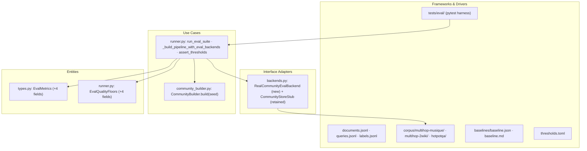
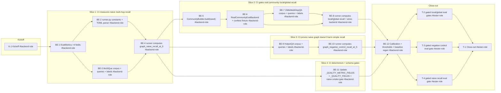

# E2e — Deterministic Graph Eval Gate v2

## How to read this file

**Architecture:** Clean Architecture. Valid layers (inward): **Presentation** → **Use Cases** → **Interface Adapters** → **Entities** → **Frameworks & Drivers**. All dependencies point inward.

**Slicing:** `vertical-slicer` skill — phases are outcome-named end-to-end behaviors. The first slice is the walking skeleton.

**Contracts:** TypeSpec v1.13.0 — internal seams as core-construct `.tsp` files (both compiled clean with `tsp compile --no-emit`). No HTTP/API seams exist for this feature.

**Role mapping:** This project has no web frontend. Presentation layer = CLI (`archon_search/cli/`). Frontend role is **N/A** (no CLI changes). All implementation is Backend. Tester is cross-cutting.

---

## Background

The existing graph quality gates (`graph_local_mrr = 1.0`, `graph_global_mrr = 1.0` in `tests/eval/thresholds.toml`) always pass because `CommunityStoreStub` returns fake chunk IDs absent from the eval store, causing the pipeline to fall back to standard hybrid search. The `graph_mrr` field is report-only with no gate. These numbers measure hybrid-search quality, not graph retrieval quality. A regression in graph recall ships undetected.

## Goal

Replace all three fake gates with real ones: run honest Recall@5 checks on three frozen public datasets (MuSiQue-Ans, 2WikiMultiHopQA, HotpotQA distractor), add a negative control establishing a regression baseline for graph mode on simple queries, and block CI on any regression.

## Scope

**In scope:**
- Frozen fixture subsets: MuSiQue-Ans (~100 questions, CC BY 4.0) and 2WikiMultiHopQA (~100 questions, Apache-2.0) for multi-hop recall; HotpotQA distractor (~100 questions, CC BY 4.0) as negative control
- Supporting paragraph corpora for each dataset (candidate documents)
- 4 new eval metrics: `graph_naive_recall_at_5`, `graph_local_recall_at_5`, `graph_global_recall_at_5`, `graph_negative_control_recall_at_5`
- Real community eval backend: deterministic Leiden seed, communities pre-built from multi-hop corpus in the eval harness
- Hard CI gates for all four new metrics, calibrated from one baseline run
- `EvalQualityFloors` extended with four new optional float fields
- Existing fake `graph_local_mrr = 1.0` and `graph_global_mrr = 1.0` floors replaced
- Baseline JSON and markdown regenerated with real values
- Two consecutive CI runs byte-identical on all four new metrics

**Out of scope:**
- LLM-judged eval frameworks (RAGAS, BenchmarkQED)
- Live/real-model eval — stub SHA-256 embedder only
- RepoBench-R code retrieval subset (deferred to E2g/E2h)
- Full 300–500 question datasets (100 per dataset sufficient for regression detection)

## Acceptance criteria

1. `graph_naive_recall_at_5`, `graph_local_recall_at_5`, `graph_global_recall_at_5`, `graph_negative_control_recall_at_5` computed by `run_eval_suite` and gated in CI.
2. Two consecutive CI runs produce byte-identical values on all four new metrics.
3. Old stub-based `graph_local_mrr = 1.0` and `graph_global_mrr = 1.0` floors removed from `thresholds.toml`; four real calibrated floors committed.
4. `archon-search[graph]` extras absent → new graph eval tests skip gracefully.
5. `baseline.json` includes the four new metric fields with non-None values.
6. `tests/eval/README.md` documents the new fixture datasets, corpus size, and calibration procedure.

## What does NOT change

- Existing `recall_at_1/3/5`, `mrr`, `ndcg` floors (graph queries excluded from standard retrieval metrics per existing invariant)
- `graph_mrr` field (report-only, retained as is). **Note:** `graph_mrr`'s computed value WILL change because MuSiQue naive-mode queries are added to `naive_graph_traces` (all naive-mode queries across all collections feed this bucket). This is expected and documented. BE-4 must note this side-effect; BE-12's calibration checklist must include regeneration of `graph_mrr` as well.
- `CommunityStoreStub` and its use for the `graph` collection (existing naive/local/global test queries remain)
- SHA-256 eval embedder backend (`EvalEmbedderBackend`)
- REST/MCP/CLI API surface
- `STORE_SCHEMA_VERSION` (eval is test-only; no production schema change)

## Known limitations / trade-offs

- 100 questions per dataset: sufficient to detect Recall@5 drops ≥ 5 pp, not for statistical significance studies
- Corpus size ~6,000 documents adds to eval run time; document in `tests/eval/README.md`
- Real Leiden community detection required for local/global eval — tests skip gracefully when `archon-search[graph]` is absent
- `leidenalg.find_partition` `seed` kwarg must be verified in a CI environment with graph extras installed (Q3)
- Corpus format: one JSONL file per dataset (e.g., `tests/eval/corpus/multihop-musique/corpus.jsonl`). Estimated size: ~6MB raw (~1KB/doc × 6000 docs). No git LFS required. Committed as plain JSONL.

---

## Approach & architecture

### Layer → component map

| Layer | Component | File | Change for E2e |
|---|---|---|---|
| Entities | `EvalMetrics` | `archon_search/eval/types.py` | +4 `float \| None` recall fields |
| Use Cases | `EvalQualityFloors` | `archon_search/eval/runner.py:41` | +4 optional float floor fields |
| Use Cases | `run_eval_suite` | `archon_search/eval/runner.py:684` | +4 Recall@5 computations |
| Use Cases | `_build_pipeline_with_eval_backends` | `archon_search/eval/runner.py:551` | inject `RealCommunityEvalBackend` for multi-hop collections; **new signature: accepts `community_backend_map: dict[str, CommunityBackend]` parameter; wraps in `DispatchingCommunityStore`** |
| Use Cases | `_optional_float_fields` tuple | `archon_search/eval/runner.py:162` | +4 entries |
| Use Cases | `_QUALITY_FLOOR_FIELDS` tuple | `archon_search/eval/runner.py:984` | +4 entries |
| Use Cases | `_RENDERED_QUALITY_FIELDS` tuple | `archon_search/eval/runner.py:1161` | +4 entries |
| Use Cases | `CommunityBuilder.build()` | `archon_search/community_builder.py:381` | +`seed: int \| None = None` |
| Use Cases | `_run_leiden_partition_sync()` | `archon_search/community_builder.py:119` | +`seed: int \| None = None` |
| Interface Adapters | `RealCommunityEvalBackend` | `archon_search/eval/backends.py` | New class |
| Interface Adapters | `DispatchingCommunityStore` | `archon_search/eval/backends.py` | New class — proxy that dispatches `communities_table_exists`, `list_community_representatives`, `find_nodes_by_name`, `get_communities_for_entities` to the correct `GraphStore` backend based on collection name |
| Interface Adapters | RealGraphExpander | `archon_search/eval/backends.py` | New class — reads entity names from eval GraphStore nodes table; used for naive-mode expansion in multi-hop collections |
| Interface Adapters | `CommunityStoreStub` | `archon_search/eval/backends.py:150` | Unchanged (retained for `graph` collection) |
| Frameworks & Drivers | Fixture index files | `tests/eval/documents.jsonl`, `queries.jsonl`, `labels.jsonl` | +multi-hop entries |
| Frameworks & Drivers | Corpus directories | `tests/eval/corpus/multihop-musique/`, `multihop-2wiki/`, `hotpotqa/` | New |
| Frameworks & Drivers | Gated tests | `tests/eval/test_e2e_graph_eval_gate_v2.py` | New file |
| Frameworks & Drivers | Determinism test | `tests/eval/test_eval_suite.py:24` `_QUALITY_METRIC_FIELDS` | +4 field names |
| Frameworks & Drivers | Baseline contract test | `tests/eval/test_baseline_contract.py:31` `_QUALITY_FIELDS` | +4 field names |
| Frameworks & Drivers | Thresholds + baseline | `thresholds.toml`, `baselines/baseline.json`, `baseline.md` | Regenerated in BE-9 |

### Key decisions

1. **Leiden seed via `find_partition(seed=)` directly** — `_run_leiden_partition_sync` gains `seed: int | None = None`. When `seed` is not None: pass it to the existing `leidenalg.find_partition(g, RBConfigurationVertexPartition, ..., seed=seed)` call — no API change, same production path. When `seed` is None: existing call is unchanged (preserves non-eval behavior). Verified (K-1): `find_partition` accepts `seed=None` as a first-class parameter on leidenalg 0.12.0. Default `None` preserves existing non-eval behavior. Eval harness uses `seed=_EVAL_LEIDEN_SEED = 42`.
2. **`RealCommunityEvalBackend`** — wraps a real `GraphStore` against the eval LanceDB tmp store pre-populated via `CommunityBuilder.build(seed=42)`. Used only for multi-hop collections (`multihop-musique`, `multihop-2wiki`, `hotpotqa`); `CommunityStoreStub` is retained for the `graph` collection (existing tests unaffected).
3. **Module-scoped conftest fixture** — `build_communities_for_eval` takes `eval_tmp_lancedb_root` as a fixture parameter, ensuring it writes to the same module-scoped LanceDB root used by `run_eval_suite`. Each test module gets an isolated LanceDB root via xdist worker isolation. Pattern mirrors `eval_tmp_lancedb_root` in `tests/eval/conftest.py`. The fixture (a) writes communities into `eval_tmp_lancedb_root` and (b) passes its path to `run_eval_suite` via the new `lancedb_root` parameter.
4. **Subset selection** — stratified random sampling with fixed seed. For 2WikiMultiHopQA: ~50 bridge + ~50 comparison questions. For MuSiQue-Ans: ~100 2-hop questions. For HotpotQA distractor: ~100 distractor questions. Selection documented in `tests/eval/corpus/LICENSE-DATASETS`.
5. **Negative control collection name** — `hotpotqa`; queries use `graph_mode: "naive"` and are partitioned into `negative_control_traces` (separate from `naive_graph_traces` on MuSiQue). The collection field distinguishes them.
6. **Shared eval store** — `build_communities_for_eval` must write communities into the SAME LanceDB path that `run_eval_suite` will use. The LanceDB root path is passed via `eval_tmp_lancedb_root` fixture parameter injection — NOT a separate throwaway `TemporaryDirectory`. BE-8 must add a `lancedb_root: Path | None = None` parameter to `run_eval_suite` (at `runner.py:684`). When supplied, the function uses this path instead of creating an internal `TemporaryDirectory`. The gated test in `test_e2e_graph_eval_gate_v2.py` passes the module-scoped fixture's `eval_tmp_lancedb_root` directly to `run_eval_suite(corpus_root, …, lancedb_root=eval_tmp_lancedb_root)`. The existing default (`None`) preserves current behavior for all other callers. Without this seam, community chunk IDs from the fixture store will never be found by the pipeline's store and the pipeline falls back to hybrid search, reintroducing the fake behavior E2e is meant to kill.
7. **Per-collection community backend dispatch** — `SearchPipeline.__init__` takes exactly one `graph_store: GraphStore | None` parameter and has no per-collection dispatch. To inject `RealCommunityEvalBackend` for `multihop-*` collections while keeping `CommunityStoreStub` for `graph`, the eval harness introduces `DispatchingCommunityStore(collection_name → CommunityBackend)`: a proxy class in `archon_search/eval/backends.py` (Interface Adapters layer) that implements the four-method CommunityBackend protocol (`communities_table_exists`, `list_community_representatives`, `find_nodes_by_name`, `get_communities_for_entities`) and dispatches to the correct backend based on collection name. `_build_pipeline_with_eval_backends` accepts `community_backend_map: dict[str, CommunityBackend]` and wraps it in a `DispatchingCommunityStore` before injecting into the pipeline.
8. **Determinism of `representative_chunk_ids`** — `CommunityBuilder` must sort community membership and `representative_chunk_ids` before writing, so that byte-identical `community_id`-independent recall outputs are achievable across runs. Note: `community_id=uuid4()` and `built_at` wall-clock do NOT affect `compute_recall_at_k` (which uses only chunk IDs), but sort order of representative chunks must be stable across calls. S9 assertion must check `representative_chunk_ids` byte-identity (sorted lists), not just set membership equality.
9. **Graph expander for multi-hop collections** — `StubGraphExpander` in `backends.py` has hardcoded entries only for the `graph` collection. For MuSiQue (`multihop-musique`), 2WikiMultiHopQA (`multihop-2wiki`), and HotpotQA (`hotpotqa`) collections, no graph expansion fires in naive mode — `graph_naive_recall_at_5` and `graph_negative_control_recall_at_5` would measure plain hybrid recall, not graph-augmented recall, defeating the purpose of the naive-mode gate. BE-6 must also build a `RealGraphExpander` backed by the same eval `GraphStore` (reads entity names from `_archon_graph_*_nodes` table) and inject it into the pipeline for multi-hop collections. Without this, naive-mode metrics for multi-hop collections are indistinguishable from `recall_at_5`.

---

## Contracts / seams

### C1 — EvalMetrics extension (internal logical seam)

**What crosses the seam:** 4 new `float | None` fields added to `EvalMetrics` (types.py) are also added as optional float floors to `EvalQualityFloors` (runner.py), listed in `_optional_float_fields`, `_QUALITY_FLOOR_FIELDS`, and `_RENDERED_QUALITY_FIELDS`, indexed in `thresholds.toml`, and recorded in `baseline.json`. All five sites must stay in sync.

- **TypeSpec file:** `e2e-graph-eval-gate-v2-contracts/eval-metrics-contract.tsp` (compiled clean)
- **Dependents:** `runner.py`, `test_eval_suite.py:_QUALITY_METRIC_FIELDS`, `test_baseline_contract.py:_QUALITY_FIELDS`, `baselines/baseline.json`, `thresholds.toml`
- **Realised by:** BE-1, BE-2
- **Verified by:** BE-8, T-1 (close-out)

### C2 — CommunityBackend protocol (internal logical seam)

**What crosses the seam:** Both `CommunityStoreStub` (retained) and `RealCommunityEvalBackend` (new) implement the same four-method protocol called by `SearchPipeline._search_graph_mode()` and `._search_local_mode()`.

- **TypeSpec file:** `e2e-graph-eval-gate-v2-contracts/community-backend-contract.tsp` (compiled clean)
- **Methods:** `communities_table_exists`, `list_community_representatives`, `find_nodes_by_name`, `get_communities_for_entities`
- **Scoping invariant:** `DispatchingCommunityStore` must only be called with these four methods. BE-6 must grep `pipeline.py` for all `self._graph_store.` callsites in local/global/naive search paths and confirm none require methods outside this set; any found must either be added to C2 or handled so the dispatcher is not reached.
- **Realised by:** BE-5, BE-6
- **Verified by:** BE-8, T-1 (close-out)

### C3 — `CommunityBuilder.build(seed)` interface (internal logical seam)

**What crosses the seam:** `CommunityBuilder.build()` and `_run_leiden_partition_sync()` gain `seed: int | None = None`; eval harness calls `build(collection, ns, seed=42)`; `None` means non-deterministic (existing behavior preserved).

- **Inline (no .tsp needed):** `async def build(self, collection: str, ns: str, *, seed: int | None = None) -> list[Community]`
- **Multiple call sites must be updated in `community_builder.py`: (a) `_run_leiden_partition_sync` at `:289` inside `_cluster_with_size_limit`, (b) `_run_leiden_partition_sync` at `:244` inside `_split_oversized_communities` (recursion for oversized communities) — both must receive the seed. The `asyncio.to_thread` call at `:445-447` wraps `_cluster_with_size_limit` and must forward `seed` as a positional/keyword argument.**
- **Realised by:** BE-5
- **Verified by:** BE-5 (determinism integration test), T-1 (close-out)

---

## Scenarios #tester-role

| ID | Given | When | Then | Notes |
|---|---|---|---|---|
| S1 | MuSiQue naive-mode queries in `queries.jsonl` | `run_eval_suite` completes | `graph_naive_recall_at_5` is non-None and in [0.0, 1.0] | Happy path — naive mode, no communities needed |
| S2 | Real communities pre-built from 2WikiMultiHopQA corpus with seed=42 | `run_eval_suite` runs local-mode queries | `graph_local_recall_at_5` reflects real community retrieval (not stub fallback) and is ≥ its floor | Happy path — requires `RealCommunityEvalBackend` |
| S3 | Real communities pre-built from 2WikiMultiHopQA corpus with seed=42 | `run_eval_suite` runs global-mode queries | `graph_global_recall_at_5` reflects real community retrieval and is ≥ its floor | Happy path — requires `RealCommunityEvalBackend` |
| S4 | HotpotQA naive-mode queries (negative control) in `queries.jsonl` | `run_eval_suite` completes | `graph_negative_control_recall_at_5` is ≥ its calibrated floor. Note: this guards against *regression*, not against initial harm vs no-graph baseline. A future E2f metric can add a paired null-vs-naive delta. | Happy path — negative control dataset |
| S5 | Eval suite configured with fixed Leiden seed + frozen fixtures | Two sequential runs with same corpus and thresholds | All four new metric fields are byte-identical across runs | Non-functional — determinism |
| S6 | Multi-hop collections ingested into eval LanceDB tmp store | Module-scoped conftest fixture fires before local/global queries | `CommunityBuilder.build(seed=42)` completes without error; communities table has ≥ 2 communities with ≥ 2 representative chunks each (non-trivial community structure required) | Happy path — community pre-build |
| S7 | `archon-search[graph]` extras (leidenalg/igraph) absent | `tests/eval/test_e2e_graph_eval_gate_v2.py` is collected | All community-dependent tests skip with informative message (not fail) | Edge case — missing extras. Note: `--thresholds-path tests/eval/thresholds.toml` is already in `pyproject.toml` addopts, so gated tests run in the default suite. S7 skip is triggered by missing leidenalg/igraph via `pytest.importorskip`, not by missing `--thresholds-path`. |
| S8 | Calibration run completed; real floors committed to `thresholds.toml` | `--thresholds-path` passed to gated tests | Old `graph_local_mrr = 1.0` and `graph_global_mrr = 1.0` entries absent; four new real floors present | Happy path — floor replacement |
| S9 | `CommunityBuilder.build(seed=42)` called twice on identical corpus | Both calls complete | `representative_chunk_ids` lists are byte-identical across runs (sorted before write; not just same members) | Non-functional — seed pinning |
| S10 | Multi-hop corpus documents added to eval store | Standard retrieval metrics computed | `recall_at_1/3/5`, `mrr`, `ndcg` values unchanged from pre-E2e baseline | Non-functional — regression guard |
| S11 | `_QUALITY_METRIC_FIELDS` updated to include four new fields | `test_eval_suite_is_deterministic_except_latency` runs | Determinism test validates all four new fields for byte-identity | Non-functional — test coverage |
| S12 | Frozen dataset files committed to repo | Repo is cloned or audited | `tests/eval/corpus/LICENSE-DATASETS` present with attribution for MuSiQue (CC BY 4.0), 2WikiMultiHopQA (Apache-2.0), HotpotQA (CC BY 4.0) | Edge case — license compliance |

---

## Frontend — N/A #frontend-role

No Presentation layer (CLI) changes are required. The `archon-search graph build-communities` CLI is not modified — the eval harness calls `CommunityBuilder.build(seed=42)` directly, bypassing the CLI. Eval is invoked via `uv run pytest -m eval`.

---

## Backend #backend-role

### Scope

Owns all layers for this feature: Entities, Use Cases, Interface Adapters, Frameworks & Drivers.

### Layers owned

| Layer | Tasks |
|---|---|
| Entities | BE-1 |
| Use Cases | BE-2, BE-4, BE-5, BE-8, BE-10 |
| Interface Adapters | BE-6 |
| Frameworks & Drivers | BE-3, BE-7, BE-9, BE-11, BE-12 |

### Done when

- [ ] 4 new `float | None` fields on `EvalMetrics`; 4 new optional float fields on `EvalQualityFloors`
- [ ] `_optional_float_fields`, `_QUALITY_FLOOR_FIELDS`, `_RENDERED_QUALITY_FIELDS` tuples each extended with 4 entries
- [ ] `CommunityBuilder.build()` and `_run_leiden_partition_sync()` accept `seed: int | None = None`
- [ ] `RealCommunityEvalBackend` implements the CommunityBackend protocol against a real GraphStore
- [ ] MuSiQue (~100q), 2WikiMultiHopQA (~100q), HotpotQA (~100q) corpus + queries + labels committed
- [ ] `run_eval_suite` computes all four new Recall@5 metrics; `_build_pipeline_with_eval_backends` injects `RealCommunityEvalBackend` for multi-hop collections
- [ ] `test_e2e_graph_eval_gate_v2.py` with 4 gated tests passes under `--thresholds-path`
- [ ] `_QUALITY_METRIC_FIELDS` and `_QUALITY_FIELDS` updated in determinism and baseline-contract tests
- [ ] Baseline regenerated with 4 non-None new metrics; 4 real floors in `thresholds.toml`; old stub floors removed

---

## Tester #tester-role

### Ownership note

Unit and integration tests are **dev-written** (test-first, inside each BE-# task). The tester owns the gated eval verification tasks T-2, T-3, T-4 (run after BE-12 calibration sets the floors) and the mandatory close-out task T-1.

All scenarios are automatable. No manual tests required except license compliance verification (S12, close-out).

**Tasks** *(checkable in the Task Breakdown)*
- T-2 — gated local/global eval gate verification (Close-out, after calibration)
- T-3 — gated negative control eval gate verification (Close-out, after calibration)
- T-4 — gated naive recall eval gate verification (Close-out, after calibration)
- T-1 — Close-out & acceptance fact-check

### Allocation table

| Scenario | Cheapest proving level | Owner | Location |
|---|---|---|---|
| S1 naive recall non-None | Integration | Backend dev | `test_e2e_graph_eval_gate_v2.py` smoke test |
| S2 local recall real ≥ floor | e2e (gated eval) | Tester | `test_e2e_graph_eval_gate_v2.py` |
| S3 global recall real ≥ floor | e2e (gated eval) | Tester | `test_e2e_graph_eval_gate_v2.py` |
| S4 negative control ≥ floor | e2e (gated eval) | Tester | `test_e2e_graph_eval_gate_v2.py` |
| S5 byte-identical determinism | Integration | Backend dev | `test_eval_suite.py` updated |
| S6 community pre-build succeeds | Integration | Backend dev | `test_e2e_graph_eval_gate_v2.py` conftest fixture |
| S7 graph extras absent → skip | Unit | Backend dev | `test_e2e_graph_eval_gate_v2.py` (importorskip guard) |
| S8 stub floors replaced | Integration | Backend dev (BE-12) | `thresholds.toml` + CI gate |
| S9 Leiden seed determinism | Integration | Backend dev | `test_e2e_graph_eval_gate_v2.py` two-build assertion |
| S10 standard metrics unaffected | Integration | Backend dev (regression) | `test_eval_suite.py` existing gated tests |
| S11 `_QUALITY_METRIC_FIELDS` updated | Unit | Backend dev | `test_eval_suite.py` BE-8 update |
| S12 LICENSE-DATASETS present | Manual | Tester (close-out) | `tests/eval/corpus/LICENSE-DATASETS` |

---

## Documentation update

- [ ] `Documentation/Backlog/e2e-graph-eval-gate-v2-brief.md` — source brief, no changes needed
- [ ] `Documentation/Backlog/e2e-graph-eval-gate-v2-team-plan.md` — this file
- [ ] `tests/eval/README.md` — add section: new fixture datasets (MuSiQue, 2Wiki, HotpotQA), corpus size (~6000 docs), graph eval gate description, calibration procedure
- [ ] `tests/eval/thresholds.toml` — BE-12: +4 real floors, remove `graph_local_mrr = 1.0` / `graph_global_mrr = 1.0`
- [ ] `tests/eval/baselines/baseline.json` — BE-12: regenerate with 4 new metric fields
- [ ] `tests/eval/baselines/baseline.md` — BE-12: regenerate
- [ ] `learnings.md` — post-task mandatory update (project convention)
- [ ] `Documentation/Architecture/200_testing_strategy.md` — note the new real graph eval gate infrastructure replacing stub-based floors
- [ ] `.github/workflows/archon-search-pr.yml` — verify or add `--thresholds-path tests/eval/thresholds.toml` to eval pytest invocation (T-1 close-out duty)

---

## Open questions

**Q1** (from brief): Exact subset selection strategy for 100-question slices: random seed + stratified by question type (bridge vs. comparison for 2Wiki), or hand-curated?
→ **Resolved:** BE-4: random seed + stratified selection. 2WikiMultiHopQA: ~50 bridge + ~50 comparison. MuSiQue-Ans: ~100 2-hop questions. HotpotQA: ~100 distractor questions. Selection documented in `LICENSE-DATASETS`.

**Q2** (from brief): Whether to run community build as per-test setup or one-time conftest session fixture?
→ **Resolved:** Module-scoped conftest fixture (mirrors `eval_tmp_lancedb_root` pattern). Communities built once per module; `eval_tmp_lancedb_root` provides the LanceDB path.

**Q3**: Does `leidenalg.find_partition` accept a `seed` kwarg?
→ **Resolved (K-1):** Yes. `leidenalg.find_partition(graph, partition_type, ..., seed=None)` accepts `seed=` as a first-class parameter (verified on leidenalg 0.12.0 / igraph 1.0.0 via `inspect.signature`). Simplest BE-5 seam: add `seed=seed` to the existing `find_partition(...)` call in `_run_leiden_partition_sync` — no Optimiser swap needed. `ig.Graph.community_leiden()` fallback is still rejected (different algorithm). Permanent CI gate: BE-5 determinism integration tests.

**Q4**: What `_EVAL_LEIDEN_SEED` constant value?
→ **Resolved:** `42`.

**Q5** (open): Will adding ~6000 multi-hop corpus documents shift `routing_mrr_centroid`/`routing_mrr_hybrid` floors?
→ **Open:** Likely yes (precedent: adding 2 graph docs shifted routing_mrr from 0.75 to 0.7361, within the 0.05 waiver threshold). BE-12 calibration will measure the delta. If within `max_floor_drop_without_waiver = 0.05`, update floors without a waiver. If beyond, add a waiver entry in `baseline.json`. Multi-hop corpus documents live in separate collections (`multihop-musique`, `multihop-2wiki`, `hotpotqa`) with graph-mode queries. Standard retrieval traces are filtered by collection — only the `default`/`graph` collections feed `recall_at_*/mrr/ndcg`. However, the router's centroid computation spans all collections, so `routing_mrr` floors may shift. BE-4's `test_standard_metrics_unaffected_by_multihop_corpus` should assert `recall_at_5`/`mrr`/`ndcg_at_5` unchanged (routing excluded); routing floor updates belong in BE-12.

---

## Task Breakdown

**Critical path:** K-1 → BE-1 → BE-2 → BE-4 → BE-5 → BE-6 → BE-7 → BE-8 → BE-12 → T-2 → T-1

---

### Kickoff

- [x] **K-1** — Review brief; verify `leidenalg.find_partition(seed=)` API in CI with `archon-search[graph]` installed; resolve Q3; confirm corpus subset sizes #backend-role
    - — · 0.5h
    - needs —
    - Tests
        - (empty)

---

### Slice 1: CI measures naive multi-hop recall

- [ ] **BE-1** — Add 4 `float | None` fields to `EvalMetrics`; add 4 optional float fields to `EvalQualityFloors` #backend-role
    - Entities · 1.5h
    - needs K-1 · completes C1 (partial)
    - Tests
        - #unit_test — `test_eval_metrics_has_four_new_recall_fields` — EvalMetrics dataclass has all 4 new fields set to None by default
        - #unit_test — `test_eval_quality_floors_has_four_new_recall_fields` — EvalQualityFloors dataclass has all 4 new fields defaulting to None
        - #unit_test — `test_eval_metrics_field_set` — enumerate `EvalMetrics.model_fields` / `dataclasses.fields(EvalMetrics)` to assert exact field set includes new names

- [ ] **BE-2** — Update `_optional_float_fields`, `_QUALITY_FLOOR_FIELDS`, `_RENDERED_QUALITY_FIELDS` tuples in `runner.py:162,984,1161`; update `load_thresholds` TOML parser for 4 new optional keys #backend-role
    - Use Cases · 1.5h
    - needs BE-1 · completes C1
    - Tests
        - #unit_test — `test_load_thresholds_parses_new_graph_recall_floors` — TOML with all 4 new keys parses without error; None when key absent
        - #unit_test — `test_quality_floor_fields_includes_new_recall_fields` — `_QUALITY_FLOOR_FIELDS` contains all 4 new field names
        - #integration_test — `test_assert_thresholds_gating_on_new_fields` — `assert_thresholds` fails when a new metric is below its floor; passes when at floor

- [ ] **BE-3** — Commit MuSiQue-Ans corpus: `tests/eval/corpus/multihop-musique/` (supporting paragraphs); add ~100 entries to `documents.jsonl`, `queries.jsonl` (`graph_mode: "naive"`, `collection: "multihop-musique"`), `labels.jsonl`; add `tests/eval/corpus/LICENSE-DATASETS` (S12) #backend-role
    - Frameworks & Drivers · 4.0h
    - needs K-1 · completes S12 (partial)
    - Tests
        - #unit_test — `test_corpus_contract_multihop_musique` — `load_eval_corpus` loads all MuSiQue documents without error; all naive-mode query entries have correct schema fields; corresponding labels present
        - #unit_test — `test_musique_queries_are_naive_mode` — all MuSiQue query entries have `graph_mode="naive"` and `collection="multihop-musique"`
        - #unit_test — `test_license_datasets_file_exists` — `tests/eval/corpus/LICENSE-DATASETS` exists and contains "MuSiQue" and "CC BY 4.0"
        - #unit_test — `test_all_graph_queries_have_labels` — every query entry with `collection` in multi-hop collections (`multihop-musique`, `multihop-2wiki`, `hotpotqa`) has ≥1 positive label in `labels.jsonl`; silently scoring over an empty label set causes `compute_recall_at_k` to return `0.0` with no error

- [ ] **BE-4** — Update `run_eval_suite` to partition naive-mode traces by collection: `multihop-musique` → `naive_multihop_traces`; compute `graph_naive_recall_at_5 = compute_recall_at_k(naive_multihop_traces, labels, k=5)` #backend-role
    - Use Cases · 2.0h
    - needs BE-2, BE-3 · completes S1, S10 (partial)
    - Note: `compute_recall_at_k` filters `RelevanceLabel` objects by `query_id` from the passed traces, so passing the full `corpus.labels` is safe — unmatched labels are ignored.
    - Note: Adding MuSiQue naive-mode queries will also land in the existing `naive_graph_traces` bucket (all naive-mode queries across all collections), changing `graph_mrr`'s computed value. This is expected and must be noted in code comments. BE-12's calibration checklist must include regenerating `graph_mrr`.
    - Note: Multi-hop corpus documents live in separate collections from the standard ones. `recall_at_5`/`mrr`/`ndcg` are filtered by collection so the standard metrics are unaffected. However, `routing_mrr` floors may shift — routing floor updates belong in BE-12.
    - Tests
        - #unit_test — `test_naive_recall_computed_from_multihop_traces_not_graph_collection` — traces for `collection="graph"` excluded from `naive_multihop_traces`; traces for `multihop-musique` included
        - #integration_test — `test_eval_suite_reports_graph_naive_recall_at_5` — `run_eval_suite` on MuSiQue fixture produces non-None `graph_naive_recall_at_5`
        - #integration_test — `test_standard_metrics_unaffected_by_multihop_corpus` — `recall_at_5`, `mrr`, `ndcg_at_5` values unchanged from pre-E2e baseline (graph queries excluded from retrieval traces; routing metrics excluded from this assertion)

---

### Slice 2: CI gates real community local/global recall

- [ ] **BE-5** — Add `seed: int | None = None` to `CommunityBuilder.build()` (line 381) and `_run_leiden_partition_sync()` (line 119); pass `seed` through ALL call sites in `community_builder.py` including the `asyncio.to_thread` lambda at `:445`; in `_run_leiden_partition_sync`, pass `seed=seed` directly to `leidenalg.find_partition(...)` (Key decision §1; verified by K-1: `find_partition` accepts `seed=`) #backend-role
    - Use Cases · 2.0h
    - needs BE-4, K-1 (K-1 must resolve Q3 before starting) · completes C3
    - Tests
        - #unit_test — `test_community_builder_build_accepts_seed_kwarg` — `CommunityBuilder.build(collection, ns, seed=42)` signature valid; no TypeError
        - #unit_test — `test_run_leiden_partition_sync_accepts_seed` — `_run_leiden_partition_sync(nodes, edges, resolution, seed=42)` signature valid
        - #integration_test — `test_community_builder_deterministic_with_seed` (requires leidenalg, `pytest.importorskip`) — two `build(seed=42)` calls on identical graph produce identical `representative_chunk_ids` lists (sorted, not just same members) (S9)
        - #integration_test — `test_community_builder_deterministic_with_oversized_communities` (requires leidenalg, `pytest.importorskip`) — builds on a graph configured to trigger the `max_community_size` split path; two `build(seed=42)` calls produce identical `representative_chunk_ids`

- [ ] **BE-6** — Implement `RealCommunityEvalBackend(graph_store: GraphStore)` in `backends.py`; implement `DispatchingCommunityStore(backend_map: dict[str, GraphStore])` proxy class in `backends.py` (Interface Adapters); implement `RealGraphExpander` backed by the same eval `GraphStore` (reads entity names from `_archon_graph_*_nodes` table) for multi-hop collections to enable real entity expansion in naive mode; add module-scoped conftest fixture `build_communities_for_eval` in `tests/eval/conftest.py` that takes `eval_tmp_lancedb_root` as a parameter, ingests multi-hop corpus into it, and calls `CommunityBuilder.build(seed=42)` for each multi-hop collection (S6); fixture must assert ≥ 2 communities with ≥ 2 representative chunks each (M-2) #backend-role
    - Interface Adapters · 5.5h
    - needs BE-5 · completes C2
    - Tests
        - #unit_test — `test_real_community_eval_backend_implements_protocol` — `RealCommunityEvalBackend` has all four required methods; calling each returns correct types
        - #unit_test — `test_dispatching_community_store_routes_by_collection` — `DispatchingCommunityStore` with two backends routes `multihop-2wiki` to `RealCommunityEvalBackend` and `graph` to `CommunityStoreStub` correctly
        - #integration_test — `test_real_community_backend_communities_table_exists` (requires leidenalg, `pytest.importorskip`) — `RealCommunityEvalBackend.communities_table_exists("multihop-2wiki", "default")` returns True after fixture builds communities; communities table has ≥ 2 communities with ≥ 2 representative chunks each
        - #integration_test — `test_real_community_backend_find_nodes_by_name` — `find_nodes_by_name` returns non-empty list for entity names present in 2WikiMultiHopQA graph
        - #integration_test — `test_real_community_backend_retrieves_known_relevant_doc` (requires leidenalg, `pytest.importorskip`) — hand-constructed minimal 2WikiMultiHopQA case with a known-relevant doc; assert that doc appears in top-5 results via the community path (not hybrid fallback)

- [ ] **BE-7** — Commit 2WikiMultiHopQA corpus: `tests/eval/corpus/multihop-2wiki/` (~100 questions, stratified ~50 bridge + ~50 comparison); add entries to `documents.jsonl` (collection: `multihop-2wiki`), `queries.jsonl` (local and global modes), `labels.jsonl`; update `LICENSE-DATASETS` #backend-role
    - Frameworks & Drivers · 4.0h
    - needs BE-6 · completes S12 (partial)
    - Tests
        - #unit_test — `test_corpus_contract_multihop_2wiki` — `load_eval_corpus` loads all 2Wiki documents; local and global query entries have correct schema; labels present
        - #unit_test — `test_2wiki_queries_have_local_and_global_modes` — at least one `graph_mode="local"` and one `graph_mode="global"` entry present for `collection="multihop-2wiki"`
        - #unit_test — `test_license_datasets_includes_2wiki` — `LICENSE-DATASETS` contains "2WikiMultiHopQA" and "Apache-2.0"
        - #unit_test — `test_all_2wiki_queries_have_labels` — every `multihop-2wiki` query entry has ≥1 positive label in `labels.jsonl` (see corpus-contract rule from BE-3)

- [ ] **BE-8** — Update `run_eval_suite`: partition local/global traces by collection (multi-hop vs `graph`); compute `graph_local_recall_at_5` and `graph_global_recall_at_5`; add `lancedb_root: Path | None = None` parameter to `run_eval_suite`; skip the internal `TemporaryDirectory` when supplied; plumb it through to `_build_pipeline_with_eval_backends`; update `_build_pipeline_with_eval_backends` to accept `community_backend_map: dict[str, CommunityBackend]` (the four-method C2 protocol, not GraphStore) and wrap it in `DispatchingCommunityStore`, injecting `RealCommunityEvalBackend` for `multihop-*` collections and `CommunityStoreStub` for `graph` (Key decision §7) #backend-role
    - Use Cases · 2.5h
    - needs BE-6, BE-7 · completes S2, S3, S6
    - Tests
        - #unit_test — `test_local_global_recall_computed_from_2wiki_traces` — traces for `multihop-2wiki` local/global feed the correct metric buckets; `graph` collection traces unaffected
        - #unit_test — `test_build_pipeline_injects_correct_backend_per_collection` — directly calls `_build_pipeline_with_eval_backends` (or the dispatch mechanism) and asserts `multihop-2wiki` → `RealCommunityEvalBackend` and `graph` → `CommunityStoreStub` (inspect `DispatchingCommunityStore` routing table); without this, a wiring bug silently falls through to hybrid search
        - #integration_test — `test_eval_suite_reports_local_global_recall_at_5` (requires leidenalg) — `run_eval_suite` produces non-None `graph_local_recall_at_5` and `graph_global_recall_at_5`; must pass `lancedb_root=eval_tmp_lancedb_root` fixture value so the pipeline reads communities from the pre-built store
        - #integration_test — `test_existing_graph_collection_stub_unaffected` — `graph_local_mrr` and `graph_global_mrr` (from `CommunityStoreStub`) still computed correctly

---

### Slice 3: CI proves naive graph doesn't harm simple recall

- [ ] **BE-9** — Commit HotpotQA distractor corpus: `tests/eval/corpus/hotpotqa/` (~100 questions); add entries to `documents.jsonl` (collection: `hotpotqa`), `queries.jsonl` (`graph_mode: "naive"`, `collection: "hotpotqa"`), `labels.jsonl`; update `LICENSE-DATASETS` (S12) #backend-role
    - Frameworks & Drivers · 3.0h
    - needs BE-4 · completes S12
    - Tests
        - #unit_test — `test_corpus_contract_hotpotqa` — `load_eval_corpus` loads all HotpotQA documents; all query entries have `graph_mode="naive"` and `collection="hotpotqa"`; labels present
        - #unit_test — `test_license_datasets_includes_hotpotqa` — `LICENSE-DATASETS` contains "HotpotQA" and "CC BY 4.0"
        - #unit_test — `test_all_hotpotqa_queries_have_labels` — every `hotpotqa` query entry has ≥1 positive label in `labels.jsonl` (see corpus-contract rule from BE-3)

- [ ] **BE-10** — Update `run_eval_suite` to partition `hotpotqa` naive-mode traces into `negative_control_traces` (separate from MuSiQue `naive_multihop_traces`); compute `graph_negative_control_recall_at_5 = compute_recall_at_k(negative_control_traces, labels, k=5)` #backend-role
    - Use Cases · 1.5h
    - needs BE-9 · completes S4, S10
    - Tests
        - #unit_test — `test_negative_control_traces_partitioned_by_collection` — HotpotQA traces route to `negative_control_traces`; MuSiQue traces route to `naive_multihop_traces`; no cross-contamination
        - #integration_test — `test_eval_suite_reports_negative_control_recall_at_5` — `run_eval_suite` on HotpotQA fixture produces non-None `graph_negative_control_recall_at_5`

---

### Slice 4: CI determinism + schema gates

- [ ] **BE-11** — Update `_QUALITY_METRIC_FIELDS` in `tests/eval/test_eval_suite.py:24` (+4 entries) so `test_eval_suite_is_deterministic_except_latency` validates all new metrics (S5, S11); update `_QUALITY_FIELDS` in `tests/eval/test_baseline_contract.py:31` (+4 entries); add `test_e2e_graph_eval_gate_v2.py` with leidenalg skip guard, naive-mode smoke test, and the four gated test stubs; **gated test stubs must use `pytest.skip('floor not yet calibrated — run BE-12')` explicitly — NOT `pass` or `assert True`; this ensures CI green before BE-12 reflects intentional skip, not a vacuous pass**. Note: `--thresholds-path` is in addopts — gated tests run in the default suite. Stubs must use `pytest.skip('floor not yet calibrated — run BE-12')` to keep the suite green between BE-11 and BE-12 merges. #backend-role
    - Frameworks & Drivers · 2.5h
    - needs BE-4 · completes S5, S7, S11
    - Tests
        - #unit_test — `test_eval_determinism_includes_new_recall_fields` — `_QUALITY_METRIC_FIELDS` contains all 4 new field names
        - #unit_test — `test_eval_gate_file_importorskip_guard` — `test_e2e_graph_eval_gate_v2.py` imports `leidenalg` via `pytest.importorskip`; module-level skip when absent
        - #integration_test — `test_eval_suite_graph_naive_recall_at_5_smoke` — report-only run produces non-None `graph_naive_recall_at_5`; field visible in `render_report` output

---

### Close-out

- [ ] **BE-12** — Run calibration: `uv run python tests/eval/baselines/regenerate.py`; set 4 real floors in `thresholds.toml`; remove `graph_local_mrr = 1.0` and `graph_global_mrr = 1.0`; run eval suite twice and confirm byte-identity of all 4 new metrics (S8, S9); update routing floors if shifted by new corpus (Q5); regenerate `graph_mrr` baseline value (value changes due to new MuSiQue entries in `naive_graph_traces`) #backend-role
    - Frameworks & Drivers · 2.0h
    - needs BE-8, BE-10, BE-11 · completes S8, S9
    - Calibration checklist:
        - After calibration, verify each of the 4 new floors is in (0.0, 1.0) — a floor of exactly `0.0` indicates a broken calibration run (wrong label `query_id`s, empty corpus, or recall silently scoring over an empty label set) and must be investigated before committing.
        - Before removing `graph_local_mrr`/`graph_global_mrr` from `thresholds.toml`, check `tests/eval/test_e1b_be10_graph_mode_eval.py` for any gated tests using those keys and update them to use the new `graph_local_recall_at_5`/`graph_global_recall_at_5` keys instead (or remove if superseded by the new gates).
        - If any `routing_mrr_*` floor drop exceeds `max_floor_drop_without_waiver = 0.05` (see `thresholds.toml:70`), add a waiver entry to `baselines/baseline.json`. This is a known pattern from the E2b corpus-addition precedent.
        - Verify `archon-search-pr.yml` and `archon-search-release.yml` pass `--thresholds-path tests/eval/thresholds.toml` to the eval pytest invocation. If absent, add the flag.
    - Tests
        - #unit_test — `test_stub_floors_absent_from_thresholds` — verifies `graph_local_mrr` and `graph_global_mrr` keys are absent from the committed `thresholds.toml`

- [ ] **T-2** — Verify gated local/global eval gates pass under `--thresholds-path` with calibrated floors #tester-role
    - — · 1.0h
    - needs BE-12 · completes S2, S3
    - Tests
        - #e2e_test — `test_eval_gate_graph_local_recall_at_5` — gated: `graph_local_recall_at_5 ≥ floor` in `thresholds.toml`
        - #e2e_test — `test_eval_gate_graph_global_recall_at_5` — gated: `graph_global_recall_at_5 ≥ floor` in `thresholds.toml`

- [ ] **T-3** — Verify gated negative control eval gate passes under `--thresholds-path` with calibrated floor #tester-role
    - — · 0.5h
    - needs BE-12 · completes S4
    - Tests
        - #e2e_test — `test_eval_gate_graph_negative_control_recall_at_5` — gated: `graph_negative_control_recall_at_5 ≥ floor` in `thresholds.toml`

- [ ] **T-4** — Verify gated naive recall eval gate passes under `--thresholds-path` with calibrated floor #tester-role
    - — · 0.5h
    - needs BE-12 · completes S1 (gated)
    - Tests
        - #e2e_test — `test_eval_gate_graph_naive_recall_at_5` — gated: `graph_naive_recall_at_5 ≥ floor` in `thresholds.toml`

- [ ] **T-1** — Close-out: update all documentation; verify `LICENSE-DATASETS` attribution (S12); run full test suite; fix every failing test; validate each acceptance criterion one-by-one #tester-role
    - — · 2.0h
    - needs BE-12, T-2, T-3, T-4
    - Tests
    - Duties
        - Update all docs per the Documentation update checklist (`tests/eval/README.md`, architecture docs, `learnings.md`)
        - Verify `LICENSE-DATASETS` present with correct attribution for all three datasets
        - Run `uv run pytest` (full suite, foreground, `pgrep -fl pytest` empty before run); fix every failing test including pre-existing ones
        - Validate each acceptance criterion one-by-one with a fact check — no assumptions, verify in source
        - Verify `archon-search-pr.yml` and `archon-search-release.yml` pass `--thresholds-path tests/eval/thresholds.toml` to the eval pytest invocation. If absent, add the flag as part of T-1 close-out.

---

**Critical path:** K-1 → BE-1 → BE-2 → BE-4 → BE-5 → BE-6 → BE-7 → BE-8 → BE-12 → T-2 → T-1

**Total estimate:** K-1 (0.5h) + BE-1 (1.5h) + BE-2 (1.5h) + BE-3 (4.0h) + BE-4 (2.0h) + BE-5 (2.0h) + BE-6 (5.5h) + BE-7 (4.0h) + BE-8 (2.5h) + BE-9 (3.0h) + BE-10 (1.5h) + BE-11 (2.5h) + BE-12 (2.0h) + T-2 (1.0h) + T-3 (0.5h) + T-4 (0.5h) + T-1 (2.0h) = **36.0h**
