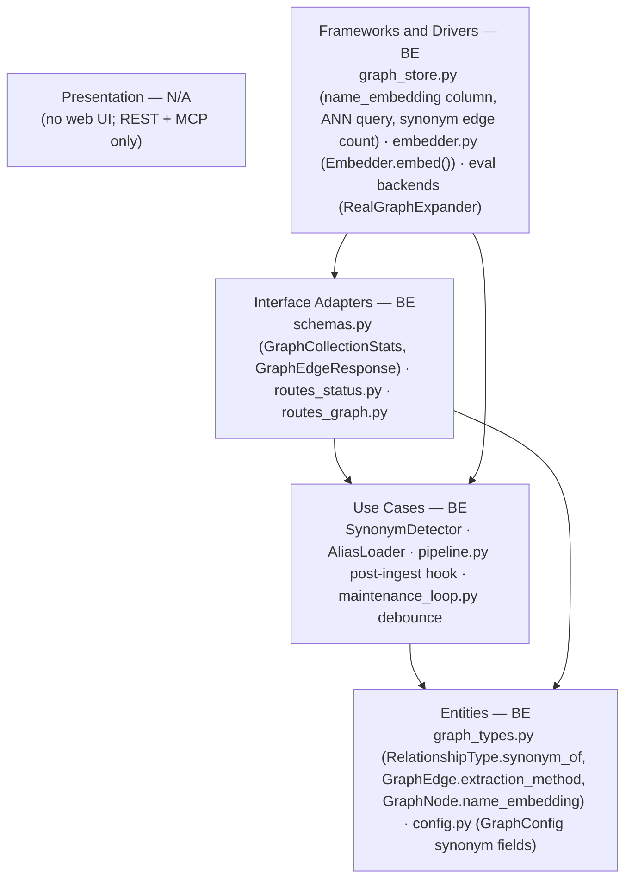
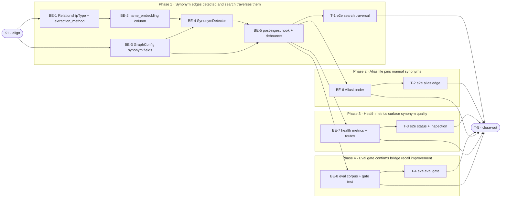

# E2f · Entity Resolution v1 — Synonym Edges — Team Plan

**How to read this file**
- **Architecture approach:** Clean Architecture — the default fallback; no override skill was requested. **Layers:** Presentation · Use Cases · Interface Adapters · Entities · Frameworks & Drivers. Each task's first sub-bullet names the layer it touches.
- The **Frontend, Backend, and Tester** sections are the **depth view** — each role's work, grouped by layer.
- The **Task Breakdown** is the **order view** — every task is a single-role checkbox in execution order, opening with a dependency graph.
- **Phases are vertical slices**: each delivers a working end-to-end increment, not a horizontal layer. No separate "integrate" phase — each slice integrates by construction. Sliced with the **`vertical-slicer` skill**.
- Each task carries the **role tag at the end of its title line**, then sub-bullets: **layer · estimate** (decimal hours), **needs · completes**, and a **Tests** block. **needs** = predecessor tasks; **completes** = the scenario `S#` it makes true, or the contract `C#` it realises.
- **Tests** are tagged by level. **Unit and integration tests belong to the implementing dev** (test-first, in the task's `Tests` block); **e2e tests are the tester's tasks**. The close-out task writes no tests.
- **Contracts** are authored as linked TypeSpec files (TypeSpec v1.13.0 available): internal seams as core-construct `.tsp` beside this plan (validated with `tsp compile --no-emit`); the HTTP/API seam as a TypeSpec HTTP service under `api-contracts/` with an emitted `openapi.yaml`. **No manual tests required** — the integration test harness is the e2e tier in this project.
- **Role tags** (`#backend-role`, `#tester-role`) mark each task and role-owned section. Frontend is N/A.
- IDs (`S#`, `C#`, `BE-#`/`T-#`/`K#`, `Q#`) are the traceability thread.
- **Rule:** edit your own tasks freely; change a contract only by team agreement.

---

## Background

The graph subsystem (`graph_types.py`, `graph_store.py`, `community_builder.py`, `graph_expander.py`) has been collecting entities from ingested documents through E2a–E2e. Entity nodes are identified by a stable ID derived from `make_stable_entity_id(entity_type, entity_name)` which lowercases the name. However, "K8s", "Kubernetes", and "kubernetes cluster" still produce three disconnected nodes because the stable-ID hash treats them as different entities. A graph-mode search for one misses all content indexed under the others.

---

## Goal

After this feature ships: whenever a document is ingested with `graph.enabled = true`, a background enrichment job embeds every entity name using the collection's existing fastembed model, finds entity pairs whose name embeddings exceed a cosine similarity threshold, and writes `synonym_of` edges between them. All graph retrieval modes traverse these edges transparently — naive expansion follows them (no code change: `get_neighbours()` is already type-agnostic), community assignments reflect them (community builder uses all edges), and `/explain` shows them. Operators can pin known synonym pairs via a TOML alias file. Health metrics in `GET /status` and `GET /graph/{collection}` track synonym activity to catch extraction regressions.

---

## Scope

### In Scope
- Embedding-based synonym edge detection: cosine similarity ≥ `[graph] synonym_threshold` (default 0.85), same entity-type only.
- Operator alias file: `[graph] alias_file` (TOML format) for manually pinning synonym pairs.
- `name_embedding` nullable vector column on the per-collection nodes table (`_archon_graph_{ns}__{col}_nodes`) — no `STORE_SCHEMA_VERSION` bump.
- `extraction_method` nullable column on the edges table (`"embedding"` | `"manual"`) for audit trail.
- `synonym_of` value added to `RelationshipType` enum (`graph_types.py`).
- Graph health metrics in `GET /status` and `GET /graph/{collection}`: `synonym_edge_count`, `singleton_node_pct`, `synonym_link_rate`, `connected_component_count`.
- Self-maintaining background job: synonym detection + community rebuild triggered automatically after every ingest; debounced per-collection via existing `RebuildState.pending` pattern in `maintenance_loop.py`.
- `enrichment_auto: bool = True` explicit config flag in `[graph]` section.
- Strengthened E2e eval gate: bridge multi-hop recall with synonym edges active; HotpotQA negative control must not regress; eval fixture wires `RealGraphExpander` with `lancedb_root` (closing the BE-3/BE-6 gap).

### Out of Scope
- LLM-based entity merging — deferred to E2i.
- Cross-entity-type synonym detection — too many false positives.
- Migration backfill for pre-existing nodes — greenfield deployment; nullable `name_embedding` column lets old nodes coexist.
- PPR traversal — E2h; synonym edges traversed automatically when it ships.
- Graph viewer — E2j.

---

## Acceptance criteria
- After ingesting two documents containing "K8s" and "Kubernetes" as entities of the same type, a `synonym_of` edge with `extraction_method="embedding"` links the two nodes.
- A graph-mode search for "K8s" returns content from the "Kubernetes" document (traversal transparent, no query rewriting).
- An alias file entry `"K8s" = "Kubernetes"` creates a `synonym_of` edge with `extraction_method="manual"`.
- A missing or unreadable alias file logs a WARNING and does not prevent enrichment from completing.
- `enrichment_auto = false` in config prevents automatic post-ingest synonym detection.
- `GET /status` `GraphCollectionStats` includes `synonym_edge_count`, `singleton_node_pct`, `synonym_link_rate`, `connected_component_count`.
- `GET /graph/{collection}` edge responses include `relationship_type`.
- Two rapid ingests on the same collection do not spawn two parallel synonym enrichment jobs (`RebuildState.pending` debounce).
- Background enrichment failure is logged as WARNING; search is never blocked.
- Eval gate: `synonym_bridge_recall_at_5` meets the new floor with `RealGraphExpander` and synonym edges active.
- Eval gate: `graph_negative_control_recall_at_5` does not regress — **Note for BE-8**: before setting the floor in `thresholds.toml`, run 3 eval passes and record the min/max. The existing floor is 0.34 (observed range 0.38–0.43, per `tests/eval/baselines/baseline.json`). If the synonym-active fixture changes the observed range, update the floor conservatively (floor = observed_min × 0.90) and add a waiver comment in `thresholds.toml` documenting the range — following the existing waiver comment convention already used in `baseline.json` for this metric.
- All tests pass; no new compiler warnings.

---

## What does NOT change
- `get_neighbours()` in `graph_store.py` — already type-agnostic; traverses `synonym_of` edges automatically.
- `CommunityBuilder.build()` — already consumes all edges; synonym edges feed Leiden clustering without modification.
- `GraphExpander.expand()` in `graph_expander.py` — no change needed for naive expansion.
- `pipeline.py` explain path — already surfaces edges returned by `get_edges_for_nodes()` (type-agnostic).
- `STORE_SCHEMA_VERSION` in `store.py` — unchanged; nodes-table-only schema addition.
- The shared chunk table schema and `_schema()` / `_meta_schema()` in `store.py`.
- Existing `RelationshipType` values `uses`, `implements`, `depends_on`, `related_to`.
- The shared `RebuildState` dataclass is unchanged (`communities_need_rebuild` is NOT added to it; community rebuild signaling uses the separate `_communities_pending_rebuild: set[tuple[str, str]]` set on `MaintenanceLoop`). BE-5 adds a NEW `_synonym_state: dict[tuple[str, str], RebuildState]` dict to `MaintenanceLoop`, separate from the existing `_rebuild_state` used for community rebuilds. The three tracking dicts (`_synonym_state`, `_rebuild_state`, `_communities_pending_rebuild`) serve distinct purposes. Note: `_communities_pending_rebuild` draining via `_spawn_rebuild_task` DOES write to `_rebuild_state` (the shared per-collection rebuild-task slot) — this is intentional; the existing in-flight/pending dedup in `_spawn_rebuild_task` prevents duplicate concurrent rebuilds from the synonym path and the GC path.

---

## Known limitations / accepted trade-offs
- A LanceDB cosine vector index is created on the `name_embedding` column per-collection immediately after the column is added; the index creation is idempotent (checked via `table.list_indices()` before calling `create_index`).
- `synonym_link_rate` is per-enrichment-pass, not a cumulative rate.
- `singleton_node_pct` in health metrics approximates isolated nodes (nodes with no edges); exact GC-aware orphan tracking deferred.
- Separate debounce state: `_synonym_state` is keyed `(namespace, collection)` like `_rebuild_state` and serves a distinct purpose (`_synonym_state` tracks synonym enrichment tasks; `_rebuild_state` tracks community-rebuild tasks). Note: `_communities_pending_rebuild` draining via `_spawn_rebuild_task` DOES write to `_rebuild_state` — this is intentional; the existing in-flight/pending dedup guard handles concurrent requests correctly.
- Named `synonym_link_rate` rather than `dedup_merge_rate` to avoid implying node merging, which is out of scope (E2i).
- `name_embedding` column is added to `_nodes_schema()` at table creation (not lazily) — pre-E2f tables (which exist before this column) will have `null` in this column until their first enrichment pass, but no `add_columns` migration is needed since the column is nullable. The `has_name_embedding_col` guard in `_arrow_to_nodes()` handles reading pre-existing tables safely; entities with `null` embeddings are skipped during synonym detection.

---

## Approach & architecture

E2f is structured with **Clean Architecture**: new domain types land in Entities, new orchestration in Use Cases, schema and HTTP surface additions in Interface Adapters, and all LanceDB / fastembed interactions in Frameworks & Drivers.

**Layer map (and role mapping)**

| Layer | Role | Components |
|-------|------|-----------|
| Presentation | N/A | No web UI. REST and MCP served by existing server. |
| Use Cases | Backend | `synonym_detector.py` (new), `alias_loader.py` (new), `pipeline.py` post-ingest hook, `jobs/maintenance_loop.py` debounce |
| Interface Adapters | Backend | `server/schemas.py` (`GraphCollectionStats` + `GraphEdgeResponse` additions), `server/routes_status.py`, `server/routes_graph.py` |
| Entities | Backend | `graph_types.py` (`RelationshipType.synonym_of`, `GraphEdge.extraction_method`, `GraphNode.name_embedding`), `config.py` (`GraphConfig` synonym fields) |
| Frameworks & Drivers | Backend | `graph_store.py` (vector column, ANN search, metric queries), `embedder.py` (`Embedder.embed()`), `archon_search/eval/backends.py` (`RealGraphExpander`) |

**What changes**
- `graph_types.py`: `RelationshipType` union gains `synonym_of`; `GraphEdge` dataclass gains `extraction_method: str | None`; `GraphNode` dataclass gains `name_embedding: list[float] | None`.
- `graph_store.py`: `_nodes_schema()` adds nullable vector column; `write_graph()` serializes embeddings; `_arrow_to_nodes()` gains `has_name_embedding_col` guard; new `count_synonym_edges()` and `compute_singleton_pct()` methods.
- `config.py`: `GraphConfig` gains `synonym_threshold: float = 0.85`, `alias_file: str | None = None`, `enrichment_auto: bool = True` with corresponding TOML loading blocks.
- New `archon_search/synonym_detector.py` and `archon_search/alias_loader.py` (Use Cases).
- `pipeline.py`: post-`write_graph()` hook calls synonym enrichment (try/except, never propagates).
- `jobs/maintenance_loop.py`: new per-collection synonym enrichment debounce alongside existing community-rebuild debounce.
- `server/schemas.py`: four new fields on `GraphCollectionStats`; new `relationship_type` field on `GraphEdgeResponse`.
- `server/routes_status.py` and `routes_graph.py`: populate new schema fields.
- `archon_search/eval/`: new `EvalMetrics.synonym_bridge_recall_at_5` field; new eval fixture with synonym-pair corpus; `test_e2e_graph_eval_gate_v2.py` gains two gated tests with `RealGraphExpander` wired via `lancedb_root`.

**Key decisions (from the brief)**
- Embedding over string similarity: edit distance cannot link "K8s" ↔ "Kubernetes"; embedding captures meaning.
- Self-maintaining background job (not a manual command): zero-operator UX is the differentiator.
- Same entity-type restriction: prevents cross-type false merges.
- TOML alias file: fits project-wide config paradigm; entries of the form `"K8s" = "Kubernetes"`.
- Shared edges table (resolves Q1): `synonym_of` reuses the existing `_edges` table with a new `RelationshipType` value. `get_neighbours()` is already type-agnostic so traversal requires zero code change.
- Explicit `enrichment_auto` flag (resolves Q3): follows the same `_coerce_bool` pattern as `gc_rebuild_communities`; makes the job testable and disableable without disabling the whole graph.
- Per-collection debounce (resolves Q4): existing `RebuildState` is already keyed `(namespace, collection)`.

---

## Contracts / seams

Boundaries where roles must agree. Authored as TypeSpec files (TypeSpec v1.13.0, all compiled clean). Internal seams use core-construct `.tsp` (no OpenAPI); the HTTP/API seam emits an `openapi.yaml`.

**C1 — Graph entity model extension** *(Entities ↔ Frameworks & Drivers)*
`GraphNode` gains nullable `name_embedding: float32[]`; `GraphEdge` gains nullable `extraction_method: str`; `RelationshipType` union gains `synonym_of`. All additions are nullable — pre-E2f nodes/edges coexist without migration. `make_stable_edge_id` is unchanged (extraction_method not in the ID).
→ see [`e2f-graph-entity-model.tsp`](e2f-graph-entity-model.tsp)
- Realised by: BE-1, BE-2 · Verified by: BE-2 (`test_write_graph_stores_and_retrieves_name_embedding`), T-1

**C2 — GraphConfig synonym fields** *(Entities ↔ Use Cases)*
`GraphConfig` gains `synonym_threshold: float = 0.85`, `alias_file: str | None = None`, `enrichment_auto: bool = True`. Loaded via `_coerce_float` / `_coerce_bool` in `config.py`; `test_config_defaults.py` snapshot must be updated.
→ see [`e2f-graph-config.tsp`](e2f-graph-config.tsp)
- Realised by: BE-3 · Verified by: BE-3 (`test_graph_config_synonym_fields_toml_loading`), T-1

**C3 — SynonymDetector ↔ GraphStore interface** *(Use Cases ↔ Frameworks & Drivers)*
`SynonymDetector.detect(collection, ns, skip_pairs)` returns `list[GraphEdge]`; `skip_pairs` is a `set[tuple[str, str]]` of entity-ID pairs already covered by manual aliases — those pairs are excluded from ANN scoring. `AliasLoader` produces both the manual edges and the skip-set. The enrichment orchestrator calls `AliasLoader` first, passes the skip-set to `SynonymDetector.detect()`, then writes all edges (alias + ANN) in one `write_graph()` call. All synonym edges go through `write_graph()`'s existing `merge_insert("id")` upsert — idempotent on repeated runs; `make_stable_edge_id` unchanged.

**Canonical ordering rule:** All synonym edge pairs MUST be sorted before calling `make_stable_edge_id`. Both `SynonymDetector` and `AliasLoader` MUST call `sorted([source_id, target_id])` before constructing the edge, so `(source_node_id, target_node_id)` always has the lexicographically smaller ID first. The `skip_pairs` tuples in `set[tuple[str,str]]` MUST also use this canonical ordering.

**Protocol note:** `SynonymDetector` and `AliasLoader` MUST depend on a `GraphStoreProtocol` (or ABC) rather than the concrete `GraphStore` to preserve Clean Architecture layer independence. BE-4 must define this protocol in the Use Cases layer (e.g., `archon_search/graph_store_protocol.py`) before implementing the detector. Minimum protocol surface (parameter order matches real `GraphStore` signatures; `ns` is LAST in all methods per project invariant):
- `get_all_nodes(collection, ns) -> list[GraphNode]`
- `vector_search_nodes(collection, query_embedding, entity_type, limit, metric, ns) -> list[GraphNode]`
- `write_graph(collection, nodes, edges, ns) -> None`
- `find_nodes_by_name(collection, names, ns) -> list[GraphNode]`

**Alias/ANN ID collision note:** When `skip_pairs` correctly excludes an alias pair from ANN results, there is exactly one `synonym_of` edge per pair in the `write_graph()` call — no ordering issue. If `skip_pairs` misses a pair (name→ID resolution bug), both the alias edge (`extraction_method='manual'`) and the ANN edge (`extraction_method='embedding'`) share the same `merge_insert('id')` key (same canonical source/target IDs, same `synonym_of` relationship_type → same hash). The dedup behavior for two rows with the same `merge_insert('id')` key within a single source batch is LanceDB-version-specific and unverified. To avoid depending on this behavior, alias edges must be written AFTER ANN edges in the edges list passed to `write_graph()` as a belt-and-suspenders measure — but this is not guaranteed to work across LanceDB versions. The primary guard is `skip_pairs` correctness. **# ponytail: LanceDB intra-batch duplicate key behavior unverified — skip_pairs is load-bearing, ordering is not a reliable fallback; verify or remove this note when LanceDB behavior is confirmed.**

→ see [`e2f-synonym-detector.tsp`](e2f-synonym-detector.tsp)
- Realised by: BE-4, BE-6 · Verified by: BE-4 (`test_synonym_detector_writes_edges_to_graph_store`, `test_synonym_detector_skips_alias_pairs`), BE-6 (`test_alias_file_creates_manual_synonym_edge`), T-1, T-2

**C4 — Graph health API response** *(Interface Adapters ↔ REST clients)* — HTTP/API seam
`GraphCollectionStats` gains four new fields (`synonym_edge_count`, `singleton_node_pct`, `synonym_link_rate`, `connected_component_count`) in `GET /status`. `GraphEdgeResponse` gains `relationship_type` in `GET /graph/{collection}`. All additions have zero/empty defaults — additive, backward-compatible.
→ see [`api-contracts/e2f-graph-health-api.tsp`](api-contracts/e2f-graph-health-api.tsp) + [`api-contracts/e2f-graph-health-api.openapi.yaml`](api-contracts/e2f-graph-health-api.openapi.yaml)
- Realised by: BE-7 · Verified by: BE-7 (`test_health_metrics_reflect_synonym_edges_in_status_endpoint`), T-3

---

## Scenarios #tester-role

Behavioural only — step-level detail is produced by the tasks below.

| id | Scenario (Given / When / Then) |
|----|--------------------------------|
| **S1** | **Given** two documents with "K8s" and "Kubernetes" as entities of the same type are ingested · **When** synonym enrichment runs · **Then** a `synonym_of` edge with `extraction_method="embedding"` exists between the two nodes |
| **S2** | **Given** a `synonym_of` edge links two entity nodes · **When** a graph-mode="naive" search is called for one entity name · **Then** expansion returns content from documents indexed under the synonym name |
| **S3** | **Given** synonym edges link entities · **When** communities are rebuilt · **Then** synonym-linked entities land in the same community and local search returns content from linked documents — Note: community rebuild and global search with synonym edges requires a maintenance loop pass after enrichment; tests must trigger the maintenance loop explicitly before asserting community membership. |
| **S4** | **Given** synonym edges link entities · **When** graph-mode="global" search is called · **Then** global community summaries include synonym-linked entities — Note: community rebuild and global search with synonym edges requires a maintenance loop pass after enrichment; tests must trigger the maintenance loop explicitly. |
| **S5** | **Given** an alias file is configured with `"K8s" = "Kubernetes"` · **When** synonym enrichment runs · **Then** a `synonym_of` edge with `extraction_method="manual"` links the two nodes |
| **S6** | **Given** synonym edges have been created · **When** `GET /status` is called · **Then** `GraphCollectionStats` for that collection includes `synonym_edge_count > 0`, `singleton_node_pct`, `synonym_link_rate`, `connected_component_count` |
| **S7** | **Given** synonym edges exist in the graph · **When** `GET /graph/{collection}` is called · **Then** edge responses include `relationship_type: "synonym_of"` for synonym edges |
| **S8** | **Given** a corpus with synonym-pair bridge questions and synonym edges active · **When** the eval suite runs with `RealGraphExpander` and `lancedb_root` wired · **Then** `synonym_bridge_recall_at_5` meets the floor in `thresholds.toml` |
| **S9** | **Given** the HotpotQA distractor corpus (no synonym pairs) with synonym edges active · **When** the eval suite runs · **Then** `graph_negative_control_recall_at_5` does not fall below its existing floor (Note: if this metric is non-deterministic, the eval gate must use a conservative floor with documented observed range.) |
| **S10** | **Given** two entities of different types have similar names (e.g., "Apple" company vs "Apple" concept) · **When** synonym enrichment runs · **Then** no `synonym_of` edge is created between them |
| **S11** | **Given** `synonym_threshold = 0.99` (impossibly strict) · **When** synonym enrichment runs · **Then** no synonym edges are created and enrichment completes normally without error |
| **S12** | **Given** two rapid ingests for the same collection · **When** the first synonym enrichment job is in-flight · **Then** the second ingest sets `_synonym_state[(ns,col)].pending = True` and does not spawn a duplicate enrichment job |
| **S13** | **Given** `alias_file` points to a non-existent path · **When** synonym enrichment runs · **Then** a WARNING is logged, the enrichment pass completes using only ANN-detected synonyms, and no exception is raised |
| **S14** | **Given** `enrichment_auto = false` in config · **When** a document is ingested with graph enabled · **Then** synonym enrichment is NOT triggered automatically |
| **S15** | **Given** the synonym enrichment background job raises an exception · **When** the exception occurs · **Then** a WARNING is logged and the ingest result is returned normally to the caller |

---

## Frontend — Presentation #frontend-role

N/A — no frontend work for this feature. archon-search has no web UI; all client-facing surfaces are REST and MCP endpoints (both pure backend). No new MCP tools, no new CLI flags — the three new `[graph]` config fields are operator-managed via TOML and require no CLI additions.

---

## Backend — Entities · Use Cases · Adapters · Frameworks #backend-role

**Scope:** all graph entity model additions, the new synonym detection and alias loading use cases, the post-ingest enrichment hook and debounce, the HTTP schema additions, and the eval gate fixture. Writes both unit and integration tests for its tasks.
**Owns layers:** Entities, Use Cases, Interface Adapters, Frameworks & Drivers.

**Tasks by layer** *(checkable in the Task Breakdown)*
- Entities: BE-1 — `RelationshipType.synonym_of` + `GraphEdge.extraction_method` · BE-3 — `GraphConfig` synonym fields
- Use Cases: BE-4 — `SynonymDetector` · BE-5 — post-ingest hook + debounce · BE-6 — `AliasLoader`
- Interface Adapters: BE-7 — health metrics schema + routes
- Frameworks & Drivers: BE-2 — `name_embedding` column in `graph_store.py` · BE-8 — eval gate corpus + test

**Done when**
- [ ] A `synonym_of` edge with `extraction_method="embedding"` is created automatically after ingest when entity names are embedding-similar — S1
- [ ] Naive expansion and community membership traverse synonym edges transparently without code change to the expander or community builder — S2, S3, S4
- [ ] A manual alias file entry creates a `synonym_of` edge with `extraction_method="manual"` — S5
- [ ] `GET /status` and `GET /graph/{collection}` report synonym health metrics — S6, S7
- [ ] Cross-type pairs are never linked — S10
- [ ] `enrichment_auto=false` disables auto trigger — S14
- [ ] Background failure is swallowed, search unblocked — S15
- [ ] Eval gate passes with `RealGraphExpander` wired — S8, S9

---

## Tester #tester-role

**Scope:** the tester owns **e2e** tests (T-1…T-4) plus the project **close-out** (T-5). **Unit and integration** tests belong to the implementing dev in each implementation task's `Tests` block. No manual tests required — all scenarios are automatable in the `@pytest.mark.integration` test harness (the e2e tier in this project).

**Tasks** *(checkable in the Task Breakdown)*
- T-1 — e2e: search traverses synonym edges (Slice 1)
- T-2 — e2e: alias file creates manual synonym edge (Slice 2)
- T-3 — e2e: GET /status and GET /graph show health metrics (Slice 3)
- T-4 — e2e: eval gate passes with real graph (Slice 4)
- T-5 — close-out & acceptance fact-check

**Allocation** — each scenario at the cheapest level that proves it *(unit + integration are dev-written; e2e is the tester's tasks)*

| Scenario | Cheapest level |
|----------|----------------|
| S10, S11, S14 | unit (SynonymDetector logic, config flag check) |
| S1, S5, S12, S13, S15 | integration (dev-owned in BE-4, BE-5, BE-6) |
| S2, S6, S7 | integration (dev-owned in BE-5, BE-7) |
| S3, S4 | integration (dev-owned in BE-5 — **S3 requires an explicit assertion**: BE-5 integration test must include `assert (await graph_store.get_communities_for_entities(collection, [entity_a_id], ns))[0].community_id == (await graph_store.get_communities_for_entities(collection, [entity_b_id], ns))[0].community_id` after enrichment runs (two synonym-linked entities must land in the same Leiden community — "transitively via community builder" is not sufficient without this direct observable); S4 verified via eval gate S8) |
| S2 (end-to-end traversal), S6, S7 | e2e (tester T-1, T-3) |
| S5 (end-to-end alias) | e2e (tester T-2) |
| S8, S9 | e2e eval (tester T-4) |

---

## Documentation update

Docs the feature touches — close-out task T-5 works through this list.

- [ ] `Documentation/Backlog/e2f-entity-resolution-v1-brief.md` — no changes needed (source brief)
- [ ] `Documentation/Backlog/e2f-entity-resolution-v1-team-plan.md` — this file
- [ ] `Documentation/Architecture/100_system_architecture_overview.md` — update graph pipeline section: add synonym edges to the pipeline flow description
- [ ] `Documentation/Architecture/110_component_catalog_and_layer_breakdown.md` — add `synonym_detector.py` and `alias_loader.py` entries with their layers and key symbols
- [ ] `Documentation/Architecture/600_api_reference_or_public_interface.md` — add `[graph] synonym_threshold`, `alias_file`, `enrichment_auto` config fields; add new `GraphCollectionStats` health fields; add `GraphEdgeResponse.relationship_type`
- [ ] `CLAUDE.md` (project) — update graph subsystem section: add `synonym_detector.py` / `alias_loader.py` to module inventory; add enrichment job invariant (try/except, never propagates); add `enrichment_auto` to GraphConfig field list
- [ ] `archon-search.toml.example` — add `synonym_threshold`, `alias_file`, `enrichment_auto` under `[graph]` with defaults and comments
- [ ] `BREAKING.md` — record E2f additive changes: new `GraphCollectionStats` fields (`synonym_edge_count`, `singleton_node_pct`, `synonym_link_rate`, `connected_component_count`) and `GraphEdgeResponse.relationship_type` — annotate as additive, non-breaking
- [ ] `learnings.md` — update with E2f observations after task completion

---

## Open questions

| id | Area | Question |
|----|------|----------|
| **Q1** | architecture | ~~Should `synonym_of` edges use the shared edges table or a separate synonym table?~~ **Resolved:** shared edges table — `get_neighbours()` is already type-agnostic; synonym edges traverse automatically. |
| **Q2** | architecture | ~~How does the alias file interact with ANN-detected synonyms?~~ **Resolved (Option A):** `AliasLoader` precomputes a `skip_pairs: set[tuple[str, str]]` before ANN runs; `SynonymDetector.detect()` accepts it and excludes those pairs from scoring — one canonical `synonym_of` edge per pair, `extraction_method="manual"` for alias pairs and `"embedding"` for ANN-only pairs; `make_stable_edge_id` unchanged. |
| **Q3** | config | ~~Should `enrichment_auto` be an explicit config flag or always-on?~~ **Resolved:** explicit `GraphConfig` field `enrichment_auto: bool = True`, following the same `_coerce_bool` pattern as `gc_rebuild_communities`. |
| **Q4** | architecture | ~~Per-collection or global debounce?~~ **Resolved:** per-collection — `RebuildState` already keyed `(namespace, collection)`. |
| **Q5** | implementation | ~~`name_embedding` column dimension is tied to `embedder.embedding_dim`.~~ **Resolved:** schema-at-creation — `name_embedding: pa.list_(pa.float32())` is added directly to `_nodes_schema()` as a nullable column; new collections get it at table creation. Pre-E2f tables have `null` values (skipped during detection); `has_name_embedding_col` guard in `_arrow_to_nodes()` handles pre-existing tables safely. Cosine index created after table open (idempotent). No `add_columns` migration needed. |
| **Q6** | implementation | ~~Cosine similarity metric for LanceDB ANN.~~ **Resolved (Option B):** LanceDB vector index with `metric="cosine"` created on the `name_embedding` column (idempotent); `SynonymDetector` uses `vector_search_nodes(..., metric="cosine")` (implemented in BE-2); no manual L2-to-cosine conversion needed. |

*Resolved in this revision: Q1 (shared edges table), Q3 (explicit enrichment_auto flag), Q4 (per-collection debounce), Q2 (alias skip-list), Q5 (lazy column add), Q6 (cosine index).*

---

## Task Breakdown

Single-role tasks in execution order, grouped into **vertical slices**.

### Dependency graph

### Phase 0 · Kickoff *(prerequisite; the one cross-cutting step)*
- [x] **K1** — Agree the Contracts and Scenarios with the team #team
    - — · 1.0h
    - completes C1, C2, C3, C4
    - Tests

### Phase 1 · Synonym edges detected and search traverses them *(walking skeleton: entity model + detector + post-ingest hook, end-to-end from ingest to synonym search)*

- [x] **BE-1** — Add `synonym_of` to `RelationshipType` union and `extraction_method: str | None` to `GraphEdge` dataclass and `_edges_schema()` in `graph_store.py` #backend-role
    - Entities · 3.0h
    - needs K1 · completes C1
    - BE-1 also requires two companion edits in `graph_store.py`:
        - **Write path:** `write_graph()`'s `edges_data` dict must include `extraction_method` (as `pa.array(...)` matching `_edges_schema()`'s new nullable string column). Any caller that does not set `extraction_method` on `GraphEdge` passes `None`.
        - **Read path:** `_arrow_to_edges()` must: (a) add a `has_extraction_method_col` guard (same pattern as BE-2's `has_name_embedding_col`), and (b) pass the column value (or `None` when absent) into `GraphEdge(extraction_method=...)`. Without this guard, pre-E2f edge tables (lacking the column) will fail to deserialize.
    - Tests
        - #unit_test — `test_synonym_of_in_relationship_type_enum` — `RelationshipType("synonym_of")` round-trips correctly
        - #unit_test — `test_extraction_method_field_on_graph_edge` — `GraphEdge` accepts and stores `extraction_method`
        - #unit_test — `test_edges_schema_has_extraction_method_column` — `_edges_schema()` includes nullable `extraction_method` column
        - #unit_test — `test_arrow_to_edges_handles_absent_extraction_method_column` — edge tables without `extraction_method` column deserialize without error; `extraction_method` is `None`
        - #unit_test — `test_write_graph_includes_extraction_method_in_edges_data` — `GraphEdge` with `extraction_method="embedding"` survives a write-graph → read-edge round-trip

- [x] **BE-2** — Add nullable `name_embedding: pa.list_(pa.float32())` column directly to `_nodes_schema()` — **schema-at-creation**: new collections get the column at table creation (simpler and correct for the greenfield deployment stated in Scope; the lazy `add_columns` approach is superseded); add `has_name_embedding_col` guard to `_arrow_to_nodes()` to handle pre-E2f tables safely (those have `null` in this column); update `write_graph()` to serialize the embedding field; **embedding preservation in merge:** `write_graph()` must NOT use `.when_matched_update_all()` for the `name_embedding` column — use `.when_matched_update([col for col in schema.names if col != 'name_embedding'])` (exclude `name_embedding` from matched-row updates). This ensures existing embeddings are never overwritten by subsequent node writes that don't supply an embedding. Pre-condition: verify that LanceDB's `when_matched_update(columns=[...])` semantics are 'update only the listed columns, leave others unchanged' — add a comment `# ponytail: LanceDB when_matched_update column-list semantics assumed; verify against LanceDB version in requirements` in `write_graph()`; create a LanceDB vector index with `metric="cosine"` on the `name_embedding` column (idempotent: skip if `table.list_indices()` shows the index already exists); **BE-2 also implements the new `vector_search_nodes(collection, query_embedding: list[float], entity_type: str | None, limit: int, metric: str = 'cosine', ns: str = 'default') -> list[GraphNode]` method on `GraphStore`** — this method uses LanceDB's `.search(query_embedding).metric(metric).limit(limit)` on the nodes table with an optional `entity_type` filter; parameter `ns` is LAST per project invariant (`graph_store.py`) #backend-role
    - Frameworks & Drivers · 5.0h
    - needs BE-1 · completes C1
    - Tests
        - #unit_test — `test_nodes_schema_has_name_embedding_column` — schema includes nullable `name_embedding` field
        - #unit_test — `test_arrow_to_nodes_handles_absent_name_embedding_column` — tables without the column deserialize without error; `name_embedding` is None
        - #unit_test — `test_graph_store_creates_cosine_index_on_name_embedding` — cosine index is created after column is added; second call is a no-op (idempotent)
        - #unit_test — `test_graph_store_vector_search_nodes_returns_nearest_nodes` — given nodes with embeddings, `vector_search_nodes` returns the nearest node by cosine similarity
        - #integration_test — `test_write_graph_stores_and_retrieves_name_embedding` — a `GraphNode` with a non-null embedding survives a write-graph → read-node round-trip
        - #integration_test — `test_write_graph_preserves_existing_name_embedding_on_node_update` — write a node with embedding, then write the same node again without embedding, assert the embedding is preserved in the table

- [x] **BE-3** — Add `synonym_threshold: float = 0.85`, `alias_file: str | None = None`, `enrichment_auto: bool = True` to `GraphConfig` dataclass; add corresponding TOML loading blocks in `config.py` using `_coerce_float` / `_coerce_bool`; update `test_config_defaults.py` snapshot; check `path_home_allowlist.txt` line numbers after edits #backend-role
    - Entities · 2.0h
    - needs K1 · completes C2, S14
    - Tests
        - [x] #unit_test — `test_graph_config_synonym_threshold_default` — `GraphConfig().synonym_threshold == 0.85`
        - [x] #unit_test — `test_graph_config_enrichment_auto_default_true` — `GraphConfig().enrichment_auto is True`
        - [x] #unit_test — `test_graph_config_synonym_fields_toml_loading` — TOML overrides for all three fields are read correctly

- [x] **BE-4** — New `archon_search/synonym_detector.py` (Use Cases): first define `GraphStoreProtocol` (ABC or `typing.Protocol`) in `archon_search/graph_store_protocol.py` (minimum protocol surface defined in C3 above); `SynonymDetector` and `AliasLoader` depend on the protocol, not the concrete `GraphStore`; accepts `skip_pairs: set[tuple[str, str]]` (entity-ID pairs already covered by manual aliases, precomputed by `AliasLoader`); for each entity-type group, embed all entity names via `Embedder.embed()`; **embedding_dim bootstrap:** ensure `Embedder.embedding_dim` is valid by embedding a single dummy string (e.g., `""`) to force the model to load and set the dimension (no `add_columns` needed — column is already in the schema per BE-2); call `graph_store.vector_search_nodes(collection, query_embedding=entity_embedding, entity_type=entity_type, limit=top_k, ns=ns)` (implemented in BE-2) using the LanceDB cosine index; filter pairs ≥ `synonym_threshold`, exclude `skip_pairs`, self-pairs, and cross-type pairs; **sort `(source_id, target_id)` lexicographically before constructing each `GraphEdge`** to ensure `make_stable_edge_id` is deterministic across ANN traversal directions; return `list[GraphEdge]` with `relationship_type=synonym_of`, `extraction_method="embedding"`; caller writes via `graph_store.write_graph(collection, nodes=[], edges=[...], ns=ns)` #backend-role
    - Use Cases · 6.5h
    - needs BE-2, BE-3 · completes C3, S1, S10, S11
    - Tests
        - [x] #unit_test — `test_synonym_detector_pairs_above_threshold` — cosine ≥ threshold produces a `synonym_of` edge
        - [x] #unit_test — `test_synonym_detector_cross_type_excluded` — entity pairs of different types produce no edge regardless of similarity
        - [x] #unit_test — `test_synonym_detector_below_threshold_and_no_error` — `synonym_threshold=0.99` with all entity pairs far below threshold → returns empty list AND no exception is raised (verifies S11 completion criterion)
        - [x] #unit_test — `test_synonym_detector_self_pairs_excluded` — identical entity ID pairs are not linked
        - [x] #unit_test — `test_synonym_detector_skips_alias_pairs` — pairs present in `skip_pairs` are excluded from ANN results regardless of similarity score; pairs given in both `(a,b)` and `(b,a)` order are both excluded — canonical ordering applied before comparison
        - [x] #unit_test — `test_synonym_detector_canonical_ordering` — `(source, target)` and `(target, source)` produce the same edge ID (idempotency across traversal direction)
        - [x] #integration_test — `test_synonym_detector_writes_edges_to_graph_store` — detector writes real `synonym_of` edges into an in-memory LanceDB nodes + edges table using a content-dependent vector stub

- [x] **BE-5** — Add post-ingest synonym enrichment hook in `pipeline.py` (after `write_graph()`, inside the existing `try/except` + WARNING pattern, gated by `config.graph.enrichment_auto`); **wiring via callback injection — wired in `app.py`'s lifespan:** `app.py` already creates both `MaintenanceLoop` and `SearchPipeline` independently (they are siblings, not parent/child). The wiring happens in `app.py`'s lifespan after both are constructed:

    1. `MaintenanceLoop` is created first. It gains a NEW public method `schedule_synonym_enrichment(self, collection: str, ns: str) -> None` that: checks `_synonym_state[(ns, collection)]`; if enrichment is in-flight, sets `_synonym_state[(ns, collection)].pending = True` (debounce — satisfies S12) and returns; if not in-flight, spawns `asyncio.create_task(_run_synonym_enrichment(collection, ns))` and creates a `_synonym_state` entry holding that task; after synonym edges are written inside `_run_synonym_enrichment`, adds `(ns, collection)` to `self._communities_pending_rebuild`.
    2. Inside `app.py`'s lifespan, AFTER both are constructed, assign: `pipeline.on_synonym_edges_written = maintenance_loop.schedule_synonym_enrichment`.

    The post-ingest hook in `pipeline.py` calls `self.on_synonym_edges_written(collection, ns)` after `write_graph()` completes (if not None). `pipeline.py` has only a `Callable`, no import of `MaintenanceLoop`. CLI/eval ingest paths that construct `SearchPipeline` without a `MaintenanceLoop` pass `on_synonym_edges_written=None` — synonym enrichment is not triggered there (acceptable, documented behavior).

    Add `_run_synonym_enrichment(collection, ns)` to `MaintenanceLoop` for periodic re-enrichment (e.g., after alias file changes), with per-collection debounce via a NEW `_synonym_state: dict[tuple[str, str], RebuildState]` dict (separate from the existing `_rebuild_state` used for community rebuilds — `_synonym_state` tracks synonym enrichment tasks while `_rebuild_state` tracks community-rebuild tasks; note that `_communities_pending_rebuild` draining via `_spawn_rebuild_task` DOES write to `_rebuild_state` — this is intentional, and the existing in-flight/pending dedup guard handles concurrent requests correctly); **community rebuild after synonym enrichment:** BE-5 must add a `_communities_pending_rebuild: set[tuple[str, str]]` attribute to `MaintenanceLoop` (initialized as an empty set). This is SEPARATE from both `_rebuild_state` and `_synonym_state`. The `schedule_synonym_enrichment` method (or the `MaintenanceLoop`'s own enrichment pass) adds `(ns, col)` to `_communities_pending_rebuild` after `write_graph()` succeeds. In the MaintenanceLoop's pass, a NEW check (separate from `communities_invalidated = orphan_nodes_removed > 0`) iterates over `_communities_pending_rebuild`, calls `_spawn_rebuild_task(ns, collection)` for each key, and discards the key from the set. The producer (callback / enrichment pass) ONLY adds to this set; the consumer (MaintenanceLoop pass) ONLY removes from it. No modification to the `RebuildState` dataclass is needed — `communities_need_rebuild` must NOT be added to `RebuildState`. Community rebuild after synonym enrichment is therefore **asynchronous** (happens at the next maintenance pass, not immediately). Tests for S3/S4 must account for this — either trigger a maintenance pass explicitly or wait for the loop to run. `_spawn_rebuild_task` must NOT be referenced from `pipeline.py` — it is private to `MaintenanceLoop`. **`pipeline.py` must NOT import `MaintenanceLoop`** — the callback bridges result back to `MaintenanceLoop` state without any import dependency. #backend-role
    - Use Cases · 4.0h
    - needs BE-4, BE-3 · completes S2, S3, S4, S12, S15
    - Tests
        - #unit_test — `test_synonym_enrichment_debounce_no_duplicate_job` — call `maintenance_loop.schedule_synonym_enrichment(col, ns)` twice while first task is in-flight; assert `_synonym_state[(ns,col)].pending == True` AND `asyncio.create_task` call count == 1 (via mock)
        - #unit_test — `test_maintenance_loop_drains_communities_pending_rebuild` — `schedule_synonym_enrichment` adds `(ns, col)` to `_communities_pending_rebuild` after `write_graph()` succeeds; a maintenance pass then calls `_spawn_rebuild_task(ns, collection)` — namespace first, collection second — and removes the key from the set
        - #unit_test — `test_pipeline_calls_on_synonym_edges_written_after_write_graph` — `pipeline.py` calls `on_synonym_edges_written(collection, ns)` after `write_graph()` when the callback is not None
        - #unit_test — `test_synonym_enrichment_gated_by_enrichment_auto_false` — when `enrichment_auto=False`, no enrichment task is spawned after ingest
        - #unit_test — `test_synonym_enrichment_failure_does_not_propagate` — exception in `SynonymDetector.detect()` is caught, WARNING logged, ingest result returned normally
        - #integration_test — `test_post_ingest_synonym_enrichment_fires_and_creates_edges` — full ingest via `make_real_app(graph_enabled=True)` + `install_spacy_stub` → trigger enrichment → `synonym_of` edge exists in graph store

- [x] **T-1** — e2e: ingest two documents with synonym entity names using a content-dependent vector stub; trigger synonym enrichment; assert search for one entity name returns content from the other's document. T-1 covers S1 and S2. S3 (community membership) is verified transitively by existing CommunityBuilder tests + BE-5 integration test — note: S3 (community membership) is verified at the NEXT maintenance pass, not immediately post-ingest; after synonym enrichment, trigger a maintenance loop pass explicitly before asserting community membership (S3). S4 (global search) is verified by eval gate (T-4/S8). #tester-role
    - — · 3.0h
    - needs BE-5 · completes S1, S2
    - Tests
        - [x] #e2e_test — `test_e2e_search_traverses_synonym_edges` — ingest K8s-doc + Kubernetes-doc; run enrichment; graph_mode="naive" search for "K8s" returns a chunk from the Kubernetes document

### Phase 2 · Alias file pins manual synonyms

- [x] **BE-6** — New `archon_search/alias_loader.py` (Use Cases): reads TOML file at `config.graph.alias_file` using stdlib `tomllib`; produces a `(list[GraphEdge], set[tuple[str, str]])` tuple — the edges with `relationship_type=synonym_of, extraction_method="manual"`, and the set of entity-ID pairs to use as `skip_pairs` for `SynonymDetector`; **name→ID resolution:** for each alias pair `(name_a, name_b)`, call `graph_store.find_nodes_by_name(collection, [name_a, name_b], ns)` (existing method, `graph_store.py:373`) — resolves both names in one call; `ns` is LAST per project invariant; if either name resolves to zero nodes, log a WARNING and skip the pair; if a name resolves to multiple nodes, create alias edges for each matching type-pair that shares the same `entity_type`; **sort `(source_id, target_id)` lexicographically before constructing each `GraphEdge` and before adding to `skip_pairs`**; missing or unreadable file logs WARNING and returns `([], set())`; BE-6 also updates the enrichment orchestrator in `pipeline.py` / `maintenance_loop.py` to call `AliasLoader` first, pass the resulting skip-set to `SynonymDetector.detect()`, then write all edges (alias + ANN) in one `write_graph()` call #backend-role
    - Use Cases · 4.0h
    - needs BE-5 · completes C3, S5, S13
    - Tests
        - [x] #unit_test — `test_alias_loader_parses_toml_pairs` — TOML file with `"K8s" = "Kubernetes"` + mock `find_nodes_by_name` returning one node each → produces one `GraphEdge` with `extraction_method="manual"` and a skip-set containing the resolved entity-ID pair (canonically ordered)
        - [x] #unit_test — `test_alias_loader_unresolvable_name_logs_warning_and_skips` — alias pair where one name resolves to zero nodes is skipped with WARNING; mock `find_nodes_by_name` to return empty for that name
        - [x] #unit_test — `test_alias_loader_missing_file_returns_empty_with_warning` — non-existent path logs WARNING and returns `([], set())`
        - [x] #unit_test — `test_alias_loader_invalid_toml_logs_warning_and_returns_empty` — malformed TOML logs WARNING and returns `([], set())`
        - [x] #integration_test — `test_alias_file_creates_manual_synonym_edge` — configure `alias_file` pointing to a temp TOML file; run enrichment with a matching ANN-similar pair; assert: (a) exactly ONE `synonym_of` edge exists in the store for the pair, AND (b) that edge has `extraction_method='manual'`. Do NOT assert list ordering — assert the outcome in the table. Note: if `skip_pairs` correctly excludes the pair, there is no ANN edge to collide with; to verify the dedup behavior the test must construct the collision explicitly (bypass skip_pairs, feed both edges to a single write_graph call) and assert the single-edge outcome. Add a `# ponytail:` comment if the outcome cannot be guaranteed across LanceDB versions — in that case, treat skip_pairs correctness as load-bearing.

- [x] **T-2** — e2e: configure alias file with one synonym pair; trigger enrichment; verify the manual edge exists and `extraction_method="manual"` #tester-role
    - — · 2.0h
    - needs BE-6 · completes S5
    - Tests
        - [x] #e2e_test — `test_e2e_alias_file_creates_manual_synonym_edge` — write temp TOML alias file, run enrichment via TestClient, query graph store, assert `extraction_method == "manual"` on the edge

### Phase 3 · Health metrics surface synonym quality

- [x] **BE-7** — Extend `GraphCollectionStats` (`schemas.py`) with `synonym_edge_count: int = 0`, `singleton_node_pct: float = 0.0`, `synonym_link_rate: float = 0.0`, `connected_component_count: int = 0`; add `relationship_type: str = "related_to"` to `GraphEdgeResponse`; add `GraphStore.count_synonym_edges(collection, ns)` and `GraphStore.compute_singleton_pct(collection, ns)` methods; populate both in `routes_status.py._build_graph_status()` and `routes_graph.py` inspection builder; update `graph_inspector.py`:
  - Add `relationship_type: str = 'related_to'` field to the `GraphEdgeInspection` dataclass (`graph_inspector.py:55–66`)
  - `graph_inspector.py` changes (note: edits target `_truncate_graph`, NOT just the builders):
    - In the `_truncate_graph` function: before the node cap (`nodes_out = sorted_nodes[:max_nodes]`), extract synonym edges (`relationship_type='synonym_of'`) and their endpoint node IDs from the full edge set. Add these endpoint IDs to the 'surviving nodes' set unconditionally (exempt from the node cap). Then run the existing node-survival filter only on non-synonym edges, and append the synonym edges back after the cap.
    - In ALL `GraphEdgeInspection` construction sites in `graph_inspector.py`: when constructing `GraphEdgeInspection`, pass `edge.relationship_type` (already available on the `GraphEdge` object) to `GraphEdgeInspection.relationship_type`. This is a one-line passthrough — no column read needed; `GraphEdge` already carries it. Apply this at all three construction sites:
        - **Single-collection builder** (single-collection edge-inspection loop): pass `relationship_type=edge.relationship_type`
        - **Cross-collection builder, first site** (first `GraphEdgeInspection` construction in the cross-collection path): pass `relationship_type=edge.relationship_type`
        - **Cross-collection builder, second site** (second `GraphEdgeInspection` construction in the cross-collection path): pass `relationship_type=edge.relationship_type`
    - Separate concern: the `GraphEdgeInspection` dataclass (`graph_inspector.py:55-66`) must gain the `relationship_type: str = 'related_to'` field (already specified above).
    - **edge_count semantics (outside `_truncate_graph`):** In `inspect_collection`, the `edge_count` recomputation block (which re-filters edges on surviving node IDs from `truncated_nodes`) correctly includes synonym edges by construction: C8-3 adds exempt synonym endpoint nodes to `nodes_out` (`truncated_nodes`), so they appear in `surviving_node_ids_pre_cap` — no additional changes needed in the recomputation block. In `inspect_cross_collection`, `total_edge_count = len(merged_edges_list)` counts all merged edges pre-truncation — this pre-existing semantics is unchanged and acceptable (counts synonym edges). **Test scoping**: `test_graph_inspector_synonym_edges_not_truncated_by_cap` exercises the single-collection path (`inspect_collection`). The cross-collection path is exercised by `test_cross_collection_inspection_preserves_synonym_relationship_type`.

**routes_graph.py construction sites:** Additionally, the two `GraphEdgeResponse` construction sites in `routes_graph.py` must be updated to pass `relationship_type`:
- **Single-collection route** (`_view_to_response` function): add `relationship_type=edge_inspection.relationship_type` (where `edge_inspection` is the `GraphEdgeInspection` argument)
- **Cross-collection route** (`_cross_collection_view_to_response` function): add `relationship_type=edge_inspection.relationship_type` at both its `GraphEdgeResponse(...)` construction calls

Do NOT use line numbers — use the function names as anchors.

regen OpenAPI snapshot with `uv run --python 3.12 pytest tests/server/test_openapi_snapshot.py --update-openapi-snapshot`; update `test_mcp_schemas.py` and `test_routes_search_acl.py` exact field-set assertions if affected #backend-role
    - Interface Adapters + Frameworks & Drivers (graph_inspector.py) · 6.0h
    - needs BE-5 · completes C4, S6, S7
    - Tests
        - [x] #unit_test — `test_graph_collection_stats_has_health_metric_fields` — model has all four new fields with correct defaults
        - [x] #unit_test — `test_graph_edge_response_has_relationship_type_field` — `GraphEdgeResponse` has `relationship_type` field defaulting to `"related_to"`
        - [x] #unit_test — `test_graph_inspector_includes_zero_weight_synonym_edges` — synonym edges (weight=0, relationship_type="synonym_of") appear in inspection output without being filtered
        - [x] #unit_test — `test_graph_inspector_synonym_edges_not_truncated_by_cap` — synonym edge endpoints are added to surviving-nodes set before the node cap; synonym edges survive even when non-synonym endpoint nodes would be truncated; synonym edge endpoint nodes appear in the returned node list (no dangling edges — edges must not reference nodes absent from the node list). Truncation semantics clarification: synonym endpoint nodes ARE added to `nodes_out` (they appear in the returned node list). `max_nodes` is a soft cap: the response may contain up to `max_nodes + (count of unique synonym endpoint nodes not already in the top-N)`. `node_truncated` is computed against the original full node list size vs `max_nodes` (unchanged). `edge_count` includes synonym edges.
        - [x] #unit_test — `test_graph_inspector_synonym_edges_not_truncated_by_edge_cap` — synonym edges are exempted by relationship_type-based exemption, not weight — weight is a derived co-occurrence count, not guaranteed 0; they are the first to be dropped when `max_edges` is applied without the exemption; build an inspection scenario where synonym edges + non-synonym edges together exceed `max_edges`; assert all synonym edges survive the edge cap regardless of their sort position. Rationale: `_truncate_graph` exempts synonym endpoint nodes from the node cap (BE-7 node-cap fix); the edge cap must mirror this exemption — synonym edges must NOT be subject to `max_edges` truncation. Implementation note: after extracting synonym edges from the full edge set before the node cap, the same extracted synonym edges must also be excluded from the `max_edges` slice and unconditionally appended back, so `max_edges` applies only to non-synonym edges.
        - [x] #unit_test — `test_graph_inspector_relationship_type_passthrough` — `GraphEdgeInspection.relationship_type` is populated from `GraphEdge.relationship_type`
        - [x] #integration_test — `test_health_metrics_reflect_synonym_edges_in_status_endpoint` — after writing synonym edges, `GET /status` returns `synonym_edge_count > 0` for that collection
        - [x] #integration_test — `test_graph_inspection_shows_relationship_type_on_edges` — `GET /graph/{collection}` edge responses include `relationship_type` populated from the edges table — asserts against the HTTP response body (not just the inspector view), verifying the route layer correctly passes relationship_type through to the JSON response
        - [x] #integration_test — `test_cross_collection_inspection_preserves_synonym_relationship_type` — GET /graph/{collection} via the cross-collection path returns synonym edges with relationship_type="synonym_of" (not the default "related_to")

- [x] **T-3** — e2e: after synonym detection runs, GET /status shows `synonym_edge_count > 0`; GET /graph/{collection} shows `relationship_type: "synonym_of"` on synonym edges #tester-role
    - — · 2.0h
    - needs BE-7 · completes S6, S7
    - Tests
        - [x] #e2e_test — `test_e2e_health_metrics_reflect_synonym_activity` — ingest → enrich → GET /status → assert synonym_edge_count; GET /graph/{col} → assert edge relationship_type present

### Phase 4 · Eval gate confirms bridge recall improvement

- [x] **BE-8** — Add `synonym_bridge_recall_at_5: float | None = None` to `EvalMetrics`; **atomically** update `_QUALITY_METRIC_FIELDS` (in `test_eval_suite.py`), `_QUALITY_FIELDS` (in `test_baseline_contract.py`), AND `_RENDERED_QUALITY_FIELDS` (in `archon_search/eval/runner.py`) — all three must include `synonym_bridge_recall_at_5`; do NOT use line numbers (they drift); search for the symbol name — note: these field lists are a pre-existing shotgun surgery magnet (they must be updated in sync with `EvalMetrics`) — do not add more such lists; create eval corpus fixture with synonym-pair bridge documents under `tests/eval/corpus/`; write two gated integration tests in `tests/eval/test_e2e_graph_eval_gate_v2.py` wiring `RealGraphExpander` with `lancedb_root` and pre-run synonym enrichment; before setting `graph_negative_control_recall_at_5`'s floor, run 3 eval passes and record the min/max — the existing floor is 0.34 (observed range 0.38–0.43, per `tests/eval/baselines/baseline.json`); if the synonym-active fixture changes the observed range, update the floor conservatively (floor = observed_min × 0.90) and add a waiver comment in `thresholds.toml` documenting the observed range, following the existing waiver comment convention; regen baseline with `uv run python tests/eval/baselines/regenerate.py` (preserve existing `waiver_ids`) #backend-role
    - Frameworks & Drivers · 8.0h
    - needs BE-5, BE-7 · completes S8, S9
    - Tests
        - [x] #integration_test — `test_eval_gate_synonym_bridge_recall_at_5` — eval with real graph + synonym edges active meets floor; `lancedb_root` and `build_communities_for_eval` wired
        - [x] #integration_test — `test_eval_gate_hotpotqa_negative_control_unchanged` — negative control recall with synonym edges active does not fall below existing floor

- [ ] **T-4** — e2e: run the new eval gates end-to-end; verify bridge recall floor is met; verify HotpotQA negative control does not regress #tester-role
    - — · 3.0h
    - needs BE-8 · completes S8, S9
    - Tests
        - #e2e_test — `test_e2e_eval_gate_synonym_bridge_and_negative_control` — run `pytest tests/eval/test_e2e_graph_eval_gate_v2.py -m "not live_benchmark" --no-cov`; assert both new tests pass

### Phase 5 · Close-out
- [ ] **T-5** — Project close-out & acceptance fact-check #tester-role
    - — · 4.0h
    - needs T-1, T-2, T-3, T-4, BE-6, BE-7, BE-8 · completes (acceptance gate)
    - Tests
    - Duties
        - Update all documentation per the "Documentation update" section — `100_system_architecture_overview.md`, `110_component_catalog_and_layer_breakdown.md`, `600_api_reference_or_public_interface.md`, `CLAUDE.md`, `archon-search.toml.example`, `learnings.md`.
        - Add E2f additive API changes to `BREAKING.md` (non-breaking, but must be recorded per project convention): new `GraphCollectionStats` fields and `GraphEdgeResponse.relationship_type`.
        - Fix all build / compiler warnings, if any.
        - Run the full test suite (`uv run pytest`); fix every failing test, including any unrelated to this feature.
        - Validate every Acceptance criterion one-by-one with a fact check — no assumptions; grep for key symbols, run tests, confirm each is genuinely done.

**Critical path:** K1 → BE-1 → BE-2 → BE-4 → BE-5 → BE-8 → T-4 → T-5 (34.5h on the critical path).
