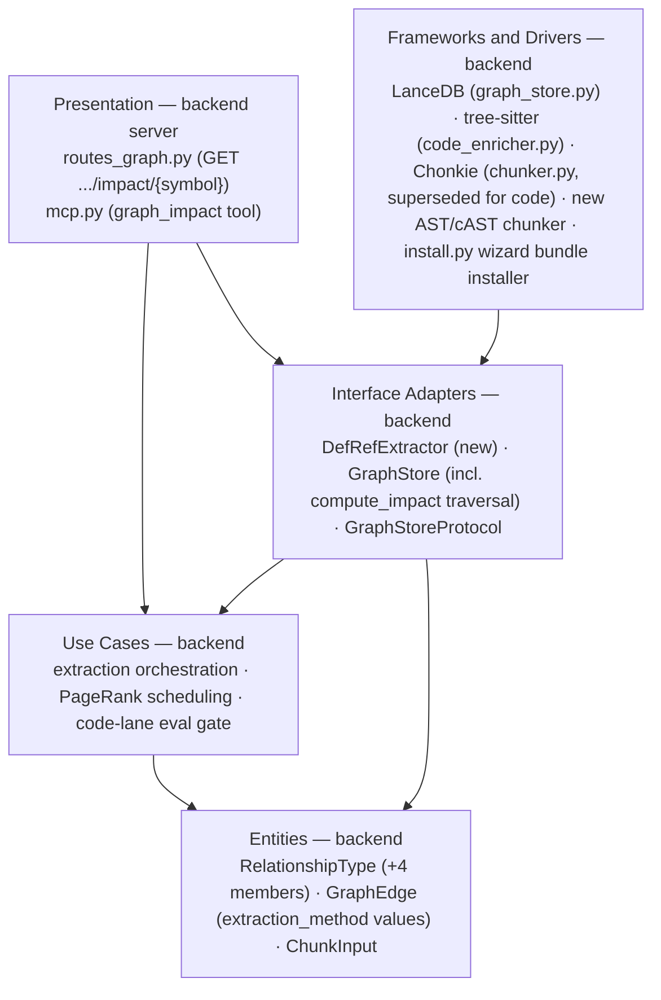
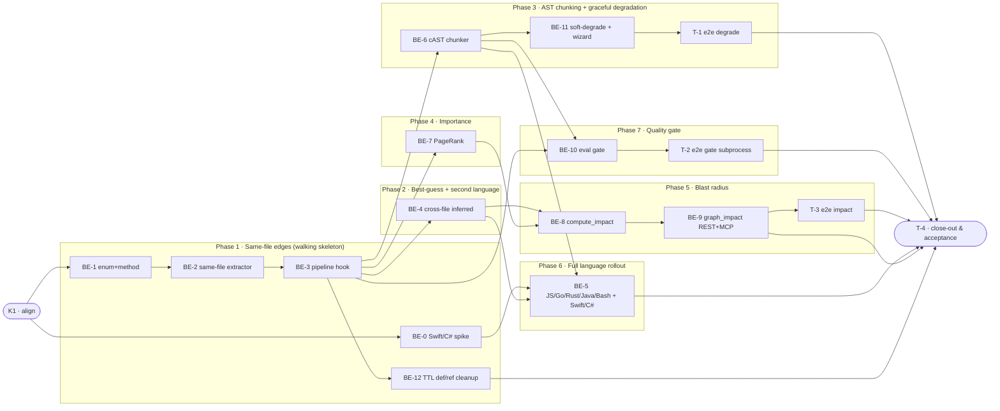

# E2G · Code Def/Ref Typed Graph — Team Plan

**How to read this file**
- **Architecture approach:** Clean Architecture — the default fallback; no override skill was requested. **Layers:** Presentation · Use Cases · Interface Adapters · Entities · Frameworks & Drivers. Each task's first sub-bullet names the layer it touches.
- **archon-search is a single-tier server** (FastAPI HTTP + MCP mounted on the same port; no browser UI or client codebase exists — confirmed by investigation). Presentation here means the server's own HTTP routes (`routes_graph.py`) and MCP tools (`mcp.py`), which are **backend-owned**, not a separate frontend team. The Frontend role is therefore **N/A** for this feature (kept per the plan's rules, not deleted).
- The **Backend** and **Tester** sections are the **depth view** — each role's work, grouped by layer.
- The **Task Breakdown** is the **order view** — every task is a single-role checkbox in execution order, opening with a dependency graph.
- **Phases are vertical slices**: each delivers a working end-to-end increment (extract → store → query), not a horizontal layer. No separate "integrate" phase. Sliced with the **built-in method** (`vertical-slicer` skill is installed, but with no frontend/UI surface here its layout-focused heuristics add nothing beyond the built-in slice-by-observable-behavior approach — see Q10).
- Each task carries the **role tag at the end of its title line**, then sub-bullets: **layer · estimate** (decimal hours), **needs · completes**, and a **Tests** block. **needs** = predecessor tasks; **completes** = the scenario `S#` it makes true, or the contract `C#` it realises.
- **Tests** are tagged by level. **Unit and integration tests belong to the implementing dev** (test-first); **e2e tests are the tester's tasks** (this feature has no manual-test candidates — everything is exercisable through HTTP/MCP/subprocess automation, confirmed by investigation). The close-out task writes no tests.
- **Contracts** use **TypeSpec** (available, v1.13.0). Internal logical seams are core-construct `.tsp` files beside this plan, each validated with `tsp compile <file> --no-emit`. The one HTTP/API seam (`graph_impact` REST route) is a TypeSpec HTTP service under `api-contracts/`, emitting a linked `openapi.yaml` via `@typespec/openapi3`. All four contracts compiled clean.
- **Role tags** (`#backend-role`, `#tester-role`) mark each task and each role-owned section.
- IDs (`S#` scenarios, `C#` contracts, `BE-#`/`T-#`/`K#` tasks, `Q#` questions) are the traceability thread.
- **Rule:** edit your own tasks freely; change a contract only by team agreement.

---

## Background

Code files land in the knowledge graph as lone dots today: every code chunk produces exactly one `code_symbol` node and **zero edges** (`graph_extractor.py:209-227` — confirmed mathematically: the co-occurrence edge builder needs ≥2 entity IDs per chunk to form a pair, and code chunks always produce exactly 1).

---

## Goal

After this ships: code is a connected graph (calls/imports/defines/inherits edges, tagged proven vs. best-guess), the most important symbols surface first in graph browsing (PageRank), and `graph_impact` — on both MCP and HTTP — answers "what breaks if I change X?" with callers/callees separated, ripple effect to a capped depth, and truncation always visible. A new quality gate proves connection-style code queries score measurably better with these edges than without, with no existing quality floor dropping.

---

## Scope

### In Scope
- AST-aware (cAST) chunking for code files, replacing fixed-window Chonkie chunking for code only.
- Def/ref typed edges (`calls`, `imports`, `defines`, `inherits`), each tagged `extraction_method: "extracted" | "inferred"`. Languages sequenced: Python + TypeScript first, then JavaScript/Go/Rust/Java/Bash, then Swift/C# last (may slip to a fast-follow).
- PageRank importance scoring for code symbols — new graph-browsing sort mode + impact-tool ordering only (never search ranking).
- `graph_impact` on MCP and HTTP.
- The code-lane quality gate itself (new connection-question fixtures, A/B vs. co-occurrence, wired into existing threshold/baseline machinery, staged so chunking and edges are attributed separately).
- Wizard auto-installs `[code]` + `[graph]` bundles (Major #5, corrected this cycle — Swift/C# parser auto-install struck from scope: BE-11's actual task description and Tests block only ever covered the soft-degrade WARNING and the `[code]`+`[graph]` bundle install, never Swift/C# grammar installation; this matches the "Swift/C# may slip to a fast-follow" framing already stated in Known Limitations, so no promise is broken by narrowing this bullet); manual config without code parsers gets a loud one-time warning and a health/status field; server still starts, prose graphing still works.

### Out of Scope
- Importance scores influencing search ranking (E2h — Personalized PageRank).
- LLM-derived relationship edges (`uses`/`implements`/`depends_on` producers — E2i).
- Language-server-grade cross-file resolution (best-guess matching is the deliberate ceiling).
- Languages beyond the nine named.
- A SwiftUI-specific parser (Swift covers it).

---

## Acceptance criteria
- Ingesting a Python or TypeScript file with same-file calls, explicit imports, or same-file inheritance produces `calls`/`imports`/`defines`/`inherits` edges tagged `extraction_method: "extracted"`.
- Cross-file same-name matches produce edges tagged `extraction_method: "inferred"`; `graph_impact` can filter to extracted-only.
- Two unrelated same-named code symbols in different files remain distinct graph nodes (file-qualified `code_symbol` identity); `graph_impact` can disambiguate between them via an optional `file_path` parameter.
- `graph_impact` (MCP and HTTP) returns callers and callees separated, with a ripple effect to a settable depth (default depth = **2**, hard cap = **5**, default direction = **"both"**, Major #4), grouped direct vs. indirect, with per-group counts that make truncation visible — never a silently partial answer. `depth`/`direction` are optional (defaulted) on C1/C2; C4's `compute_impact` declares them REQUIRED, and BE-9 is the single place the defaults get filled in before calling the Adapter.
- Graph browsing gains an "importance" sort mode ordered by PageRank; `graph_impact` results are also PageRank-ordered. Search-result ranking is unaffected.
- `graph.enabled=true` with code parsers missing: server starts, prose graphing works, code graphing is skipped, one-time WARNING logged, health/status field names the fix.
- The new code-lane eval gate passes: connection-style code queries score measurably better with def/ref edges than with the pre-existing co-occurrence graph; no existing quality floor regresses; chunking-only and edges-only deltas are measured separately.
- Existing collections do not retroactively gain edges; this is documented (re-ingest required).
- Swift/C# ship only if their tree-sitter grammars prove ABI-compatible; otherwise the release proceeds with seven languages, and this is documented.
- All tests pass with zero warnings.

---

## What does NOT change
- Search-result ranking (PageRank/PPR is E2h's territory).
- Graph hygiene: existing orphan cleanup / GC is type-agnostic and already covers new edge types for free (`jobs/maintenance_loop.py`).
- `make_stable_edge_id`'s direction- and type-sensitive ID scheme (`graph_types.py:76-92`) — new edge kinds reuse it unchanged.
- The `ns`-last-parameter convention on every `GraphStore` public method.
- `GraphEdge.extraction_method` as a field — it already exists (`graph_types.py:170`); this feature adds two new string values (`"extracted"`, `"inferred"`) to the existing field, not a new column.
- The `_archon_graph_{ns}__{col}_*` table naming scheme.

---

## Known limitations / accepted trade-offs
- Best-guess cross-file matching (not language-server-grade resolution) — common names (`run`, `get`, `init`) will produce false `inferred` **edges**; the honesty label plus a proven-only filter is the accepted mitigation, not elimination. This is separate from — and does not fix — the **node-identity** collision below: it only labels bad links between already-distinct nodes.
- **`code_symbol` node identity is now file-qualified (Critical #2, fixed this revision; ID/display-name divergence made explicit this cycle — Critical #3).** Before this feature, `make_stable_entity_id(entity_type, name)` had no file/path component, so two unrelated same-named functions in different files already collapsed onto one graph node — a pre-existing bug this feature's `graph_impact` tool would otherwise inherit and amplify (a blast-radius answer for `run` in file A would silently include callers/callees of an unrelated `run` in file B). BE-2 qualifies the ID-hashing input only: it passes an ID-only qualified string (e.g. `f"{name}::{source_path}"`, or equivalent) into `make_stable_entity_id` for `code_symbol` nodes, so same-named symbols in different files hash to distinct node IDs. **`GraphNode.entity_name` is never file-qualified — it stays exactly the bare symbol name.** This is a deliberate divergence: `entity_name` is the display value surfaced directly in `graph_inspector.py` and in every impact contract's `ImpactEdge.entity_name` — file-qualifying it would pollute every `graph_impact` response and every graph-browsing result with e.g. `src/foo.py::run` instead of a clean `run`. `compute_impact`/`graph_impact`'s optional `file_path` param disambiguates which node a bare `symbol` string resolves to (default: highest-PageRank match) — see C1/C2/C4 and BE-2.
- **TTL/maintenance-only chunk expiry does not yet tear down def/ref graph rows (BE-12, planned).** Explicit delete, sync/watcher delete, and re-ingest paths were hardened in b80209e (`delete_defref_graph_by_doc`, GC exemption for def/ref edges and `-defref-module` pseudo-nodes). When chunks expire via `maintenance_loop` `prune_expired_chunks` without an explicit document delete, those GC-exempt, mention-free def/ref rows can leak — see `Documentation/archon-search-notes.md`. BE-12 closes this lifecycle gap.
- Cross-file inferred-edge matching is **order-dependent on ingest order** (distinct from the no-backfill decision below): if file A (caller, no local definition) is ingested before file B (which defines the function), BE-4's per-document extraction finds no target at A's ingest time and produces no edge — nothing re-scans A when B is later ingested. Documented, not fixed in v1; a lightweight "unresolved reference" backfill table is a candidate future iteration.
- Ambiguous cross-file name matches (three files each defining `run`) resolve by linking the caller to **all** candidates, each tagged `inferred` — best-guess matching is the documented ceiling, not a single arbitrarily-chosen candidate.
- Swift/C# may slip to a fast-follow if their tree-sitter grammars prove ABI-incompatible with the pinned `tree-sitter>=0.25,<0.26` core — the release proceeds with seven languages either way.
- No backfill for existing collections in v1 (Q8, resolved) — re-ingest is the only path to gaining edges (documented, not silent); a backfill pass is a candidate future iteration, not scoped here.
- PageRank stays out of search ranking entirely in this release (zero retrieval risk); E2h is the principled path for graph-influenced ranking.
- PageRank scores are persisted, not recomputed per request (Q1, resolved) — they can lag by up to one maintenance cycle behind the very latest ingest, matching the existing community-rebuild staleness window.
- **The file-qualified `code_symbol` ID scheme has a narrow residual case-sensitivity collision (Moderate #11, new this cycle):** `make_stable_entity_id` lowercases its entire canonical input (`f"{entity_type.strip().lower()}:{entity_name.strip().lower()}"`, `graph_types.py:72`) before hashing, including the embedded `source_path` qualifier BE-2 adds. On a case-sensitive filesystem, two distinct files differing only by path case (e.g. `Utils.py` vs `utils.py`) hash to the same qualified string and silently re-merge onto one node — the same class of collision the file-path qualifier exists to fix, just reintroduced via path case instead of a missing path. Accepted as a residual limitation, not fixed in this release.

---

## Approach & architecture

Clean Architecture, single-tier server: Presentation (`routes_graph.py`, `mcp.py`) → Use Cases (extraction orchestration, PageRank scheduling) → Interface Adapters (`GraphStore` incl. `compute_impact` traversal, `DefRefExtractor`) → Entities (`graph_types.py`) → Frameworks & Drivers (LanceDB via `graph_store.py`, tree-sitter via `code_enricher.py`). **`compute_impact` is an Interface Adapter method, not a Use Case (Major #2)** — it is added directly to the existing `GraphStore` class in `graph_store.py` (Major #3; see BE-7/BE-8 below), the same class hosting the existing `get_neighbours`/`get_edges_for_nodes` first-degree primitives it's built on. Those two primitives are concrete-`GraphStore`-only today, not part of `GraphStoreProtocol` (verified: `graph_store_protocol.py` declares only `get_all_nodes`/`vector_search_nodes`/`write_graph`/`find_nodes_by_name`) — so `compute_impact`/`pagerank_score`/`write_pagerank_scores` follow that same precedent and are new methods on the concrete class, not a Protocol extension and not a separate `GraphTraversalStore` class. C4's `GraphTraversalStore` label is a logical contract name only; its methods have no separate class/file home — they live on `GraphStore`.

`P --> AD` reflects that BE-9 (Presentation) calls `compute_impact` (an Adapter-layer method) directly for the impact traversal — distinct from cases where Presentation goes through a Use Case first.

**Layer map (and role mapping)**

| Layer | Role | Components |
|-------|------|-----------|
| Presentation | **Backend** (server surfaces; no separate frontend exists) | `server/routes_graph.py` (new impact route), `server/mcp.py` (new `graph_impact` tool), `cli/graph_cmd.py` if a CLI surface is added, `server/schemas.py`'s `StatusResponse` (BE-11's health field, a thin Presentation-layer touch) |
| Use Cases | Backend | new `DefRefExtractor` orchestration, PageRank compute/schedule, code-lane eval gate logic |
| Interface Adapters | Backend | `graph_store.py` (`GraphStore`, including the new `compute_impact` BFS traversal — Major #2/#3, added directly to this class, not a separate `GraphTraversalStore`), `graph_store_protocol.py` (`GraphStoreProtocol`), `DefRefExtractor (new)` |
| Entities | Backend | `graph_types.py` (`RelationshipType`, `GraphEdge`, `ChunkInput`) |
| Frameworks & Drivers | Backend | `graph_store.py` LanceDB tables, `code_enricher.py` tree-sitter grammar loading, `chunker.py` Chonkie (superseded for code files only), new AST/cAST chunker (sibling to `chunker.py`'s `DocumentChunker`, structurally identical — no protocol/port seam — Major #13 moved it here from Interface Adapters), `install.py` wizard bundle installer (BE-11's `[code]`+`[graph]` auto-install — a cross-cutting task that also lightly touches Presentation, see above) |

**What changes**
- `RelationshipType` gains `calls`/`imports`/`defines`/`inherits` (pure enum extension, no migration — string column).
- A new def/ref extractor (Interface Adapter, DI'd against `GraphStoreProtocol` like `SynonymDetector`) produces typed edges for code chunks, closing the zero-edge gap at `graph_extractor.py:209-227`. It also qualifies `code_symbol` node identity with the chunk's `source_path` (Critical #2) — today's `make_stable_entity_id(entity_type, name)` has no file component, so this feature would otherwise inherit a pre-existing node-collision bug and hand it straight to `graph_impact`. Only the ID-hashing input is file-qualified; `GraphNode.entity_name` stays the bare symbol name (Critical #3) — the two are deliberately allowed to diverge so display values (`graph_inspector.py`, `ImpactEdge.entity_name`) never show a polluted path-qualified string.
- `pipeline.py` already calls `enricher.prepare()` (tree-sitter parse) before `self._chunker.chunk()` for every code file today — the parse-before-chunk ordering already holds, and its `ScopeTable` is already built once per file (Q2, resolved: no restructuring needed here). The gap is that `DocumentChunker.chunk()` has no parameter to accept that already-built `ScopeTable`. A new AST (cAST) chunker (sibling to `DocumentChunker`) is wired to consume the existing `ScopeTable` and splits/merges on its scope boundaries instead of fixed Chonkie windows; `pipeline.py`'s existing `suffix in CODE_EXTENSIONS` dispatch branch selects it.
- PageRank is computed over the (now-connected) code graph in the background and persisted on the nodes table (Q1, resolved: persisted-with-trigger, following `community_builder.py`'s `asyncio.to_thread` + `maintenance_loop.py`'s debounce-reschedule pattern, not read-time compute), surfaced as a new sort mode + impact ordering. No new `weight` field is needed on `GraphEdge` — PageRank runs unweighted (Q3, resolved); "weight" stays a derived, non-persisted value in response/view models only, exactly as it is today.
- `graph_impact` is new Presentation surface on both REST and MCP, built on a new `compute_impact` traversal (no existing multi-hop traversal exists — `graph_expander.py` is first-degree only).
- A code-lane eval gate is added following the exact BE-8 (`synonym_bridge_recall_at_5`) atomic-update pattern, using two small independent fixture corpora — one chunk-boundary-sensitive, one connection-sensitive — each with its own threshold, rather than toggling backend configurations (Q6, resolved).
- Graph-browsing truncation treats def/ref edges like any other edge for now, with no synonym-style cap exemption (Q9, resolved) — this keeps `_truncate_graph`'s cap meaningful on large repositories; PageRank-aware trimming can be layered on later without a shape change, once persisted scores (above) exist.
- New graph-table columns (e.g. the persisted PageRank score) follow the existing lightweight `add_columns` precedent used for `extraction_method` (`graph_store.py:213-232`) — no `STORE_SCHEMA_VERSION` bump or migration entry required; that policy governs the main chunk/metadata tables only (Q4, resolved).

**Key decisions (from the brief)**
- All five parts ship together as one release; the eval must be staged internally (two independent fixture corpora, per Q6) so a regression in one cannot hide behind an improvement in the other.
- Best-guess cross-file matching, labeled — never proven-only edges.
- Impact answers = callers + callees + ripple effect, settable/capped depth, direction-grouped, truncation-counted.
- Nine languages, sequenced last-risk-last (Swift/C# may slip without blocking); a cheap early spike (BE-0, Phase 1) checks Swift/C# tree-sitter grammar installability in parallel with the walking skeleton rather than up front or left until Phase 6 (Q7, resolved). BE-0 does not block the impact-tool critical path (BE-9/T-3), but it does gate BE-5/Phase 6 (Major #24 — its 1h estimate means it completes long before BE-5 is ready to consume it, so this is not a practical risk, but it is not accurate to call it non-blocking outright).
- PageRank stays out of search ranking; scores are persisted, computed in the background (Q1, resolved).
- Both surfaces (MCP + HTTP) for `graph_impact`.
- Wizard automates setup — installing `[code]`+`[graph]` via the wizard means this whole degraded-startup path is never hit for guided users. For manual config: the existing `graph.enabled` hard-fail (`app.py:114-134`, `_check_graph_deps`, raises `ConfigError` when spaCy is missing) is left unchanged and is NOT extended to tree-sitter; the soft-degrade precedent to reuse instead is `code_enricher.py`'s per-extension one-time-log-then-skip pattern (`code_enricher.py:134-189`), bumped from INFO to WARNING and surfaced on `/status` (Q5, resolved).
- No backfill for existing collections; re-ingest-only (Q8, resolved).

---

## Contracts / seams

Boundaries where roles must agree. **Logical, not code.** Authored in **TypeSpec** (available, v1.13.0); all four compiled/emitted clean. Changing one requires team agreement.

**C1 — `graph_impact` HTTP/API seam**  *(Presentation ↔ external HTTP clients)*
`GET /graph/{collection}/impact/{symbol}` with `file_path`, `depth`, `direction`, `extraction_method_filter` query params, returning `GraphImpactResponse` (`callers`/`callees` as `ImpactGroup{direct: ImpactEdge[], indirect: ImpactEdge[], truncated: bool, omitted_count: int32}`, `depth_used`) — a direct structural mirror of C4's `ImpactResult`, so BE-9 does zero lossy transform between the traversal layer and this route (Critical #1, fixed this revision — the prior draft flattened callers/callees to a bare `ImpactEdge[]` with one scalar `truncated`/`omitted_callers`/`omitted_callees`, which contradicted the Acceptance Criteria's "grouped direct vs. indirect" promise). `file_path` disambiguates which node `symbol` resolves to when more than one same-named `code_symbol` node exists (Critical #2). Mirrors the existing `routes_graph.py` guard pattern (422 if `graph.enabled` false, 404 if collection missing) and `GraphInspectionResponse` naming convention. See `api-contracts/e2g-graph-impact-api.tsp` + `api-contracts/e2g-graph-impact-api.openapi.yaml`.
- Realised by: BE-9 · Verified by: BE-9 (integration), T-3 (e2e)

**C2 — `graph_impact` MCP tool**  *(Presentation, in-process/stdio — not REST)*
`graph_impact(params: GraphImpactParams) -> GraphImpactResult | McpErrorResponse`, where `GraphImpactResult` uses the same `ImpactGroup`-shaped `callers`/`callees` as C1/C4 (Critical #1) and `GraphImpactParams` gains an optional `file_path` disambiguator (Critical #2). What actually transfers from the existing `get_graph` tool shape (`mcp.py:1838`) is only the outer `McpErrorResponse | None` guard pattern (`_validate_*` convention) — the BFS/depth/grouping logic itself is novel, invented fresh in BE-8, not an existing precedent (Major #22). See `e2g-graph-impact-mcp.tsp`.
- Realised by: BE-9 · Verified by: BE-9 (integration), T-3 (e2e)

**C3 — Def/ref edge shape**  *(Entity layer)*
Four new `RelationshipType` members (`calls`/`imports`/`defines`/`inherits`) and two new `extraction_method` values (`"extracted"`/`"inferred"`) on the existing field — pure additive, no schema migration. Precedence rule for the `extracted`/`inferred` tag collision on the same pair+type (Q11, resolved, mechanism corrected this revision — Critical #3): **extracted always wins over inferred and is never downgraded.** `GraphStore.write_graph` upserts edges via one bulk `merge_insert("id").when_matched_update_all().when_not_matched_insert_all()` call (`graph_store.py:358-362`) with no per-row conditional skip available — the same LanceDB API gap the existing embedding-preservation logic already works around (`graph_store.py:267-290`, flagged `ponytail:`). BE-4 mirrors that exact shape: **before** the bulk `write_graph` call, read the existing stored edges whose `id`s appear in the incoming batch; for any incoming edge tagged `"inferred"` whose existing stored counterpart is already tagged `"extracted"`, override the incoming edge's `extraction_method` field back to `"extracted"` in memory before it goes into the merge_insert batch. The bulk upsert then still updates every other field normally (including `source_doc_id` — see below) but the tag itself never downgrades. `source_doc_id` always refreshes on every write, even on a tag-preserving write — so GC/orphan-cleanup keyed off `source_doc_id` never wrongly orphans a relation that's still live via a different discovering document. See `e2g-defref-edge.tsp`.
- Realised by: BE-1 (Entity) · BE-4 (precedence-preserving write mechanism, Interface Adapter) · Verified by: BE-1 (unit), BE-3/BE-4 (integration)

**C4 — Graph traversal + PageRank read/write**  *(Interface Adapter layer)*
`GraphTraversalStore` is this contract's logical label only — realised as three methods added directly to the existing `GraphStore` class in `graph_store.py`, not a separate class (Major #3, verified against `graph_store_protocol.py`: `get_neighbours`/`get_edges_for_nodes` are concrete-`GraphStore`-only today, not part of `GraphStoreProtocol`, so these three new methods follow that same precedent). New `compute_impact(collection, symbol, depth, direction, extraction_method_filter, file_path, ns) -> ImpactResult` (BFS, depth-capped, built on existing `get_neighbours(collection, entity_ids, ns)`/`get_edges_for_nodes(collection, entity_ids, ns)` first-degree primitives — both REQUIRE `collection`, so `compute_impact` takes it too, and so do the sibling `pagerank_score`/`write_pagerank_scores` methods below, added this revision), `pagerank_score(collection, entity_id, ns) -> float32 | void`, and `write_pagerank_scores(collection, scores, ns) -> void` (Major #8, new this revision — the write-path Adapter contract BE-7 needs; previously only a read contract existed, which would have forced BE-7 to reach past the Adapter layer into `graph_store.py` directly). All three methods follow the codebase's existing parameter-ordering convention: `collection` is not last, `ns` always is (unchanged — see "What does NOT change"). `depth`/`direction` are REQUIRED on this interface (default depth = **2**, hard cap = **5**, default direction = **"both"**, Major #4) — BE-9 fills these defaults in at the Presentation→Adapter boundary before calling `compute_impact`; C1/C2 declare `depth`/`direction` OPTIONAL for exactly this reason. `ImpactResult.callers`/`callees` are each an `ImpactGroup` (`direct: ImpactEdge[]`, `indirect: ImpactEdge[]`, `truncated: bool`, `omitted_count: int32`) — four independent truncation signals, one per group. `pagerank_score` reads a **persisted** column, written by a background recompute (Q1, resolved) — not calculated inline per call. `extraction_method_filter` is a pre-filter on traversal, not a post-filter on results (Major #10): excluded edge types are never followed, so `depth_used` and `omitted_count` stay honest relative to the filtered graph. `file_path` disambiguates same-named `code_symbol` nodes (Critical #2); omitted, resolution defaults to the highest-PageRank match. See `e2g-graph-traversal.tsp`.
- Realised by: BE-7 (PageRank), BE-8 (traversal) · Verified by: BE-7/BE-8 (integration), T-3 (e2e)

---

## Scenarios #tester-role

Behavioural only — step-level detail is produced by the tasks below. Cover happy, unhappy, edge, and non-functional paths.

| id | Scenario (Given / When / Then) |
|----|--------------------------------|
| **S1** | **Given** a same-file Python function call · **When** the file is ingested · **Then** a `calls` edge tagged `extraction_method: "extracted"` connects caller → callee |
| **S1b** | **Given** a same-file Python function/class definition (the definition site itself, not a call) · **When** ingested · **Then** a `defines` edge tagged `"extracted"` is created |
| **S2** | **Given** an explicit Python import statement · **When** ingested · **Then** an `imports` edge tagged `"extracted"` is created |
| **S3** | **Given** a Python class inheriting from another class in the same file · **When** ingested · **Then** an `inherits` edge tagged `"extracted"` is created |
| **S4** | **Given** two files calling a same-named function without an explicit import · **When** both are ingested · **Then** a `calls` edge tagged `extraction_method: "inferred"` is created, honestly labeled as a best guess |
| **S4b** | **Given** two unrelated files each defining a function with the same name (e.g. `run`) · **When** both are ingested and `graph_impact` is called for that name with a `file_path` disambiguator · **Then** the two symbols resolve to distinct graph nodes, and the impact answer for one never includes the other's callers/callees |
| **S5** | **Given** def/ref edges exist for a symbol · **When** `graph_impact` is called (MCP or HTTP) for that symbol · **Then** callers and callees are returned separated, with ripple effect to the default depth |
| **S6** | **Given** a hub symbol with a huge blast radius · **When** `graph_impact` is called · **Then** results are capped per group with explicit omitted-count fields — never silently partial |
| **S7** | **Given** a caller wants only proven links · **When** `graph_impact` is called with `extraction_method_filter=extracted` · **Then** only proven edges appear, best-guess edges excluded |
| **S8** | **Given** a TypeScript file with calls/imports · **When** ingested · **Then** equivalent typed edges are created, proving the design generalizes past Python |
| **S9** | **Given** `graph.enabled=true` but `[code]` extras (tree-sitter parsers) are missing · **When** the server starts · **Then** it starts successfully, prose graphing works, code graphing is skipped, and a one-time WARNING plus a health/status field name the fix |
| **S10** | **Given** `[code]` extras are present · **When** a code file is ingested · **Then** AST-aware (cAST) chunking splits on function/class boundaries instead of fixed token windows |
| **S11** | **Given** tree-sitter is unavailable for a specific file's language at chunk time · **When** ingested · **Then** chunking falls back to today's token chunking without failing the ingest |
| **S12** | **Given** code symbols with PageRank computed · **When** browsing the graph with the new "importance" sort mode · **Then** symbols are ordered by PageRank score |
| **S13** | **Given** `graph_impact` results · **When** ordering callers/callees · **Then** they are ordered by PageRank importance, not insertion order |
| **S14** | **Given** a collection ingested before this feature ships · **When** it is not re-ingested · **Then** it has no def/ref edges, and this is documented, not silent |
| **S15** | **Given** the new code-lane eval fixtures · **When** the quality gate runs · **Then** connection-style code queries score measurably better with def/ref edges than with the pre-existing co-occurrence graph, and no existing quality floor regresses |
| **S16** | **Given** chunking and edges both change in this release · **When** the eval gate measures impact · **Then** chunking-only and edges-only deltas are attributed separately, not conflated |
| **S17** | **Given** a malformed or unparseable code file · **When** ingested · **Then** extraction failure is logged as WARNING and does not fail the ingest (never-propagate invariant, matching `pipeline.py:632-663`) |
| **S18** | **Given** Swift or C# tree-sitter grammars prove ABI-incompatible with the pinned core · **When** the release ships · **Then** those two languages are excluded without blocking the other seven, and this is documented |
| **S19** | **Given** a code file with def/ref edges ingested under a short chunk TTL · **When** chunks expire via maintenance `prune_expired_chunks` without an explicit document delete · **Then** def/ref graph rows for that document are removed (shared `-defref-module` pseudo-nodes preserved when still referenced by another document), closing the lifecycle gap noted in `Documentation/archon-search-notes.md` |

---

## Frontend #frontend-role

N/A — no frontend work for this feature. archon-search has no web UI, dashboard, or client codebase (confirmed: no `web/`/`ui/`/`frontend/`/`static/`/`templates/` directories; `server/app.py` serves no static assets or templates; `Documentation/UserManual/` documents CLI/server/config only). "Graph browsing" and its new "importance" sort mode are REST (`routes_graph.py`) and MCP (`mcp.py`) parameters backed by `graph_inspector.py`, not UI state.

---

## Backend — Entities · Use Cases · Adapters · Frameworks #backend-role

**Scope:** all implementation for this feature — extraction, chunking, PageRank, the `graph_impact` tool on both surfaces, the eval gate, and the graceful-degradation/wizard work. Writes both unit and integration tests for its tasks.
**Owns layers:** Entities, Use Cases, Interface Adapters, Frameworks & Drivers, and the server's Presentation surfaces (no separate frontend team exists).

**Tasks by layer** *(checkable in the Task Breakdown)*
- Entities: BE-1 — `RelationshipType` + `extraction_method` extension
- Presentation: BE-9 — `graph_impact` REST + MCP
- Interface Adapters: BE-2 — Python/TS same-file `DefRefExtractor` (extracted tier) · BE-4 — cross-file inferred matching · BE-5 — remaining language rollout (JS/Go/Rust/Java/Bash, then Swift/C#) · BE-8 — `compute_impact` traversal
- Use Cases: BE-3 — wire extractor into post-ingest pipeline hook · BE-12 — def/ref cleanup on TTL/maintenance chunk expiry · BE-7 — PageRank compute + scheduling · BE-10 — code-lane eval gate (staged A/B)
- Frameworks & Drivers: BE-6 — AST (cAST) chunker (Major #13 — moved here from Interface Adapters; it has no protocol/port seam, structurally identical to `chunker.py`'s `DocumentChunker`) · BE-11 — code-parser-missing soft-degrade (health field + wizard `[code]`+`[graph]` auto-install; Swift/C# grammar wiring struck from BE-11's scope this cycle, Major #5 — see Scope)

**Done when**
- [ ] Same-file calls/imports/defines/inherits produce extracted-tier edges for Python and TypeScript — S1, S1b, S2, S3, S8
- [ ] Cross-file matches produce honestly-labeled inferred-tier edges — S4
- [ ] Same-named code symbols in different files remain distinct graph nodes — S4b
- [ ] `graph_impact` answers on both MCP and HTTP, depth-capped, direction-grouped, truncation-visible, filterable to proven-only — S5, S6, S7
- [ ] AST-aware chunking replaces fixed-window chunking for code, with a safe fallback — S10, S11
- [ ] PageRank orders graph browsing and impact results — S12, S13
- [ ] Server degrades gracefully (not hard-fail) when code parsers are missing — S9
- [ ] The code-lane eval gate passes with staged attribution and no regression elsewhere — S15, S16
- [ ] Ingest failures never propagate — S17
- [x] TTL/maintenance chunk expiry tears down def/ref graph rows without leaking GC-exempt edges — S19

---

## Tester #tester-role

**Scope:** the tester owns **e2e** tests plus the project **close-out**. No manual-test candidates exist for this feature (everything is exercisable through HTTP/MCP/subprocess automation — confirmed by investigation; nothing requires human/CAP-restricted intervention like the one existing manual-checklist precedent in this repo). **Unit and integration** tests belong to the implementing dev, in each implementation task's `Tests` block.

**Tasks** *(checkable in the Task Breakdown)*
- T-1 — e2e: graceful degradation when code parsers missing · T-2 — e2e subprocess gate: code-lane eval (staged attribution, non-vacuity) · T-3 — e2e: `graph_impact` end-to-end via real MCP + HTTP · T-4 — close-out & acceptance

**Allocation** — each scenario at the cheapest level that proves it *(unit + integration are dev-written; e2e is the tester's task; no manual tests apply)*

| Scenario | Cheapest level | Also re-verified at |
|----------|----------------|----------------------|
| S1, S1b, S2, S3, S8, S10, S11, S17 | unit *(S10 corrected this cycle — Moderate #7d: BE-6's `test_astChunker_splitsOnFunctionBoundary` unit test already directly proves S10's Given/When/Then without needing ingestion; previously mis-claimed as integration-cheapest)* | — |
| S4 | unit *(Major #19 — recomputed from actual Tests blocks: S4 has a unit test in BE-4)* | — *(C4-TEST-1, corrected this cycle — BE-4's integration tests cover Q11 precedence and write-idempotency, not S4's own Given/When/Then; no task re-verifies S4 above unit level)* |
| S5, S6 | unit *(Major #19 — recomputed from actual Tests blocks: S5/S6 have unit tests in BE-8)* | integration (BE-8/BE-9) + e2e (T-3, real HTTP+MCP agreement) |
| S7 | unit *(BE-8's `test_computeImpact_filtersToExtractedOnly`)* | — *(C4-TEST-2, corrected this cycle — none of BE-8's, BE-9's, or T-3's integration/e2e tests exercise `extraction_method_filter`; only the unit test proves S7)* |
| S4b | unit *(BE-8's `test_computeImpact_ambiguousSymbol_resolvesByFilePathOrPageRank`)* | — *(Moderate #7a, corrected this cycle: no integration or e2e test names S4b explicitly — BE-2 only lays groundwork at the node-identity level (Major #6), and neither BE-9's nor T-3's Tests blocks mention S4b by name; the table previously overclaimed "also re-verified at integration + e2e" for this scenario)* |
| S9, S12, S13, S14 | integration | S9 also re-verified by T-1 (e2e, Moderate #7b — `test_e2e_gracefulDegradation_missingCodeParsers` explicitly `completes S9`); S13 also re-verified by T-3 (e2e); S14 also documentation-fact-checked by T-4 (Moderate #7c — T-4's close-out `completes` list includes S14, but T-4 writes no tests, so this is a documentation fact-check, not a re-verifying test) |
| S16 | integration *(Major #19 — BE-10 has integration tests, `test_twoCorpora_attributeIndependently`/`test_twoCorpora_areDisjoint`; previously mis-claimed as eval-gate-e2e-cheapest)* | — *(C4-TEST-3, corrected this cycle — T-2's `test_e2e_codeDefrefEvalGate_subprocess` only asserts the gate runs cleanly with a non-vacuous pass count; it does not assert chunking-only vs. edges-only attribution independence, so it does not re-verify S16's distinguishing claim)* |
| S15 | eval-gate subprocess e2e *(no cheaper level proves the end-to-end gate-passes claim)* | — |
| S18 | integration *(new this cycle — Critical #4: BE-5's `test_swiftGrammar_forcedFailure_excludesLanguageOnly` / `test_cSharpGrammar_forcedFailure_excludesLanguageOnly`, both integration-level, `completes` S18)* | — |
| S19 | integration *(BE-12 — TTL/maintenance prune path; no cheaper level proves end-to-end chunk expiry + def/ref teardown in one pass)* | — |

---

## Documentation update

Docs the feature touches — the close-out task (T-4) works through this list.

- [ ] `e2g-code-defref-graph-brief.md` — no changes needed (source brief)
- [ ] `e2g-code-defref-graph-team-plan.md` — this file
- [ ] `Documentation/Architecture/130_data_architecture_and_persistence.md:156-158` — the graph-table schema section is already stale (wrong table-naming scheme, wrong edge column names — pre-dates this feature) and must additionally gain `calls`/`imports`/`defines`/`inherits`, the `extraction_method` values, and any new PageRank column
- [ ] `Documentation/Architecture/600_api_reference_or_public_interface.md` — already stale (says 17 MCP tools, omits `get_graph`/`get_graph_cross_collection` — pre-dates this feature) and must additionally add `graph_impact` (MCP tool + REST route)
- [ ] `Documentation/Architecture/110_component_catalog_and_layer_breakdown.md:73` — stale pre-namespacing table-name example; correct alongside the new def/ref components
- [ ] `graph_extractor.py` docstring — stale Kuzu references (per brief Q11); correct while touching this file for def/ref extraction
- [ ] `pipeline.py:651` `backend_threshold_edges` warning text — stale Kuzu reference (per brief Q11)
- [ ] `tests/eval/README.md` — add the new code-lane gate's fixture schema and threshold-lowering notes
- [ ] `archon-search.toml.example` — document any new `[graph]`/`[code]` config knobs (impact depth default/cap, PageRank scheduling)
- [ ] `Documentation/Architecture/210_performance_and_scalability.md` — record the new `compute_impact` BFS traversal and the code-lane eval gate's fresh p50/p95 latency measurements as new latency regression guards (Minor #29)
- [ ] `CLAUDE.md` — update the "Graph subsystem" section with the def/ref extractor, PageRank, and `graph_impact` additions

---

## Open questions

None remain open. All eleven questions raised during investigation (the brief's ten, plus Q11 added during review) were resolved this revision (status moved `draft → planned`).

*Resolved in this revision:*
- **Q1** (PageRank storage) — persisted-with-trigger, following `community_builder.py`'s `asyncio.to_thread` + `maintenance_loop.py`'s debounce-reschedule pattern (BE-7). A new nullable PageRank column is added to the nodes table.
- **Q2** (AST chunker parse reuse) — one shared tree-sitter parse pass already exists today (`pipeline.py` calls `enricher.prepare()` before `chunk()` for every code file; no restructuring needed) — Major #7 corrected this section, which previously misdescribed the gap as "restructure parsing to happen once, before chunking." The actual work (BE-6) is wiring the new AST chunker to consume the already-built `ScopeTable`, which the existing metadata enricher also reads.
- **Q3** (edge weight) — no new `weight` field on `GraphEdge`; PageRank runs unweighted. "Weight" stays a derived, non-persisted value in response models only, exactly as today.
- **Q4** (schema version policy) — graph tables follow the existing lightweight `add_columns` precedent (as used for `extraction_method`); no `STORE_SCHEMA_VERSION` bump or migration entry needed for the new PageRank column. This resolves via the codebase's own existing precedent rather than a real trade-off.
- **Q5** (soft-degrade design) — `_check_graph_deps` (`app.py`) is left unchanged and NOT extended to tree-sitter; the soft-degrade path extends `code_enricher.py`'s existing per-extension log-and-skip pattern (BE-11), bumped to WARNING and surfaced on `/status`. The wizard installs `[code]`+`[graph]` automatically, so guided users never hit this path at all — it exists only for manual configuration.
- **Q6** (staged eval measurement) — two small, independent fixture corpora (one chunk-boundary-sensitive, one connection-sensitive), each with its own threshold, rather than toggling backend configurations across multiple gate runs (BE-10).
- **Q7** (Swift/C# grammar risk) — verified early via a cheap, non-blocking spike (BE-0) run in parallel with the Phase 1 walking skeleton, rather than up front (would delay the whole feature) or left until Phase 6 (would surface the risk too late).
- **Q8** (backfill) — re-ingest-only for v1, exactly as the brief recommends; no backfill machinery is built in this release.
- **Q9** (truncation cap exemption) — def/ref edges count toward `_truncate_graph`'s normal cap like any other edge; no synonym-style exemption. Keeps the cap meaningful on large repositories; `graph_impact`'s own independent depth/count caps (C4) are unaffected either way.
- **Q10** (vertical-slicer substitution) — confirmed as an acceptable one-off judgment call for this all-backend feature; no process change to the `plan-maker-for-team` skill.
- **Q11** (extracted/inferred tag-collision precedence, added during review — Critical #3, mechanism corrected this revision) — `make_stable_edge_id` doesn't include `extraction_method` in its hash, and `GraphStore.write_graph`'s bulk `merge_insert("id").when_matched_update_all().when_not_matched_insert_all()` (`graph_store.py:358-362`) has no per-row conditional skip, so the same pair+type discovered first as one tier then the other would silently overwrite the tag with no defined outcome. Resolved: **extracted always wins over inferred and is never downgraded**, using the same pre-read-and-override mechanism `write_graph` already uses to preserve `name_embedding` across merge_insert (`graph_store.py:267-290`, flagged `ponytail:` as a LanceDB API-gap workaround): before the bulk write, BE-4 reads existing edges whose `id`s are in the incoming batch, and for any incoming `"inferred"` edge whose stored counterpart is `"extracted"`, overrides the incoming edge's `extraction_method` back to `"extracted"` in memory before the batch goes into `merge_insert` — the bulk upsert still runs once and still updates every other field normally. `source_doc_id` always refreshes on every write, even when `extraction_method` is preserved, so GC/orphan-cleanup keyed off `source_doc_id` never wrongly orphans a relation still live via a different discovering document.

---

## Task Breakdown

Single-role tasks in execution order, grouped into **vertical slices**.

### Dependency graph

### Phase 0 · Kickoff *(prerequisite; the one cross-cutting step)*
- [x] **K1** — Confirm the Contracts, Scenarios, and the eleven resolved open-question decisions with the team (PageRank persisted-with-trigger, unweighted edges, shared tree-sitter parse pass, soft-degrade design, two-corpus staged eval, no truncation exemption, re-ingest-only, extracted-over-inferred tag precedence) #team
    - — · 1.0h
    - completes C1, C2, C3, C4
    - Tests

### Phase 1 · Same-file edges *(the walking skeleton: Python calls/imports/inherits, extracted tier, end-to-end)*
- [x] **BE-0** — Spike: verify `tree-sitter-swift`/`tree-sitter-c-sharp` install and parse cleanly against the pinned `tree-sitter>=0.25,<0.26` core (Q7); runs in parallel with the walking skeleton — does not block the impact-tool critical path (BE-9/T-3), but does gate BE-5/Phase 6 (Major #24; its 1h estimate means it finishes long before BE-5 is ready to consume it) #backend-role
    - Frameworks & Drivers · 1.0h
    - needs K1 · completes (early risk signal for S18, formally completed by BE-5)
    - Tests
        - #integration_test — `test_swiftGrammarSpike_installsAndParsesSample` — a minimal Swift file parses cleanly with the installed grammar and produces real, non-empty AST nodes (Critical #6 — reworded from an unfalsifiable either/or to a concrete happy-path assertion; the failure branch is exercised separately in BE-5's forced-failure test)
        - #integration_test — `test_cSharpGrammarSpike_installsAndParsesSample` — same for C#
- [x] **BE-1** — Add `calls`/`imports`/`defines`/`inherits` to `RelationshipType`; document `extraction_method` values `"extracted"`/`"inferred"` on the existing field #backend-role
    - Entity · 2.0h
    - needs K1 · completes C3
    - Tests
        - #unit_test — `test_relationshipType_hasNineMembers` — enum now has 9 members (updates the hard-coded `len(RelationshipType) == 5` assertion in `tests/test_graph_types.py:182-183`)
        - #unit_test — `test_graphEdge_acceptsExtractedAndInferred` — `GraphEdge.extraction_method` accepts the two new string values
- [x] **BE-2** — `DefRefExtractor`: Python + TypeScript same-file `calls`/`imports`/`inherits`/`defines` extraction (extracted tier), DI'd against `GraphStoreProtocol`; qualify `code_symbol` node identity by hashing an ID-only qualified string (name + the chunk's `source_path`) into `make_stable_entity_id`, so same-named symbols in different files get distinct graph node IDs (Critical #2 — today `make_stable_entity_id(entity_type, name)` has no file component, so e.g. two unrelated `run` functions in different files already collapse onto one node, `graph_extractor.py:211`) — **`GraphNode.entity_name` itself is never file-qualified and stays the bare symbol name** (Critical #3): only the hash input changes, the display field does not. This task lays the groundwork for S4b (distinct node IDs) without itself proving `graph_impact`-level isolation — that is proven by BE-8, which owns S4b's `completes` (Major #6, corrected this cycle — only BE-8 lists S4b in its `completes`; BE-9's `completes` does not) #backend-role
    - Interface Adapter · 14.0h
    - needs BE-1 · completes S1, S1b, S2, S3, S8
    - Tests
        - [x] #unit_test — `test_sameFileCall_producesCallsEdge` — a same-file function call yields a `calls` edge tagged `extracted`
        - [x] #unit_test — `test_sameFileDefinition_producesDefinesEdge` — a same-file function/class definition yields a `defines` edge tagged `extracted` (S1b)
        - [x] #unit_test — `test_explicitImport_producesImportsEdge` — an explicit import yields an `imports` edge tagged `extracted`
        - [x] #unit_test — `test_sameFileInheritance_producesInheritsEdge` — same-file subclassing yields an `inherits` edge tagged `extracted`
        - [x] #unit_test — `test_typeScriptSameFileCall_producesCallsEdge` — the TypeScript path produces the same edge shape
        - [x] #unit_test — `test_typeScriptImportAndInherits_produceEdges` — the TypeScript path also produces `imports` and `inherits` edges, not just `calls` (Major #14 — S8's "generalizes past Python" claim was previously tested for `calls` only)
        - [x] #unit_test — `test_sameNameDifferentFiles_produceDistinctNodes` — two unrelated same-named functions in different files get distinct `code_symbol` node IDs because `source_path` qualifies the `make_stable_entity_id` hash input, AND both nodes' `entity_name` field stays the clean bare symbol name (not path-qualified) in both — asserts the ID/display-name divergence explicitly (Critical #3); groundwork for S4b, not a proof of `graph_impact`-level isolation (Major #6)
        - [x] #integration_test — `test_defrefExtractor_writesEdgesToGraphStore` — extracted edges round-trip through a real `GraphStore`
- [x] **BE-3** — Wire `DefRefExtractor` into the post-ingest pipeline hook, following the never-propagate contract #backend-role
    - Use Case · 6.0h
    - needs BE-2 · completes S17, S14
    - Tests
        - #unit_test — `test_extractionFailure_logsWarningNotRaise` — a parser exception is caught, logged WARNING, and does not propagate
        - #unit_test — `test_midParseFailure_writesNoPartialEdges` — a file that parses partway before raising leaves zero edges written for that file (atomic per-file — Major #16, resolves whether partial edges survive a mid-parse failure, previously untested beyond a fully-mocked exception and the clean happy path)
        - #integration_test — `test_ingestCodeFile_producesEdgesEndToEnd` — ingesting a real Python file via the pipeline produces def/ref edges in the graph store
        - #integration_test — `test_preFeatureCollection_hasNoDefRefEdgesUntilReingest` — S14: seed a graph store representing a pre-feature ingest (a `code_symbol` node with zero `calls`/`imports`/`defines`/`inherits` edges, matching today's zero-edge state) and assert the def/ref edge count stays zero until the same file is re-ingested through the pipeline with `DefRefExtractor` wired, at which point the edges appear — proves re-ingest, not passive migration, is the only path to gaining edges

### Phase 1b · Def/ref lifecycle hardening *(closes the TTL/maintenance expiry gap from iterative review on BE-3, b80209e)*
- [x] **BE-12** — Wire def/ref graph cleanup into the TTL/maintenance chunk-expiry path: when `maintenance_loop._run_expired_chunk_pruning` / `SearchStore.prune_expired_chunks` removes expired chunks without an explicit document delete, invoke the same doc-scoped def/ref teardown as explicit delete/re-ingest (`GraphStore.delete_defref_graph_by_doc`), respecting shared `-defref-module` pseudo-node preservation and the GC-exempt def/ref semantics established in b80209e. Closes the lifecycle gap documented in `Documentation/archon-search-notes.md` (explicit delete, sync/watcher delete, and re-ingest were fixed there; maintenance/TTL-only expiry was not). #backend-role
    - Use Case · 4.0h
    - needs BE-3 · completes S19
    - Acceptance criteria
        - After maintenance prunes expired chunks for a document, no def/ref edges or doc-scoped `-defref-module` pseudo-nodes remain keyed to that document's `source_doc_id`.
        - Shared module pseudo-nodes still referenced by another document's def/ref edges are preserved (same rule as b80209e explicit-delete path).
        - Def/ref cleanup on this path is best-effort WARNING-swallowed (never-propagate invariant — a bad graph write must not fail chunk pruning).
        - `prune_expired_chunks` returning deduplicated `doc_ids` is the hook surface; no new REST/MCP surface.
    - Tests
        - #unit_test — `test_runExpiredChunkPruning_callsDeleteDefrefGraphByDocPerPrunedDocId` — mock `prune_expired_chunks` to return two doc_ids; assert `delete_defref_graph_by_doc` is awaited once per id with the maintenance pass namespace
        - #unit_test — `test_runExpiredChunkPruning_defrefCleanupFailure_logsWarningNotRaise` — `delete_defref_graph_by_doc` raises; assert maintenance pruning still completes and the exception is logged WARNING, not propagated
        - #unit_test — `test_ttlPrune_preservesSharedDefrefModuleNodeWhenOtherDocReferences` — TTL prune of one doc does not remove a `-defref-module` pseudo-node still referenced by another document's def/ref edges (mirrors b80209e shared-node rule on the maintenance path)
        - #integration_test — `test_ttlExpiry_maintenancePrune_removesDefrefGraphRows` — ingest a code file with short TTL, trigger maintenance (or force `expires_at` past + `POST /maintenance/trigger`), assert vector chunks are pruned AND def/ref edges for that doc are gone
        - #integration_test — `test_ttlExpiry_thenGraphGc_noDefrefLeakForExpiredDoc` — after TTL prune + the normal graph GC pass in the same maintenance cycle, assert no def/ref edges remain with the expired doc's `source_doc_id` (proves GC exemption does not leave mention-free def/ref rows behind on this path)

### Phase 2 · Best-guess cross-file matching *(honesty labels, the second half of C3's promise)*
- [x] **BE-4** — Cross-file name-based matching (inferred tier); label all resulting edges `extraction_method: "inferred"`; implement the extracted/inferred tag-collision precedence (Q11, Critical #3) as a pre-read-and-override step before `GraphStore.write_graph`'s bulk `merge_insert` — read existing edges for the incoming batch's `id`s, and for any incoming `"inferred"` edge whose stored counterpart is `"extracted"`, override the incoming edge's `extraction_method` back to `"extracted"` in memory before the batch is upserted (mirrors the existing `name_embedding`-preservation pre-read at `graph_store.py:267-290`); `source_doc_id` always refreshes on this write regardless of tag preservation; resolve the ambiguous multi-candidate matching policy; document the ingest-order dependency of cross-file resolution #backend-role
    - Interface Adapter · 10.0h
    - needs BE-3 · completes S4
    - Tests
        - [x] #unit_test — `test_crossFileSameNameCall_producesInferredEdge` — a cross-file same-name call yields a `calls` edge tagged `inferred`
        - [x] #unit_test — `test_sameFileMatch_neverTaggedInferred` — a same-file match always resolves through the extracted path, never inferred
        - [x] #unit_test — `test_crossFileAmbiguousName_resolvesPerDocumentedPolicy` — three files each defining the same-named function; the caller links to **all** candidates, each tagged `inferred` (documented policy — best-guess matching is the ceiling, not a single arbitrarily-chosen candidate)
        - [x] #unit_test — `test_extractionMethodFilter_neverMatchesSynonymAxis` — `extraction_method_filter="extracted"` does not accidentally include/exclude pre-existing `"manual"`/`"embedding"`-tagged synonym edges (Moderate #21 — `extraction_method` now conflates two independent axes: extraction *mechanism* vs. confidence *tier*)
        - [x] #unit_test — `test_writeGraph_preservesExtractedOverInferred_onMergeInsert` — a direct test against `GraphStore.write_graph` itself (not just an integration-level outcome assertion, Critical #3): seed an existing `"extracted"` edge, then call `write_graph` with an incoming `"inferred"` edge sharing the same `id`; assert the pre-read-and-override step fires and the persisted row's `extraction_method` stays `"extracted"` after the call, while `source_doc_id` is updated to the incoming value (refreshes even when the tag is preserved)
        - [x] #integration_test — `test_inferredEdges_coexistWithExtracted_perCollection` — Q11 (resolved this revision): when an edge for the same pair+type is discovered `"inferred"` and later `"extracted"`, the plain bulk upsert (no override needed) leaves it `"extracted"`; when discovered `"extracted"` and later re-discovered `"inferred"`, the pre-read-and-override step keeps the tag at `"extracted"` — asserts the concrete outcome in both orderings, not just "no collision"
        - [x] #integration_test — `test_sequentialIngest_sameEdgeId_noCorruption` — two sequential (not truly concurrent — this codebase has no `asyncio.gather`/real-interleaving precedent for `write_graph`, so this is a sequential-call idempotency check, not a concurrency simulation, matching the honesty framing already applied to BE-7's debounce test) `write_graph` calls upserting the same stable edge ID (same pair+type) leave exactly one row with a valid tag, no duplicate/corrupted rows (Major #26)

### Phase 3 · AST chunking and graceful degradation *(precision + the missing-parser edge case)*
- [x] **BE-6** — Wire the already-built `ScopeTable` into a new AST/cAST chunker (Major #7 — `pipeline.py` already calls `enricher.prepare()` [tree-sitter parse] before `self._chunker.chunk()` for every code file today; there is no existing "two passes" problem to fix. The actual gap is that `DocumentChunker.chunk()` has no parameter to accept the already-built `ScopeTable` — only the chunker itself needs to consume it). Build a cAST chunker that splits/merges on the shared `ScopeTable`'s boundaries (Q2: one shared parse pass, not two — already true today); safe fallback to today's token chunking when tree-sitter is unavailable #backend-role
    - Frameworks & Drivers · 12.0h
    - needs BE-3 · completes S10, S11
    - Tests
        - #unit_test — `test_astChunker_splitsOnFunctionBoundary` — a function boundary becomes a chunk boundary
        - #unit_test — `test_astChunker_mergesSmallScopesToBudget` — small scopes merge up to the chunk-size budget
        - #unit_test — `test_astChunker_fallsBackWhenTreeSitterAbsent` — missing tree-sitter falls back to token chunking without raising
        - #unit_test — `test_codeEnricher_reusesSharedScopeTable` — the metadata enricher consumes the same `ScopeTable` the chunker built, confirming only one parse pass ran
        - #integration_test — `test_codeFileIngest_usesAstChunkBoundaries` — ingesting a real code file produces chunks aligned to tree-sitter scopes end-to-end, with enrichment metadata still correctly attached
- [x] **BE-11** — Soft-degrade code-parser-missing check (health/status field, one-time WARNING) + wizard auto-install for `[code]`+`[graph]` bundles #backend-role
    - Frameworks & Drivers · 8.0h
    - needs BE-6 · completes S9
    - Tests
        - [x] #unit_test — `test_codeParsersMissing_logsWarningOnce` — ingest two **distinct files sharing the same extension**; the missing-parser warning logs exactly once across both, not once per file (Moderate #28 — the likely precedent, `test_grammar_info_logged_once`, only calls the same function twice for the same extension, which doesn't prove "not per file"; this test uses two distinct files to actually prove it)
        - [x] #integration_test — `test_serverStarts_whenCodeParsersMissing_graphEnabled` — the server starts, `/status` reports the degraded field, and prose graphing still works via `TestClient`
        - [x] #integration_test — `test_wizard_autoInstallsCodeAndGraphBundles` — running the wizard installs both the `[code]` and `[graph]` extras bundles automatically, and the resulting environment does not hit the degraded-startup path (Major #20 — BE-11 previously bundled three deliverables under one task with tests covering only the degrade path; wizard auto-install was untested)
- [x] **T-1** — e2e: server starts and prose graphing works when code parsers are missing; health/status names the fix #tester-role
    - — · 2.0h
    - needs BE-11 · completes S9
    - Tests
        - #e2e_test — `test_e2e_gracefulDegradation_missingCodeParsers` — start a real app with `graph.enabled=true` and `[code]` absent, confirm 200 startup, prose graph query succeeds, `/status` names the fix

### Phase 4 · Importance *(PageRank surfaces in browsing and ordering)*
- [x] **BE-7** — Compute PageRank over code-symbol edges in the background (`asyncio.to_thread`, mirroring `community_builder.py`); persist via the new `write_pagerank_scores` Adapter method (C4, Major #8 — previously undocumented; without it this Use-Case task would have reached past the Adapter layer into `graph_store.py` directly), added directly to the existing `GraphStore` class alongside `pagerank_score`/`compute_impact` (Major #3 — not a separate `GraphTraversalStore` class; `GraphTraversalStore` is C4's logical contract label only) to a new nullable column on the nodes table; reschedule via a `maintenance_loop.py`-style debounce trigger on new edges/nodes (Q1: persisted-with-trigger, not read-time); expose as a graph-browsing "importance" sort mode. Adding `"importance"` requires updating the closed `Literal["frequency", "tfidf"]` sort-mode type at its call sites — `graph_inspector.py` (multiple call sites within that file, not a single-line change), `routes_graph.py` (x2), MCP param validation, `server/schemas.py`'s Pydantic response models (which back the generated OpenAPI schema — previously omitted from this list), and the OpenAPI snapshot — unlike `RelationshipType`/`extraction_method`, this is not additive-and-free (Moderate #10/#23; estimate accounts for the multi-call-site `graph_inspector.py` change and the `schemas.py` models). Freshly-ingested symbols with no PageRank yet sort **nulls-last** (treated as lowest importance) in both the browsing sort mode and impact ordering #backend-role
    - Use Case · 15.0h
    - needs BE-3 · completes S12
    - Tests
        - [x] #unit_test — `test_pageRank_ranksHubsHigher` — a symbol called by many others scores higher than a leaf symbol
        - [x] #unit_test — `test_pageRank_unweighted_ignoresCallCount` — repeated calls between the same pair do not inflate the score beyond a single edge (confirms Q3's unweighted decision)
        - [x] #unit_test — `test_pageRank_deterministicForFixedGraph` — a fixed graph produces the same ranking across runs (seeded, mirroring `test_be5_community_builder_seed.py`'s pattern)
        - [x] #unit_test — `test_pageRank_nullScoresSortLast` — a freshly-ingested symbol with no PageRank score yet (`void`) sorts after all scored symbols in importance order, not first or interleaved (Major #9)
        - [x] #integration_test — `test_pageRankRecompute_debouncesOnRepeatedIngest` — sequential rapid ingests reschedule, not duplicate, the recompute (mirrors `schedule_synonym_enrichment`'s in-flight dedup; this is a sequential state-transition test, not a concurrency simulation — Major #15, reworded from the prior "race condition" framing which its own precedent doesn't support)
        - [x] #integration_test — `test_graphBrowse_importanceSortMode_ordersByPersistedPageRank` — the browsing route/tool returns symbols ordered by the persisted PageRank column when `salience_mode="importance"`
        - [x] #integration_test — `test_pageRankRecompute_scalesWithinBudget` — recompute completes within a documented time budget for a hub-heavy graph at the eval-harness's existing scale fixture size (Moderate #25 — no prior test bounded recompute cost despite S6/BE-8 explicitly worrying about hub blast radii)

### Phase 5 · Blast radius *(the graph_impact promise, end-to-end on both surfaces)*
- [x] **BE-8** — `compute_impact`: depth-capped BFS traversal (callers/callees, direct vs. indirect, truncation-visible per-group counts), hard-capped at depth **5** regardless of requested depth (Major #4); `file_path` disambiguates which node a same-named `symbol` resolves to (Critical #2), defaulting to the highest-PageRank match when omitted. Added directly to the existing `GraphStore` class in `graph_store.py`, built on that class's own `get_neighbours`/`get_edges_for_nodes` first-degree primitives (Major #3 — those two are concrete-`GraphStore`-only today, not on `GraphStoreProtocol`; no new `GraphTraversalStore` class is created — that name is C4's logical contract label only) #backend-role
    - Interface Adapter · 12.0h
    - needs BE-4, BE-7 · completes C4, S5, S6, S7, S4b
    - Tests
        - [x] #unit_test — `test_computeImpact_separatesCallersAndCallees` — the result groups callers and callees independently, each as an `ImpactGroup` with direct/indirect sub-groups
        - [x] #unit_test — `test_computeImpact_respectsDepthCap` — a request for depth 8 (above the hard cap) traverses no further than depth 5, the documented hard cap (Major #4)
        - [x] #unit_test — `test_computeImpact_hubSymbol_reportsOmittedCount` — a hub symbol's overflow is reported via each group's `omitted_count`, never silently dropped
        - [x] #unit_test — `test_computeImpact_filtersToExtractedOnly` — `extraction_method_filter="extracted"` excludes inferred edges
        - [x] #unit_test — `test_computeImpact_filterAppliesPreTraversal` — a compound multi-hop case where the filtered-out edge type sits at an intermediate hop: the filter blocks traversal past it (pre-filter semantics), so `depth_used`/`omitted_count` stay honest relative to the filtered graph, not the full graph (Major #10)
        - [x] #unit_test — `test_computeImpact_ambiguousSymbol_resolvesByFilePathOrPageRank` — two same-named symbols in different files (S4b): `file_path` picks the intended node; omitted, resolution defaults to the highest-PageRank match
        - [x] #integration_test — `test_computeImpact_realGraphStore_ordersByPageRank` — impact results are PageRank-ordered against a real `GraphStore`
        - [x] #unit_test — `test_computeImpact_nullScoresSortLast` — the impact-ordering half of the null-scores-sort-last rule (Moderate #11): a caller/callee with no PageRank score yet (`void`) sorts after all scored entries within its group, not first or interleaved — mirrors BE-7's `test_pageRank_nullScoresSortLast` but exercises `compute_impact`'s ordering directly, not the browsing sort mode
- [x] **BE-9** — `graph_impact` on REST (`GET /graph/{collection}/impact/{symbol}`) and MCP. Both surfaces' response models now structurally mirror C4's `ImpactResult`/`ImpactGroup` directly (Critical #1, fixed this revision — no direct/indirect-to-flat-list transform is needed; the route/tool just serializes `compute_impact`'s result as-is). `depth`/`direction` are optional-with-defaults on both surfaces (depth default = 2, direction default = "both") — BE-9 is the single place those defaults get filled in before calling `compute_impact`, which declares `depth`/`direction` REQUIRED, alongside `collection`, which both surfaces carry directly as a contract param; `ns` is derived server-side from the request's auth/namespace context exactly as existing routes/tools already do (`request.state.namespace` in `routes_graph.py`, `_get_request_namespace()` in `mcp.py`), not passed as an explicit parameter (Major #4, corrected this cycle) #backend-role
    - Presentation · 8.0h
    - needs BE-8 · completes C1, C2, S5, S6, S7, S13
    - Tests
        - #unit_test — `test_graphImpactRoute_guardsGraphDisabled` — 422 when `graph.enabled` is false, mirroring `routes_graph.py`'s existing guard
        - #unit_test — `test_graphImpactMcpTool_returnsErrorResponse_whenGraphDisabled` — the MCP tool returns `McpErrorResponse`, not a raised exception
        - #integration_test — `test_graphImpactRoute_realRequest_returnsGroupedResult` — a real HTTP request returns the grouped (direct/indirect per side), capped, PageRank-ordered response with no shape transform relative to `compute_impact`'s output
        - #integration_test — `test_graphImpactMcpTool_realRequest_matchesRestShape` — the MCP tool's real response matches the REST route's shape for the same query
        - #integration_test — `test_graphImpactRoute_filePathParam_reachesComputeImpact` — the REST route's `file_path` query param and the MCP tool's `file_path` param both actually get passed through to the `compute_impact` call (asserted against a real ambiguous-symbol fixture, not dropped silently at the Presentation→Adapter boundary — Moderate #8)
        - #unit_test — `test_graphImpactRoute_omittedDepthDirection_appliesDefaults` — omitting `depth`/`direction` on the REST route, and separately on the MCP tool, results in `compute_impact` being called with `depth=2, direction="both"` (Major #5, new this cycle — BE-9's defining default-filling responsibility was previously untested)
- [x] **T-3** — e2e: `graph_impact` end-to-end via real MCP and real HTTP #tester-role
    - — · 4.0h
    - needs BE-9 · completes S5, S6, S7, S13
    - Tests
        - #e2e_test — `test_e2e_graphImpact_httpAndMcp_agree` — ingest a small multi-file fixture, query `graph_impact` over both HTTP and MCP for a hub symbol, confirm both report the same callers/callees/omitted-counts and PageRank order

### Phase 6 · Full language rollout *(remaining seven, Swift/C# may slip)*
- [x] **BE-5** — Extend `DefRefExtractor` per-language dispatch: JavaScript, Go, Rust, Java, Bash; then Swift, C# (new grammars — may slip to fast-follow per Q7) #backend-role
    - Interface Adapter · 18.0h
    - needs BE-4, BE-6 · completes S1, S2, S3, S18 (generalized across languages)
    - Tests
        - #unit_test — `test_javaScriptSameFileCall_producesCallsEdge` — parity for JS
        - #unit_test — `test_goSameFileCall_producesCallsEdge` — parity for Go
        - #unit_test — `test_rustSameFileCall_producesCallsEdge` — parity for Rust
        - #unit_test — `test_javaSameFileCall_producesCallsEdge` — parity for Java
        - #unit_test — `test_bashSameFileCall_producesCallsEdge` — parity for Bash
        - #integration_test — `test_swiftGrammar_installs_producesRealEdges` — if the grammar installs and parses (the happy path), a sample Swift file produces real `calls`/`imports`/`defines`/`inherits` edges, not just a clean parse (Critical #6 — the happy-path half of the previously unfalsifiable either/or)
        - #integration_test — `test_swiftGrammar_forcedFailure_excludesLanguageOnly` — with the Swift grammar import monkeypatched to fail, Swift is excluded from `RelationshipType`'s active dispatch set AND the other seven languages' extraction still succeeds unaffected in the same test run (Critical #6 — actually exercises the "graceful exclusion" branch instead of skipping it whenever the happy path succeeds)
        - #integration_test — `test_cSharpGrammar_installs_producesRealEdges` — same for C#
        - #integration_test — `test_cSharpGrammar_forcedFailure_excludesLanguageOnly` — same for C#

### Phase 7 · Quality gate *(the two-sided bar: better AND no regression, staged)*
- [ ] **BE-10** — Code-lane eval gate: two small independent fixture corpora — one chunk-boundary-sensitive (proves AST chunking alone), one connection-sensitive (proves def/ref edges alone vs. co-occurrence) — each with its own threshold, wired into `runner.py`/`thresholds.toml`/`baseline.json` per the BE-8 (`synonym_bridge_recall_at_5`) atomic-update pattern (Q6: two corpora, not config-toggled runs). Non-vacuity tests must compare against a real computed baseline metric, not a hardcoded constant (Major #17 — the `synonym_bridge_recall_at_5` precedent's own comment admits its constant-vs-constant comparison isn't the primary proof; this feature's gates must do better) #backend-role
    - Use Case · 15.0h
    - needs BE-3, BE-6 · completes S15, S16
    - Tests
        - #unit_test — `test_codeChunkingRecall_nonVacuous` — the chunking-corpus metric, computed with real AST chunking, sits strictly above the same metric computed with fixed-window chunking on the identical fixture (real computed baseline, not a hardcoded constant)
        - #unit_test — `test_codeDefrefRecall_nonVacuous` — the connection-corpus metric, computed with def/ref edges enabled, sits strictly above the same metric computed with only the pre-existing co-occurrence graph on the identical fixture (real computed baseline, not a hardcoded constant)
        - #integration_test — `test_twoCorpora_areDisjoint` — the chunking-sensitive and connection-sensitive fixture corpora share no document IDs and no query IDs (Major #18 — a prerequisite for the attribution claim below, not itself proven by it)
        - #integration_test — `test_twoCorpora_attributeIndependently` — the chunking-corpus and connection-corpus results are computed and reported independently, with no shared metric conflating the two
        - #integration_test — `test_existingQualityFloors_holdWithDefrefEdges` — no pre-existing eval floor regresses with the new edges and chunking enabled
- [ ] **T-2** — e2e subprocess gate: the code-lane eval gate is independently selectable and passes cleanly in a fresh process #tester-role
    - — · 3.0h
    - needs BE-10 · completes S15, S16
    - Tests
        - #e2e_test — `test_e2e_codeDefrefEvalGate_subprocess` — run the new gate by name in a blocking subprocess (mirroring `test_e2e_eval_gate_synonym_bridge_and_negative_control`), assert no nested xdist and non-vacuous pass count

### Phase 8 · Close-out
- [ ] **T-4** — Project close-out & acceptance fact-check #tester-role
    - — · 4.0h
    - needs all prior tasks · completes (acceptance gate), S14
    - Tests
    - Duties
        - Update all documentation per the "Documentation update" section — project docs, user manuals, architecture docs, `CLAUDE.md`.
        - Fix all build / compiler warnings, if any.
        - Run the full test suite; fix every failing test, including any unrelated to this feature. Bound: if unrelated failures exceed 3 tests or require non-trivial (multi-file / design-level) fixes, escalate to the team rather than silently absorbing them into this task's 4h estimate (Moderate #27).
        - Validate every Acceptance criterion one-by-one with a fact check — no assumptions; confirm each is genuinely done.

**Critical path:** K1 → BE-1 → BE-2 → BE-3 → {BE-4 ∥ BE-7} → BE-8 → BE-9 → T-3 → T-4 (Moderate #13, corrected this cycle — the dependency graph shows BE-4 and BE-7 both depend only on BE-3 and run in parallel, converging at BE-8; they are not serial). This is the impact-tool critical path specifically. The Swift/C# spike (BE-0), chunking (BE-6/BE-11), full language rollout (BE-5), and the eval gate (BE-10) run alongside it and converge at close-out — BE-0 does not block this path, but it does gate BE-5 (Major #24), and BE-5/BE-10/BE-11/T-1/T-2 all still gate T-4.
