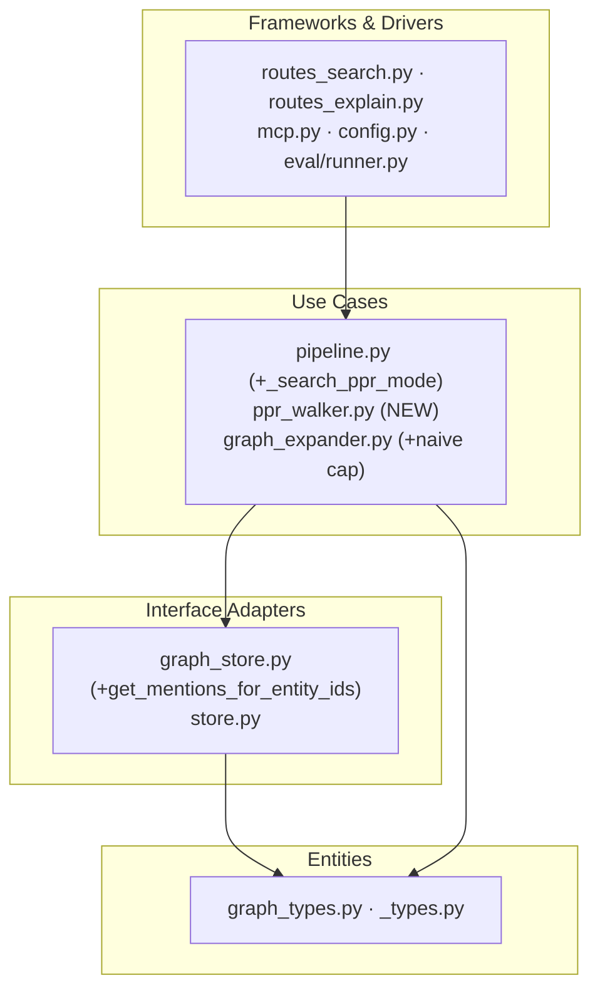
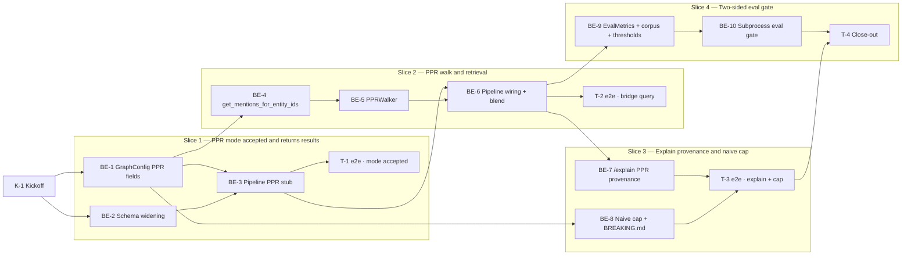

# E2h — PPR Retrieval Mode

## How to read this file

**Architecture:** Clean Architecture. Layers (dependencies point inward):
`Frameworks & Drivers → Interface Adapters → Use Cases → Entities`

- **Frameworks & Drivers:** `archon_search/server/` (FastAPI routes, MCP), `archon_search/cli/`, `archon_search/config.py`, `archon_search/eval/runner.py`
- **Interface Adapters:** `archon_search/graph_store.py`, `archon_search/store.py`, `archon_search/reranker.py`, `archon_search/embedder.py`
- **Use Cases:** `archon_search/pipeline.py`, `archon_search/ppr_walker.py` (new), `archon_search/graph_expander.py`
- **Entities:** `archon_search/graph_types.py`, `archon_search/_types.py`

**Slicing:** `vertical-slicer` skill applied. Phases are outcome-named vertical slices; the first is the walking skeleton.

**Contracts:** TypeSpec v1.13.0. Internal seams compiled as `.tsp` beside this plan; HTTP/API seam compiled as TypeSpec HTTP service and emitted to `.openapi.yaml`.

**Frontend:** No web UI or frontend role exists. User-facing surfaces are REST API and MCP only. Frontend role is **N/A**.

---

## Background

`archon-search` has three existing graph search modes: `naive` (first-degree neighbour expansion), `local` (community-based retrieval), and `global` (community representative retrieval). None walks the graph from the query's own concepts outward. Users with multi-hop questions — "which services call the authentication module?" or "what concepts link Kubernetes to our deployment pipeline?" — get either unfocused expansions or pre-built cluster results that may miss the specific bridge.

## Goal

Add `graph_mode: "ppr"` to `/search`, `/explain`, and MCP `search` tool. It seeds a Personalized PageRank walk from entities matched in the query, retrieves the top-K best-connected entity chunks, blends them with hybrid search via prepend-then-rerank, and surfaces `ppr_entities_matched` in both the search response and `/explain`. Success is the E2h two-sided eval gate: bridge multi-hop recall improves; HotpotQA simple-query recall does not regress.

## Scope

**In scope:**
- `graph_mode: "ppr"` on `/search`, `/explain`, and MCP `search` tool
- Entity seeding via n-gram match against graph node names; personalization vector weighted by per-entity mention occurrence count (number of `GraphMention` rows for that entity, including duplicates — raw row count from `get_mentions_for_entity_ids`)
- PPR walk over all edge types: co-occurrence, `synonym_of` (E2f), and typed def/ref edges (`calls`, `imports`, `defines`, `inherits`) from E2g, using `networkx.pagerank(G, personalization=…, alpha=ppr_damping)` (undirected graph for maximum recall across all edge types)
- Top-K entity chunks blended into hybrid results via **prepend-then-rerank** (same pattern as `local` mode; no third RRF stream)
- `ppr_entities_matched: int | None` in both `SearchResponse` and `ExplainResponse` (`None` = PPR not used, `0` = PPR ran but no entity match, `N` = N entities seeded)
- Config keys: `[graph] ppr_damping = 0.85`, `[graph] ppr_top_entities = 20`, `[graph] naive_max_expansion_terms = 20`
- Naive mode expansion cap (bundled defect fix; documented in `BREAKING.md`)
- Two-sided eval gate: two new independent rows — `graph_ppr_bridge_recall_at_5` (bridge multi-hop corpus) and `graph_ppr_negative_control_recall_at_5` (PPR-mode HotpotQA corpus); PPR-specific, not merged into the existing naive-mode `graph_negative_control_recall_at_5` bucket

**Out of scope:**
- Per-request overrides for `ppr_damping` or `ppr_top_entities`
- LLM-based entity extraction (E2i)
- Uniform PPR without entity seeding
- New graph tables or `STORE_SCHEMA_VERSION` bump
- Multi-collection `/search` with `graph_mode: "ppr"` — `/search` supports `collections: [...]` fanout but has no `graph_mode + multi-collection` guard (unlike `/explain` which returns 422 via S11). PPR runs per-collection across the fanout silently in v1; explicit guard or scenario deferred to a follow-up.

## Acceptance criteria

1. `POST /search` with `graph_mode: "ppr"` returns 200 with `ppr_entities_matched` populated; bridge-query results include at least one chunk that is entity-linked via PPR walk but does NOT appear in plain hybrid results (verifies PPR changed retrieval, not just seeding).
2. `POST /search` with `graph_mode: "ppr"` when `[graph] enabled = false` returns 422.
3. `POST /search` with both `graph_mode: "ppr"` and `scope_filter` returns 422.
4. When no entities match the query, response is valid hybrid search with `ppr_entities_matched: 0`.
5. `POST /explain` with `graph_mode: "ppr"` returns `graph_mode_applied: "ppr"`, `ppr_entities_matched`, and per-chunk `graph_provenance` with PPR-scored entity steps.
6. MCP `search` tool accepts `graph_mode: "ppr"` and returns `ppr_entities_matched`. MCP `search_with_context` rejects it.
7. Config keys `ppr_damping`, `ppr_top_entities`, `naive_max_expansion_terms` load from TOML and apply to the PPR walk and naive cap respectively.
8. Naive mode: query that previously returned 50 expanded terms now returns at most `naive_max_expansion_terms` terms.
9. `graph_ppr_bridge_recall_at_5 ≥ floor` on the bridge eval corpus (multihop-musique / multihop-2wiki PPR queries). **Verified locally only** — CI runs `uv sync --dev` without `--extra graph`, so the test skips on CI (importorskip guard). The developer verifies this before merging.
10. `graph_ppr_negative_control_recall_at_5 ≥ floor` on PPR-mode HotpotQA queries — a separate PPR-specific floor, independent of the existing `graph_negative_control_recall_at_5` naive-mode bucket. **Verified locally only** (same reason as AC#9).
11. `BREAKING.md` documents the naive mode cap change under `[next release]`.

## What does NOT change

- Graph tables schema — PPR reads existing `nodes`, `edges`, `mentions` tables; no `STORE_SCHEMA_VERSION` bump.
- Existing `naive`, `local`, `global` graph modes — unmodified except the naive cap fix.
- `search_with_context` MCP tool — permanently rejects any `graph_mode` (pre-existing design decision).
- `scope_filter` + `graph_mode` mutual exclusion guard — pre-existing, PPR inherits it.
- Auth, ACL, telemetry — no changes.

## Known limitations / trade-offs

- **O(N) graph load per query:** `get_all_nodes` + `get_all_edges` are full-table scans required to build the networkx graph on every PPR request. This is the dominant per-query cost. The `get_mentions_for_entity_ids` call (C4) is a targeted post-walk lookup on ≤`ppr_top_entities` entities and is not the bottleneck. Note: `pagerank_builder.py` uses the same full-scan approach but runs in a debounced background loop — this is categorically different from the per-request path. Per-entity indexed node lookup can replace the full scan in a follow-up.
- **Undirected PPR — directed call-graph queries**: Using an undirected networkx graph loses the directional semantics of `calls`/`imports`/`defines`/`inherits` edges from E2g. The motivating query "which services call the authentication module?" cannot be answered directionally by undirected PPR — both the caller and callee are equally weighted. This is a correctness limitation for directed traversal queries, not just a precision tuning knob. Directed PPR can be revisited in a follow-up; v1 prioritises recall across all edge types including bidirectional `synonym_of` and `co_occurrence`.
- **No third-stream RRF:** PPR chunks are prepended to hybrid results, not fused via a separate RRF stream. This matches the `local`/`global` pattern and avoids a new combiner.
- **Concurrent PPR request concurrency**: Each PPR `/search` request performs two full-table scans (`get_all_nodes`, `get_all_edges`) and a networkx graph build in `asyncio.to_thread`. Under high concurrent load, N simultaneous PPR walks each occupy a thread-pool slot and hold memory proportional to graph size. A per-request networkx graph build has higher concurrency amplification than the background `pagerank_builder` pattern (which runs once per collection per maintenance cycle). No concurrency cap is implemented in v1. A shared per-collection in-memory graph cache can be added as a follow-up if latency or memory becomes a concern.
- **`search_many` PPR non-amortized**: Each query in a `search_many` batch triggers its own `get_all_nodes`+`get_all_edges`+networkx build. M queries against the same collection rebuild the identical graph M times. A future optimization can pre-build the graph once per collection per batch. V1 does not address this.

---

## Approach & architecture

| CA Layer | What changes |
|---|---|
| Entities | No change — `GraphNode`, `GraphEdge`, `GraphMention` used as-is |
| Use Cases | `pipeline.py`: new `_search_ppr_mode` + dispatch; `ppr_walker.py` (new module); `graph_expander.py`: naive cap |
| Interface Adapters | `graph_store.py`: new `get_mentions_for_entity_ids` method |
| Frameworks & Drivers | `routes_search.py`, `routes_explain.py`: Literal widening + new fields; `mcp.py`: `_VALID_GRAPH_MODES`; `config.py`: 3 new `GraphConfig` fields; `eval/runner.py` + `eval/types.py`: PPR eval metrics |

**Role mapping:** All layers are backend. Frontend: N/A (no web UI; REST + MCP are the only delivery surfaces).

**Key decisions:**
- PPR walk lives in a new `ppr_walker.py` (Use Cases) — distinct from the background `pagerank_builder.py` (full-corpus, periodic). PPR is query-time and per-request.
- networkx imported lazily inside `ppr_walker.py`; `networkx.pagerank()` run in `asyncio.to_thread` (networkx is already used by `pagerank_builder.py` under the `[graph]` extra). Note: `pagerank_builder.py:60` uses `nx.DiGraph()` (directed); PPR uses `nx.Graph()` (undirected). **BE-5 should extract a shared `build_nx_graph_from_tables(nodes, edges, *, directed: bool) -> nx.Graph` helper** to avoid duplicating the node/edge assembly logic, parameterized by graph directionality.
- `get_mentions_for_entity_ids` is a new `GraphStore` method (Interface Adapters) — targeted lookup vs. the full-scan `get_all_mentions`.
- Entity→chunk resolution: PPR resolves top-K entities to chunks via their `GraphMention` rows, not via community representatives (which don't exist for a single entity). For each entity in rank order: collect all distinct `chunk_id` values from mention rows, deduplicate across entities, prepend to hybrid results. This differs from `local`/`global` which use MMR-selected community representative chunks.
- **`graph_mode` Literal site checklist** — adding `"ppr"` is a shotgun-surgery edit. BE-2/BE-6 must update ALL of these sites: `routes_search.py:48`, `routes_explain.py:255/322/340`, `pipeline.py:115/1542/1991`, `server/mcp.py:_VALID_GRAPH_MODES` (a list, not a Literal — search tool at `:123/:332`, explain tool at `:828`). Run `grep -rn 'Literal\["naive"' archon_search/` as the completeness check.
- **Joint field semantics on PPR response**: when `graph_mode="ppr"` fires with entity matches, `graph_expansion_applied=True` and `ppr_entities_matched=N`. Note: `expansion_used` is a derived field at the route layer computed as `hyde_applied or rag_fusion_applied or graph_expansion_applied` (`routes_search.py:256`) — so if PPR sets `graph_expansion_applied=True`, `expansion_used` will also be `True`. On no-match fallback (`ppr_entities_matched=0`), `graph_expansion_applied` should follow the same convention as `local` mode (False on no-match). Tests must assert `graph_expansion_applied` directly, not rely on `expansion_used` as the PPR signal.

---

## Contracts / seams

### C1 — PPR HTTP API (HTTP/API seam) `#backend-role`

Delta to `SearchRequest` / `SearchResponse` / `ExplainRequest` / `ExplainResponse`:
- `SearchRequest.graph_mode`: `Literal["naive","local","global"]` → adds `"ppr"`.
- `SearchResponse.ppr_entities_matched`: new `int | None = None`.
- `ExplainRequest.graph_mode`: same Literal widening.
- `ExplainResponse.graph_mode_applied`: Literal widening + `ppr_entities_matched: int | None = None`.

TypeSpec: [`api-contracts/e2h-ppr-http-api.tsp`](api-contracts/e2h-ppr-http-api.tsp) · OpenAPI: [`api-contracts/e2h-ppr-http-api.openapi.yaml`](api-contracts/e2h-ppr-http-api.openapi.yaml) ⚠️ The .openapi.yaml is currently an empty stub — the TypeSpec compile step (`npx tsp compile`) must be run as part of BE-2 to emit the actual schema.

**Realised by:** BE-2 · **Verified by:** T-1, T-2, T-3

---

### C2 — GraphConfig PPR additions (internal logical seam) `#backend-role`

Three new fields on `archon_search/config.py:GraphConfig`:
- `ppr_damping: float = 0.85`
- `ppr_top_entities: int = 20`
- `naive_max_expansion_terms: int = 20`

TypeSpec: [`e2h-graphconfig-ppr.tsp`](e2h-graphconfig-ppr.tsp)

**Realised by:** BE-1 · **Verified by:** BE-1 (unit), BE-6 (integration)

---

### C3 — PPRWalker interface (internal logical seam) `#backend-role`

Contract between `pipeline.py` and `ppr_walker.py`:
- Input: `collection`, `query`, `damping`, `topEntities`, `collectionNs`
- Output: `PPRWalkResult { entityIds, chunkIds, entitiesMatched }`
- `entitiesMatched = 0` → silent fallback; caller uses hybrid results.
- Must run in `asyncio.to_thread`.
- Dependencies: `GraphStore` (constructor-injected as concrete `GraphStore`; mirrors `GraphExpander.__init__(graph_store: "GraphStore")` at `graph_expander.py:144`). **Resolved at K-1:** use concrete `GraphStore` — same as `GraphExpander`. `GraphStoreProtocol` (`graph_store_protocol.py`) exists but only exposes `get_all_nodes`, `vector_search_nodes`, `write_graph`, `find_nodes_by_name` — it lacks `get_all_edges` (C5) and the new `get_mentions_for_entity_ids` (C4). Extending the protocol would touch E2f consumers with no benefit in v1; concrete injection is the correct choice.
- Zero-vector guard: if no matched entities have any mention rows, the personalization vector would be all-zero — `networkx.pagerank` falls back to uniform distribution over all nodes. In this case the walk proceeds but `entitiesMatched` is set to `0` and the result is treated as a silent fallback (caller uses hybrid results only).

TypeSpec: [`e2h-ppr-walker.tsp`](e2h-ppr-walker.tsp) (extend existing C3 TypeSpec to document the graph-load steps from C5)

**Realised by:** BE-5 · **Verified by:** BE-5 (unit), BE-6 (integration), T-2 (e2e)

---

### C4 — `GraphStore.get_mentions_for_entity_ids` (internal logical seam) `#backend-role`

New method on `archon_search/graph_store.py:GraphStore`:
- Signature: `async def get_mentions_for_entity_ids(self, collection: str, entity_ids: list[str], ns: str) -> list[GraphMention]`
- Empty `entity_ids` → returns `[]` immediately.
- Callers aggregate by `entity_id` to derive mention counts for PPR personalization.
- Row count (including duplicates) for each `entity_id` is used as its mention-occurrence weight in the personalization vector. Callers must not deduplicate before counting.

TypeSpec: [`e2h-graphstore-mentions.tsp`](e2h-graphstore-mentions.tsp)

**Realised by:** BE-4 · **Verified by:** BE-4 (unit + integration), BE-5 (integration)

---

### C5 — PPRWalker graph-load seam (internal logical seam) `#backend-role`

PPRWalker must call `get_all_nodes` and `get_all_edges` (both existing `GraphStore` methods) to load the full node and edge set for the collection before running the networkx walk. These two calls are the O(N) cost per query — not the mentions lookup (C4). The walk then maps vertex scores back to entity IDs, selects top-K entities by PPR score, and resolves each to chunk IDs via their mention rows (from C4). Entity-to-chunk policy: for each of the top-K entities, retrieve all mention rows (via `get_mentions_for_entity_ids`) and collect their distinct `chunk_id` values in order of entity PPR rank. Chunk ID list is deduplicated across entities and passed back as `chunkIds` in `PPRWalkResult`.

TypeSpec: included in `e2h-ppr-walker.tsp` (extend existing C3 TypeSpec to document these load steps)

**Realised by:** BE-5 · **Verified by:** BE-5 (unit), BE-6 (integration)

---

## Scenarios `#tester-role`

| ID | Given | When | Then | Level |
|---|---|---|---|---|
| S1 | Graph built; entity K8s linked via synonym + co-occurrence to Kubernetes; both have chunk associations | `POST /search` `graph_mode: "ppr"` query "kubernetes deployment" | 200; result includes at least one chunk linked via K8s synonym/co-occurrence edge that would NOT appear in plain hybrid search; `ppr_entities_matched ≥ 1` | integration |
| S2 | Same graph | `POST /explain` `graph_mode: "ppr"` same query | `graph_mode_applied: "ppr"`, `ppr_entities_matched ≥ 1`, `graph_provenance` on entity-matched chunks contains entity names and PPR scores | integration |
| S3 | Graph built; no entities match "zxqfoo blargh" | `POST /search` `graph_mode: "ppr"` | 200; results identical to hybrid; `ppr_entities_matched: 0` | integration |
| S4 | Nodes table exists but is empty (no ingest yet) | `POST /search` `graph_mode: "ppr"` | 200; hybrid fallback; `ppr_entities_matched: 0` | integration |
| S5 | `[graph] enabled = false` in config | `POST /search` `graph_mode: "ppr"` | 422 "graph_mode requires [graph] enabled=true in server config" | integration |
| S6 | `[graph] enabled = true` | `POST /search` `graph_mode: "ppr"` + `scope_filter: "user:alice"` | 422 "scope_filter is not supported with graph_mode" | integration |
| S7 | MCP connected; graph built | MCP `search` tool `graph_mode: "ppr"` | Valid response with `ppr_entities_matched` field | integration |
| S8 | MCP connected | MCP `search_with_context` `graph_mode: "ppr"` | MCP error `code="graph_mode_not_supported"` | integration |
| S9 | Entity with 50 first-degree neighbours; `naive_max_expansion_terms = 20` | `POST /search` `graph_mode: "naive"` | Expanded query appends at most 20 entity names | integration |
| S10 | `[graph] ppr_top_entities = 3` in TOML | `POST /search` `graph_mode: "ppr"` with entity-rich graph | Only 3 entities' chunk IDs retrieved by PPR | integration |
| S11 | `/explain` multi-collection request | `POST /explain` with `collections: ["a","b"]` + `graph_mode: "ppr"` | 422 "graph_mode is not supported with multi-collection fanout" | integration |
| S12 | Eval corpus with multihop-musique/multihop-2wiki PPR queries | Eval suite runs `graph_ppr_bridge_recall_at_5` | `graph_ppr_bridge_recall_at_5 ≥ floor` (improves on no-graph baseline) | subprocess eval |
| S13 | Eval corpus with HotpotQA PPR-mode queries | Eval suite runs `graph_ppr_negative_control_recall_at_5` | `graph_ppr_negative_control_recall_at_5 ≥ floor` (PPR-specific floor, separate from naive-mode bucket) | subprocess eval |
| S14 | PPR mode; CPU-bound networkx walk | `/search` requests with `graph_mode: "ppr"` | networkx `pagerank()` is offloaded via `asyncio.to_thread`; the event loop is not blocked during the walk | integration |

---

## Frontend `#frontend-role`

**N/A** — archon-search has no web UI, TUI, or frontend layer. The CLI (`archon_search/cli/`) has no search command and does not expose `graph_mode`. All E2h changes are confined to the REST and MCP server surfaces.

---

## Backend `#backend-role`

**Scope:** All CA layers — Entities (read-only), Use Cases, Interface Adapters, Frameworks & Drivers.

**Layers owned:** Use Cases · Interface Adapters · Frameworks & Drivers

**Task IDs by layer:**

| Layer | Tasks |
|---|---|
| Frameworks & Drivers | BE-1 (config), BE-2 (server schemas), BE-9 (eval harness), BE-10 (eval runner) |
| Interface Adapters | BE-4 (GraphStore method) |
| Use Cases | BE-3 (pipeline stub), BE-5 (PPRWalker), BE-6 (pipeline wiring), BE-7 (explain provenance), BE-8 (naive cap) |

**Done when:**
- [ ] `graph_mode: "ppr"` accepted by REST and MCP schemas; all guard paths return correct 422s
- [ ] PPRWalker runs `networkx.pagerank()` in `asyncio.to_thread`; top-K entity chunks retrieved and blended via prepend-then-rerank
- [ ] `/explain` returns `graph_mode_applied: "ppr"`, `ppr_entities_matched`, and `graph_provenance` with PPR scores
- [ ] Naive mode expansion capped at `naive_max_expansion_terms`; `BREAKING.md` updated
- [ ] All 3 new `GraphConfig` fields load correctly from TOML; config error on invalid `ppr_damping`
- [ ] `graph_ppr_bridge_recall_at_5` eval gate passes; `graph_negative_control_recall_at_5 ≥ 0.34` still passes (0.34 = current threshold from `tests/eval/thresholds.toml`; verify against the file at implementation time)

---

## Tester `#tester-role`

**Ownership note:** Unit + integration tests are written by the backend dev inside each BE task. The tester owns e2e (integration harness end-to-end) and manual tests only.

**Test harness:** `pytest` with `@pytest.mark.integration` + `@pytest.mark.xdist_group` for integration tests; subprocess eval gate via `uv run pytest` child process (`@pytest.mark.integration @pytest.mark.xdist_group("benchmark")`). No web UI to test manually.

| Scenario | Cheapest level | Owner |
|---|---|---|
| S1 — PPR retrieves bridge chunks | integration e2e | T-2 |
| S2 — /explain PPR provenance | integration e2e | T-3 |
| S3 — silent fallback, no entity match | integration (BE-3) | T-1 |
| S4 — empty graph fallback | integration (BE-6) | T-2 |
| S5 — 422 graph disabled | integration (BE-3) | T-1 |
| S6 — 422 scope_filter conflict | integration (BE-3) | T-1 |
| S7 — MCP PPR search | integration (BE-6) | T-2 |
| S8 — MCP search_with_context rejects | integration e2e | T-3 |
| S9 — naive cap applied | integration (BE-8) | T-3 |
| S10 — config ppr_top_entities applied | integration (BE-6) | T-2 |
| S11 — /explain multi-collection 422 | integration e2e | T-3 |
| S12 — PPR bridge eval gate | subprocess eval | BE-10 |
| S13 — negative control unchanged | subprocess eval | BE-10 |
| S14 — networkx pagerank in asyncio.to_thread | integration (BE-5) | BE-5 |

---

## Documentation update

- [ ] `Documentation/Backlog/e2h-ppr-retrieval-mode-brief.md` — source brief; no changes needed
- [ ] `Documentation/Backlog/e2h-ppr-retrieval-mode-team-plan.md` — this file
- [ ] `BREAKING.md` — add naive mode cap change under `[next release]` section
- [ ] `archon-search.toml.example` — add `ppr_damping = 0.85`, `ppr_top_entities = 20`, `naive_max_expansion_terms = 20` under `[graph]` with comments
- [ ] `CLAUDE.md` graph subsystem bullet — add `graph_mode: "ppr"` to the list of supported modes; add `ppr_damping`/`ppr_top_entities`/`naive_max_expansion_terms` to `GraphConfig` description
- [ ] `Documentation/Architecture/600_api_reference_or_public_interface.md` — add `"ppr"` to graph_mode values table; document `ppr_entities_matched` in SearchResponse and ExplainResponse field tables
- [ ] `Documentation/Architecture/110_component_catalog_and_layer_breakdown.md` — add `ppr_walker.py` to Use Cases layer; add `get_mentions_for_entity_ids` to GraphStore symbol list
- [ ] `Documentation/Architecture/530_technical_debt_refactoring_roadmap.md` — add AND close the naive mode expansion cap defect item (no such item currently exists in 530; T-4 must add it first, then mark it resolved)
- [ ] `tests/eval/README.md` — document PPR eval queries, corpus, and two-sided gate semantics
- [ ] `Documentation/Architecture/100_system_architecture_overview.md` — brief mention of PPR as fourth graph mode

---

## Open questions

**Resolved in this revision:**

- **Q1 — RRF blending mechanism:** Resolved → **prepend-then-rerank** (same as `local` mode). Code confirms `local` prepends community candidates + appends non-duplicate hybrid candidates + single reranker pass. No third-stream RRF combiner exists in the codebase; adding one would be disproportionate for v1.
- **Q2 — Naive cap config key:** Resolved → **separate `[graph] naive_max_expansion_terms: int = 20`**. Decoupled from `ppr_top_entities` (different concepts); explicit naming mirrors `max_global_candidates`/`community_summary_chunks` conventions.
- **Q3 — `ppr_entities_matched` placement:** Resolved → **both `SearchResponse` and `ExplainResponse`** as `int | None = None`. Callers see the count without hitting `/explain`; field is `None` (not `0`) when PPR was not the active mode.
- **Q4 — Eval gate threshold:** Resolved → **two new independent rows**: `graph_ppr_bridge_recall_at_5` (bridge multi-hop) and `graph_ppr_negative_control_recall_at_5` (PPR-mode HotpotQA). PPR queries feed their own PPR-specific negative-control floor — not merged into the existing `graph_negative_control_recall_at_5` naive-mode bucket. This means a PPR regression on simple queries is caught specifically, not masked by the combined metric.
- **Q5 — PPRWalker dependency injection:** Resolved at K-1 → **concrete `GraphStore`** (same pattern as `GraphExpander`). `GraphStoreProtocol` lacks `get_all_edges` and `get_mentions_for_entity_ids`; extending it would add protocol surface that touches E2f consumers with no testability benefit in v1. BE-5 injects concrete `GraphStore` directly.

**Remaining open questions:** None. `status: planned`.

---

## Task Breakdown

### Dependency graph

**Critical path:** K-1 → BE-1 → BE-4 → BE-5 → BE-6 → BE-9 → BE-10 → T-4 = **21.0h**

---

### Kickoff

- [x] **K-1** — Confirm open-question resolutions with team before implementation starts #backend-role
    - — · 1.0h
    - needs — · completes —
    - Duties
        - Confirm prepend-then-rerank blending (not third-stream RRF)
        - Confirm `naive_max_expansion_terms` as the separate naive cap key
        - Confirm `ppr_entities_matched` in both SearchResponse and ExplainResponse
        - Confirm eval gate adds two independent rows: `graph_ppr_bridge_recall_at_5` (bridge multi-hop) and `graph_ppr_negative_control_recall_at_5` (PPR-mode HotpotQA)
        - Confirm PPRWalker dependency injection resolution (concrete `GraphStore`, per Q5) with the team before BE-5 starts.
    - Tests

---

### Slice 1 — PPR mode accepted and returns results (Walking Skeleton)

*Thinnest end-to-end behavior: a developer can call `/search` with `graph_mode: "ppr"` and receive a valid 200 response with `ppr_entities_matched` populated, exercising config, schema validation, pipeline dispatch, fallback, and response assembly.*

- [x] **BE-1** — Add `ppr_damping`, `ppr_top_entities`, `naive_max_expansion_terms` to `GraphConfig` #backend-role
    - Frameworks & Drivers · 2.0h
    - needs K-1 · completes C2, S10
    - Tests
        - [x] #unit_test — `test_graphConfig_pprDamping_default` — default 0.85 loaded from bare GraphConfig()
        - [x] #unit_test — `test_graphConfig_pprTopEntities_default` — default 20 loaded
        - [x] #unit_test — `test_graphConfig_naiveMaxExpansionTerms_default` — default 20 loaded
        - [x] #unit_test — `test_graphConfig_pprDamping_outOfRange_raisesConfigError` — damping ≤ 0 or ≥ 1 raises ConfigError (validation lives in `_parse_graph` in `config.py`, following the `synonym_threshold` validation pattern at the same location)
        - [x] #unit_test — `test_graphConfig_pprTopEntities_zero_raisesConfigError` — zero/negative raises ConfigError
        - [x] #integration_test — `test_config_pprFields_loadedFromToml` — toml with [graph] ppr_damping=0.9 reaches GraphConfig.ppr_damping; run after update to tests/path_home_allowlist.txt for new dataclass fields
        - [x] #integration_test — `test_config_pprDamping_outOfRange_rejectsAtStartup` — write a TOML with [graph] ppr_damping=1.5 to tmp_path; call `load_config(serve=False)` with ARCHON_SEARCH_DATA_DIR pointed at tmp_path → raises ConfigError at config-load time, not at first PPR request. This proves the guard catches bad values before the server starts (versus the unit test which only tests the dataclass constructor in isolation).

- [x] **BE-2** — Widen `graph_mode` Literal to include `"ppr"` and add `ppr_entities_matched` to all schemas #backend-role
    - Frameworks & Drivers · 3.0h
    - needs K-1 · completes C1
    - Tests
        - [x] #unit_test — `test_searchRequest_pprMode_acceptedByPydantic` — SearchRequest(query="q", graph_mode="ppr") validates without error
        - [x] #unit_test — `test_explainRequest_pprMode_acceptedByPydantic` — ExplainRequest(query="q", graph_mode="ppr") validates
        - [x] #unit_test — `test_searchResponse_pprEntitiesMatched_field_isOptionalInt` — SearchResponse.model_fields includes ppr_entities_matched
        - [x] #unit_test — `test_explainResponse_pprEntitiesMatched_field_isOptionalInt` — ExplainResponse has ppr_entities_matched
        - [x] #unit_test — `test_mcpValidModes_includesPpr` — "ppr" in _VALID_GRAPH_MODES
        - [x] #unit_test — `test_openApiSnapshot_updated` — regen openapi snapshot: `uv run --python 3.12 pytest tests/server/test_openapi_snapshot.py --update-openapi-snapshot`
    - Duties
        - Run `npx tsp compile api-contracts/e2h-ppr-http-api.tsp` to emit the OpenAPI schema before the snapshot test.
        - [x] Update MCP `search_with_context` rejection message to include 'ppr' in the list of modes that are not supported, e.g. change '(naive, local, global)' to '(naive, local, global, ppr)'.

- [x] **BE-3** — Add `"ppr"` dispatch stub to pipeline: fallback to hybrid, propagate `ppr_entities_matched=0` #backend-role
    - Use Cases · 2.0h
    - needs BE-1, BE-2 · completes S3, S5, S6
    - Tests
        - [x] #integration_test — `test_pprMode_noEntityMatch_fallsBackToHybrid` — make_real_app(graph_enabled=True) + POST /search graph_mode="ppr" with empty-entity spaCy stub → 200, ppr_entities_matched=0
        - [x] #integration_test — `test_pprMode_graphDisabled_returns422` — make_real_app(graph_enabled=False) → 422
        - [x] #integration_test — `test_pprMode_scopeFilterConflict_returns422` — scope_filter + graph_mode="ppr" → 422
        - [x] #integration_test — `test_pprMode_searchPipelineResult_carriesPprCount` — SearchPipelineResult.ppr_entities_matched=0 propagated to SearchResponse

- [x] **T-1** — Integration e2e: PPR mode accepted; guard paths return correct errors #tester-role
    - — · 1.0h
    - needs BE-3 · completes S3, S5, S6
    - Tests
        - [x] #e2e_test — `test_e2h_t1_pprMode_returns200_pprEntitiesMatchedPresent` — POST /search graph_mode="ppr" with real graph-enabled app + empty-entity stub → 200 + ppr_entities_matched in response (0 or None)
        - [x] #e2e_test — `test_e2h_t1_pprMode_graphDisabled_returns422` — POST /search graph_mode="ppr" + graph disabled → 422 with expected code
        - [x] #e2e_test — `test_e2h_t1_pprMode_scopeFilter_returns422` — POST /search scope_filter + graph_mode="ppr" → 422 (REST surface; MCP surfaces this as `error_code="scope_filter_graph_mode_incompatible"` not a 422 — MCP test is in T-2/T-3)

---

### Slice 2 — PPR walk and retrieval

*End-to-end behavior: a bridge query returns graph-enriched results with `ppr_entities_matched > 0` and entity-linked chunks in the top results.*

- [x] **BE-4** — Add `get_mentions_for_entity_ids` to `GraphStore` #backend-role
    - Interface Adapters · 2.0h
    - needs BE-1 · completes C4
    - Tests
        - [x] #unit_test — `test_getMentionsForEntityIds_returnsOnlyRequestedEntities` — mock table; two entity IDs; only matching rows returned
        - [x] #unit_test — `test_getMentionsForEntityIds_emptyInput_returnsEmpty` — [] in → [] out; no table query fired
        - [x] #unit_test — `test_getMentionsForEntityIds_unknownEntityId_returnsEmpty` — entity_id not in table → []
        - [x] #integration_test — `test_getMentionsForEntityIds_realStore_roundTrip` — ensure_graph_tables + write mentions + get_mentions_for_entity_ids → correct rows returned

- [ ] **BE-5** — Implement `PPRWalker` in new `archon_search/ppr_walker.py` #backend-role
    - Use Cases · 4.0h
    - needs BE-4 · completes C3, C5
    - Duties
        - Load full node and edge set via `GraphStore.get_all_nodes` and `GraphStore.get_all_edges` before running the walk.
        - Build `nx.Graph` with edge weights from loaded edges.
        - Run `networkx.pagerank(G, personalization=..., alpha=damping)` with personalization vector derived from mention row counts.
        - Map PPR scores back to entity IDs; select top-K entities by PPR score.
        - Resolve top-K entities to chunk IDs via `get_mentions_for_entity_ids`; deduplicate across entities in entity PPR rank order.
        - Return `PPRWalkResult`.
    - Tests
        - #unit_test — `test_pprWalker_seedsFromQueryNgrams_matchedEntityReturned` — query "kubernetes deployment" with entity "kubernetes" (exact 1-gram) in store → entitiesMatched=1; also covers bigram: entity "machine learning" found from query "machine learning inference" via 2-gram "machine learning". **Note:** `find_nodes_by_name` uses EXACT case-insensitive `lower(entity_name) IN (...)` — n-gram seeding works because the walker tokenizes the query into n-grams and passes each as an exact name to look up. A token that is not an exact entity name (e.g. "inference") returns nothing.
        - #unit_test — `test_pprWalker_substringQuery_doesNotMatchExactEntity` — query "kubernetesish" (superstring of entity "kubernetes") → entitiesMatched=0. Verifies the exact-match contract: `find_nodes_by_name` is not a substring or LIKE search.
        - #unit_test — `test_pprWalker_ngramDedup_duplicateTokensLookedUpOnce` — query with repeated word ("go go lang") → dedup n-grams before calling `find_nodes_by_name` (assert it is called once per distinct n-gram, not once per occurrence)
        - #unit_test — `test_pprWalker_personalizationWeightedByRawMentionRowCount` — entity A with 3 mention rows (even if same chunk) vs entity B with 1 → A has weight 3, B has weight 1 in the reset vector
        - #unit_test — `test_pprWalker_mentionCountFlipsEntityOrdering` — two entities: A(3 mention rows) connected to chunk-A, B(1 mention row) connected to chunk-B; use a **symmetric graph topology** (A and B have identical neighbour structure — e.g., both connected to the same hub node with equal-weight edges — so the ONLY asymmetry is the personalization weight). Assert chunk-A appears before chunk-B in chunkIds. Then flip counts (B→3, A→1) and assert ordering flips. **This is the critical output test** — the symmetric topology is required so the flip is caused by mention-count weight alone, not by graph structure; a non-symmetric graph could pass with a uniform-weight implementation via topology bias.
        - #unit_test — `test_pprWalker_noEntityMatch_returnsEmptyResult` — query matches no node names → PPRWalkResult(entityIds=[], chunkIds=[], entitiesMatched=0)
        - #unit_test — `test_pprWalker_topKRespectsPprTopEntities` — graph with 10 entities; ppr_top_entities=3 → len(chunkIds) covers at most 3 entities
        - #unit_test — `test_pprWalker_networkxRunsInToThread` — verify asyncio.to_thread is called (mock to_thread, assert called once)
        - #unit_test — `test_pprWalker_personalizationVectorSumsToOne` — reset vector passed to networkx.pagerank sums to 1.0 within float tolerance
        - #unit_test — `test_pprWalker_zeroMentionEntities_fallsBackGracefully` — entity seeded but has zero mention rows → PPRWalkResult(entityIds=[], chunkIds=[], entitiesMatched=0)
        - #integration_test — `test_pprWalker_realGraph_returnsTopKEntityChunks` — seed graph via GraphStore.write_graph + write_mentions + PPRWalker.walk → chunkIds non-empty, entitiesMatched > 0

- [ ] **BE-6** — Wire `PPRWalker` into `pipeline._search_graph_mode`; blend chunks prepend-then-rerank; propagate count #backend-role
    - Use Cases · 3.0h
    - needs BE-3, BE-5 · completes S1, S4, S7, S10
    - **Dispatch note:** The early-return routing tuple at `pipeline.py:977` (`if graph_mode in ("local", "global"):`) must be extended to include `"ppr"` so PPR dispatches through `_search_graph_mode` and returns a `SearchPipelineResult`. This site is separate from the `Literal` widening in BE-2 — both must be updated.
    - Tests
        - #integration_test — `test_pprMode_blendedResults_entityChunkInTopK` — make_real_app + seed graph with K8s synonyms + ingest + search → entity-linked chunk in results, ppr_entities_matched > 0
        - #integration_test — `test_pprMode_emptyNodeTable_fallsBackToHybrid` — empty nodes table → 200, ppr_entities_matched=0
        - #integration_test — `test_pprMode_pprTopEntities_config_applied` — ppr_top_entities=2 in TOML → at most 2 distinct entity IDs in PPRWalkResult
        - #integration_test — `test_pprMode_mcpSearch_pprEntitiesMatchedInResponse` — mcp_tool_call search graph_mode="ppr" → ppr_entities_matched present in response dict
        - #integration_test — `test_searchMany_pprMode_dispatchCorrect` — search_many with graph_mode="ppr" routes to PPR branch (not naive/local/global)
        - #integration_test — `test_pprMode_chunkOrdering_pprChunksPrependedBeforeHybrid` — make_real_app + seed graph with entity chunk that hybrid alone would rank low; POST /search graph_mode="ppr" → entity-linked chunk appears at a higher position than it would in plain hybrid baseline (verifies prepend semantics, not just presence)

- [ ] **T-2** — Integration e2e: PPR walk retrieves bridge docs #tester-role
    - — · 2.0h
    - needs BE-6 · completes S1, S4
    - Tests
        - #e2e_test — `test_e2h_t2_pprMode_bridgeQuery_entityChunkInResults` — ingest two docs; seed graph with shared entity + co-occurrence edge; query bridges them; ppr_entities_matched > 0; entity-linked doc appears in top results AND that doc does not appear in plain hybrid baseline results (verifies PPR changed output)
        - #e2e_test — `test_e2h_t2_pprMode_emptyGraph_hybrid_fallback` — graph tables exist but empty; POST /search graph_mode="ppr" → 200, ppr_entities_matched=0, results non-empty (from hybrid)

---

### Slice 3 — Explain provenance and naive cap

*End-to-end behavior: `/explain` with `graph_mode: "ppr"` returns `graph_mode_applied: "ppr"`, `ppr_entities_matched`, and per-chunk `graph_provenance` with PPR-scored entity steps. Naive expansion is bounded.*

- [ ] **BE-7** — Add PPR provenance to `/explain`: `ExplainPipelineResult` fields + `graph_provenance` steps #backend-role
    - Use Cases · 3.0h
    - needs BE-6 · completes S2
    - Tests
        - #unit_test — `test_explainPipelineResult_pprLiteral_acceptsPpr` — ExplainPipelineResult(graph_mode_applied="ppr") validates without error
        - #unit_test — `test_explainPipelineResult_pprEntitiesMatched_field_present` — dataclass has ppr_entities_matched: int | None = None
        - #unit_test — `test_explainResponse_fromPipelineResult_pprFieldsPopulated` — ExplainResponse.from_pipeline_result() with ppr count → response has ppr_entities_matched
        - #integration_test — `test_explainEndpoint_pprMode_returnsGraphModeApplied` — POST /explain graph_mode="ppr" → graph_mode_applied="ppr", ppr_entities_matched >= 0, graph_provenance present on entity-matched chunks

- [ ] **BE-8** — Add naive expansion cap in `graph_expander.py`; update `BREAKING.md` #backend-role
    - Use Cases · 2.0h
    - needs BE-1 · completes S9
    - Duties
        - Cap the assembled neighbour-name list inside `GraphExpander.expand()` BEFORE the `build_expanded_text(...)` call. Store the limit as `self._naive_max_expansion_terms` in `__init__` so `expand()` can apply it. This means at most `naive_max_expansion_terms` candidate names enter `build_expanded_text`; the final expanded count may be lower after dedup inside that function.
        - BE-8 also threads `GraphConfig.naive_max_expansion_terms` into `GraphExpander.__init__` — this is an unlisted but required signature change. `pipeline.py` constructs `GraphExpander` and must pass the config value.
    - Tests
        - #unit_test — `test_naiveCap_50Neighbours_cappedAtLimit` — GraphExpander stub with 50 **distinct** neighbour names (none appearing in the query, so dedup cannot reduce the count); naive_max_expansion_terms=20 → assert **exactly 20** names in expanded text (not merely ≤20), proving the cap — not dedup — is the binding constraint
        - #unit_test — `test_naiveCap_fewNeighbours_allReturned` — 5 neighbours; cap=20 → all 5 appended
        - #unit_test — `test_naiveCap_graphExpander_acceptsConfig_inConstructor` — `GraphExpander(graph_store, naive_max_expansion_terms=5)` stores the limit
        - #integration_test — `test_naiveCap_endToEnd_expandedQueryBounded` — make_real_app + high-degree entity seeded in graph + POST /search graph_mode="naive" → expansion_used=True, expanded query bounded to ≤ naive_max_expansion_terms terms

- [ ] **T-3** — Integration e2e: explain provenance, MCP rejection, naive cap, multi-collection guard #tester-role
    - — · 1.0h
    - needs BE-7, BE-8 · completes S2, S8, S9, S11
    - Tests
        - #e2e_test — `test_e2h_t3_explainPprMode_provenanceAndCount` — POST /explain graph_mode="ppr"; assert graph_mode_applied="ppr", ppr_entities_matched in [0, N], graph_provenance structure valid
        - #e2e_test — `test_e2h_t3_mcpSearchWithContext_rejectsPprMode` — mcp_tool_call search_with_context graph_mode="ppr" → error code in response AND error message includes 'ppr' in the mode list (e.g. '(naive, local, global, ppr)')
        - #e2e_test — `test_e2h_t3_naiveCap_highDegreeEntity_expansionBounded` — ingest + seed high-degree entity + POST /search graph_mode="naive" → response has expansion_used=True; request does not time out from unbounded expansion
        - #e2e_test — `test_e2h_t3_explainMultiCollection_graphMode_returns422` — POST /explain collections=["a","b"] graph_mode="ppr" → 422

---

### Slice 4 — Two-sided eval gate

*End-to-end behavior: the eval suite proves PPR improves bridge multi-hop recall AND does not regress simple-query recall.*

- [ ] **BE-9** — Add `graph_ppr_bridge_recall_at_5` to `EvalMetrics`; add PPR eval queries and labels; set thresholds #backend-role
    - Frameworks & Drivers · 4.0h
    - needs BE-6 · completes S12, S13
    - Duties
        - All BE-9 integration tests that exercise PPR must be guarded with `pytest.importorskip('networkx')` at the module level of the test file. **CI enforcement status: these gates are local-developer-only (not CI-enforced).** Both CI workflows (`archon-search-pr.yml:31`, `archon-search-release.yml:43`) run `uv sync --dev` without `--extra graph`, so networkx is not installed and `importorskip` will skip these tests on every CI leg. This matches the existing convention: `test_e2e_graph_eval_gate_v2.py` does the same for leidenalg. Consequence: AC#9 and AC#10 are verified by the developer before merging, not by CI. If CI enforcement is desired, add `--extra graph` to the eval leg of both CI workflows (a follow-up, not part of E2h scope).
        - The integration tests `test_pprEvalGate_nonVacuous_pprOutperformsNoGraph` and `test_pprNegativeControlGate_nonVacuous` must construct a **dedicated PPR-capable eval pipeline** — do NOT use the default `_build_pipeline_with_eval_backends` (at `runner.py:601`), which wires only naive expansion and explicitly does not wire DefRef/PPR features (see comment at `runner.py:666`). Instead, create a `_build_ppr_eval_pipeline(tmp_path)` builder (analogous to `_build_code_lane_pipeline` at `runner.py:709+`) that injects a real `GraphStore` and `PPRWalker` into the search pipeline. If this builder is absent, the floor calibrates on a plain-hybrid path that never exercises PPR — the test passes vacuously.
        - Add a config-lint assertion: `assert graph_ppr_bridge_recall_at_5_floor > no_graph_baseline_recall` and `assert graph_ppr_negative_control_floor > 0.0`, mirroring the pattern at `test_e2e_graph_eval_gate_v2.py:314,438`. Without this, a floor set equal to the hybrid fallback baseline is decorative.
    - Tests
        - #unit_test — `test_evalMetrics_graphPprBridgeRecall_isOptionalFloat` — EvalMetrics has graph_ppr_bridge_recall_at_5: float | None = None
        - #unit_test — `test_evalMetrics_graphPprNegativeControl_isOptionalFloat` — EvalMetrics has graph_ppr_negative_control_recall_at_5: float | None = None
        - #unit_test — `test_evalQualityFloors_pprBridgeField_present` — EvalQualityFloors has graph_ppr_bridge_recall_at_5
        - #unit_test — `test_evalQualityFloors_pprNegativeControlField_present` — EvalQualityFloors has graph_ppr_negative_control_recall_at_5
        - #unit_test — `test_pprQueryFixture_bridgeQueriesPresentInQueriesJsonl` — queries.jsonl contains at least one graph_mode="ppr" entry in multihop-musique or multihop-2wiki
        - #unit_test — `test_pprQueryFixture_negativeControlQueriesPresentInQueriesJsonl` — queries.jsonl contains at least one graph_mode="ppr" entry in hotpotqa collection
        - #integration_test — `test_pprEvalGate_nonVacuous_pprOutperformsNoGraph` — using `_build_ppr_eval_pipeline(tmp_path)` (dedicated builder with real PPRWalker/GraphStore); real PPR pipeline vs no-graph pipeline on bridge corpus; assert ppr_recall **>** non_graph_recall (strict inequality); isolate one bridge doc that is lexically absent from the query and verify it appears in PPR results but NOT in plain hybrid; guard with `pytest.importorskip("networkx")` — local-dev only, skips in CI (see duties)
        - #integration_test — `test_pprNegativeControlGate_nonVacuous_independentFromNaiveBucket` — using `_build_ppr_eval_pipeline(tmp_path)`; PPR-mode HotpotQA recall computed separately from naive-mode queries; assert `ppr_negative_control_recall != naive_negative_control_recall` (independent buckets); guard with `pytest.importorskip("networkx")`
        - #unit_test — `test_pprEvalConfigLint_floorAboveHybridBaseline` — assert `graph_ppr_bridge_recall_at_5` floor value in thresholds.toml > 0.0 AND > the no-graph hybrid baseline; assert `graph_ppr_negative_control_recall_at_5` floor > 0.0; mirrors config-lint pattern at `test_e2e_graph_eval_gate_v2.py:314,438`

- [ ] **BE-10** — Subprocess eval gate: bridge + negative control #backend-role
    - Frameworks & Drivers · 3.0h
    - needs BE-9 · completes S12, S13
    - Tests
        - #integration_test — `test_e2h_pprBridgeRecall_subprocessGate` — `@pytest.mark.integration @pytest.mark.xdist_group("benchmark")` subprocess pytest of PPR bridge eval test; asserts `graph_ppr_bridge_recall_at_5 ≥ floor`, returncode=0, "passed" in output
        - #integration_test — `test_e2h_pprNegativeControl_subprocessGate` — subprocess pytest of PPR-specific negative-control eval test; asserts `graph_ppr_negative_control_recall_at_5 ≥ floor`; independent of the existing naive-mode `graph_negative_control_recall_at_5` bucket (that test is not re-run here)

---

### Close-out

- [ ] **T-4** — Close-out: documentation, warnings, full suite, acceptance fact-check #tester-role
    - — · 2.0h
    - needs BE-10, T-3 · completes —
    - Duties
        - Update all documentation per the Documentation update section: BREAKING.md naive cap entry; archon-search.toml.example new [graph] fields; CLAUDE.md graph subsystem bullet (add "ppr" + PPR config keys); 600_api_reference (ppr in graph_mode table, ppr_entities_matched in SearchResponse/ExplainResponse); 110_component_catalog (ppr_walker.py + get_mentions_for_entity_ids); 530_debt_roadmap (close naive cap item); tests/eval/README.md (PPR queries + two-sided gate); 100_architecture_overview (mention PPR as fourth graph mode)
        - Fix all compiler/lint warnings introduced by E2h
        - Run `uv run pytest` (full suite, foreground, `-n 4`, after `pgrep -fl pytest` returns nothing); fix every failing test, even tests unrelated to E2h
        - Validate each acceptance criterion one-by-one with a fact check — no assumptions, verify everything is genuinely done
    - Tests
