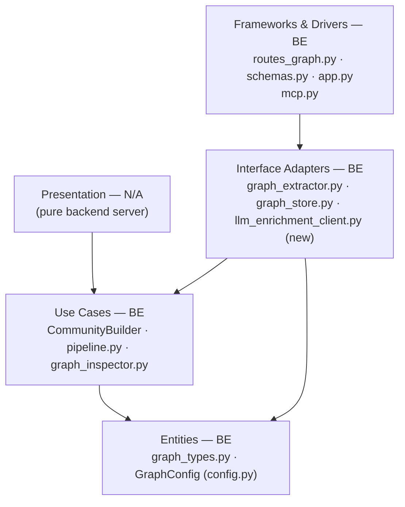
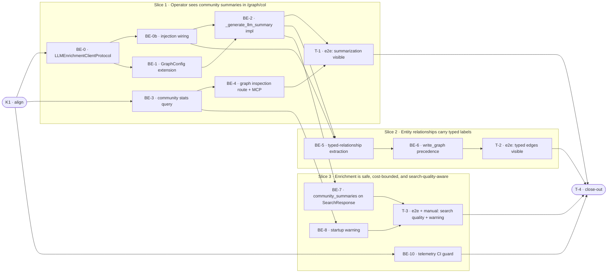

# E2i · LLM Graph Enrichment — Team Plan

**How to read this file**
- **Architecture approach:** Clean Architecture — the default; no override requested. **Layers:** Entities · Use Cases · Interface Adapters · Frameworks & Drivers. (Presentation = N/A — this is a pure backend server.) Each task's first sub-bullet names the layer it touches.
- The **Frontend, Backend, and Tester** sections are the **depth view** — each role's work, grouped by layer.
- The **Task Breakdown** is the **order view** — every task is a single-role checkbox in execution order, opening with a dependency graph.
- **Phases are vertical slices**: each delivers a working end-to-end increment. No separate "integrate" phase. Sliced with the **`vertical-slicer` skill**.
- Each task carries the **role tag at the end of its title line**, then sub-bullets: **layer · estimate** (decimal hours), **needs · completes**, and a **Tests** block. **needs** = predecessor tasks; **completes** = the scenario `S#` it makes true or the contract `C#` it realises.
- **Tests:** unit and integration tests belong to the implementing dev (test-first); e2e and manual tests are the tester's tasks. The close-out task writes no tests.
- **Contracts:** TypeSpec is available. Internal logical seams are authored as core-construct `.tsp` files beside this plan (validated with `tsp compile --no-emit`). The HTTP/API seam additionally emits `openapi.yaml`.
- **Role tags** (`#backend-role`, `#tester-role`) mark each task and each role-owned section. `#frontend-role` is N/A.
- IDs (`S#`, `C#`, `BE-#`/`T-#`/`K#`, `Q#`) are the traceability thread.
- **Rule:** edit your own tasks freely; change a contract only by team agreement.

---

## Background

Today's graph is built from statistical co-occurrence only. Community records carry a `summary_text` column that is always `null` (the `_generate_llm_summary()` method raises `NotImplementedError`). Relationship edges are all typed `related_to` — the `GraphExtractor` logs a WARNING when `extraction_model` is set but produces no LLM-typed edges. `local` and `global` search modes use only `representative_chunk_ids`; no search path reads `summary_text`. The `GET /graph/{col}` endpoint has no visibility into community summarization state.

---

## Goal

When an operator sets `extraction_model = "anthropic:claude-haiku-4-5-20251001"` in `[graph]`:
1. Every community rebuild writes a real LLM summary to `summary_text` — visible in `GET /graph/{col}` and used by `local`/`global` search modes.
2. Entity pairs in ingested chunks receive typed relationship labels (`uses`, `implements`, `depends_on`) with `extraction_method = "llm"`, improving PPR and traversal precision.
3. Operators see `communities_summarized`, `communities_total`, and `unsummarized_community_ids` in the graph inspection response so they know enrichment is working.
4. Default behaviour (no `extraction_model` set) is byte-identical to pre-E2i — no token cost, no API dependency.

---

## Scope

### In Scope
- Fill `_generate_llm_summary()` stub in `community_builder.py` — lazy Anthropic client, token bucket, asyncio timeout, silent fallback (WARNING + `summary_text = null`)
- Typed-relationship extraction in `graph_extractor.py` — batched LLM prompt per chunk; `uses` / `implements` / `depends_on` edges with `extraction_method = "llm"`
- `GraphConfig` extension: `extraction_timeout_seconds`, `extraction_rate_limit_rpm`, `max_communities_to_summarize`, `extraction_token_budget`
- `write_graph()` precedence rule: `"extracted" > "llm" > "inferred"` in `graph_store.py` — the pre-read guard at line 454 must fire when edges with `extraction_method in {"inferred", "llm"}` are present; precedence between `"extracted"` and `"llm"` is enforced on `(source_entity_id, target_entity_id)` pairs regardless of `relationship_type` (not on edge ID, which embeds `relationship_type` in its hash)
- `local` and `global` search modes populate a new `community_summaries: dict[str, str]` field on `SearchResponse` (not `SearchResult`) from community rows collected before chunk deduplication in `_search_graph_mode`; field is an empty dict when absent or when `extraction_model` is unset (`pipeline.py` + `schemas.py`)
- `GET /graph/{col}` + MCP `get_graph` tool: add `communities_total`, `communities_summarized`, `unsummarized_community_ids` (capped at 100)
- Enrichment WARNING logged once per collection (lazy cold-start — on the first `GET /graph/{col}` / MCP `get_graph` call for that collection, not at server startup) when `extraction_model` is set but communities are unsummarized; fired state cached in `app.state` so the WARNING appears at most once per collection per process lifetime
- Deterministic LLM stub for the entire test suite — no live API dependency
- Telemetry CI guard: static test banning `chunk_texts`, `summary_text`, `prompt` from raw log args in `community_builder.py` AND `graph_extractor.py`

### Out of Scope
- `summary_refresh` membership-change detection — deferred; see Q4 and Known Limitations
- Ollama / local model support — config format `"provider:model"` is forward-compatible; implementation deferred to G10
- Dashboard UI for summary health — data is exposed via `GET /graph/{col}`; UI is a separate frontend concern
- Multi-pass gleaning / prompt auto-tuning (MS GraphRAG-style)
- Schema/ontology-constrained extraction
- Query-time LLM traversal (DRIFT-style)
- Typed extraction for E2j — typed extraction is included here (1A decision)

---

## Acceptance criteria
- `GET /graph/{col}` reports `communities_summarized > 0` after a community rebuild triggered by `MaintenanceLoop` (i.e., via the running server) when `extraction_model` is configured; CLI `build-communities` runs without an LLM client and produces no summaries (this is expected and documented)
- `global` search returns a response whose `community_summaries` dict contains at least one entry when communities have `summary_text`
- `local` search returns a response whose `community_summaries` dict is populated when query entities match a community with `summary_text`
- At least one ingested chunk produces a typed edge (`uses` / `implements` / `depends_on`) with `extraction_method = "llm"` when `extraction_model` is set
- When `extraction_model` is unset: zero calls to the Anthropic client, all edges stay `related_to`, `summary_text` stays `null` — behaviour byte-identical to E2h
- Any LLM failure (timeout, quota, key missing, API error) logs a WARNING and does not fail the ingest or community rebuild
- Server starts normally regardless of LLM availability
- An enrichment WARNING is logged once per collection (on the first graph inspection call for that collection, not at server startup) when `extraction_model` is set and communities are unsummarized; no I/O runs at server startup
- `unsummarized_community_ids` is capped at 100 entries; `communities_total` and `communities_summarized` are always exact
- A statically-verified CI guard confirms no community text or LLM prompt appears in raw log arguments in `community_builder.py` or `graph_extractor.py`
- All tests pass with the deterministic LLM stub — no live API dependency — and the full eval gate passes with existing thresholds

---

## What does NOT change
- Default path when `extraction_model` is unset — byte-identical to E2h
- `_generate_llm_summary()` fallback wiring — `build()` already catches all exceptions and sets `summary_text = None`; this catch behaviour is unchanged. Note: E2i DOES change the signature: drops the `community_id` parameter (not needed by the LLM client), adds `entity_names: list[str]` (required by Q2), and widens the return type from `str` to `str | None`. The call site at `community_builder.py:485` must be updated to match.
- `RelationshipType` enum values — `uses`, `implements`, `depends_on` already exist in `graph_types.py` (lines 50–68)
- `Community.summary_text: str | None = None` schema column — already exists in the communities LanceDB table; no migration needed
- `GraphEdge.extraction_method` field — already exists from E2g; E2i only adds the `"llm"` value
- `"extracted"` always wins over `"inferred"` — E2i extends this rule to also cover `"llm"` but does not change the existing guard
- The maintenance loop community-rebuild trigger wiring — `_rebuild_communities_async()` already calls `CommunityBuilder.build()`; E2i's LLM summarization fires automatically once the stub is filled
- `entity_ids_hash` column — E2i does NOT add this to the communities table; Q4 (summary_refresh) is deferred and the column is not written

---

## Known limitations / accepted trade-offs
- Anthropic-only provider for now — the `"provider:model"` string is stored but not routed; all calls go to `anthropic.AsyncAnthropic()`. Ollama routing lands with G10.
- Community summarization fires on every full rebuild (Leiden re-run + summarize all). There is no membership-change detection in E2i — the `write_communities()` path does a full `delete("1=1") + add()` on every build, and Leiden `community_id` values are not stable across re-runs, making it impossible to join a prior summary to a rebuilt community without stable IDs or a community-fingerprint persistence layer. `summary_refresh` is deferred to a future ticket.
- LLM-typed edges are written at ingest time via `graph_extractor.py`; they may be overwritten on re-ingest. The `"extracted" > "llm"` precedence rule prevents downgrading statically-verified edges.
- `max_communities_to_summarize` cap is a simple per-pass slice; there is no resumption state — skipped communities are retried next rebuild.
- MCP `get_graph` tool (lines 1955–1961 in `mcp.py`) must be manually updated to include the three new fields; they are not propagated automatically.
- `app.state.llm_enrichment_client` is `None` when `extraction_model` is unset, so all `None`-defaulted construction paths (CLI `build-communities`, eval runner) do not incur LLM calls regardless of any ambient config.
- The `make_stable_edge_id` helper in `graph_types.py` hashes `relationship_type` as part of the edge ID. This means an `"extracted"` edge typed `related_to` and an `"llm"` edge typed `uses` for the same entity pair receive **different** IDs. The BE-6 precedence rule must therefore operate on `(source_entity_id, target_entity_id)` pairs, not on edge ID collision.
- Construction order: `SearchPipeline` (which creates `GraphExtractor`) must be constructed in the lifespan, not in `create_app`, for the shared-client injection to be temporally possible. If any startup path currently depends on `SearchPipeline` existing before lifespan, that dependency must be removed as part of BE-0b.
- CLI `build-communities` command passes `llm_client=None` — running `archon-search graph build-communities` with `extraction_model` set will NOT produce LLM summaries or typed edges. Community enrichment runs through `MaintenanceLoop` inside the server process. Operators who want enrichment must run the server (not just the CLI build command) and let maintenance rebuild trigger. Future work: add a CLI warning when `extraction_model` is set but `llm_client` is None.

---

## Approach & architecture

E2i extends the existing graph pipeline at three integration points: `CommunityBuilder.build()` (community summarization), `GraphExtractor.extract()` (typed-relationship extraction), and the graph inspection route (reporting). All changes are additive and gated on `extraction_model is not None`. The LLM adapter follows the `hyde.py` / `rag_fusion.py` pattern exactly (lazy import, in-process token bucket, `asyncio.wait_for`, silent fallback).

`AnthropicEnrichmentClient` is instantiated once in the FastAPI lifespan (not in `create_app`). `MaintenanceLoop` receives it as a constructor parameter. `SearchPipeline` (and the `GraphExtractor` it creates) also receives it as a constructor parameter. Both paths share the same instance, ensuring a single in-process token bucket. CLI and eval construction paths always receive `llm_client=None`. Without this single-instance guarantee, each class instantiating its own client would result in 2× the configured `extraction_rate_limit_rpm`.

Note: the new `community_summaries` field on `SearchResponse` (LLM-generated text, a `dict[str, str]` keyed by community_id) is distinct from the existing `community_summary_chunks` config knob (which governs MMR representative-chunk selection and is unchanged by E2i).

**Layer map (and role mapping)**

| Layer | Role | Components touched by E2i |
|-------|------|--------------------------|
| Presentation | **Frontend** | N/A — no web UI; CLI presentation unchanged |
| Entities | Backend | `graph_types.py` (no changes — types already exist) · `config.py` `GraphConfig` (new fields) |
| Use Cases | Backend | `community_builder.py` `_generate_llm_summary()` (depends on `LLMEnrichmentClientProtocol`, not concrete client) · `pipeline.py` `_search_local_mode` / `_search_graph_mode("global")` · `graph_inspector.py` `CollectionGraphView` / `inspect_collection()` · `graph_enrichment_protocol.py` (new — `LLMEnrichmentClientProtocol`; consumer-owned protocol, following `graph_store_protocol.py` precedent) |
| Interface Adapters | Backend | `graph_extractor.py` (LLM typed-edge extraction; depends on `LLMEnrichmentClientProtocol`) · `graph_store.py` (precedence rule + community stats query) · `llm_enrichment_client.py` (new — `AnthropicEnrichmentClient` concrete adapter) |
| Frameworks & Drivers | Backend | `server/routes_graph.py` `_view_to_response()` · `server/schemas.py` `GraphInspectionResponse` · `server/routes_search.py` `SearchResponse` + mapping step · `server/app.py` lifespan (client instantiation + injection) · `server/mcp.py` `get_graph` |

**What changes**
- `config.py` `GraphConfig`: add `extraction_timeout_seconds`, `extraction_rate_limit_rpm`, `max_communities_to_summarize`, `extraction_token_budget`; extend `_load_graph_config()` with `_coerce_float` / `_coerce_bounded_int` blocks
- `archon_search/graph_enrichment_protocol.py` (new, Use Cases layer — consumer-owned protocol, following `graph_store_protocol.py` precedent): defines `LLMEnrichmentClientProtocol` with `summarize_community(chunk_texts, entity_names) -> str | None` and `label_relationships(entity_pairs, chunk_text) -> list[LabeledRelationship]`; defines `LabeledRelationship` dataclass
- `llm_enrichment_client.py` (new, Interface Adapters): `AnthropicEnrichmentClient` implementing `LLMEnrichmentClientProtocol`; lazy-import Anthropic client, in-process token bucket, `asyncio.wait_for`, WARNING + fallback. The adapter raises on failure; callers catch and substitute `None` / empty list.
- `community_builder.py` `__init__` signature: add `llm_client: LLMEnrichmentClientProtocol | None = None` parameter (BE-0b); fill `_generate_llm_summary(chunk_texts: list[str], entity_names: list[str]) -> str | None` stub; change signature from `-> str` to `-> str | None`; receive `LLMEnrichmentClientProtocol` via constructor injection
- `graph_extractor.py` `__init__` signature: add `llm_client: LLMEnrichmentClientProtocol | None = None` parameter (BE-0b); fill LLM stub at lines 182–193; batched LLM call per chunk; produce `RelationshipType.uses/implements/depends_on` edges with `extraction_method = "llm"`; receive `LLMEnrichmentClientProtocol` via constructor injection
- `graph_store.py`: add community stats query helper; extend `write_graph()` pre-read guard to trigger when `any(e.extraction_method in {"inferred", "llm"} for e in edges)` (not just `"inferred"`); implement precedence on `(source_entity_id, target_entity_id)` pair lookup, not edge ID
- `graph_inspector.py`: add `communities_total`, `communities_summarized`, `unsummarized_community_ids` to `CollectionGraphView`; extend `inspect_collection()`
- `server/schemas.py`: add three new fields to `GraphInspectionResponse`
- `server/routes_search.py`: add `community_summaries: dict[str, str] = {}` to `SearchResponse` (note: NOT `schemas.py`); map `SearchPipelineResult.community_summaries` into `SearchResponse` at both construction sites (~lines 252 and ~348)
- `server/routes_graph.py`: map new `CollectionGraphView` fields in `_view_to_response()`; emit enrichment WARNING (once per collection per process lifetime via `app.state._enrichment_warnings_fired: set[str]`) when stats show unsummarized communities and `extraction_model` is set
- `server/mcp.py`: add community summary fields to `get_graph` return dict; same once-per-collection WARNING
- `server/app.py` lifespan: instantiate `AnthropicEnrichmentClient` once when `extraction_model is not None`; store in `app.state.llm_enrichment_client`; pass to `GraphExtractor` at construction (line ~520); pass to `CommunityBuilder` in `MaintenanceLoop` (maintenance_loop.py:586)
- Construction-site rewiring (BE-0b): `maintenance_loop.py:586` (`CommunityBuilder`), `cli/graph_cmd.py:71` (`CommunityBuilder`, pass `llm_client=None`), `eval/runner.py:1130` (`CommunityBuilder`, pass `llm_client=None`), `app.py:520` (`GraphExtractor`, pass `app.state.llm_enrichment_client`), `pipeline.py:3511` (`GraphExtractor`) (`create_pipeline()` always passes `llm_client=None` — this is the CLI/eval factory path; the server builds its extractor through the lifespan-wired `SearchPipeline`, not via `create_pipeline`).

**Key decisions (from the brief)**
- Both capabilities (summarization + typed extraction) in one ticket — they share an LLM client, config section, and test harness
- Anthropic-only now, `"provider:model"` config format for future G10 routing
- Silent fallback on all failure paths — no ingest or rebuild ever fails due to LLM issues
- Dashboard data now, dashboard UI later — `GET /graph/{col}` exposes `unsummarized_community_ids`
- Single shared LLM client instance injected via constructor — single token bucket governs combined throughput from both `CommunityBuilder` and `GraphExtractor`

---

## Contracts / seams

Boundaries where roles must agree. TypeSpec is active. Internal logical seams are core-construct `.tsp` (no OpenAPI). The HTTP/API seam emits `openapi.yaml`.

**C1 — LLM Enrichment Client** *(Use Cases ↔ Interface Adapters)*
The code seam is `LLMEnrichmentClientProtocol` in `archon_search/graph_enrichment_protocol.py` (Use Cases layer — consumer-owned protocol, following the `graph_store_protocol.py` precedent). It defines two methods: `summarize_community(chunk_texts, entity_names) -> str | None` and `label_relationships(entity_pairs, chunk_text) -> list[LabeledRelationship]`. The concrete adapter (`AnthropicEnrichmentClient`) raises on any failure; callers (`CommunityBuilder._generate_llm_summary()` and `GraphExtractor.extract()`) catch all exceptions and substitute `None` / empty list. The TypeSpec `string | void` in [`e2i-llm-enrichment-client.tsp`](e2i-llm-enrichment-client.tsp) models the post-catch value, not the adapter's native behaviour. `_generate_llm_summary()` signature: `async def _generate_llm_summary(self, chunk_texts: list[str], entity_names: list[str]) -> str | None`. C1 is completed by K1 + BE-0.
- Realised by: BE-0, BE-0b, BE-2, BE-5 · Verified by: BE-0 (protocol definition), BE-0b (injection wiring), BE-2 (unit tests), BE-5 (unit tests)

**C2 — Graph Inspection HTTP Extension** *(REST clients ↔ server `GET /graph/{collection}`)*
Adds `communitiesTotal: int32`, `communitiesSummarized: int32`, `unsummarizedCommunityIds: string[]` (capped at 100) to the graph inspection response. Existing fields are unchanged. See [`api-contracts/e2i-graph-inspection-api.tsp`](api-contracts/e2i-graph-inspection-api.tsp) and [`api-contracts/e2i-graph-inspection-api.openapi.yaml`](api-contracts/e2i-graph-inspection-api.openapi.yaml).
- Realised by: BE-3, BE-4 · Verified by: BE-4 (integration test), T-1 (e2e)

---

## Scenarios #tester-role

Behavioural only. Covers happy, unhappy, edge, and non-functional paths.

| id | Scenario (Given / When / Then) |
|----|-------------------------------|
| **S1** | **Given** `extraction_model = "anthropic:claude-haiku-4-5-20251001"` is set and `ANTHROPIC_API_KEY` is present · **When** `CommunityBuilder.build()` runs · **Then** `_generate_llm_summary()` returns text; `Community.summary_text` is set; `write_communities()` persists it. Note: S1 tests the `CommunityBuilder.build()` path as called by `MaintenanceLoop`. The CLI `archon-search graph build-communities` command passes `llm_client=None` and does not enrich — this is intentional; see Known Limitations. |
| **S2** | **Given** communities have non-null `summary_text` · **When** `GET /graph/{col}` is called · **Then** response includes `communities_summarized = K`, `communities_total = N`, `unsummarized_community_ids = []` |
| **S3** | **Given** communities are built with `summary_text` set; `graph_mode = "global"` · **When** a search query runs · **Then** the `SearchResponse.community_summaries` dict contains at least one entry mapping community_id → summary text; the dict is populated from community rows collected before chunk deduplication |
| **S4** | **Given** communities are built with `summary_text` set; `graph_mode = "local"`; query entities match a community · **When** a search query runs · **Then** `SearchResponse.community_summaries` contains the matched community's summary text keyed by community_id |
| **S5** | **Given** `extraction_model` is set; LLM is unavailable (key missing / quota exceeded / timeout / network error / package absent) · **When** `_generate_llm_summary()` is called · **Then** WARNING is logged; `summary_text = null`; community is still persisted; no ingest or rebuild fails |
| **S6** | **Given** `extraction_model` is set; LLM typed-edge extraction runs during `GraphExtractor.extract()` · **When** entity pairs are extracted from a chunk · **Then** edges with `relationship_type ∈ {uses, implements, depends_on}` and `extraction_method = "llm"` are written to the edge table |
| **S7** | **Given** `extraction_model` is set; LLM extraction fails during `GraphExtractor.extract()` · **When** any exception occurs in the typed-edge path · **Then** WARNING logged; edges fall back to `related_to` with `extraction_method` unset (the spaCy/co-occurrence default; BE-5 must verify what the current path sets and document it); ingest continues |
| **S8** | **Given** an `"extracted"` edge exists for a `(source, target)` entity pair · **When** LLM extraction writes an edge for the **same entity pair** (regardless of `relationship_type`) with `extraction_method = "llm"` via `write_graph()` · **Then** the `"extracted"` edge is preserved; no duplicate `"llm"` edge with a different type is created |
| **S9** | **Given** `extraction_model` is unset · **When** any ingest, community build, or search runs · **Then** `_generate_llm_summary()` is never called; no Anthropic client is instantiated; all edges stay `related_to`; `summary_text = null`; behaviour byte-identical to E2h |
| **S11** | **Given** a collection has 500 communities with `summary_text = null` · **When** `GET /graph/{col}` is called · **Then** `unsummarized_community_ids` contains exactly 100 IDs; `communities_total` and `communities_summarized` are exact |
| **S12** | **Given** `extraction_model` is set; a collection has communities with `summary_text = null` · **When** `GET /graph/{col}` or MCP `get_graph` is first called for that collection · **Then** a WARNING is logged naming the collection and count of unsummarized communities; subsequent calls for the same collection do not repeat the WARNING |
| **S13** | **Given** `extraction_model` is unset, or all communities are already summarized · **When** `GET /graph/{col}` is called · **Then** no enrichment WARNING is logged |
| **S14** | **Given** E2i adds summarization and typed-extraction logic · **When** the default test suite runs with a deterministic LLM stub · **Then** no live API call is made; existing eval thresholds in `thresholds.toml` are not regressed. Note: S14 proves no retrieval regression. It does not validate that typed edges or community summaries improve retrieval quality — this improvement is accepted as unmeasured in E2i and deferred to a future eval metric task. |
| **S15** | **Given** community texts and LLM prompts are produced during enrichment · **When** any telemetry entry is written · **Then** `chunk_texts`, `summary_text`, and prompt strings are absent from raw log arguments in `community_builder.py` AND `graph_extractor.py` (CI guard verifies statically) |

---

## Frontend — Presentation #frontend-role

N/A — no frontend work for this feature. `archon-search` is a pure backend server with no web UI. The graph inspection data is exposed via `GET /graph/{col}`; any future dashboard is a separate frontend concern explicitly out of scope for E2i. No CLI presentation changes are needed — graph inspection is REST/MCP only.

---

## Backend — Entities · Use Cases · Interface Adapters · Frameworks & Drivers #backend-role

**Scope:** Implements LLM protocol definition, LLM client adapter, LLM summarization, typed-relationship extraction, config extension, graph inspection response extension, startup warning, and telemetry CI guard. Writes unit and integration tests for all tasks.
**Owns layers:** Entities, Use Cases, Interface Adapters, Frameworks & Drivers.

**Tasks by layer** *(checkable in the Task Breakdown)*
- Entities: BE-1 (GraphConfig extension)
- Interface Adapters: BE-0 (`LLMEnrichmentClientProtocol` definition + `AnthropicEnrichmentClient`)
- Interface Adapters / Frameworks & Drivers: BE-0b (constructor injection wiring for `CommunityBuilder` and `GraphExtractor` + all construction sites)
- Use Cases: BE-2 (`_generate_llm_summary()` implementation), BE-7 (`community_summaries` on `SearchPipelineResult` + `SearchResponse`)
- Interface Adapters: BE-3 (community stats query in `graph_store.py`), BE-4 (graph inspection route + MCP), BE-5 (typed-relationship extraction), BE-6 (`write_graph()` precedence)
- Frameworks & Drivers: BE-8 (startup warning), BE-10 (telemetry CI guard)

**Done when**
- [ ] Communities have non-null `summary_text` after a `MaintenanceLoop`-triggered rebuild when `extraction_model` is set — S1
- [ ] `GET /graph/{col}` reports `communities_summarized`, `communities_total`, `unsummarized_community_ids` — S2
- [ ] `global` and `local` search populate `SearchResponse.community_summaries` when `summary_text` is present — S3, S4
- [ ] All LLM failure paths log WARNING and continue — S5, S7
- [ ] `extraction_model` unset = zero API calls, byte-identical to E2h — S9
- [ ] Typed edges (`uses` / `implements` / `depends_on`) with `extraction_method = "llm"` appear in the edge table — S6
- [ ] `"extracted"` always wins over `"llm"` in `write_graph()` on same entity pair — S8
- [ ] Enrichment WARNING fires once per collection on first graph inspection call when configured but incomplete — S12
- [ ] Telemetry CI guard passes for both `community_builder.py` and `graph_extractor.py` — S15

---

## Tester #tester-role

**Scope:** Tester owns **e2e and manual** tests plus the project **close-out**. Unit and integration tests belong to the backend dev in each implementation task's `Tests` block.

**Tasks** *(checkable in the Task Breakdown)*
- T-1 (Slice 1): e2e — community summarization visible in graph inspection
- T-2 (Slice 2): e2e — typed edges visible in graph inspection
- T-3 (Slice 3): e2e — search quality + startup warning; manual — live LLM enrichment
- T-4 (Close-out): documentation, full suite, acceptance fact-check

**Allocation** — each scenario at the cheapest level that proves it

| Scenario | Cheapest level | Notes |
|----------|----------------|-------|
| S1 — community summarization succeeds | integration | Patch `_generate_llm_summary` via `monkeypatch.setattr`; assert `Community.summary_text` set |
| S2 — GET /graph/{col} reports stats | integration | Assert JSON fields after stub build; also covered by T-1 e2e |
| S3 — global search returns community_summaries dict | integration | Patch summarizer stub; assert `SearchResponse.community_summaries` is non-empty |
| S4 — local search returns community_summaries dict | integration | Same patch; query matching a community; assert `community_summaries` populated |
| S5 — LLM unavailable, silent fallback | integration | Patch stub to raise `Exception`; assert WARNING logged, summary_text=null |
| S6 — typed edges created | integration | Patch LLM typed-edge call to return fixed labels; assert edge table |
| S7 — typed-edge fallback on LLM error | integration | Patch to raise; assert fallback to `related_to` with `extraction_method` unset |
| S8 — "extracted" wins over "llm" on same entity pair | unit | Pure in-process: pre-existing "extracted" edge + incoming "llm" edge for same (source, target) pair → "extracted" survives, no duplicate "llm" edge with different type created |
| S9 — extraction_model unset = no change | integration | Default config; assert zero Anthropic calls (blocker fixture already enforces this) |
| S11 — unsummarized_community_ids capped at 100 | unit | Inject 200 null-summary communities; assert len ≤ 100 |
| S12 — enrichment WARNING on first inspection call | integration | Set extraction_model; assert WARNING in captured logs on first `GET /graph/{col}`; assert second call does not re-log |
| S13 — no warning when unset or all summarized | integration | Default config; assert no enrichment warning on `GET /graph/{col}` |
| S14 — eval gate passes | eval | `uv run pytest tests/eval/` — existing thresholds; no new fixtures for E2i eval metrics |
| S15 — telemetry CI guard | unit (static) | Static text analysis of `community_builder.py` AND `graph_extractor.py`; no infrastructure |

---

## Documentation update

Docs the feature touches — the close-out task works through this list.

- [ ] `Documentation/Backlog/e2i-llm-graph-enrichment-brief.md` — no changes needed (source brief)
- [ ] `Documentation/Backlog/e2i-llm-graph-enrichment-team-plan.md` — this file
- [ ] `CLAUDE.md` — update `GraphConfig` entry: add new E2i fields (`extraction_timeout_seconds`, `extraction_rate_limit_rpm`, `max_communities_to_summarize`, `extraction_token_budget`); update `community_builder.py` note to reflect implemented stub and `LLMEnrichmentClientProtocol` injection; add `extraction_method = "llm"` to extraction_method producing values list; update `write_graph()` precedence description; add `graph_enrichment_protocol.py` and `llm_enrichment_client.py` to Interface Adapters component list; add `community_summaries` to `SearchResponse` schema description
- [ ] `archon-search.toml.example` — document new `[graph]` config fields with defaults and comments
- [ ] `Documentation/Architecture/100_system_architecture_overview.md` — add LLM enrichment step to graph pipeline diagram
- [ ] `Documentation/Architecture/110_component_catalog_and_layer_breakdown.md` — add `graph_enrichment_protocol.py` and `llm_enrichment_client.py` to Interface Adapters; update `CommunityBuilder` and `GraphExtractor` entries to show protocol injection
- [ ] `Documentation/Architecture/600_api_reference_or_public_interface.md` — update `GET /graph/{collection}` response schema with three new fields; update `POST /search` response schema with `community_summaries: dict[str, str]` on `SearchResponse`; note `extraction_model` config field activates enrichment
- [ ] `Documentation/Architecture/130_data_architecture_and_persistence.md` — note that `summary_text` is now populated when `extraction_model` is set (schema unchanged, behaviour changed)
- [ ] `Documentation/roadmap.md` — mark E2i complete once shipped

---

## Open questions

No open questions — all resolved. Status: `planned`.

**Resolved in this revision:**

| id | Area | Decision |
|----|------|----------|
| **Q1** | Config | `extraction_token_budget` = per-community `max_tokens` in the API call. Simpler to implement and reason about; `max_communities_to_summarize` already caps total pass cost. |
| **Q2** | Prompt design | Pass entity names alongside `chunk_texts`. `nodes_by_id` is already in memory during `build()` — zero extra I/O. Entity names anchor the summary to the right concepts. |
| **Q3** | Typed-edge extraction | Batched per chunk (all pairs in one prompt). One-pair-at-a-time is economically unviable at any realistic corpus scale. Cap pairs per batch at top-N by co-occurrence; use structured JSON response format. |
| **Q4** | summary_refresh | DEFERRED — `write_communities()` does a full `delete("1=1") + add()` on every community rebuild, and Leiden `community_id` values are not stable across re-runs. There is no way to join a prior summary to a rebuilt community or detect membership changes via an `entity_ids_hash` column without stable IDs or a community-fingerprint persistence layer. `summary_refresh` is deferred to a future ticket. E2i does NOT add `entity_ids_hash` to the communities table. |
| **Q5** | Search integration | `community_summaries: dict[str, str]` as a **field on `SearchResponse`** (response-envelope level, not per `SearchResult`). The existing pipeline deduplicates all community `representative_chunk_ids` into a flat pool before reranking — by the time `SearchResult` is constructed, community identity is lost. Community summaries must therefore be collected before chunk dedup in `_search_graph_mode` and attached to the response envelope. Non-breaking addition (new optional field, defaults to `{}`). |
| **Q6** | Precedence | Yes — `"llm"` wins over `null`. Full hierarchy: `extracted > llm > inferred > null`. `merge_insert().when_matched_update_all()` already overwrites `null` automatically; BE-6 needs to protect `"extracted"` against `"llm"` on the same entity pair regardless of `relationship_type` (not the other direction). Because `make_stable_edge_id` hashes `relationship_type`, edge IDs for different-typed edges on the same entity pair are distinct — precedence must be enforced by a `(source_entity_id, target_entity_id)` pre-read lookup, not edge ID. |
| **Q7** | Warning I/O | **Lazy cold-start** — no scan at server startup, not even async. The WARNING fires on the first `GET /graph/{col}` / MCP `get_graph` call for each collection (community stats are already computed there). Fired state cached in `app.state._enrichment_warnings_fired: set[str]` so the WARNING appears at most once per collection per process lifetime. |
| **Q8** | MCP | Include in MCP `get_graph` return dict (same 100-entry cap). Keeps REST and MCP surfaces symmetric; same once-per-collection WARNING logic applies. |

---

## Task Breakdown

Single-role tasks in execution order, grouped into **vertical slices**.

### Dependency graph

---

### Phase 0 · Kickoff *(prerequisite)*

- [x] **K1** — Align on contracts, scenarios, and open-question resolutions with the team #team
    - — · 0.5h
    - completes C2; C1 completed by K1 + BE-0
    - Tests

---

### Phase 1 · Operator sees community summaries in `GET /graph/{col}` *(walking skeleton)*

*Thinnest end-to-end path: set `extraction_model`, run `build-communities`, call `GET /graph/{col}`, see `communities_summarized > 0`. Carries the config + LLM client foundation.*

- [ ] **BE-0** — Define `LLMEnrichmentClientProtocol` and `AnthropicEnrichmentClient` #backend-role
    - Interface Adapters · 1.0h
    - needs K1 · completes C1
    - Description: Create `archon_search/graph_enrichment_protocol.py` defining `LLMEnrichmentClientProtocol` (Use Cases ↔ Interface Adapters boundary) with two methods: `async def summarize_community(self, chunk_texts: list[str], entity_names: list[str]) -> str | None` and `async def label_relationships(self, entity_pairs: list[tuple[str, str]], chunk_text: str) -> list[LabeledRelationship]`. Define `LabeledRelationship` dataclass. Create `archon_search/llm_enrichment_client.py` (Interface Adapters) with `AnthropicEnrichmentClient` implementing the protocol — lazy Anthropic import, in-process token bucket, `asyncio.wait_for`, raises on failure (callers catch). The concrete adapter lives in Interface Adapters, NOT inside `community_builder.py` (Use Cases).
    - Tests
        - #unit_test — `test_protocol_method_signatures` — `AnthropicEnrichmentClient` is a structural subtype of `LLMEnrichmentClientProtocol` (method names + signatures match)
        - #unit_test — `test_client_raises_on_api_error` — patched `anthropic` raises `APIError`; assert `AnthropicEnrichmentClient.summarize_community` propagates (does NOT swallow) the exception

- [ ] **BE-0b** — Wire `LLMEnrichmentClientProtocol` into `CommunityBuilder` and `GraphExtractor` constructors and all construction sites #backend-role
    - Interface Adapters / Frameworks & Drivers · 2.5h
    - needs BE-0 · completes (injection wiring for C1)
    - Description: Add `llm_client: LLMEnrichmentClientProtocol | None = None` optional parameter to `CommunityBuilder.__init__` (community_builder.py:329), `GraphExtractor.__init__` (graph_extractor.py:91), `MaintenanceLoop.__init__` (maintenance_loop.py:102), and `SearchPipeline.__init__` (pipeline.py) where `GraphExtractor` is created at runtime (pipeline.py:3511). Default `None` = no LLM enrichment.

      Injection flow:
      - `AnthropicEnrichmentClient` is instantiated once in the `app.py` lifespan (not in `create_app`) when `config.graph.extraction_model is not None`.
      - `GraphExtractor` at `app.py:520`: this construction runs inside `create_app`, before lifespan. Either (a) move it into the lifespan, or (b) store the client in `app.state` during lifespan and have `SearchPipeline`/`GraphExtractor` read it lazily on first call. **Decision: move the `SearchPipeline` construction (which includes `GraphExtractor`) into the lifespan** so the client can be passed at construction time.
      - `MaintenanceLoop` at `maintenance_loop.py` is constructed in `app.py` lifespan (or at `start()` time which is called from lifespan). Pass `llm_client=app.state.llm_enrichment_client` when constructing `MaintenanceLoop` in the lifespan. `MaintenanceLoop` then passes it through to `CommunityBuilder` when constructing it at line 586.
      - CLI (`cli/graph_cmd.py:71`) and eval runner (`eval/runner.py:1130`): pass `llm_client=None`.
      - `pipeline.py:3511`: `SearchPipeline.create_pipeline()` or `__init__` passes `llm_client` through to `GraphExtractor` construction.

      Key invariant: the `AnthropicEnrichmentClient` instance is created at most once per server process (in lifespan), ensuring a single in-process token bucket. CLI and eval always receive `llm_client=None`.

      - `app.state.pipeline = None` must be set in `create_app` before the lifespan fires, so that `readiness.py:40`'s `if pipeline is not None` guard works correctly for any code path that accesses `app.state.pipeline` between `create_app` and the lifespan completing (e.g., readiness probes during startup).

      Note: if `SearchPipeline` construction is moved from `create_app` to lifespan, re-verify that no startup path depends on `SearchPipeline` existing before lifespan fires.

      - Migration required: two existing tests in `tests/server/test_app.py` (around lines 103-108 and 129-132) read `app.state.pipeline` immediately after `create_app` without entering the lifespan. These must be migrated to use `TestClient` or `AsyncClient` with the lifespan active, or rewritten to assert on a create_app-time surrogate. Do NOT leave them broken.
    - Tests
        - #unit_test — `test_community_builder_init_accepts_llm_client` — construct `CommunityBuilder(graph_store, config, llm_client=mock_client)`, assert `self._llm_client is mock_client`
        - #unit_test — `test_graph_extractor_init_accepts_llm_client` — same for `GraphExtractor`
        - #unit_test — `test_community_builder_init_defaults_no_client` — `CommunityBuilder(graph_store, config)` constructs successfully, `self._llm_client is None`
        - #integration_test — `test_shared_client_single_instance` — assert that `app.state.llm_enrichment_client` is the same object received by `MaintenanceLoop` and by `SearchPipeline`; drive this through the real lifespan (using FastAPI's `AsyncClient` with lifespan enabled), not via constructor injection in the test body
        - #unit_test — `test_migrate_create_app_pipeline_tests` — migrate `test_create_app_passes_language_detector...` and the no-language-detector variant in `tests/server/test_app.py` (lines ~103-108, ~129-132) from asserting on `app.state.pipeline` post-`create_app` to asserting through the real lifespan (via `TestClient` or `AsyncClient` with `lifespan=True`), since `app.state.pipeline` no longer exists before the lifespan fires. Verify both tests pass with the new construction order.

- [ ] **BE-1** — Extend `GraphConfig` with LLM enrichment config fields #backend-role
    - Entities · 2.0h
    - needs BE-0 · completes S9 (config gate)
    - Tests
        - #unit_test — `test_graph_config_extraction_timeout_default` — new fields have correct defaults and coercion in `_load_graph_config()`
        - #unit_test — `test_graph_config_extraction_model_none_gate` — `extraction_model = None` leaves all new fields at defaults
        - #unit_test — `test_graph_config_invalid_rate_limit` — `_coerce_bounded_int` rejects out-of-range values with `ConfigError`

- [ ] **BE-2** — Implement `_generate_llm_summary()` in `community_builder.py` #backend-role
    - Use Cases · 4.0h
    - needs BE-0b, BE-1 · completes S1, S5, C1
    - Description: Change `_generate_llm_summary` signature from `-> str` to `async def _generate_llm_summary(self, chunk_texts: list[str], entity_names: list[str]) -> str | None` (adds entity-name parameter per Q2; corrects return type). Receive `LLMEnrichmentClientProtocol` via constructor injection — do NOT instantiate `AnthropicEnrichmentClient` inside `community_builder.py`. Call `self._llm_client.summarize_community(chunk_texts, entity_names)`; catch all exceptions; return `None` on failure with WARNING logged.
    - Tests
        - #unit_test — `test_generate_llm_summary_returns_text` — happy path: patched client's `summarize_community` returns fixed text; asserts `summary_text` equals response content
        - #unit_test — `test_generate_llm_summary_includes_entity_names` — asserts entity names appear in the prompt / are passed to `summarize_community` (verifies Q2 wiring)
        - #unit_test — `test_generate_llm_summary_key_missing` — client raises `AuthenticationError`; asserts WARNING logged, returns `None`
        - #unit_test — `test_generate_llm_summary_timeout` — client raises `TimeoutError`; asserts WARNING, returns `None`
        - #unit_test — `test_generate_llm_summary_api_error` — client raises; asserts WARNING, returns `None`
        - #unit_test — `test_generate_llm_summary_extraction_model_none` — `GraphConfig.extraction_model = None`; asserts stub is never called
        - #unit_test — `test_max_communities_to_summarize_cap` — cap respected; asserts LLM called ≤ N times per build pass
        - #unit_test — `test_generate_llm_summary_token_budget_reaches_api` — patched Anthropic client; assert that the `max_tokens` parameter passed to the API call equals `config.extraction_token_budget`; catches the case where the budget is read but never forwarded to the API
        - #integration_test — `test_community_builder_llm_summary_end_to_end` — real `GraphStore` in `tmp_path`; spaCy stub; injected LLM stub returning fixed summary; assert community rows have `summary_text` set

- [ ] **BE-3** — Add community summary stats query to `graph_store.py` #backend-role
    - Interface Adapters · 2.0h
    - needs K1 · completes S2, S11, C2
    - Tests
        - #unit_test — `test_get_summarized_community_stats_all_summarized` — all communities have non-null `summary_text`; asserts `summarized = total`, `unsummarized_ids = []`
        - #unit_test — `test_get_summarized_community_stats_partial` — mixed null/non-null; asserts correct counts
        - #unit_test — `test_get_summarized_community_stats_capped_at_100` — 200 null-summary communities; asserts `len(unsummarized_ids) == 100`, total count is exact
        - #integration_test — `test_community_stats_round_trip` — real `GraphStore` in `tmp_path`; write communities with mixed `summary_text`; assert stats query returns correct counts

- [ ] **BE-4** — Extend `GET /graph/{col}` response and MCP `get_graph` with community summary fields #backend-role
    - Interface Adapters · 3.0h
    - needs BE-3 · completes S2, S11, C2
    - Tests
        - #unit_test — `test_view_to_response_community_fields` — `_view_to_response()` maps `CollectionGraphView` community fields to `GraphInspectionResponse`
        - #unit_test — `test_graph_inspection_response_schema` — Pydantic `GraphInspectionResponse` accepts and validates new fields
        - #integration_test — `test_get_graph_endpoint_community_fields` — `TestClient` against real FastAPI app; ingest + build-communities (spaCy stub + LLM stub); assert `GET /graph/{col}` JSON contains `communities_total`, `communities_summarized`, `unsummarized_community_ids`
        - #integration_test — `test_mcp_get_graph_community_fields` — MCP `get_graph` tool call; assert return dict includes the three new keys

- [ ] **T-1** — E2e: community summarization visible in graph inspection response #tester-role
    - — · 2.0h
    - needs BE-2, BE-4 · completes S1, S2, S9, S14
    - Tests
        - #e2e_test — `test_e2i_t1_community_summary_graph_inspection` — full stack with `make_real_app(graph_enabled=True)` + `install_spacy_stub` + `AnthropicEnrichmentClient` stub passed via `MaintenanceLoop` constructor through the real lifespan wiring (not injected directly into `CommunityBuilder`); trigger community rebuild; assert `GET /graph/{col}` has `communities_summarized > 0`; assert `extraction_model = None` config produces `communities_summarized = 0` (byte-identical baseline)

---

### Phase 2 · Entity relationships carry typed labels in graph traversal

- [ ] **BE-5** — Implement LLM typed-relationship extraction in `graph_extractor.py` #backend-role
    - Interface Adapters · 4.0h
    - needs BE-0, BE-2 · completes S6, S7, C1
    - Description: Receive `LLMEnrichmentClientProtocol` via constructor injection. Call `self._llm_client.label_relationships(entity_pairs, chunk_text)`; catch all exceptions; fall back to `related_to` with `extraction_method` unset on failure. Verify what the current spaCy co-occurrence path sets for `extraction_method` and document it in a comment — BE-5 must not assume it is `null`.
    - Tests
        - #unit_test — `test_typed_edge_extraction_uses` — patched LLM client returns `uses`; assert `GraphEdge.relationship_type = RelationshipType.uses`, `extraction_method = "llm"`
        - #unit_test — `test_typed_edge_extraction_fallback_on_error` — LLM client raises; assert edges fall back to `related_to`, `extraction_method` is the spaCy co-occurrence default (document actual value)
        - #unit_test — `test_typed_edge_extraction_model_none` — `extraction_model = None`; assert no LLM call; spaCy-only edges
        - #integration_test — `test_graph_extractor_typed_edges_round_trip` — real `GraphStore` in `tmp_path`; injected LLM client returning fixed labels; ingest; assert edge table contains typed edges with `extraction_method = "llm"`

- [ ] **BE-6** — Extend `write_graph()` precedence rule in `graph_store.py` to cover `"llm"` #backend-role
    - Interface Adapters · 3.0h
    - needs BE-5 · completes S8
    - Description: Two bugs to fix: (1) Change the pre-read trigger predicate from `any(e.extraction_method == "inferred" ...)` to `any(e.extraction_method in {"inferred", "llm"} ...)` so the guard fires when LLM edges are present, not only inferred edges. (2) Implement precedence between `"extracted"` and `"llm"` on `(source_entity_id, target_entity_id)` pairs regardless of `relationship_type` — a pre-read by entity-pair (not edge ID) is required because `make_stable_edge_id` hashes `relationship_type`, so an `"extracted"` edge typed `related_to` and an `"llm"` edge typed `uses` for the same entity pair have different IDs and do not collide. Note: The existing pre-read at `graph_store.py:454-476` is ID-keyed (`_where_in("id", edge_ids)`) and resolves only `inferred → extracted`. Since `make_stable_edge_id` hashes `relationship_type` into the edge ID, different-typed edges for the same entity pair have different IDs — so the ID-keyed lookup cannot detect the `extracted` vs `llm` conflict. BE-6 must replace the ID-keyed pre-read with an **entity-pair pre-read**: query existing edges by `(source_node_id, target_node_id)` pair, then apply a `extracted > llm > inferred > null` comparator per pair. This is a rewrite of the pre-read block, not an extension. The 3.0h estimate reflects this.
    - Tests
        - #unit_test — `test_write_graph_extracted_beats_llm` — pre-existing `"extracted"` edge; incoming `"llm"` edge for same entity pair; assert `"extracted"` is preserved
        - #unit_test — `test_write_graph_extracted_beats_llm_different_type` — pre-existing `"extracted"` edge typed `related_to`; incoming `"llm"` edge typed `uses` for same `(source, target)` entity pair; assert `"extracted"` survives, no duplicate `uses` edge created
        - #unit_test — `test_write_graph_llm_beats_inferred` — pre-existing `"inferred"` edge; incoming `"llm"` edge; assert `"llm"` wins
        - #unit_test — `test_write_graph_extracted_unchanged_no_llm` — `extraction_model = None`; no `"llm"` edges produced; existing precedence rule for `"inferred"` unchanged
        - #unit_test — `test_write_graph_guard_triggers_on_llm_edges` — batch containing only `"llm"` edges (no `"inferred"`); assert the pre-read guard fires (previously it would have been skipped)

- [ ] **T-2** — E2e: typed edges visible in graph inspection #tester-role
    - — · 1.5h
    - needs BE-5, BE-6 · completes S6, S7, S8
    - Tests
        - #e2e_test — `test_e2i_t2_typed_edges_graph_inspection` — full stack with `make_real_app(graph_enabled=True)` + `install_spacy_stub` + injected LLM client returning `uses` label; ingest doc; assert `GET /graph/{col}` edges list contains at least one edge with `relationship_type = "uses"` and `extraction_method = "llm"`; assert `"extracted"` edges (if any) are not downgraded

---

### Phase 3 · Enrichment is safe, cost-bounded, and search-quality-aware

- [ ] **BE-7** — Add `community_summaries: dict[str, str]` to `SearchResponse` and populate from `pipeline.py` #backend-role
    - Use Cases + Frameworks & Drivers · 3.0h
    - needs BE-2 · completes S3, S4
    - Description: (1) Add `community_summaries: dict[str, str] = {}` field to `SearchPipelineResult` in `pipeline.py` (the Use Cases return type). (2) In `pipeline.py` `_search_graph_mode` and `_search_local_mode`, collect community `summary_text` values from the community rows **before** the chunk deduplication step; populate `SearchPipelineResult.community_summaries`. (3) Add `community_summaries: dict[str, str] = {}` to `SearchResponse` in `server/routes_search.py` (NOT `schemas.py`). (4) Map `SearchPipelineResult.community_summaries` into `SearchResponse` at **both** construction sites in `routes_search.py` (lines ~252 and ~348). Do not add `community_summary` to individual `SearchResult` objects — community identity is lost after chunk dedup.
    - Tests
        - #unit_test — `test_global_search_community_summaries_populated` — stub `list_community_representatives()` returns community with `summary_text = "test summary"`; assert `SearchResponse.community_summaries` contains the community_id → "test summary" entry
        - #unit_test — `test_global_search_community_summaries_empty_when_absent` — community `summary_text = null`; assert `SearchResponse.community_summaries == {}`, no error
        - #unit_test — `test_local_search_community_summaries_populated` — matched community has `summary_text`; assert `SearchResponse.community_summaries` populated
        - #unit_test — `test_search_response_community_summaries_empty_without_extraction_model` — `extraction_model = None`; assert `SearchResponse.community_summaries == {}`
        - #integration_test — `test_global_search_community_summaries_end_to_end` — real pipeline with injected LLM stub; ingest + build-communities + `graph_mode="global"` search; assert `SearchResponse.community_summaries` is non-empty

- [ ] **BE-8** — Lazy enrichment WARNING in `routes_graph.py` and `mcp.py` on first graph inspection call #backend-role
    - Frameworks & Drivers · 1.5h
    - needs BE-3 · completes S12, S13
    - Tests
        - #unit_test — `test_enrichment_warning_fires_on_first_inspection` — patch community stats to return `(total=5, summarized=3)`; `extraction_model` set; call `GET /graph/{col}` once; assert WARNING logged containing collection name and count
        - #unit_test — `test_enrichment_warning_not_repeated_on_second_call` — same setup; call `GET /graph/{col}` twice; assert WARNING logged exactly once
        - #unit_test — `test_enrichment_warning_suppressed_when_all_summarized` — `communities_summarized == communities_total`; assert no warning on inspection call
        - #unit_test — `test_enrichment_warning_suppressed_extraction_model_none` — `extraction_model = None`; assert no warning on inspection call regardless of community state
        - #integration_test — `test_enrichment_warning_lazy_integration` — real app with `make_real_app(graph_enabled=True)` + spaCy stub; build communities without LLM (all `summary_text = null`); set `extraction_model`; call `GET /graph/{col}`; assert WARNING in captured logs; call again; assert no duplicate WARNING

- [ ] **BE-10** — Telemetry CI guard for `community_builder.py` and `graph_extractor.py` #backend-role
    - Frameworks & Drivers · 1.0h
    - needs K1 · completes S15
    - Tests
        - #unit_test — `test_no_raw_text_log_in_community_builder` — static text analysis of `community_builder.py`; assert `chunk_texts`, `summary_text`, and `prompt` do not appear as raw arguments to `_logger.warning(` / `_logger.error(` / `_logger.info(` calls; mirrors `test_no_query_log_in_hyde.py` pattern
        - #unit_test — `test_no_raw_text_log_in_graph_extractor` — same static analysis applied to `graph_extractor.py`; assert same banned strings do not appear as raw log arguments
        - #unit_test — `test_no_raw_text_log_guard_catches_violation` — inject a synthetic line `_logger.warning("text: %s", summary_text)` into a temp copy of `community_builder.py`; run the same static analysis as `test_no_raw_text_log_in_community_builder`; assert the test FAILS (positive control); mirrors the pattern used in `test_no_query_log_in_hyde.py` which has 10 such controls

- [ ] **T-3** — E2e: search quality with summaries + startup warning; manual: live enrichment #tester-role
    - — · 2.0h
    - needs BE-7, BE-8 · completes S3, S4, S12, S13
    - Tests
        - #e2e_test — `test_e2i_t3_global_search_community_summaries_field` — full stack; injected LLM stub providing known summary text; `graph_mode="global"` search; assert `SearchResponse.community_summaries` is non-empty and contains the expected summary text
        - #e2e_test — `test_e2i_t3_enrichment_warning_on_first_inspection` — full stack with `extraction_model` set; communities built without LLM (all null); call `GET /graph/{col}`; assert enrichment WARNING in captured logs; second call produces no duplicate
        - #manual_test — Live enrichment smoke test — set real `ANTHROPIC_API_KEY` + `extraction_model = "anthropic:claude-haiku-4-5-20251001"`; ingest 5 docs; run `build-communities`; call `GET /graph/{col}`; verify `communities_summarized > 0`; verify `global` search returns non-empty `community_summaries`; verify no cost anomalies

---

### Phase 4 · Close-out

- [ ] **T-4** — Project close-out & acceptance fact-check #tester-role
    - — · 4.0h
    - needs T-1, T-2, T-3, BE-10 · completes (acceptance gate)
    - Tests
    - Duties
        - Update all documentation per the "Documentation update" section — `CLAUDE.md`, `archon-search.toml.example`, architecture docs, `Documentation/roadmap.md`.
        - Fix all build / compiler warnings, if any.
        - Run the full test suite (`uv run pytest`); fix every failing test, including any unrelated to E2i.
        - Validate every Acceptance criterion one-by-one with a fact check — no assumptions; confirm each is genuinely done.

**Critical path:** K1 → BE-0 → BE-0b → BE-2 → BE-5 → BE-6 → T-2 → T-4 *(20.5h sequential)* (BE-1 runs in parallel with BE-0b since it only needs BE-0)
