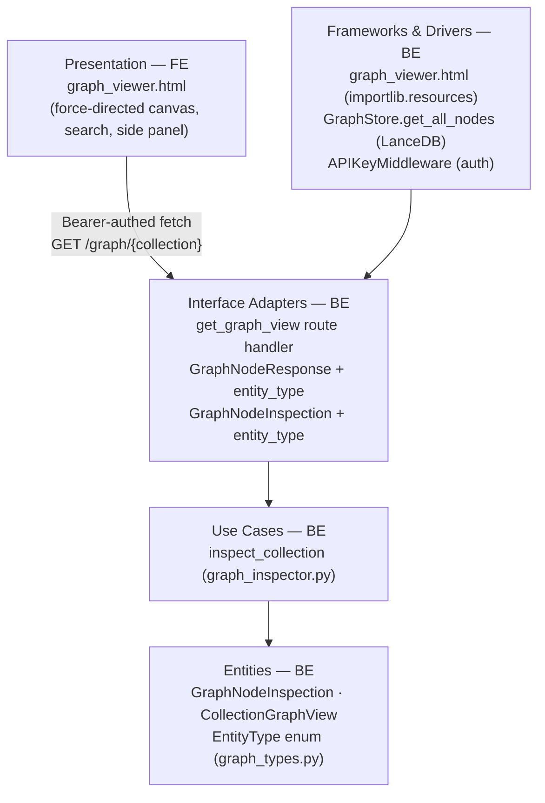
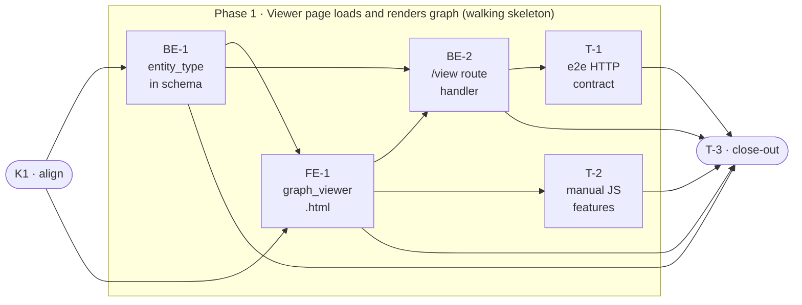

# E2j · Graph Viewer (Single-File Local UI) — Team Plan

**How to read this file**
- **Architecture approach:** Clean Architecture — the default; no override skill was requested. **Layers:** Presentation · Use Cases · Interface Adapters · Entities · Frameworks & Drivers. Each task's first sub-bullet names the layer it touches.
- In this server-side project, **Frontend (Presentation)** = the `graph_viewer.html` file and its embedded JS/CSS that the browser runs. **Backend** = all Python code in `archon_search/` (route handler, schema models, resource loading).
- The **Frontend, Backend, and Tester** sections are the depth view; the **Task Breakdown** is the execution-order view.
- **Phases are vertical slices** — each delivers a working end-to-end increment. Sliced with the **`vertical-slicer` skill** (installed). This feature is one end-to-end behavior, so there is one feature slice plus Kickoff and Close-out.
- **Tests** are tagged by level. Unit and integration tests belong to the implementing dev (test-first); e2e and manual tests are the tester's tasks.
- **Contracts** are TypeSpec-backed: HTTP/API seams emit `openapi.yaml`; internal logical seams use core-construct `.tsp` only. Links below.
- IDs (`S#`, `C#`, `BE-#`/`FE-#`/`T-#`/`K#`, `Q#`) are the traceability thread.
- **Rule:** edit your own tasks freely; change a contract only by team agreement.

---

## Background

Operators who want to understand their knowledge graph must download raw JSON or GraphML files and open them in third-party tools — there is no built-in visual interface. The graph inspection REST API (`GET /graph/{collection}`) already exists and returns all the data needed to render an interactive graph.

---

## Goal

Opening `GET /graph/{collection}/view` in a browser delivers a self-contained interactive graph page — nodes, edges, search, and click-through inspection — with no installation, no external tools, and no second login prompt. The page is bundled into the Python package and served directly by the archon-search server.

---

## Scope

### In Scope
- Single-file HTML served by the archon-search server at `GET /graph/{collection}/view`
- Force-directed layout using inlined **vis-network** (~500 KB embedded — no CDN, no npm, no build step; batteries-included physics, node drag, zoom, and tooltips)
- Bearer token embedded in the page at render time via `str.replace()` placeholder substitution
- Nodes: sized by `salience`, colored by `entity_type` (person, concept, system, event, code_symbol)
- Edges: thickness proportional to co-occurrence `weight`; `relationship_type` visible on hover
- Click-to-inspect side panel: `entity_name`, `entity_type`, `chunk_count`, and co-occurrence chunk IDs derived from incident edges
- Text search: filters visible nodes by name as the user types
- Truncation banner: displayed when `truncated = true`, showing displayed vs. total counts from `node_count`/`edge_count`
- Empty-state message: "No entities found — ingest some documents first" when `nodes` is empty
- `graph.enabled = false` handling: 422, same guard as existing graph endpoints
- HTMX-compatible markup: no custom Web Components, no Shadow DOM
- Zero external network requests after page load
- Bundled into the Python package as a resource file loaded via `importlib.resources`
- **Schema addition:** `entity_type: str` added to `GraphNodeInspection` and `GraphNodeResponse` (additive, non-breaking); OpenAPI snapshot updated

### Out of Scope
- Cross-collection merged view
- Salience mode selector in the UI (always uses `frequency` default)
- Impact / blast-radius drill-down on `code_symbol` nodes
- Community highlighting / cluster overlay
- PNG/SVG export
- E8 admin UI integration (E8's scope; E2j's markup must only be HTMX-compatible)

---

## Acceptance criteria
- `GET /graph/{collection}/view` with a valid Bearer token returns 200 `text/html` with a self-contained HTML page
- The page embeds the caller's Bearer token as a JS variable so the force-directed graph loads automatically
- The page contains no ``. This id is a contract between FE-1 and the test suite (hash gate and external-URL boundary tests select by this id, not by "largest block" heuristic).
    - Tests
        - #unit_test — `test_viewer_html_is_loadable_as_package_resource` — `importlib.resources.files("archon_search.server").joinpath("graph_viewer.html").read_bytes()` succeeds and returns non-empty bytes
        - #unit_test — `test_viewer_html_contains_canvas_and_placeholders` — HTML file contains `<canvas`, `__ARCHON_TOKEN__`, `__ARCHON_COLLECTION__`, `__ARCHON_MAX_NODES__`, `__ARCHON_MAX_EDGES__`
        - #integration_test — `test_viewer_html_no_external_urls` — response body for a valid `/view` request: (1) strip the `<script id="vendor-vis-network">` block (selected by the stable `id` attribute — this is how FE-1 must emit it per the FE-1 contract); (2) in the remaining HTML, assert no `<script src="https://`, no `<link href="https://`, no `fetch("https://` or `fetch('https://`, no `new XMLHttpRequest` — this prevents false positives from vis-network's own internal URL strings
        - #integration_test — `test_viewer_htmx_compatible` — response body: (1) contains no `shadowRoot`; (2) contains no `customElements.define(`; (3) the document's own `<script>` elements (excluding the vendored vis-network block) contain no `type="module"` attribute — scope this check to the document structure, not the entire body, to avoid false-positive failures from the vendored library; (4) contains no `<template` element (shadow DOM slot pattern). The `<[a-z]+-[a-z]+` regex pattern is too coarse (false positives on attributes, false negatives on JS-registered components) and must NOT be used.
        - #integration_test — `test_viewer_html_overrides_math_random` — HTML source contains `Math.random` reassignment before vis-network initialization (search for `mulberry32` or `Math.random =` in response body, confirming the PRNG override is present)

- [x] **BE-2** — New `GET /graph/{collection}/view` route handler: (1) token resolution — `?token=` query param validated via the full three-source revocation-aware auth cascade from `middleware_auth.py:57–96` (using the shared `validate_token_and_get_namespace(token, request)` helper); fallback to `Authorization` header re-read (token recovery only — middleware already validated on this path); → 401 with `WWW-Authenticate: Bearer` if neither supplies a valid token; (2) graph-enabled guard → 422; (3) collection existence check via `pipeline.get_collection_meta(collection, namespace=ns)` → 404 if unknown; (4) `importlib.resources` HTML load; (5) C4 placeholder substitution; (6) `Response(content=..., media_type="text/html")`; register in `routes_graph.py` (no ordering constraint vs. `GET /graph/{collection}` — paths differ in segment count) #backend-role
    - Interface Adapters · 3.0h
    - needs BE-1, FE-1 · completes C2, C3, C4, S1, S7, S8, S9, S10, S12
    - **Requires middleware change (owned by BE-2):** modify `middleware_auth.py` to add the conditional-branch exemption described in "What does NOT change" and C3. This is an explicit BE-2 deliverable, not a side-note — it must be completed before BE-2 integration tests can run. Add to BE-2 "Done when" list: middleware exempts graph-view requests with `?token=` correctly.
    - **Stub strategy for pre-FE-1 testing:** extract the resource load into a module-private helper `_load_viewer_html() -> bytes` in the handler module. Integration tests monkeypatch this function directly (e.g. `monkeypatch.setattr("archon_search.server.routes_graph._load_viewer_html", lambda: stub_bytes)`). This is the **primary** recommended seam — monkeypatching `importlib.resources.files` directly does not work because it returns a `Traversable` interface; raw filepath return fails `.read_bytes()`. The stub bytes must contain the four C4 placeholders and `<canvas`. Without this seam, BE-2 tests are blocked on FE-1.
    - Tests
        - #unit_test — `test_view_graph_disabled_returns_422` — `config.graph.enabled=False` → 422 with exact detail string
        - #unit_test — `test_view_no_auth_checked_before_graph_disabled` — invalid `?token=` + `config.graph.enabled=False` → 401 (not 422); auth must be checked before graph-enabled guard to avoid disclosing server config to unauthenticated callers
        - #unit_test — `test_view_unknown_collection_returns_404` — unknown collection → 404
        - #unit_test — `test_view_collection_name_is_json_encoded` — a collection name containing `"` and `<` (e.g. `foo";<bar>`) appears JSON-encoded (escaped) in the response body, not raw
        - #integration_test — `test_view_token_injected_in_response` — `api_key` literal appears verbatim in `response.text`
        - #integration_test — `test_view_returns_html_content_type` — `Content-Type: text/html` header on 200 response
        - #integration_test — `test_view_invalid_token_returns_401` — invalid token in `Authorization: Bearer <bad>` header → 401 with `WWW-Authenticate: Bearer` header (covers S9)
        - #integration_test — `test_view_no_auth_returns_401_with_www_authenticate` — no auth header and no `?token=` → 401 with `WWW-Authenticate: Bearer` header (covers S8)
        - #integration_test — `test_view_query_param_token_happy_path` — valid `?token=<raw>` query param → 200 `text/html` with token in body (covers C3 path 2)
        - #integration_test — `test_view_query_param_invalid_token_returns_401` — invalid `?token=<bad>` query param → 401 with `WWW-Authenticate: Bearer` header (covers S9 on query-param path)
        - #integration_test — `test_view_query_param_keystore_revoked_token_returns_401` — a KeyStore-managed token removed from `keys.json` → 401 with `WWW-Authenticate: Bearer` header (covers `middleware_auth.py:57–62`)
        - #integration_test — `test_view_query_param_legacy_revoked_token_returns_401` — a token matching the legacy `api_key` that has been marked revoked/expired → 401 with `WWW-Authenticate: Bearer` header (covers `middleware_auth.py:80–96`)
        - #integration_test — `test_view_query_param_wrong_namespace_returns_404` — `?token=` from namespace A, collection only exists in namespace B → 404 (verifies namespace resolution is correctly set on `request.state` for the exempt path)
        - #integration_test — `test_view_header_takes_priority_over_query_param` — request with both valid `Authorization: Bearer` header and `?token=<invalid>` → 200 (header validated, invalid ?token= ignored because header takes priority)
        - #unit_test — `test_middleware_graph_view_token_param_is_exempt` — a request to `/graph/test-col/view?token=abc` bypasses the header-presence check; a request to `/graph/test-col/view` without `?token=` is NOT exempt (still requires Bearer header)
        - #unit_test — `test_middleware_exact_path_scope` — a request to `/other/view?token=abc` is NOT exempt (path pattern only matches `/graph/{collection}/view`)

- [x] **T-1** — integration: server HTTP contract for `GET /graph/{collection}/view` #tester-role
    - — · 3.0h
    - needs BE-2 · completes S1, S7, S8, S9, S10, S11, S12, S13
    - Tests
        - [x] #integration_test — `test_e2j_view_happy_path` — 200 + `text/html` + `api_key` in body + `<canvas` in body
        - [x] #integration_test — `test_e2j_view_graph_disabled_422` — 422 with exact detail string
        - [x] #integration_test — `test_e2j_view_no_auth_401` — no `Authorization` header → 401 + `WWW-Authenticate: Bearer`
        - [x] #integration_test — `test_e2j_view_collection_not_found_404` — unknown collection → 404
        - [x] #integration_test — `test_e2j_view_no_external_urls` — response body has no external URL patterns

- [x] **T-2** — Manual: JS interactive features in a real browser #tester-role
    - — · 2.0h
    - needs FE-1 · completes S2, S3, S4, S5, S6, S14
    - Tests
        - #manual_test — Node click shows inspect panel — click a known node (pre-verified via `GET /graph/{collection}`) → panel shows entity_name, entity_type, chunk_count, and the union of source_chunk_ids from all incident edges
        - #manual_test — Edge hover shows relationship type — hover an edge → tooltip displays relationship_type value (e.g. "calls", "synonym_of")
        - #manual_test — Search filters nodes — type partial name in search box → only matching nodes visible; non-matching nodes hidden; incident edges hidden
        - #manual_test — Truncation banner — **Setup:** set `max_inspection_nodes` to a small value (e.g. 3) in `archon-search.toml` and ingest a handful of documents so that `node_count` from `GET /graph/{collection}` exceeds it (this exercises the same code path as the 5000-node default without requiring a large corpus). **Test:** open `/view` → banner reads "Showing X of Y nodes and A of B edges" where X = `data.nodes.length` (number of nodes the API actually returned in the `nodes` array) and Y = `data.node_count` (total entity count from the API response).
        - #manual_test — Empty state message — open collection with no ingested documents → "No entities found — ingest some documents first" shown on canvas
        - #manual_test — Offline behavior — load page fully, disconnect server → graph remains interactive (pan, zoom, click, search)
        - #manual_test — Fetch error state (no scenario ID — bonus test) — load the page with a valid token, then revoke the token on the server; trigger a graph refresh (or reload) → page shows an error indicator (or graceful empty state) rather than a silent blank canvas

### Phase 2 · Close-out
- [ ] **T-3** — Project close-out & acceptance fact-check #tester-role
    - — · 4.0h
    - needs BE-1, BE-2, FE-1, T-1, T-2 · completes (acceptance gate)
    - Tests
    - Duties
        - Update all documentation per the "Documentation update" section — `600_api_reference`, `110_component_catalog`, `100_architecture_overview`, `CLAUDE.md`, user manual.
        - Fix all build / compiler warnings, if any.
        - Run the full test suite; fix every failing test, including any unrelated to this feature.
        - Validate every Acceptance criterion one-by-one with a fact check — no assumptions; confirm each is genuinely done.

**Critical path:** K1 → BE-1 → BE-2 → T-1 → T-3. FE-1 runs in parallel with BE-1 after K1 and gates BE-2 and T-2. T-2 runs in parallel with T-1.
