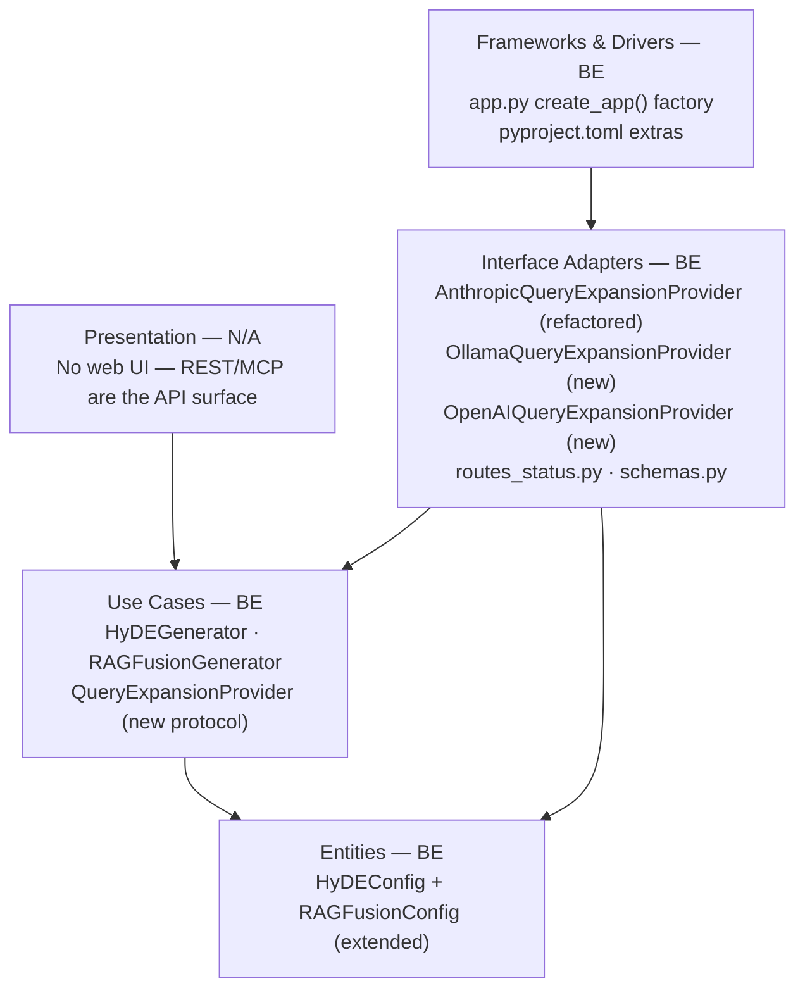
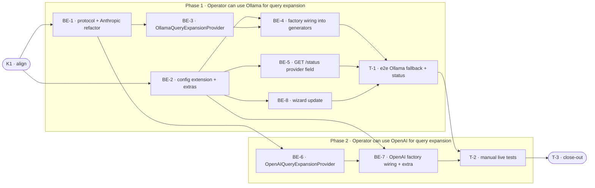

# G10 · LLM Provider Matrix for Query Expansion — Team Plan

**How to read this file**
- **Architecture approach:** Clean Architecture (default). **Layers:** Presentation · Use Cases · Interface Adapters · Entities · Frameworks & Drivers. Each task's first sub-bullet names the layer it touches.
- The **Frontend, Backend, and Tester** sections are the **depth view** — each role's work grouped by layer.
- The **Task Breakdown** is the **order view** — every task is a single-role checkbox in execution order, opening with a dependency graph.
- **Phases are vertical slices**, each delivering a working end-to-end increment. Sliced with the **`vertical-slicer`** skill.
- Each task carries the **role tag at the end of its title line**, then sub-bullets: **layer · estimate**, **needs · completes**, and a **Tests** block.
- **Tests:** unit and integration belong to the implementing dev (test-first); e2e and manual are tester tasks. The close-out task writes no tests.
- **Contracts** are logical: authored as linked `.tsp` files. HTTP/API seams also emit a linked `openapi.yaml`. Built with **TypeSpec v1.13.0** (compiled clean).
- IDs (`S#`, `C#`, `BE-#`, `T-#`, `K#`, `Q#`) are the traceability thread.

---

## Background

HyDE and RAG Fusion use `HyDEGenerator` (`archon_search/hyde.py`) and `RAGFusionGenerator` (`archon_search/rag_fusion.py`) to call Anthropic's API for text generation. Both generators hard-code `anthropic.AsyncAnthropic()` with no abstraction layer. Operators who cannot use Anthropic — due to data residency requirements, cost sensitivity, or an existing OpenAI subscription — cannot use either feature.

---

## Goal

An operator sets `provider = "ollama"` (or `"openai"`) in `[hyde]` and/or `[rag_fusion]` in their `archon-search.toml`, restarts the server, and query expansion runs on the configured provider with no API key, no external network call, and no per-query cost (Ollama). The existing Anthropic path is completely unchanged for operators who don't touch `provider`.

---

## Scope

### In Scope
- `QueryExpansionProvider` protocol with `generate_hypothetical_doc(query)` and `decompose_query(query)` — new file `archon_search/query_expansion_protocol.py`
- `provider` and `ollama_base_url` config fields in `HyDEConfig` and `RAGFusionConfig` (per-feature, repeated in each section)
- `OllamaQueryExpansionProvider` — new adapter, wraps `ollama` Python SDK; optional extra `archon-search[ollama]`
- `OpenAIQueryExpansionProvider` — new adapter, wraps `openai` SDK; optional extra `archon-search[openai-provider]`
- Existing Anthropic code refactored into `AnthropicQueryExpansionProvider` — no behaviour change
- Provider factory in `create_app()` — reads `config.provider`, guards import, raises `ConfigError` at startup for missing package
- `GET /status` — `provider` field added to `HydeStatusDetail` and `RagFusionStatusDetail`
- Rate limiting (`max_requests_per_minute`): honoured for Anthropic and OpenAI; silently ignored for Ollama
- `archon-search.toml.example` — updated with `provider` field examples and Ollama privacy note
- Wizard (`archon_search/install.py`) updated: API-key gate removed from HyDE/RAG Fusion prompt; wizard gains provider selection (Anthropic / OpenAI / Ollama), model input, and `ollama_base_url` input; invoked post-install by operators
- `ConfigError` at startup when `provider != "anthropic"` and `model == ''` (the empty-string sentinel for "unset"; see Q5)

### Out of Scope
- Graph enrichment provider switching (`AnthropicEnrichmentClient` / `LLMEnrichmentClientProtocol`) — separate G10b
- Ollama model download or management
- Provider health checks at startup

---

## Acceptance criteria
- `[hyde] provider = "ollama"` + Ollama running → `hyde_applied=true` in search response
- `[rag_fusion] provider = "ollama"` + Ollama running → fused results returned
- `[hyde] provider = "openai"` + `OPENAI_API_KEY` set → `hyde_applied=true`
- `[hyde] provider = "ollama"` with Ollama unreachable → silent fallback, `hyde_applied=false`
- `provider = "ollama"` with `archon-search[ollama]` not installed → `ConfigError` at startup, server does not start
- `provider = "openai"` with `openai` package not installed → `ConfigError` at startup
- `[hyde]` and `[rag_fusion]` can each use a different provider simultaneously with no interference
- `GET /status` returns `hyde.provider` and `rag_fusion.provider` matching current config
- `max_requests_per_minute` not enforced when `provider = "ollama"`; enforced when `provider = "openai"` (token bucket decrements per call; returns `None` when at 0, no wall-clock dependency)
- Raw query string never appears in logs regardless of provider (`_query_fingerprint()` used throughout)
- Existing Anthropic path: zero behaviour change (all existing tests continue to pass)
- Running the wizard after install lets operators select provider, model, and base URL for HyDE and RAG Fusion without editing the TOML manually
- Setting `provider = "ollama"` or `"openai"` without setting `model` (i.e. `model = ''`, the sentinel for "unset") raises `ConfigError` at startup with a message naming the field to fix

---

## What does NOT change
- Silent fallback mechanism — unreachable provider returns `None`/`[]`; pipeline falls back to plain search (existing `resolve_hyde_vector`, pipeline error handlers)
- `_query_fingerprint()` privacy invariant — raw query text never logged
- `HyDEGenerator` / `RAGFusionGenerator` public API (used by `pipeline.py`, `mcp.py`)
- All existing Anthropic-based tests
- `key_available` field on status sub-objects (remains, gains per-provider semantics)
- `archon-search[hyde]` and `archon-search[rag_fusion]` optional extras — untouched. The refactored `AnthropicQueryExpansionProvider` continues to require the `[hyde]` extra (anthropic package). Ollama and OpenAI providers have their own separate extras (C1-B-11).

---

## Known limitations / accepted trade-offs
- `ollama_base_url` is repeated per feature section (`[hyde]` and `[rag_fusion]`) — operators running both with Ollama set it twice. A shared `[ollama]` section would avoid duplication but requires a new top-level config section inconsistent with existing per-feature patterns. The duplication is rare and the simplicity wins.
- Rate limiting for Ollama is silently ignored — a local model has no API cap. Logging a warning about an inapplicable limit would be noise.
- **`key_available` for Ollama (C1-I-7):** When `provider='ollama'`, `key_available` is always `True` in `GET /status` — this field indicates whether the provider's authentication is configured (Ollama has no auth key), not whether the Ollama service is reachable. Operators should interpret `hyde_applied=false` in search responses as the runtime signal that Ollama is unreachable. Provider health checks are out of scope (see Scope — Out of Scope).

---

## Approach & architecture

The feature introduces a `QueryExpansionProvider` Protocol at the Use Cases / Interface Adapters boundary. `HyDEGenerator` and `RAGFusionGenerator` remain the orchestrators (Use Cases) — they hold a provider instance (received from a factory) and delegate text generation to it. Embedding (HyDE) and result fusion (RAG Fusion) stay inside the generators unchanged. Three adapter classes (Interface Adapters) implement the protocol. The factory in `create_app()` (Frameworks & Drivers) reads `config.provider`, guards the import, and injects the right adapter.

**Layer map (and role mapping)**

| Layer | Role | Components |
|-------|------|-----------|
| Presentation | **Frontend — N/A** | No UI; REST/MCP are the operator interface |
| Use Cases | **Backend** | `archon_search/hyde.py` · `archon_search/rag_fusion.py` · `archon_search/query_expansion_protocol.py` (new protocol — consumer-owned at Use Cases, same precedent as `graph_enrichment_protocol.py`) |
| Interface Adapters | **Backend** | `archon_search/providers/ollama_provider.py` (new) · `archon_search/providers/openai_provider.py` (new) · `archon_search/providers/anthropic_provider.py` (refactored from inline) · `archon_search/server/schemas.py` · `archon_search/server/routes_status.py` |
| Entities | **Backend** | `archon_search/config.py` (`HyDEConfig`, `RAGFusionConfig`) |
| Frameworks & Drivers | **Backend** | `archon_search/server/app.py` (`create_app`) · `pyproject.toml` |

**What changes**
- `archon_search/query_expansion_protocol.py` — new: `QueryExpansionProvider` Protocol (Use Cases layer)
- `archon_search/config.py` — `HyDEConfig` + `RAGFusionConfig` gain `provider` and `ollama_base_url`; `_apply_toml` gains branches for both
- `archon_search/hyde.py` — Anthropic logic extracted to adapter; `HyDEGenerator` uses injected provider
- `archon_search/rag_fusion.py` — same
- `archon_search/providers/` — new directory with three adapter files
- `archon_search/server/schemas.py` — `HydeStatusDetail` and `RagFusionStatusDetail` gain `provider: str`
- `archon_search/server/routes_status.py` — `_build_hyde_status` / `_build_rag_fusion_status` pass `provider` through
- `archon_search/server/app.py` — provider factory in `create_app()`
- `pyproject.toml` — new optional extras `ollama` and `openai-provider`
- `archon-search.toml.example` — new `provider` field examples + Ollama privacy note
- `archon_search/install.py` — wizard gains provider selection for HyDE/RAG Fusion; API-key gate removed so Ollama operators can configure features; model validation `ConfigError` added for non-Anthropic providers with default model
- `tests/server/openapi_snapshot.json` — must be regenerated after schema change

**Key decisions (from the brief)**
- Separate `provider` and `model` fields — existing operators change nothing on upgrade; `provider` defaults to `"anthropic"`
- `ollama_base_url` defaults to `http://localhost:11434` (Ollama universal default) — no extra config for the common case
- Per-feature `ollama_base_url` (not a shared `[ollama]` section) — consistent with existing patterns
- Query expansion only (not graph enrichment) — G10b is the small follow-up
- **Rate-limit token bucket ownership (Root-4):** The rate-limit token bucket stays in the generators (`HyDEGenerator`/`RAGFusionGenerator`), not the adapters. Each generator checks `config.provider != 'ollama'` before decrementing the bucket. Adapters are not rate-limit-aware. Rationale: the existing bucket is entangled with the key-warning and timeout logic in the generator; moving it to adapters would duplicate it 3× and force adapters to know about per-request concurrency state.

---

## Contracts / seams

TypeSpec v1.13.0 used. C1 and C2 are internal logical seams (compiled with `--no-emit`). C3 is an HTTP/API seam (TypeSpec HTTP service + emitted OpenAPI).

**C1 — `QueryExpansionProvider` protocol** *(Use Cases ↔ Interface Adapters)*  
All three providers implement this protocol. `generate_hypothetical_doc` returns hypothesis text or `None` on any failure; `decompose_query` returns variant strings or `[]` on any failure. Callers fall back to plain search on `None`/`[]` — providers must never raise to callers.

> **Implementation note (Root-1):** `HyDEGenerator` embeds the returned text internally — providers return raw text only (not vectors). The embedding step stays inside `HyDEGenerator`, not in the adapter. `RAGFusionGenerator`'s existing exception handling (`TimeoutError`/`APIError`) remains in the generator; providers surface errors via `None`/`[]` return, never by raising.
>
> **Constructor parameters (DA-ARCH-C1-I-7):** Providers receive `max_tokens` and `timeout_seconds` as constructor parameters (set once at factory time, not per-call). Per-call variation (RAG Fusion's `num_queries` scaling of `max_tokens`) remains the generator's responsibility. Adapter methods accept `max_tokens: int` and `timeout_seconds: float` kwargs with provider defaults as a fallback.
>
> **Response normalization (DA-ARCH-C1-I-8):** Each adapter normalizes the provider-specific response shape to plain `str` before returning (Anthropic: `response.content[0].text`; OpenAI: `choices[0].message.content`; Ollama: `message.content`). This is the adapter's only normalization responsibility.

See [`g10-query-expansion-provider.tsp`](g10-query-expansion-provider.tsp)
- Realised by: BE-1 (Anthropic), BE-3 (Ollama), BE-6 (OpenAI) · Verified by: BE-1, BE-3, BE-6, BE-7

**C2 — `HyDEConfig` / `RAGFusionConfig` extension** *(Entities layer)*  
Both config dataclasses gain `provider: str = "anthropic"` (values: `"anthropic"` | `"openai"` | `"ollama"`) and `ollama_base_url: str = "http://localhost:11434"`. `_apply_toml` validates provider value; `create_app()` raises `ConfigError` at startup for missing provider packages.  
See [`g10-query-expansion-config.tsp`](g10-query-expansion-config.tsp)
- Realised by: BE-2 · Verified by: BE-2, BE-4, BE-7

**C3 — `GET /status` provider fields** *(HTTP/API seam — REST)*  
`HydeStatusDetail` and `RagFusionStatusDetail` gain `provider: str`. `key_available` stays with per-provider semantics: Anthropic → `ANTHROPIC_API_KEY` set; OpenAI → `OPENAI_API_KEY` set; Ollama → always `True`. Both sub-objects remain `null` when `enabled = false`.  
See [`api-contracts/g10-status-provider-api.tsp`](api-contracts/g10-status-provider-api.tsp) · [`api-contracts/g10-status-provider-api.openapi.yaml`](api-contracts/g10-status-provider-api.openapi.yaml)
- Realised by: BE-5 · Verified by: BE-5, T-1

---

## Scenarios #tester-role

| id | Scenario (Given / When / Then) |
|----|-------------------------------|
| **S1** | **Given** `[hyde] provider = "anthropic"` (default), Anthropic API reachable · **When** search with `hyde=true` · **Then** hypothetical doc generated via Anthropic, `hyde_applied=true` — behaviour identical to pre-G10 |
| **S2** | **Given** `[hyde] provider = "ollama"`, `model = "llama3.2"`, `archon-search[ollama]` installed, Ollama running at `http://localhost:11434` · **When** search with `hyde=true` · **Then** `generate_hypothetical_doc` calls Ollama, resulting embedding used as ANN vector, `hyde_applied=true` |
| **S3** | **Given** `[rag_fusion] provider = "ollama"`, `archon-search[ollama]` installed, Ollama running · **When** search with `rag_fusion=true` · **Then** `decompose_query` calls Ollama, variant queries fused, results returned |
| **S4** | **Given** `[hyde] provider = "openai"`, `model = "gpt-4o-mini"`, `archon-search[openai-provider]` installed, `OPENAI_API_KEY` set · **When** search with `hyde=true` · **Then** hypothetical doc generated via OpenAI, `hyde_applied=true` |
| **S5** | **Given** `[rag_fusion] provider = "openai"`, `archon-search[openai-provider]` installed, `OPENAI_API_KEY` set · **When** search with `rag_fusion=true` · **Then** query variants generated via OpenAI, fused results returned |
| **S6** | **Given** `[hyde] provider = "ollama"` and `[rag_fusion] provider = "anthropic"` in same config · **When** search with `hyde=true` and `rag_fusion=true` · **Then** HyDE calls Ollama, RAG Fusion calls Anthropic — independent, no interference |
| **S7** | **Given** `[hyde] provider = "ollama"`, Ollama not running · **When** search with `hyde=true` · **Then** `generate_hypothetical_doc` times out, returns `None`, `hyde_applied=false`, plain search used silently |
| **S8** | **Given** `[rag_fusion] provider = "ollama"`, Ollama not running · **When** search with `rag_fusion=true` · **Then** `decompose_query` times out, returns `[]`, pipeline falls back to plain search, warning in response |
| **S9** | **Given** `provider = "ollama"` in config, `archon-search[ollama]` not installed · **When** server starts · **Then** `ConfigError` raised at startup with actionable message; server does not start |
| **S10** | **Given** `provider = "openai"` in config, `archon-search[openai-provider]` not installed · **When** server starts · **Then** `ConfigError` raised at startup; server does not start |
| **S11** | **Given** `[hyde] provider = "ollama"`, `max_requests_per_minute = 5` · **When** 10 searches with `hyde=true` in one minute · **Then** all 10 succeed; rate limit not applied; no warning logged |
| **S12** | **Given** `[hyde] provider = "openai"`, `max_requests_per_minute = 5` · **When** 6 search calls are made with the bucket depleted (no time elapsed between calls) · **Then** the call that finds the bucket at 0 returns `None`; `hyde_applied=False`; plain search used silently |
| **S13** | **Given** `[hyde] provider = "ollama"`, `[rag_fusion] provider = "openai"`, both enabled · **When** `GET /status` · **Then** response contains `hyde.provider = "ollama"` and `rag_fusion.provider = "openai"` |
| **S14** | **Given** any provider configured · **When** provider call fails · **Then** log contains only `_query_fingerprint(query)` (16-char hex), never the raw query string |

---

## Frontend — Presentation #frontend-role

N/A — no frontend work for this feature. archon-search has no web UI; all operator interaction is via config file and REST/MCP. Documentation and config template updates (`archon-search.toml.example`) are part of the close-out task (T-3).

---

## Backend — Entities · Use Cases · Adapters · Frameworks #backend-role

**Scope:** All server-side Python code. Writes unit and integration tests for each task (test-first).  
**Owns layers:** Entities, Use Cases, Interface Adapters, Frameworks & Drivers.

**Tasks by layer** *(checkable in the Task Breakdown)*
- Use Cases: BE-1 (protocol + refactor Anthropic), BE-4 (factory wiring into generators)
- Entities: BE-2 (config extension)
- Use Cases: BE-4 (factory wiring into generators)
- Interface Adapters: BE-3 (Ollama adapter), BE-5 (status schema), BE-6 (OpenAI adapter)
- Frameworks & Drivers: BE-2 (pyproject.toml extras), BE-4 (app.py factory), BE-7 (OpenAI wiring + extra), BE-8 (wizard update)

**Done when**
- [ ] `HyDEGenerator` and `RAGFusionGenerator` accept any `QueryExpansionProvider` — S1, S6
- [ ] `OllamaQueryExpansionProvider` passes all unit tests; fallback on timeout confirmed — S2, S3, S7, S8, S11
- [ ] `OpenAIQueryExpansionProvider` passes all unit tests; rate limiting confirmed — S4, S5, S12
- [ ] `ConfigError` at startup for missing provider packages or default model mismatch — S9, S10
- [ ] `GET /status` returns `provider` field for both features — S13
- [ ] Wizard lets operators select provider, model, and base URL post-install without editing TOML
- [ ] `_query_fingerprint()` used in all new provider error paths — S14
- [ ] `tests/server/openapi_snapshot.json` regenerated and passing

---

## Tester #tester-role

**Scope:** e2e and manual tests plus project close-out. Unit and integration tests belong to backend dev.

**Tasks** *(checkable in the Task Breakdown)*
- T-1: e2e integration — Ollama fallback + status
- T-2: Manual test checklist — live Ollama + live OpenAI
- T-3: Project close-out

**Allocation** — cheapest level that proves each scenario

| Scenario | Cheapest level | Rationale |
|----------|---------------|-----------|
| S1 — Anthropic path unchanged | integration | Existing pattern: mock `AsyncAnthropic` |
| S2 — Ollama HyDE live | manual | Requires live Ollama service |
| S3 — Ollama RAG Fusion live | manual | Requires live Ollama service |
| S4 — OpenAI HyDE live | manual | Real API key + tokens; cost |
| S5 — OpenAI RAG Fusion live | manual | Real API key + tokens; cost |
| S6 — Mixed providers | integration | Mock both clients independently |
| S7 — Ollama HyDE timeout → fallback | integration | Mock timeout exception on Ollama client |
| S8 — Ollama RAG Fusion timeout → fallback | integration | Mock timeout exception |
| S9 — `ollama` absent → ConfigError | unit | `sys.modules["ollama"] = None` |
| S10 — `openai` absent → ConfigError | unit | `sys.modules["openai"] = None` |
| S11 — Rate limit ignored for Ollama | unit | Assert token bucket not checked when provider=ollama |
| S12 — Rate limit honoured for OpenAI | unit | Assert token bucket fires for provider=openai |
| S13 — GET /status shows providers | integration | `TestClient` + assert `data["hyde"]["provider"]` |
| S14 — Privacy invariant | unit | Assert error-path log uses `_query_fingerprint` |

---

## Documentation update

- [ ] `Documentation/Backlog/g10-llm-provider-matrix-brief.md` — no changes needed (source brief)
- [ ] `Documentation/Backlog/g10-llm-provider-matrix-team-plan.md` — this file
- [ ] `archon-search.toml.example` — add `provider`, `ollama_base_url` fields to `[hyde]` and `[rag_fusion]` sections; add Ollama privacy note (zero-transmission option); update rate-limit comment to note Ollama ignores it
- [ ] `Documentation/Architecture/600_api_reference_or_public_interface.md` — update `GET /status` response schema (new `provider` field in HyDE/RAG Fusion sub-objects)
- [ ] `Documentation/Architecture/110_component_catalog_and_layer_breakdown.md` — add `query_expansion_protocol.py` and `providers/` to the module inventory
- [ ] `CLAUDE.md` — no changes needed (pipeline.py section references generators by role, not provider internals)
- [ ] `Documentation/Architecture/530_technical_debt_refactoring_roadmap.md` — add + close G10 item
- [ ] `BREAKING.md` — no breaking changes (GET /status gains an additive field; existing `provider` default = "anthropic" preserves all existing configs)

---

## Open questions

| id | Area | Question |
|----|------|---------|
| **Q1** | Config | `ollama_base_url` per-feature vs shared `[ollama]` section — **resolved in this revision:** per-feature, consistent with existing config patterns (see Known limitations). |
| **Q2** | Config | `openai` extra naming — **resolved in this revision:** `archon-search[openai-provider]`. Dev dep stays in `[dependency-groups].dev` (G9 test tooling); production extra goes in `[project.optional-dependencies]` under a different name. No conflict. |
| **Q3** | API | `GET /status` placement of `provider` — **resolved in this revision:** inside the existing `hyde`/`rag_fusion` sub-objects, not as new top-level keys. |
**Resolved in this revision:** Q1, Q2, Q3, Q4, Q5.

- **Q4 resolved:** Wizard is the configuration path post-install. The API-key gate is removed from `install.py`; wizard gains provider selection (Anthropic / OpenAI / Ollama), model input, and `ollama_base_url` input. `install_cmd.py` CLI flags are unchanged — operators who use flags must also handle TOML configuration manually (wizard is the supported guided path). Task: BE-8.
- **Q5 resolved:** Raise `ConfigError` at startup if `provider != "anthropic"` and `model == ''` (empty string). Implementation: treat `model = ''` as the sentinel for "unset" — `_apply_toml` stores `''` when the `model` key is absent for non-Anthropic providers (or when `model = ''` is explicitly written). `create_app()` raises `ConfigError` if `provider != 'anthropic'` and `model == ''`. Operators who want `DEFAULT_FAST_MODEL` with Ollama or OpenAI must set it explicitly. A plain `DEFAULT_FAST_MODEL` value cannot be used as the sentinel because after TOML parse there is no way to distinguish "operator set this value" from "defaulted to it". The wizard prevents misconfiguration for operators who use it; the startup check is the safety net for manual TOML edits. Added to BE-2.

---

## Task Breakdown

### Dependency graph

---

### Phase 0 · Kickoff

- [x] **K1** — Agree Contracts, Scenarios, and open questions (Q4, Q5) with the team #team
    - — · 1.0h
    - completes C1, C2, C3
    - Tests

---

### Phase 1 · Operator can use Ollama for query expansion *(walking skeleton: thinnest end-to-end path; establishes protocol + data model foundation)*

- [x] **BE-1** — Define `QueryExpansionProvider` protocol; extract `AnthropicQueryExpansionProvider` from `HyDEGenerator`/`RAGFusionGenerator` (no behaviour change) #backend-role
    - Entities + Use Cases · 3.0h
    - needs K1 · completes C1, S1
    - Note: verify the existing embedding step stays in `HyDEGenerator`, not in `AnthropicQueryExpansionProvider` — the adapter returns raw text only.
    - Adapter scope (C1-B-3): the adapter method `generate_hypothetical_doc(query: str)` receives the already-truncated query (truncation stays in the generator); constructs and sends the provider-specific prompt; applies provider timeout; returns text or `None` on any error. Prompt templating IS the adapter's responsibility. Error classification (`_APIError`, `TimeoutError`) stays in the adapter and is expressed as `None`/`[]` return — never raised. Each adapter also normalizes the provider-specific response shape to plain `str` (DA-ARCH-C1-I-8).
    - Tests
        - #unit_test — `test_anthropic_hyde_provider_satisfies_protocol` — `isinstance(provider, QueryExpansionProvider)` via `@runtime_checkable`
        - #unit_test — `test_anthropic_rag_fusion_provider_satisfies_protocol` — same for RAG Fusion adapter
        - #unit_test — `test_anthropic_generate_hypothetical_doc_returns_text` — mocked `AsyncAnthropic` → provider returns hypothesis string (not vector)
        - #unit_test — `test_anthropic_decompose_query_returns_variants` — mocked client → list of strings returned
        - #integration_test — `test_hyde_anthropic_behaviour_unchanged_after_refactor` — `make_real_app`, mocked Anthropic client injected via `monkeypatch`, assert `hyde_applied=True` and same embedding path as pre-G10
        - `test_anthropic_key_guards.py` — update `GUARD_FILES` to include `archon_search/providers/anthropic_provider.py`; remove the old `hyde.py`/`rag_fusion.py` paths if the guard logic has moved entirely (Root-3)

- [x] **BE-2** — Extend `HyDEConfig` and `RAGFusionConfig` with `provider` + `ollama_base_url`; add `_apply_toml` branches; add `archon-search[ollama]` optional extra; add startup `ConfigError` guard for `provider = "ollama"` with missing package #backend-role
    - Entities + Frameworks & Drivers · 3.0h
    - needs K1 · completes C2, S9
    - Note: The `ConfigError` guard for missing provider packages fires regardless of `enabled` state — if `provider='ollama'` is set and `archon-search[ollama]` is not installed, the server does not start even if `[hyde] enabled=false`. Config validation must catch misconfiguration at startup, not at first use (C1-B-4).
    - Note: After adding config fields, run `uv run pytest tests/test_no_hardcoded_path_home.py -n0 --no-cov`; update `tests/path_home_allowlist.txt` line numbers (sha unchanged) (C1-I-4).
    - Note (DA-TEST-C1-I-7): Add `ollama` to `[dependency-groups].dev` in `pyproject.toml` (test-only; the optional extra `archon-search[ollama]` remains for production use). This allows mocking `ollama.AsyncClient` in BE-3/BE-4/T-1 without installing the production extra.
    - Tests
        - [x] #unit_test — `test_config_defaults_provider_is_anthropic` — `HyDEConfig().provider == "anthropic"` and `RAGFusionConfig().provider == "anthropic"`
        - [x] #unit_test — `test_config_ollama_base_url_default` — `HyDEConfig().ollama_base_url == "http://localhost:11434"`
        - [x] #unit_test — `test_config_invalid_provider_raises_config_error` — `_apply_toml` with `provider = "foobar"` raises `ConfigError`
        - [x] #unit_test — `test_config_ollama_package_absent_raises_config_error` — use `monkeypatch.setitem(sys.modules, 'ollama', None)` (not direct assignment — monkeypatch auto-restores, preventing xdist worker poisoning) (DA-TEST-C1-I-3); `create_app()` with `provider="ollama"` raises `ConfigError`
        - [x] #unit_test — `test_config_empty_model_with_non_anthropic_provider_raises_config_error` — Q5: `provider="ollama"`, `model=''` (sentinel) → `ConfigError` at startup naming the field (C1-I-5)
        - [x] #unit_test — `test_config_non_anthropic_with_explicit_model_ok` — Q5 negative: `provider="ollama"`, `model="llama3.2"` (non-empty) → no `ConfigError` (DA-TEST-C1-I-11)
        - [x] #unit_test — `test_config_anthropic_with_empty_model_ok` — Q5 negative: `provider="anthropic"`, `model=''` → no `ConfigError` (sentinel only applies to non-Anthropic providers) (DA-TEST-C1-I-11)
        - [x] #unit_test — `test_path_home_allowlist_line_number_updated` — asserts allowlist file content has correct `config.py:305` entry (file-content check, no subprocess)
        - [x] Update the `HyDEConfig` and `RAGFusionConfig` snapshot dicts in `tests/test_config_defaults.py` to include the new `provider` and `ollama_base_url` fields (DA-TEST-C1-I-9)

- [x] **BE-3** — Implement `OllamaQueryExpansionProvider` (both methods); silence all errors internally (return `None`/`[]`); normalize Ollama response shape (`message.content`) to plain `str` (DA-ARCH-C1-I-8); `OllamaQueryExpansionProvider` does NOT implement rate limiting — bucket skip is handled in the generator's call site (Root-4) #backend-role
    - Interface Adapters · 3.0h
    - needs BE-1 · completes S2, S3, S7, S8, S11, S14
    - Tests
        - [x] #unit_test — `test_ollama_generate_hypothetical_doc_returns_text` — `sys.modules["ollama"] = mock_ollama`; mock `AsyncClient.generate` returns response → text extracted
        - [x] #unit_test — `test_ollama_decompose_query_returns_variants` — mock client returns multi-query response → list[str]
        - [x] #unit_test — `test_ollama_generate_timeout_returns_none` — mock `AsyncClient.generate` raises `asyncio.TimeoutError` → `generate_hypothetical_doc` returns `None` (does not raise)
        - [x] #unit_test — `test_ollama_generate_arbitrary_exception_returns_none` — mock `AsyncClient.generate` raises `RuntimeError("sdk error")` → returns `None`; proves the "never raises" C1 contract for non-timeout errors (DA-TEST-C1-I-6: `@runtime_checkable isinstance` checks method names only and cannot verify this)
        - [x] #unit_test — `test_ollama_decompose_timeout_returns_empty_list` — same pattern → `[]`
        - [x] #unit_test — `test_ollama_decompose_arbitrary_exception_returns_empty_list` — mock raises `ConnectionError` → `[]` (DA-TEST-C1-I-6)
        - [x] #unit_test — `test_ollama_no_rate_limit_enforcement` — S11: after 100 calls in a tight loop, all succeed; `_rpm_tokens` never decremented
        - [x] #unit_test — `test_ollama_error_path_uses_query_fingerprint` — S14: assert log contains `_query_fingerprint(query)` AND assert `query not in caplog.text` (both conditions required — prevents a log line from containing both fingerprint and raw query) (DA-TEST-C1-I-5)

- [x] **BE-4** — Wire provider factory into `HyDEGenerator` and `RAGFusionGenerator`; update `create_app()` to construct the correct provider from config; update `app.py` lines 563–575 #backend-role
    - Use Cases + Frameworks & Drivers · 3.0h
    - needs BE-2, BE-3 · completes S6
    - Tests
        - [x] #integration_test — `test_search_hyde_ollama_fallback_on_timeout` — S7: `make_real_app` with `provider="ollama"`; mock `ollama.AsyncClient.generate` raises `TimeoutError`; search with `hyde=true`; assert `hyde_applied=False` in response
        - [x] #integration_test — `test_search_rag_fusion_ollama_fallback_on_timeout` — S8: same pattern for RAG Fusion; assert fallback field (verify `rag_fusion_warning` or `rag_fusion_failure_reason` actual field name against `SearchResponse` in `schemas.py` before writing assertion — DA-TEST-C1-I-8)
        - [x] #integration_test — `test_search_hyde_ollama_rag_fusion_anthropic_independent` — S6: `provider="ollama"` for hyde, `provider="anthropic"` for rag_fusion; both work without interference; assert each uses its configured client
        - [x] #integration_test — `test_factory_injects_correct_provider_type` — assert `isinstance(app.state.hyde_generator._provider, QueryExpansionProvider)` (C1-B-8 conformance test)
        - [x] #integration_test — `test_search_mixed_providers_token_buckets_independent` — S6: mixed providers (ollama+anthropic); run rate-limit-count calls for each; assert rate limit fires only for Anthropic path, not Ollama path, with no cross-contamination between the two independent buckets (DA-TEST-C1-I-10)

- [x] **BE-5** — Add `provider: str` to `HydeStatusDetail` and `RagFusionStatusDetail`; update `_build_hyde_status` / `_build_rag_fusion_status` to read `config.hyde.provider`; update `key_available` to be provider-aware; regenerate `tests/server/openapi_snapshot.json` #backend-role
    - Interface Adapters · 2.0h
    - needs BE-2 · completes C3, S13
    - Note (Root-2): Update `HyDEGenerator.is_key_available()` / `RAGFusionGenerator.is_key_available()` to delegate to the provider (or read `config.provider` directly) so per-provider semantics are correct: Anthropic → `ANTHROPIC_API_KEY` set; OpenAI → `OPENAI_API_KEY` set; Ollama → always `True`.
    - Tests
        - [x] #integration_test — `test_status_shows_hyde_provider_ollama` — S13: `TestClient`, `config.hyde.provider = "ollama"`, `GET /status`, assert `data["hyde"]["provider"] == "ollama"`
        - [x] #integration_test — `test_status_shows_rag_fusion_provider_anthropic` — provider="anthropic", assert `data["rag_fusion"]["provider"] == "anthropic"`
        - [x] #integration_test — `test_status_ollama_key_available_is_true` — `provider="ollama"`, `key_available=True` regardless of `ANTHROPIC_API_KEY`
        - [x] #integration_test — `test_status_openai_key_available_checks_openai_api_key` — `provider="openai"`, `OPENAI_API_KEY` unset → `key_available=False`; `OPENAI_API_KEY` set → `key_available=True` (Root-2)

- [ ] **BE-8** — Update install wizard: remove `ANTHROPIC_API_KEY` gate from HyDE/RAG Fusion prompt; add provider-selection step (Anthropic / OpenAI / Ollama), model input, and `ollama_base_url` input; write chosen values to `archon-search.toml` #backend-role
    - Frameworks & Drivers · 3.0h
    - needs BE-2 · completes S9 (prevents startup with bad config)
    - Note (C1-I-4): After wizard rewrite, run `uv run pytest tests/test_no_hardcoded_path_home.py -n0 --no-cov` and update all 4 `install.py` line-number entries in `tests/path_home_allowlist.txt`.
    - Tests
        - #unit_test — `test_wizard_ollama_writes_provider_and_model_to_toml` — mock wizard I/O selecting Ollama + model "llama3.2"; assert written TOML contains `provider = "ollama"` and `model = "llama3.2"` under `[hyde]`
        - #unit_test — `test_wizard_no_api_key_gate_for_ollama` — wizard runs HyDE/RAG Fusion prompt without `ANTHROPIC_API_KEY` set; no `ConfigError` or early exit
        - #unit_test — `test_wizard_anthropic_path_unchanged` — selecting Anthropic still writes correct TOML; existing behavior preserved

- [ ] **T-1** — E2e: verify Ollama fallback (mocked) and `GET /status` shows correct provider #tester-role
    - — · 1.0h
    - needs BE-4, BE-5, BE-8 · completes S7, S8, S13
    - Tests
        - #e2e_test — `test_e2e_hyde_ollama_timeout_fallback` — `TestClient`, `provider="ollama"`, mock `ollama.AsyncClient.generate` raises `TimeoutError`, POST /search `hyde=true`, verify `hyde_applied=False` and plain search result returned
        - #e2e_test — `test_e2e_status_both_providers_shown` — `TestClient`, hyde=ollama / rag_fusion=openai, `GET /status`, assert both `provider` fields present and correct

---

### Phase 2 · Operator can use OpenAI for query expansion

- [ ] **BE-6** — Implement `OpenAIQueryExpansionProvider` (both methods); normalize OpenAI response shape (`choices[0].message.content`) to plain `str` (DA-ARCH-C1-I-8); silence errors internally; use lazy imports — `import openai` inside `OpenAIQueryExpansionProvider.__init__()`, not at module level (same pattern as existing Anthropic lazy-import guard in `hyde.py`) so `sys.modules['openai'] = None` at test time actually blocks the import (DA-TEST-C1-I-4); rate-limit bucket enforcement is handled in the generator's call site (not in the adapter) (Root-4) #backend-role
    - Interface Adapters · 3.0h
    - needs BE-1 · completes S4, S5, S10, S12, S14
    - Tests
        - #unit_test — `test_openai_generate_hypothetical_doc_returns_text` — `monkeypatch.setitem(sys.modules, 'openai', mock_openai)`; mock `AsyncOpenAI.chat.completions.create` → provider returns hypothesis text (DA-TEST-C1-I-3: use monkeypatch, not direct assignment)
        - #unit_test — `test_openai_decompose_query_returns_variants` — mock client → list[str]
        - #unit_test — `test_openai_generate_arbitrary_exception_returns_none` — mock `AsyncOpenAI.chat.completions.create` raises `RuntimeError` → returns `None` (DA-TEST-C1-I-6: proves "never raises" C1 contract beyond timeout)
        - #unit_test — `test_openai_decompose_arbitrary_exception_returns_empty_list` — same for decompose → `[]` (DA-TEST-C1-I-6)
        - #unit_test — `test_openai_rate_limit_honoured` — S12: token bucket fires after `max_requests_per_minute` calls; `generate_hypothetical_doc` returns `None` when exhausted
        - #unit_test — `test_openai_package_absent_raises_config_error` — S10: `monkeypatch.setitem(sys.modules, 'openai', None)`; `create_app()` with `provider="openai"` raises `ConfigError` (requires lazy import — DA-TEST-C1-I-4)
        - #unit_test — `test_openai_error_path_uses_query_fingerprint` — S14: assert log contains `_query_fingerprint(query)` AND assert `query not in caplog.text` (both conditions required — DA-TEST-C1-I-5)

- [ ] **BE-7** — Wire `OpenAIQueryExpansionProvider` into both generator factories; add `archon-search[openai-provider]` optional extra to `pyproject.toml`; update `key_available` for OpenAI (check `OPENAI_API_KEY`); confirm lazy import pattern (`import openai` inside `__init__`) is preserved end-to-end (DA-TEST-C1-I-4) #backend-role
    - Use Cases + Frameworks & Drivers · 2.0h
    - needs BE-2, BE-6 · completes C2 (OpenAI variant), S4, S5
    - Tests
        - #integration_test — `test_search_hyde_openai_provider_mocked` — `make_real_app` with `provider="openai"`, `openai` already a dev dep; mock `AsyncOpenAI.chat.completions.create`; search with `hyde=true`; assert `hyde_applied=True`
        - #integration_test — `test_search_rag_fusion_openai_provider_mocked` — same for RAG Fusion

- [ ] **T-2** — Manual test checklist: live Ollama server + live OpenAI API #tester-role
    - — · 1.0h
    - needs T-1, BE-7 · completes S2, S3, S4, S5
    - Tests
        - #manual_test — Live Ollama HyDE — Install `archon-search[ollama]`; configure `[hyde] provider = "ollama"`, `model = "llama3.2"`; `uv run archon-search serve`; POST /search `{"query": "test", "hyde": true}`; confirm `hyde_applied=true` and non-empty result
        - #manual_test — Live Ollama RAG Fusion — Same setup; POST /search `{"query": "test", "rag_fusion": true}`; confirm fused results and non-empty `rag_fusion_queries` in response
        - #manual_test — Live OpenAI HyDE — Install `archon-search[openai-provider]`; set `OPENAI_API_KEY`; configure `[hyde] provider = "openai"`, `model = "gpt-4o-mini"`; confirm `hyde_applied=true`
        - #manual_test — Mixed providers live — `[hyde] provider = "ollama"`, `[rag_fusion] provider = "anthropic"`; both enabled; search with `hyde=true` and `rag_fusion=true`; confirm each uses its configured provider via `GET /status`
        - #manual_test — Wizard Ollama path — fresh install, run `archon-search wizard`, select Ollama for HyDE; confirm wizard writes `provider = "ollama"` and prompts for model + base URL without requiring `ANTHROPIC_API_KEY`

---

### Phase 3 · Close-out

- [ ] **T-3** — Project close-out & acceptance fact-check #tester-role
    - — · 4.0h
    - needs BE-1, BE-2, BE-3, BE-4, BE-5, BE-6, BE-7, BE-8, T-1, T-2 · completes (acceptance gate)
    - Tests
    - Duties
        - Update all documentation per the "Documentation update" section — `archon-search.toml.example`, `600_api_reference`, `110_component_catalog`, `530_debt_roadmap`, this plan file.
        - Fix all build / compiler warnings, if any.
        - Run the full test suite (`uv run pytest`); fix every failing test, including any unrelated to this feature.
        - Validate every Acceptance criterion one-by-one with a fact check — no assumptions; confirm each is genuinely done.

**Critical path:** K1(1h) → BE-1(3h) → BE-3(3h) → BE-4(3h) → T-1(1h) → T-2(1h) → T-3(4h) = **16.0h** on the critical path. BE-2 is parallel to BE-1 (both need K1); BE-5 and BE-8 feed T-1 but their chains are shorter (BE-2+BE-5=5h, BE-2+BE-8=6h) — neither extends the critical path beyond 16h (C1-B-7).
