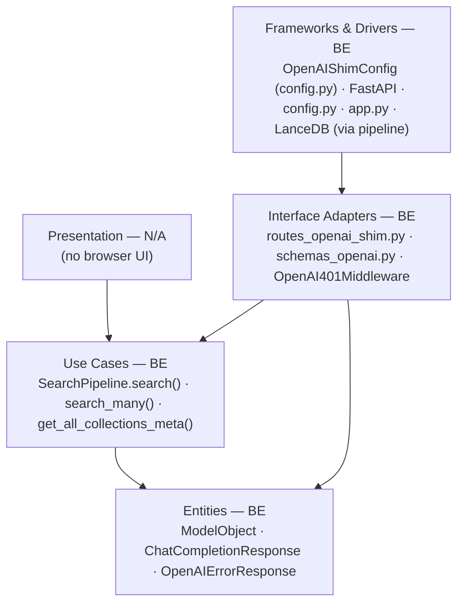
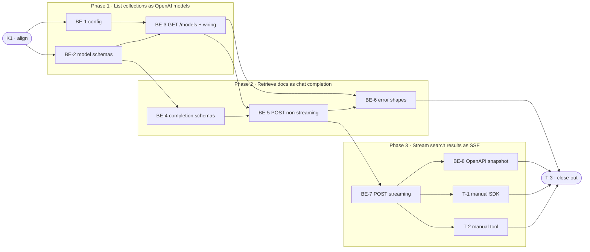

# G9 · OpenAI-Compatible API Shim — Team Plan

**How to read this file**
- **Architecture approach:** Clean Architecture — default fallback; no override skill requested. **Layers:** Presentation · Use Cases · Interface Adapters · Entities · Frameworks & Drivers. Each task's first sub-bullet names the layer it touches.
- The **Frontend, Backend, and Tester** sections are the **depth view** — each role's work, grouped by layer.
- The **Task Breakdown** is the **order view** — every task is a single-role checkbox in execution order, opening with a dependency graph.
- **Phases are vertical slices**: each delivers a working end-to-end increment, not a horizontal layer. No separate "integrate" phase. Sliced with the **`vertical-slicer` skill**.
- Each task carries the **role tag at the end of its title line**, then sub-bullets: **layer · estimate** (decimal hours), **needs · completes**, and a **Tests** block.
- **Tests** are tagged by level. **Unit and integration tests belong to the implementing dev** (test-first, in each task's `Tests` block); **e2e and manual tests are the tester's tasks**.
- **Contracts** are authored as linked TypeSpec files — HTTP/API seams as TypeSpec HTTP services with emitted `openapi.yaml`; the internal config seam as a core-construct `.tsp`.
- **Role tags** (`#frontend-role`, `#backend-role`, `#tester-role`) mark each task and role section.
- IDs (`S#`, `C#`, `BE-#`/`K#`/`T-#`, `Q#`) are the traceability thread.
- **Rule:** edit your own tasks freely; change a contract only by team agreement.

---

## Background

Archon has a native REST API and an MCP endpoint for search, but no OpenAI-compatible surface. Developers using Cursor, Continue.dev, LangChain, or LlamaIndex can point those tools at an OpenAI-compatible endpoint without writing integration code — the tools already know the OpenAI chat format. Archon does not speak that format, so even when it has exactly the right documents, the developer cannot get their tool to search them without custom glue code.

---

## Goal

After this feature ships: a developer changes one URL and one model name in their AI tool, and their tool retrieves from Archon's document collections automatically — no custom integration code, no extra credentials, no second server. `GET /v1/models` returns one model per collection; `POST /v1/chat/completions` extracts the last user message as a search query and returns the top-k matching chunks as the assistant's reply.

---

## Scope

### In Scope
- `GET /v1/models` — one synthetic model entry per collection (`archon-search/{name}`) plus a catch-all `archon-search` entry.
- `POST /v1/chat/completions` — last user message → query → top-k retrieved chunks as `choices[0].message.content`.
- Model name routing: `model="archon-search"` calls `get_all_collections_meta` + `search_many` (up to `max_fanout` collections; excess silently omitted with a WARNING); `model="archon-search/{col}"` calls `search` on that collection directly.
- Streaming (`stream: true`) — one SSE event per retrieved chunk via `StreamingResponse`; `data: [DONE]` terminal frame.
- Source citations appended to each chunk when `inject_citations = true` (default on): `\n\nContext:\n{chunk.text}\n[Source: {source_path}]`.
- Same Bearer token auth as all other Archon routes — no new credentials.
- OpenAI-shaped error responses (`{"error": {"message": ..., "type": ...}}`) on all `/v1/*` paths, including 401 rewrites.
- New `[openai_shim]` config section, disabled by default (`enabled = false`).
- `/v1` mounts on the existing REST port — no second server process.

### Out of Scope
- `/v1/embeddings` endpoint (separate feature).
- LLM generation — Archon returns retrieved context only.
- Sub-folder scoping within a single collection (deferred).
- Rate-limiting headers (`x-ratelimit-*`).
- `[openai_shim].collection_aliases` config (future iteration).
- System message convention for path scoping (future iteration).

---

## Acceptance criteria
- `GET /v1/models` with valid auth returns one entry per namespace-visible collection plus `archon-search` catch-all.
- `POST /v1/chat/completions` with `model="archon-search/my-col"` returns retrieved chunks as the assistant reply.
- `POST /v1/chat/completions` with `model="archon-search"` routes across namespace-visible collections (up to SearchConfig.max_fanout; excess silently omitted with a WARNING).
- `stream: true` returns one `data: {...}` SSE event per chunk followed by a stop frame and `data: [DONE]`.
- `inject_citations = true` (default) appends `[Source: {source_path}]` per chunk.
- Auth failure returns `401` with body `{"error": {"message": ..., "type": "authentication_error"}}`.
- Unknown collection returns `404` with body `{"error": {"message": ..., "type": "invalid_request_error"}}`.
- Unrecognized model prefix returns `404` with body `{"error": {"message": ..., "type": "invalid_request_error"}}`.
- `messages: []` or no user message returns `422` with OpenAI error shape.
- A namespace-scoped token cannot access another namespace's collections via the shim.
- `[openai_shim] enabled = false` (default) leaves no `/v1` routes registered.
- OpenAI Python SDK `openai.OpenAI(base_url=...).chat.completions.create(...)` succeeds without schema errors.
- All tests pass with zero new warnings; existing tests unaffected.

---

## What does NOT change
- Existing REST routes (`/search`, `/collections`, `/graph`, etc.) — untouched.
- MCP endpoint — untouched.
- Auth middleware `APIKeyMiddleware` — no changes to `_EXEMPT_PATHS` or `validate_token_and_get_namespace`; the shim adds a thin Starlette middleware only for `/v1/*` 401 response body rewriting.
- `SearchPipeline.search()`, `search_many()`, `get_all_collections_meta()` — consumed as-is; no signature changes.
- Existing deployments — `enabled = false` default ensures zero impact until an operator opts in.

---

## Known limitations / accepted trade-offs
- Token usage fields always zero (`prompt_tokens`, `completion_tokens`, `total_tokens` = 0); Archon is retrieval, not generation — no tokenizer dependency added.
- Streaming sends one SSE event per retrieved chunk, not one per token — matches what Cursor/Continue.dev actually need and avoids unnecessary complexity.
- `model="archon-search"` uses `search_many()` across all namespace-visible collections, not the centroid-based `MultiCollectionRouter` — avoids instantiating the router and its embedding overhead in the shim handler.
- The `GET /v1/models` `created` field is set to `0` (epoch) for all entries — this is inconsistent with completions which use `int(time.time())`; accepted as a trade-off (Archon's `CollectionMeta.last_indexed` is optional and using epoch is simpler than a per-collection timestamp).
- The `top_k` request field (if included) is accepted but has no effect — the pipeline uses its construction-time top_k setting.
- The `[openai_shim] top_k` config field is accepted but currently not forwarded to the pipeline; it is reserved for a future release when `search()` and `search_many()` support a runtime top_k parameter. The pipeline uses its construction-time top_k setting.
- Collections using non-default embedding models are silently excluded from `model='archon-search'` fanout results (they appear in `SearchPipelineResult.excluded_collections`); a WARNING is logged naming each excluded collection's `name` and `reason`, but the caller receives no indication.
- Content arrays (`content: [{"type": "text", "text": "..."}]`) are not supported — `ChatMessage.content` is typed as `str`; clients that send array content receive a 422.
- Auth 500 from `INVALID_NAMESPACE_SENTINEL` path in `middleware_auth.py` is not rewritten by `OpenAI401Middleware` (which only intercepts 401 responses); a token validation hit on the sentinel produces a bodyless 500 in FastAPI default shape — this is an accepted gap.
- An empty collection name (`model="archon-search/"`, trailing slash) returns 404 with the same OpenAI error message as a genuinely nonexistent collection — this is intentional; the empty-string lookup fails identically.
- The 404 response for an unrecognized model prefix (`model="gpt-4"`) uses the same `type: invalid_request_error` as a nonexistent collection — clients that need to distinguish these two 404 cases must inspect the `message` text.
- When `enabled = false` (default), `/v1/*` paths are not registered — a request with a missing or invalid Bearer token reaches the auth middleware before routing and returns a bodyless `401`, not the plain `404 {"detail": "Not Found"}` of S14. S14 covers the case of *valid* auth with disabled shim.

---

## Approach & architecture

The shim is a thin Interface Adapter layer: a new `routes_openai_shim.py` module registers two routes under `/v1` on the existing FastAPI app (guarded by `config.openai_shim.enabled`). It delegates all retrieval to `SearchPipeline` (Use Cases layer), uses new OpenAI-shaped Pydantic models (`schemas_openai.py` — Entities layer), and reads its config from a new `OpenAIShimConfig` dataclass (Frameworks & Drivers). The 401 auth body is rewritten by a path-scoped Starlette middleware added at `create_app()` time.

**Layer map (and role mapping)**

| Layer | Role | Components |
|-------|------|-----------|
| Presentation | **Frontend** | N/A — no browser UI |
| Use Cases | Backend | `SearchPipeline.search`, `search_many`, `get_all_collections_meta` in `pipeline.py` |
| Interface Adapters | Backend | `routes_openai_shim.py` (new), `schemas_openai.py` (new), `OpenAI401Middleware` (new) |
| Entities | Backend | `ModelObject`, `ModelList`, `ChatCompletionRequest`, `ChatCompletionResponse`, `OpenAIErrorResponse` in `schemas_openai.py` |
| Frameworks & Drivers | Backend | `OpenAIShimConfig` in `config.py`, `app.py` wiring (`include_router`, `OpenAI401Middleware` mount), `config.py` TOML parsing |

**What changes**
- `config.py` — new `OpenAIShimConfig` dataclass and `openai_shim` field on `SearchConfig` with `_apply_toml` block.
- `app.py` — `include_router(openai_shim_router, prefix="/v1")` and `add_middleware(OpenAI401Middleware)` are each inside their own `if config.openai_shim.enabled:` guard (two separate guards in different regions of `app.py`); `OpenAI401Middleware` added AFTER `APIKeyMiddleware` (Starlette LIFO — last added is outermost, so it intercepts the 401 response before it reaches the client). Note: these two guards cannot be a single contiguous block in `app.py` due to its structure (middleware is registered before `app.state.config` is set); they are two separate `if config.openai_shim.enabled:` guards — one for `add_middleware` and one for `include_router`.
- New `archon_search/server/routes_openai_shim.py` — `GET /models` and `POST /chat/completions`.
- New `archon_search/server/schemas_openai.py` — all OpenAI-shaped Pydantic models.
- `tests/server/openapi_snapshot.json` — regenerated after route addition.
- `tests/test_config_defaults.py` — snapshot updated for `openai_shim` field.
- `tests/path_home_allowlist.txt` — line number updated if config.py lines shift above `Path.home()`.

**Key decisions (from the brief)**
- `model` name encodes routing target: `archon-search/{col}` → direct; bare `archon-search` → all-collections fanout.
- Streaming sends one SSE event per chunk (not per token); tools concatenate `delta.content` and work correctly.
- Disabled by default: zero impact on existing deployments until operator opts in.
- No second process: `/v1` mounts on the existing REST port alongside all other routes.

---

## Contracts / seams

Boundaries where roles must agree. **Logical, not code.** TypeSpec is available (v1.13.0) — HTTP/API seams are authored as TypeSpec HTTP services; the internal config seam is a core-construct `.tsp`.

**C1 — GET /v1/models response shape** *(HTTP/API seam — client ↔ server)*
One `ModelObject` per namespace-visible collection (id=`"archon-search/{name}"`), plus one catch-all entry (`id="archon-search"`), wrapped in a `ModelList`. Bearer auth required; 401 returns `OpenAIErrorResponse`.
See [`api-contracts/openai-shim-models-api.tsp`](api-contracts/openai-shim-models-api.tsp) + [`api-contracts/openai-shim-models-api.openapi.yaml`](api-contracts/openai-shim-models-api.openapi.yaml)
- Realised by: BE-2, BE-3 · Verified by: BE-3 (integration tests), T-2 (manual)

**C2 — POST /v1/chat/completions request / response shape** *(HTTP/API seam — client ↔ server)*
Request: `{model, messages, stream?, top_k?}` (note: `top_k` is accepted for forward compatibility but has no effect — the pipeline uses its construction-time top_k setting). Non-streaming response: `{id, object, created, model, choices[{index, message:{role:"assistant",content}, finish_reason:"stop"}], usage:{0,0,0}}`. Streaming: `text/event-stream`, one `data: {…delta.content…}` event per chunk, then a stop frame, then `data: [DONE]`. Errors always use `{"error": {"message", "type", "param?", "code?"}}`.
See [`api-contracts/openai-shim-chat-api.tsp`](api-contracts/openai-shim-chat-api.tsp) + [`api-contracts/openai-shim-chat-api.openapi.yaml`](api-contracts/openai-shim-chat-api.openapi.yaml)
- Realised by: BE-4, BE-5, BE-6, BE-7 · Verified by: BE-5, BE-6, BE-7 (integration tests), T-1 (manual)

**C3 — OpenAIShimConfig** *(internal logical seam — config ↔ route handler)*
`OpenAIShimConfig { enabled: boolean; inject_citations: boolean; top_k: int32 }`. Default: `enabled=false`, `inject_citations=true`, `top_k=5`. Route handlers read this from `request.app.state.config.openai_shim`. Note: `top_k` is a config-level knob, not a per-request override. `search()` and `search_many()` do not accept it as a runtime parameter; the pipeline uses its own construction-time top_k.
See [`openai-shim-config.tsp`](openai-shim-config.tsp) (compiled clean with `tsp compile --no-emit`)
- Realised by: BE-1 · Verified by: BE-1 (unit + integration tests)

---

## Scenarios #tester-role

| id | Scenario (Given / When / Then) |
|----|-------------------------------|
| **S1** | **Given** shim enabled, valid auth, namespace has collections `["docs","code"]` · **When** `GET /v1/models` · **Then** 200, `data` contains `archon-search`, `archon-search/docs`, `archon-search/code` entries |
| **S2** | **Given** shim enabled, valid auth, namespace has zero collections · **When** `GET /v1/models` · **Then** 200, `data` contains only the `archon-search` catch-all entry |
| **S3** | **Given** shim enabled, `inject_citations=true`, `model="archon-search/docs"`, collection `docs` has matching chunks · **When** `POST /v1/chat/completions` (non-streaming) · **Then** 200, `choices[0].message.role="assistant"`, content contains chunk text and `[Source: …]` per chunk, `finish_reason="stop"`, usage zeros |
| **S4** | **Given** shim enabled, `model="archon-search"`, multiple collections · **When** `POST /v1/chat/completions` (non-streaming) · **Then** 200, chunks retrieved across all namespace-visible collections appear in the assistant reply (across up to `max_fanout` namespace-visible collections) |
| **S5** | **Given** `inject_citations=false`, valid collection, results · **When** `POST /v1/chat/completions` (non-streaming) · **Then** 200, content contains chunk text only — no `[Source: …]` lines |
| **S6** | **Given** valid model and collection, query matches zero documents · **When** `POST /v1/chat/completions` (non-streaming) · **Then** 200, `choices[0].message.content=""`, `finish_reason="stop"` |
| **S7** | **Given** `stream=true`, results present · **When** `POST /v1/chat/completions` · **Then** `Content-Type: text/event-stream`; one `data: {…delta.content…}` SSE event per chunk; a final `data: {…finish_reason:"stop"…}` frame; then `data: [DONE]` |
| **S8** | **Given** `stream=true`, zero results · **When** `POST /v1/chat/completions` · **Then** single `data: {…delta.content:""…finish_reason:"stop"…}` event then `data: [DONE]` — no hanging |
| **S9** | **Given** `model="archon-search/nonexistent"`, that collection does not exist in namespace · **When** `POST /v1/chat/completions` · **Then** 404, `{"error": {"message": "The model 'archon-search/nonexistent' does not exist.", "type": "invalid_request_error"}}` |
| **S10** | **Given** `model="archon-search"`, namespace has zero collections · **When** `POST /v1/chat/completions` · **Then** 404, `{"error": {"message": "No collections available.", "type": "invalid_request_error"}}` |
| **S11** | **Given** missing or invalid Bearer token · **When** any `/v1/*` request · **Then** 401, `{"error": {"message": "Incorrect API key.", "type": "authentication_error"}}` |
| **S12** | **Given** `messages=[]` or only system/assistant messages (no user role) · **When** `POST /v1/chat/completions` · **Then** 422, `{"error": {"message": "messages must contain at least one user message", "type": "invalid_request_error"}}` |
| **S13** | **Given** token scoped to `ns1`, `model="archon-search/ns2-col"` where that collection exists only in `ns2` · **When** `POST /v1/chat/completions` · **Then** 404 OpenAI error (namespace-filtered lookup returns `None`) |
| **S14** | **Given** `[openai_shim] enabled = false` (default) · **When** `GET /v1/models` or `POST /v1/chat/completions` · **Then** plain FastAPI `404 {"detail": "Not Found"}` — no `/v1` router registered |
| **S15** | **Given** shim enabled, valid auth, `model="archon-search"`, namespace has collections but ALL use non-default embedding models (all excluded by model mismatch) · **When** `POST /v1/chat/completions` · **Then** 200, `choices[0].message.content=""`, `finish_reason="stop"`, WARNING logged naming each excluded collection *(S15 was previously unassigned — assigned in this revision to the all-collections-excluded scenario)* |
| **S16** | **Given** `stream=true`, `inject_citations=false`, results present · **When** `POST /v1/chat/completions` · **Then** SSE delta events contain chunk text only — no `[Source: …]` lines in any event |
| **S17** | **Given** `model="gpt-4"` (any value not exactly `"archon-search"` or starting with `"archon-search/"`) · **When** `POST /v1/chat/completions` · **Then** 404, `{"error": {"message": "The model 'gpt-4' does not exist.", "type": "invalid_request_error"}}` |

---

## Frontend — Presentation #frontend-role

N/A — no frontend work for this feature. This is a purely server-side API addition; there is no browser UI, web component, or Swift view involved.

---

## Backend — Entities · Use Cases · Adapters · Frameworks #backend-role

**Scope:** all work for this feature. Writes unit and integration tests test-first for every task.
**Owns layers:** Entities, Interface Adapters, Frameworks & Drivers. (Use Cases layer — `SearchPipeline` — is consumed unchanged.)

**Tasks by layer** *(checkable in the Task Breakdown)*
- Entities: BE-2 — model-listing schemas · BE-4 — completion schemas
- Interface Adapters: BE-3 — GET /v1/models + app wiring · BE-5 — POST non-streaming · BE-6 — error shapes · BE-7 — POST streaming
- Frameworks & Drivers: BE-1 — OpenAIShimConfig · BE-8 — OpenAPI snapshot regen

**Done when**
- [ ] `GET /v1/models` returns namespace-scoped model list — S1, S2
- [ ] `POST /v1/chat/completions` (non-streaming) returns retrieved chunks as assistant reply — S3, S4, S5, S6, S15
- [ ] `POST /v1/chat/completions` (streaming) delivers one SSE event per chunk — S7, S8
- [ ] All error conditions return OpenAI-shaped error envelopes — S9, S10, S11, S12, S13, S17
- [ ] `[openai_shim] enabled = false` leaves no `/v1` routes registered — S14
- [ ] OpenAPI snapshot regenerated; all tests pass

---

## Tester #tester-role

**Scope:** the tester owns **manual** tests (T-1, T-2) plus the project **close-out** (T-3). All functional correctness (request/response shape, routing, auth, streaming, citations, error shapes, namespace isolation) is proven at integration level via `TestClient` and owned by the backend dev.

**Tasks** *(checkable in the Task Breakdown)*
- T-1 — Manual: OpenAI Python SDK compatibility (non-streaming + streaming)
- T-2 — Manual: Real tool (Cursor or Continue.dev) model picker + retrieval
- T-3 — Project close-out & acceptance fact-check

**Allocation** — each scenario at the cheapest level that proves it

| Scenario | Cheapest level |
|----------|---------------|
| S14 (shim disabled) | unit — app factory test, no routes registered |
| S1, S2 | integration — BE-3 tests with real `make_real_app` |
| S3, S4, S5, S6 | integration — BE-5 tests |
| S9, S10, S13, S15 | integration — BE-5 tests |
| S11, S12 | integration — BE-6 tests |
| S7, S8, S16 | integration — BE-7 tests (TestClient buffers full SSE body; parse `data:` lines) |
| S17 | integration — BE-5 tests (unrecognized model prefix → 404) |
| S3, S4, S7 (real SDK) | manual — T-1 (OpenAI SDK schema validation not caught by TestClient) |
| S1, S3 (real tool) | manual — T-2 (tool UI interaction not automatable) |

---

## Documentation update

- [ ] `Documentation/Backlog/openai-shim-brief.md` — no changes needed (source brief)
- [ ] `Documentation/Backlog/openai-shim-team-plan.md` — this file
- [ ] `archon-search.toml.example` — add `[openai_shim]` section with `enabled`, `inject_citations`, `top_k` and comments
- [ ] `Documentation/UserManual/02_configuration.md` — add `[openai_shim]` section to the TOML reference table
- [ ] `Documentation/UserManual/03_running_the_server.md` — note `/v1` co-mounts on existing port (mirrors MCP note)
- [ ] `Documentation/UserManual/05_searching.md` — cross-reference new `/v1/models` and `/v1/chat/completions` endpoints
- [ ] `Documentation/Architecture/600_api_reference_or_public_interface.md` — add `GET /v1/models` and `POST /v1/chat/completions` to the REST route table
- [ ] `Documentation/Architecture/110_component_catalog_and_layer_breakdown.md` — add `routes_openai_shim.py` and `schemas_openai.py`
- [ ] `CLAUDE.md` — update server section to mention OpenAI shim mount and `openai_shim.enabled` flag
- [ ] `BREAKING.md` — no breaking changes (new endpoints, disabled by default; note for awareness)

---

## Open questions

| id | Area | Resolution |
|----|------|-----------|
| **Q1** *(resolved)* | errors | `GET /v1/models` returns the same OpenAI-shaped 401 as completions on auth failure — `OpenAI401Middleware` applies to ALL `/v1/*` paths including `/v1/models` (S11 covers this). |
| **Q2** *(resolved)* | streaming | `inject_citations=true` appends `[Source: …]` inline to each chunk's SSE delta — not a consolidated final event. Matches the non-streaming format and simplifies the implementation (S7, S16 cover this). |
| **Q3** *(resolved)* | routing | When `model='archon-search'` and the namespace has more than `request.app.state.config.max_fanout` collections (root `SearchConfig.max_fanout`, default 8), the handler CAPS the collection list to `max_fanout` items server-side (log a WARNING naming the omitted collections) and proceeds with retrieval. The shim intentionally truncates (not rejects) at `max_fanout` — this differs from every other Archon route that caps fanout with a 422; the choice is deliberate to match OpenAI client expectations of graceful degradation. The client is not told; the operator sees the WARNING in logs. |
| **Q4** *(resolved)* | OpenAPI | `/v1/*` routes appear in `GET /openapi.json` (`include_in_schema=True`). However, the shim routes do NOT declare `responses={404: ...}` or any error-response model on route decorators — error shapes are handler-side returns without schema declarations. This prevents the global `test_error_schemas_documented` guard from seeing a non-`detail` 404. |

*Resolved in this revision: "choices[0].message.role" = "assistant" (OpenAI spec, no question); "finish_reason" = "stop" (custom value breaks clients); token usage = zeros (retrieval system, no tokenizer dependency); "id" field format = "chatcmpl-{uuid4}"; shim disabled behavior = plain FastAPI 404 (mirrors MCP pattern); error format = handler-side for 404/422, middleware rewrite for 401 (cleanest separation).*

---

## Task Breakdown

Single-role tasks in execution order, grouped into vertical slices.

### Dependency graph

### Phase 0 · Kickoff *(prerequisite; the one cross-cutting step)*
- [ ] **K1** — Agree the Contracts (C1, C2, C3) and Scenarios with the team #team
    - — · 1.0h
    - completes C1, C2, C3
    - Tests

### Phase 1 · List collections as OpenAI models *(walking skeleton: config foundation + GET /v1/models end-to-end)*

*A developer's tool calls `GET /v1/models` and receives a list of Archon collections as selectable model options. Carries the `OpenAIShimConfig` data foundation and all route registration infrastructure. Every later slice builds on this.*

- [ ] **BE-1** — Add `OpenAIShimConfig` dataclass to `config.py`; add `openai_shim` field to `SearchConfig`; add `_apply_toml` block; update `tests/test_config_defaults.py` snapshot; update `tests/path_home_allowlist.txt` line number if shifted #backend-role
    - Frameworks & Drivers · 3.0h
    - needs K1 · completes C3
    - Tests
        - #unit_test — `test_openai_shim_config_defaults` — `OpenAIShimConfig()` has `enabled=False`, `inject_citations=True`, `top_k=5`
        - #unit_test — `test_openai_shim_toml_parse` — `[openai_shim]\nenabled = true\n...` is parsed correctly into `SearchConfig.openai_shim`
        - #unit_test — `test_openai_shim_disabled_by_default` — `SearchConfig()` default has `openai_shim.enabled = False`
        - #integration_test — `test_config_snapshot_includes_openai_shim` — `test_all_defaults_snapshot` passes after adding `"openai_shim"` key

- [ ] **BE-2** — Create `archon_search/server/schemas_openai.py` with `ModelObject`, `ModelList`, `OpenAIError`, `OpenAIErrorResponse` #backend-role
    - Entities · 2.0h
    - needs K1 · completes C1 (schema shapes)
    - Tests
        - #unit_test — `test_model_object_serialization` — `ModelObject(id="archon-search/docs", ...)` serialises to the correct JSON keys
        - #unit_test — `test_openai_error_response_shape` — `OpenAIErrorResponse` serialises as `{"error": {"message": ..., "type": ...}}`
        - #unit_test — `test_model_object_created_is_zero` — `ModelObject` serialises with `created=0`; this is a deliberate trade-off (not a real timestamp)

- [ ] **BE-3** — Create `archon_search/server/routes_openai_shim.py` with `GET /models` handler; add thin `OpenAI401Middleware` that rewrites bodyless 401 responses to OpenAI error shape on `/v1/*` paths; wire router and middleware into `create_app()` — the `include_router` call and `add_middleware(OpenAI401Middleware)` are each inside their own `if config.openai_shim.enabled:` guard (two separate guards in different regions of `app.py`); `OpenAI401Middleware` is added AFTER `APIKeyMiddleware` (Starlette LIFO — last added is outermost, so it intercepts the 401 response before it reaches the client) #backend-role
    - Interface Adapters · 4.0h
    - needs BE-1, BE-2 · completes S1, S2, S14, C1
    - Tests
        - Note for the implementing dev: the new test file (e.g., `tests/server/test_routes_openai_shim.py`) must declare `pytestmark = [pytest.mark.integration, pytest.mark.xdist_group("openai_shim")]` at the top for correct xdist grouping.
        - #unit_test — `test_get_models_disabled_returns_404` — when `openai_shim.enabled=False`, no `/v1` router is registered; `GET /v1/models` returns plain 404
        - #unit_test — `test_get_models_returns_model_list_shape` — stub pipeline returns two collections; response shape matches `ModelList` with three entries (two per-collection + catch-all)
        - #integration_test — `test_get_models_with_collections` — `make_real_app` + ingest into two collections; `GET /v1/models` returns `archon-search`, `archon-search/col-a`, `archon-search/col-b`
        - #integration_test — `test_get_models_empty_namespace` — no ingest; `GET /v1/models` returns only `archon-search` catch-all entry
        - #unit_test — `test_middleware_401_shape` — `OpenAI401Middleware` rewrites a plain 401 on a `/v1/*` path to `{"error": {"message": "Incorrect API key.", "type": "authentication_error"}}`; assert exact message text

### Phase 2 · Retrieve docs as chat completion *(the core retrieval behavior: last user message → chunks as assistant reply)*

*A developer's question is sent as a chat message; Archon extracts it, runs retrieval, and returns the top-k chunks formatted as the assistant's reply. No streaming yet — that is slice 3.*

- [ ] **BE-4** — Add completion Pydantic models to `schemas_openai.py`: `ChatMessage`, `ChatCompletionRequest`, `ChatCompletionChoice`, `ChatCompletionUsage`, `ChatCompletionResponse` #backend-role
    - Entities · 2.0h
    - needs BE-2 · completes C2 (schema shapes)
    - Tests
        - #unit_test — `test_chat_completion_response_serialization` — `ChatCompletionResponse` serialises with `object="chat.completion"`, `choices[0].message.role="assistant"`, `usage` with three zero fields
        - #unit_test — `test_chat_completion_request_validation` — `ChatCompletionRequest(model="archon-search", messages=[])` is valid Pydantic; missing `messages` raises `ValidationError`
        - #unit_test — `test_chat_message_content_string_only` — `ChatMessage.content` must be typed as `str` (not `str | list`); this is a deliberate Archon simplification — the OpenAI spec allows array content but Archon's shim does not; add a comment in `schemas_openai.py` noting this limitation
        - #unit_test — `test_user_message_extraction_role_case` — last-user-message extraction matches `role == "user"` exactly (case-sensitive); `role="User"` is not extracted → 422

- [ ] **BE-5** — Implement `POST /v1/chat/completions` non-streaming path in `routes_openai_shim.py`: extract last `role="user"` message as query (422 if none found); parse `model` by splitting on the FIRST `/` only (`model.split('/', 1)`): `archon-search` (no slash) → fanout path; `archon-search/{col}` → extract collection as everything after the first slash (safe for collection names containing '/'); any model value that is neither exactly `'archon-search'` nor starts with `'archon-search/'` returns **404** with OpenAI error shape (message: "The model '{model}' does not exist.", type: "invalid_request_error"); for `model="archon-search/{col}"` call `pipeline.get_collection_meta` then `pipeline.search(query, col, namespace=ns, embedder=...)` (resolve embedder using the same pattern as `routes_search.py`: read `active_model = meta.active_embedding_model or config.embedding_model` (mirroring `routes_search.py`), call `embedder_cache.get_or_load(active_model)`, fall back to `pipeline._global_embedder` if cache absent); for the direct path (`model="archon-search/{col}"`), wrap `pipeline.search()` in `asyncio.wait_for(..., timeout=_SEARCH_TIMEOUT_SECONDS)` matching the pattern in `routes_search.py` — map `asyncio.TimeoutError` to 504 with OpenAI error shape (`{"error": {"message": "Request timeout.", "type": "server_error"}}`); for the fanout path, `search_many()` raises `FanoutTimeoutError` internally — catch it and map to 504 (do NOT wrap `search_many` in `asyncio.wait_for` — it manages its own timeout); `_SEARCH_TIMEOUT_SECONDS` is a private constant in `routes_search.py` — import it from there or define an equivalent constant locally in `routes_openai_shim.py`; also catch `MetadataLookupError` — map to OpenAI-shaped error envelope (503); for `model="archon-search"` call `pipeline.get_all_collections_meta(ns)` to obtain `col_names` (this fetch is needed for the fanout cap; note that `search_many` will re-fetch metadata internally — two fetches per request is expected), then before calling `search_many()`, if `len(col_names) > request.app.state.config.max_fanout` (root `SearchConfig.max_fanout`, NOT `openai_shim.max_fanout`), cap `col_names` to the first `max_fanout` items and log a WARNING listing the omitted collection names; call `pipeline.search_many(query, col_names, namespace=ns)` (second arg is positional; the parameter is named `collections` — do NOT use `col_names=` as a keyword); wrap the `search_many` call in a `try/except CollectionNotFoundError` and return a 404 OpenAI error if it fires (a collection may be deleted between the two metadata fetches); after `search_many()` returns, check `result.excluded_collections` — if non-empty, log a WARNING naming each excluded collection's `name` and `reason` (matches the existing pipeline pattern); return OpenAI 404 error when collection missing or collection list empty; format `SearchResult.text` and `source_path` into assistant content; `inject_citations` config gates citation appending; return `ChatCompletionResponse` with `id="chatcmpl-{uuid4}"`; also wrap the direct `pipeline.search()` call in a broad `except Exception` (matching `routes_search.py:273-275`) to catch any store-level exception and return a **503** OpenAI error shape (ensures ALL /v1/* error responses use the OpenAI envelope, not FastAPI's native `{"detail": ...}`; 503 aligns with how the existing search route maps generic store failures); the shim intentionally truncates (not rejects) at `max_fanout` — this differs from every other Archon route that caps fanout with a 422; the choice is deliberate to match OpenAI client expectations of graceful degradation #backend-role
    - Interface Adapters · 8.0h
    - needs BE-3, BE-4 · completes S3, S4, S5, S6, S9, S10, S13, S15, S17, C2
    - Tests
        - #unit_test — `test_extract_last_user_message` — messages with mixed roles; last user message is extracted as query
        - #unit_test — `test_format_chunks_with_citations` — `inject_citations=True` wraps each chunk as `\n\nContext:\n{text}\n[Source: {path}]`
        - #unit_test — `test_format_chunks_no_citations` — `inject_citations=False` returns chunk text only
        - #unit_test — `test_zero_results_returns_empty_content` — empty `SearchPipelineResult.results` produces `content=""`, `finish_reason="stop"`
        - #unit_test — `test_unknown_collection_returns_openai_404` — `model="archon-search/ghost"`, `get_collection_meta` returns `None`; response is `{"error": {"message": ..., "type": "invalid_request_error"}}`; assert `response["error"]["message"] == "The model 'archon-search/ghost' does not exist."`
        - #unit_test — `test_no_collections_returns_openai_404` — `model="archon-search"`, `get_all_collections_meta` returns `[]`; response is 404 OpenAI error; assert `response["error"]["message"] == "No collections available."`
        - #integration_test — `test_chat_completions_direct_collection` — ingest doc into `my-col`; `POST /v1/chat/completions` with `model="archon-search/my-col"` returns 200 with retrieved text in `choices[0].message.content`
        - #integration_test — `test_chat_completions_router_path` — two collections with docs (same embedding model); `model="archon-search"` returns 200; assert `result.excluded_collections` is empty for both collections (proves both were searched, avoids brittle content-matching assertions that depend on similarity scores)
        - #integration_test — `test_namespace_isolation_returns_404` — ns1 token, `model="archon-search/ns2-col"` where fixture MUST ingest `ns2-col` into namespace ns2 (not merely omit it); query with ns1 token to prove namespace filtering, not just unknown-collection 404; `get_collection_meta` returns `None` (namespace-filtered); handler returns 404 OpenAI error
        - #unit_test — `test_embedder_resolution_uses_collection_model` — when `meta.active_embedding_model` differs from global model, the correct per-collection embedder is resolved and passed to `pipeline.search()`
        - #unit_test — `test_fanout_cap_truncates_and_warns` — namespace returns more than `request.app.state.config.max_fanout` collections; handler slices col_names to max_fanout, logs WARNING; assert omitted collection names appear in the caplog WARNING message; retrieval proceeds normally
        - #unit_test — `test_fanout_cap_exact_boundary_passes` — namespace returns exactly `max_fanout` collections (not more); no WARNING is logged; all `max_fanout` collections are searched; fanout cap guard uses `>` not `>=`
        - #unit_test — `test_search_many_collection_not_found_returns_404` — `search_many` raises `CollectionNotFoundError` (race: collection deleted between meta-fetch and search); handler catches it and returns 404 OpenAI error
        - #unit_test — `test_unrecognized_model_returns_404` — model="gpt-4"; response is 404 OpenAI error; assert response["error"]["message"] == "The model 'gpt-4' does not exist."
        - #unit_test — `test_direct_search_timeout_returns_openai_504` — direct path (model="archon-search/{col}"): asyncio.wait_for raises asyncio.TimeoutError; handler returns 504 with OpenAI error shape
        - #unit_test — `test_fanout_timeout_returns_openai_504` — `search_many` raises `FanoutTimeoutError`; handler returns 504 with OpenAI error shape
        - #unit_test — `test_metadata_lookup_error_returns_openai_503` — `get_all_collections_meta` raises `MetadataLookupError`; handler returns 503 with OpenAI error shape
        - #unit_test — `test_direct_search_store_error_returns_openai_503` — pipeline.search raises an unexpected store error; handler returns 503 with OpenAI error shape (not FastAPI's `{"detail": ...}`); aligns with `routes_search.py:273-275`
        - #integration_test — `test_all_collections_excluded_returns_empty_200` — namespace has two collections both on non-default embedding models; `model="archon-search"`; result is 200 with `content=""`, `finish_reason="stop"`; WARNING log names both excluded collections (assert via caplog); assert each excluded collection's `name` appears in the caplog WARNING message
        - #unit_test — `test_top_k_request_field_ignored` — POST with `{"top_k": 99}` alongside mocked pipeline; assert pipeline is called with the construction-time top_k, not the request-supplied value
        - #unit_test — `test_trailing_slash_model_returns_404` — model="archon-search/" (trailing slash → empty collection name); handler returns 404 OpenAI error (empty string fails `get_collection_meta` lookup)

- [ ] **BE-6** — Auth and validation error shapes: verify `OpenAI401Middleware` correctly rewrites bodyless 401 responses to OpenAI error shape on `/v1/*` paths; add FastAPI `RequestValidationError` exception handler added at the app level (FastAPI does not support router-scoped exception handlers); filter by path prefix (`request.url.path.startswith('/v1/')`) inside the handler to rewrite only shim 422 errors while leaving existing routes' `{"detail": [...]}` shape intact; the `RequestValidationError` exception handler registration MUST also be inside the `if config.openai_shim.enabled:` guard in `app.py` (alongside the router include guard) — when `enabled=false`, no exception-handler changes are installed #backend-role
    - Interface Adapters · 2.0h
    - needs BE-3, BE-5 · completes S11, S12
    - Tests
        - #integration_test — `test_auth_failure_returns_openai_401` — request with invalid token; `OpenAI401Middleware` rewrites to `{"error": {"message": ..., "type": "authentication_error"}}`; assert `response["error"]["message"] == "Incorrect API key."`
        - #integration_test — `test_empty_messages_422_openai_shape` — `messages=[]`; response is 422 with OpenAI error shape (not FastAPI's `{"detail": [...]}`); assert `response["error"]["message"] == "messages must contain at least one user message"`
        - #integration_test — `test_handler_422_no_user_message` — POST with `messages=[{"role":"system","content":"..."}]` (valid JSON, no user role); 422 with OpenAI error shape
        - #integration_test — `test_pydantic_422_missing_model_field` — POST with malformed body (missing required "model" field); 422 with OpenAI error shape (not FastAPI's `{"detail": [...]}`)
        - #integration_test — `test_existing_route_422_shape_unchanged` — after BE-6 wiring, `POST /search` with a missing required field still returns FastAPI's native `{"detail": [...]}` shape (not the OpenAI shape); run with `openai_shim.enabled=True` — the shim is enabled, the `RequestValidationError` handler IS installed, but a non-/v1/ route still gets FastAPI's native shape; this proves the path-prefix filter works
        - #unit_test — `test_validation_error_handler_absent_when_disabled` — when `openai_shim.enabled=False`, a POST to `/search` with a missing required field returns FastAPI's native `{"detail": [...]}` shape (proves the handler was not installed)

### Phase 3 · Stream search results as SSE *(one SSE event per retrieved chunk)*

*The developer's tool sets `stream=true`; Archon returns each document chunk as a separate SSE event as it arrives. After this slice, the full feature is shippable.*

- [ ] **BE-7** — Add streaming branch to `POST /v1/chat/completions` in `routes_openai_shim.py`: when `stream=True`, run retrieval identically to non-streaming; return `StreamingResponse` with `media_type="text/event-stream"`; async generator yields one `data: {…delta.content…}` SSE event per chunk (with citations inline when enabled), then a `data: {…finish_reason:"stop"…}` frame, then `data: [DONE]\n\n`; zero-result case sends single empty delta + stop + [DONE]; each SSE data frame must match: `{"id": "chatcmpl-{same-uuid}", "object": "chat.completion.chunk", "created": {unix-ts}, "model": {model-field-from-request}, "choices": [{"index": 0, "delta": {"role": "assistant", "content": "{chunk-text}"}, "finish_reason": null}]}`; the final stop frame: same structure but `"delta": {}` and `"finish_reason": "stop"`; the first delta MUST include `"role": "assistant"` in the `delta` field; frames 2..N MUST NOT include a `role` key in `delta` (only the first frame carries `role='assistant'`); use `int(time.time())` for the `created` field (OpenAI spec requires integer Unix timestamp, not float); Note: the fanout cap and all error handling (including timeout) apply equally to the streaming path — the collection list is capped before retrieval; retrieval results MUST be awaited and materialized to a list in the handler body (not inside the async generator) before the `StreamingResponse` is opened — this ensures a 404 or 504 can be returned as a plain JSON response rather than a broken SSE stream #backend-role
    - Interface Adapters · 4.0h
    - needs BE-5 · completes S7, S8, S16
    - Tests
        - #unit_test — `test_stream_generator_yields_sse_events` — three chunks; generator yields three data events + stop frame + [DONE] — also collect `id` from all frames, assert `len(set(ids)) == 1` (same id across all frames)
        - #unit_test — `test_stream_zero_results_single_event` — empty results; generator yields one empty delta + stop frame + [DONE]
        - #unit_test — `test_stream_event_format` — each data frame parses as valid JSON with `object="chat.completion.chunk"`, `choices[0].delta` with `role="assistant"` on first frame only, assert frames 2..N have NO `role` key in `delta`, `finish_reason=null` on content frames, `finish_reason="stop"` on stop frame, assert stop frame's `choices[0]['delta'] == {}` (not just `finish_reason='stop'`), assert `created` is an `int` (use `int(time.time())`, not bare `time.time()` which returns a float)
        - #unit_test — `test_stream_no_citations` — `inject_citations=False`; generator yields delta events containing chunk text only with no `"[Source:"` lines
        - #unit_test — `test_stream_citations_inline` — `inject_citations=True`; generator yields delta events where each content includes `"\n\nContext:\n{text}\n[Source: {path}]"`
        - #integration_test — `test_streaming_returns_sse_events` — `make_real_app` + ingest; `POST /v1/chat/completions {"stream": true}`; parse `resp.text.split("\n")` for `data:` lines; verify one event per result chunk plus stop frame plus [DONE]
        - #integration_test — `test_streaming_zero_results` — no matching docs; single empty delta event + stop + [DONE]; response does not hang
        - #unit_test — `test_streaming_race_collection_deleted` — mock pipeline.search_many to raise CollectionNotFoundError (simulating race: collection deleted after meta-fetch); with stream=True, response is JSON 404 (not a partial SSE body), confirming materialization before StreamingResponse; implement via monkeypatch on pipeline.search_many

- [ ] **BE-8** — Regenerate `tests/server/openapi_snapshot.json` with `uv run --python 3.12 pytest tests/server/test_openapi_snapshot.py --update-openapi-snapshot`; verify `test_no_empty_schemas_remain` passes (streaming route uses `response_class=StreamingResponse`, non-streaming declares `response_model=ChatCompletionResponse`); also check `test_error_schemas_documented` in `tests/server/test_openapi_schema.py` — the conflict is resolved by not declaring error response models on shim route decorators (see Q4). Verify `test_error_schemas_documented` passes without modification #backend-role
    - Frameworks & Drivers · 1.0h
    - needs BE-3, BE-5, BE-7 · completes (OpenAPI contract gate)
    - Tests
        - #integration_test — `test_openapi_snapshot_matches` — snapshot test passes after regen

- [ ] **T-1** — Manual: run `archon-search serve`, then `openai.OpenAI(base_url="http://localhost:{port}/v1", api_key=...).chat.completions.create(model="archon-search/{col}", messages=[{"role":"user","content":"..."}])` — confirm SDK does not raise on response schema; repeat with `stream=True` and iterate `delta.content` #tester-role
    - — · 2.0h
    - needs BE-7 · completes S3, S7 (via real SDK)
    - Tests
        - #manual_test — OpenAI SDK non-streaming — SDK parses response without schema errors; `choices[0].message.content` contains retrieved text
        - #manual_test — OpenAI SDK streaming — SDK iterates stream without errors; chunks arrive one by one with `delta.content`
        - #manual_test — OpenAI SDK auth failure — call SDK with an invalid `api_key`; verify SDK receives a structured error (not an exception from malformed body); response body is `{"error": {"message": ..., "type": "authentication_error"}}`

- [ ] **T-2** — Manual: configure Cursor or Continue.dev with `base_url=http://localhost:{port}/v1`, set model to `archon-search/{col}`, verify the model picker lists Archon collections, ask a question, verify retrieved context appears in the IDE response #tester-role
    - — · 2.0h
    - needs BE-7 · completes S1, S4 (via real tool)
    - Tests
        - #manual_test — Cursor model picker — Archon collections appear as selectable models in the IDE
        - #manual_test — Continue.dev retrieval — asking a question returns Archon chunk text as context

### Phase 4 · Close-out
- [ ] **T-3** — Project close-out & acceptance fact-check #tester-role
    - — · 4.0h
    - needs BE-6, BE-8, T-1, T-2 · completes (acceptance gate)
    - Tests
    - Duties
        - Update all documentation per the "Documentation update" section — `archon-search.toml.example`, UserManual docs, Architecture docs, `CLAUDE.md`, `BREAKING.md`.
        - Fix all build / compiler warnings, if any.
        - Run the full test suite (`uv run pytest`); fix every failing test, including any unrelated to this feature.
        - Validate every Acceptance criterion one-by-one with a fact check — no assumptions; confirm each is genuinely done.

**Critical path:** K1 → BE-1 → BE-3 → BE-5 → BE-7 → BE-8 → T-3 (25h on the critical path: K1=1h, BE-1=3h, BE-3=4h, BE-5=8h, BE-7=4h, BE-8=1h, T-3=4h; BE-2, BE-4 run in parallel with BE-1).
