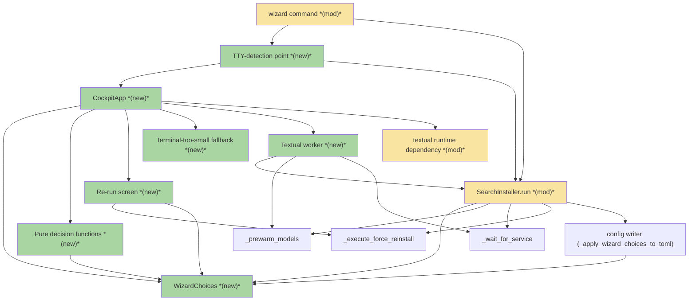
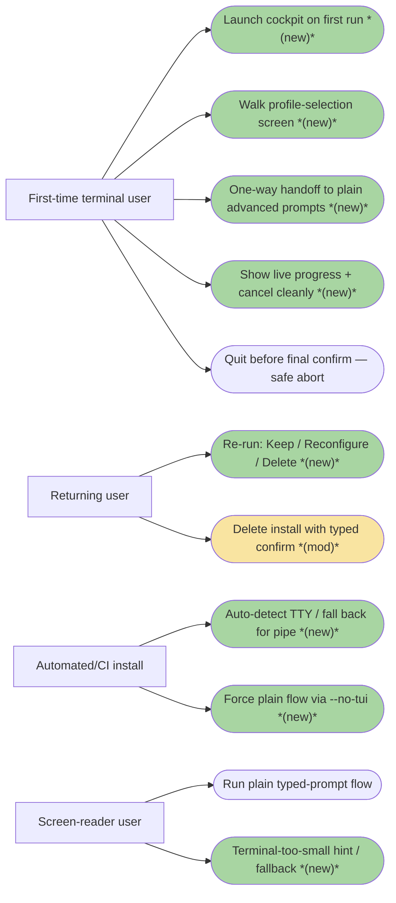
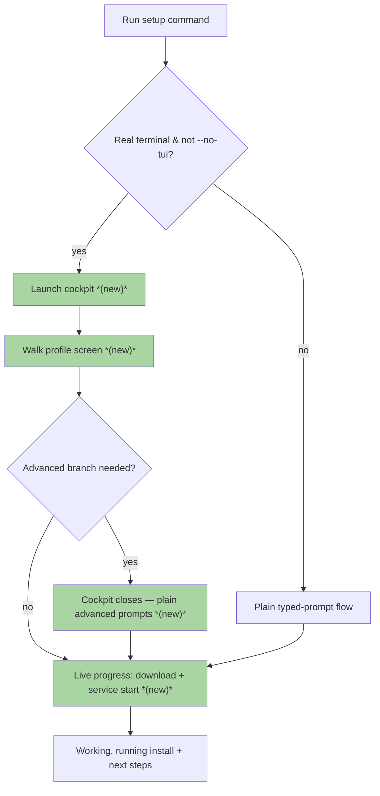
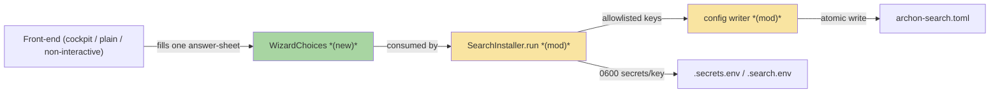
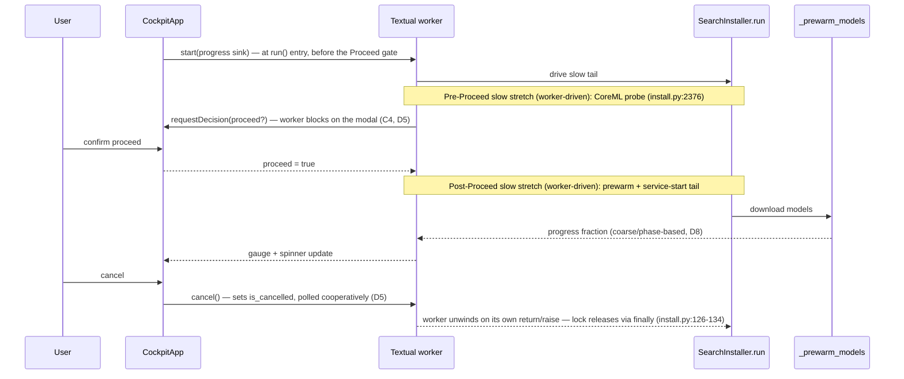

# TUISW · Interactive TUI Setup Wizard (the "Cockpit") — Team Plan

**How to read this file**
- **Architecture approach:** Clean Architecture (default). **Layers:** Presentation · Use Cases · Interface Adapters · Entities · Frameworks & Drivers — dependencies point inward. **Tier:** client-only CLI (no server tier).
- **Role mapping:** Presentation → **Frontend**; Use Cases, Interface Adapters, Entities, Frameworks & Drivers → **Backend**. Tester is cross-cutting.
- The **Frontend, Backend, and Tester** sections are the depth view — each role's scope, grouped by layer.
- **Contracts** are logical, authored as core-construct TypeSpec `.tsp` files beside this plan (this feature has no HTTP/API surface — every seam is in-process). Each `.tsp` compiles clean with `tsp compile <file> --no-emit`.
- **Role tags** (`#frontend-role`, `#backend-role`, `#tester-role`) mark each role-owned section.
- IDs (`S#` scenarios, `C#` contracts, `Q#` questions) are the traceability thread.
- **Tasks** are not in this file — task breakdown is a separate downstream step that consumes this plan.
- **Rule:** change a contract only by team agreement — once a slice ratifies it (D9); an unratified field/seam not yet touched by a slice is still open for design.

---

## Background

On first run a user runs the setup command and is met with a plain list of typed questions in [archon_search/install.py](../../archon_search/install.py) — functional, but forgettable. There is a Textual prototype under [examples/textual_design.py](../../examples/textual_design.py) (palette, gauges, spinners, two navigation messages) and two prototype screens ([examples/textual_calibration.py](../../examples/textual_calibration.py), [examples/textual_core_matrix.py](../../examples/textual_core_matrix.py)) that hold selection locally with no decision-return path — look-and-feel only, not wired into the CLI. `textual>=0.80` is a dev-group dependency in [pyproject.toml](../../pyproject.toml), not a runtime dependency.

---

## Goal

On first run, a person at a real terminal is dropped into a full-screen animated cockpit that walks them through the common setup choices (profile, non-English corpus, GPU acceleration, headline optional features) as animated screens, shows live progress during the slow download/service-start work with clean cancellation, and ends with a working, running install. Pipes, containers, automated runs, `--no-tui`, and screen readers silently get the existing plain typed-prompt flow, unchanged. Setup is delivered incrementally — slice 0 collects one decision (profile) in the cockpit and hands the rest to plain prompts — never leaving setup broken between steps.

---

## Scope

### In Scope
- A full-screen animated cockpit for the common first-run path, built on the existing prototype's look (palette, gauges, spinners).
- Automatic cockpit-vs-plain choice based on whether a real person is at a terminal (`isatty()`), plus a `--no-tui` switch to force the plain flow.
- One shared answer-sheet (`WizardChoices`) that the cockpit, the plain prompts, and automated mode all fill, feeding one install path — no duplicated setup rules.
- Live progress and clean cancellation during the slow download/service-start steps, releasing the install lock on cancel.
- A cockpit re-run screen (Keep / Reconfigure / Delete) for machines that already have the tool, with typed confirmation guarding deletion.
- Promote `textual>=0.80` from the dev group in [pyproject.toml](../../pyproject.toml) to a runtime dependency, so first-timers get the cockpit with no extra step.
- Delivered incrementally — slice 0 = cockpit collects the profile decision, hands the rest to existing plain prompts, drives a real install end to end.

### Out of Scope
- Cinematic screens for the rare advanced branches (provider pickers, license text) — these stay as plain prompts (one-way handoff).
- Perfectly seamless return to the cockpit after an advanced prompt — the handoff is a one-way door.
- Non-English cockpit text — English-only, matching the project's stance.
- Changing what setup configures — this feature changes *how* questions are asked, not the profiles, features, or resulting TOML.
- A headless/no-TUI opt-out packaging extra — floated for later, not this feature.

---

## Acceptance criteria
- A person at a real terminal gets the cockpit automatically; a pipe/container/automated run silently gets the plain flow.
- `--no-tui` forces the plain flow even at a real terminal; `--non-interactive` continues to use defaults with no prompts.
- The cockpit walks the common path (slice 0: profile) and drives a real install to a working, running service.
- When an advanced branch (provider picker, license accept) is triggered, the cockpit closes and those steps finish as plain prompts in the same run; the cockpit does not reopen.
- Slow work (model download, service start) shows a live gauge + spinner and can be cancelled cleanly, releasing the install lock — except a cancel landing after service registration but before readiness, which leaves a dangling service unit (see Known limitations; re-run heals it, S20).
- The re-run screen offers Keep / Reconfigure / Delete; deleting existing data requires an explicit typed confirmation. Keep is a no-op exit that writes nothing; Reconfigure idempotently re-writes the config (self-heals) — S18, S19.
- Quitting before the final confirmation performs no service registration and no models are downloaded, so there is no working install; the config TOML, its `.bak`, and any GPU provider config written earlier REMAIN on disk (only the graph / multilingual / query-expansion feature flags are reverted) — that is the safe-abort guarantee, and the residual config/.bak/GPU-provider files, empty dirs, released lock, and harmless partial model caches are all acceptable (D6). This "no working install" guarantee covers pre-Proceed cancellation only; a cancel after Proceed — specifically after service registration — has a separate, narrower guarantee (S20) — see Known limitations and S20. Separately, a fail-closed confirm (force-delete 595, Proceed 2414) hit by piped/EOF stdin aborts cleanly rather than crashing on an uncaught traceback — at 595 nothing is deleted (backup restored); at 2414 the same S11 residue applies (config/`.bak` written pre-Proceed REMAIN, only feature flags revert, no service, no models) — S21 (Q17).
- Terminal too small for the cockpit shows a "make the window bigger" hint or falls back to plain prompts, never a broken layout.
- The plain typed-prompt flow works exactly as before (EOF hardening on the confirm gates excepted — S21) and is the documented screen-reader-safe path.
- If `import textual` fails at runtime when the cockpit would otherwise be selected, setup falls back to the plain flow instead of crashing — S17.
- All three front-ends fill the one `WizardChoices` answer-sheet consumed by `SearchInstaller.run`.
- The ADR-10 split-CoreML GPU outcome is preserved through the cockpit path.
- All tests pass with zero warnings — a global gate checked at project close-out (Tester section), not tied to a per-scenario ID.

---

## What does NOT change
- What setup configures — profiles, feature set, and the resulting `archon-search.toml` are unchanged; only the asking changes. EOF failure handling on the confirm gates is hardened (Q17), not a change to what setup configures.
- The plain typed-prompt flow in [archon_search/install.py](../../archon_search/install.py) — extended to read from the answer-sheet, not rewritten.
- The existing `--non-interactive` semantics (defaults, no prompts) and the automated/CI install path.
- Config atomicity (`atomic_write_bytes`), the config-key allowlist in `_apply_wizard_choices_to_toml`, and the `[hyde]`/`[rag_fusion]` empty-string write-or-`del` rule.
- The advisory install lock (`_acquire_install_lock`) spanning the same work, released on exit/cancel.
- The delete-db typed-`yes` confirmation data-loss guard.
- No database/LanceDB schema change — `STORE_SCHEMA_VERSION` in [archon_search/store.py](../../archon_search/store.py) stays `1`.
- English-only setup text.

---

## Known limitations / accepted trade-offs
- The cockpit→plain-prompt handoff is a one-way door — no return to the cockpit after an advanced prompt (intentional; avoids flicker).
- Advanced branches (provider pickers, license text) stay as plain prompts for v1.
- Promoting `textual` to a runtime dependency grows the wheel footprint for headless/container users; a `[tui]`/`[headless]` opt-out extra is deferred (Q5 stands — not overturned). The S17 import-guard/fallback (D11: `import textual` failing routes to the plain flow) and the C3 routing already supporting textual-absent → plain make a `[tui]` extra viable to add later without further plumbing (D13).
- Slice 0 covers the profile decision only; remaining common-path screens grow incrementally.
- Slice-0 ordering (D13): `_prompt_multilingual` (install.py:2116) runs before `_select_profile` (install.py:2120), so "cockpit collects profile only" (Q7) isn't literally true without also pre-filling `multilingual` or reordering. Slice 0 pre-fills a `multilingual` default on the sheet; it is still a vertical walking skeleton.
- Real-time animation smoothness, live download-gauge fidelity, and live terminal-resize are verifiable only manually. The progress `fraction` itself is coarse/phase-based (possibly indeterminate) during `_prewarm_models` model download, which has no progress-callback surface (D8) — the gauge cannot promise smooth motion there, only step-granular movement.
- Cancel is cooperative and observed only between install phases (Q4); an in-flight model download or service registration completes (or times out) before the worker observes the cancel — a corollary of wrapping the synchronous tail unchanged. A cancel while the worker is blocked in `requestDecision` (waiting on a modal answer) is likewise unobserved until the modal is answered.
- A cancel landing after `write_service_file()` (install.py:2525) but before `_wait_for_service` (install.py:2534) completes leaves a durable, registered-but-not-ready launchd/systemd service unit — this is a real side effect the safe-abort guarantee does not cover, since it happens post-Proceed, after service registration. Re-run must detect and heal/overwrite this dangling registration — S20.

---

## Approach & architecture

The cockpit is added as a **face on top of** the existing installer (strangler pattern): the plain flow stays the always-works foundation, and the highest-leverage prerequisite is prising the setup decisions apart from the question-asking so all three front-ends share one answer-sheet. The seams fall on Clean Architecture layer boundaries — a new Presentation front-end (Textual cockpit) and a decision/asking split in the Use Cases layer, both feeding the `WizardChoices` Entity that `SearchInstaller.run` consumes.

**Target state, not current structure (D10):** the layer map below is the TARGET decomposition the strangler refactor works toward, not a description of the code today. `SearchInstaller.run` (install.py:2065-2577, ~510 lines) is currently a single monolithic method that interleaves Presentation work (inline `input()` calls at 2308/2414), Interface-Adapters work (inline TOML writes at 2370-2374/2480-2483), and Frameworks-&-Drivers work (subprocess installs 2426-2463, service registration 2525) in one call stack. The seams the layer map names do not pre-exist — they are carved out incrementally, slice by slice. The "affected area spans 40+ components" hedge (below) is re-baselined on this: most of that footprint is inside the one monolithic method, not spread across already-separated modules.

### Architecture

_Scope limited to change neighbourhood: the affected area spans 40+ components across all five layers; shown are the new/modified components plus the key install-orchestration neighbours they touch. The per-helper unwelding (`_select_profile`, `_prompt_multilingual`, `_prompt_gpu_confirm`, `_prompt_optional_features`, `_prompt_provider`, and the welded pickers/license gates) is represented by the single `Pure decision functions` node._

| Component | Change | Why |
|-----------|--------|-----|
| `CockpitApp` | new | The production Textual app; the full-screen cockpit front-end (prototypes live under [examples/](../../examples/textual_design.py) only) |
| `TTY-detection point` | new | Single `isatty()` decision routing to cockpit / plain-interactive / non-interactive; `--no-tui` overrides it |
| `--no-tui flag` | new | Forces the plain flow at a real terminal (orthogonal to `--non-interactive`) |
| `Re-run screen` | new | Keep / Reconfigure / Delete over the existing data-loss guard, with typed delete confirm |
| `Terminal-too-small fallback` | new | "Make the window bigger" hint or plain-prompt fallback below a minimum size |
| `Pure decision functions` | new | Decision logic split out of each `_prompt_*/_select_*/_pick_*`, taking an injected asker |
| `Textual worker` | new | Drives the synchronous slow tail off the UI thread, streams progress, cancels cleanly |
| `WizardChoices` | new | The one answer-sheet all three front-ends fill and `run()` consumes |
| `wizard command` | modified | Gains the TTY-detection point and `--no-tui`; still the sole caller of `run()` |
| `SearchInstaller.run` | modified | Consumes one `WizardChoices` instead of the scattered arg list |
| `WizardFeatures` | modified | Grows into `WizardChoices` (consolidating remap/rename), absorbing the core-flow answers |
| `textual runtime dependency` | modified | Promoted from the dev group to a runtime dependency |

**Layer map (and role mapping)**

| Layer | Role | Components |
|-------|------|-----------|
| Presentation | **Frontend** | `wizard` command, `TTY-detection point`, `--no-tui`, `CockpitApp`, `Re-run screen`, `Terminal-too-small fallback`, prototype screens/primitives, the asking side of the prompt helpers |
| Use Cases | Backend | `SearchInstaller.run`, `Pure decision functions`, `Textual worker`, `_prewarm_models`, `_check_disk_space`, `_wait_for_service`, `_execute_force_reinstall`, `_acquire_install_lock` |
| Interface Adapters | Backend | config writers (`_write_profile_config` / `_profile_toml` / `_apply_wizard_choices_to_toml`), `key_manager`, platform service adapter, `_create_secrets_env` |
| Entities | Backend | `WizardChoices`, `WizardFeatures`, `InstallProfile`/`get_profile`, `GpuType` |
| Frameworks & Drivers | Backend | `config.load_config`/`SearchConfig`, `paths.get_data_dir`, Click CLI, Textual runtime |

**What changes**
- A new Presentation front-end (`CockpitApp`) is added; a single TTY-detection point routes to cockpit / plain / non-interactive, with `--no-tui` as an override.
- Each `_prompt_*/_select_*/_pick_*` splits into a pure decision function + an injected asker; all three front-ends supply different askers, the decision logic lives once.
- `WizardFeatures` grows into `WizardChoices` — the one answer-sheet all front-ends fill and `run()` consumes.
- The synchronous slow tail (`_prewarm_models`, `_wait_for_service`, extra installs) moves onto a Textual worker that streams progress and cancels cleanly, releasing the install lock.

**Key decisions (from the brief)**
- Auto-detect with an off-switch: cockpit for a person at a terminal, plain flow for pipes/containers/automated runs; `--no-tui` forces plain.
- Hybrid now, full later: cockpit for the common path, plain prompts for the advanced tail.
- Shipped by default: `textual` becomes a runtime dependency so the first run is the cockpit.
- One-way handoff: the cockpit closes for good when it hands off to a plain prompt.
- Live progress + cancel: the slow steps show a live gauge and can be cancelled.
- Cockpit handles re-runs: Keep / Reconfigure / Delete, with a typed confirmation guarding data deletion.

### Actors & Use Cases

_Scope limited to change neighbourhood: the full set is ~21 use cases; shown are the four actors plus the new/changed use cases and the two unchanged safe-abort/plain-flow use cases that frame them._

### Flows

#### User Flow

#### Data Flow

#### Sequence

### Prior decisions

| Decision | Rationale | Constraint |
|---|---|---|
| Add `reranker_providers` to `[database]`; the wizard's CoreML gate runs a two-phase probe (combined embedder+reranker, then embedder-only) and writes the split config (`split_coreml`) on embedder-only success (ADR-10) | Some Apple Silicon configs load the reranker under CoreML but fail at inference while the embedder succeeds; split providers avoid silent CPU-degrade or wasted GPU | `WizardChoices` carries GPU **intent** only (enable/disable, D1); the split-CoreML outcome is never a sheet field — it is a `run()`-computed value from `_probe_and_configure_coreml` (defined at install.py:1943, called at install.py:2376). The probe is slow work the Textual worker must drive off-thread with cancellation, and the `split_coreml` re-probe-skip guard must hold across all three front-ends |
| HyDE ships opt-in-at-two-levels with operator-provisioned `ANTHROPIC_API_KEY`, silent fallback, and the `anthropic` optional extra (ADR-C4) | HyDE sends the raw query to Anthropic, breaking the local no-raw-query guarantee; double opt-in confines the trade-off to knowing callers | The cockpit collects HyDE as a headline optional feature; it may `pip`/`uv`-install the extra (async-under-Textual), must collect+persist the key into the 0600 `.secrets.env`, and must keep the feature off by default |
| RAG Fusion ships optional operator-controlled, sharing `ANTHROPIC_API_KEY` with HyDE, mutually exclusive with HyDE, default off, with the `anthropic` optional extra (ADR-C5) | Follows the C4 precedent; mutual exclusion + shared key avoid duplicate rate-limit surface and keep it zero-cost for non-adopters | The optional-features screen and `WizardChoices` must encode HyDE/RAG-Fusion mutual exclusion (only one enablable) and the shared key-collection + secrets-write path; the config-writer must not diverge across the three front-ends |
| Telemetry is opt-in, disabled by default, local-only, with a structural no-raw-query guarantee (ADR-05) | Logging raw query intent creates a durable exfiltration risk on a host indexing sensitive content | Any front-end surfacing a telemetry choice must keep it disabled-by-default and must never introduce a query-logging path — this bounds what the shared answer-sheet may set for `[telemetry]` |

### Contradictions

**Code vs. docs**

| Contradiction | Code says | Doc says | Owner |
|---|---|---|---|
| No-GUI / plain-text a11y guarantee | Brief ships a full-screen animated Textual cockpit **by default**, auto-detected via `isatty()` — a TTY-only rendering path with ANSI colour, box-drawing, and animated gauges/spinners | [220_accessibility_and_internationalization.md](../Architecture/220_accessibility_and_internationalization.md): "No GUI"; "No ANSI color, no Unicode box-drawing, no terminal progress bars"; "there is no TTY-only rendering path to disable" | doc needs updating |

*Action:* [220_accessibility_and_internationalization.md](../Architecture/220_accessibility_and_internationalization.md) must be rewritten so the plain typed-prompt flow is named the documented screen-reader-safe path — the brief mandates exactly this doc change when the cockpit ships. Added to Documentation update with reason *contradiction with code*.

**Brief vs. reality**

| Contradiction | Brief assumes | Reality | Owner |
|---|---|---|---|
| GPU-confirm shape | The GPU-acceleration step is a confirm answer (a field the answer-sheet carries) | ADR-10 requires a two-phase probe producing a split-CoreML outcome; `_prompt_gpu_confirm` returns a bool but `run()` today exposes only `disable_gpu`, and how the confirm result is consumed is not fully traced | resolved (Q9) |

*Action:* **Resolved (Q9)** — `WizardChoices` carries the user's GPU intent (enable/disable); the ADR-10 split-CoreML outcome stays a `run()`-computed value via `_probe_and_configure_coreml` (`install.py:2376`), preserved across front-ends.

---

## Contracts / seams

Boundaries where roles must agree. **Logical, not code.** This feature has **no HTTP/API surface** — every seam is an internal in-process interface, authored as a core-construct TypeSpec `.tsp` file beside this plan and validated with `tsp compile <file> --no-emit` (all five compile clean). Changing one requires team agreement.

**C1 — `WizardChoices` answer-sheet**  *(Entities ↔ Use Cases)* — the PRIMARY seam.
The one struct every front-end (cockpit, plain prompts, non-interactive) fills and `SearchInstaller.run` consumes. C1 is the Entity contract for the COMPLETE target sheet (Q8 rename): it is a **consolidating remap** (lossless over the valid domain — the only raw `WizardFeatures` states it can't represent are the mutually-exclusive-invalid HyDE+RAG-both-on ones) of today's `WizardFeatures`, not a literal superset — the 6 real HyDE/RAG-Fusion provider fields (`hyde_provider`/`hyde_model`/`hyde_ollama_base_url` + `rag_fusion_provider`/`rag_fusion_model`/`rag_fusion_ollama_base_url`, install.py:183-188) fold into one `llmProvider`/`llmModel`/`llmBaseUrl` triple keyed on `optionalLlmFeature`, so the config writer (`_apply_wizard_choices_to_toml`) must demux on `optionalLlmFeature` to pick the target TOML section (`[hyde]` vs `[rag_fusion]`, written in `_apply_wizard_features_to_toml` install.py:264-373, which `_profile_toml` delegates to) rather than just reading fields through. It grows today's `WizardFeatures` into the full answer-sheet — all 23 fields' SEMANTICS (8 of them — `enable_hyde`, `enable_rag_fusion`, and the 6 provider fields — folded into `optionalLlmFeature` + the `llmProvider`/`llmModel`/`llmBaseUrl` triple, plus the net-new `llmApiKey`; the other 15 carried directly) (install.py:163-188: `install_code_extra`, `install_graph_extra`, `install_multilingual_extra`, `disable_reranker`, `enable_watch`, `enable_telemetry`, `eager_load_embedders`, `routing_strategy`, `log_format`, `host`, `port`, `db_path`, `log_level`, `top_k`, `telemetry_retention_days`, plus the HyDE/RAG-Fusion sub-fields folded under `optionalLlmFeature` + key/model sub-fields, D3) plus the core-flow answers currently passed as separate `run()` args or read inline (`profile_name`, `multilingual`, GPU intent, the two license acceptances, `skip_preload`/`force`/`delete_db`, overwrite-confirm, final proceed, `server_key`). GPU is carried as **intent only** — `disableGpu: boolean` — never the ADR-10 split-CoreML outcome, which is a `run()`-computed value (D1). HyDE/RAG-Fusion mutual exclusion is encoded in a single `optionalLlmFeature` enum (`none`/`hyde`/`ragFusion`) so the invariant lives once in the type, not re-enforced per front-end (D3).

**Incremental-population note (D9):** C1 being the complete target sheet does not mean slice 0 populates it. Slice 0 fills only `profileName` (plus a pre-filled `multilingual` default, D13); the remaining fields are filled by later slices or fall through to the existing plain flow. `overwriteConfirmed`/`proceedConfirmed` are NOT front-end-filled, pre-run inputs like the rest of the sheet — per Q10 both stay mid-flow, obtained via C4's `requestDecision` seam as `run()` executes (the cockpit's worker blocks on a modal decision, the plain flow reads them inline, non-interactive derives them from `--non-interactive`) and written back onto the App-held sheet, not pre-collected before slice 0 runs. C4 and C5 are *designed now, ratified when their slice starts* — not frozen seams gating slice 0. "Change a contract only by team agreement" (line ~22) applies to fields/seams a slice actually touches, not the full superset up front. — see [interactive-tui-setup-wizard-c1-wizard-choices.tsp](./interactive-tui-setup-wizard-c1-wizard-choices.tsp).

**C2 — Pure-decision + injected-asker**  *(Presentation ↔ Use Cases)*
Generalises the existing `_prompt_provider(ask_choice=...)` pattern: each `_prompt_*/_select_*/_pick_*` splits into a pure decision function that takes an injected asker and returns a decision, plus the asker itself. The asker is the two-callable form already proven by the codebase — `askChoice` (mirrors `_prompt_provider(ask_choice: Callable[[str, set[str], str], str])` at install.py:1145; `valid` is a `set[str]` of unique options) and `askYesNo` — not a `kind`-switch `AskRequest` descriptor (Q11 rewrite, D2). The three front-ends supply different askers; the decision logic lives once. This pure-decision/asker split applies only to helpers with non-trivial decision logic (the optional-features matrix, GPU intent); trivial picks (profile, multilingual) may call the asker inline without a manufactured per-prompt interface (consistent with Q2's per-slice unwelding, D2). Must reconcile the injected `ask_choice` with the welded closures inside `_prompt_optional_features`. — see [interactive-tui-setup-wizard-c2-decision-asker.tsp](./interactive-tui-setup-wizard-c2-decision-asker.tsp).

**C3 — Front-end selection (TTY detection + `--no-tui`)**  *(Presentation ↔ Use Cases)*
The single decision point that routes a run to cockpit / plain-interactive / non-interactive from `isatty()`, `--no-tui`, and `--non-interactive`. `--no-tui` and `--non-interactive` are orthogonal inputs (plain-with-a-human vs defaults-no-prompts). — see [interactive-tui-setup-wizard-c3-frontend-selection.tsp](./interactive-tui-setup-wizard-c3-frontend-selection.tsp).

**C4 — Progress + cancellation**  *(Use Cases ↔ Presentation)*
The slow tail (`_prewarm_models`, `_wait_for_service`, extra installs) runs off the UI thread and streams progress events into the cockpit gauges. Two slow stretches exist, both worker-driven: the pre-Proceed CoreML probe (Step 9, install.py:2376) and the post-Proceed prewarm/service-start tail (D7); `fraction` is coarse/phase-based (possibly indeterminate) during the `_prewarm_models` (install.py:487) model download, which has no progress-callback surface — the contract should not promise a smooth gauge there (D8). Because `run()` executes wholly on the worker thread (Q4, `@work(thread=True)`) and Q10 keeps both inline confirms (overwrite install.py:2308, proceed install.py:2414) mid-flow, C4 also carries a worker↔UI blocking-confirm seam: the worker requests a blocking modal decision from the UI (e.g. `requestDecision(prompt) -> answer`) and blocks on the result (D5). Cancellation is cooperative, not preemptive: `cancel()` sets a flag the worker body polls (`is_cancelled`) at checkpoints; it does not raise into a blocking native call. The lock releases via the `finally` at install.py:126-134 when `run()`'s `with lock_cm` (install.py:2107) unwinds normally on the worker's own return/raise — no forced cancellation exception, no rollback (D5). — see [interactive-tui-setup-wizard-c4-progress-cancel.tsp](./interactive-tui-setup-wizard-c4-progress-cancel.tsp).

**C5 — Screen decision-return**  *(Presentation ↔ Entities)*
App-held direct write (Q12): each cockpit screen writes its typed field onto the App-held `WizardChoices` as it advances — no stringly-typed `DecisionRoute.advance(ScreenAdvance{screenId, fieldName, chosenValue})` indirection and no routing keyed on bare strings. The re-run screen's `reRun(ReRunChoice)` routes `deleteAndStartOver` to `_execute_force_reinstall` (install.py:572), with the typed-`yes` confirm injected at that point. If any navigation message is kept, its payload references C1's typed enums (e.g. `ProfileName`), never a bare `string` — so "a profile decision" is one type everywhere (D4). The prototype navigation messages (`NextScreenRequest`/`PrevScreenRequest`) carry no payload and selection dies with the widget — this seam is net-new. — see [interactive-tui-setup-wizard-c5-screen-decision.tsp](./interactive-tui-setup-wizard-c5-screen-decision.tsp).

---

## Data

_No database schema change — `STORE_SCHEMA_VERSION` in [archon_search/store.py](../../archon_search/store.py) stays `1` and no migration runs. This feature changes how questions are asked, not what is configured; the only "schema" is the in-memory answer-sheet (`WizardFeatures` → `WizardChoices`) and the config/key/secrets files the installer already writes. The answer-sheet is covered under Contracts (C1)._

---

## Scenarios #tester-role

Behavioural only — step-level detail is produced by the tasks downstream. Covers happy, unhappy, edge, and non-functional paths.

| id | Scenario (Given / When / Then) |
|----|--------------------------------|
| **S1** | **Given** a real person at a terminal (`isatty()` true) and no `--no-tui` · **When** setup runs · **Then** the cockpit launches |
| **S2** | **Given** a pipe / container / automated run (`isatty()` false) · **When** setup runs · **Then** the plain typed-prompt flow runs, no cockpit ever appears |
| **S3** | **Given** a real terminal · **When** `--no-tui` is passed · **Then** the plain flow runs, cockpit never constructed |
| **S4** | **Given** `--non-interactive` · **When** setup runs · **Then** defaults are used with no prompts and no cockpit (orthogonal to `--no-tui`) |
| **S5** | **Given** the cockpit (slice 0) · **When** the user walks the profile screen and confirms · **Then** the chosen profile lands in `WizardChoices` and a real install completes to a running service |
| **S6** | **Given** the cockpit · **When** an advanced branch (provider picker / license accept) is triggered · **Then** the cockpit closes and those steps finish as plain prompts in the same run, and the cockpit does not reopen |
| **S7** | **Given** the slow download/service-start tail under the cockpit · **When** it runs · **Then** a live gauge + spinner advance and the screen never looks frozen |
| **S8** | **Given** slow work in progress · **When** the user cancels · **Then** the worker is cancelled cleanly and the install lock is released (dangling-unit exception: S20) |
| **S9** | **Given** an already-installed machine · **When** the cockpit opens · **Then** a Keep / Reconfigure / Delete re-run screen is shown |
| **S10** | **Given** the Delete option on the re-run screen · **When** the user chooses it · **Then** an explicit typed confirmation is required before any data is deleted |
| **S11** | **Given** the cockpit before the final confirmation · **When** the user quits · **Then** no service is registered and no models are downloaded, so no working install exists; the config TOML (install.py:2287 fresh / 2319 idempotent), its `.bak` (2288/2318), and any GPU provider config written earlier REMAIN on disk — only the graph / multilingual / query-expansion feature flags are reverted (install.py:2418/2420/2422) — and the residual config/.bak/GPU-provider files, empty dirs, released lock, and harmless partial model caches are all acceptable — a safe abort (D6; see S11/S15 reconciliation note below the table) |
| **S12** | **Given** a terminal too small for the cockpit · **When** setup runs · **Then** a "make the window bigger" hint or a plain-prompt fallback is shown, never a broken layout |
| **S13** | **Given** a screen-reader user on the plain flow · **When** setup runs · **Then** the plain typed-prompt flow behaves exactly as before (regression guard) |
| **S14** | **Given** all three front-ends · **When** each collects answers · **Then** they fill the one `WizardChoices` struct consumed by `SearchInstaller.run` (no duplicated setup rules) |
| **S15** | **Given** an Apple-Silicon CoreML config · **When** the cockpit's GPU/acceleration step runs · **Then** the two-phase probe runs and the split-CoreML outcome (`reranker_providers`/`split_coreml`) is written, preserved (by construction, via the single `run()` path every front-end calls) — no test claims this across all three front-ends unless one is added that drives all three into `run()` (D12/S15) |
| **S16** | **Given** `--no-tui` and `--non-interactive` are both passed · **When** setup runs · **Then** `--non-interactive` wins — no cockpit, defaults, no prompts (Q13 precedence made concrete) |
| **S17** | **Given** a real terminal, no `--no-tui`, NOT `--non-interactive` (i.e. the cockpit would be selected) · **When** `import textual` fails at runtime · **Then** the run falls back to the plain typed-prompt flow instead of crashing |
| **S18** | **Given** the re-run screen · **When** the user chooses Keep · **Then** it is a no-op exit — nothing is written (Q18) |
| **S19** | **Given** the re-run screen · **When** the user chooses Reconfigure · **Then** the config is idempotently re-written / self-healed (Q18) |
| **S20** | **Given** the cockpit's worker-driven cancel (landing on the C4 slice, not slice 0) cancels a prior run after service registration and load (`write_service_file()` install.py:2525, `load_service()` install.py:2526) but before `_wait_for_service` (install.py:2534) confirmed readiness, leaving a dangling LOADED launchd/systemd unit (not merely a registered file) · **When** setup re-runs · **Then** it heals via the EXISTING idempotent `write_service_file`/`register` path (install.py:2525) — a REGRESSION GUARD, not net-new detection logic: config-before-service ordering (install.py:2287 before 2525) means re-run already detects "already-installed" and re-runs the write path. The plain-flow dangling-unit case is pre-existing and untouched by this feature — only the cockpit's new cancel path is what S20 guards |
| **S21** | **Given** piped/EOF stdin reaching a fail-closed confirm — the force-delete confirm (install.py:595) or the Proceed gate (install.py:2414, reached when earlier prompts are satisfied via flags) · **When** EOF is hit · **Then** setup aborts (exit non-zero) instead of crashing on an uncaught traceback — per site: at the force-delete gate (595) nothing is deleted and the backup is restored; at the Proceed gate (2414) the already-written config TOML / `.bak` REMAIN and only the graph/multilingual/query-expansion flags revert (the same S11 guarantee — no service registered, no models downloaded). The Q17 guarantee is *clean abort*, not *no config write* |

**S11 / S15 reconciliation (D6):** the Apple-Silicon CoreML path writes GPU provider config pre-Proceed by construction (install.py:2376) — this is exactly the kind of pre-Proceed write S11's honest guarantee covers: on a Proceed-decline the config TOML, its `.bak`, and this GPU provider config REMAIN on disk (not reverted); only the graph / multilingual / query-expansion feature flags are reverted (install.py:2418/2420/2422). No system service is registered and no models are downloaded, so there is no working install regardless — that is the safe-abort guarantee, not a contradiction of it. Cross-ref Q10 (confirms stay mid-flow, so writes before them are expected) and Q14 (no `finally`-based rollback; harmless partial caches are accepted after cancel).

**Post-Proceed cancel during service registration (D11):** if the worker is cancelled after `write_service_file()` (install.py:2525) but before `_wait_for_service` (install.py:2534) completes, a dangling launchd/systemd unit is a real durable side effect — the "harmless partial caches" language in Q14 does not cover it. This is captured as S20 (re-run heals/overwrites the dangling registration).

---

## Frontend — Presentation #frontend-role

**Scope:** the Textual cockpit and the CLI-level front-end plumbing — `CockpitApp` and its screens, the TTY-detection point and `--no-tui` on the `wizard` command, the re-run screen, the terminal-too-small fallback, and the asking side of the split prompt helpers. Reuses the prototype's `PALETTE`, `SPINNER`, `BRAILLE`, `gauge_color`, and `box_*` helpers verbatim. Writes both unit and integration tests for its tasks (Textual `run_test`/pilot + CliRunner).
**Owns layer:** Presentation.

**Done when**
- [ ] A person at a terminal gets the cockpit; a pipe/container/automated run and `--no-tui` get the plain flow — S1, S2, S3, S4
- [ ] The cockpit walks the profile screen (slice 0) and carries the choice into the answer-sheet via the decision-return seam — S5, S14
- [ ] The cockpit closes for the advanced-branch handoff and does not reopen — S6
- [ ] Slow work shows a live gauge + spinner driven by worker progress, and a cancel affordance — S7, S8
- [ ] The re-run screen offers Keep / Reconfigure / Delete with a typed delete confirm — S9, S10
- [ ] Quitting before final confirm performs no service registration and leaves no working install (D6); a too-small terminal shows a hint or falls back — S11, S12
- [ ] `--no-tui` + `--non-interactive` together resolves to `--non-interactive` winning; `import textual` failing falls back to the plain flow instead of crashing; re-run Keep is a no-op and Reconfigure idempotently re-writes — S16, S17, S18, S19
- [ ] Racy pilot timers are handled per learnings — assert reset invariants / monotonic climb, never exact ticks; the progress-event-driven gauge is deterministic, the timer-driven spinner is racy — never assert exact ticks (D12)

---

## Backend — Entities · Use Cases · Adapters · Frameworks #backend-role

**Scope:** everything non-UI — grow `WizardFeatures` into the `WizardChoices` answer-sheet, split each `_prompt_*/_select_*/_pick_*` into a pure decision function + injected asker, refactor `SearchInstaller.run` to consume one `WizardChoices`, build the Textual worker that drives the slow tail off-thread with clean cancellation and lock release, and promote `textual` to a runtime dependency. Preserves config atomicity, the allowlist, the empty-string write-or-`del` rule, the install lock span, `dry_run` discipline, and the split-CoreML guard. Writes both unit and integration tests for its tasks.
**Owns layers:** Entities, Use Cases, Interface Adapters, Frameworks & Drivers.

**Done when**
- [ ] `WizardChoices` is the single answer-sheet all three front-ends fill and `run()` consumes — S14, S5
- [ ] Each prompt helper splits into a pure decision function (directly unit-testable) + an injected asker — S13, S14
- [ ] The TTY-detection point routes cockpit / plain / non-interactive, with `--no-tui` and `--non-interactive` orthogonal, and `--non-interactive` winning when both are passed — S1, S2, S3, S4, S16
- [ ] The Textual worker drives `_prewarm_models`/`_wait_for_service`/extra installs off-thread, streams progress, and cancels cleanly releasing the install lock — S7, S8
- [ ] The re-run Keep/Reconfigure/Delete path reuses the existing data-loss guard with typed confirmation, Keep is a no-op, Reconfigure idempotently re-writes; a quit-before-proceed registers no service and leaves no working install, per the honest safe-abort guarantee (D6) — S9, S10, S11, S18, S19
- [ ] Re-run heals a dangling service registration left by a cockpit-cancel (C4 slice) between `write_service_file()` and `_wait_for_service` completing — a REGRESSION GUARD via the EXISTING idempotent `write_service_file`/`register` path (install.py:2525), not net-new detection logic; config-before-service ordering (install.py:2287 < 2525) means re-run already detects already-installed. The plain-flow dangling unit is pre-existing and untouched — S20
- [ ] The GPU/acceleration outcome preserves the ADR-10 two-phase probe and split-CoreML config across front-ends — S15
- [ ] `textual>=0.80` is a runtime dependency; the plain flow is unchanged as the screen-reader path — S13

---

## Tester #tester-role

**Scope:** the tester owns **e2e and manual** tests plus the project close-out. **Unit and integration** tests belong to the implementing dev, in each implementation task's `Tests` block. The real harness is proven: Click `CliRunner` e2e ([tests/integration/test_wizard_e2e.py](../../tests/integration/test_wizard_e2e.py)), Textual `App.run_test()`/`Pilot` ([tests/test_textual_core_matrix.py](../../tests/test_textual_core_matrix.py)), and `input()`-mock plain-flow ([tests/test_install_select_profile.py](../../tests/test_install_select_profile.py)).

**Close-out gate:** "all tests pass with zero warnings" (acceptance criteria) is a global gate, not tied to any single scenario ID — the tester verifies it once at project close-out (full suite run, warnings-clean).

**Allocation** — each scenario at the cheapest level that proves it *(unit + integration are dev-written; e2e + manual are the tester's tasks)*

| Scenario | Cheapest level |
|----------|----------------|
| S14 | unit (pure decision functions, per Q2's unwelded set only — `_select_profile`/`_prompt_multilingual`/gpu-intent; `_prompt_optional_features` closures install.py:1194-1215 + license gates are deferred/not-yet-covered in slice 0, D12) + integration |
| S2, S4, S13 | integration (CliRunner) |
| S1, S3 | integration (CliRunner — monkeypatch `isatty`, mock App class) |
| S5 | integration (CliRunner asserts written TOML) + e2e (pilot walks the cockpit screen) |
| S6 | integration/pilot — assert the App exits / `is not running` after the advanced-branch handoff and is NOT reconstructed (no-reopen invariant) |
| S9, S10 | integration (pilot + `input()`-mock for the plain typed confirm) |
| S11 | integration (CliRunner — assert no service registered, flags reverted-on-decline, lock released [real-lock release proven by the S8 real-lock scenario, D12]; NOT "config absent", D6) |
| S12 | integration (pilot `run_test(size=(40,10))`) — live resize is manual |
| S15 | integration (mock the two-phase probe, assert `reranker_providers`/`split_coreml` — proves plumbing only; drop the "preserved across all three front-ends" claim unless a test drives all three front-ends into the same `run()`, D12) |
| S16 | unit on the C3 `FrontendSelector` — accepted unit-only; the `--no-tui`+`--non-interactive` flag combination is not separately exercised through the `wizard` Click command (S2/S4's CliRunner coverage of each flag individually is treated as sufficient) |
| S17 | integration (monkeypatch the `textual` import to raise, assert plain-flow fallback, never a crash) |
| S18, S19 | integration (pilot) |
| S20 | platform-adapter test — redirect the plist/unit path to tmp; assert re-run's `write_service_file` cleans up (pre_activate_cleanup/stop) AND overwrites the unit file (backend-owned). Exact per-OS assertions are a task-level detail (macOS `start()` self-guards; Linux delegates dedup to systemd, no adapter-level dedup to assert). **Caveat (D12, S8-style):** the wizard `CliRunner` harness stubs `write_service_file` to a `MagicMock` (tests/integration/test_wizard_e2e.py), so the true heal is proven at the platform-adapter level; the novel cockpit-cancel-window timing (a cancel between `write_service_file` 2525 / `load_service` 2526 and `_wait_for_service` 2534) is MANUAL-only. |
| S21 | integration/unit — mock `builtins.input` to raise `EOFError` at 595 and 2414 (the proven `input()`-mock harness, tests/test_install_select_profile.py); assert abort (not crash). Per site: at 595 assert no delete (DB untouched, backup restored); at 2414 assert the S11 residue (config/`.bak` REMAIN, feature flags reverted, no service registered) — not "config untouched". |
| S7, S8 | e2e (pilot with mocked slow work, assert gauge advance + worker cancel + lock release). **S8 lock-release note (D12):** the cited harness (tests/integration/test_wizard_e2e.py:33-41) stubs `_acquire_install_lock` to a no-op — the standard harness cannot prove real lock release; a separate real-lock scenario (real `_acquire_install_lock`, cancel mid-work, assert the lock file at `_install_lock_path()` is absent) is needed. **Racy-timer guardrail (learnings.md; D12):** split the S7/S8 assertion — the progress-event-driven gauge is deterministic (control `emit`, assert monotonic climb / reset invariant); the timer-driven spinner is racy (never assert exact ticks or frame counts). |
| S7 (real download smoothness), S8 (real Ctrl-C mid-download), S12 (live resize), S13 (real screen reader), S20 (cockpit cancel-window timing) | manual |

**Gating verification tasks (D12, promoted from Q19/Q20 hedges — must run BEFORE committing S5/S7/S8/S12 to pilot level):**
- Q19: confirm the pinned Textual `>=0.80` `Pilot` API supports driving a `@work(thread=True)` worker to deterministic gauge/cancel assertions under `run_test`. If it does not, those automated halves collapse to manual — flag that risk explicitly in the tasks file.
- Q20: confirm one `run_test()` passes under `-n 8` xdist without extra `TERM`/env configuration; add env only if a worker actually fails.

---

## Documentation update

Docs the feature touches — the tasks file's close-out task works through this list. Each file carries a reason (precedence: contradiction > new feature > no change).

- [ ] [interactive-tui-setup-wizard-brief.md](./interactive-tui-setup-wizard-brief.md) — *no change needed* (source brief)
- [ ] [interactive-tui-setup-wizard-team-plan.md](./interactive-tui-setup-wizard-team-plan.md) — *new feature* (this file)
- [ ] [220_accessibility_and_internationalization.md](../Architecture/220_accessibility_and_internationalization.md) — *contradiction with code* — rewrite so the plain typed-prompt flow is the documented screen-reader-safe path; remove the "no TTY-only rendering path" / "no ANSI/box-drawing/progress-bar" absolutes
- [ ] [20_wizard.md](../UserManual/20_wizard.md) — *new feature* — document all three front-ends, TTY detection, `--no-tui`, the cockpit re-run screen; keep the plain flow as the fallback path
- [ ] [10_installation.md](../UserManual/10_installation.md) — *new feature* — record `textual` as a runtime dependency (and any later headless opt-out extra)
- [ ] [quick_start.md](../quick_start.md) — *new feature* — confirm the non-interactive install example still works and note the cockpit for first-run
- [ ] [03_world_class_roadmap.md](./03_world_class_roadmap.md) — *new feature* — add the cockpit/TUI item (none exists yet)
- [ ] [CHANGELOG.md](../../CHANGELOG.md) — *new feature* — record the cockpit and the `textual` runtime-dependency promotion; also record the Q17 `EOFError` fix at install.py:595 (force-delete) AND install.py:2414 (Proceed) as a **behavior change** (piped stdin previously raised uncaught at either site; now aborts and preserves data) — a bugfix, not an API break, so `BREAKING.md` is not required, but call it out (D13)
- [ ] [BREAKING.md](../../BREAKING.md) — *new feature* — note the `textual` runtime-dependency packaging change (`--no-tui` is additive)
- [ ] [00_index.md](../UserManual/00_index.md) — *no change needed* — keep the wizard framing accurate if it shifts (see Q18)
- [ ] [30_configuration.md](../UserManual/30_configuration.md) — *no change needed* — TOML output is unchanged (see Q18)

**Consulted (read-only)**
- [product_guide.md](../product_guide.md) — first-run onboarding narrative; no cockpit content
- [archon-search-notes.md](../archon-search-notes.md) — feature-idea backlog; no TUI entry
- [learnings.md](../../learnings.md) — Textual racy-timer test guidance and the `textual` dev-group note
- [C14-wizard-ux-improvements-brief.md](../Completed/C14-wizard-ux-improvements-brief.md) — the deferral this feature reverses (frozen archival artifact)
- [ADRs/10_coreml_split_providers.md](../ADRs/10_coreml_split_providers.md), [ADRs/C4-hyde-external-llm-dependency.md](../ADRs/C4-hyde-external-llm-dependency.md), [ADRs/C5-rag-fusion-external-llm-dependency.md](../ADRs/C5-rag-fusion-external-llm-dependency.md), [ADRs/05_opt_in_local_telemetry_no_raw_query.md](../ADRs/05_opt_in_local_telemetry_no_raw_query.md) — constraints on the GPU, HyDE/RAG-Fusion, and telemetry choices

---

## Open questions

All resolved (2026-07-30) — status moved `draft → planned`. Copied from the brief plus unknowns surfaced by the investigation; the **Decision** column records the committed answer.

| id | Area | Question | Decision |
|----|------|----------|----------|
| **Q1** | architecture | The seam — grow the existing `WizardFeatures` dataclass into a complete `WizardChoices` answer-sheet carrying `profile_name`, `multilingual`, GPU-confirm, the two license acceptances, `skip_preload`/`force`/`delete_db`, overwrite-confirm, final proceed, and `server_key`; all three front-ends fill it and `SearchInstaller.run` consumes it. | **One answer-sheet.** Grow `WizardFeatures` into a single `WizardChoices` that all three front-ends fill and `run()` consumes; accept the one-time call-site churn (Q8). |
| **Q2** | architecture | Unwelding order — split each `_prompt_*/_select_*/_pick_*` into a pure decision function + the asking, generalising the `ask_choice` injection; the pickers and license gates are the most welded. | **Split per-slice.** Unweld the easy helpers first (`_prompt_multilingual`, `_prompt_gpu_confirm`, `_select_profile`); leave `_prompt_optional_features` welded closures + license gates until a screen needs them. Extend the injected-asker pattern as each slice lands. |
| **Q3** | architecture | TTY detection — where the single detection point lives (likely the `wizard` command) and how `--no-tui` overrides it. | **In the `wizard` Click command** — the sole caller of `run()`; one `isatty()` check routes cockpit / plain / non-interactive, `--no-tui` overrides. Detection stays at the CLI edge (no Textual import below it). |
| **Q4** | architecture | Async work under Textual — the worker pattern that drives `_prewarm_models`/`_check_disk_space`/service start+`_wait_for_service`/extra installs off the UI thread, streams progress, and cancels cleanly. | **Textual threaded worker** (`@work(thread=True)`) wrapping the existing synchronous tail unchanged; progress via `call_from_thread`. Cancellation is cooperative, not preemptive: `worker.cancel()` sets a flag the body polls (`is_cancelled`) at checkpoints BETWEEN helper calls (e.g. between `_prewarm_models` and `_wait_for_service`) — the checkpoints are not inside the blocking helpers themselves, so it does not raise into a blocking native call. A step already in progress (e.g. a multi-minute `_prewarm_models` download, which has no internal progress-callback surface, D8) finishes before the worker observes cancellation and unwinds on its own (D5) — accepted and documented as a cancel-latency limitation. |
| **Q5** | packaging | Promote `textual>=0.80` from the dev group to a runtime dependency; decide whether headless users get an opt-out extra later. | **Promote now, no opt-out extra.** Move `textual>=0.80` to runtime deps; defer the `[headless]` extra until wheel-size actually bites. |
| **Q6** | tests | Testing the decision layer as a unit — add direct unit tests on the pure decision functions plus Textual-app tests (assert reset invariants, not exact ticks). | **Both, as planned.** Unit-test the pure decision functions with a stub asker; use `run_test`/`Pilot` for app behaviour, asserting reset invariants / monotonic gauge climb, never exact ticks. |
| **Q7** | architecture | Walking-skeleton scope — confirm slice 0 = cockpit collects one decision (profile), hands the rest to plain prompts, drives a real install end to end. | **Confirmed.** Slice 0 = cockpit collects the profile decision only, hands the rest to plain prompts, drives a real install end to end. |
| **Q8** | architecture | Does `WizardChoices` replace/rename `WizardFeatures` (backend recommendation) or wrap it? Affects `_apply_wizard_choices_to_toml`'s signature and every call site / test. | **Rename, consolidating remap (lossless over the valid domain — the only raw `WizardFeatures` states it can't represent are the mutually-exclusive-invalid HyDE+RAG-both-on ones).** `WizardChoices` absorbs `WizardFeatures`' fields into one flat struct — the 6 HyDE/RAG-Fusion provider fields collapse into one `llmProvider`/`llmModel`/`llmBaseUrl` triple keyed on `optionalLlmFeature`. Widen `_apply_wizard_choices_to_toml` to take `WizardChoices`; it must demux on `optionalLlmFeature` to pick the `[hyde]`/`[rag_fusion]` TOML section — not a pure field pass-through. No compatibility shim (project accepts breaking changes). |
| **Q9** | architecture | GPU-confirm result: store the resolved bool, or a value that can represent the ADR-10 split-CoreML outcome? `_prompt_gpu_confirm` returns a bool but `run()` exposes only `disable_gpu`; how the confirm is consumed today is not fully traced. | **Sheet carries the decision, not the outcome.** `WizardChoices` holds the user's GPU intent (enable/disable); the split-CoreML result stays a `run()`-computed value via `_probe_and_configure_coreml` (`install.py:2376`), preserved across front-ends. The probe is slow work no front-end can pre-compute at question time. |
| **Q10** | architecture | The two inline confirms (overwrite `install.py:2308`, proceed `install.py:2414`) live mid-flow after config-write decisions — is pre-collecting them into the answer-sheet before `run()` acceptable, or must they stay mid-flow? | **Stay mid-flow.** Overwrite is state-dependent (only asked when existing config has custom edits); Proceed is the final abort gate (S11). The cockpit surfaces them as in-flow screens/modals; not pre-collected. |
| **Q11** | architecture | `ask_choice` unification — is the intended asker exactly `Callable[[str, set[str], str], str]`, or a richer protocol that also fits the free-text/list-picker (Ollama/Claude/free-text) cases? | **Two-callable `Asker` (rewritten, D2).** Adopt `askChoice`/`askYesNo`, the pattern the existing `_prompt_provider`/`_prompt_optional_features` closures already use — `askChoice` mirrors `_prompt_provider(ask_choice: Callable[[str, set[str], str], str])` at install.py:1145 (`valid` is a `set[str]`), `askYesNo` covers the confirm cases. Drop the `AskRequest(kind, …)` descriptor as speculative: the out-of-scope free-text/Ollama-multi-field cases don't ship in v1, and the multi-field case is stateful/re-entrant (ask one field per call), not a pure single call a `kind`-switch descriptor would serve well. The codebase already proves the cheaper pattern; a `kind`-switch descriptor is more machinery than ~6 helpers justify. The split applies only to helpers with non-trivial decision logic (D2, consistent with Q2); trivial picks may call the asker inline. |
| **Q12** | architecture | Answer-sheet carriage from Textual screens — App-held `WizardChoices`, `push_screen_wait` return values, or a payload on the navigation messages? No precedent (prototype messages are payload-free). | **App-held `WizardChoices`.** Each screen writes its field on the App instance as it advances; trivially inspectable in `run_test`, and it *is* the shared answer-sheet C1 mandates. |
| **Q13** | architecture | `--no-tui` vs `--non-interactive` — confirm they are orthogonal (plain-with-human vs defaults-no-prompts), not aliases, and their precedence. | **Orthogonal.** `--no-tui` = human present, use plain prompts; `--non-interactive` = no human, defaults, no prompts. Precedence: `--non-interactive` wins (no answerer → no cockpit, no prompts); `--no-tui` only selects plain-over-cockpit when interacting. |
| **Q14** | architecture | Cancellation ↔ install-lock unwind — how the worker's cooperative cancel interacts with the `with lock_cm` block, and whether a `finally`-based partial rollback is expected on cancel or the S11/D6 safe-abort guarantee suffices. | **Cooperative `is_cancelled` polling; no rollback (D5 correction).** The worker polls `is_cancelled` at checkpoints and returns/raises on its own — Textual worker-cancel does NOT raise an exception into the blocking `with lock_cm` block (`install.py:2107`; 2106 is the `lock_cm =` assignment). The lock releases via the `finally` at install.py:126-134 when `run()` unwinds normally. Rely on the S11/D6 honest safe-abort guarantee, not "nothing written before Proceed." A mid-download cancel may leave harmless partial caches — re-run resumes. No `finally`-based rollback. |
| **Q15** | frontend | Minimum terminal-size threshold — no size logic exists; what rows×cols triggers the "make bigger" hint vs auto plain-prompt fallback? | **80×24 minimum.** Below it, show a brief "make the window bigger" hint then fall back to plain prompts so setup always completes (S12). Bump the threshold only if a cockpit screen provably needs more. |
| **Q16** | architecture | Production naming/location of `CockpitApp` and its screens — `archon_search/cli/`, a new `archon_search/tui/` package, or elsewhere? Prototypes live under `examples/` only. | **New `archon_search/tui/` package** for `CockpitApp`, its screens, and the promoted prototype primitives (`PALETTE`, `SPINNER`, `box_*`). Keeps the Textual import boundary out of the CLI module. The `CockpitApp` import is LAZY, done only inside the cockpit branch of the `wizard` command (D13) — `--no-tui`, pipe, and `--non-interactive` runs never pay the `textual` import cost at module top. |
| **Q17** | tests | Force-delete confirm at `install.py:595` has no `EOFError` guard (piped stdin raises uncaught) — intended abort or a latent bug the cockpit work should fix? Same guard is also missing at the Proceed confirm (`install.py:2414`). | **Latent bug — fix it, at BOTH sites.** Catch `EOFError` at `install.py:595` (force-delete) AND `install.py:2414` (Proceed) and abort (preserve data), consistent with the sibling fail-closed prompts (`_ask_yn:1198`, overwrite:2311): a bare pipe that satisfies earlier prompts via flags must fail closed at Proceed, not crash. (`_prompt_gpu_confirm:1442` is NOT a valid precedent — it returns `True` on EOF, i.e. fails OPEN, the opposite of what Q17 wants; dropped from the rationale, D13.) A destructive confirm must fail closed on EOF. |
| **Q18** | docs | Does "Keep" on the re-run screen mean a no-op exit or an idempotent config re-write? Not represented in the current branches. And are `00_index.md`, `30_configuration.md`, and `product_guide.md` in-scope doc touches or background-only? | **Keep = no-op exit** (no write); self-heal belongs to the Reconfigure branch. `00_index.md` / `30_configuration.md` / `product_guide.md` are **background-only** (no change needed) — TOML output and config surface are unchanged. |
| **Q19** | tests | Does the pinned Textual `>=0.80` `Pilot` support mid-session resize? If not, live terminal-resize crossing the min-size threshold is manual-only. | **Assume no live resize.** Test the too-small case via `run_test(size=(40,10))`; mark live-resize crossing the threshold manual-only. Confirm the pinned Textual `Pilot` API cheaply first; keep manual-only if absent. |
| **Q20** | tests | Is there a headless-CI concern once `textual` is a runtime dep — does `run_test()` need any TERM/env in the `-n 8` xdist workers (existing Textual tests are `importorskip`-guarded)? | **Verify, don't pre-configure.** Keep the `importorskip` pattern; confirm one `run_test()` passes under `-n 8` (it uses a headless driver by design). Add `TERM`/env only if a worker actually fails. |

*Resolved 2026-07-30: all twenty questions answered (Decision column above); status moved `draft → planned`. Headline commitments: one `WizardChoices` answer-sheet as a rename/consolidating remap of `WizardFeatures` (Q1/Q8); GPU intent on the sheet, split-CoreML outcome computed in `run()` (Q9); TTY detection in the `wizard` command with orthogonal `--no-tui`/`--non-interactive` (Q3/Q13); Textual threaded worker with cooperative `is_cancelled` polling and lock release via the `finally` when `with lock_cm` unwinds normally (Q4/Q14, corrected D5); the two-callable `askChoice`/`askYesNo` Asker (Q11, rewritten D2); a new `archon_search/tui/` package (Q16); and an in-scope `EOFError` fix at `install.py:595` and `install.py:2414` (Q17).*

---

## References

- **Brief:** [interactive-tui-setup-wizard-brief.md](./interactive-tui-setup-wizard-brief.md)
