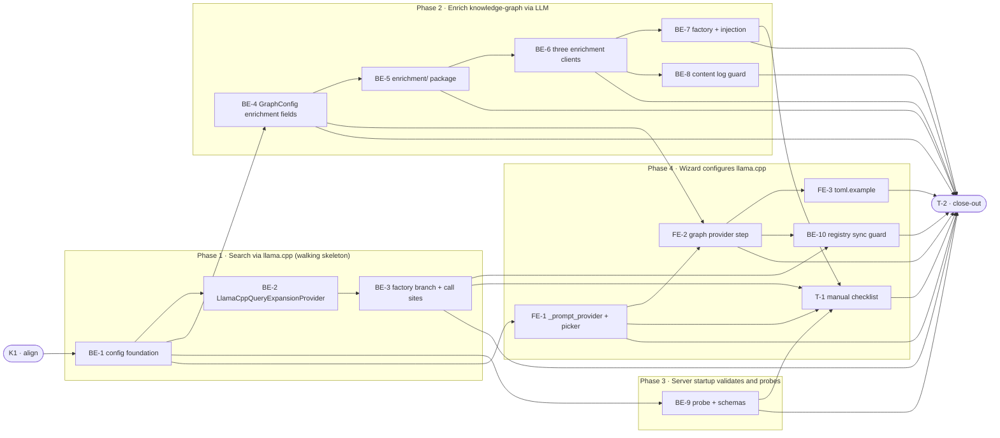

# LLCP · llama.cpp Local Provider — Task Breakdown

**How to read this file**
- This is the **order view** for [llama-cpp-local-provider-team-plan.md](./llama-cpp-local-provider-team-plan.md) — every task is a single-role checkbox in execution order, opening with a dependency graph.
- **Phases are vertical slices**: each delivers a working end-to-end increment, not a horizontal layer. No separate "integrate" phase. Sliced with the **`vertical-slicer`** skill.
- Each task carries the **role tag at the end of its title line**, then sub-bullets: **layer · estimate** (decimal hours), **needs · completes**, and a **Tests** block. **needs** = predecessor tasks; **completes** = the scenario `S#` or contract `C#` it makes true.
- **Tests** are tagged by level. **Unit and integration tests belong to the implementing dev** (test-first); **e2e and manual tests are the tester's tasks**. The close-out task writes no tests.
- IDs (`BE-#`/`FE-#`/`T-#`/`K#`) are this file's traceability thread; `S#`/`C#`/`Q#` are defined in the plan.
- **Grounding note (httpx mocking):** This repo mocks httpx via `patch("archon_search.module.httpx.AsyncClient", ...)` — not `httpx.MockTransport`. All integration tests for this feature follow that pattern.

---

## References

- **Plan:** [llama-cpp-local-provider-team-plan.md](./llama-cpp-local-provider-team-plan.md) — the full team plan (contracts, scenarios, architecture, allocation). **Always read the plan before you start planning the next task** — it holds the context this file only cites (`S#`/`C#`/`Q#`).
- **Brief:** [llama-cpp-local-provider-brief.md](./llama-cpp-local-provider-brief.md) — the source feature brief behind the plan.

---

## Task Breakdown

Single-role tasks in execution order, grouped into **vertical slices**.

### Dependency graph

### Phase 0 · Kickoff *(prerequisite; the one cross-cutting step)*

- [ ] **K1** — Agree Contracts C1–C4 and Scenarios S1–S28 with the team #team
    - — · 1.0h
    - completes C1, C2, C3, C4
    - Tests

### Phase 1 · Search via llama.cpp *(walking skeleton: config + provider adapter + factory branch + silent fallback, end-to-end)*

- [ ] **BE-1** — Add `_PROVIDER_REGISTRY` constant to `archon_search/config.py` (ordered sequence; `_VALID_PROVIDERS` frozenset derives from it); add `"llama_cpp"` to both; add `LLAMA_CPP_BASE_URL_DEFAULT = "http://localhost:8080"`; add `llama_cpp_base_url: str` field to `HyDEConfig` and `RAGFusionConfig`; add TOML loader branches for `llama_cpp_base_url` in both `[hyde]` and `[rag_fusion]` section loaders; add `"llama_cpp" → True` branch in `provider_key_available` (`archon_search/query_expansion_protocol.py:17`); add `"llama_cpp"` to rate-limit skip tuples in `archon_search/hyde.py:97` and `archon_search/rag_fusion.py:133` #backend-role
    - Frameworks & Drivers · 4.0h
    - needs K1 · completes C4 (partial), S14, S16 (partial)
    - Tests
        - #unit_test — `test_llama_cpp_in_valid_providers` — `"llama_cpp"` is in `_VALID_PROVIDERS` after registry derivation
        - #unit_test — `test_provider_key_available_llama_cpp` — `provider_key_available("llama_cpp")` returns `True`
        - #unit_test — `test_llama_cpp_base_url_default` — `LLAMA_CPP_BASE_URL_DEFAULT == "http://localhost:8080"`
        - #unit_test — `test_toml_loader_hyde_llama_cpp_base_url` — non-default value round-trips through `load_config()` to `HyDEConfig.llama_cpp_base_url`
        - #unit_test — `test_toml_loader_rag_fusion_llama_cpp_base_url` — as above for `RAGFusionConfig.llama_cpp_base_url`
        - #unit_test — `test_rate_limit_skip_includes_llama_cpp_hyde` — `"llama_cpp"` present in the skip tuple at `archon_search/hyde.py:97`
        - #unit_test — `test_rate_limit_skip_includes_llama_cpp_rag_fusion` — as above for `archon_search/rag_fusion.py:133`

- [ ] **BE-2** — Create `archon_search/providers/llama_cpp_provider.py` (`LlamaCppQueryExpansionProvider`): httpx-based, implements `QueryExpansionProvider`, never raises; catches `ConnectError`/`TimeoutException`/`HTTPStatusError` and outer `KeyError`/`IndexError`/`TypeError` on dict normalisation (distinct from SDK's `AttributeError/IndexError` — do NOT copy the openai_provider guard); `generate_hypothetical_doc` normalises `choices[0].message.content` → `str | None`; `decompose_query` → `list[str]`; fingerprint-only logging; also create `tests/test_no_query_log_in_llama_cpp_provider.py` (static source guard scanning `archon_search/providers/llama_cpp_provider.py` for raw query strings in log calls, mirrors `tests/test_no_query_log_in_hyde.py` pattern with meta-tests) #backend-role
    - Interface Adapters · 5.0h
    - needs BE-1 · completes C1, S1, S2, S6, S8, S13, S15a
    - Tests
        - #unit_test — `test_generate_hypothetical_doc_returns_content` — reachable mock, valid `choices` → returns `str`
        - #unit_test — `test_generate_hypothetical_doc_returns_none_on_connect_error` — `ConnectError` → `None`, no raise
        - #unit_test — `test_generate_hypothetical_doc_returns_none_on_503` — 503 (model loading / no model) → `None` (S8)
        - #unit_test — `test_decompose_query_returns_list` — valid `choices` → `list[str]`
        - #unit_test — `test_decompose_query_returns_empty_on_timeout` — `TimeoutException` → `[]`
        - #unit_test — `test_normalise_guard_on_missing_choices_key` — absent `choices` key → `None`/`[]`, no `KeyError`
        - #unit_test — `test_no_anthropic_openai_client_instantiated` — assert no `anthropic.AsyncAnthropic` or `openai.AsyncOpenAI` instantiated during a llama_cpp provider call; assert httpx target base URL equals the configured `llama_cpp_base_url` (S13)
        - #integration_test — `test_hyde_end_to_end_with_llama_cpp` — patch `httpx.AsyncClient`, full request/response parse path, `hyde_applied=True` (S1)
        - #integration_test — `test_rag_fusion_end_to_end_with_llama_cpp` — as above for `decompose_query` path (S2)
        - #integration_test — `test_llama_cpp_fallback_on_unreachable` — `ConnectError` → plain search continues, HTTP 200, no exception propagated (S6)

- [ ] **BE-3** — Add `llama_cpp` branch + `llama_cpp_base_url` as 4th param to `_build_query_expansion_provider` (`archon_search/server/app.py:188`); update call sites at `:694` and `:703` to pass `config.hyde.llama_cpp_base_url` / `config.rag_fusion.llama_cpp_base_url`; add `llama_cpp` branch to `_check_provider_deps` (`:124`, no key check, warn-not-block if unreachable) #backend-role
    - Interface Adapters · 2.0h
    - needs BE-1, BE-2 · completes C3 (partial), S7 (partial), S16 (partial)
    - Tests
        - #unit_test — `test_build_query_expansion_provider_builds_llama_cpp` — factory returns `LlamaCppQueryExpansionProvider` for `provider="llama_cpp"`
        - #unit_test — `test_check_provider_deps_llama_cpp_no_raise` — empty environment (no `ANTHROPIC_API_KEY`, no `OPENAI_API_KEY`) → no raise (S16)
        - #unit_test — `test_no_pip_extra_for_llama_cpp` — `_PROVIDER_EXTRA.get("llama_cpp")` is `None` (S14)

### Phase 2 · Enrich knowledge-graph via LLM *(enrichment factory + all four v1 clients + CommunityBuilder/GraphExtractor wired end-to-end)*

- [ ] **BE-4** — Add six new fields to `GraphConfig` in `archon_search/config.py:123`: `provider: str | None = None`, `llama_cpp_base_url: str = LLAMA_CPP_BASE_URL_DEFAULT`, `ollama_base_url: str = OLLAMA_BASE_URL_DEFAULT`, `extraction_timeout_seconds: float`, `extraction_rate_limit_rpm: int`, `extraction_token_budget: int`; add six TOML loader branches in the `[graph]` section loader (`:804`); add provider validation: unknown provider → `ConfigError`; `provider=None` → valid, boot cleanly; provider set but `extraction_model` absent → `WARNING` (not `ConfigError`); add `_validate_provider_config()` for `GraphConfig.provider` using the same pattern as the `[hyde]`/`[rag_fusion]` validators at `:649`/`:691` #backend-role
    - Frameworks & Drivers · 5.0h
    - needs BE-1 · completes C4, S11, S16, S23, S27, S28
    - Tests
        - #unit_test — `test_graph_config_provider_defaults_to_none` — `GraphConfig().provider is None`
        - #unit_test — `test_all_six_graph_fields_loaded_from_toml` — TOML string with all six non-default values → `load_config()` → each `GraphConfig` field equals the expected value (proves no silent branch omission)
        - #unit_test — `test_unknown_graph_provider_raises_config_error` — unknown string → `ConfigError` naming the invalid value and listing valid choices (S23)
        - #unit_test — `test_none_graph_provider_boots_cleanly` — `provider=None` → no `ConfigError`, factory returns `None` client (S27)
        - #unit_test — `test_provider_without_model_emits_warning` — `provider` set, `extraction_model` absent → `WARNING` logged, no `ConfigError` (S28)
        - #unit_test — `test_real_graphconfig_constructible_with_all_fields` — construct `AnthropicEnrichmentClient` from a non-`MagicMock` `GraphConfig` with all six fields populated; confirms Q6 defect fix (previously `AnthropicEnrichmentClient` could not be constructed because the fields were absent)

- [ ] **BE-5** — Create `archon_search/enrichment/` package: `__init__.py` (hoist `_VALID_RELATIONSHIP_TYPES` 3-value subset here); create `archon_search/enrichment/anthropic.py` (move `AnthropicEnrichmentClient` from `archon_search/llm_enrichment_client.py`); delete `archon_search/llm_enrichment_client.py` (no re-export shim); update import in `tests/test_e2i_be0_llm_enrichment_client.py` from `archon_search.llm_enrichment_client` to `archon_search.enrichment.anthropic`; update any import sites in `archon_search/community_builder.py` and `archon_search/graph_extractor.py`; check `archon_search/graph_enrichment_protocol.py` for import changes #backend-role
    - Interface Adapters · 2.0h
    - needs BE-4 · completes C2 (partial)
    - Tests
        - The existing 528-line `tests/test_e2i_be0_llm_enrichment_client.py` suite is the regression gate for this move — it must pass unchanged after the import path update
        - #integration_test — `test_anthropic_client_constructible_from_real_graphconfig` — construct `AnthropicEnrichmentClient` from a non-`MagicMock` `GraphConfig` with all six fields; confirm it initialises without error

- [ ] **BE-6** — Create `archon_search/enrichment/llama_cpp.py` (`LlamaCppEnrichmentClient`), `archon_search/enrichment/ollama.py` (`OllamaEnrichmentClient`, httpx not SDK), `archon_search/enrichment/openai.py` (`OpenAIEnrichmentClient`); all httpx-based per C2; `LlamaCppEnrichmentClient.label_relationships` uses `response_format: {"type": "json_schema", ...}` constrained to `_VALID_RELATIONSHIP_TYPES` from `archon_search/enrichment/__init__.py`; detects HTTP 422 → prompt-only fallback; per-item skip on parse failure; no `_check_rate_limit` call in `LlamaCppEnrichmentClient` (contrast with `AnthropicEnrichmentClient`) #backend-role
    - Interface Adapters · 8.0h
    - needs BE-5 · completes C2, S19, S21, S24a, S24b, S26
    - Tests
        - #unit_test — `test_llama_cpp_summarize_community_happy_path` — valid response → `str` summary
        - #unit_test — `test_llama_cpp_summarize_community_transport_raises` — `ConnectError` → raises (C2 raise-on-failure contract)
        - #unit_test — `test_llama_cpp_label_relationships_json_schema_path` — json_schema accepted by server → `LabeledRelationship` list
        - #unit_test — `test_llama_cpp_label_relationships_422_fallback` — HTTP 422 → prompt-only mode activated, no whole-call raise (S24a)
        - #unit_test — `test_llama_cpp_label_relationships_partial_parse` — mixed parseable/unparseable items → valid items returned, `WARNING` logged per skipped item, no raise (S24b / S19)
        - #unit_test — `test_llama_cpp_no_rate_limit_check` — `_check_rate_limit` is never called during any `LlamaCppEnrichmentClient` method (S26)
        - #unit_test — `test_ollama_enrichment_summarize_happy_path` — valid response → `str`
        - #unit_test — `test_ollama_enrichment_transport_raises` — transport error → raises
        - #unit_test — `test_openai_enrichment_summarize_happy_path` — valid response → `str`
        - #unit_test — `test_openai_enrichment_transport_raises` — transport error → raises

- [ ] **BE-7** — Create `archon_search/enrichment/factory.py` (`EnrichmentClientFactory`): routes `GraphConfig.provider` → concrete client, returns `None` when `provider=None`; update `CommunityBuilder.__init__` (`archon_search/community_builder.py`) to accept optional `enrichment_client: LLMEnrichmentClientProtocol | None = None`; update `_generate_llm_summary` (`:369`) to add `entity_names: list[str]` param, gather `entity_names` from `nodes_by_id` over community `group`, replace `NotImplementedError` stub (`:377`) with AND-gated real call (`provider not None AND extraction_model not None AND client not None`) dropping the existing single-field check at `:516`; update `GraphExtractor.__init__` (`archon_search/graph_extractor.py`) to accept optional `enrichment_client`; add per-chunk `label_relationships` call in `extract()` after spaCy NER (resolve entity IDs to names, call client, persist typed edges via `make_stable_edge_id` as additive alongside `related_to` co-occurrence edges, wrap in `try/except Exception` → spaCy-only fallback for that chunk); build enrichment client once in `archon_search/server/app.py` body at ~`:640` as `_enrichment_client`, store as `app.state.enrichment_client`; thread to all five construction sites: `app.py:639` (GraphExtractor, receives real client), `archon_search/server/routes_graph.py:99` (CommunityBuilder, reads `app.state.enrichment_client`), `archon_search/jobs/maintenance_loop.py:586` (CommunityBuilder, captured by lifespan closure — same pattern as `_graph_store` at `:448`), `archon_search/pipeline.py:3541` (GraphExtractor, always `None`), `archon_search/eval/runner.py:1130` (CommunityBuilder, always `None`) #backend-role
    - Interface Adapters · 9.0h
    - needs BE-5, BE-6 · completes C3, S3, S5, S9, S10, S20a, S20b
    - Tests
        - #unit_test — `test_factory_returns_llama_cpp_client` — `provider="llama_cpp"` → `LlamaCppEnrichmentClient`
        - #unit_test — `test_factory_returns_none_for_none_provider` — `provider=None` → `None` (S27 factory side)
        - #unit_test — `test_factory_returns_anthropic_client` — `provider="anthropic"` → `AnthropicEnrichmentClient` with bare model name (S10)
        - #unit_test — `test_factory_returns_ollama_client` — `provider="ollama"` → `OllamaEnrichmentClient`
        - #unit_test — `test_factory_returns_openai_client` — `provider="openai"` → `OpenAIEnrichmentClient`
        - #unit_test — `test_community_builder_calls_summarize_when_client_injected` — `_generate_llm_summary` invokes `summarize_community` when client and model both non-`None`
        - #unit_test — `test_community_builder_skips_enrichment_when_client_none` — no call when `enrichment_client=None`
        - #unit_test — `test_community_builder_catches_enrichment_error` — client raises → `CommunityBuilder` catches, substitutes `None`, no caller exception (S9 part 1)
        - #unit_test — `test_graph_extractor_calls_label_relationships_per_chunk` — per-chunk loop invokes `label_relationships` once per chunk when client injected
        - #unit_test — `test_graph_extractor_catches_enrichment_error` — client raises → spaCy-only fallback for that chunk, ingest does not fail (S9 part 2)
        - #unit_test — `test_maintenance_loop_receives_enrichment_client` — `CommunityBuilder` inside `MaintenanceLoop` receives the pre-built client (S20b part 1)
        - #unit_test — `test_eval_runner_receives_none_client` — `GraphConfig.provider is None` in eval harness; `CommunityBuilder` at `archon_search/eval/runner.py:1130` receives `None` (S20b part 2)
        - #integration_test — `test_app_state_has_enrichment_client_for_three_sites` — `TestClient`, inspect `app.state`; `GraphExtractor` (`app.py:639`), `CommunityBuilder` via `routes_graph.py:99`, and `CommunityBuilder` inside `MaintenanceLoop` (`maintenance_loop.py:586`) each receive a non-`None` client of the correct concrete type when `[graph] provider` is configured (S20a)
        - #integration_test — `test_all_four_enrichment_clients_constructible` — factory builds all four v1 clients from valid `GraphConfig`; each implements `LLMEnrichmentClientProtocol` (S5)

- [ ] **BE-8** — Create `tests/test_no_content_log_in_enrichment.py`: static source guard scanning all `archon_search/enrichment/*.py` modules for log-call arguments passing `chunk_text` or `community_text` variable names directly; includes meta-tests verifying the regex fires and does not over-match; mirrors `tests/test_no_query_log_in_hyde.py` pattern; entity names (e.g. `item.get("source_entity")`) are explicitly excluded from the guard (already-abstracted graph metadata, not raw input content) #backend-role
    - Frameworks & Drivers · 1.0h
    - needs BE-6 · completes S15b
    - Tests
        - (the file IS the static guard — meta-tests plus the real `test_no_raw_content_in_enrichment_logging` assertion)

### Phase 3 · Server startup validates and probes *(startup probe result visible in `/status`; boot never blocked)*

- [ ] **BE-9** — Add non-blocking llama-server probe to `archon_search/model_validation.py` (`validate_models_async`: GET `/v1/models` with short timeout when llama_cpp is configured in any section); add `llama_cpp_ok: bool | None` to `ModelValidationResult` dataclass (`:32`); add `llama_cpp_ok: bool | None` to `ModelValidationStatus` Pydantic model (`archon_search/server/schemas.py:169`); add `llama_cpp_ok` to `_build_model_validation_status()` (`archon_search/server/routes_status.py:308`); do **NOT** add `llama_cpp_ok` to the FAIL condition in `archon_search/server/routes_ready.py` — the probe is warn-not-block and must not feed the ready-gate (S25) #backend-role
    - Frameworks & Drivers · 4.0h
    - needs BE-1 · completes S7, S17, S25
    - Tests
        - #unit_test — `test_probe_sets_llama_cpp_ok_true` — reachable mock → `llama_cpp_ok=True`
        - #unit_test — `test_probe_sets_llama_cpp_ok_false` — unreachable → `llama_cpp_ok=False`
        - #unit_test — `test_probe_pending_is_none` — before probe runs → `llama_cpp_ok=None`
        - #unit_test — `test_probe_failure_does_not_block_boot` — probe `ConnectError` → server starts normally
        - #integration_test — `test_status_shows_llama_cpp_ok` — `TestClient`, probe patched, `GET /status` body includes `llama_cpp_ok` field (S17)
        - #integration_test — `test_ready_not_degraded_by_probe_fail` — `llama_cpp_ok=False` → `GET /ready` still HTTP 200 (S25)
        - #integration_test — `test_startup_warning_logged_llama_cpp_unreachable` — unreachable probe → `WARNING` in logs, boot completes (S7)

### Phase 4 · Wizard configures llama.cpp *(wizard offers llama.cpp choice, fetches `/v1/models`, writes all TOML fields correctly)*

- [ ] **FE-1** — Add `"llama_cpp"` to the valid-choice set and prompt string in `archon_search/install/wizard.py:_prompt_provider` (`:217`); add branch calling new `_prompt_llama_cpp_model`; add `_fetch_llama_cpp_models(base_url: str) -> list[str]` (GET `/v1/models`, parse `data[].id` — **not** Ollama's `models[].name` — returns `[]` on any failure), `_pick_llama_cpp_model(models: list[str]) -> str` (numbered menu, mirrors `_pick_ollama_model`), `_prompt_llama_cpp_model(feature_label: str) -> tuple[str, str]` (prompts URL then model, returns `(base_url, model)`, mirrors `_prompt_ollama_model`); update `_prompt_provider` return type to also carry `llama_cpp_base_url` and update its callers; update `_revert_query_expansion_flags` in `archon_search/install/extras.py:244` to also strip `llama_cpp_base_url` from `[hyde]`/`[rag_fusion]` sections #frontend-role
    - Presentation · 5.0h
    - needs BE-1 · completes S4, S12
    - Tests
        - #unit_test — `test_prompt_provider_includes_llama_cpp` — `"llama_cpp"` in valid-choice set and prompt string
        - #unit_test — `test_fetch_llama_cpp_models_parses_data_ids` — `/v1/models` response with `data[].id` list → returns `list[str]`
        - #unit_test — `test_fetch_llama_cpp_models_returns_empty_on_failure` — any error (network, parse) → `[]`, no raise (S12)
        - #unit_test — `test_revert_query_expansion_flags_strips_llama_cpp_base_url` — `llama_cpp_base_url` stripped from `[hyde]`/`[rag_fusion]` without touching other keys
        - #integration_test — `test_wizard_llama_cpp_model_picker_reachable` — `CliRunner`, `_fetch_llama_cpp_models` patched with non-empty list → numbered picker presented (S4)
        - #integration_test — `test_wizard_llama_cpp_model_picker_unreachable` — patched to `[]` → free-text model entry prompt shown (S12)

- [ ] **FE-2** — Add `_prompt_graph_provider()` to `archon_search/install/wizard.py` (prompts `[graph] provider`, `extraction_model`, and `llama_cpp_base_url`; calls `_fetch_llama_cpp_models` when `llama_cpp`; falls back to free-text when unreachable; wired into `_prompt_optional_features`); add five new fields to `WizardFeatures` in `archon_search/install/config_writer.py:21` (`hyde_llama_cpp_base_url: str = ""`, `rag_fusion_llama_cpp_base_url: str = ""`, `graph_provider: str = ""`, `graph_extraction_model: str = ""`, `graph_llama_cpp_base_url: str = ""`); update `_apply_wizard_features_to_toml` to write all new fields to `[hyde]`/`[rag_fusion]` (following the `_reconcile_ollama_base_url` pattern for llama_cpp) and to write `provider`/`extraction_model`/`llama_cpp_base_url` to `[graph]`; add `_revert_graph_enrichment_flags()` to `archon_search/install/extras.py` (strips only `provider`, `extraction_model`, `llama_cpp_base_url` from `[graph]` — does **not** set `graph.enabled=False`, distinct from `_revert_query_expansion_flags`) #frontend-role
    - Presentation · 5.0h
    - needs FE-1, BE-4 · completes S18, S22
    - Tests
        - #unit_test — `test_wizard_features_has_five_new_fields` — `WizardFeatures` dataclass carries all five new fields with correct defaults
        - #unit_test — `test_apply_wizard_features_writes_llama_cpp_base_url_to_hyde_rag_fusion` — `_apply_wizard_features_to_toml` writes `llama_cpp_base_url` under `[hyde]` and `[rag_fusion]`
        - #unit_test — `test_revert_graph_enrichment_flags_strips_three_fields` — strips `provider`, `extraction_model`, `llama_cpp_base_url` from `[graph]` written to `tmp_path`
        - #unit_test — `test_revert_graph_enrichment_flags_preserves_graph_enabled` — `graph.enabled` key is unchanged after revert (S22)
        - #integration_test — `test_wizard_graph_provider_step_writes_all_three_fields` — `CliRunner` + patching → `[graph]` TOML contains `provider`, `extraction_model`, `llama_cpp_base_url` (S18)
        - #integration_test — `test_wizard_abort_reverts_graph_enrichment_only` — abort mid-install → `provider`/`extraction_model`/`llama_cpp_base_url` stripped, `graph.enabled` untouched (S22)

- [ ] **FE-3** — Update `archon-search.toml.example`: add `llama_cpp` option and `llama_cpp_base_url` commented entries to `[hyde]` and `[rag_fusion]` sections; correct `[graph]` section to use discrete `provider` field + bare `extraction_model` + new enrichment fields (`extraction_timeout_seconds`, `extraction_rate_limit_rpm`, `extraction_token_budget`, `llama_cpp_base_url`) (resolves three Contradictions in the plan) #frontend-role
    - Presentation · 1.0h
    - needs FE-1, FE-2 · completes (doc: [archon-search.toml.example](../../archon-search.toml.example) corrected)
    - Tests

- [ ] **BE-10** — Create `tests/test_provider_registry_sync.py`: structural CI guard asserting `_VALID_PROVIDERS`, the wizard provider set in `_prompt_provider`, and TOML writer branches each contain exactly the `_PROVIDER_REGISTRY` keys; `_PROVIDER_EXTRA.keys()` is a **strict subset** of registry keys (not equality — some providers have no pip extra); mirrors `tests/test_no_fstring_sql.py` pattern with meta-tests; author only after FE-1 and FE-2 are finalised so all derived sites exist #backend-role
    - Frameworks & Drivers · 1.5h
    - needs BE-3, FE-1, FE-2 · completes C4
    - Tests
        - (the file IS the structural guard — meta-tests plus `test_provider_registry_is_source_of_truth`)

- [ ] **T-1** — Create `tests/integration/test_llama_cpp_manual_checklist.md`; mirror the format of `tests/integration/test_g10_t2_manual_checklist.md` (prerequisites block, per-scenario TOML config block, checkbox steps with exact commands, acceptance statement) #tester-role
    - — · 3.0h
    - needs BE-2, BE-3, BE-7, BE-9, FE-1 · completes S1, S2, S3, S4, S17
    - Tests
        - #manual_test — Live HyDE via llama.cpp — llama-server reachable with a loaded model; `[hyde] provider="llama_cpp"`; `POST /search` with `hyde=true`; confirm `hyde_applied=true` and HTTP 200 (non-automatable: requires real llama-server inference)
        - #manual_test — Live RAG Fusion via llama.cpp — `[rag_fusion] provider="llama_cpp"`; confirm query decomposed and fused via RRF; HTTP 200 (non-automatable: requires real llama-server inference)
        - #manual_test — Live graph enrichment via llama.cpp — `[graph] provider="llama_cpp"` and `extraction_model` set; trigger community build; confirm LLM summaries and typed relationship labels produced (non-automatable: requires real llama-server inference)
        - #manual_test — Wizard `/v1/models` picker — run wizard with llama-server live; confirm model list fetched and displayed; TOML written with all three `[graph]` fields (non-automatable: requires real llama-server)
        - #manual_test — Startup probe in `/status` — `GET /status` shows `llama_cpp_ok: true` when reachable; `llama_cpp_ok: false` when stopped; `GET /ready` stays HTTP 200 in both cases (non-automatable: requires real llama-server process control)

### Phase 5 · Close-out

- [ ] **T-2** — Project close-out & acceptance fact-check #tester-role
    - — · 4.0h
    - needs K1, BE-1, BE-2, BE-3, BE-4, BE-5, BE-6, BE-7, BE-8, BE-9, FE-1, FE-2, FE-3, BE-10, T-1
    - Tests
    - Duties
        - Update all documentation per [llama-cpp-local-provider-team-plan.md](./llama-cpp-local-provider-team-plan.md)'s "Documentation update" section: [archon-search.toml.example](../../archon-search.toml.example), [Documentation/Architecture/110_component_catalog_and_layer_breakdown.md](../Architecture/110_component_catalog_and_layer_breakdown.md), [Documentation/Architecture/150_security_and_privacy_architecture.md](../Architecture/150_security_and_privacy_architecture.md), [Documentation/Architecture/530_technical_debt_refactoring_roadmap.md](../Architecture/530_technical_debt_refactoring_roadmap.md), new ADR `C6-local-llm-provider.md`, and [CLAUDE.md](../../CLAUDE.md).
        - Fix all build / compiler warnings, if any.
        - Run the full test suite (`uv run pytest`); fix every failing test, including any unrelated to this feature; verify `tests/test_provider_registry_sync.py` passes; verify `--cov-fail-under=85` gate passes across all new modules (`archon_search/providers/llama_cpp_provider.py`, `archon_search/enrichment/*.py`, `archon_search/enrichment/factory.py`).
        - Validate every Acceptance criterion one-by-one (from the plan's "Acceptance criteria" section) with a fact check — no assumptions; confirm each is genuinely done.

**Critical path:** K1 → BE-1 → BE-4 → BE-5 → BE-6 → BE-7 → T-2. BE-2/BE-3 (Phase 1), BE-9 (Phase 3), and FE-1/FE-2 (Phase 4) all run in parallel from BE-1.
