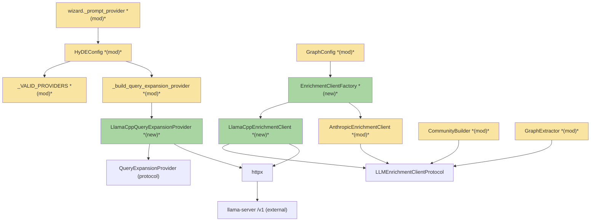
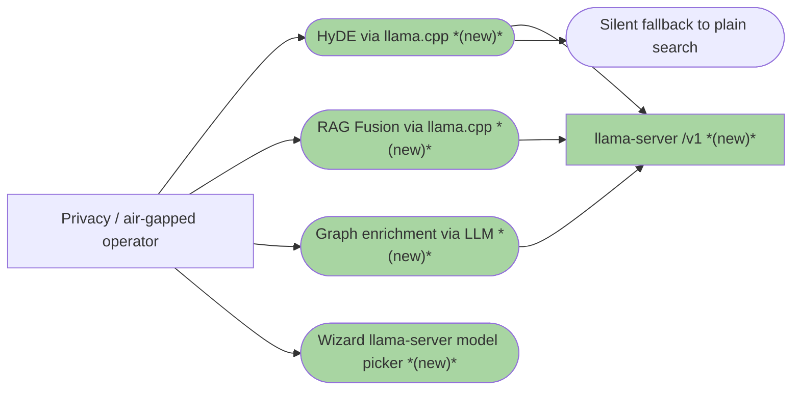
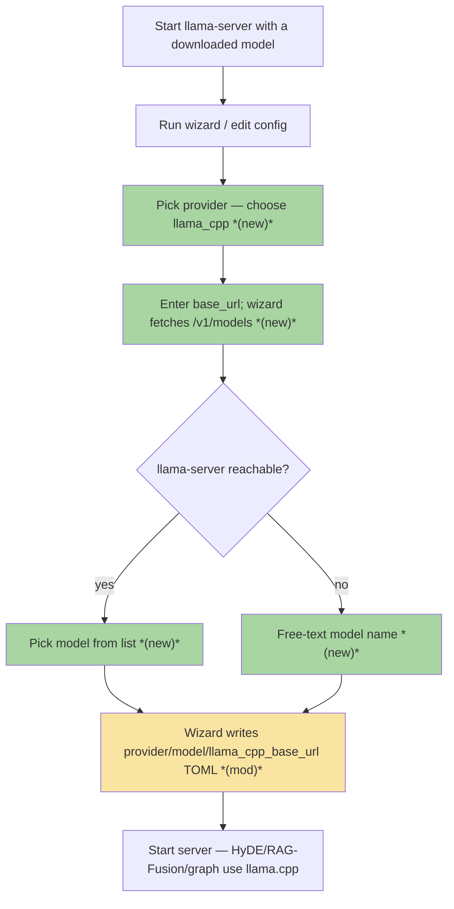
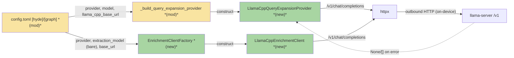
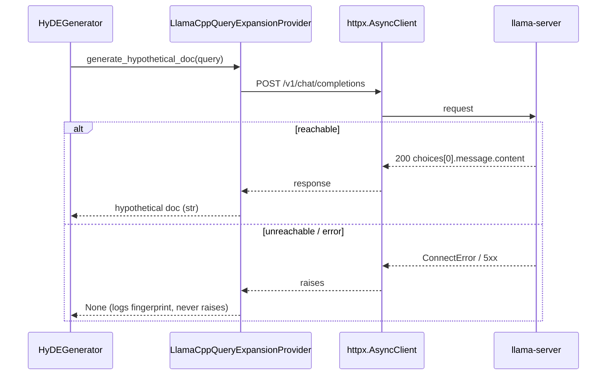

# llama-cpp-local-provider · llama.cpp Local Provider — Team Plan

**How to read this file**
- **Architecture approach:** Clean Architecture. **Layers:** Presentation (CLI/wizard) · Use Cases · Interface Adapters · Entities · Frameworks & Drivers. Dependencies point inward.
- The **Frontend, Backend, and Tester** sections are the **depth view** — each role's scope, grouped by layer. "Frontend" here is the **CLI install wizard + TOML config templates**; this server has no web/mobile UI.
- **Contracts** are **internal logical seams** — this server *consumes* llama-server's OpenAI-compatible API, it does not expose one, so no `openapi.yaml` is produced. Each seam is authored as a linked core-construct `.tsp` file (validated with `tsp compile <file> --no-emit`).
- **Role tags** (`#frontend-role`, `#backend-role`, `#tester-role`) mark each role-owned section.
- IDs (`S#` scenarios, `C#` contracts, `Q#` questions) are the traceability thread.
- **Tasks** are not in this file — task breakdown is a separate downstream step that consumes this plan.
- **Rule:** change a contract only by team agreement.

---

## Background

archon-search already supports four LLM providers (`anthropic`, `openai`, `ollama`, `claude_cli`) for HyDE and RAG Fusion query expansion, selected per-feature via `[hyde]`/`[rag_fusion]` config and dispatched by `_build_query_expansion_provider` in `server/app.py`. Knowledge-graph enrichment (community summarisation, typed relationship labelling) has a protocol (`LLMEnrichmentClientProtocol`) and one concrete client (`AnthropicEnrichmentClient`), but **that client is orphaned** — no factory constructs it, and both call sites (`CommunityBuilder._generate_llm_summary`, `GraphExtractor.extract`) are stubs that raise `NotImplementedError` or fall back to spaCy-only. `AnthropicEnrichmentClient` has a 528-line, 20-test suite (`tests/test_e2i_be0_llm_enrichment_client.py`); what is untested is the **wiring** — the factory, injection into `CommunityBuilder._generate_llm_summary`, and injection into `GraphExtractor`. There is no `llama_cpp` provider today.

---

## Goal

A user starts `llama-server` locally, sets `provider = "llama_cpp"` and `llama_cpp_base_url` under `[hyde]`, `[rag_fusion]`, and/or `[graph]`, and gets smarter search (HyDE + RAG Fusion) and knowledge-graph enrichment fully on-device — no API key, no external traffic. If `llama-server` is unreachable, search falls back silently to plain retrieval, exactly as Ollama does today. The wizard offers a llama-server model picker mirroring the Ollama step.

---

## Scope

### In Scope
- New `LlamaCppQueryExpansionProvider` (HyDE + RAG Fusion) calling llama-server `/v1/chat/completions` via `httpx` (core dep — no new package).
- **Wire graph enrichment for the first time** — build the enrichment factory and inject the `LLMEnrichmentClientProtocol` into `CommunityBuilder` and `GraphExtractor`, replacing the two stubs. This is greenfield wiring, not a refactor of an existing factory (see Contradictions).
- New `enrichment/` sub-package (one file per provider, mirrors `providers/`); four concrete `LLMEnrichmentClientProtocol` implementations: `LlamaCppEnrichmentClient`, `OllamaEnrichmentClient` (httpx, not the SDK), `OpenAIEnrichmentClient`, plus real wiring of the existing `AnthropicEnrichmentClient` (Q1=B, Q4=B). `ClaudeCLIEnrichmentClient` deferred from v1 scope — `claude_cli` has no HTTP endpoint and is subprocess-based; enrichment for this provider requires a different approach.
- Config: add `"llama_cpp"` to `_VALID_PROVIDERS`; add `llama_cpp_base_url` to `HyDEConfig`, `RAGFusionConfig`, `GraphConfig`; add discrete `provider: str | None = None` to `GraphConfig` (resolves Q7=A — no prefix parser; defaults to `None` meaning enrichment disabled unless explicitly configured; existing bare `extraction_model` values are unambiguous because the model name is now always the bare model string); add the three enrichment fields `GraphConfig` is missing (`extraction_timeout_seconds`, `extraction_rate_limit_rpm`, `extraction_token_budget`) that `AnthropicEnrichmentClient` already reads.
- **Centralise the duplicated provider list** — one authoritative `_PROVIDER_REGISTRY` (or equivalent) from which `_VALID_PROVIDERS`, `_prompt_provider` set + prompt string, and TOML writer branches all derive (Q10=A). `_PROVIDER_EXTRA` is NOT centralised — it remains query-expansion-only (enrichment clients use httpx, a core dep with no pip extra).
- Wizard model picker for llama-server `/v1/models` (mirrors the Ollama `/api/tags` picker); **plus a graph-provider prompt** mirroring the HyDE/RAG Fusion provider step — sets `[graph] provider` and `extraction_model` (Q8=A).
- Startup validation: `_check_provider_deps` gains a `llama_cpp` branch — no key check, no import guard, warn-not-block if unreachable; **`model_validation.py` gains a non-blocking llama-server HTTP probe** (GET `/v1/models` with a short timeout) surfaced in `GET /status` alongside the embedder/reranker health (Q3=A).
- Rate limiting skipped for `llama_cpp` (parity with Ollama).
- No new Python install extras.

### Out of Scope
- **Embedded/in-process llama.cpp** (`llama-cpp-python`) — server mode only.
- **Reranker/embedder via llama.cpp** — stay as fastembed ONNX models.
- **Authentication / API key for llama-server** — local mode needs none; deferred.
- **Generic `openai_compatible` provider** (LM Studio, vLLM, Jan.ai) — future iteration.
- **Route-level HyDE/RAG-Fusion mutual exclusion changes** — provider-agnostic, unchanged.

---

## Acceptance criteria
- `provider = "llama_cpp"` under `[hyde]` runs HyDE query expansion against llama-server; `hyde_applied=true` when reachable.
- `provider = "llama_cpp"` under `[rag_fusion]` runs RAG Fusion decomposition against llama-server.
- `[graph] provider = "llama_cpp"` (discrete field) + `extraction_model = "<model>"` produces LLM community summaries and typed relationship labels via llama-server.
- All four enrichment providers (anthropic, ollama, openai, llama_cpp) are constructible through the new enrichment factory and injected into `CommunityBuilder` / `GraphExtractor`. (`claude_cli` enrichment deferred from v1 — no HTTP endpoint; subprocess-based approach required.)
- llama-server unreachable **at query time** → provider returns `None`/`[]`; HyDE/RAG-Fusion fall back to plain search; HTTP 200; no exception leaks.
- llama-server unreachable **at startup** → WARNING logged, server boots (no `ConfigError`); `GET /status` shows the probe result.
- Model not loaded → provider logs a WARNING with the query fingerprint and returns `None`/`[]`.
- Enrichment failure raises from the client; `CommunityBuilder`/`GraphExtractor` catch and substitute `None`/empty — no caller behaviour change.
- Wizard offers `llama_cpp` for HyDE/RAG Fusion **and** for graph enrichment (`[graph] provider` + `extraction_model` + `llama_cpp_base_url`); with a running llama-server it lists `/v1/models`; unreachable → free-text fallback.
- `provider_key_available("llama_cpp")` → `True`; no `ANTHROPIC_API_KEY`/`OPENAI_API_KEY` check for llama_cpp; rate limiting skipped.
- 200 response with empty `choices` or missing keys → provider returns `None`/`[]`, no exception propagates.
- `[graph] provider` defaults to `None`; enrichment factory returns `None` client when `provider=None`; enrichment is silently skipped (no `NotImplementedError`, no cloud call) — preserves air-gap guarantee for operators who configure query-expansion but not enrichment. Operators must explicitly set `[graph] provider` to enable enrichment.
- No raw query or chunk text in any log — `_query_fingerprint` only (ADR 05).
- No new Python dependency is installed for llama_cpp.
- Provider name is canonical in one place; all ≥4 derived sites stay in sync (centralised registry, Q10=A).
- All tests pass with zero warnings.

---

## What does NOT change
- The `QueryExpansionProvider` protocol shape (`generate_hypothetical_doc`, `decompose_query`) and its **never-raise** contract.
- The `LLMEnrichmentClientProtocol` shape (`summarize_community`, `label_relationships`) and its **raise-on-failure** contract.
- HyDE/RAG-Fusion two-level opt-in gating and route-level mutual exclusion (ADR C4/C5).
- The four existing query-expansion adapters and the flat if/elif factory-dispatch pattern.
- The reranker/embedder path (fastembed ONNX).
- DB schema — no `STORE_SCHEMA_VERSION` bump, no `MigrationSpec`.
- No config-migration tooling — new fields are additive with defaults.

---

## Known limitations / accepted trade-offs
- **Silent fallback masks misconfiguration** — an offline or misconfigured llama-server degrades to plain search without a hard error (intentional; matches Ollama).
- **Re-run hygiene** — switching a section away from `llama_cpp` back to `anthropic` does not clear a stale `llama_cpp_base_url` key, matching the existing `ollama_base_url` limitation (deferred to brief `2026-07-15-140`).
- **No live-server CI coverage** — real llama-server inference is manual-only; CI stubs the transport.
- **Rate limiting skipped for `llama_cpp` query-expansion** — parity with existing Ollama/claude_cli local-mode adapters; no new deviation from ADR C5. The enrichment rate limiter (`extraction_rate_limit_rpm`) is **not implemented** in `LlamaCppEnrichmentClient` — intentional, since llama-server is unthrottled. `AnthropicEnrichmentClient` calls `_check_rate_limit()` at the top of each method; the llama_cpp client omits this entirely. Documented in ADR C6.
- **Probe target URL is indicative, not per-section** — the `model_validation.py` probe targets the `[graph] llama_cpp_base_url` when `[graph] provider = 'llama_cpp'` is set, or `[hyde] llama_cpp_base_url` / `[rag_fusion] llama_cpp_base_url` when those sections enable llama_cpp. A single `llama_cpp_ok: bool | None` is returned even when multiple sections configure different base URLs — the probe tests the first configured URL found. Operators with divergent endpoints should treat `llama_cpp_ok` as an indicative signal, not a per-section health check.

---

## Approach & architecture

The feature extends two inward-pointing seams. The query-expansion path is mature — add one adapter (`LlamaCppQueryExpansionProvider`) behind the existing `QueryExpansionProvider` protocol and one factory branch. The enrichment path is **unwired scaffolding** — build the enrichment factory (in a new `enrichment/` sub-package, one file per provider), inject `LLMEnrichmentClientProtocol` into `CommunityBuilder` and `GraphExtractor`, and add four v1 concrete clients (all using `httpx`; `claude_cli` deferred). Config gains `GraphConfig.provider` (discrete field; defaults to `None` — unlike `HyDEConfig.provider` which defaults to `"anthropic"` because HyDE has a separate `enabled` gate; graph enrichment's gate IS this field, so `None` is required for air-gap safety) and `_VALID_PROVIDERS` gains `"llama_cpp"`. The CLI wizard gains both a HyDE/RAG-Fusion llama-server picker and a new graph-provider step. `model_validation.py` gains a non-blocking llama-server probe surfaced in `GET /status`. The duplicated provider list across ≥4 files is centralised. `httpx` (core) is the transport; no new dependency.

### Data / Control Flow

_Note: arrows represent runtime data flow and construction order, not compile-time import dependencies. The architectural invariant (dependencies point inward) is verified by layer membership, not by this diagram._

_Scope limited to change neighbourhood: the full component area exceeds 15 nodes. `RAGFusionConfig` (mirrors `HyDEConfig`), the three sibling v1 enrichment clients (`Ollama`/`OpenAI`/`Anthropic`, which parallel `LlamaCppEnrichmentClient`; `ClaudeCLI` deferred from v1), the wizard `/v1/models` sub-picker (part of `_prompt_provider`), and `_check_provider_deps` are elided; each is called out in the table and role sections._

| Component | Change | Why |
|-----------|--------|-----|
| `LlamaCppQueryExpansionProvider` | new | httpx adapter for HyDE/RAG-Fusion against llama-server `/v1/chat/completions`; near-copy of `ollama_provider` normalisation from `openai_provider` |
| `enrichment/` sub-package | new | One file per provider (mirrors `providers/`): `llama_cpp.py`, `ollama.py` (httpx, not SDK), `openai.py`, `anthropic.py` (Q1=B, Q4=B); `claude_cli.py` deferred — no HTTP endpoint |
| `EnrichmentClientFactory` | new | Greenfield — routes an enrichment provider to a concrete `LLMEnrichmentClientProtocol` client; no factory exists today |
| `AnthropicEnrichmentClient` | modified | Moved to `enrichment/anthropic.py`; wired for the first time (was orphaned); reads three `GraphConfig` fields that must be added |
| `CommunityBuilder` | modified | Gains constructor injection of `LLMEnrichmentClientProtocol`; `_generate_llm_summary` stub replaced with a real call |
| `GraphExtractor` | modified | Gains injection; spaCy-only fallback path now calls the enrichment client |
| `_build_query_expansion_provider` | modified | Adds `llama_cpp` branch + a `llama_cpp_base_url` input (discrete param, Q9=A); both call sites updated |
| `HyDEConfig` / `RAGFusionConfig` / `GraphConfig` | modified | Add `llama_cpp_base_url`; `GraphConfig` also adds discrete `provider: str \| None = None` (Q7=A — defaults to `None`, enrichment disabled unless explicitly set), `ollama_base_url`, and the three enrichment fields |
| Provider list centralisation | new | Single `_PROVIDER_REGISTRY` (or equivalent) in `config.py`; all ≥4 sites derive from it (Q10=A) |
| `wizard._prompt_provider` | modified | Add `llama_cpp` choice + `/v1/models` picker; new graph-provider prompt for `[graph] provider` + `extraction_model` (Q8=A) |
| `model_validation.py` | modified | Non-blocking llama-server GET `/v1/models` probe; result surfaced in `GET /status` (Q3=A) |

**Layer map (and role mapping)**

| Layer | Role | Components |
|-------|------|-----------|
| Presentation (CLI) | **Frontend** | `wizard._prompt_provider`, `_fetch_llama_cpp_models`/`_prompt_llama_cpp_model`, `_prompt_graph_provider`, `config_writer`, `archon-search.toml.example` |
| Use Cases | Backend | `QueryExpansionProvider`, `LLMEnrichmentClientProtocol`, `CommunityBuilder`, `GraphExtractor`, `provider_key_available` |
| Interface Adapters | Backend | `LlamaCppQueryExpansionProvider`, `enrichment/` sub-package (4 v1 clients; `claude_cli` deferred), `EnrichmentClientFactory`, `_build_query_expansion_provider`, `_check_provider_deps` |
| Entities | Backend | `LabeledRelationship` |
| Frameworks & Drivers | Backend | `config.py` dataclasses + TOML loader, `_VALID_PROVIDERS` / provider registry, `httpx`, `model_validation.py` (llama-server probe) |

**What changes**
- One new query-expansion adapter behind the unchanged `QueryExpansionProvider` protocol.
- A greenfield enrichment factory + four v1 clients in a new `enrichment/` sub-package, injected into two Use-Case components that were stubs.
- Additive config fields including a discrete `[graph] provider` field; centralised provider registry; new wizard graph-provider step; `model_validation.py` llama-server probe.

**Key decisions (fixed for v1)**
- **Server mode (HTTP), not embedded** — keeps archon-search lean, matches the Ollama mental model, zero new deps.
- **`httpx` for all enrichment clients** including `OllamaEnrichmentClient` — no optional-dep check needed; all four v1 enrichment clients are internally uniform (Q4=B). (`ClaudeCLIEnrichmentClient` deferred — subprocess-based, not httpx-compatible.)
- **Named `llama_cpp` provider**, not `openai` with a custom URL — unambiguous config, no key-check confusion.
- **Four providers get enrichment parity in v1** (anthropic, ollama, openai, llama_cpp) — the factory is the hard part; adding clients once it exists is marginal. `claude_cli` enrichment is deferred (subprocess-based, no HTTP endpoint).
- **Discrete `llama_cpp_base_url` field** for URL; discrete `[graph] provider` field for provider selection — no prefix-encoded strings (resolves Q2, Q7=A).
- **`enrichment/` sub-package** mirrors `providers/`; one file per client (Q1=B).
- **Centralised provider registry** — single source of truth for all ≥4 duplication sites (Q10=A). **Note:** `_PROVIDER_EXTRA` (pip-extra install requirements) is NOT centralised into the registry — enrichment clients uniformly use httpx (core dep, no extra), while query-expansion adapters may require extras (e.g. `ollama` SDK). Keep `_PROVIDER_EXTRA` as query-expansion-only; the registry must not encode enrichment-domain extras.
- **Wizard graph-provider step** added alongside HyDE/RAG Fusion steps (Q8=A).
- **`model_validation.py` llama-server probe** surfaced in `GET /status` (Q3=A).
- **Discrete `llama_cpp_base_url` param** on `_build_query_expansion_provider` (4 params total; Q9=A).

### Actors & Use Cases

_Graph enrichment via LLM is marked new because, although the protocol exists, it is wired to nothing today — this feature is its first real use._

### Flows

#### User Flow

#### Data Flow

#### Sequence

### Prior decisions

| Decision | Rationale | Constraint |
|---|---|---|
| HyDE external LLM dependency (ADR C4) | Local/single-user privacy guarantee; a remote call must be opt-in and auditable. Local model (llama.cpp/ollama) evaluated and deferred — "remains open for a future ADR if demand materialises". | This feature IS that future ADR. Preserve two-level opt-in gating, silent fallback (never a 5xx/degraded availability), and the structural no-raw-query-in-logs guarantee via `_query_fingerprint`. Startup INFO/WARNING must make the local-transmission fact visible. |
| RAG Fusion external LLM dependency + HyDE mutual exclusion (ADR C5) | LLM decomposition yields diverse reformulations; kill-switch + silent fallback keep the dep off the reliability path; variants never logged/stored/returned. | Preserve silent runtime fallback, route-level HyDE/RAG-Fusion mutual exclusion, no-raw-query guarantee. **Deviations to record:** the "missing optional dep → 422" branch is N/A for llama_cpp (httpx is core, no optional dep). Rate limiting for llama_cpp follows the existing Ollama/claude_cli local-mode precedent — no new deviation from C5. Stated in ADR C6 for completeness. |
| Opt-in local telemetry, no raw query logging (ADR 05) | Raw-query records outlive the session and leak via backups/support bundles; the guarantee must hold by construction. | No new provider (`LlamaCppQueryExpansionProvider`, the four v1 enrichment clients) may pass raw query/chunk text to telemetry or logs — fingerprint only. Do not add a `query` parameter to any telemetry entry constructor. |

### Contradictions

**Brief vs. reality**

| Contradiction | Brief assumes | Reality | Owner |
|---|---|---|---|
| Enrichment factory | "factory routing logic needs to be pulled out and generalised" (a refactor) | No factory exists; `AnthropicEnrichmentClient` is orphaned; both call sites are stubs (`community_builder.py:377` raises `NotImplementedError`; `graph_extractor.py:191` spaCy-only). This is greenfield wiring across five construction sites. | plan re-scopes — resolved in Q5 |
| `"provider:model"` parser | "the `provider:model` format already exists" | No split/parse of `extraction_model` in production code — it is stored raw and only truthiness-checked. The parser is net-new. | **Resolved Q7=A — no parser needed**; discrete `GraphConfig.provider` field selected instead; `extraction_model` remains a bare model name. |
| `GraphConfig` enrichment fields | `AnthropicEnrichmentClient` is a working baseline | The client reads `extraction_timeout_seconds`/`extraction_rate_limit_rpm`/`extraction_token_budget`, none of which exist on `GraphConfig` — it cannot be constructed today. | plan adds the fields — resolved in Q6 |

**Code vs. docs**

| Contradiction | Code says | Doc says | Owner |
|---|---|---|---|
| Enrichment implementation status | `_generate_llm_summary` raises `NotImplementedError`; `graph_extractor` falls back to spaCy | `e2i-llm-graph-enrichment-brief.md` frames enrichment as shipped; `110_component_catalog` line 86 says `CommunityBuilder` "optionally calls the configured `extraction_model` for an abstractive summary" | doc needs updating |
| `[graph]` config format | `extraction_model` is a bare model name; `[graph] provider` is a new discrete field (Q7=A) | `archon-search.toml.example` `[graph]` comments describe a bare model string and "config-guarded stub in E1a … deferred to E1b" | doc needs updating |
| Transmission surface | Multi-provider: ollama/claude_cli/llama_cpp are zero-transmission; enrichment sends community text to the LLM | `150_security_and_privacy_architecture.md` frames transmission as Anthropic-only, no enrichment surface | doc needs updating |

*Action:* all three doc discrepancies are added to the Documentation update list with reason *contradiction with code*.

---

## Contracts / seams

Boundaries where roles must agree. **All seams are internal logical seams** — archon-search consumes llama-server's OpenAI-compatible API and exposes no new HTTP surface, so no `openapi.yaml` is emitted. Each seam is authored as a core-construct `.tsp` file beside this plan and validated with `tsp compile <file> --no-emit` (all four compile clean on tsp 1.13.0). Changing one requires team agreement.

**C1 — QueryExpansionProvider protocol** *(Use Cases ↔ Interface Adapters)*
The protocol shape is unchanged; `LlamaCppQueryExpansionProvider` must implement `generate_hypothetical_doc → str|None` and `decompose_query → list[str]` and **never raise** — every failure surfaces as `None`/`[]` for silent fallback. The module helper `provider_key_available` gains a `llama_cpp → True` branch (no key). — see [llama-cpp-query-expansion-protocol.tsp](./llama-cpp-query-expansion-protocol.tsp)

**C2 — LLMEnrichmentClientProtocol** *(Use Cases ↔ Interface Adapters)*
The inverse contract: `summarize_community → str|None` and `label_relationships → list[LabeledRelationship]` **may raise**; `CommunityBuilder`/`GraphExtractor` catch and substitute `None`/`[]`. `LlamaCppEnrichmentClient` (and the three v1 siblings) implement it. **Per-item skip vs whole-call raise:** each client skips unparseable individual items (via `continue`/WARNING) and returns `None`/`[]` on an entirely empty/missing response. Raises only on transport failure (network error, non-2xx status after all retries, whole-body JSON parse failure). Implementers must match the reference `AnthropicEnrichmentClient` semantics. — see [llama-cpp-enrichment-protocol.tsp](./llama-cpp-enrichment-protocol.tsp)

**C3 — Provider factory seams** *(Interface Adapters, composition root)*
`_build_query_expansion_provider` gains a `llama_cpp` branch and a `llama_cpp_base_url` input (discrete param, Q9=A; both HyDE and RAG-Fusion call sites pass it through). A **new** enrichment factory routes `GraphConfig.provider` (discrete field, Q7=A) to a concrete client and is injected into five construction sites. No prefix parser — `extraction_model` is always a bare model name. A `_enrichment_client` local is built in the `create_app()` body and stored as `app.state.enrichment_client`; all five sites use it via constructor injection or `app.state` access. — see [llama-cpp-provider-factory.tsp](./llama-cpp-provider-factory.tsp)

**C4 — Config surface + status schema** *(Frameworks & Drivers)*
`_VALID_PROVIDERS` gains `"llama_cpp"`. `HyDEConfig`/`RAGFusionConfig`/`GraphConfig` gain `llama_cpp_base_url`; `GraphConfig` also gains `provider`, `ollama_base_url`, `extraction_timeout_seconds`/`extraction_rate_limit_rpm`/`extraction_token_budget`. All additive with defaults — no migration. **`GET /status` schema extension**: the llama-server reachability result is added as a new optional field `llama_cpp_ok: bool | None` on `ModelValidationStatus` — `None` = probe pending, `True` = reachable, `False` = unreachable. Schema changes required: `ModelValidationResult` dataclass (`model_validation.py:33-44`), `ModelValidationStatus` Pydantic model (`schemas.py:169`), `_build_model_validation_status()` (`routes_status.py:308-323`), and the `routes_ready.py` checks.models mapping. **Provider registry shape**: `_PROVIDER_REGISTRY` is a sequence/mapping of provider name strings (`"anthropic"`, `"openai"`, `"ollama"`, `"claude_cli"`, `"llama_cpp"`). All five names are the authoritative list; Frontend (wizard prompt), Backend (`_VALID_PROVIDERS`, TOML writer), and Tester (`test_provider_registry_sync.py`) all derive from this list. The registry key shape (provider name strings) is defined here as a C4 invariant. — see [llama-cpp-config.tsp](./llama-cpp-config.tsp)

---

## Data

_This project has no database change — the feature is config-dataclass-only. `STORE_SCHEMA_VERSION` is untouched, no `MigrationSpec` is added, and no config-migration tooling exists (new fields are additive with defaults, matching the earlier `ollama_base_url` addition). An erDiagram is therefore not applicable._

Config schema changes (Frameworks & Drivers layer, `archon_search/config.py`):

| Entity | Field | Change | Notes |
|--------|-------|--------|-------|
| `_VALID_PROVIDERS` | — | add `"llama_cpp"` | sole provider allowlist |
| (module const) | `LLAMA_CPP_BASE_URL_DEFAULT` | new = `"http://localhost:8080"` | mirrors `OLLAMA_BASE_URL_DEFAULT` |
| `HyDEConfig` | `llama_cpp_base_url: str` | new | default = `LLAMA_CPP_BASE_URL_DEFAULT` |
| `RAGFusionConfig` | `llama_cpp_base_url: str` | new | default = `LLAMA_CPP_BASE_URL_DEFAULT` |
| `GraphConfig` | `provider: str \| None` | new = `None` | discrete enrichment provider field; defaults to `None` (enrichment disabled) — unlike `HyDEConfig.provider` which defaults to `"anthropic"` because HyDE has a separate `enabled` gate; graph enrichment's gate IS this field, so `None` is required for air-gap safety (resolves Q7=A) |
| `GraphConfig` | `llama_cpp_base_url: str` | new | enrichment base URL for llama_cpp provider (resolves Q2 — discrete field) |
| `GraphConfig` | `ollama_base_url: str` | new | enrichment base URL for Ollama provider; default = `OLLAMA_BASE_URL_DEFAULT`; distinct from `HyDEConfig.ollama_base_url` / `RAGFusionConfig.ollama_base_url` (same default, different config object) |
| `GraphConfig` | `extraction_timeout_seconds: float` | new | read by `AnthropicEnrichmentClient` today, never defined (fixes defect, Q6) |
| `GraphConfig` | `extraction_rate_limit_rpm: int` | new | as above; skipped for llama_cpp |
| `GraphConfig` | `extraction_token_budget: int` | new | as above |

---

## Scenarios #tester-role

Behavioural only — step-level detail is produced by the tasks downstream. Happy, unhappy, edge, and non-functional paths.

| id | Scenario (Given / When / Then) |
|----|--------------------------------|
| **S1** | **Given** `[hyde] provider="llama_cpp"` and a reachable llama-server · **When** a search runs with `hyde=true` · **Then** HyDE expands via `/v1/chat/completions`, `hyde_applied=true`, HTTP 200 |
| **S2** | **Given** `[rag_fusion] provider="llama_cpp"` and a reachable llama-server · **When** a search runs with `rag_fusion=true` · **Then** the query is decomposed via llama-server and fused via RRF |
| **S3** | **Given** `[graph] provider="llama_cpp"` + `extraction_model="<model>"` and a reachable llama-server · **When** communities are built / entities extracted · **Then** LLM summaries and typed relationship labels are produced via llama-server |
| **S4** | **Given** a running llama-server · **When** the wizard reaches the HyDE/RAG Fusion or graph provider step and `llama_cpp` is chosen · **Then** it fetches `/v1/models` and presents a numbered model picker |
| **S5** | **Given** each of anthropic/ollama/openai/llama_cpp as `[graph] provider` (four v1 providers; `claude_cli` enrichment deferred) · **When** the enrichment factory builds a client · **Then** the correct concrete client is returned and injected into `CommunityBuilder`/`GraphExtractor` |
| **S6** | **Given** `provider="llama_cpp"` and llama-server **unreachable at query time** · **When** a HyDE/RAG-Fusion search runs · **Then** the provider returns `None`/`[]`, search falls back to plain retrieval, HTTP 200, no exception leaks |
| **S7** | **Given** `provider="llama_cpp"` and llama-server **unreachable at startup** · **When** the server boots · **Then** a WARNING is logged, boot continues (no `ConfigError`), and `GET /status` reflects the probe failure |
| **S8** | **Given** a reachable llama-server with **no model loaded** · **When** a query-expansion call is made · **Then** the provider logs a WARNING with the query fingerprint and returns `None`/`[]`. **Note — llama-server HTTP contract for 'no model loaded'**: llama-server returns HTTP 503 with `{'error':{'code':503,'message':'Loading model'}}` when a model is loading, and typically a non-2xx status when idle without a model. The provider's `_get_client` stub in tests must return HTTP 503 (not empty `choices`) to faithfully simulate this state. Verify the exact contract against llama-server docs before coding the test stub. |
| **S9** | **Given** an enrichment call that fails at the transport · **When** `CommunityBuilder`/`GraphExtractor` invoke it · **Then** the client raises and the caller catches and substitutes `None`/empty — no caller behaviour change |
| **S10** | **Given** `[graph] provider="anthropic"` explicitly set and `extraction_model="claude-haiku-4-5"` (bare model name) · **When** the enrichment factory builds a client · **Then** an `AnthropicEnrichmentClient` is constructed with the bare model name |
| **S11** | **Given** `[graph]` with no `llama_cpp_base_url` set · **When** a llama_cpp enrichment client is built · **Then** it defaults to `LLAMA_CPP_BASE_URL_DEFAULT` (`http://localhost:8080`) |
| **S12** | **Given** the wizard on the llama_cpp step with an **unreachable** llama-server · **When** `/v1/models` fetch returns empty · **Then** it falls back to free-text model entry (never raises) |
| **S13** | **Given** `provider="llama_cpp"` · **When** the server starts and runs a query · **Then** no `ANTHROPIC_API_KEY`/`OPENAI_API_KEY` is checked, rate limiting is skipped, and no external (off-device) traffic occurs. **Assertion mechanism**: (1) spy on `httpx.AsyncClient` instantiation and assert the sole target base URL is the configured localhost `llama_cpp_base_url`; (2) assert no `anthropic.AsyncAnthropic` or `openai.AsyncOpenAI` client is ever instantiated during the call path. The key-check and rate-limit assertions are separate from the traffic assertion — all three must be verified independently. |
| **S14** | **Given** a llama_cpp install · **When** extras are resolved · **Then** no new Python package is installed (`_PROVIDER_EXTRA.get("llama_cpp")` → `None`) |
| **S15a** | **Given** any llama_cpp query-expansion call · **When** it logs · **Then** only `_query_fingerprint(query)` appears in logs — verified by the static source guard `tests/test_no_query_log_in_llama_cpp_provider.py` |
| **S15b** | **S15b** (enrichment, all four `enrichment/*.py` modules): a static source guard scanning all four v1 enrichment client modules (`enrichment/anthropic.py`, `enrichment/llama_cpp.py`, `enrichment/ollama.py`, `enrichment/openai.py`) for log-call arguments that pass raw content-bearing variables — specifically `chunk_text` and `community_text` (the direct chunk/community content passed as inputs to the enrichment methods). **Entity names are excluded from this guard**: graph entity names (extracted by spaCy) are already-abstracted graph metadata, not raw input content; the reference `AnthropicEnrichmentClient` correctly logs them (e.g. `item.get("source_entity")`) and the existing 528-line suite asserts this behavior. The guard mirrors S15a (scans for `chunk_text`/`community_text` parameter names in log calls), adds `tests/test_no_content_log_in_enrichment.py`. Runtime caplog is a secondary check only. |
| **S16** | **Given** the config validator · **When** `provider="llama_cpp"` is set under `[hyde]`/`[rag_fusion]`/`[graph]` · **Then** it validates against `_VALID_PROVIDERS` and `provider_key_available("llama_cpp")` returns `True` |
| **S17** | **Given** `provider="llama_cpp"` configured and llama-server **reachable at startup** · **When** `model_validation.py` runs its probe · **Then** `GET /status` shows `llama_cpp_ok: true`; unreachable → `llama_cpp_ok: false`; probe still pending → `llama_cpp_ok: null`; never blocking. **Schema note**: `llama_cpp_ok: bool | None` is a new optional field on `ModelValidationStatus` — `None` = probe pending, `True` = reachable, `False` = unreachable — requires updating `ModelValidationResult` dataclass, `ModelValidationStatus` Pydantic model (`schemas.py:169`), `_build_model_validation_status()`, and `routes_ready.py` checks.models mapping (C4). |
| **S18** | **Given** the wizard on the graph-enrichment step · **When** `llama_cpp` is chosen · **Then** it writes `[graph] provider`, `extraction_model`, and `llama_cpp_base_url` to TOML; unreachable llama-server falls back to free-text model entry |
| **S19** | **Given** any enrichment call (llama_cpp, ollama, openai, or anthropic) that returns 200 with a partial/malformed response body (some items parseable, some not) · **When** the enrichment client processes the response · **Then** it returns only the valid items and logs a WARNING for each skipped item; no exception raised |
| **S20a** | **Given** `[graph] provider` configured · **When** the FastAPI app starts · **Then** `pipeline.py:3541` (GraphExtractor in pipeline), `app.py:639` (GraphExtractor in app), and `routes_graph.py:99` (CommunityBuilder in rebuild route) each receive a non-None enrichment client and the injected client is the correct concrete type (e.g. `LlamaCppEnrichmentClient` when `provider="llama_cpp"`) — verified via TestClient integration test inspecting app state. |
| **S20b** | **Given** `[graph] provider` configured · **When** `MaintenanceLoop` is constructed at `app.py:443` (inside the lifespan closure) · **Then** the enrichment client built in the `create_app()` body at ~`:640` (which runs before the lifespan) is injected via constructor injection into `CommunityBuilder(maintenance_loop.py:586)` and is non-None — verified via a direct unit test. Additionally, assert `eval/runner.py:1130` always receives `None` — add a structural unit test or a comment-marker the eval conftest enforces (e.g., assert `GraphConfig.provider is None` in the eval harness setup). `eval/runner.py:1130` ALWAYS receives `None` (eval must be deterministic; no LLM enrichment in the eval harness — this is correct by design, not a gap). |
| **S21** | **Given** each of the four enrichment clients (llama_cpp, ollama, openai, anthropic) · **When** tested in pairs · **Then** happy path: client makes the correct httpx request and returns a valid result; raise path: transport error causes client to raise (not swallow). One test pair per client. |
| **S22** | **Given** the wizard is aborted mid-install after writing `llama_cpp_base_url`/`provider`/`extraction_model` to `[graph]` · **When** `_revert_graph_enrichment_flags` runs · **Then** `provider`/`extraction_model`/`llama_cpp_base_url` are stripped from the `[graph]` section only (via dedicated `_revert_graph_enrichment_flags`) without disabling the graph subsystem (`graph.enabled` is not touched) |
| **S23** | **Given** an invalid provider value (e.g. `[graph] provider='garbage'`, `[hyde] provider='unknown'`, or `[rag_fusion] provider='none'`) · **When** the server loads config · **Then** `ConfigError` is raised at startup with an actionable message naming the invalid provider and listing valid choices. |
| **S24a** | **Given** a llama_cpp enrichment call where `json_schema` response_format is rejected by the llama-server version (HTTP 422 response) · **When** `label_relationships` is invoked · **Then** the client detects the 422, falls back to prompt-only extraction with per-item skip-on-parse-failure; no whole-call raise; returns whatever valid items parsed (may be empty). **Detection trigger**: HTTP 422 from llama-server is the canonical signal that `json_schema` is unsupported — not a version check or pre-flight probe. |
| **S24b** | **Given** a llama_cpp enrichment call where llama-server accepts the `json_schema` constraint but returns a 200 with a non-conformant/unstructured body · **When** `label_relationships` processes the response · **Then** each non-parseable item is skipped with WARNING; valid items are returned; no whole-call raise. |
| **S25** | **Given** `provider="llama_cpp"` configured and llama-server **unreachable** · **When** `GET /ready` is called · **Then** response is HTTP 200 and `checks.models` is not degraded by `llama_cpp_ok: false` — the probe is warn-not-block and must not feed the ready-gate |
| **S26** | **Given** `[graph] provider="llama_cpp"` and 100 rapid enrichment calls · **When** the enrichment client processes them · **Then** no rate-limit throttling occurs (`_check_rate_limit` is not called; `extraction_rate_limit_rpm` is ignored) — the llama_cpp enrichment client does not implement a rate limiter (contrast with `AnthropicEnrichmentClient` which calls `_check_rate_limit` at the top of each method) |
| **S27** | **Given** `[graph]` with no `provider` set (default `None`) · **When** the server boots · **Then** no `ConfigError` is raised, enrichment factory returns `None` client, no cloud call occurs, graph subsystem (extraction, PPR, communities) continues unaffected — the air-gap guarantee for operators who configure query-expansion but not enrichment |
| **S28** | **Given** `[graph] provider="llama_cpp"` is set but `extraction_model` is absent · **When** the server boots · **Then** config validation emits a WARNING (not a `ConfigError`), the enrichment factory builds but `CommunityBuilder`/`GraphExtractor` skip enrichment silently at the AND-gate, no cloud call occurs, no crash |

---

## Frontend — Presentation (CLI wizard + config templates) #frontend-role

**Scope:** the CLI install-wizard surface and the documented TOML template — the provider picker, the llama-server `/v1/models` model picker, `WizardFeatures` threading, and `archon-search.toml.example`. No web/mobile UI exists.
**Owns layer:** Presentation.

**Done when**
- [ ] `_prompt_provider` offers `llama_cpp` and routes to a new `_fetch_llama_cpp_models` (`/v1/models`, parses `data[].id`) / `_prompt_llama_cpp_model` / `_pick_llama_cpp_model` trio mirroring the Ollama picker — S4
- [ ] Unreachable/empty `/v1/models` falls back to free-text entry without raising — S12, S18
- [ ] **New `_prompt_graph_provider`** step: asks for `[graph] provider`, fetches `/v1/models` when `llama_cpp`, writes `provider`/`extraction_model`/`llama_cpp_base_url` to TOML; unreachable → free-text fallback — S18 (Q8=A)
- [ ] `WizardFeatures` carries llama.cpp base URL fields for HyDE, RAG Fusion, **and graph**; `_apply_wizard_features_to_toml` writes all three; reconcile helpers keep re-runs clean — S4, S18
- [ ] **`_revert_graph_enrichment_flags`** (new dedicated function, distinct from `_revert_query_expansion_flags`): on install abort strips only `provider`/`extraction_model`/`llama_cpp_base_url` from `[graph]` in the in-flight config — does **NOT** set `graph.enabled=False` (which would disable entity extraction, PPR, and communities, not just enrichment). The existing `_revert_query_expansion_flags` applies to `[hyde]`/`[rag_fusion]` only and sets `enabled=False` for those sections — do not extend it to `[graph]` — S22
- [ ] `archon-search.toml.example` `[hyde]`/`[rag_fusion]` document `llama_cpp` + `llama_cpp_base_url`; `[graph]` corrected to discrete `provider` + bare `extraction_model` and the now-wired enrichment — S3 (and Contradictions)
- [ ] Non-interactive/pre-answered wizard path threads all new llama.cpp fields including graph

---

## Backend — Entities · Use Cases · Adapters · Frameworks #backend-role

**Scope:** everything non-CLI — the two provider seams, the greenfield enrichment factory + injection, config, startup validation, centralised provider registry, and `model_validation.py` probe. Writes both unit and integration tests for its tasks.
**Owns layers:** Entities, Use Cases, Interface Adapters, Frameworks & Drivers.

**Done when**
- [ ] `LlamaCppQueryExpansionProvider` (new `providers/llama_cpp_provider.py`) implements `QueryExpansionProvider` over raw `httpx`, normalising `choices[0].message.content` like `openai_provider`, catching httpx exceptions (ConnectError/TimeoutException/HTTPStatusError/JSON errors) **and** an outer `(KeyError, IndexError, TypeError)` guard around dict normalisation (dict access via raw httpx requires `KeyError/IndexError/TypeError` explicitly — NOT the SDK's `AttributeError/IndexError` from `openai_provider.py`; do not copy that guard) → `None`/`[]`, fingerprint-only logging — S1, S2, S6, S8, S15a
- [ ] Add `tests/test_no_query_log_in_llama_cpp_provider.py` — static source guard scanning `providers/llama_cpp_provider.py` for raw query strings in log calls (mirrors `test_no_query_log_in_hyde.py`). This is a CI structural guard, not a runtime test. — S15a
- [ ] Add `tests/test_no_content_log_in_enrichment.py` — static source guard scanning all `enrichment/*.py` modules for log-call arguments that pass raw content-bearing variables (`chunk_text`, `community_text`). Entity names are excluded (they are already-abstracted graph metadata, not raw input content). This is the enrichment analogue of S15a's query-fingerprint guard. — S15b
- [ ] `provider_key_available` gains `llama_cpp → True`; provider list uses the centralised registry (see below); rate-limit skip tuples in `hyde.py:97`/`rag_fusion.py:133` include `"llama_cpp"` — S13, S16
- [ ] `_build_query_expansion_provider` gains a `llama_cpp` branch + discrete `llama_cpp_base_url` param (4 params total, Q9=A); both call sites (`app.py:694`, `:703`) updated — S1, S2
- [ ] `_check_provider_deps` gains a `llama_cpp` branch: no import guard, no key check, warn-not-block if unreachable — S7
- [ ] Add a unit test asserting that `_check_provider_deps('llama_cpp')` does NOT raise with an empty environment (no `ANTHROPIC_API_KEY`, no `OPENAI_API_KEY`, no `ANTHROPIC_CLI` binary). This is distinct from `provider_key_available('llama_cpp')` — it verifies the dep-check branch itself. — S16
- [ ] **`model_validation.py` gains a non-blocking llama-server probe**: GET `/v1/models` with a short timeout when `llama_cpp` is configured; result surfaced as `llama_cpp_ok: bool | None` on `ModelValidationStatus` in `GET /status` — `None` = probe pending, `True` = reachable, `False` = unreachable; requires updating `ModelValidationResult` dataclass, `ModelValidationStatus` Pydantic model (`schemas.py:169`), `_build_model_validation_status()`, and `routes_ready.py` checks.models mapping; failure never blocks boot (Q3=A). **`/ready` semantics**: `llama_cpp_ok is False` must NOT feed the `checks.models` FAIL condition in `routes_ready.py`; `/ready` must stay 200 (the probe is explicitly warn-not-block). Add a scenario asserting this — see S25. — S7, S17, S25
- [ ] **`enrichment/` sub-package created** (Q1=B): `enrichment/__init__.py`, `enrichment/anthropic.py` (moved from `llm_enrichment_client.py`), `enrichment/llama_cpp.py`, `enrichment/ollama.py` (httpx, not SDK — Q4=B), `enrichment/openai.py`; `claude_cli.py` deferred (no HTTP endpoint); import sites updated to `archon_search.enrichment.anthropic`, `llm_enrichment_client.py` deleted (no re-export shim — CLAUDE.md: "Avoid backward compatibility"); the existing 528-line `tests/test_e2i_be0_llm_enrichment_client.py` suite must pass UNCHANGED after the move (update its import path from `archon_search.llm_enrichment_client` to `archon_search.enrichment.anthropic`) — regression gate for the move. **Q6 regression gate**: add one test constructing each enrichment client from a real (non-MagicMock) `GraphConfig` instance with all three fields set — the existing 528-line suite uses `MagicMock()` which auto-provides any attribute and cannot prove the Q6 defect fix (fields added to `GraphConfig`). This test asserts the client is constructible from real config.
- [ ] **Enrichment factory built greenfield** and `LLMEnrichmentClientProtocol` injected into `CommunityBuilder` and `GraphExtractor`, replacing the two stubs, threaded through all **five** construction sites (`pipeline.py:3541`, `app.py:639`, `routes_graph.py:99`, `maintenance_loop.py:586`, `eval/runner.py:1130`). **Injection is optional** — `LLMEnrichmentClientProtocol` is an optional keyword param defaulting to `None` for all construction sites; when `None`, enrichment is silently skipped (no behaviour change at the ~40 test call sites or eval runner). The enrichment client is built **once** as a `create_app()` body local at ~`:640` (beside `_graph_extractor` at `:639`) and passed via constructor injection into all five sites. `MaintenanceLoop` at `:443` is inside the lifespan closure, but `:640` is in the `create_app()` synchronous body which runs *before* the lifespan — the identical execution-order relationship used to inject `_graph_store` at `:448`. Use that same pattern. `pipeline.py:3541` (`create_pipeline` factory) and `eval/runner.py:1130` always receive `None` — `create_pipeline` is used by install prewarm and tests from config alone; eval must be deterministic. `routes_graph.py` receives the pre-built client via app state (stored at composition root), ensuring `extraction_rate_limit_rpm` is a persistent throttle, not a per-job reset. — S3, S5, S9, S20a, S20b
- [ ] All four v1 enrichment clients constructible and raise-on-failure per C2 contract (per-item skip, whole-call raise on transport failure); factory routes via `GraphConfig.provider` (Q7=A); returns `None` client when `provider=None` — S5, S9, S10, S21
- [ ] **`_generate_llm_summary` signature update**: the method at `community_builder.py:369` currently has signature `_generate_llm_summary(self, community_id, chunk_texts)` and lacks `entity_names`. The `LLMEnrichmentClientProtocol.summarize_community(chunk_texts, entity_names)` protocol requires both. Update the signature to `_generate_llm_summary(self, community_id, chunk_texts, entity_names)` and gather `entity_names` from `nodes_by_id` over the community's `group` (entity_ids) before calling — the `nodes_by_id` mapping is available in `build()` at the time the loop calls `_generate_llm_summary`. Without this, all community summaries silently receive an empty entity list, silently degrading quality in a way mock-client tests will not catch. — S3, S9
- [ ] `GraphConfig` gains discrete `provider: str | None = None` (Q7=A — defaults to `None`, enrichment disabled unless explicitly set; preserves air-gap guarantee) + `extraction_timeout_seconds`/`extraction_rate_limit_rpm`/`extraction_token_budget` (fixes the defect that blocks constructing any enrichment client) + `llama_cpp_base_url` + `ollama_base_url`; rate limiting opt-out for llama_cpp — S3, S10, S11, S13
- [ ] `_validate_provider_config()` (or equivalent) validates `GraphConfig.provider` against `_VALID_PROVIDERS` at config load — same pattern as `[hyde]` (:649) and `[rag_fusion]` (:691) validators. Unknown provider → `ConfigError` at startup. `EnrichmentClientFactory` specifies behaviour for `provider=None`: return `None` (enrichment disabled). Validation must explicitly bypass (not raise `ConfigError`) when `GraphConfig.provider is None` — the default. `provider=None` means enrichment disabled; it is valid and must boot cleanly. — S16, S27
- [ ] **Centralised provider registry** (Q10=A): single `_PROVIDER_REGISTRY` (or equivalent) in `config.py` from which `_VALID_PROVIDERS`, `_prompt_provider` set/prompt string, and TOML writer branches all derive — avoids the current ≥4-site desync. **Note:** `_PROVIDER_EXTRA` (pip-extra install requirements) is NOT centralised into the registry — enrichment clients uniformly use httpx (core dep, no extra), while query-expansion adapters may require extras (e.g. `ollama` SDK). Keep `_PROVIDER_EXTRA` as query-expansion-only; the registry must not encode enrichment-domain extras.
- [ ] **Explicit TOML loader branches**: the `[graph]` section loader in `config.py:804-854` uses explicit `if 'X' in graph_cfg:` branches — there is NO auto-mapping from TOML to the dataclass. Add branches for all six new `GraphConfig` fields: `provider`, `llama_cpp_base_url`, `ollama_base_url`, `extraction_timeout_seconds`, `extraction_rate_limit_rpm`, `extraction_token_budget`. Without these, TOML values are silently ignored and dataclass defaults apply regardless of operator config. **Verification**: add a TOML round-trip unit test (a TOML string with all six new fields set to non-default values → `load_config()` → assert each `GraphConfig` field equals the expected non-default value). This is the only test that proves a missing branch doesn't silently fall through to dataclass defaults.
- [ ] **Enrich gate**: both `GraphConfig.provider` (not `None`) AND `GraphConfig.extraction_model` (not empty) must be set for enrichment to activate — the wizard writes both together. Config validation emits a WARNING (not a `ConfigError`) if `provider` is set but `extraction_model` is absent. Mandate the AND-gate at BOTH construction sites: `CommunityBuilder._generate_llm_summary` and `GraphExtractor.extract()` must both gate on `provider is not None AND extraction_model is not None AND client is not None`. Drop the existing single-field `extraction_model is not None` check at `community_builder.py:516` and the `extraction_model` truthiness check at `graph_extractor.py:191`; replace each with the full three-condition AND-gate. A stale config (provider set but extraction_model absent) → enrichment silently skipped (no crash, no cloud call). — S3, S16
- [ ] **`GraphExtractor` enrichment call-site design**: implement in `extract()` after the spaCy NER pass, as a per-chunk loop (one `label_relationships` call per chunk text, since the graph is built chunk-by-chunk). **Inputs**: `entity_pairs` takes entity name tuples `(str, str)` — resolve entity IDs to names via the extractor's `entity_id_to_name` lookup before calling; `chunk_text` is the raw text of the current chunk. **Edge persistence**: LLM-typed edges are **additive** — they coexist with the `related_to` co-occurrence edge for the same entity pair. Each `LabeledRelationship(source, target, relationship_type)` creates a new edge with `make_stable_edge_id(source_id, target_id, relationship_type)` distinct from the `related_to` edge ID — so a pair may have both a `related_to` co-occurrence edge AND a `uses` typed edge. Do not suppress or replace the co-occurrence edge. **Try/except guard**: wrap the entire per-chunk enrichment call and all downstream edge writes in `try/except Exception`; on exception, log WARNING with chunk fingerprint and fall back to spaCy-only untyped co-occurrence (`related_to`) edges for that chunk — no ingest failure. The current stub at `graph_extractor.py:191` has no call site and no catch — both must be added. — S9
- [ ] **`LlamaCppEnrichmentClient` structured-output enforcement**: `label_relationships` must return `LabeledRelationship[]` with enum'd `RelationshipType`; local small models (7B–13B) do not reliably produce structured output without enforcement. Use llama-server's `response_format: {"type": "json_schema", "json_schema": ...}` to constrain completions to the `LabeledRelationship` array schema with `relationship_type` limited to the 3-value subset `{uses, implements, depends_on}` (from `_VALID_RELATIONSHIP_TYPES` in the reference `AnthropicEnrichmentClient`) — NOT the full 9-member `RelationshipType` enum, which includes code-symbol-only values. Hoist `_VALID_RELATIONSHIP_TYPES` to `enrichment/__init__.py` (or a shared constant in `graph_enrichment_protocol.py`) so all four clients use the same set. **Capability detection**: detect via HTTP 422 (canonical llama-server signal that the `json_schema` response_format is unsupported); fall back to prompt-only with per-item skip. Do NOT use a version check or pre-flight probe — per-call 422 detection is simpler and works across llama-server versions. Never a whole-call raise (C2 contract). Document the chosen strategy in ADR C6. — S21, S24a, S24b
- [ ] Add `tests/test_provider_registry_sync.py` — structural CI guard asserting `_VALID_PROVIDERS`, wizard provider set, and TOML writer branches each contain exactly the registry keys; `_PROVIDER_EXTRA.keys()` is a **subset** of the registry (not equality). Same pattern as `tests/test_no_fstring_sql.py`. Author this at feature close-out after all derived sites are finalized (Frontend + Backend both done). — registry sync

---

## Tester #tester-role

**Scope:** the tester owns **e2e and manual** tests plus the project close-out. **Unit and integration** tests belong to the implementing dev, in each implementation task's `Tests` block.

Q11 resolved — dev-owned: the TestClient "e2e" provider files physically live in `tests/integration/` and carry the `integration` marker → dev-owned by the header's rule. The genuinely tester-exclusive automatable surface is the `tests/smoke/` subprocess suite (no provider coverage today, no mock-HTTP-server fixture) plus the manual checklists. The repo has **no** `respx`/`pytest-httpx` — httpx adapters are mocked by stubbing the provider's `_get_client`/`httpx.AsyncClient`, not the wire.

**Done when**
- [ ] Verify `tests/test_provider_registry_sync.py` passes at close-out. **Note**: this is a structural CI guard authored by Backend (same category as `test_no_query_log_in_llama_cpp_provider.py`); Tester verifies it passes at close-out but does not write it. The test asserts that `_VALID_PROVIDERS`, the wizard provider set, and the TOML writer branches each contain exactly the registry keys (no more, no less); `_PROVIDER_EXTRA.keys()` must be a **subset** of the registry (not an equality — some providers legitimately have no pip extra). Same pattern as `tests/test_no_fstring_sql.py`. This guards against future providers being half-wired.

- [ ] Verify 85% `--cov-fail-under` coverage gate passes across the new modules (`providers/llama_cpp_provider.py`, `enrichment/*.py`, `enrichment/__init__.py`, factory + probe + wizard steps). The Backend dev is responsible for achieving 85% per-module through the unit/integration tests in each task. Tester verifies the gate passes at close-out.

**Allocation** — each scenario at the cheapest level that proves it *(unit + integration are dev-written; e2e + manual are the tester's tasks)*

| Scenario | Cheapest level |
|----------|----------------|
| S10, S11, S14, S15a | unit |
| S15b | static source guard (mirrors S15a) + unit (caplog secondary) |
| S16 | unit (S16 also covers: `_check_provider_deps('llama_cpp')` does not raise with empty env) |
| S13 | unit + integration (mechanism: httpx spy for base-URL; assert no Anthropic/OpenAI client instantiated; key-check + rate-limit assertions verified independently) |
| S6, S7, S8 | integration (TestClient, provider `_get_client` stubbed — no live server) |
| S5 | integration |
| S9 | integration — two independent test cases: (1) `CommunityBuilder` catch-and-MMR-fallback path, (2) `GraphExtractor` catch-and-spaCy-fallback path; these are separate try/except blocks; the 5 construction sites are not each tested — only the 2 caller call paths |
| S1, S2, S3 | integration (use `httpx.MockTransport` — built into the `httpx` core dep already in `pyproject.toml` — to serve a canned `/v1/chat/completions` response without a live server; the `MockTransport` exercises the real `response.json()` parse path, fulfilling the plan's requirement without a new dependency; do NOT use `_get_client` stub alone, as that bypasses the parse path) + manual (one live pass) |
| S4, S12, S18 | integration (CliRunner, `_fetch_llama_cpp_models` patched) |
| S17 | unit (mock `httpx` probe) + integration (TestClient, `model_validation.py` patched) |
| S19 | unit — one test per client (4 total), plus the reference AnthropicEnrichmentClient's existing 528-line suite already covers this case |
| S20a | integration (TestClient, inspect app state for 3 construction sites) |
| S20b | unit (verify constructor injection path for MaintenanceLoop site; assert eval/runner.py:1130 always receives None) |
| S21 | unit — one happy-path + one raise-path test per client (4 × 2 = 8 tests) |
| S22 | integration (CliRunner, abort mid-install) |
| S23 | unit |
| S24a | unit (mock httpx returning HTTP 422 → assert prompt-only fallback activated) |
| S24b | unit (mock httpx returning 200 with unstructured body → assert per-item skip) |
| S25 | integration (TestClient, llama_cpp probe stubbed to fail) |
| S26 | unit — assert no rate_limit call occurs |
| S27 | unit (assert boot succeeds with default config; factory returns None) |
| S28 | unit (assert WARNING emitted, enrichment skipped, no ConfigError) |
| Live llama-server real `/v1/models` + real inference (S1/S2/S3/S4/S17) | manual — new `test_llama_cpp_manual_checklist.md`, mirrors `test_g10_t2_manual_checklist.md` |

---

## Documentation update

Docs the feature touches — the tasks file's close-out task works through this list.

- [ ] [llama-cpp-local-provider-brief.md](./llama-cpp-local-provider-brief.md) — *no change needed* (source brief; back-link added)
- [ ] [llama-cpp-local-provider-team-plan.md](./llama-cpp-local-provider-team-plan.md) — *new feature* (this file)
- [ ] [archon-search.toml.example](../../archon-search.toml.example) — *new feature* + *contradiction with code* — add `llama_cpp`/`llama_cpp_base_url` to `[hyde]`/`[rag_fusion]`; correct `[graph]` to discrete `provider` + bare `extraction_model` and the now-wired enrichment (Q7=A)
- [ ] [110_component_catalog_and_layer_breakdown.md](../Architecture/110_component_catalog_and_layer_breakdown.md) — *contradiction with code* — fix the `CommunityBuilder` "optionally calls extraction_model" claim (was a stub); document the `enrichment/` sub-package, `graph_enrichment_protocol.py`, the new enrichment factory, and the llama.cpp adapter
- [ ] [150_security_and_privacy_architecture.md](../Architecture/150_security_and_privacy_architecture.md) — *contradiction with code* — reframe transmission from Anthropic-only to multi-provider; add llama.cpp (local, zero-transmission) and the enrichment transmission surface (community text → LLM)
- [ ] [530_technical_debt_refactoring_roadmap.md](../Architecture/530_technical_debt_refactoring_roadmap.md) — *new feature* — record the (now-resolved) unwired-enrichment debt; update QE-1 to include `claude_cli`/`llama_cpp`
- [ ] [C4-hyde-external-llm-dependency.md](../ADRs/C4-hyde-external-llm-dependency.md) — *new feature* — ADRs are append-only; add a new superseding ADR (e.g. `C6-local-llm-provider.md`) recording the accepted local-model path and the intentional deviations (no optional-dep 422, no rate limit for llama_cpp)
- [ ] [CLAUDE.md](../../CLAUDE.md) — *new feature* — note the `llama_cpp` provider and the newly-wired graph enrichment factory

**Consulted (read-only)**
- [C4-hyde-external-llm-dependency.md](../ADRs/C4-hyde-external-llm-dependency.md) / [C5-rag-fusion-external-llm-dependency.md](../ADRs/C5-rag-fusion-external-llm-dependency.md) — silent-fallback + no-raw-query invariants
- [05_opt_in_local_telemetry_no_raw_query.md](../ADRs/05_opt_in_local_telemetry_no_raw_query.md) — structural no-raw-query guarantee
- [g10-llm-provider-matrix-brief.md](../Completed/g10-llm-provider-matrix-brief.md) — the provider abstraction this feature extends; deferred graph enrichment to G10b
- [2026-07-15-030-llm-provider-selection-brief.md](../Completed/2026-07-15-030-llm-provider-selection-brief.md) — wizard provider-selection UX; named llama.cpp as future
- [e2i-llm-graph-enrichment-brief.md](../Completed/e2i-llm-graph-enrichment-brief.md) — enrichment protocol/client origin (shipped as stub)

---

## Open questions

All questions resolved. Status moved to `planned`.

| id | Area | Resolution |
|----|------|------------|
| **Q1** | ~~architecture~~ | **Resolved — `enrichment/` sub-package** (one file per provider, mirrors `providers/`). |
| **Q2** | ~~config~~ | **Resolved — discrete `llama_cpp_base_url` field.** |
| **Q3** | ~~architecture~~ | **Resolved — extend `model_validation.py`** with a non-blocking llama-server GET `/v1/models` probe; result surfaced in `GET /status`. |
| **Q4** | ~~architecture~~ | **Resolved — `httpx`** for `OllamaEnrichmentClient`; all four v1 enrichment clients use `httpx` uniformly (`ClaudeCLIEnrichmentClient` deferred). |
| **Q5** | ~~scope~~ | **Resolved — enrichment is greenfield and in scope**; the brief's "refactor" framing is inaccurate. |
| **Q6** | ~~config~~ | **Resolved — yes**; the three `GraphConfig` enrichment fields are added (they are read by `AnthropicEnrichmentClient` but never defined today). |
| **Q7** | ~~config~~ | **Resolved — discrete `[graph] provider` field** (defaults to `None`, unlike `HyDEConfig.provider` which defaults to `"anthropic"` — the asymmetry is intentional: HyDE has a separate `enabled` gate, graph enrichment's gate IS this field); `extraction_model` is now always the bare model name; no prefix parser needed. |
| **Q8** | ~~frontend~~ | **Resolved — wizard gains a graph-provider prompt** (`_prompt_graph_provider`): sets `[graph] provider`, `extraction_model`, and `llama_cpp_base_url`. |
| **Q9** | ~~architecture~~ | **Resolved — discrete `llama_cpp_base_url` param** (4 params total) on `_build_query_expansion_provider`. |
| **Q10** | ~~architecture~~ | **Resolved — centralise** into a single provider registry from which all ≥4 sites derive. |
| **Q11** | ~~tests~~ | **Resolved — dev-owned**; `integration`-marked TestClient files follow the existing rule. |
| **Q12** | ~~docs~~ | **Resolved — yes**, add a brief resolved entry to `530` alongside the `QE-1` update. |

---

## References

- **Brief:** [llama-cpp-local-provider-brief.md](./llama-cpp-local-provider-brief.md)
- **Tasks:** [llama-cpp-local-provider-tasks.md](./llama-cpp-local-provider-tasks.md)
- **Contracts:** [llama-cpp-query-expansion-protocol.tsp](./llama-cpp-query-expansion-protocol.tsp) · [llama-cpp-enrichment-protocol.tsp](./llama-cpp-enrichment-protocol.tsp) · [llama-cpp-provider-factory.tsp](./llama-cpp-provider-factory.tsp) · [llama-cpp-config.tsp](./llama-cpp-config.tsp)
