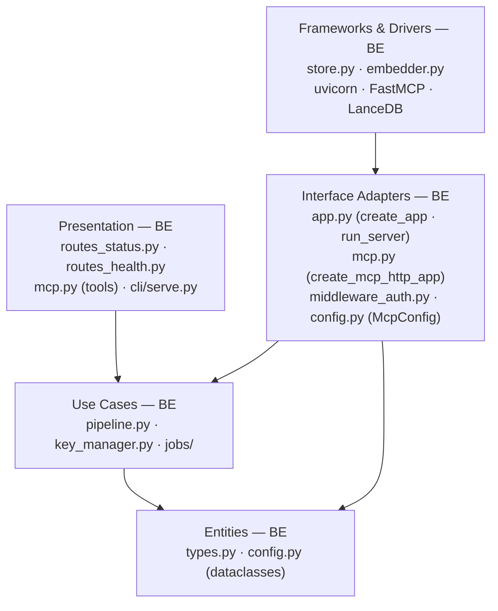
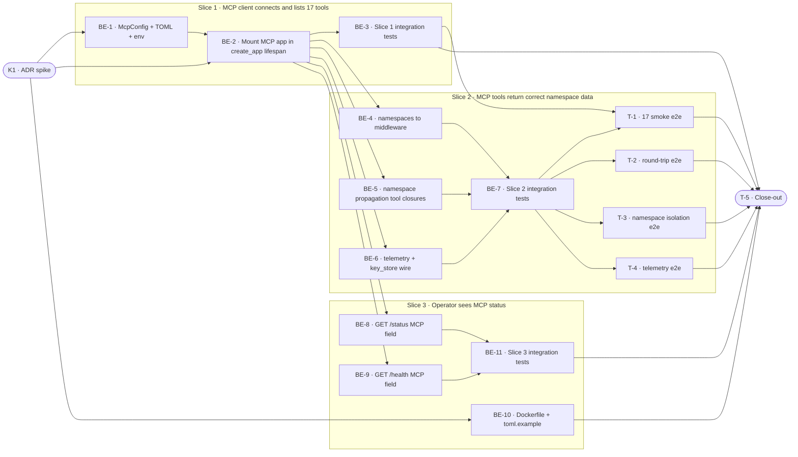

# D9 · MCP HTTP Server Wiring — Team Plan

**How to read this file**
- **Architecture approach:** Clean Architecture (default). **Layers:** Presentation · Use Cases · Interface Adapters · Entities · Frameworks & Drivers. Each task's first sub-bullet names the layer it touches.
- The **Frontend, Backend, and Tester** sections are the **depth view** — each role's work, grouped by layer.
- The **Task Breakdown** is the **order view** — every task is a single-role checkbox in execution order, opening with a dependency graph.
- **Phases are vertical slices**: each delivers a working end-to-end increment. Sliced with the **`vertical-slicer` skill**.
- Each task carries the **role tag at the end of its title line**, then sub-bullets: **layer · estimate**, **needs · completes**, and a **Tests** block.
- **Tests:** unit and integration tests belong to the implementing dev (test-first); e2e and manual tests are the tester's tasks. The close-out task writes no tests.
- **Contracts:** TypeSpec v1.13.0 available. Internal logical seams authored as standalone core-construct `.tsp` files beside this plan (validated with `tsp compile --no-emit`). HTTP/API seam emits `api-contracts/archon-mcp-status.openapi.yaml`. All four contracts compiled clean.
- **Role tags** (`#frontend-role`, `#backend-role`, `#tester-role`) mark each role-owned section.
- IDs (`S#`, `C#`, `BE-#`/`T-#`/`K#`, `Q#`) are the traceability thread.
- **Rule:** edit your own tasks freely; change a contract only by team agreement.

---

## Background

`create_mcp_http_app()` in `archon_search/server/mcp.py:1505` is a fully implemented Starlette app with 17 registered tools — but `create_app()` in `archon_search/server/app.py` never calls it. Any operator who configures Claude Code to use `http://localhost:8765/mcp` as an MCP server gets a connection refused. The fix is to mount the MCP app at `/mcp` inside `create_app()`'s async lifespan — no second Uvicorn, no second port. Three additional asymmetries make the implemented but un-wired MCP app incorrect even once bound: (1) `create_mcp_http_app()` passes `namespaces={}` instead of `config.namespaces`, making TOML namespace tokens invisible to MCP auth; (2) all 16 non-`update_collection` tool closures hardcode `DEFAULT_NAMESPACE` instead of reading the authenticated namespace from the request context; (3) the telemetry writer and `key_store` are not wired from the REST lifespan, so MCP telemetry is absent and only 13 of 17 tools register.

---

## Goal

On server start, archon-search mounts the MCP app at `/mcp` on the REST port (8765). Claude Code and other FastMCP HTTP clients can connect at `http://localhost:8765/mcp` immediately with the same bearer token used for REST. MCP tool calls respect namespace auth, use the caller's authenticated namespace in all pipeline method calls, and write telemetry identically to REST.

---

## Scope

### In Scope
- **ADR spike (K-1, prerequisite):** confirm that `app.mount("/mcp", create_mcp_http_app(…))` works with FastMCP's streamable-HTTP ASGI app — lifespan delegation and middleware inheritance. Prove the namespace propagation mechanism with working code. ADR must document both findings before any implementation begins.
- **Config:** new `[mcp]` TOML section — `enabled` (default `true`). New `McpConfig` dataclass in `archon_search/config.py`.
- **Server wiring:** call `create_mcp_http_app(…)` inside `create_app()`'s async lifespan after all objects are ready; mount the returned Starlette app at `/mcp` on the existing FastAPI app.
- **Asymmetry fix #1:** pass `config.namespaces` to `create_mcp_http_app()` instead of hardcoded `{}` (`mcp.py:1543`).
- **Asymmetry fix #2:** thread the authenticated namespace into all 17 tool closures via the mechanism proven in the ADR spike (currently all tools except `update_collection` hardcode `DEFAULT_NAMESPACE`; `update_collection`'s `ctx.meta.get("namespace")` is dead code).
- **Asymmetry fix #3:** wire the lifespan-constructed `telemetry_writer` and `key_store` to `create_mcp_http_app()`.
- **`GET /status` and `GET /health`** include `McpStatusDetail` (`enabled`, `bindAddress`) when `mcp.enabled = true`.
- **`mcp.enabled = false` gate:** REST starts normally; MCP server is never created; `/status` returns the `mcp` field as `null`.
- **`serve` mode (Docker):** MCP inherits REST's host (`0.0.0.0` when `serve=True`); no separate port or Dockerfile change needed.
- **ADR document** covering: mount compatibility confirmed (K-1 spike result); namespace propagation mechanism (proven).
- **Tests:** integration tests for lifecycle, enable gate, namespace propagation, telemetry wiring (backend-dev owned, test-first); e2e suite for 17 tool smokes, round-trip ingest+search, namespace isolation, telemetry (tester-owned).

### Out of Scope
- MCP-specific auth tokens (MCP uses the shared key store)
- MCP over stdio or SSE transports — HTTP (streamable-http) only
- Unhappy-path auth-failure e2e tests — existing unit/integration tests cover those; the namespace data-isolation e2e is the sole carve-out for new code
- Use Cases layer extraction — deduplication between REST routes and MCP tools is a separate follow-on backlog item
- TLS for the MCP port — operator responsibility (reverse proxy)
- Per-port TLS configuration

---

## Acceptance criteria

- [ ] Starting archon-search with default config: an MCP client connecting to `http://localhost:8765/mcp` with a valid bearer token receives a list of 17 tools.
- [ ] Each of the 17 tools responds with a non-empty, schema-valid response when called with valid input.
- [ ] `ingest_file` via MCP stores a document; a subsequent `search` via MCP returns that document.
- [ ] A managed bearer token scoped to namespace A: MCP tool calls return only namespace A's data, not namespace B's.
- [ ] MCP tool calls with telemetry enabled produce entries in the telemetry JSONL log.
- [ ] Setting `mcp.enabled = false` prevents the `/mcp` mount from being created; `GET /status` returns the `mcp` field as `null`.
- [ ] TestClient lifespan exit shuts down both REST and MCP cleanly (no errors, no resource leaks).
- [ ] `GET /status` response includes `mcp.enabled` and `mcp.bindAddress` when `mcp.enabled = true`.

---

## What does NOT change

- REST server on port 8765 — no changes to existing REST routes, schemas, or auth behavior
- `APIKeyMiddleware` auth logic — tokens, key store, namespace resolution logic are unchanged
- The 17 tool implementations in `mcp.py` — only the namespace-reading pattern and factory wiring change
- Telemetry entry format and the no-raw-query structural invariant
- LanceDB write behavior — both servers share the same store; LanceDB file-level locking serializes concurrent writes (no deadlock, latency may increase under load)
- MCP tool registrations in `mcp.py` — no tools added or removed; 4 key-management tools already conditionally registered when `key_store` is provided

---

## Known limitations / accepted trade-offs

- **`rotate_key` hot-reload limitation:** After `POST /keys/rotate`, the REST app's middleware reads the updated key from `app.state.api_key` immediately. The MCP sub-app's `APIKeyMiddleware` instance holds a separate `self._api_key` value captured at construction time — this value NEVER updates at runtime because the Starlette sub-app's `request.app.state` does not carry the REST app's `api_key`. Note the cache distinction: `KeyStore.active_keys()` re-reads `keys.json` from disk on every call (no in-memory cache), so the *new* rotated key is reachable immediately via that managed-key path. What IS cached is `self._api_key` on the `APIKeyMiddleware` instance — the LEGACY single-key path, captured at middleware construction time. Result: after rotation with `grace_seconds > 0`, the pre-rotation key continues to authenticate MCP requests via the stale `self._api_key` legacy path until the process restarts (not just during the grace window), while the new key already works via `active_keys()`. Operator runbook: restart archon-search after `key rotate` to fully cut over on MCP.
- **LanceDB write contention:** concurrent REST + MCP ingest serializes at LanceDB's file-level lock. Latency under concurrent write load may increase; correctness is preserved.
- **CORS for MCP:** FastAPI parent-app `CORSMiddleware` does not apply to mounted Starlette sub-apps. Browser-based MCP clients making cross-origin requests to `/mcp` will encounter CORS errors. Non-browser clients (Claude Code CLI, `mcp` SDK) are unaffected. If CORS is needed for `/mcp`, add it to the MCP Starlette app in `create_mcp_http_app()` — out of scope for D9.
- **`ctx.meta.get("namespace")` pattern in `update_collection`** (`mcp.py:1022`) is currently dead code — `ctx.meta["namespace"]` is never populated. The fix mechanism is determined by the ADR spike; until K-1 is done, asymmetry fix #2 cannot be estimated precisely.

---

## Approach & architecture

The MCP HTTP app is already fully implemented in `archon_search/server/mcp.py`. This feature is an Interface Adapter + Presentation wiring task: it connects the MCP app to the server lifecycle, passes the correct dependencies, and ensures namespace auth flows correctly into every tool closure. No Use Cases or Entities changes are needed. The chosen approach is `app.mount("/mcp", create_mcp_http_app(…))` inside `create_app()`'s lifespan — single Uvicorn, shared event loop, no signal-handler coordination, no lifespan-object race. K-1 must confirm FastMCP ASGI compatibility before implementation begins.

**Layer map and role mapping**

| Layer | Role | Components touched by this feature |
|-------|------|-------------------------------------|
| Presentation | **Backend** | `server/mcp.py` (tool namespace fix), `server/routes_status.py` (McpStatusDetail), `server/routes_health.py`, `cli/serve.py` |
| Use Cases | Backend | No changes |
| Interface Adapters | Backend | `server/app.py` (`run_server`, `create_app`, lifespan), `server/mcp.py` (`create_mcp_http_app` wiring), `server/middleware_auth.py` (no changes), `config.py` (`McpConfig`) |
| Entities | Backend | `server/schemas.py` (`McpStatusDetail`, `McpStatusResponse`) |
| Frameworks & Drivers | Backend | `uvicorn` (mount, no second Server), `archon-search.toml.example` |

*Frontend: N/A — no browser UI exists in this project. Presentation = server-side Python (routes + CLI) owned by Backend.*

**What changes**
- `archon_search/config.py`: new `McpConfig` dataclass (`enabled` only); `SearchConfig.mcp: McpConfig` field; `[mcp]` TOML section parsing
- `archon_search/server/app.py`: `create_app()` lifespan calls `create_mcp_http_app(…)` and mounts at `/mcp`; `run_server()` unchanged
- `archon_search/server/mcp.py`: `create_mcp_http_app()` receives `namespaces=config.namespaces`; all 17 tool closures thread authenticated namespace into pipeline calls (mechanism per ADR); `key_store` and `writer` wired from lifespan
- `archon_search/server/routes_status.py` + `routes_health.py`: populate `mcp: McpStatusDetail` field. Note: `McpStatusDetail.bindAddress` value must be derived from `config.host:config.port/mcp` — not a hardcoded string. In serve mode (`serve=True`), host is `0.0.0.0`.
- `archon_search/server/schemas.py`: add `McpStatusDetail`, `McpStatusResponse`; add `mcp` field to `StatusResponse` and `HealthResponse`
- `archon-search.toml.example`: `[mcp]` section with `enabled` default and comment

**Import note:** Both `archon_search/server/mcp.py` (line 169) and `archon_search/server/app.py` define a `create_app` function. `app.py` must import from `mcp.py` using `from archon_search.server.mcp import create_mcp_http_app` only — never import `mcp.create_app` or use a wildcard import.

**Key decisions (from the brief)**
- **Mount chosen:** `app.mount("/mcp", ...)` inside `create_app()`'s lifespan — single port, single Uvicorn, shared event loop, no signal-handler coordination. K-1 spike must confirm FastMCP ASGI compatibility before implementation.
- **Namespace propagation mechanism:** proven by K-1 ADR spike — `ctx.meta`, custom middleware, or closure-captured state. The `update_collection` `ctx.meta.get("namespace")` pattern is dead code; no existing working pattern to copy.
- **All three asymmetries ship with the wiring:** the feature is complete only when wiring works, three asymmetries are fixed, and e2e is green. Use Cases extraction is explicitly a follow-on item.
- **`mcp.enabled = true` by default:** MCP is mounted on the same port as REST; defaulting on gives operators immediate value.

---

## Contracts / seams

Boundaries where roles and sub-systems must agree. Changing one requires team agreement. TypeSpec v1.13.0 used; all four compiled clean.

**C1 — McpConfig shape** *(Frameworks & Drivers ↔ Interface Adapters)*
The TOML `[mcp]` section fields and defaults. Both the config parser and `run_server()` / `create_app()` must agree on this shape. See [`archon-mcp-config.tsp`](archon-mcp-config.tsp).
- Realised by: BE-1 · Verified by: BE-1 (unit tests), BE-3 (integration)

**C2 — `create_mcp_http_app()` factory wiring** *(Interface Adapters ↔ Presentation/MCP)*
The corrected factory call passes `namespaces=config.namespaces`, a lifespan-constructed `key_store`, and the lifespan-constructed `writer`. See [`archon-mcp-factory.tsp`](archon-mcp-factory.tsp).
- Realised by: BE-2 (bind + key load), BE-4 (namespaces), BE-6 (writer + key_store) · Verified by: BE-3, BE-7

**C3 — `GET /status` McpStatusDetail extension** *(HTTP/API seam — REST endpoint)*
New `mcp: McpStatusDetail | null` field on the JSON response when `mcp.enabled = true`. See [`api-contracts/archon-mcp-status.tsp`](api-contracts/archon-mcp-status.tsp) + [`api-contracts/archon-mcp-status.openapi.yaml`](api-contracts/archon-mcp-status.openapi.yaml).
- Realised by: BE-8 · Verified by: BE-11, T-5 (acceptance fact-check)

**C4 — Namespace propagation to tool closures** *(Interface Adapters ↔ Presentation/MCP tools)*
Logical invariant: for any bearer token scoped to namespace N, all 17 MCP tool closures MUST use N (not `DEFAULT_NAMESPACE`) when calling pipeline methods. The propagation mechanism (FastMCP context, custom middleware, or closure-captured state) is determined by the K-1 ADR spike. See [`archon-mcp-namespace.tsp`](archon-mcp-namespace.tsp).
- Realised by: BE-5 · Verified by: BE-7 (integration), T-3 (e2e isolation)

---

## Scenarios #tester-role

| id | Scenario (Given / When / Then) |
|----|--------------------------------|
| **S1** | **Given** archon-search starts with `mcp.enabled = true` · **When** the process is ready · **Then** the MCP endpoint is reachable (no connection refused) |
| **S2** | **Given** the MCP endpoint is reachable · **When** a client sends a valid bearer token and requests the tool list · **Then** exactly 17 tools are returned |
| **S3** | **Given** the MCP endpoint is running · **When** each of the 17 tools is called with a valid bearer token and minimal valid input · **Then** the tool responds with a non-empty, schema-valid result |
| **S4** | **Given** the MCP endpoint is running · **When** a client calls `ingest_file` with a valid document path · **Then** the document is retrievable from the store |
| **S5** | **Given** a document was ingested via MCP (S4) · **When** a client calls `search` with a query matching the document · **Then** the document appears in the results |
| **S6** | **Given** the server is running with `mcp.enabled = true` · **When** TestClient lifespan exits · **Then** the MCP mount shuts down cleanly with the REST app (no errors, no resource leaks) |
| **S7** | **Given** `mcp.enabled = true` · **When** a client calls `GET /status` · **Then** the response includes `mcp.enabled = true` and `mcp.bindAddress` as a non-null string |
| **S8** | **Given** a managed bearer token scoped to namespace A exists · **When** an MCP tool that reads data (e.g., `search`, `list_documents`) is called with that token · **Then** the response contains only namespace A data, not namespace B data |
| **S9** | **Given** telemetry is enabled (`telemetry.enabled = true`) · **When** any MCP tool is called · **Then** a telemetry entry appears in the JSONL log for that call |
| **S10** | **Given** `mcp.enabled = false` in config · **When** the server starts · **Then** the `/mcp` mount is never created; `GET /status` returns the `mcp` field as `null` |
| **S11** | **Given** an MCP tool is called with an invalid or missing bearer token · **When** the request reaches the `/mcp` mounted endpoint · **Then** the response is 401 Unauthorized (not 404 or 500) |
| **S12** | **Given** `config.namespaces` contains TOML namespace tokens · **When** a TOML namespace token is used as a bearer to call an MCP tool · **Then** `APIKeyMiddleware` resolves the correct namespace (not the empty-dict fallback) |
| **S13** | **Given** telemetry is disabled (`writer = None`) · **When** any MCP tool is called · **Then** the tool executes normally with no writer-related errors |
| **S14** | **Given** `key_store` is passed to `create_mcp_http_app()` · **When** the MCP tool list is requested · **Then** all 17 tools are registered (including the 4 key-management tools) |

---

## Frontend — Presentation #frontend-role

N/A — no browser UI exists in this project. The Presentation layer (FastAPI routes, MCP tool definitions, Click CLI) is server-side Python, owned by Backend.

---

## Backend — Entities · Use Cases · Adapters · Frameworks #backend-role

**Scope:** All implementation work for this feature. Writes unit and integration tests (test-first) for each task.
**Owns layers:** Entities, Use Cases, Interface Adapters, Frameworks & Drivers, Presentation (routes, MCP tools, schemas).

**Tasks by layer** *(checkable in the Task Breakdown)*

- Entities: BE-1 (McpConfig dataclass, SearchConfig.mcp field, McpStatusDetail schema)
- Frameworks & Drivers: BE-1 (TOML parsing), BE-10 (toml.example)
- Interface Adapters: BE-2 (MCP mount in create_app() lifespan + enable gate), BE-4 (asymmetry #1), BE-5 (asymmetry #2 — namespace propagation), BE-6 (asymmetry #3), BE-3, BE-7 (integration tests)
- Presentation (MCP): BE-5 (tool closure namespace fix)
- Presentation (REST): BE-8 (GET /status), BE-9 (GET /health), BE-11 (status/health integration tests)

**Done when**
- [ ] MCP endpoint binds and is reachable — S1
- [ ] 17 tools listed with valid bearer — S2
- [ ] Namespace propagation correct for all 17 tool closures — S8, S12
- [ ] Telemetry and key_store wired — S9, S14
- [ ] `GET /status` / `GET /health` include McpStatusDetail — S7
- [ ] `mcp.enabled = false` gate works — S10
- [ ] Lifecycle integration test (SIGTERM) passes — S6
- [ ] All integration tests green in CI

---

## Tester #tester-role

**Scope:** e2e tests plus the project close-out. Unit and integration tests belong to the backend dev (in each BE-# task's Tests block).

**Tasks** *(checkable in the Task Breakdown)*
- T-1 — 17 MCP tool smoke e2e tests (Slice 2)
- T-2 — Round-trip ingest + search e2e (Slice 2)
- T-3 — Namespace data-isolation e2e (Slice 2)
- T-4 — Telemetry wiring e2e (Slice 2)
- T-5 — Project close-out & acceptance fact-check (Close-out)

**Allocation** — cheapest level that proves each scenario

| Scenario | Level | Rationale |
|----------|-------|-----------|
| S1 — MCP binds, reachable | integration | BE-3 (`test_mcp_endpoint_reachable`) |
| S2 — 17 tools listed | integration + e2e | BE-3 (integration), T-1 (e2e smoke) |
| S3 — Each tool responds schema-valid | **e2e** (T-1) | Requires live FastMCP JSON-RPC transport |
| S4 — ingest_file stores document | **e2e** (T-2) | Requires round-trip through full stack |
| S5 — search finds ingested document | **e2e** (T-2) | Ditto |
| S6 — TestClient lifespan exit cleans up MCP | integration | BE-3 (`test_lifecycle_shutdown`) via TestClient context-manager exit |
| S7 — GET /status MCP field | integration | BE-11 |
| S8 — Namespace propagation (tool uses correct ns) | integration + e2e | BE-7 (integration), T-3 (e2e isolation proof) |
| S9 — Telemetry entry logged | integration + e2e | BE-7 (integration), T-4 (e2e) |
| S10 — mcp.enabled=false gate | unit + integration | BE-2 unit, BE-3 integration |
| S11 — MCP rejects unauthenticated (401) | integration | BE-2 (`test_mcp_mounted_rejects_unauthenticated`) |
| S12 — TOML namespace tokens → correct ns | integration | BE-7 |
| S13 — writer=None → no errors | integration | BE-7 (`test_mcp_telemetry_none_writer`) |
| S14 — 17 tools with key_store | integration | BE-3 (`test_mcp_tools_count_with_key_store`) |

---

## Documentation update

Docs the feature touches — the close-out task works through this list.

- [ ] `Documentation/Backlog/mcp-wiring-brief.md` — no changes needed (source brief)
- [ ] `Documentation/Backlog/mcp-wiring-team-plan.md` — this file (update status: draft → done at close-out)
- [ ] `CLAUDE.md` — update MCP tools count / wiring description in "Server" section; update `config.py` entry for new `McpConfig` + `AuthConfig`; update CLI section for `serve` command MCP-bind behavior
- [ ] `archon-search.toml.example` — add `[mcp]` section with `enabled` default and comment
- [ ] `Documentation/Architecture/100_system_architecture_overview.md` — update to show MCP mount at `/mcp` on port 8765 in C4 diagram
- [ ] `Documentation/Architecture/110_component_catalog_and_layer_breakdown.md` — add `McpConfig` to Interface Adapters; update `create_mcp_http_app` wiring note
- [ ] `Documentation/Architecture/120_services_and_integration_architecture.md` — add MCP HTTP endpoint as a service; document lifecycle relationship to REST
- [ ] `Documentation/Architecture/160_operational_readiness_monitoring_and_reliability.md` — operator runbook: `rotate_key` hot-reload limitation; MCP available at `/mcp` on existing REST port
- [ ] `Documentation/Architecture/600_api_reference_or_public_interface.md` — update `GET /status` schema (McpStatusDetail); update `GET /health` (mcp field); update `[mcp]` config section; update MCP tools list note (17 tools, wiring now active)
- [ ] ADR new entry — `Documentation/ADRs/` — document mount approach (K-1 spike result) and namespace propagation mechanism
- [ ] `tests/contract/openapi_snapshot.json` — regenerate with `uv run --python 3.12` after BE-8 lands

---

## Open questions

Q2 must be answered by the K-1 ADR spike before implementation begins (status moves `draft → planned`). Q1, Q3, Q4 are resolved.

| id | Area | Question |
|----|------|----------|
| **Q1** | Architecture | *(Answered — mount chosen.)* K-1 spike must confirm `app.mount("/mcp", create_mcp_http_app(…))` works: FastMCP session management compatible with FastAPI middleware stack; ASGI lifespan delegates correctly. If a concrete blocker is found, ADR records it and team revisits. |
| **Q2** | Namespace propagation | *(Open — must be proven by K-1.)* How does `request.state.namespace` (set by `APIKeyMiddleware`) reach FastMCP tool closures? `ctx.meta.get("namespace")` in `update_collection` (`mcp.py:1022`) is dead code — nothing populates it. No working pattern to copy. **K-1 must prove the mechanism with working code before BE-5 can be estimated.** |
| **Q3** | Lifespan objects | *(Resolved by mount.)* `create_mcp_http_app()` is called inside `create_app()`'s lifespan — all objects are available. No race, no ordering problem. |
| **Q4** | Lifecycle test approach | *(Answered.)* TestClient context-manager exit. Fast, CI-safe, covers clean ASGI shutdown. Subprocess + real SIGTERM deferred to a `@pytest.mark.live` test if signal-handling bugs emerge. |

---

## Task Breakdown

Single-role tasks in execution order, grouped into vertical slices.

### Dependency graph

---

### Phase 0 · Kickoff

- [x] **K-1** — Write ADR: spike FastMCP mount under FastAPI (lifespan delegation + middleware inheritance); spike namespace propagation mechanism; prove both with working code. **No other task may start until K-1 is done.** #backend-role
    - — · 8.0h
    - completes Q1 (confirmation), Q2 (proof), Q3 (n/a — resolved by mount), Q4 (n/a — answered)
    - Required proofs (all four must be demonstrated with working code in the ADR):
        1. `app.mount("/mcp", create_mcp_http_app(…))` works — route matching after lifespan mount, and the `/mcp` mount does NOT appear in the OpenAPI schema.
        2. TestClient (or `httpx.AsyncClient`) can complete the full `initialize` → `tools/list` → `tools/call` JSON-RPC sequence — determines whether BE-3/5/6/7 integration tests are feasible or must be redesigned.
        3. Namespace propagation mechanism — `request.state.namespace` (set by `APIKeyMiddleware`) reaches FastMCP tool closures; concrete working code sample.
        4. FastMCP's `streamable_http_app()` sub-app lifespan is correctly delegated (or not) when mounted; if it has its own lifespan, document whether it fires.
    - If mount-in-lifespan fails: fallback is to call `create_mcp_http_app()` synchronously inside `create_app()` before the lifespan, passing `None` for writer/key_store and patching them via `app.state` in the lifespan. Document the fallback in the ADR if needed.
    - If TestClient cannot complete tool calls: redesign BE-3/5/6/7 integration tests to use `httpx.AsyncClient` or promote them to e2e tests. Adjust estimates accordingly.
    - Tests

---

### Phase 1 · Slice 1 · MCP client connects and lists 17 tools *(walking skeleton)*

- [x] **BE-1** — Add `McpConfig` dataclass, `[mcp]` TOML section #backend-role
    - Entities + Frameworks & Drivers · 1.0h
    - needs K-1 · completes C1
    - Tests
        - #unit_test — `test_mcp_config_defaults` — McpConfig defaults: `enabled=True`
        - #unit_test — `test_mcp_config_toml_section` — `[mcp]` section parsed into `SearchConfig.mcp`; `enabled` overridable
        - #unit_test — `test_mcp_config_missing_section_uses_defaults` — missing `[mcp]` section yields all defaults
        - #unit_test — `test_mcp_config_enabled_false` — `enabled = false` in TOML sets `config.mcp.enabled = False`

- [x] **BE-2** — Mount MCP app in `create_app()` lifespan + enable gate #backend-role
    - Interface Adapters · 3.0h
    - needs K-1, BE-1 · completes S1, S10, C2 (partial)
    - Tests
        - #unit_test — `test_mcp_disabled_skips_mount` — `mcp.enabled=False` → `create_mcp_http_app()` never called; no `/mcp` route
        - #integration_test — `test_mcp_endpoint_responds_when_enabled` — with `mcp.enabled=True`, HTTP GET on `/mcp` endpoint returns non-4xx
        - #integration_test — `test_rest_endpoint_unaffected` — REST `GET /health` still responds correctly after MCP mount
        - #integration_test — `test_mcp_disabled_no_mount` — `mcp.enabled=False` → `/mcp` returns 404
        - #integration_test — `test_mcp_mounted_rejects_unauthenticated` — POST to `/mcp` on the mounted FastAPI app (via TestClient) without a bearer token → assert 401 response; verifies that `APIKeyMiddleware` on the MCP sub-app fires correctly after mount

- [x] **BE-3** — Slice 1 integration tests: tool count, lifecycle, enable gate #backend-role
    - Interface Adapters · 2.0h
    - needs BE-2 · completes S1, S2, S6, S10, S14
    - Tests
        - #integration_test — `test_mcp_tool_list_returns_17_tools` — JSON-RPC `tools/list` over TestClient returns exactly 17 tools when `key_store` is wired
        - #integration_test — `test_mcp_tool_list_returns_13_tools_without_key_store` — 13 tools when `key_store=None`
        - #integration_test — `test_lifecycle_shutdown` — TestClient context-manager exit (lifespan teardown) shuts down MCP mount cleanly; no errors or resource leaks
        - #integration_test — `test_mcp_enabled_false_gate` — `config.mcp.enabled=False` → `/mcp` returns 404, `GET /status` returns `mcp` field as `null`

---

### Phase 2 · Slice 2 · MCP tools return correct namespace data

- [x] **BE-4** — Asymmetry fix #1: pass `config.namespaces` to `create_mcp_http_app()` (`mcp.py:1543`) #backend-role
    - Interface Adapters · 1.0h
    - needs BE-2 · completes S12, C2 (partial)
    - Tests
        - #unit_test — `test_mcp_middleware_receives_namespaces` — `create_mcp_http_app(namespaces={"tok": "ns-a"})` → middleware constructed with that dict, not `{}`
        - #integration_test — `test_toml_namespace_token_accepted_by_mcp` — TOML namespace token Bearer → 200 from MCP endpoint (not 401)

- [x] **BE-5** — Asymmetry fix #2: thread authenticated namespace into all 17 tool closures (mechanism per K-1 ADR) #backend-role
    - Interface Adapters + Presentation · TBD pending K-1 (current 4.0h is a pre-K-1 placeholder; actual depends on mechanism complexity)
    - needs K-1, BE-2 · completes S8, C4
    - Scope: all 17 tool closures AND the `_resolve_embedder(pipeline, collection, embedder_cache)` helper at `mcp.py:161` (called by search, search_with_context, explain, ingest_file, ingest_directory — all of which need namespace to resolve the correct embedder)
    - Call sites requiring namespace threading: `pipeline.search()` (search, search_with_context), `pipeline.search_many()` (search_many), `pipeline.get_collection_meta()` (get_collection_meta, _resolve_embedder), `pipeline.get_all_collections_meta()` (get_collections_meta, list_collections, explain), `pipeline.list_documents()` (list_documents), `pipeline.ingest_file()` (ingest_file), `pipeline.ingest_directory()` (ingest_directory), `pipeline.export_collection()` (export_collection), `pipeline.import_collection()` (import_collection), `pipeline.delete_document()` (delete_document), key-management tools as-is (no pipeline calls)
    - Note: `delete_document` tool has an explicit `namespace` parameter that currently defaults to `DEFAULT_NAMESPACE` — BE-5 should make it fall back to the authenticated namespace when not explicitly provided
    - Tests
        - #unit_test — `test_search_tool_uses_resolved_namespace` — mock pipeline; call `search` tool with ns-A context → `pipeline.search` called with `namespace="ns-a"` not `DEFAULT_NAMESPACE`
        - #unit_test — `test_list_documents_uses_resolved_namespace` — same pattern for `list_documents`
        - #unit_test — `test_explain_uses_resolved_namespace` — same pattern for `explain`
        - #unit_test — `test_ingest_file_uses_resolved_namespace` — mock pipeline; call `ingest_file` with ns-A context → `pipeline.ingest_file` called with `namespace="ns-a"` not `DEFAULT_NAMESPACE`
        - #unit_test — `test_export_collection_uses_resolved_namespace` — same pattern for `export_collection`
        - #unit_test — `test_resolve_embedder_uses_resolved_namespace` — mock pipeline; `_resolve_embedder` called with ns-A context → `pipeline.get_collection_meta` called with `namespace="ns-a"`
        - #integration_test — `test_mcp_namespace_propagation_cross_ns_tool_call` — managed key scoped to ns-a; call `list_documents`; assert response references only ns-a collections

- [ ] **BE-6** — Asymmetry fix #3: wire telemetry writer + key_store from lifespan to `create_mcp_http_app()` #backend-role
    - Interface Adapters · 1.0h
    - needs BE-2 · completes S9, S13, S14 (confirmed), C2 (completed)
    - Tests
        - #unit_test — `test_mcp_writer_none_tool_executes_normally` — `create_mcp_http_app(writer=None)` → tool call succeeds, no AttributeError
        - #integration_test — `test_mcp_telemetry_entry_written` — real TelemetryWriter; call MCP `search` tool; assert JSONL log contains one entry with expected fields
        - #integration_test — `test_mcp_telemetry_disabled_no_entry` — `writer=None`; call MCP `search`; no JSONL entry written

- [ ] **BE-7** — Slice 2 integration tests: namespace propagation, telemetry, key_store, writer=None #backend-role
    - Interface Adapters · 2.0h
    - needs BE-4, BE-5, BE-6 · completes S8, S9, S12, S13, S14
    - Tests
        - #integration_test — `test_namespace_isolation_via_mcp` — two namespaces; managed key for ns-a; `search` via MCP returns only ns-a documents
        - #integration_test — `test_toml_namespace_scope_honoured` — TOML namespace token for ns-b; `list_collections` via MCP returns only ns-b collections
        - #integration_test — `test_telemetry_wired_mcp_call_logs_entry` — full stack; MCP `search` → JSONL entry present
        - #integration_test — `test_telemetry_none_writer_no_crash` — `writer=None`; all 17 tools callable; no AttributeError

- [ ] **T-1** — 17 MCP tool smoke e2e tests (one per tool; shape-valid response) #tester-role
    - — · 4.0h
    - needs BE-3, BE-7 · completes S3
    - Note: `test_mcp_smoke_delete_document` and `test_mcp_smoke_revoke_key` are destructive. T-1 must use a throwaway namespace or per-test teardown to ensure destructive smokes do not corrupt documents or keys used by T-2, T-3, T-4. Recommended: a dedicated `mcp-smoke-test-{uuid}` namespace per T-1 run, cleaned up in teardown.
    - Tests
        - #e2e_test — `test_mcp_smoke_search` — calls `search`, response non-empty, schema-valid
        - #e2e_test — `test_mcp_smoke_search_with_context` — calls `search_with_context`, response non-empty, schema-valid
        - #e2e_test — `test_mcp_smoke_explain` — calls `explain`, response non-empty, schema-valid
        - #e2e_test — `test_mcp_smoke_ingest_file` — calls `ingest_file`, response non-empty, schema-valid
        - #e2e_test — `test_mcp_smoke_ingest_directory` — calls `ingest_directory`, response non-empty, schema-valid
        - #e2e_test — `test_mcp_smoke_list_collections` — calls `list_collections`, response is list (may be empty)
        - #e2e_test — `test_mcp_smoke_get_collections_meta` — calls `get_collections_meta`, response schema-valid
        - #e2e_test — `test_mcp_smoke_get_collection_meta` — calls `get_collection_meta`, response schema-valid or 404-equivalent
        - #e2e_test — `test_mcp_smoke_list_documents` — calls `list_documents`, response is list
        - #e2e_test — `test_mcp_smoke_delete_document` — calls `delete_document`, response non-empty
        - #e2e_test — `test_mcp_smoke_update_collection` — calls `update_collection`, response non-empty
        - #e2e_test — `test_mcp_smoke_export_collection` — calls `export_collection`, response non-empty
        - #e2e_test — `test_mcp_smoke_import_collection` — calls `import_collection`, response non-empty
        - #e2e_test — `test_mcp_smoke_create_key` — calls `create_key`, response contains key id
        - #e2e_test — `test_mcp_smoke_list_keys` — calls `list_keys`, response is list
        - #e2e_test — `test_mcp_smoke_revoke_key` — calls `revoke_key`, response non-empty
        - #e2e_test — `test_mcp_smoke_rotate_key` — calls `rotate_key`, response non-empty

- [ ] **T-2** — Round-trip e2e: ingest file via MCP then search via MCP returns that document #tester-role
    - — · 1.5h
    - needs BE-7 · completes S4, S5
    - Tests
        - #e2e_test — `test_mcp_ingest_then_search_round_trip` — ingest file via MCP `ingest_file`; poll until DONE; call `search` with matching query; assert document in results
        - #e2e_test — `test_mcp_ingest_directory_then_search` — ingest directory via MCP; poll; search; assert at least one result

- [ ] **T-3** — Namespace data-isolation e2e: valid cross-namespace token cannot see wrong namespace's data #tester-role
    - — · 2.0h
    - needs BE-7 · completes S8 (e2e proof)
    - Tests
        - #e2e_test — `test_mcp_namespace_data_isolation` — ingest doc-A under ns-a AND doc-B under ns-b (two documents in two namespaces); with the ns-a token, `search` finds doc-A and does NOT find doc-B; with the ns-b token, `search` finds doc-B and does NOT find doc-A. Proves bidirectional data isolation — not a vacuous pass against an empty namespace, and not just auth rejection

- [ ] **T-4** — Telemetry wiring e2e: MCP tool call → entry in telemetry log #tester-role
    - — · 1.0h
    - needs BE-7 · completes S9 (e2e)
    - Tests
        - #e2e_test — `test_mcp_telemetry_entry_in_log` — start app with telemetry enabled; call `search` via MCP; read JSONL log; assert entry present with expected field shapes (no raw query string per telemetry invariant)

---

### Phase 3 · Slice 3 · Operator sees MCP status in /status

- [ ] **BE-8** — Add `McpStatusDetail` schema + populate `mcp` field in `GET /status` response #backend-role
    - Presentation · 1.0h
    - needs BE-2 · completes S7 (partial), C3
    - Tests
        - #unit_test — `test_status_includes_mcp_detail_when_enabled` — mock app state; `GET /status` → response has `mcp.enabled=True` and `mcp.bindAddress` non-null
        - #unit_test — `test_status_mcp_null_when_disabled` — `mcp.enabled=False` → response `mcp` field is `null`
        - #unit_test — `test_mcp_status_detail_schema` — `McpStatusDetail(enabled=True, bindAddress=f"{config.host}:{config.port}/mcp")` serializes to correct JSON shape

- [ ] **BE-9** — Add `mcp` field to `GET /health` response #backend-role
    - Presentation · 0.5h
    - needs BE-2 · completes S7 (full — both endpoints)
    - Target: REST `GET /health` in `routes_health.py`. Note: `mcp.py:1498-1500` has a separate `/health` endpoint on the MCP sub-app itself (accessible at `/mcp/health`) that returns `{status: ok}` — do NOT modify that; it's the MCP sub-app's own health check.
    - Note: `HealthResponse` Pydantic model does not currently exist in `schemas.py`. BE-9 must either create it and migrate `routes_health.py` to use it, or add the `mcp` field as a plain dict key. Preferred: create `HealthResponse` model in `schemas.py` for consistency.
    - Tests
        - #unit_test — `test_health_includes_mcp_bind_when_enabled` — `GET /health` → response has `mcp.bindAddress` non-null when enabled
        - #unit_test — `test_health_omits_mcp_when_disabled` — `GET /health` → `mcp` is `null` when disabled

- [ ] **BE-10** — Add `[mcp]` section to `archon-search.toml.example` #backend-role
    - Frameworks & Drivers · 0.25h
    - needs K-1 · completes (operational documentation)
    - Tests

- [ ] **BE-11** — Slice 3 integration tests: status/health MCP fields #backend-role
    - Presentation · 1.0h
    - needs BE-8, BE-9 · completes S7
    - Tests
        - #integration_test — `test_status_mcp_field_present` — `make_real_app(mcp_enabled=True)` → `GET /status` response has `mcp.bindAddress` non-null
        - #integration_test — `test_status_mcp_field_absent_when_disabled` — `make_real_app(mcp_enabled=False)` → `GET /status` response `mcp` is null
        - #integration_test — `test_health_mcp_field` — same for `GET /health`

---

### Phase 4 · Close-out

- [ ] **T-5** — Project close-out & acceptance fact-check #tester-role
    - — · 4.0h
    - needs BE-3, BE-7, BE-10, BE-11, T-1, T-2, T-3, T-4 · completes (acceptance gate)
    - Tests
    - Duties
        - Update all documentation per the "Documentation update" section — CLAUDE.md, `archon-search.toml.example`, Architecture docs (100, 110, 120, 160, 600), new ADR entry, user manual; mark `[x]` for each doc updated.
        - Fix all build / compiler warnings, if any.
        - Run the full test suite (`uv run pytest`); fix every failing test, including any unrelated to this feature.
        - Regenerate OpenAPI snapshot: `uv run --python 3.12 python -c "..."` → update `tests/contract/openapi_snapshot.json`. (Adding `mcp` field to StatusResponse changes the schema.)
        - Validate every Acceptance criterion one-by-one with a fact check — no assumptions; verify each with a real test run or live server call.

**Critical path:** K-1 → BE-1 → BE-2 → BE-5 → BE-7 → T-3 → T-5

Note: BE-6 is also required for the 17-tool acceptance criterion (AC-1). BE-6 is parallel to BE-4 and BE-5 and does not extend the critical path, but must complete before T-1/T-5.
