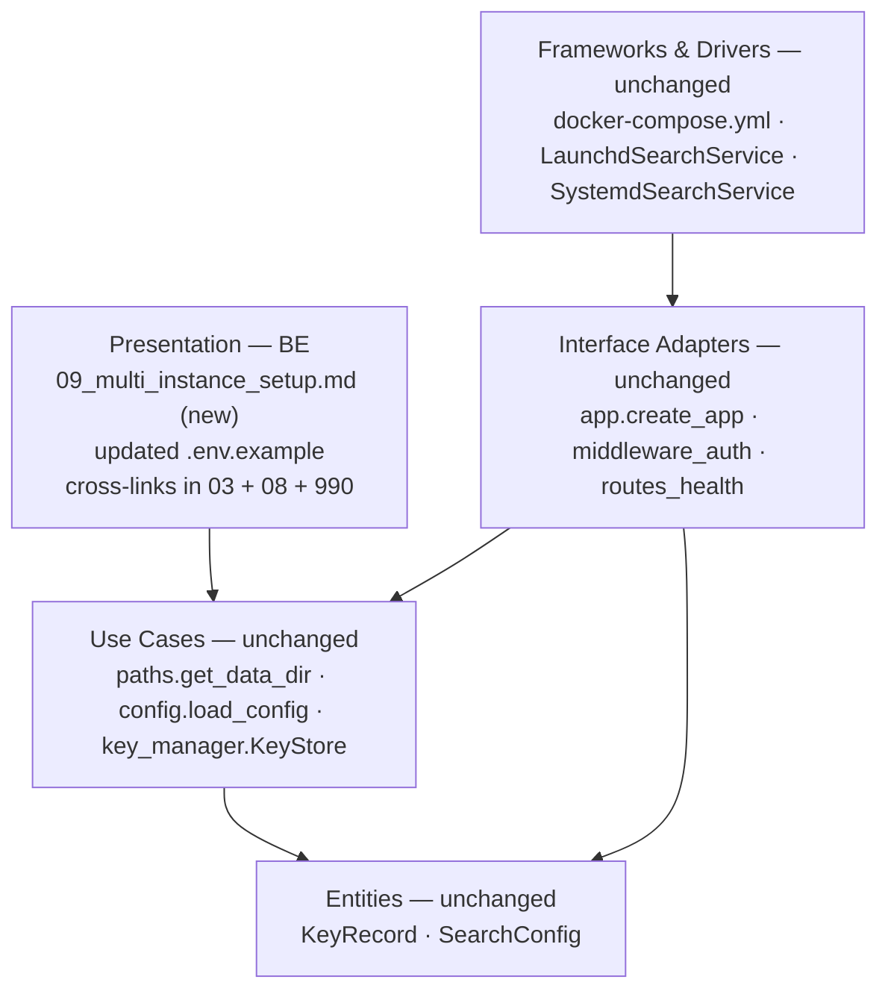
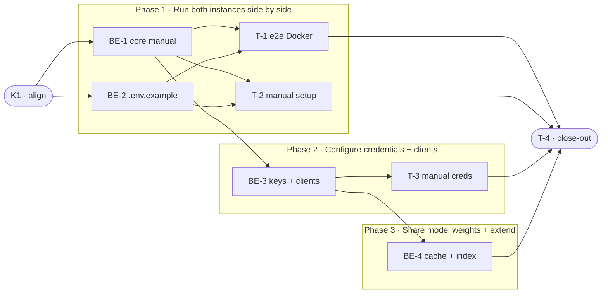

# MIS · Multi-Instance Setup (Prod + Dev-UAT) — Team Plan

**How to read this file**
- **Architecture approach:** Clean Architecture — the default fallback; no override skill was requested. **Layers:** Presentation · Use Cases · Interface Adapters · Entities · Frameworks & Drivers. Because this is a documentation-only feature, all Backend tasks map to **Presentation** (the deliverable IS the user manual, a user-facing artefact); no other layer changes.
- The **Frontend, Backend, and Tester** sections are the **depth view** — each role's work, grouped by layer.
- The **Task Breakdown** is the **order view** — every task is a single-role checkbox in execution order, opening with a dependency graph.
- **Phases are vertical slices**: each delivers a readable, validated manual section that enables a specific user action end-to-end. Sliced with the **`vertical-slicer`** skill.
- Each task carries the **role tag at the end of its title line**, then sub-bullets: **layer · estimate** (decimal hours), **needs · completes**, and a **Tests** block.
- **Tests** are tagged by level. **Integration tests belong to the implementing dev** (self-checks: run each documented command and verify it works before publishing); **e2e and manual tests are the tester's tasks**.
- **Contracts** are logical: built-in simplified form — this feature introduces no new code interfaces; contracts are factual agreements between the manual and the existing software behaviour.
- IDs (`S#`, `C#`, `BE-#`/`T-#`/`K#`, `Q#`) are the traceability thread.
- **Rule:** edit your own tasks freely; change a contract only by team agreement.

---

## Background

Running two archon-search instances on the same machine is technically possible today — `ARCHON_SEARCH_DATA_DIR`, `ARCHON_SEARCH_PORT`, and named Docker volumes provide full isolation — but completely undocumented. The OS service layer (launchd / systemd) supports only one hardcoded service name per user (`com.archon.search` on macOS, `archon-search` on Linux), so the prod+dev-UAT split requires prod to run as a native OS service and dev-UAT to run as the `archon-dev` Docker Compose service.

---

## Goal

After this ships: a developer reads `Documentation/UserManual/09_multi_instance_setup.md` and can, without prior multi-instance knowledge, run prod (native service, GPU-accelerated, port 8765) and dev-UAT (Docker, version-pinned, port 18765) side by side — each with isolated data, isolated API keys, and isolated client configuration.

---

## Scope

### In Scope
- New user manual: `Documentation/UserManual/09_multi_instance_setup.md` covering macOS, Linux, and Docker
- Updated `.env.example` with the real registry path (`ghcr.io/user538295/archon-search`) and a version-pinning example
- API key isolation guidance (retrieving each instance's key)
- HTTP client configuration for each instance; MCP client config with current-wiring caveat (see Q1)
- fastembed model cache sharing (three-step opt-in from `docker-compose.yml`)
- Going-further note for `archon-test` (port 18766)
- Doc-index update: `Documentation/Architecture/990_documentation_index_and_contribution_guide.md`
- Cross-links from `Documentation/UserManual/03_running_the_server.md` and `08_running_with_docker.md`
- One new e2e test in `tests/integration/test_multi_instance_e2e.py` (Docker side validation)

### Out of Scope
- Code changes — all isolation primitives already exist
- Named service support (`archon-search install --name`) — deferred; Docker covers the use case
- GPU passthrough for Docker dev-UAT — functional testing does not need GPU
- TLS / reverse proxy setup — operator responsibility, separate guide
- `archon-test` as a first-class documented environment — only a going-further note

---

## Acceptance criteria
- A reader with no prior multi-instance knowledge can follow `09_multi_instance_setup.md` and have both instances running
- `GET http://127.0.0.1:8765/health` (prod) and `GET http://127.0.0.1:18765/health` (dev-UAT) both return HTTP 200 after following the manual
- The LanceDB single-writer constraint is prominently called out (two containers sharing a volume = undefined index state)
- The API key persistence gotcha is prominently called out (no persistent volume → key regenerates on every container start)
- `.env.example` contains `ghcr.io/user538295/archon-search:TAG` as a concrete, copy-paste example
- `990_documentation_index_and_contribution_guide.md` lists the new doc
- `03_running_the_server.md` and `08_running_with_docker.md` cross-link to `09_multi_instance_setup.md`
- The new e2e test passes when `ARCHON_SEARCH_RUN_MULTI_INSTANCE_TESTS=1` is set
- All existing tests pass with zero failures after close-out

---

## What does NOT change
- `docker-compose.yml` — used as-is; the manual documents it, does not modify it
- `archon_search/platform/macos.py` and `linux.py` — service names remain hardcoded by design
- `archon_search/paths.py`, `config.py`, `key_manager.py` — isolation primitives unchanged
- All existing UserManual files — updated only to add cross-links (no content rewrites)

---

## Known limitations / accepted trade-offs
- Only one native service per OS user — dev-UAT must be Docker; a second native instance is not supported
- MCP client configuration is documented with a caveat: whether the `/mcp` endpoint is live depends on the runtime wiring (see Q1)
- The e2e test covers the Docker side only; native service install is validated by manual test
- GPU functionality of the native prod service is not covered by any automated test

---

## Approach & architecture

All work is documentation: investigate the existing software, write an accurate manual, and validate it by following the instructions. No layer of the codebase changes. The single new automated artefact is one integration test that verifies the Docker side of the manual by exercising the existing `docker-compose.yml` stack.

**Layer map (and role mapping)**

| Layer | Role | Components |
|-------|------|-----------|
| Presentation | **Backend** (technical writer) | `09_multi_instance_setup.md` (new), `.env.example` (updated), cross-links in `03_running_the_server.md`, `08_running_with_docker.md`, `990_documentation_index_and_contribution_guide.md` |
| Use Cases | — (unchanged) | `paths.get_data_dir()`, `config.load_config()`, `key_manager.KeyStore` |
| Interface Adapters | — (unchanged) | `app.create_app()`, `middleware_auth`, `routes_health`, `routes_status` |
| Entities | — (unchanged) | `KeyRecord`, `SearchConfig` |
| Frameworks & Drivers | — (unchanged) | `docker-compose.yml`, `platform/macos.LaunchdSearchService`, `platform/linux.SystemdSearchService` |

Frontend: N/A — no Presentation-layer code; the user manual is the Presentation artefact, authored by the Backend role.

**What changes**
- New: `Documentation/UserManual/09_multi_instance_setup.md`
- Updated: `.env.example` — real registry path + version-pinning example
- Updated: `Documentation/Architecture/990_documentation_index_and_contribution_guide.md` — new entry
- Updated: `03_running_the_server.md` and `08_running_with_docker.md` — cross-links only
- New test: `tests/integration/test_multi_instance_e2e.py` — Docker-side validation, opt-in

**Key decisions (from the brief)**
- Prod = native service (GPU + OS-managed lifecycle); dev-UAT = Docker (isolation + version pinning)
- No code changes — all isolation primitives already exist
- Image registry: `ghcr.io/user538295/archon-search`; `ARCHON_SEARCH_IMAGE` env var + `.env.example` mechanism for version pinning
- `archon-test` excluded from manual proper; acknowledged in a going-further note only

---

## Contracts / seams

Boundaries where the manual must accurately describe the software behaviour. **Logical, not code** (built-in fallback form; TypeSpec not used — no new code interface). Changing one requires team agreement (manual and code must stay in sync).

**C1 — Data isolation** *(Frameworks & Drivers ↔ Presentation)*
`ARCHON_SEARCH_DATA_DIR` is the single isolation knob — it redirects every runtime path (`db_path`, log file, telemetry dir, API key file, jobs file, fasttext model cache). Prod default: `~/.archon-search/`. Dev-UAT Docker: `/data` (inside `archon-dev-data` named volume). **Two instances must never share the same directory simultaneously** — LanceDB is single-writer; concurrent access = undefined index state. (`paths.py:43–87`, `docker-compose.yml:14–16`)
- Realised by: BE-1 · Verified by: T-1 (e2e), T-2 (manual)

**C2 — Port isolation** *(Frameworks & Drivers ↔ Presentation)*
Prod native service binds `127.0.0.1:8765` (TOML `[server].port` default, `config.py:92`). Dev-UAT Docker maps `18765:8765` (`docker-compose.yml` `archon-dev` service, line 41). Override via `ARCHON_SEARCH_PORT` env var or TOML `[server].port` — validated int 1–65535. Port-already-in-use: Docker Compose bind fails silently (container exits); detect with `lsof -i :18765`.
- Realised by: BE-1 · Verified by: T-1 (e2e), T-2 (manual)

**C3 — API key lifecycle** *(Frameworks & Drivers ↔ Presentation)*
Prod key: auto-generated on first start, stored at `~/.archon-search/.search.env` (mode `0o600`); retrieve via `cat ~/.archon-search/.search.env` or `archon-search key list`. Dev-UAT Docker: key written to `/data/.search.env` inside `archon-dev-data` volume; retrieve via `docker exec archon-dev cat /data/.search.env`. **Without a persistent volume**, the key regenerates on every container start — bare `docker run -p 18765:8765 ...` without `-v` breaks all issued tokens. (`key_manager.py:388–447`, `docker-compose.yml:18–20`)
- Realised by: BE-3 · Verified by: T-3 (manual)

---

## Scenarios #tester-role

| id | Scenario (Given / When / Then) |
|----|-------------------------------|
| **S1** | **Given** macOS with Python 3.12+ and archon-search installed · **When** reader follows the prod install section (`wizard` + `install` + `start`) · **Then** `~/Library/LaunchAgents/com.archon.search.plist` exists, `archon-search status` shows running, `GET 127.0.0.1:8765/health` returns HTTP 200 |
| **S2** | **Given** Linux with systemd and archon-search installed · **When** reader follows the prod install section (`wizard` + `install` + `start`) · **Then** `~/.config/systemd/user/archon-search.service` exists, `systemctl --user status archon-search` shows active, `GET 127.0.0.1:8765/health` returns HTTP 200 |
| **S3** | **Given** Docker installed and prod native running · **When** reader follows the dev-UAT section (`cp .env.example .env`, optionally sets `ARCHON_SEARCH_IMAGE`, `docker compose up archon-dev -d`) · **Then** container becomes healthy, `GET 127.0.0.1:18765/health` returns HTTP 200, `archon-dev-data` named volume is created |
| **S4** | **Given** both instances running · **When** reader verifies isolation (checks data dir paths; ingests a doc to each instance independently) · **Then** prod data lives in `~/.archon-search/search/`, dev-UAT data lives in `archon-dev-data` volume, each instance's search index is independent |
| **S5** | **Given** both instances running · **When** reader retrieves each instance's API key and tests cross-auth · **Then** prod key authenticates to port 8765 only; dev-UAT key authenticates to port 18765 only; each returns HTTP 401 on the wrong port |
| **S6** | **Given** both instances running with their respective keys · **When** reader follows the client config section · **Then** HTTP `curl` with the correct bearer token succeeds on each port; MCP client config entries (one per instance) point to `127.0.0.1:8765` and `127.0.0.1:18765` |
| **S7** | **Given** port 18765 is already occupied · **When** reader runs `docker compose up archon-dev` · **Then** container fails with a bind error; manual shows `lsof -i :18765` to diagnose and the TOML / env-var path to override the port |
| **S8** | **Given** reader attempts bare `docker run -p 18765:8765 ...` without a volume · **When** the container is restarted · **Then** the API key regenerates; the manual warns against this and directs the reader to `docker compose up archon-dev` which handles volume management automatically |
| **S9** | **Given** two containers sharing the same named volume simultaneously · **When** either instance writes to its LanceDB index · **Then** index state is undefined (data corruption risk); the manual states the single-writer constraint clearly and confirms `archon-dev-data` ≠ `archon-prod-data` |
| **S10** | **Given** reader follows the model cache section · **When** all three commented lines in `docker-compose.yml` are uncommented together · **Then** the dev-UAT container shares `archon-model-cache` with the prod Docker service (if used), avoiding the ~500 MB re-download on first start |
| **S11** | **Given** a reader with no prior Docker expertise · **When** they read the manual top-to-bottom · **Then** every command is copy-paste ready with no unexplained placeholders; critical warnings (LanceDB single-writer, key persistence) are visually prominent; the going-further note points to `archon-test` (port 18766) |

---

## Frontend — Presentation #frontend-role

N/A — no frontend (Presentation-layer code) work for this feature. The new user manual is itself a Presentation artefact but is authored by the Backend role (technical writer).

---

## Backend — Presentation (documentation) #backend-role

**Scope:** Technical writer who researches the existing software and produces accurate documentation. Owns all writing and the new e2e test file. Writes integration self-checks (running documented commands) to verify accuracy before publishing.
**Owns layer:** Presentation (documentation artefacts).

**Tasks** *(checkable in the Task Breakdown)*
- Presentation: BE-1 — core manual sections · BE-2 — `.env.example` update · BE-3 — key + client sections · BE-4 — cache section + doc index + cross-links

**Done when**
- [ ] `09_multi_instance_setup.md` covers prod install on macOS + Linux, dev-UAT Docker start, and isolation verification — S1, S2, S3, S4
- [ ] `.env.example` contains the real registry path and version-pinning example — C3 (partial)
- [ ] API key isolation section and HTTP/MCP client config section written — S5, S6
- [ ] fastembed cache section and `archon-test` going-further note written — S10, S11
- [ ] Doc index and cross-links updated — S11

---

## Tester #tester-role

**Scope:** the tester owns **e2e and manual** tests plus the project **close-out**. Integration tests (verifying documented commands work) belong to the implementing dev (BE tasks), in each task's `Tests` block.

**Tasks** *(checkable in the Task Breakdown)*
- T-1 — e2e: Docker-side validation · T-2 — manual: full prod+dev-UAT setup · T-3 — manual: credentials + client config · T-4 — close-out & acceptance

**Allocation** — each scenario at the cheapest level that proves it *(integration = dev-written; e2e + manual = tester)*

| Scenario | Cheapest level |
|----------|----------------|
| S3, S4 (Docker side) | e2e |
| S1, S2, S4 (native side), S5, S6, S7, S8, S9, S10, S11 | manual |

---

## Documentation update

Docs this feature touches — the close-out task (T-4) works through this list.

- [ ] `Documentation/Backlog/multi-instance-setup-brief.md` — no changes needed (source brief)
- [ ] `Documentation/Backlog/multi-instance-setup-team-plan.md` — this file
- [ ] `Documentation/UserManual/09_multi_instance_setup.md` — **new file** (primary deliverable)
- [ ] `.env.example` — update with real registry path + version-pinning example
- [ ] `Documentation/Architecture/990_documentation_index_and_contribution_guide.md` — add entry for the new manual file
- [ ] `Documentation/UserManual/03_running_the_server.md` — add cross-link to `09_multi_instance_setup.md`
- [ ] `Documentation/UserManual/08_running_with_docker.md` — add cross-link to `09_multi_instance_setup.md`
- [ ] `CLAUDE.md` — no changes needed (`Documentation/UserManual/` is already in the documentation map)

---

## Open questions

Resolve before committing (status moves `draft → planned`).

None — all questions resolved. Status: `planned`.

*Resolved in this revision:*
- *Image registry (`ghcr.io/user538295/archon-search`), `archon-test` scope (going-further note only), prod deployment model (native service), dev-UAT deployment model (Docker `archon-dev`) — resolved during feature refinement.*
- *Q1 (MCP wiring) — confirmed `create_mcp_http_app` has no callers outside `mcp.py`; `/mcp` is not mounted in the running server. BE-3 documents HTTP client config fully and adds one sentence: "MCP client configuration follows the same pattern at `/mcp` — see `05_mcp_integration.md`; the endpoint is not yet mounted in the production server."*

---

## Task Breakdown

Single-role tasks in execution order, grouped into vertical slices.

### Dependency graph

### Phase 0 · Kickoff *(prerequisite; the one cross-cutting step)*
- [ ] **K1** — Agree the Contracts and Scenarios with the team #team
    - — · 1.0h
    - completes C1, C2, C3
    - Tests

### Phase 1 · Run both instances side by side *(walking skeleton: thinnest end-to-end path — reader can start prod + dev-UAT and verify they are isolated)*
- [ ] **BE-1** — Write `09_multi_instance_setup.md` sections: architecture overview, prerequisites, prod install (macOS + Linux), dev-UAT Docker startup, and isolation verification #backend-role
    - Presentation · 6.0h
    - needs K1 · completes S1, S2, S3, S4, C1, C2
    - Tests
        - #integration_test — `verify_plist_created` — run `archon-search install` on macOS; confirm `~/Library/LaunchAgents/com.archon.search.plist` exists with `Label=com.archon.search` and `WorkingDirectory=~/.archon-search` as documented
        - #integration_test — `verify_unit_created` — run `archon-search install` on Linux; confirm `~/.config/systemd/user/archon-search.service` exists with correct `ExecStart` and `Environment=ARCHON_SEARCH_CONFIG` as documented
        - #integration_test — `verify_archon_dev_starts` — run `docker compose up archon-dev -d`; poll `127.0.0.1:18765/ready` every second; confirm HTTP 200 within 60 s
        - #integration_test — `verify_data_dirs_differ` — ingest a doc to prod (`127.0.0.1:8765`); search dev-UAT (`127.0.0.1:18765`) for it; confirm zero results (and vice versa)
- [ ] **BE-2** — Update `.env.example`: replace `ghcr.io/your-org/archon-search:latest` placeholder with `ghcr.io/user538295/archon-search:TAG` concrete example; uncomment `ARCHON_SEARCH_IMAGE` with a pinned-version example #backend-role
    - Presentation · 0.5h
    - needs K1 · completes C3 (partial)
    - Tests
        - #integration_test — `verify_env_example_registry` — grep `.env.example` for `ghcr.io/user538295/archon-search`; confirm present and not commented out
- [ ] **T-1** — e2e: write `tests/integration/test_multi_instance_e2e.py` verifying `archon-dev` starts, port 18765 responds, and `archon-dev-data` volume is isolated; gate on `ARCHON_SEARCH_RUN_MULTI_INSTANCE_TESTS=1` using the docker smoke test pattern from `tests/test_docker_smoke.py` #tester-role
    - — · 3.0h
    - needs BE-1, BE-2 · completes S3, S4
    - Tests
        - #e2e_test — `test_archon_dev_starts_and_responds` — `docker compose up archon-dev -d`, poll `/ready` on port 18765, assert HTTP 200; confirm `archon-dev-data` volume exists and is not shared with the native data dir
- [ ] **T-2** — Manual: follow `09_multi_instance_setup.md` top-to-bottom on macOS or Linux; verify both `/health` endpoints respond, data dirs differ, port conflict and no-volume warnings are clear #tester-role
    - — · 2.0h
    - needs BE-1, BE-2 · completes S1, S2, S4, S7, S8, S9, S11
    - Tests
        - #manual_test — Full prod+dev-UAT setup — follow manual from Prerequisites through Isolation Verification; report any step that fails, is ambiguous, or requires prior knowledge not stated in the manual

### Phase 2 · Configure credentials and connect clients
- [ ] **BE-3** — Write API key isolation section + HTTP client config section in `09_multi_instance_setup.md`; add one sentence noting `/mcp` is not yet mounted (MCP wiring confirmed absent — `create_mcp_http_app` has no callers in `server/app.py`); point to `05_mcp_integration.md` for the MCP pattern #backend-role
    - Presentation · 2.5h
    - needs BE-1 · completes S5, S6, C3
    - Tests
        - #integration_test — `verify_prod_key_readable` — confirm `cat ~/.archon-search/.search.env` yields the prod API key and `curl -H "Authorization: Bearer $key" 127.0.0.1:8765/status` returns HTTP 200
        - #integration_test — `verify_dev_key_readable` — confirm `docker exec archon-dev cat /data/.search.env` yields the dev-UAT key and `curl -H "Authorization: Bearer $key" 127.0.0.1:18765/status` returns HTTP 200
- [ ] **T-3** — Manual: follow API key + client config sections; retrieve both keys, verify cross-auth fails (prod key → 401 on 18765; dev key → 401 on 8765), configure HTTP client for each port #tester-role
    - — · 1.5h
    - needs BE-3 · completes S5, S6
    - Tests
        - #manual_test — Credential isolation — retrieve prod and dev-UAT keys; confirm prod key returns 401 on port 18765 and dev-UAT key returns 401 on port 8765; verify each key succeeds on its own port with the documented curl command

### Phase 3 · Share model weights and extend
- [ ] **BE-4** — Write fastembed model cache section (three-step opt-in per `docker-compose.yml:31–39`) + going-further note for `archon-test` (port 18766) + update `990_documentation_index_and_contribution_guide.md` + add cross-links in `03_running_the_server.md` and `08_running_with_docker.md` #backend-role
    - Presentation · 2.0h
    - needs BE-3 · completes S10, S11
    - Tests
        - #integration_test — `verify_doc_index_updated` — grep `990_documentation_index_and_contribution_guide.md` for `09_multi_instance_setup`; confirm entry is present
        - #integration_test — `verify_cross_links_added` — grep `03_running_the_server.md` and `08_running_with_docker.md` each for `09_multi_instance_setup`; confirm a cross-link is present in both

### Phase 4 · Close-out
- [ ] **T-4** — Project close-out & acceptance fact-check #tester-role
    - — · 4.0h
    - needs BE-4, T-1, T-2, T-3 · completes (acceptance gate)
    - Tests
    - Duties
        - Update all documentation per the "Documentation update" section — project docs, user manuals, architecture docs, `CLAUDE.md`, `AGENTS.md`, etc.
        - Fix all build / compiler warnings, if any.
        - Run the full test suite; fix every failing test, including any unrelated to this feature.
        - Validate every Acceptance criterion one-by-one with a fact check — no assumptions; confirm each is genuinely done.

**Critical path:** K1 → BE-1 → BE-3 → BE-4 → T-4. T-1 and T-2 run in parallel with BE-3 once Phase 1 tasks complete; T-3 runs in parallel with BE-4 once BE-3 is done.
