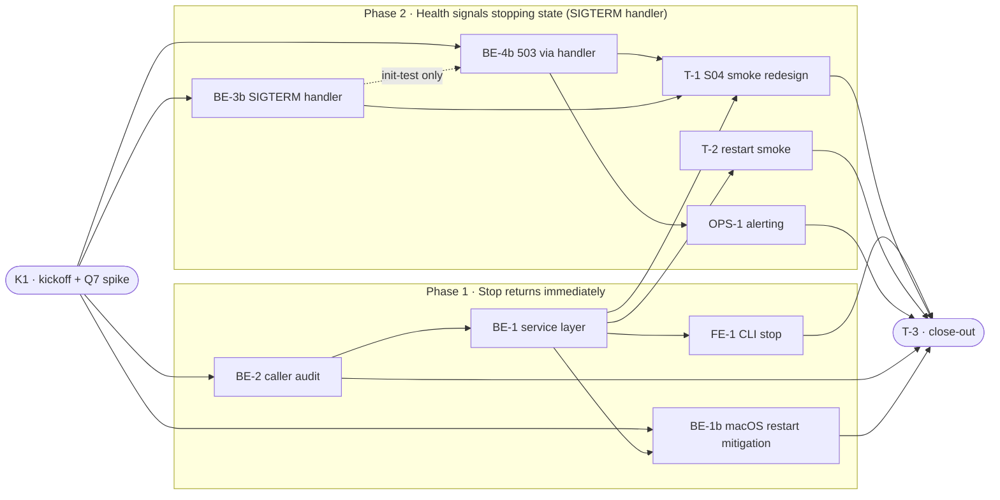

# NBS · Non-Blocking Stop with a "Stopping" State — Task Breakdown

**How to read this file**
- This is the **order view** for [non-blocking-stop-with-stopping-state-team-plan.md](./non-blocking-stop-with-stopping-state-team-plan.md) — every task is a single-role checkbox in execution order, opening with a dependency graph.
- **Phases 1–2 are vertical slices**: each delivers a working end-to-end increment (the blanket claim overclaimed — Phase 0 is a prerequisite spike and Phase 3 is an acceptance gate, neither delivers a user-observable increment; BE-2 within Phase 1 is also a horizontal safety task, not a slice on its own). Sliced with the **built-in method** (vertical-slicer skill loaded but no external script used; procedure applied inline).
- Each task carries the **role tag at the end of its title line**, then sub-bullets: **layer · estimate** (decimal hours), **needs · completes**, and a **Tests** block.
- **Tests** are tagged by level. **Unit and integration tests belong to the implementing dev** (test-first); **e2e and manual tests are the tester's tasks**. The close-out task writes no tests.
- IDs (`BE-#`/`FE-#`/`T-#`/`K#`/`OPS-#`) are this file's traceability thread; `S#`/`C#`/`Q#` are defined in the plan. `OPS-#` is an ops-role task — operator-facing documentation (monitoring guidance, incident runbooks) is owned by an ops/docs role beyond the plan's three implementing roles (backend, frontend, tester).

---

## References

- **Plan:** [non-blocking-stop-with-stopping-state-team-plan.md](./non-blocking-stop-with-stopping-state-team-plan.md) — the full team plan (contracts, scenarios, architecture, allocation). **Always read the plan before you start planning the next task** — it holds the context this file only cites (`S#`/`C#`/`Q#`).
- **Brief:** [non-blocking-stop-with-stopping-state-brief.md](./non-blocking-stop-with-stopping-state-brief.md) — the source feature brief behind the plan.
- **Note:** the plan's C3 text still names the lifespan `finally` block as the flag producer. That text is superseded — the flag producer is the SIGTERM handler (BE-3b), not `finally` (see K1 Notes below). C3 must be re-ratified to name the SIGTERM handler as producer; the plan is annotated in place, not rewritten. Banners are applied at: Goal, C3, both architecture-table rows (`app.state.stopping` flag row and `FastAPI lifespan` row), Backend "Done when", In-Scope, "What does NOT change", both diagrams (Data Flow, Sequence), and the tester-allocation table's S-flag-order row.

---

## Task Breakdown

Single-role tasks in execution order, grouped into **vertical slices**.

### Dependency graph

_Legend: the dotted `BE3b -.-> BE4b` edge is a test-only partial gate — BE-4b `needs` only K1 and runs in parallel with BE-3b; the two share only the `test_create_app_initializes_stopping_false` init test, not a full task dependency._

### Phase 0 · Kickoff *(prerequisite; the one cross-cutting step)*

- [ ] **K1** — Agree contracts C1–C4 with the team; run Q7 spike (go/no-go, runs first); author the liveness/readiness ADR; document restart() race mitigation choice #team
    - — · 3.0–6.0h
    - ratifies C4; C3 deferred to Q7 spike resolution (depends on the flag-producer mechanism); **C1 is ratifiable at K1 itself** — its body shape depends only on the endpoint decision (`/health` vs `/ready`, per the ADR) and whether a 503 exists at all, NOT on how the flag is set, so it does not need to wait on the spike; C2 closed by BE-1 (stop-semantics) and BE-1b (restart facet); BE-2 contributes (protects non-CLI callers); **authors ADR-xx** — liveness/readiness 503 decision (blocking before BE-4/BE-4b)
    - Tests
    - Notes
        - **Q7 spike — runs FIRST, before any Phase 2 task shape is committed** (blocking before Phase 2; a pure go/no-go for the flag-producer mechanism). **Strong prior**: uvicorn closes the listening socket and drains existing connections BEFORE running the ASGI lifespan shutdown (`finally` block) — see `app.py`'s `finally` block at ~line 541, whose first teardown action is `await app.state.search_store.disconnect()`. Because of this ordering, a `stopping=True` flag set inside `finally` can never be observed as a 503 by any client: fresh connections get `ConnectError` before the flag is set, and keep-alive connections are already drained/closed before `finally` runs. The `finally`-placement is therefore EXPECTED to fail the observability test — it is never scheduled as a build task; only the SIGTERM handler (BE-3b) is. The spike confirms this and selects the flag-producer mechanism (the SIGTERM handler, BE-3b) as the default.
        - **Spike methodology**: prototype the SIGTERM-handler flag-set directly — the same code BE-3b will productionize — behind the test `test_sigterm_handler_sets_stopping_before_socket_close` (spawn `archon-search serve` as a subprocess, install the SIGTERM handler that sets `app.state.stopping = True` before uvicorn closes the socket, send SIGTERM, poll `GET /health` with fresh connections, ≤50 ms interval, 10 s deadline; assert at least one 503 is observed before `ConnectError`). That single test IS the go/no-go decision for Q7 AND doubles as BE-3b's production coverage — no throwaway stub is built and discarded. **Optionally run a negative-control probe against the `finally`-placement** (downgraded from mandatory: `app.py`'s `finally` block at ~line 541 already runs `await app.state.search_store.disconnect()` as its first teardown action, which is sufficient source-level proof that a `finally`-set flag is unobservable by any client — building a throwaway harness to re-prove a fact the source already settles is not required). If the team wants empirical confirmation anyway: set the flag as the first statement of the lifespan `finally` block, same polling harness; this is expected to observe ZERO 503s before `ConnectError`. This probe is evidence-gathering only — it produces no buildable task; the `finally`-placement is never implemented as a shipped mechanism (see decision table below).
        - **Spike-outcome decision table** — the spike has exactly two outcomes, and neither one revives the `finally`-placement as a build option:

            | Outcome | Trigger | Decision |
            |---|---|---|
            | SIGTERM handler produces an observable 503 (expected) | `test_sigterm_handler_sets_stopping_before_socket_close` observes ≥1 503 before `ConnectError` | Proceed with BE-3b/BE-4b as scoped. |
            | Injection seam is SOFT — buildable but awkward | A clean `handle_exit` → `app.state` injection path exists but is more involved than the original estimate assumed (e.g. extra indirection through `self.config.app` resolution) | Proceed with BE-3b/BE-4b. BE-3b's header band [3.0–5.0h] already encodes [clean-go low, SOFT high] — the clean-go case sits at ~3.0h (low end of the existing band); the SOFT/awkward-seam case widens toward the 5.0h upper end of that SAME band. No new estimate is opened; this leaves the gate/headline math unchanged. |
            | Injection seam is HARD — unbuildable, **or** buildable but NO observable 503 | No clean `handle_exit` → `app.state` injection path exists at all; **or** the seam is buildable but `test_sigterm_handler_sets_stopping_before_socket_close` observes zero 503 before `ConnectError` despite a working injection (i.e. the "strong prior" above is empirically wrong) | **STOP and descope to non-blocking-stop-only** (Q7 option a — accept no observable 503). The observable-503 goal is dropped from this feature; BE-3b's flag-producer work and BE-4b's 503 route logic are NOT built. S8 is not claimed. This is a scoping decision made at K1, not a re-estimate — there is no partial build under either HARD-seam sub-case. |
        - **Seam-(b) caveat:** if the go outcome is reached via seam (b) (SIGTERM handler registered in a startup lifespan), the deterministic in-process wiring guard (`test_sigterm_handler_sets_stopping_via_handle_exit`) is NOT achievable — `signal.signal` raises `ValueError: signal only works in main thread` under TestClient, and a hand-rebuilt closure would not exercise real registration/chaining. Under seam (b), producer→consumer wiring proof reverts to T-1's subprocess e2e (best-effort), and the gated test's determinism claim is void.
        - **Two separable spike deliverables — do not conflate them.** (1) **Observability proof**: does a 503 become visible before `ConnectError`, with the flag set before socket close? Answered by the test above. (2) **Injection-seam decision**: HOW does `handle_exit` (or a chained lifespan SIGTERM handler) actually reach `app.state`, given `uvicorn.run()` builds its own `Server` internally (`app.py:773`) and a middleware wrapper may block direct access to `self.config.app`? A **SOFT seam** (buildable but awkward) widens toward the 5.0h upper end of BE-3b's existing band (not a re-opened band — the band already spans clean-go low to SOFT high) and still ships. A **HARD seam** (no clean injection path) OR a buildable seam with **no observable 503** both trigger the full descope in the decision table above — neither is a partial-build case.
        - **K1 → BE-3b hand-off artifact**: the spike hands BE-3b (a) a working handler prototype (the code behind `test_sigterm_handler_sets_stopping_before_socket_close`) and (b) the chosen injection approach (closure / module-level ref / `self.config.app` resolution, per the seam decision above), documented in the ADR. BE-3b then productionizes that prototype — error handling, the unit/e2e tests, wiring into `run_server()`, OpenAPI/snapshot follow-on via BE-4b. K1 and BE-3b are therefore not double-charged for the same body of work: K1 proves it works once and picks the mechanism; BE-3b hardens it for production.
        - **restart() race mitigation** (blocking before BE-1b): the race is **macOS-only** — Linux already uses atomic `systemctl --user restart` (linux.py:147) and has no race. For macOS: option (a) requires migrating macos.py from legacy `launchctl load/unload` to the modern `bootout/bootstrap` API to use `launchctl kickstart -k` — this is a larger change than intended; option (b) add a `restart()` override in `macos.py` (NOT the ABC `service.py`) that calls `stop()`, then a bounded `_wait_until_stopped()`, then `start()` — keeping the macOS-specific wait on the macOS class only, which currently has no wait (`service.py:51` = `stop(); start()` directly) while the CLI path removes it. Option (b) is recommended. Document chosen option in C2 before implementation. **Cheap pre-check before building BE-1b**: confirm the macOS bind race is actually observable (rapid stop→start binding failure) before committing engineering time; if the race is only theoretical, defer BE-1b behind the atomic bootout/bootstrap migration (option (a)) rather than shipping a wait no test can validate (see BE-1b Notes on `_wait_until_stopped()` polling `status().running`, not socket release).
        - **ADR authoring** (blocking before BE-4b): K1 must produce an ADR documenting why `/health` (liveness) rather than `/ready` (readiness) is the chosen 503 endpoint, and explicitly recording the risk that in Kubernetes a failing liveness probe triggers pod kill/restart instead of drain. If the ADR resolves in favour of `/ready`, BE-4b scope changes accordingly. Without this ADR, BE-4b is blocked.
        - **C1-ratification action items (moved here from BE-4b Scope; these are C1 contract decisions, per "change a contract only by team agreement"; K1 resolves them, BE-4b then implements to the ratified contract)**:
            - **CONTRACT FILE BUG** — `Documentation/Backlog/api-contracts/non-blocking-stop-c1-health-api.openapi.yaml` has wrong `mcp` object fields: it declares `bound: boolean` which does not exist in the real `McpStatusDetail` schema; the actual field is `bindAddress: string | null` (with `serialization_alias: "bindAddress"` in `schemas.py`). Fix the `.tsp` and `.openapi.yaml` to match the real model before T-3 conformance check.
            - **FALLBACK BODY vs CONTRACT CONTRADICTION — RESOLVED: resolution (b).** The documented fallback body `{"status": "stopping"}` (emitted when `_build_mcp_status()` raises) omitted `version` and `mcp`, which the `HealthStopping` contract schema marks as required — this would raise `ValidationError` against `HealthResponse`. Resolved by adopting resolution (b) everywhere: the fallback emits `{"status": "stopping", "version": _VERSION, "mcp": null}`, so no contract relaxation is needed — `version` stays required and `mcp` stays present-but-nullable on the 503 body, so the fallback validates against `HealthResponse`. `test_health_503_falls_back_when_build_mcp_status_raises` (BE-4b Tests) now asserts the exact resolved body, and `test_health_503_body_validates_against_health_response_schema` additionally runs `HealthResponse(**body)` against the fallback body — see BE-4b Tests/Scope.
        - **Suggested split** (total 3.0–6.0h), **ordered so the Q7 go/no-go spike runs FIRST as a gate**: (c) Q7 spike 1.0–4.0h open-ended — run FIRST, resolves per the spike-outcome decision table above; (a) Contract agreement 1.0h — review C1–C4 with team, document restart mitigation decision; (b) ADR authoring 1.0h — liveness vs. readiness decision. **Only C3 is deferred to the spike's resolution** (it depends on the flag-producer mechanism); **C1 is ratifiable at K1 once the endpoint (ADR) and go/no-go are decided** — its body shape does not depend on HOW the flag is set. Ratify C1/C3 and finalize the liveness/readiness ADR only on a go outcome; C4 (and C2, closed by BE-1 (stop-semantics) and BE-1b (restart facet); BE-2 contributes (protects non-CLI callers)) can ratify immediately regardless of the spike outcome. **Accounting note:** the two C1 contract-resolution items (contract-file `bound`→`bindAddress` fix; fallback-body resolution) are absorbed into sub-item (a) Contract agreement — the negative-control probe's downgrade to optional (see above) frees equivalent spike time, so the 3.0–6.0h band is unchanged.

### Phase 1 · Stop returns immediately *(walking skeleton: CLI stop issues OS command and returns instantly)*

- [ ] **BE-1** — Remove the `_wait_until_stopped()` *call* from `LaunchdSearchService.stop()` and `SystemdSearchService.stop()` (the method itself stays in the ABC; see BE-2); add `--no-block` to systemctl #backend-role
    - Frameworks & Drivers · 2.5h
    - needs K1, BE-2 · completes C2 (stop-semantics facet) (moved here from BE-2 — BE-1 is the task that removes the wait and realizes the "0 = issued" semantics C2 describes; the restart facet of C2 is completed by BE-1b)
    - Tests
        - #unit_test — `test_launchd_stop_issues_unload_and_returns_zero` — `launchctl unload` is called and method returns 0 without sleeping. Must patch `_is_loaded()` → `True` first — otherwise `launchctl unload` is never reached and the assertion passes vacuously.
        - #unit_test — `test_launchd_stop_never_calls_wait_until_stopped` — mock subprocess; patch `_is_loaded()` → `True`; assert `_wait_until_stopped` was never called
        - #unit_test — `test_systemd_stop_uses_no_block_flag` — `systemctl --user stop --no-block` is the exact command issued
        - #unit_test — `test_systemd_stop_never_calls_wait_until_stopped` — mock subprocess; assert `_wait_until_stopped` was never called
    - Notes
        - `--no-block` causes `systemctl stop` to return 0 as soon as the stop job is enqueued, not when the unit stops. The existing `if result.returncode != 0: raise` guard in `linux.py` becomes near-unreachable for stop failures after this change — an accepted trade-off of "0 = issued" semantics (C2). This return-semantics change is documented in FE-1's BREAKING.md entry (FE-1 runs after BE-1 and is the task that creates it) — BE-1 does not write to BREAKING.md directly.
        - **Corrected:** `_wait_until_stopped()` STAYS in the ABC and uses `_STOP_WAIT_TIMEOUT_S` as a default arg (`service.py`) — the constant is NOT unused after this change; do NOT remove its definition or the ABC default-arg use. **Correction:** after BE-1 removes the wait-warning block, the `_STOP_WAIT_TIMEOUT_S` import is orphaned in BOTH `macos.py` and `linux.py` regardless of BE-1b — `restart()` calls `_wait_until_stopped()`, whose default arg lives in the ABC `service.py`, NOT in the platform files, so BE-1b's `restart()` does not keep either platform-file import alive. Remove both orphaned imports; keep the `service.py` definition and its default arg. **Hard checklist item, not optional** — the project mandate is warning-free at all times.

- [ ] **BE-1b** — Implement the macOS `restart()` bind-race mitigation in `LaunchdSearchService`, per K1's chosen option #backend-role
    - Frameworks & Drivers · 1.5h
    - needs K1 (restart-mitigation decision), BE-1 · completes C2 (restart facet) — C2 fully closed here (completes the restart-race facet of C2 specifically — BE-1 completes the "0 = issued" facet)
    - Tests
        - #unit_test — `test_launchd_restart_calls_stop_then_wait_then_start_in_order` — mock `stop()`, `_wait_until_stopped()` (returning True), and `start()`; call `LaunchdSearchService.restart()`; assert call order is stop → _wait_until_stopped → start with no call to `start()` before `_wait_until_stopped()` completes
        - #unit_test — `test_launchd_restart_aborts_on_wait_timeout` — mock `_wait_until_stopped()` to return `False`; call `LaunchdSearchService.restart()`; assert `start()` is NOT called (bind race prevented)
        - #unit_test — `test_launchd_restart_dry_run_is_noop` — call `restart(dry_run=True)`; assert `stop()` and `start()` are invoked with `dry_run=True` (or, if the override short-circuits, that no real `launchctl unload`/`load` runs)
    - Notes
        - restart() race mitigation is macOS-only. **Implementation note**: `macos.py` has no `restart()` override — the fix must add one to `LaunchdSearchService` (not edit the ABC `service.py:restart()`). Editing the ABC would also change `SystemdSearchService.restart()`, which already uses atomic `systemctl --user restart` at `linux.py:147` and must not be touched.
        - **Residual risk — not a proof of correctness**: `_wait_until_stopped()` polls `status().running` (supervisor registration state), NOT socket release. A `restart()` built on it can wait for `status().running` to go `False` and STILL hit the bind race if the old process holds the socket a moment longer than the registration state reflects. This mitigation reduces but does not eliminate the bind race; the residual socket-hold window is a known limitation, not a proof of correctness. The mock-order tests below (`test_launchd_restart_calls_stop_then_wait_then_start_in_order`, `test_launchd_restart_aborts_on_wait_timeout`) pass regardless of whether the real race is closed — they assert call order against mocks, not real socket timing.
        - Split out of BE-1 so BE-1 stays reviewable as a single change (platform `stop()` edits only). This task depends on BE-1 landing first since both touch `macos.py`.
        - The ABC is `restart(self, dry_run: bool = False)` — the `restart()` override MUST preserve the `dry_run` parameter and its passthrough; a dry-run restart must not actually stop/start the service.

- [ ] **BE-2** — Audit and protect install.py/service.py non-CLI stop() callers so they retain confirmed-stop semantics #backend-role
    - **Risk note:** this feature is framed in the brief as ~20–30 LOC / "build now", but BE-2 is a **safety-critical** task, not a routine audit — a wait-timeout at the install/uninstall reset sites means `rmtree` runs on a live server's data directory (data loss). Its 3.0h estimate and "audit" framing understate its risk relative to the brief's "20–30 LOC" framing.
    - Frameworks & Drivers · 3.0h
    - needs K1 · contributes to C2 (protects non-CLI callers; `completes C2` moved to BE-1, the task that realizes the "0 = issued" semantics — BE-2 runs before that realization and cannot complete the contract it protects)
    - Tests
        - #unit_test — `test_pre_activate_cleanup_waits_for_confirmed_down` — mock `stop()` and `_wait_until_stopped()` returning `True`; assert `_wait_until_stopped` is called after `stop()` before `pre_activate_cleanup()` returns
        - #unit_test — `test_pre_activate_cleanup_wait_failure_raises` — mock `_wait_until_stopped()` to return `False`; assert `pre_activate_cleanup()` raises `RuntimeError`; assert the exception is NOT swallowed by any remaining `except` handler inside `pre_activate_cleanup()`. The RuntimeError propagates to `write_service_file()` which does NOT then call `register()`.
        - #unit_test — `test_pre_activate_cleanup_swallows_not_running_error` — mock `stop()` to raise `RuntimeError("systemctl stop failed (rc=5): Unit archon-search.service not loaded")` — systemd's REAL message shape for an unknown/never-installed unit (verified: macOS never raises for not-running, it returns 0; only systemd raises, and only with this `systemctl stop failed (rc=...)` shape); assert `pre_activate_cleanup()` does NOT re-raise (expected stop-of-already-stopped case is tolerated); assert `_wait_until_stopped()` is still called afterward. Keep a separate case (see `test_pre_activate_cleanup_propagates_genuine_stop_error` below) where a genuine failure (e.g. `RuntimeError("launchctl unload failed: permission denied")`) IS re-raised.
        - #unit_test — `test_pre_activate_cleanup_propagates_genuine_stop_error` — mock `stop()` to raise `RuntimeError("launchctl unload failed: permission denied")`; assert `pre_activate_cleanup()` raises (not swallowed) so the install flow aborts rather than installing over a running server
        - #unit_test — `test_install_force_reset_waits_for_confirmed_down` — mock `stop()` and `_wait_until_stopped(True)`; drive the `install --force` reset flow in `install.py`; assert `_wait_until_stopped` is called before any destructive cleanup
        - #unit_test — `test_run_uninstall_waits_for_confirmed_down` — same; drive the `run_uninstall` flow in `install.py`; assert `_wait_until_stopped` is called before `unregister()` and `rmtree`
        - #unit_test — `test_install_cmd_uninstall_waits_for_confirmed_down` — same; drive the `install_cmd.py` uninstall command
        - #unit_test — `test_install_force_reset_aborts_on_wait_timeout` — mock `_wait_until_stopped()` to return `False`; drive the `install --force` reset flow; assert the DB deletion (`rmtree(db_path)`) is NOT reached (data-loss prevention)
        - #unit_test — `test_run_uninstall_aborts_on_wait_timeout` — mock `_wait_until_stopped()` to return `False`; drive the `run_uninstall` flow; assert `rmtree(db_path)` is NOT reached (data-loss prevention)
        - #unit_test — `test_install_cmd_uninstall_aborts_on_wait_timeout` — same, drive `install_cmd.py` uninstall command
        - #unit_test — `test_uninstall_delete_db_false_completes_on_wait_timeout` — mock `_wait_until_stopped()` to return `False`, `delete_db=False`; drive `run_uninstall`; assert it completes without abort (no data-loss path, so no guard engagement)
        - #unit_test — `test_upgrade_load_service_not_reached_on_wait_timeout` — mock `_wait_until_stopped()` to return `False` at the `pre_activate_cleanup()` call site in the upgrade/reinstall flow; assert `load_service()` is NOT called (bind-race prevention in the reinstall path at `install.py:2529`)
        - #unit_test — `test_reinstall_load_service_not_reached_on_wait_timeout` — same for the second `load_service()` call site in the reinstall flow (`install.py:2601`)
        - #integration_test — `test_install_force_reset_aborts_on_wait_timeout_real_server` — **corrected**: `_wait_until_stopped()` decides via `status().running`, which reflects launchctl/systemctl REGISTRATION state, not the bound port — a stub socket bound to the port does NOT make `status()` report running, so a "no mocking, just bind a socket" version of this test cannot exercise the abort (the wait would return `True` immediately and the guard would never trip). Drop the "without mocking `stop()`/`_wait_until_stopped()`" mandate: drive the real `install --force` reset flow, patching `_wait_until_stopped()` directly (mandatory — do NOT patch `status()` instead, since `_wait_until_stopped()` polls the full 10s `_STOP_WAIT_TIMEOUT_S` before returning `False`, making a `status()`-only patch a needlessly slow test) to report a still-registered service; assert the guard aborts BEFORE `rmtree(db_path)` runs. This test proves the guard's **placement** outside the swallowing `except RuntimeError: pass` (install.py:608) holds at runtime against the real `install.py` control flow — it does not prove real socket/bind timing, which is out of scope here.
    - Scope
        - **Implementation commitment**: non-CLI callers that currently rely on synchronous `stop()` MUST call `_wait_until_stopped()` explicitly after `stop()`, outside any `except` block. The `/health` poll alternative is NOT pursued in this task — `_wait_until_stopped()` is preserved in the ABC and is the chosen mechanism. This resolves the scope ambiguity so all tests are unambiguous.
        - `service.py:pre_activate_cleanup()` (lines 64–69): `pre_activate_cleanup()` currently calls only `self.stop()` (no explicit wait). **Add** an explicit `if not self._wait_until_stopped(): raise RuntimeError("server did not stop within timeout")` call immediately after `self.stop()`, outside the existing `except Exception: pass` block. `write_service_file()` calls `pre_activate_cleanup()` (install.py:1995) then `register()` (install.py:1996) — making `pre_activate_cleanup()` raise on a `False` result is the mechanism that prevents `register()` from proceeding. Narrowing the bare `except Exception: pass` to a narrower set avoids masking this new raise. **IMPLEMENTATION NOTE — per-platform `stop()` truth table** (verified against source): macOS `LaunchdSearchService.stop()` (macos.py) returns `0` when the service is not loaded (`if not self._is_loaded(): return 0` guard) — it NEVER raises for the not-running case, so there is nothing to catch on macOS. systemd `SystemdSearchService.stop()` (linux.py) raises `RuntimeError` only on a non-zero `systemctl --user stop` returncode, with message shape `f"systemctl stop failed (rc={rc}): {stderr}"`: stopping an installed-but-inactive unit returns 0 (no raise), but stopping an unknown/never-installed unit returns non-zero and raises with stderr containing tokens like `not loaded` / `not found`. **Do NOT key the narrowing off `"not running"` — no code path in this repo emits that string**, and matching on it re-raises the exact benign case it should swallow. Key the narrowing off systemd's ACTUAL message shape instead: recognize the benign unknown/never-installed case by the `systemctl stop failed (rc=...)` prefix combined with a `not loaded` / `not found` token in the stderr portion; treat everything else (e.g. `permission denied`) as a genuine failure and re-raise. Explicitly document which `RuntimeError` cases are expected and swallowed. This stderr-substring matching is locale-dependent — prefer keying off the returncode/exit-status where distinguishable rather than localized stderr substrings; if substring matching is unavoidable, record the English-locale assumption as an accepted limitation (a non-English `LANG` may misclassify the benign not-installed case).
        - `install.py:607` (reset flow) — after `stop()`, Step 4 **deletes the DB directory** (line 621 — `shutil.rmtree(db_path)`). A wait-timeout means `rmtree` runs on a live server's data directory — data loss, not a bind race. **Critical placement:** the existing `except RuntimeError: pass` at `install.py:608` swallows any `RuntimeError` raised inside the try block, making the "raise RuntimeError on `False`" pattern from `pre_activate_cleanup` inapplicable here. The wait and abort **must** be placed *after the entire try/except block* (i.e., between line 613 and the `rmtree` at line 621), where no existing handler can swallow it. Alternatively, narrow `except RuntimeError: pass` at line 608 using the systemd real-message-shape heuristic from the truth table above (`systemctl stop failed (rc=...)` + `not loaded`/`not found` token = swallow; anything else = re-raise) — do NOT key on `"not running"`, a string no code path emits — but placing the wait outside is simpler and safer. Do NOT place the wait inside the try block at this site. Additionally, gate the wait/abort on the existing `dry_run` and `db_path.exists()` branches — a `--dry-run` reset must not wait against a server it will not actually touch; the guard should only engage on the real destructive path.
        - `install.py:2625` (`run_uninstall`) — after `stop()`, `unregister()` then `rmtree(db_path)` at line 2636. Same data-loss hazard. Guard: same `_wait_until_stopped()` abort pattern, but gate the wait/abort on the SAME conditions that guard `rmtree` at this site (`delete_db and db_path.exists() and not dry_run`) — the wait must engage ONLY on the real destructive path; a `delete_db=False` or `--dry-run` uninstall must complete normally even on a wait-timeout. Place the gated wait/abort BEFORE `unregister()` — hoist the `db_path`/`delete_db` guard computation above the `unregister()` call so the confirmed-down check runs first, matching `test_run_uninstall_waits_for_confirmed_down`'s ordering assertion.
        - `install_cmd.py:232` (`uninstall`) — calls `stop()` before teardown. Apply the same guard, gated the same way: gate the wait/abort on the SAME conditions that guard `rmtree` at this site (`delete_db and db_path.exists()` — `install_cmd.uninstall()` has no `dry_run` parameter, unlike the `install.py:2625` site; the real `rmtree` guard at `install_cmd.py:244-247` is `delete_db and db_path.exists()` only) — the wait must engage ONLY on the real destructive path; a `delete_db=False` uninstall must complete normally even on a wait-timeout. Place the gated wait/abort BEFORE `unregister()` — hoist the `db_path`/`delete_db` guard computation above the `unregister()` call so the confirmed-down check runs first, matching `test_run_uninstall_waits_for_confirmed_down`'s ordering assertion.
        - `install.py:2004` (`unload_service`) — **test-only**: no production callers, but IS exercised by `tests/test_install.py:1685` (`test_unload_service_delegates_to_platform`); exclude from BE-2's production-caller scope, do not remove it.
        - Add doc comment at each protected site: "0 = issued; caller waits for confirmed-down via _wait_until_stopped / health poll"
        - `_wait_until_stopped()` STAYS in the ABC (`service.py:31`) — not removed — until all non-CLI callers are migrated (Q3 per plan)
        - **Abort-on-False control flow** (required at every call site): when `_wait_until_stopped()` returns `False` (server still running after timeout), the caller MUST abort and NOT proceed with its destructive downstream operation. Downstream varies by site: `register()` (bind race at 1995), `rmtree` (data loss at 607 and 2625), teardown (232). The abort must be explicit — the existing broad `except Exception: pass` at `service.py:66-68` catches only raises; a `False` return falls through silently without intervention.
        - **Existing test reconciliation required — corrected premise**: `tests/test_install.py` already has tests that call `stop()` then proceed to `rmtree`/`register`/`load_service` (e.g. `test_run_uninstall_stops_and_unregisters_service`, `test_run_uninstall_delete_db_true_removes_directory`, `test_write_service_file_calls_pre_activate_cleanup_before_register`). The premise that these tests will hang/raise once BE-2 inserts `_wait_until_stopped()` calls is WRONG for the tests that inject `svc = MagicMock()` (e.g. the `run_uninstall` tests) or fully mock `pre_activate_cleanup` (`test_write_service_file_calls_pre_activate_cleanup_before_register`): on a `MagicMock`, the new `_wait_until_stopped()` call auto-returns a truthy `Mock`, so `if not _wait_until_stopped()` is `False` — no hang, no raise. **The real risk is the opposite: these tests will pass VACUOUSLY**, satisfying the new guard without ever exercising it. Require adding at least one NON-mock (or explicitly-configured-`False`) assertion per such test that actually gates on the new guard. For tests using a real service object or an already-patched wait, stub `_wait_until_stopped()` appropriately (`True` for the happy path). To enumerate all affected tests, run: `grep -n 'svc.stop\|_wait_until_stopped\|MagicMock()' tests/test_install.py`, then classify each hit into one of the two buckets above (MagicMock → vacuous, needs a real gating assertion; real/patched → may need an explicit `True` stub) and update accordingly as part of BE-2 implementation.

- [ ] **FE-1** — Update `stop.py`: print "archon-search stopping", remove return-code branch and timeout warning #frontend-role
    - Presentation · 2.0h
    - needs BE-1 · completes S1, S5, S7, C4
    - Tests
        - #unit_test — `test_stop_prints_stopping_message` — CliRunner; assert `"archon-search stopping"` in output (renamed from `test_stop_prints_stopped_message`)
        - #unit_test — `test_stop_returns_immediately_no_poll` — CliRunner; mock `_wait_until_stopped` and any `time.sleep` in the stop path; assert neither is called from the CLI `stop` command. (Structural assertion is deterministic; wall-clock assertions are flaky on loaded CI.)
        - #unit_test — `test_stop_container_guard_unchanged` — `ARCHON_SEARCH_CONTAINER=1` still prints `_CONTAINER_MSG` and exits 1
        - #unit_test — `test_stop_already_stopped_is_noop` — CliRunner; mock `service.stop()` to return 0 (the CLI's platform-appropriate no-op case: macOS not-loaded and systemd inactive-but-installed both return 0 without raising; only systemd's unknown/never-installed-unit path raises — that's BE-2's concern, not the CLI's typical already-stopped case); assert output is `"archon-search stopping"`, exit 0, no error (S5)
    - Scope
        - In [archon_search/cli/stop.py](../../archon_search/cli/stop.py): replace the `if service.stop() == 0: ... else: warn...` branch with an unconditional `service.stop(); click.echo("archon-search stopping")`
        - In [tests/cli/test_start_stop.py](../../tests/cli/test_start_stop.py): DELETE `test_stop_timeout_warns_and_omits_clean_success` (it asserts the timeout-warning branch that FE-1 removes — it cannot be "updated", only deleted); RENAME `test_stop_prints_stopped_message` → `test_stop_prints_stopping_message` (see Tests block above); retire the stale `mock_service` comment ("stop() returns 0 == confirmed stopped") wherever it appears — it no longer describes the post-BE-1/BE-2 return-value semantics; update the remaining pre-existing tests in the file to match the new message and removed branches.
        - Add an entry to `BREAKING.md` documenting that `archon-search stop` now prints `"archon-search stopping"` (not `"archon-search stopped"`) and returns immediately without waiting for confirmed stop. Scripts that parse the stop command's output or relied on the call blocking until the server is down will break.
        - Add an entry to `BREAKING.md` documenting that `service.stop()` return value semantics change: `0` now means "stop command issued" (was "confirmed down"). Non-CLI callers that relied on the synchronous blocking guarantee are affected. (This is the entry BE-1 refers back to — BE-1 does not write it itself.)
        - Note: The SIGTERM-handler mechanism (BE-3b/BE-4b) applies in all server-run modes, including `archon-search serve` (container/direct-run mode) — a container receiving SIGTERM will also return 503 from `/health` during graceful shutdown. **This is a real behavioral change to container/serve mode.** Any prior "Container deployments — no change needed" framing is incorrect and must be corrected; document the actual container-mode behavior in T-3's container mode notes instead.
        - Reviewer note (not a test): the removal of the return-code branch is already proven by `test_stop_returns_immediately_no_poll` (structural: no polling/blocking calls) and `test_stop_prints_stopping_message` (behavioral: correct output). A source-string-inspection test asserting the branch's absence would be brittle and redundant — do not add one.

### Phase 2 · Health signals stopping state *(GET /health returns 503 during the stopping window via a SIGTERM handler)*

- [ ] **BE-3b** — Install a SIGTERM signal handler (override `uvicorn.Server.handle_exit` or chain via a startup-lifespan-registered `signal.signal(SIGTERM, ...)`) that sets `app.state.stopping = True` before uvicorn closes the listen socket #backend-role
    - Frameworks & Drivers · 3.0–5.0h
    - needs K1 (Q7 spike go-decision + injection-seam approach) · completes C3, S3b, S-flag-order
    - Tests
        - #unit_test — `test_create_app_initializes_stopping_false` — call `create_app(config, job_store)`; assert `app.state.stopping is False` (explicit existence + value check)
        - #integration_test — `test_sigterm_handler_sets_stopping_via_handle_exit` — directly invoke the handler code path in-process (call the `CustomServer.handle_exit` override, or the chained signal-handler function, directly — no subprocess, no timing dependency) and assert `app.state.stopping is True` afterward AND that `GET /health` then returns 503. This is the gated regression guard for the producer→consumer wiring (the attribute-name match between the handler and the health route) — it runs under the default `--cov-fail-under=85` suite, unlike the subprocess-based e2e. Complements, does not replace, T-1's e2e. **This in-process test is achievable ONLY under seam (a) (subclass `uvicorn.Server` + override `handle_exit`) AND ONLY if the injection is a closure or module-level ref — NOT `self.config.app` (a middleware wrapper makes `self.config.app` point at the wrong object with no `.state`).**
        - Clean-shutdown regression e2e (`test_sigterm_handler_does_not_regress_clean_shutdown`) is owned by T-1; see T-1 Tests.
    - Scope
        - In `create_app()` ([archon_search/server/app.py](../../archon_search/server/app.py)), add `app.state.stopping = False` after the existing `app.state.*` assignments (app.py ~line 602, after `app = FastAPI(...)` at ~576) — required by `test_create_app_initializes_stopping_false`.
    - Notes
        - `test_sigterm_handler_sets_stopping_before_socket_close` (the timing assertion "flag is True at the instant before the socket closes") is NOT listed as a unit test here — it cannot be proven deterministically with a mock. It was already authored and run during K1's spike (see K1 Notes) and is productionized as T-1's mandatory e2e (`test_health_503_observed_before_refused`). That e2e IS the proof; do not attempt a mock-based equivalent here.
        - `uvicorn.Server.handle_exit` is the correct hook point — it fires before the listen socket is closed. **`signal.signal(SIGTERM, ...)` is NOT a safe fallback if installed naively**: uvicorn calls `Server.install_signal_handlers()` at startup and overwrites any SIGTERM handler installed earlier (e.g. in `create_app()`). The only production-safe implementation paths are:
            - **(a) Subclass `uvicorn.Server`, override `handle_exit`, and wire it in `run_server()` in `app.py`.** **NOT `serve.py`** — `serve.py` delegates directly to `run_server()`, and both the `serve` CLI entrypoint and the production launchd/systemd path (via `python -m archon_search.server` → `__main__.py`) converge on `run_server()`. `uvicorn.run()` constructs its own `Server` internally and accepts no custom Server class; replace it with explicit `uvicorn.Config(app, ...) ; server = CustomServer(config) ; server.run()`. **Unresolved seam for option (a)**: `handle_exit` has no reference to `app.state`; the FastAPI instance is accessible as `self.config.app` only if no middleware wrapper sits between them. Decide and document the injection approach (closure, module-level ref, or resolve via `self.config.app`) before scheduling BE-3b.
            - **(b) Register a SIGTERM handler inside a startup lifespan event** (fires after uvicorn's `install_signal_handlers()`). **CRITICAL — handler must chain**: do NOT simply `signal.signal(SIGTERM, custom_handler)` — that overwrites uvicorn's handler, which sets `server.should_exit = True` to initiate shutdown. Without chaining, SIGTERM sets `app.state.stopping = True` then does nothing, and the server runs indefinitely. Correct pattern: `orig = signal.getsignal(SIGTERM); signal.signal(SIGTERM, lambda s, f: (set_flag(), orig(s, f)))`. **Caveat (a) — not TestClient-testable:** `signal.signal` raises `ValueError: signal only works in main thread` when the lifespan runs off the main thread, which is exactly what happens under Starlette's `TestClient` (worker thread). Any handler-registration test must use a real subprocess (T-1's e2e) or the direct in-process `handle_exit` invocation used by `test_sigterm_handler_sets_stopping_via_handle_exit` — never a `TestClient`-based registration test. **Caveat (b) — also fires on Ctrl-C:** uvicorn installs handlers for BOTH `SIGINT` and `SIGTERM`, so a chained handler fires on Ctrl-C too — `archon-search serve` (container/direct-run mode) will return 503 on Ctrl-C, not just SIGTERM. Cross-reference FE-1's container-mode note and T-3's container-mode documentation duty when recording this behavior.
        - `create_app()` has no reference to the uvicorn `Server` instance — this seam must be designed and prototyped before BE-3b is scheduled (this is exactly what K1's spike prototypes). Document the chosen approach in the ADR.
        - **S-flag-order re-spec:** the plan's original S-flag-order integration test asserted the flag is set "before `search_store.disconnect()`" — that ordering is obsolete under the SIGTERM pivot and is meaningless here, since the flag is no longer set inside the lifespan `finally` block at all. The new invariant `completes S-flag-order` points at is: "the flag is set before uvicorn closes the listen socket." This is proven by the gated `test_sigterm_handler_sets_stopping_via_handle_exit` (asserts the flag is set and `/health` returns 503 immediately after the handler runs, before any socket-close path) plus T-1's `test_health_503_observed_before_refused` e2e (proves the real signal path best-effort). `completes S-flag-order` is fulfilled by those two tests, not by a standalone ordering test against `disconnect()`. The literal "flag set before socket close" ordering is a uvicorn design assumption (`handle_exit` fires before the listen socket closes), NOT deterministically test-covered — best-effort proof only via T-1's e2e. Record alongside Q5(b)/S6 as an accepted, documented coverage limitation.

- [ ] **BE-4b** — Add the `GET /health` 503-when-stopping route logic (built whenever the spike resolves go — buildable seam + observable 503; NOT built under the HARD-seam / no-observable-503 descope); update OpenAPI snapshots; verify it with the SIGTERM-handler-based flag #backend-role
    - Interface Adapters · 5.0–7.0h
    - needs K1 · completes C1, S2, S3, S3a, S3c (route/unit/OpenAPI/contract bulk runs in parallel with BE-3b; only the shared `test_create_app_initializes_stopping_false` init test — owned by BE-3b — gates on it; see Notes)
    - Tests
        - #unit_test — `test_health_returns_200_when_flag_unset` — `app.state.stopping = False`; `GET /health`; assert 200 and `response.json()["status"] == "running"` (S2)
        - #unit_test — `test_health_no_stopping_attr_getattr_fallback_200` — don't set `app.state.stopping`; `GET /health` via `TestClient`; assert 200 and no `AttributeError` (S3a). This test is owned here (not BE-3b) because it targets the route's `getattr(request.app.state, "stopping", False)` fallback check, which BE-4b's Scope adds — BE-3b and BE-4b run in parallel, so if BE-3b landed first the route would still always return 200 and this test would pass vacuously. Since BE-3b's Scope makes `create_app()` ALWAYS set `app.state.stopping = False`, the test MUST build a bare `FastAPI()` app (or `del app.state.stopping` after `create_app`) so the `getattr(..., 'stopping', False)` absent-attribute path is genuinely exercised — otherwise it duplicates `test_health_returns_200_when_flag_unset` and the defensive `getattr` could be deleted silently.
        - #unit_test — `test_health_returns_503_when_stopping_true` — `app.state.stopping = True`; `GET /health`; assert 503 (S3)
        - #unit_test — `test_health_503_requires_no_auth` — `app.state.stopping = True`; `GET /health` with no `Authorization` header; assert 503 (not 401) (S3)
        - #unit_test — `test_health_503_body_contains_stopping_status` — `app.state.stopping = True`; assert `response.json()["status"] == "stopping"` (S3c)
        - #unit_test — `test_health_503_body_contains_version_and_mcp_fields` — 503 body carries same `version` and `mcp` fields as the 200 body
        - #unit_test — `test_health_503_mcp_disabled_body_has_mcp_null` — configure `mcp.enabled=False`; `app.state.stopping = True`; `GET /health`; assert 503 and `response.json()["mcp"] is None` (matches the 200-body behavior when MCP is disabled; confirms no `McpStatusDetail()` constructor crash)
        - #unit_test — `test_ready_and_status_unaffected_when_stopping` — app.state.stopping=True; GET /ready and GET /status; assert neither returns 503
        - #unit_test — `test_health_503_in_serve_mode_during_shutdown` — with TestClient using the serve-mode app configuration; set app.state.stopping=True; GET /health; assert 503 (confirms the 503 applies in all run modes including container/serve)
        - #unit_test — `test_health_503_falls_back_when_build_mcp_status_raises` — patch _build_mcp_status to raise; app.state.stopping=True; GET /health; assert 503 with the exact resolved body `{"status": "stopping", "version": _VERSION, "mcp": null}` (fallback path; resolution (b))
        - #unit_test — `test_health_503_body_validates_against_health_response_schema` — `app.state.stopping = True`; `GET /health`; parse `response.json()`; assert `HealthResponse(**response.json())` succeeds without `ValidationError` (catches drift between the raw `JSONResponse` and the declared schema). Also run this schema-validation assertion against the FALLBACK body (patch `_build_mcp_status` to raise) — not only the happy 503 body.
        - Mandatory observable-503 e2e (originally listed here as `test_health_503_observed_before_refused_via_handler`) is owned by T-1, merged with T-1's near-identical smoke assertion into a single mandatory e2e — see T-1 Tests. BE-4b's route logic is proven by the unit tests above; the e2e proves the SIGTERM handler's actual code path drives it.
        - Note: no standalone `test_sigterm_handler_flag_read_by_health_route` unit test is needed — driving the flag "through the handler's actual code path" as a unit test is impossible until the K1 seam decision is chosen, and a direct `app.state.stopping = True` set is exactly what the unit tests above already do (the route reads the attribute, it does not care how it was set). The handler's actual code path is proven instead by T-1's mandatory e2e.
    - Scope
        - In [archon_search/server/routes_health.py](../../archon_search/server/routes_health.py): add `getattr(request.app.state, "stopping", False)` check; when True return `JSONResponse(status_code=503, content={"status": "stopping", "version": _VERSION, "mcp": (mcp_status.model_dump(mode="json") if (mcp_status := _build_mcp_status(request, config)) else None)})` — explicit `JSONResponse`, NOT `response_model` coercion per C1. On `_build_mcp_status` raising, the fallback body is `{"status": "stopping", "version": _VERSION, "mcp": None}` (resolution (b) — see K1 Notes), not a bare `{"status": "stopping"}`, so the fallback still conforms to `HealthResponse`.
        - Add `responses={503: {"model": HealthResponse, "description": "Server is stopping gracefully"}}` to the `@router.get("/health")` decorator
        - Update the `health` handler's return type annotation from `-> HealthResponse` to `-> HealthResponse | JSONResponse` (or `-> Response`) to satisfy the type checker; verify `mypy`/`pyright` is clean after the change
        - `_build_mcp_status()` is in [archon_search/server/routes_status.py](../../archon_search/server/routes_status.py) (line 261); returns `McpStatusDetail | None` — returns `None` when `config.mcp.enabled = false`. Do NOT use `or McpStatusDetail()` as fallback — `McpStatusDetail` has required fields with no defaults and will raise `ValidationError`. Use `mcp_status.model_dump(mode="json") if (mcp_status := _build_mcp_status(request, config)) else None` — this yields `None` when MCP is disabled, matching the 200 body's `mcp: null`. Fall back to `{"status": "stopping", "version": _VERSION, "mcp": None}` (not a bare `{"status": "stopping"}`) if `_build_mcp_status` raises an exception, so the fallback body still validates against `HealthResponse`.
        - Regenerate [tests/server/openapi_snapshot.json](../../tests/server/openapi_snapshot.json): `uv run pytest tests/server/test_openapi_snapshot.py --update-openapi-snapshot`
        - Manually update [tests/contract/openapi_snapshot.json](../../tests/contract/openapi_snapshot.json) to add the 503 response (no test flag — reference artifact)
        - `HealthResponse.status` in [archon_search/server/schemas.py](../../archon_search/server/schemas.py) (line 87; line 86 is the `class` line) is `str`; no Literal constraint to remove
        - Add an entry to `BREAKING.md` documenting that `GET /health` now returns 503 (with body `{"status": "stopping"}`) during graceful shutdown. Prior versions return only 200; callers and monitoring systems must handle 503 on this endpoint after this change.
        - **Q8 (resolved action)** — `tests/contract/openapi_snapshot.json` has no guarding test. Check whether any CI step validates this file (`grep -r 'openapi_snapshot' .github/`); if none, either add a validation step or explicitly label the file as unguarded in a comment. Do not leave this open — document the decision before T-3 close-out.
        - The C1 contract-file bug and the fallback-body-vs-contract contradiction are C1 contract decisions resolved in K1's Notes as C1-ratification action items; BE-4b implements to the ratified contract. See K1 Notes.
    - Notes
        - **BE-4b is the sole, mechanism-agnostic owner of all health-route work.** The route change, its unit tests, the OpenAPI snapshots, the BREAKING.md entry, and the contract fixes are all authored here, once, and depend only on K1's endpoint decision. This work runs in parallel with BE-3b — only the single `test_create_app_initializes_stopping_false` init test and T-1's e2es gate on BE-3b's output.
        - **Liveness vs. readiness semantics**: returning 503 on `/health` (liveness) in Kubernetes triggers a pod kill/restart rather than graceful traffic drain — the opposite of the intended behavior. In k8s deployments, the correct endpoint to fail during drain is `/ready` (readiness). This feature deliberately sets 503 on `/health` and explicitly excludes `/ready` from change. This decision is recorded in K1's ADR-xx before BE-4b is implemented (T-3 verifies the ADR exists — see T-3 Duties).
        - **Rollback**: owned by OPS-1 (writes the procedure into `90_incident_runbook.md`) and verified by T-3 (see T-3 Duties) — not restated here to avoid a third copy.
        - **OpenAPI conformance**: Regenerating the snapshot records whatever the app emits — it does not prove the 503 response is correctly declared. After regeneration, manually verify that the generated `/openapi.json` contains `responses.503` on the `/health` route and matches the shape declared in `Documentation/Backlog/api-contracts/non-blocking-stop-c1-health-api.openapi.yaml`.

- [ ] **OPS-1** — Document 503 drain-window behavior for operators; update monitoring guidance; provide alerting suppression recipe #ops-role
    - Frameworks & Drivers · 2.0h
    - needs BE-4b · completes (alerting prereq)
    - Tests
        - #manual_test — verify Documentation/OperatorGuide/20_monitoring_and_alerts.md accurately describes the 503 drain-window and provides a working suppression recipe
    - Scope
        - Update `Documentation/OperatorGuide/20_monitoring_and_alerts.md` to document the expected 503 pattern during graceful shutdown (`status: stopping`), explain it is transient and expected, and provide ONE example alerting-rule suppression recipe (Prometheus/Alertmanager) with a note to adapt it for other monitoring platforms — do not maintain multiple platform-specific recipes.
        - This is a documentation deliverable, not an infrastructure gate — operators of monitored deployments must apply the recipe before upgrading to this version
        - Reference the BREAKING.md entry added by BE-4b in the operator guide; do not add a duplicate BREAKING.md entry.
        - Note: OPS-1 documents BE-4b's behavior and can be partially drafted from K1's contracts, but the final 503 body shape must be confirmed against BE-4b's implementation before the recipe is finalized.
        - Document the rollback procedure for the 503-on-`/health` behavior in `Documentation/OperatorGuide/90_incident_runbook.md`: to revert, remove the `getattr(request.app.state, "stopping", False)` check from `routes_health.py` and re-run the OpenAPI snapshot update. Operators must complete the rollback before issuing another `archon-search stop` to avoid false 503 alerts.

- [ ] **T-1** — e2e smoke: redesign `test_s04_health_after_stop.py` to poll `/health` until `ConnectError` (S4 + S8) #tester-role
    - — · 3.0–4.0h (widened from 3.0h — now runs three subprocess e2es, see Tests)
    - needs BE-1, BE-3b, BE-4b · completes S4, S8. **Under the HARD-seam / no-observable-503 descope (see K1 decision table)**, `test_health_503_observed_before_refused` is NOT built and S8 is not claimed; T-1's `needs` reduces to BE-1 only (under the 3-row K1 decision table there is NO descope outcome where BE-4b's route ships); the surviving e2es are `test_health_unreachable_after_stop` (S4) and — only if a handler shipped — `test_sigterm_handler_does_not_regress_clean_shutdown`.
    - Tests
        - #e2e_test — `test_health_unreachable_after_stop` — start server via `_start_server()` from [tests/smoke/conftest.py](../../tests/smoke/conftest.py); issue OS stop command; poll `GET /health` in tight loop (≤50 ms, 10 s deadline); assert eventual ConnectError (S4); assert no 200 responses are received AFTER the first non-200 response of any kind (503 or ConnectError) — once health degrades it must not revert.
        - Note: A 200 response immediately after stop-command-issue is expected and correct — the server is alive and not yet stopping. The guard is: once health degrades from 200 (via 503 or ConnectError), it must not return to 200.
        - #e2e_test — `test_health_503_observed_before_refused` — **mandatory** (single, merged mandatory observable-503 e2e — supersedes the separately-listed BE-4b e2e `test_health_503_observed_before_refused_via_handler`, folded in here to avoid duplication): spawn a real server subprocess with the SIGTERM handler installed, send SIGTERM/issue the stop command, poll `GET /health` with fresh connections (≤50 ms interval, 10 s deadline); assert at least one 503 is received before `ConnectError` (S8) — a 503 MUST be observable before `ConnectError`, or the feature does not deliver its headline promise. **On determinism**: the flag-set-before-socket-close ORDERING is guaranteed by the SIGTERM handler design and is proven deterministically by the gated `test_sigterm_handler_sets_stopping_via_handle_exit` (BE-3b, no subprocess, no timing dependency). The OBSERVABILITY of that ordering by an external poller is a separate claim, bounded below only by the handler-set-to-socket-close gap — which can be short with no in-flight requests — and is NOT proven deterministic by ordering alone. This e2e must poll tight (≤20 ms interval) to maximize the chance of observing the window, but if it observes zero 503s the run is inconclusive and must be quarantined/flagged, not silently treated as green. Determinism for the producer→consumer wiring itself comes from BE-3b's gated test; this e2e proves the real signal path on a best-effort basis. This deterministic gated proof exists only under seam (a); under seam (b) (chained lifespan SIGTERM handler) the gated in-process test is unbuildable and this e2e is the sole (best-effort) wiring proof — see K1's seam-(b) caveat. Test-owner map for the 503-observability proof: K1 spike (prototype / go-no-go, throwaway-free), BE-3b's gated test (wiring/ordering, deterministic), this test (real-signal-path proof, best-effort). **If K1's spike resolved to the HARD-seam outcome** (see K1 Notes' spike-outcome decision table), the entire observable-503 workstream was descoped at K1 — this test is not built at all in that case, and S8 is not claimed as met.
        - #e2e_test — `test_sigterm_handler_does_not_regress_clean_shutdown` — moved from BE-3b (tester owns e2e per this file's role convention): assert the server exits cleanly (0) after SIGTERM with the handler installed.
    - Scope
        - Keep `pytestmark = pytest.mark.xdist_group("smoke_e2e")` at module level (line 51 in current file)
        - **RETAIN** the existing `svc._run` delayed-terminate patch, the `status` patch, and the `_is_loaded → True` patch. The bare `serve` subprocess under test is NOT an OS-registered service, so a real `svc.stop()` (launchctl unload / systemctl stop) cannot signal it — without these patches, the redesigned test would hang the poll loop to its deadline and, worse, on a dev box with archon-search actually installed would unload the developer's real service. The redesign changes only the removal of the blocking wait inside `svc.stop()`'s call path — not the subprocess-termination seam.
        - Correction: the current test already calls only `svc.stop()` — the confirmed-down wait is internal to `stop()` (via `_wait_until_stopped()`), not a separate call the test makes. The redesign removes that internal blocking wait from `svc.stop()`'s effect on the test (post-BE-1, `stop()` returns immediately); it does not remove a second `_wait_until_stopped()` call that never existed in this test. Do NOT substitute a raw SIGTERM to `proc` — that bypasses BE-1's `stop()` code path entirely and would fail to exercise the feature's actual stop path. `svc.stop()` must return immediately without polling.
        - Reuse `_free_port()`, `_start_server(*, port, data_dir, api_key)`, `_terminate()` helpers from [tests/smoke/conftest.py](../../tests/smoke/conftest.py) — note `_start_server` takes three REQUIRED keyword-only arguments.
        - **Deterministic-window design note**: the K1 spike rejected placing the flag-set inside the lifespan `finally` block — uvicorn closes the listening socket and drains existing (including keep-alive) connections BEFORE the lifespan `finally` block runs, so no client connection remains to observe a flag set there. Neither a keep-alive connection nor a sleep-in-teardown hook rescues that window. The SIGTERM handler is the only reliable observable-503 mechanism, because it sets the flag BEFORE uvicorn stops accepting connections — a genuine non-zero window exists there. That is why `test_health_503_observed_before_refused` above is built against the SIGTERM handler exclusively.

- [ ] **T-2** — e2e smoke: new restart smoke test — assert server returns healthy after restart, no bind race (contributes to Q5) #tester-role
    - — · 2.0h
    - needs BE-1 · completes (OS-level port-rebind sanity after clean stop; contributes to Q5 coverage — S6 is validated by T-3's SIGTERM→SIGKILL documentation fact-check, not by T-2). **Deliberate deviation from plan:** S6 (SIGTERM→SIGKILL escalation) is reallocated from an e2e test (as the plan's allocation table specifies) to a T-3 documentation fact-check, because it is not deterministically testable in-process.
    - Tests
        - #e2e_test — `test_server_returns_healthy_after_restart` — simulate restart by terminating the subprocess (`proc.terminate()` / SIGTERM) then launching a new server process on the SAME port, SAME `data_dir`, and SAME `api_key` via `_start_server(*, port, data_dir, api_key)` (reusing only the port is not a real restart); poll `GET /health` until 200 (30 s budget); assert no bind error (`address already in use`) during the restart sequence. Note: this test exercises OS-level port rebind after clean process termination. The actual `restart()` mitigation (macOS bind-race) lives in `LaunchdSearchService.restart()` (BE-1b) — T-2 cannot exercise it because the smoke fixture does not use an OS-registered service. As a result, the mitigation's behavioral correctness depends entirely on BE-1b's unit tests `test_launchd_restart_calls_stop_then_wait_then_start_in_order` and `test_launchd_restart_aborts_on_wait_timeout`. **Plan requirement Q5(b) is NOT satisfied** — Q5(b) requires the restart e2e to "exercise rapid stop→start and assert no bind collision"; no task meets this, and T-2 explicitly cannot, since the smoke fixture is not an OS-registered service. Those mock-order tests cannot prove the port was actually released before `start()` binds. If the mitigation implementation is wrong but the mock passes, T-2 will not catch it. This is an accepted, signed-off descope of Q5(b), recorded here and in T-3 close-out duties.
    - Scope
        - New file: `tests/smoke/test_s05_restart.py`
        - `pytestmark = pytest.mark.xdist_group("smoke_e2e")` at module level (required — see [tests/smoke/conftest.py](../../tests/smoke/conftest.py) module-level assertion)
        - `_poll_health_and_ready()` from conftest is the right poller to reuse after restart
        - use `_start_server(*, port, data_dir, api_key)` and `_terminate()` helpers directly from tests/smoke/conftest.py; do NOT use `svc.restart()` — the smoke fixture does not use an OS-registered service

### Phase 3 · Close-out

- [ ] **T-3** — Project close-out & acceptance fact-check #tester-role
    - — · 4.0h fact-check + 4–8h authoring, separately allocated depending on doc scope (see Duties below)
    - needs FE-1, T-1, T-2, OPS-1, BE-2, BE-1b · completes (acceptance gate)
    - Tests
    - Duties
        - **Authoring (separately allocated — not in the 4h fact-check estimate; +4–8h depending on doc scope):**
            - Update all documentation per [non-blocking-stop-with-stopping-state-team-plan.md](./non-blocking-stop-with-stopping-state-team-plan.md)'s "Documentation update" section — including [Documentation/UserManual/40_running_the_server.md](../UserManual/40_running_the_server.md), [Documentation/OperatorGuide/20_monitoring_and_alerts.md](../OperatorGuide/20_monitoring_and_alerts.md), [Documentation/OperatorGuide/90_incident_runbook.md](../OperatorGuide/90_incident_runbook.md), [Documentation/Architecture/160_operational_readiness_monitoring_and_reliability.md](../Architecture/160_operational_readiness_monitoring_and_reliability.md), [Documentation/Architecture/600_api_reference_or_public_interface.md](../Architecture/600_api_reference_or_public_interface.md), [Documentation/Architecture/120_services_and_integration_architecture.md](../Architecture/120_services_and_integration_architecture.md), [CLAUDE.md](../../CLAUDE.md) if needed; verify [Documentation/Architecture/150_security_and_privacy_architecture.md](../Architecture/150_security_and_privacy_architecture.md) for the "never 503" claim from B2; correct any "container deployments — no change needed" claim per FE-1's note (this is a real behavioral change).
            - Write the `/mcp/health` limitation doc: the MCP sub-app has its own `GET /mcp/health` endpoint (routes a static `{"status": "ok"}`, does not read `app.state.stopping`). During the stopping window it returns 200 while `/health` returns 503. Document this as a known limitation (or update the endpoint to match — decide before T-3 closes).
            - Add or point to a SIGKILL regression test confirming a hard-killed server produces no spurious 503 and no hang — health goes 200 → `ConnectError` directly with no intermediate 503.
        - **Fact-check (the 4h):**
            - Fix all build / compiler warnings, if any.
            - Run the full test suite; fix any test failures introduced by this feature's changes. Pre-existing unrelated failures are out of scope — file a separate ticket if found.
            - Validate every Acceptance criterion one-by-one with a fact check — no assumptions; confirm each is genuinely done.
            - Verify OPS-1 documentation is complete and the suppression recipe is correct. Verify all three BREAKING.md entries exist and are accurate: (1) BE-4b's 503-on-`/health` entry, (2) FE-1's CLI output change (`"stopping"` vs `"stopped"`), (3) FE-1's `service.stop()` return-semantics change (0 = "issued" not "confirmed down").
            - Validate S6 (SIGTERM→SIGKILL escalation): confirm stop command issued and returned before supervisor escalates. **Deliberate deviation from plan:** S6 was an e2e in the plan's allocation table; it is reallocated here to a documentation fact-check because it is not deterministically testable in-process.
            - Verify the liveness/readiness 503 decision is recorded in an ADR.
            - Verify the rollback procedure for the 503-on-stopping behavior is documented in `Documentation/OperatorGuide/90_incident_runbook.md`.
            - **Verify Q8 resolved**: confirm `tests/contract/openapi_snapshot.json` CI guard status was decided (guarded or explicitly labeled unguarded). Do not leave open.
            - **Accepted limitations (single verification duty)** — confirm each of the following is recorded as an accepted, documented gap, not silently missing:
                - **Plan requirement Q5(b) is NOT satisfied** — no test exercises real rapid stop→start with a bind-collision assertion; this is an accepted, signed-off descope of Q5(b), recorded here. The smoke suite cannot exercise `restart()` (no OS-registered service in test environment); BE-1b's unit tests (`test_launchd_restart_calls_stop_then_wait_then_start_in_order` and `test_launchd_restart_aborts_on_wait_timeout`) are the sole coverage — mock-order assertions, not real-socket proofs.
                - BE-2's data-loss guard coverage gap: BE-2's abort-on-timeout unit tests mock both `stop()` and `_wait_until_stopped()`, proving only the mock's behavior; the one integration test (`test_install_force_reset_aborts_on_wait_timeout_real_server`) proves the guard's placement once under realistic conditions, but a future regression that moves the check back inside the swallowing `except RuntimeError: pass` (install.py:608) would only be caught by that single test.
                - `/mcp/health` two-state discrepancy: documented per the Authoring item above.
                - SIGKILL two-state degradation: on SIGKILL the stopping flag is never set and health transitions directly 200 → ConnectError; covered by the Authoring regression test above.
                - SIGTERM handler producer→consumer wiring gap: that the handler sets the SAME `app.state.stopping` attribute the route reads via `getattr(..., "stopping", ...)` is now guarded by BE-3b's gated `test_sigterm_handler_sets_stopping_via_handle_exit` (in-process, deterministic, runs under `--cov-fail-under=85`), in addition to T-1's observable-503 e2e which proves the real signal path best-effort. A handler that writes a mis-named attribute is now caught by the gated test, not only the e2e. **Scope is seam-dependent:** this gated guard is achievable only under seam (a); under seam (b) (chained lifespan SIGTERM handler), "handler never registered" and "handler doesn't chain `should_exit`" remain subprocess-only (T-1's e2e), not deterministically covered.

**Critical path (K1≈3.0–6.0h, two backend engineers):** with only two backend engineers, one engineer must serialize two chains — the "three chains run fully in parallel" framing does not hold. Eng1 takes BE-4b alone (5.0–7.0h). Eng2 must serialize BE-2(3.0h)→BE-1(2.5h) = 5.5h fixed, THEN BE-3b(3.0–5.0h), for 8.5–10.5h — BE-3b cannot start until Eng2 frees up from BE-1, since BE-2/BE-1 and BE-3b are on the same engineer. BE-1b(1.5h, after BE-1) and FE-1(2.0h, gates only T-3, not T-1) continue to overlap inside Eng2's window without extending it. OPS-1(2.0h, after BE-4b) and T-2(2.0h, after BE-1) both overlap alongside T-1 without extending the path. T-1 needs BE-1, BE-3b, and BE-4b.

Pre-T-1 gate: `max(Eng1, Eng2) = max(5.0–7.0h, 8.5–10.5h) = 8.5h–10.5h` — Eng2's serialized BE-2→BE-1→BE-3b chain dominates at both ends, not Eng1's BE-4b.

8.5–10.5h is a *chosen* serialization (BE-2→BE-1→BE-3b on one engineer, for BE-1 review coherence and because BE-1/BE-1b both touch `macos.py`), NOT the makespan minimum — a different split (e.g. Eng1 BE-4b→BE-1, Eng2 BE-2→BE-3b) could reach ~7.5h; 22.5h is therefore not a hard floor.

**Headline (fully loaded — coding + T-3's mandatory documentation authoring, since the doc-contradiction fixes are shipping-blocking):** K1(3.0–6.0h) + gate(8.5–10.5h) + T-1(3.0–4.0h) + T-2(+0h, overlaps T-1) + T-3 fact-check(4.0h) + T-3 authoring(4–8h) = **22.5h–32.5h band**.

**Coding-only sub-band** (excludes T-3's +4–8h documentation authoring): K1(3.0–6.0h) + gate(8.5–10.5h) + T-1(3.0–4.0h) + T-2(+0h) + T-3 fact-check(4.0h) = **18.5h–24.5h band**.

**With one backend engineer** (serial, low-end points): K1(3.0h) + BE-2(3.0h) + BE-1(2.5h) + BE-1b(1.5h) + BE-3b(3.0h) + BE-4b(5.0h) + FE-1(2.0h) + OPS-1(2.0h) + T-1(3.0h) + T-2(2.0h) + T-3(4.0h) = **~31h serial** (coding-only; excludes T-3 authoring).

---

## Open questions

*(Continuing from the plan's Q1–Q7 numbering.)*

**Q8** — See BE-4b Scope for the full action item: validate or document CI guard status of `tests/contract/openapi_snapshot.json` before T-3 close-out.
