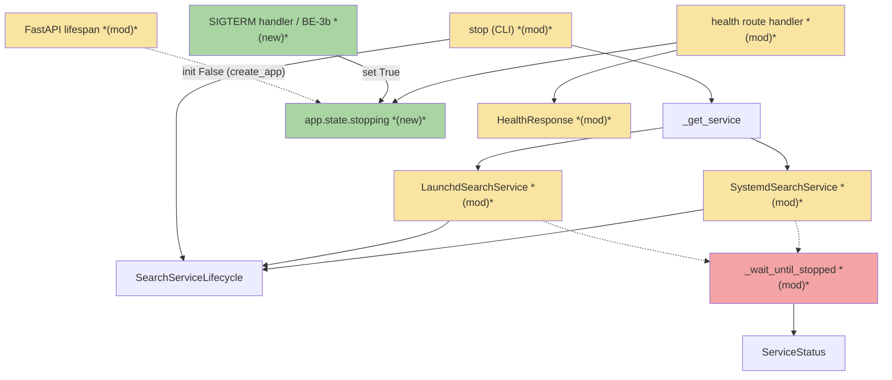
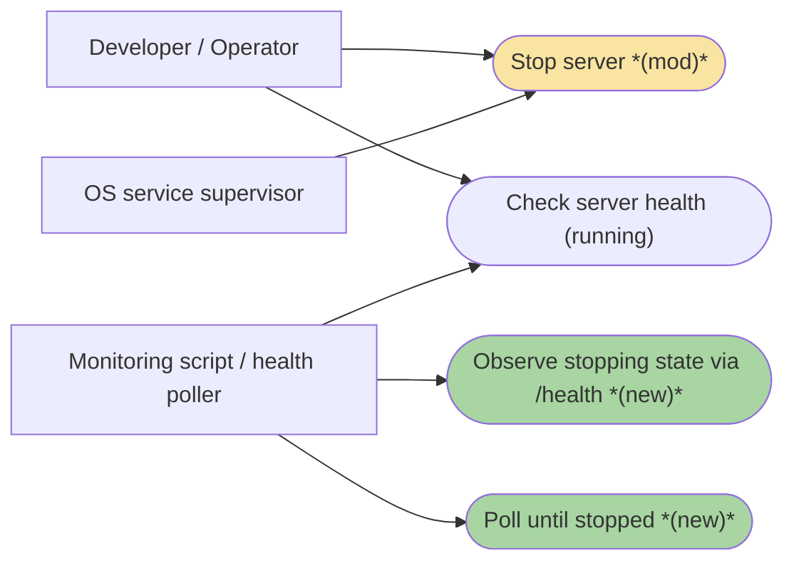
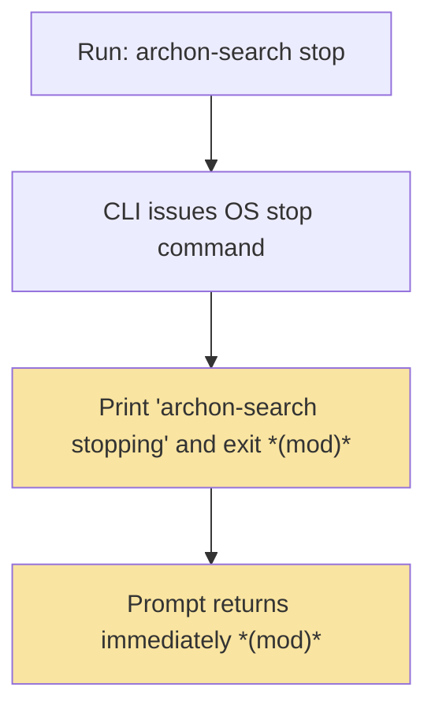
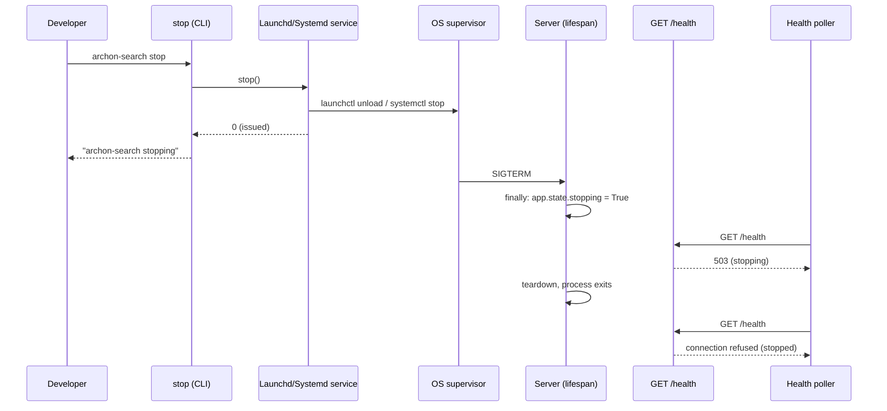

# NBS · Non-Blocking Stop with a "Stopping" State — Team Plan

**How to read this file**
- **Architecture approach:** Clean Architecture — the default; no override skill was requested. **Layers:** Presentation · Use Cases · Interface Adapters · Entities · Frameworks & Drivers. This is a client+server app (a Python Click CLI plus a separate FastAPI/uvicorn server process), so layers split across the CLI/server boundary and the HTTP surface is a contract.
- The **Frontend, Backend, and Tester** sections are the **depth view** — each role's scope, grouped by layer. There is **no browser UI**; the sole Presentation surface is the CLI.
- **Contracts** are logical. **TypeSpec v1.13.0 is available**, so the HTTP/API seam (`GET /health`) is authored as a TypeSpec HTTP service emitting `openapi.yaml`, and the internal `stop()` seam is authored as a core-construct `.tsp`. In-process state and CLI output seams are prose.
- **Role tags** (`#frontend-role`, `#backend-role`, `#tester-role`) mark each role-owned section.
- IDs (`S#` scenarios, `C#` contracts, `Q#` questions) are the traceability thread.
- **Tasks** are not in this file — task breakdown is a separate downstream step.
- **Rule:** change a contract only by team agreement.

---

## Background

Today `archon-search stop` blocks for up to 10 seconds: the platform service calls `_wait_until_stopped()`, which polls `status().running` every 0.2 s until the process is confirmed dead. During that same window, `GET /health` still returns `200 {"status": "running"}` — it is liveness-only and never signals that shutdown has begun. A caller polling health cannot tell a healthy server from one that is already draining.

---

## Goal

`archon-search stop` returns within milliseconds after issuing the OS stop command, printing `"archon-search stopping"`. From that point the server's real state is observable on `GET /health`: **running** → 200, **stopping** → 503 (the moment the lifespan `finally` block sets `app.state.stopping = True`), **stopped** → connection refused once the process exits.

**⚠️ SUPERSEDED by Q7 (see tasks file K1): the flag producer is a SIGTERM handler (BE-3b), NOT the lifespan `finally` block — the `finally`-placement is unobservable for fresh connections and is never built.**

---

## Scope

### In Scope
- `archon-search stop` returns immediately after issuing the OS stop command — no polling, no waiting.
- On Linux, `SystemdSearchService.stop()` must use `systemctl --user stop --no-block` (not the bare synchronous `systemctl --user stop`) to return immediately; the bare command blocks until the unit reaches `inactive` (default `TimeoutStopSec = 90 s`).
- The FastAPI lifespan sets `app.state.stopping = True` as the first statement of its `finally` block, before any teardown. **⚠️ SUPERSEDED by Q7 (see tasks file K1): the flag producer is a SIGTERM handler (BE-3b), NOT the lifespan `finally` block.**
- `GET /health` returns `503 Service Unavailable` when that flag is set, and remains auth-exempt.
- `app.state.stopping` is initialised to `False` in `create_app()` so pre-shutdown health requests never `AttributeError`.
- The S04 smoke test is redesigned to poll `/health` until non-200 (rather than relying on the blocking stop to guarantee it).
- Unit tests cover the happy path (flag set → 503), health 200 when the flag is unset, auth-exemption of the 503, and the new stop CLI output.
- Docs updated per the Documentation update section.

### Out of Scope
- `archon-search status` showing a "stopping" label — the window is under half a second; a one-shot CLI check cannot reliably catch it. `ServiceStatus` gains no `stopping` field.
- Any change to `GET /ready` or `GET /status`.
- Container deployments (Docker/tini path) — SIGTERM already flows correctly; no change needed.
- Windows — `WindowsSearchService.stop()` raises `NotImplementedError` and stays that way.
- A `--wait` flag on stop, and `status --watch` — deferred to future iterations.

---

## Acceptance criteria
- `archon-search stop` prints `"archon-search stopping"` and returns immediately after issuing the OS stop command (no 10-second wait).
- `GET /health` returns `200 {"status": "running"}` while the server is running (no regression).
- `GET /health` returns `503` once `app.state.stopping` is `True`, without requiring authentication. *(conditional on Q7: requires spike to confirm the 503 is observable by a new connection after SIGTERM; if not observable, this AC is revised)*
- `GET /health` becomes connection-refused once the process has exited.
- `LaunchdSearchService.stop()` and `SystemdSearchService.stop()` no longer call `_wait_until_stopped()`; both issue the OS command and return `0` = "issued".
- Stop issued against an already-stopped server is a no-op, exits 0, and prints the same message (no regression).
- The S04 smoke test polls `/health` until non-200 and passes without depending on blocking stop.
- All tests pass with zero warnings.

---

## What does NOT change
- `GET /ready`, `GET /status` behaviour and schemas.
- `ServiceStatus` dataclass (`running`, `pid`, `uptime_seconds`) — no `stopping` field.
- `_EXEMPT_PATHS` — `/health` stays auth-exempt; no middleware change.
- The AsyncExitStack / MCP lifespan-context structure (ADR-09) — the flag is set inside the existing `finally`, not by restructuring it. **⚠️ SUPERSEDED by Q7 (see tasks file K1): the flag producer is a SIGTERM handler (BE-3b), NOT the lifespan `finally` block (the SIGTERM-handler mechanism DOES restructure shutdown; this constraint is lifted per Q7).**
- Container-mode stop (`ARCHON_SEARCH_CONTAINER=1` guard in the CLI) and the Windows `NotImplementedError` path.
- `_get_service()` platform dispatch and `get_search_service()`.
- **`pre_activate_cleanup()` and installer `stop()` calls** — `service.py:pre_activate_cleanup()` stops a running instance before registering a new service file (install/upgrade path). `install.py` (multiple call sites) also calls `stop()` and depends on the old process being gone before proceeding. These callers are **not** changed by this feature — they continue to depend on confirmed-down semantics. If the non-blocking `stop()` is called from these paths it will introduce a bind race. Audit and protect: ensure `install.py` and `pre_activate_cleanup()` either call `_wait_until_stopped()` directly or are updated to poll `/health` for connection-refused before proceeding. Add an explicit note in C2 that "0 = issued" applies ONLY to the CLI stop path; callers needing confirmed-down should retain a wait mechanism.

---

## Known limitations / accepted trade-offs
- The stopping window is brief (~0.5–1 s). Callers must poll `/health` with retries and a timeout (the brief suggests up to 10 s) to reliably observe 503 then connection-refused — a single check may miss the 503.
- `status` cannot reliably report "stopping"; it stays a two-state (`running`/`stopped`) command by design.
- The "stopped" guarantee no longer comes from the stop command; it comes from external health polling. Scripts that relied on blocking stop must adopt polling (a future `--wait` flag will restore the old behaviour opt-in).
- **Unvalidated: observable 503 window requires spike.** The three-state model (running → 503 → connection-refused) assumes uvicorn serves responses during lifespan `finally`. This has not been empirically verified against a real uvicorn subprocess. Until Q7 is resolved, treat "pollers see 503" as a design goal requiring validation, not a confirmed behavior. (Superseded framing — under the resolved SIGTERM-handler mechanism the observable window is between the handler's flag-set and uvicorn's socket close, not the lifespan `finally`; see tasks K1.)

---

## Approach & architecture

The change threads one new piece of in-process state — `app.state.stopping` — from the SIGTERM handler (BE-3b) (Frameworks & Drivers) to the health route handler (Interface Adapters), and removes the blocking wait from the two platform `stop()` implementations so the CLI returns immediately.

### Architecture

**⚠️ Producer is the SIGTERM handler (BE-3b), per Q7 (see tasks file K1) — NOT the lifespan `finally` block. The `LIFESPAN` node remains only for the `app.state.stopping = False` initialisation in `create_app()`; it no longer sets the flag.**

_Dotted edges (`Launchd/Systemd -.-> _wait_until_stopped`) are the call sites being removed. `_wait_until_stopped` (WAIT) is marked `rmNode` — the method is deleted from the CLI path, but see C2 revision: it may be retained for `pre_activate_cleanup` and installer callers pending Q7/Q3 audit. `ServiceStatus` (STATUS) is unchanged and retained._

| Component | Change | Why |
|-----------|--------|-----|
| `app.state.stopping` flag | new | In-process signal, set in the lifespan `finally`, read by the health handler to emit 503. **⚠️ SUPERSEDED by Q7 (see tasks file K1): the flag producer is a SIGTERM handler (BE-3b), NOT the lifespan `finally` block — the `finally`-placement is unobservable for fresh connections and is never built.** |
| `stop` (CLI command) | modified | Returns immediately; prints `"archon-search stopping"`; drops the return-code branch/timeout warning |
| `LaunchdSearchService` | modified | `stop()` no longer calls `_wait_until_stopped()`; issues `launchctl unload` and returns 0 |
| `SystemdSearchService` | modified | `stop()` no longer calls `_wait_until_stopped()`; issues `systemctl --user stop --no-block` and returns 0 (bare `systemctl --user stop` without `--no-block` blocks up to 90 s — systemd default TimeoutStopSec) |
| `FastAPI lifespan` | modified | Sets `app.state.stopping = True` as the first statement of `finally`, before teardown. **⚠️ SUPERSEDED by Q7 (see tasks file K1): the flag producer is a SIGTERM handler (BE-3b), NOT the lifespan `finally` block.** |
| `health route handler` | modified | Reads `app.state.stopping`; returns 503 when set, 200 otherwise |
| `HealthResponse` | modified | 503 body carries `"status": "stopping"` (Q1 resolved) |
| `_wait_until_stopped` (method) | removed | Call sites and the method itself deleted from ABC + both impls (Q3 resolved) |
| `S04 smoke test` | modified | Redesigned to poll `/health` until non-200 instead of relying on blocking stop |

**Layer map (and role mapping)**

| Layer | Role | Components |
|-------|------|-----------|
| Presentation | **Frontend** (CLI) | `stop` command, `_get_service` |
| Use Cases | Backend | `SearchServiceLifecycle` (ABC), `_wait_until_stopped` |
| Interface Adapters | Backend | `health route handler`, `LaunchdSearchService`, `SystemdSearchService`, `HealthResponse` (response DTO — schema/adapter concern, not a domain entity) |
| Entities | Backend | `ServiceStatus` |
| Frameworks & Drivers | Backend | `FastAPI lifespan`, `app.state.stopping`, `get_search_service` |

**What changes**
- The CLI `stop` returns immediately and prints `"archon-search stopping"` (Presentation).
- Both platform `stop()` implementations drop the blocking `_wait_until_stopped()` call and return 0 = "issued" (Interface Adapters).
- The SIGTERM handler (BE-3b) sets `app.state.stopping = True` before uvicorn closes the listen socket (Frameworks & Drivers).
- The health handler reads the flag and emits 503 during the stopping window (Interface Adapters), possibly with a `"stopping"` body value (Entities).

**Key decisions (from the brief)**
- Stop returns immediately, not after confirmation — the "stopped" guarantee moves to external `/health` polling.
- 503 during stopping, not a custom code — the established convention for "alive but not accepting work".
- `status` is unchanged — the stopping window is too short for a one-shot command to catch.

### Actors & Use Cases

### Flows

#### User Flow

#### Data Flow

**⚠️ Diagram shows the SUPERSEDED `finally` mechanism; actual producer is the SIGTERM handler (BE-3b).**

#### Sequence

**⚠️ Diagram shows the SUPERSEDED `finally` mechanism; actual producer is the SIGTERM handler (BE-3b).**

### Prior decisions

| Decision | Rationale | Constraint |
|---|---|---|
| `GET /health` is liveness-only; always 200 while the event loop is alive, never 503 (B2) *(superseded)* | B2 established `/health` as a pure TCP-alive signal so supervisors and installers could rely on it without semantic error codes | **This feature deliberately supersedes it:** `/health` WILL return 503 during the stopping window. The plan must record the supersession and update the docs B2 touched ([Architecture/160](../Architecture/160_operational_readiness_monitoring_and_reliability.md), and check [Architecture/150](../Architecture/150_security_and_privacy_architecture.md)). |
| `stop()` returns int32; 0 = confirmed stopped after polling `_wait_until_stopped()`, non-zero = timed out (`service-lifecycle.tsp`) *(superseded)* | The blocking wait gave the CLI a reliable "stopped" signal | **Superseded:** 0 now means "issued" (OS command sent), not "confirmed down". `service-lifecycle.tsp` has been updated and the `_wait_until_stopped` reference removed from its contract note. |
| MCP mounted at `/mcp` on the same REST port; requires `mcp_starlette.router.lifespan_context` delegation inside an AsyncExitStack (ADR-09) *(active)* | Single-port simplicity; shared auth; no second uvicorn | Setting `app.state.stopping = True` at the top of the lifespan `finally` must not break the AsyncExitStack / lifespan-context structure ADR-09 confirmed. **⚠️ SUPERSEDED by Q7 (see tasks file K1): the flag producer is a SIGTERM handler (BE-3b), NOT the lifespan `finally` block** (the SIGTERM-handler mechanism restructures shutdown; per Q7 the constraint is lifted — the ADR-09 no-break requirement now applies to the SIGTERM handler's flag-set, not a `finally` placement). |

### Contradictions

All four are **code vs. docs**: after this feature ships the code will contradict what these docs currently state. Each is owned as "doc needs updating" and is carried into the Documentation update section.

| Contradiction | Code (after feature) | Doc says | Owner |
|---|---|---|---|
| `/health` return codes | Returns 503 during the stopping window | [160_operational_readiness_monitoring_and_reliability.md](../Architecture/160_operational_readiness_monitoring_and_reliability.md): `/health` "Never returns 503" | doc needs updating |
| Stop blocking behaviour | Stop returns immediately | [40_running_the_server.md](../UserManual/40_running_the_server.md): stop polls up to ~10 s | doc needs updating |
| 5xx alerting on `/health` | 503 is a normal shutdown signal, not an outage | [20_monitoring_and_alerts.md](../OperatorGuide/20_monitoring_and_alerts.md): any 5xx from `/health` triggers a critical alert | doc needs updating |
| Incident triage | 503 = stopping (expected); connection refused = stopped | [90_incident_runbook.md](../OperatorGuide/90_incident_runbook.md): treats any non-2xx from `/health` as "process down" | doc needs updating |

---

## Contracts / seams

Boundaries where roles must agree. **Logical, not code.** Changing one requires team agreement. **TypeSpec v1.13.0** is used: the HTTP seam (C1) is a TypeSpec HTTP service emitting an `openapi.yaml`; the internal `stop()` seam (C2) is a core-construct `.tsp` validated with `--no-emit`. C3 and C4 are in-process/CLI seams with no TypeSpec.

**C1 — `GET /health` response contract**  *(Interface Adapters ↔ external pollers / supervisors; HTTP/API seam)*
`/health` promises: **200** `{"status": "running", version, mcp}` while accepting work; **503** while `app.state.stopping` is `True` (draining). The 503 is returned from the route handler (not middleware) and stays auth-exempt via `_EXEMPT_PATHS`. Because FastAPI's `response_model` auto-serialises to 200, the handler must emit the 503 explicitly (e.g. `JSONResponse(status_code=503)`), not through `response_model` coercion. Whether the 503 body carries `"status": "stopping"` (Q1) and a `Retry-After` header (Q2) is open — the `.tsp` models the `"stopping"` body as the current best guess. The exact 503 body is `{"status": "stopping", "version": <same as 200 body>, "mcp": <same as 200 body>}` — the same fields as the 200 body with `status` overridden. This full shape is required so operator alerting can reliably distinguish an app-originated 503 (`"status":"stopping"` present) from a proxy-originated 503 (body absent or different). The route handler must call `_build_mcp_status()` (or its equivalent) before returning the 503 to populate these fields; if `_build_mcp_status()` raises, fall back to `{"status": "stopping", "version": _VERSION, "mcp": null}` (resolution (b)) so the fallback body still conforms to `HealthResponse`. — see [`api-contracts/non-blocking-stop-c1-health-api.tsp`](./api-contracts/non-blocking-stop-c1-health-api.tsp) and [`api-contracts/non-blocking-stop-c1-health-api.openapi.yaml`](./api-contracts/non-blocking-stop-c1-health-api.openapi.yaml).

**C2 — `SearchServiceLifecycle.stop()` return-value contract**  *(Presentation ↔ Interface Adapters; internal logical seam)*
`stop(dryRun?)` now issues the OS stop command and returns immediately. Return semantics change: **0 = "issued"** (was "confirmed down after polling"). The blocking `_wait_until_stopped()` is no longer part of the contract. The CLI must stop interpreting 0 as "confirmed stopped" and drop the non-zero timeout branch. **Scope of semantics change:** The "0 = issued" contract applies to the CLI `stop` command path only. `pre_activate_cleanup()` in `service.py` and the `install.py` installer flow depend on the old process being confirmed dead before the next step (otherwise a bind race occurs on reinstall/upgrade). These callers must NOT rely on the new "0 = issued" semantics. Either: (a) they keep calling `_wait_until_stopped()` directly (do not remove it from all callers), or (b) they are updated to poll `/health` for connection-refused. This must be decided and documented before removing `_wait_until_stopped()` from the ABC. **Q3 resolution is revised: do not remove `_wait_until_stopped()` from the ABC until all non-CLI callers are audited and migrated.** — see [`api-contracts/service-lifecycle.tsp`](./api-contracts/service-lifecycle.tsp) (updated; internal seam, no OpenAPI).

**C3 — `app.state.stopping` flag**  *(Frameworks & Drivers ↔ Interface Adapters; in-process state, no TypeSpec)*
A boolean on `app.state`, initialised to `False` in `create_app()` (so pre-shutdown requests never `AttributeError`) and set to `True` as the first statement of the lifespan `finally` block, before any `await`/teardown, to minimise the window where an in-flight request still sees 200. The health handler reads it defensively (`getattr(request.app.state, "stopping", False)`). Producer: lifespan. Consumer: health handler.

**⚠️ SUPERSEDED by Q7 (see tasks file K1): the flag producer is a SIGTERM handler (BE-3b), NOT the lifespan `finally` block — the `finally`-placement is unobservable for fresh connections and is never built.**

**C4 — CLI stop UX output**  *(Presentation ↔ user/terminal; CLI surface, no TypeSpec)*
On success the CLI prints `"archon-search stopping"` (was `"archon-search stopped"`) and exits 0; the timeout-warning branch is removed. Present-progressive signals "issued, not confirmed" and mirrors the `"stopping"` body the 503 carries (Q4). Errors still go to stderr and exit 1; the container-mode and systemctl-absent clean-message paths are unchanged.

---

## Data

_This project's `HealthResponse` and `ServiceStatus` are in-memory Entities (Pydantic / dataclass), not database schema, and this feature touches no LanceDB table or persisted state — Data section skipped._

---

## Scenarios #tester-role

Behavioural only — step-level detail is produced by the tasks downstream. Covers happy, unhappy, edge, and non-functional paths.

| id | Scenario (Given / When / Then) |
|----|--------------------------------|
| **S1** | **Given** a running server · **When** the user runs `archon-search stop` · **Then** the OS stop command is issued, `"archon-search stopping"` is printed, and the command returns immediately (no ~10 s wait) |
| **S2** | **Given** a running server (flag unset) · **When** a caller hits `GET /health` · **Then** it returns 200 `{"status": "running"}` (no regression) |
| **S3** | **Given** the server has entered shutdown (`app.state.stopping = True`) · **When** a caller hits `GET /health` · **Then** it returns 503 — without requiring authentication |
| **S4** | **Given** the server has exited · **When** a caller hits `GET /health` · **Then** the connection is refused (stopped) |
| **S5** | **Given** the server is already stopped · **When** the user runs `archon-search stop` · **Then** the OS stop is a no-op, the tool exits 0 and prints the same message (no regression) |
| **S6** | **Given** the server is unresponsive/hung · **When** stop is issued · **Then** the supervisor delivers SIGTERM and follows with SIGKILL on timeout; the stop command already returned immediately and never observes this |
| **S7** | **Given** the user runs `archon-search stop` · **When** the command executes · **Then** the terminal prompt returns immediately (non-blocking UX) |
| **S8** | **Given** an external poller · **When** it polls `GET /health` in a tight loop (≤50 ms interval, persistent client or fresh connection each time) after issuing stop, within a 10 s deadline · **Then** it either (a) observes 503 during the stopping window *then* connection-refused once stopped, OR (b) goes directly from 200 to connection-refused if the window is shorter than the poll interval. The e2e smoke test MUST use a tight-loop strategy and MUST assert 503 was observed if the uvicorn spike (Q7) confirms the window is catchable — otherwise downgrade S8 to assert eventual connection-refused and add a comment explaining why. The original bug (Q6) was `/health` returning 200 after the process was confirmed stopped; the regression guard must verify either 503-then-refused or at minimum refused (not 200). |

---

## Frontend — Presentation (CLI) #frontend-role

**Scope:** CLI-only. There is no browser UI. The one changed surface is the `archon-search stop` command's output and control flow; `status` is unchanged.
**Owns layer:** Presentation (`stop` command, `_get_service` dispatch).

**Done when**
- [ ] `archon-search stop` prints `"archon-search stopping"` and returns immediately after `service.stop()`, with no return-code branch or timeout warning — S1, S7 — C4
- [ ] Stop against an already-stopped server exits 0 with the same message (no regression) — S5
- [ ] Container-mode and error/exception paths are preserved (clean message + exit code) — S5, S6

---

## Backend — Entities · Use Cases · Adapters · Frameworks #backend-role

**Scope:** everything non-CLI — the platform service implementations, the FastAPI lifespan and app state, the health route handler, and the response Entity. Writes both unit and integration tests for its tasks.
**Owns layers:** Entities, Use Cases, Interface Adapters, Frameworks & Drivers.

**Done when**
- [ ] `LaunchdSearchService.stop()` and `SystemdSearchService.stop()` issue the OS command and return 0 = "issued" with no `_wait_until_stopped()` call — S1 — C2
- [ ] `app.state.stopping` is initialised `False` in `create_app()` and set `True` as the first statement of the lifespan `finally` block — S3 — C3
  **⚠️ SUPERSEDED by Q7 (see tasks file K1): the flag producer is a SIGTERM handler (BE-3b), NOT the lifespan `finally` block — the `finally`-placement is unobservable for fresh connections and is never built.**
- [ ] `GET /health` returns 503 (via explicit response, not `response_model` coercion) when the flag is set, and 200 otherwise, all without auth — S2, S3 — C1
- [ ] The 503 path preserves `/health` auth-exemption (no middleware change) — S3
- [ ] `restart()` race is mitigated: `restart()` calls `stop()+start()` in sequence. With non-blocking stop, `start()` can fire while the old process still holds the listening port (bind race). Mitigations to evaluate and choose one: (a) use an atomic OS restart primitive (`launchctl kickstart -k` for Launchd / `systemctl --user restart` for Systemd) instead of two separate calls; (b) keep a bounded wait *inside `restart()` only* (re-use `_wait_until_stopped` internally while still removing it from the CLI path). Document the chosen mitigation in C2 before implementation. — S1 — C2
- [ ] `_wait_until_stopped()` removed from `SearchServiceLifecycle`, `macos.py`, and `linux.py` — Q3 — S1
- [ ] `restart()` verified by a new e2e smoke test: issue restart, assert the server returns healthy — Q5 — S6
- [ ] Unit test: `LaunchdSearchService.stop()` and `SystemdSearchService.stop()` invoke the OS command and never call `_wait_until_stopped` — mock the subprocess call, assert it was invoked with correct arguments, assert `_wait_until_stopped` was not called.

---

## Tester #tester-role

**Scope:** the tester owns **e2e (smoke) and manual** tests plus the project close-out. **Unit and integration** tests belong to the implementing dev, in each implementation task's `Tests` block.

**Allocation** — each scenario at the cheapest level that proves it *(unit + integration are dev-written; e2e + manual are the tester's tasks)*

| Scenario | Cheapest level |
|----------|----------------|
| S1 | unit (CliRunner: message + immediate return + `service.stop()` called) |
| S2 | unit (TestClient: flag unset → 200) |
| S3 | unit (TestClient: inject `app.state.stopping = True` → 503, no auth) |
| **S3a** | unit (TestClient: fresh app with no prior `stopping` attribute injected → `getattr` fallback → 200, no `AttributeError`) |
| **S3b** | unit (assert `create_app()` returns an app where `app.state.stopping is False` — explicit attribute existence check, not just truthy/falsy) |
| **S3c** | unit (TestClient with `stopping = True` → assert 503 body contains `{"status": "stopping"}` — not just status code) |
| S5 | unit (CliRunner: already-stopped no-op) |
| S7 | unit (CliRunner: returns without blocking) |
| **S-flag-order** | integration (`asgi-lifespan` or `LifespanManager`-based: trigger real shutdown, assert `app.state.stopping` was `True` before `search_store.disconnect()` was called — verifies flag-set ordering invariant in C3). **⚠️ SUPERSEDED by Q7 (see tasks file K1): the flag producer is a SIGTERM handler (BE-3b), NOT the lifespan `finally` block — the invariant is re-specified in tasks BE-3b as "flag set before uvicorn closes the listen socket".** |
| S4 | e2e (redesigned S04 smoke: poll `/health` until connection refused) |
| S8 | e2e (redesigned S04 smoke: **must assert a 503 was observed** before connection-refused — Q6: the original bug was `/health` returning 200 during the stopping window; 503-assertion is the direct regression guard) |
| S6 | e2e (new restart smoke: issue `restart()`, assert the server comes back up; verifies that OS supervisor sequences stop→start correctly without Python-side blocking — Q5) |

---

## Documentation update

Docs the feature touches — the tasks file's close-out task works through this list. Each entry names the guide it lives in and what must change.

**Deploy-ordering guidance (operator responsibility)**
- [ ] **Alerting suppression recipe provided by OPS-1.** Per `20_monitoring_and_alerts.md`, any 5xx from `/health` currently triggers a critical page. Once this server change ships, every graceful stop fires a 503 — causing a critical alert on every planned shutdown. Operators of monitored deployments SHOULD apply the alerting suppression recipe (provided in OPS-1) before upgrading. The project deliverable is the recipe + documentation; enforcement is the operator's responsibility.

**User Manual** (`Documentation/UserManual/`)
- [ ] [40_running_the_server.md](../UserManual/40_running_the_server.md) — *contradiction with code* — replace "stop polls up to ~10 s" with: stop prints `"archon-search stopping"` and returns immediately; poll `GET /health` until connection-refused to confirm the server is down. Also update the `restart` description: restart issues stop→start and returns immediately; the server is back when `/health` returns 200.

**Operator Guide** (`Documentation/OperatorGuide/`)
- [ ] [20_monitoring_and_alerts.md](../OperatorGuide/20_monitoring_and_alerts.md) — *contradiction with code* — a 503 from `/health` with body `"status": "stopping"` is a normal shutdown signal; suppress the critical alert for this specific 503 shape (or add a brief grace window). A proxy-originated 503 will lack `"status": "stopping"` and should still alert.
- [ ] [90_incident_runbook.md](../OperatorGuide/90_incident_runbook.md) — *contradiction with code* — triage must distinguish three states: 200 = running; 503 `{"status":"stopping"}` = graceful drain (expect connection-refused within ~1 s, not an incident); connection refused = stopped.

**Architecture** (`Documentation/Architecture/`)
- [ ] [160_operational_readiness_monitoring_and_reliability.md](../Architecture/160_operational_readiness_monitoring_and_reliability.md) — *contradiction with code* — remove "never returns 503"; document the three-state `GET /health` model: running → 200, stopping → 503 `{"status":"stopping"}`, stopped → connection refused.
- [ ] [600_api_reference_or_public_interface.md](../Architecture/600_api_reference_or_public_interface.md) — *new feature* — add the `GET /health` 503 response path with body shape.
- [ ] [120_services_and_integration_architecture.md](../Architecture/120_services_and_integration_architecture.md) — *new feature* — update the `/health` route-group entry to document the 503 stopping response.

**Contracts**
- [ ] [service-lifecycle.tsp](./api-contracts/service-lifecycle.tsp) — *updated* — `stop()` 0 = "issued" (verify `_wait_until_stopped` reference is fully removed after Q3).
- [ ] [non-blocking-stop-with-stopping-state-brief.md](./non-blocking-stop-with-stopping-state-brief.md) — *no change needed* (source brief)
- [ ] [non-blocking-stop-with-stopping-state-team-plan.md](./non-blocking-stop-with-stopping-state-team-plan.md) — *this file* (updated with decisions)
- [ ] Regenerate `tests/server/openapi_snapshot.json` and `tests/contract/openapi_snapshot.json` — adding a `503` response to `GET /health` (via `responses={503: ...}` on the route decorator) changes the OpenAPI schema; both snapshot files must be updated or the snapshot tests will fail. Run: `uv run pytest tests/server/test_openapi_snapshot.py --update-openapi-snapshot` (or the equivalent `--update` flag for the contract snapshot).

**Consulted (read-only)**
- [B2-deeper-health-readiness-brief.md](../Completed/B2-deeper-health-readiness-brief.md) — prior decision this feature supersedes
- [150_security_and_privacy_architecture.md](../Architecture/150_security_and_privacy_architecture.md) — B2 also touched it re `/health`; check whether it repeats the "never 503" claim and update if so
- [09_mcp_http_mount_and_namespace_propagation.md](../ADRs/09_mcp_http_mount_and_namespace_propagation.md) — lifespan/AsyncExitStack structure the flag change must not break

---

## Open questions

**Q1–Q6 resolved; Q7 is a new blocking question that reopens draft status.**

| id | Area | Decision |
|----|------|----------|
| **Q1** | feature / contract | **Include `"status": "stopping"` in the 503 body.** The handler emits an explicit `JSONResponse(status_code=503, content={"status": "stopping", ...})`. Lets pollers distinguish a clean server drain from an infra/proxy 503. The C1 `.tsp` already models this. |
| **Q2** | feature / contract | **No `Retry-After` header.** The stopping window is <1 s — shorter than any sensible retry interval. Adding `Retry-After: 1` would slow pollers down beyond the real window. Most monitoring scripts ignore it anyway. |
| **Q3** | architecture | **REVISED: Do not remove `_wait_until_stopped()` from the ABC until all non-CLI callers are audited and migrated.** `pre_activate_cleanup()` in `service.py` and the `install.py` installer flow depend on the old process being confirmed dead before the next step. These callers must NOT rely on the new "0 = issued" semantics — see C2 revision. The CLI stop path removes its call; installer/upgrade paths retain a wait mechanism either via `_wait_until_stopped()` directly or by polling `/health` for connection-refused. |
| **Q4** | frontend / convention | **Print `"archon-search stopping"`.** Present-progressive correctly signals "issued, not confirmed"; shorter than "stop requested"; mirrors the `"stopping"` body value the 503 carries. The past-tense convention cannot be honoured when the action is not yet complete. |
| **Q5** | architecture | **REVISED: Add an e2e smoke test for `restart()` AND resolve the restart() race.** The original Q5 assumed "OS supervisors sequence stop→start correctly … no Python-side blocking is added" — but `restart()` in `service.py` is two separate Python-issued OS commands (`stop(); start()`), not an atomic supervisor restart. With non-blocking stop, `start()` fires while the old process may still hold the listen port. Required: (a) choose and implement a mitigation (atomic OS restart command OR internal wait in `restart()` only), (b) the e2e smoke test for restart must exercise rapid stop→start and assert no bind collision — not merely "server eventually healthy." |
| **Q6** | tests | **Conditional: assert 503 was observed if observable (requires Q7 spike).** The S04 redesign must use a tight poll loop (≤50 ms, persistent or fresh connection) with a wall-clock deadline (10 s). If Q7 confirms 503 is catchable: the smoke test MUST assert a 503 was observed before connection-refused. If Q7 shows the window is zero-width (socket already closed): revise to assert eventual connection-refused and document the trade-off explicitly. Either way, the original regression (200 after process exit) must be guarded. |
| **Q7** | architecture / mechanism | **OPEN — requires spike before implementation.** The plan assumes `GET /health` returns 503 to a *new* connection during the lifespan `finally` block. However uvicorn's shutdown order may be: (1) close listening socket, (2) drain in-flight requests, (3) run lifespan shutdown (`finally`). If so, the socket is already closed when the flag is set, and new poll connections get connection-refused, not 503 — collapsing the three-state model to two states (running → refused). **Required action before any implementation:** run a real spike (`archon-search serve` subprocess → SIGTERM → tight fresh-connection poll loop) and measure whether 503 is ever observed. If not: either (a) accept the feature delivers "non-blocking stop" only (drop the observable-503 goal, revise purpose/Goal/S8/Q6), or (b) redesign to install a SIGTERM handler that sets the flag *before* uvicorn closes the socket (e.g., via `uvicorn`'s `timeout_graceful_shutdown` + a pre-shutdown hook, or a custom `signal.signal(SIGTERM, ...)` that sets the flag and then calls the original handler). The "don't restructure the lifespan" constraint (What-does-NOT-change) may need to be lifted. |

---

## References

- **Brief:** [non-blocking-stop-with-stopping-state-brief.md](./non-blocking-stop-with-stopping-state-brief.md)
- **Tasks:** [non-blocking-stop-with-stopping-state-tasks.md](./non-blocking-stop-with-stopping-state-tasks.md)
