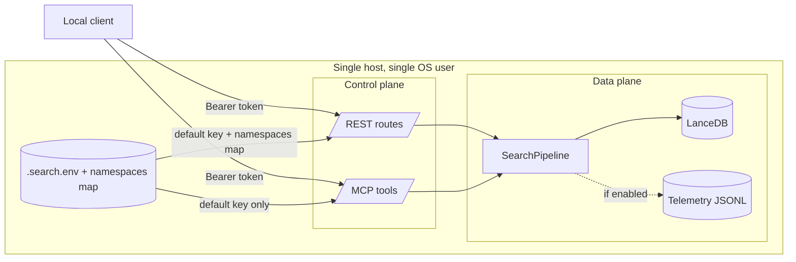

**Purpose**: Define the assets, trust boundaries, and explicit scope of the `archon-search` v1 threat model.
**Audience**: Security engineers, IT admins, and anyone signing off a deployment.
**Status**: Draft
**Last reviewed**: 2026-05-20
**Next review**: 2027-05-20

# Threat Model

`archon-search` is a local, single-tenant, single-process search server. The threat model below codifies that posture so reviewers can evaluate it against a concrete deployment rather than against assumed-cloud defaults.

For the broader security and privacy architecture this guide refines, see [`../Architecture/150_security_and_privacy_architecture.md`](../Architecture/150_security_and_privacy_architecture.md).

## Principles

1. **Local trust boundary.** Anything running as the same OS user is trusted. This is a design choice, not an oversight.
2. **Explicit scope beats implicit promises.** Threats outside this document are out of scope until a new ADR moves them in.
3. **Defenses are layered but minimal.** Bearer auth and per-chunk ACL exist to stop accidental cross-client leakage, not to harden against a hostile local user.
4. **Source of truth is code.** Every claim below points to a file path. If code and this doc disagree, the code wins and the doc is wrong.

## Assets

| Asset | On-disk location | Sensitivity | Notes |
| --- | --- | --- | --- |
| LanceDB tables (chunks, embeddings, ACL column, FTS) | `~/.archon-search/search/` | High — contains the indexed content verbatim in `source_path` and chunk text. | Schema in `archon_search/store.py`. ACL lives on every chunk row as a nullable `list<utf8>`. #Unverified (exact LanceDB column declaration not confirmed in this review pass) |
| Collection metadata (descriptions, centroids) | `~/.archon-search/search/` (LanceDB) | Medium — descriptions may summarize sensitive content. | Generated by `archon_search/description_generator.py`. #Unverified (module exists; generator internals not inspected) |
| API key file | `~/.archon-search/.search.env` (default) | High — single shared secret for the default namespace. | Owner-only `0600`. Override path with `ARCHON_SEARCH_KEY_FILE`. See `archon_search/key_manager.py`. |
| Per-namespace keys (REST only) | `[namespaces]` block in `~/.archon-search/archon-search.toml` | High — each entry is a static bearer token. | Loaded into `APIKeyMiddleware._namespaces` for the REST FastAPI app only. The MCP Starlette app is constructed with `namespaces={}` (`archon_search/server/mcp.py:251`), so namespace tokens do **not** authenticate against MCP. Same file permissions discipline applies. |
| Telemetry logs | `~/.archon-search/search-logs/<date>.jsonl` (only when enabled) | Medium — no raw queries, but `result_doc_ids` derive from paths. | See `04_telemetry_privacy.md`. |
| Indexing state | `~/.archon-search/search/.indexing_state.json` | Low — operational state, not content. | `archon_search/progress.py`. |
| Server log file | `~/.archon-search/logs/archon-search.log` | Low — application log; may include warnings naming paths. | `[logging].log_file`. |

## Trust boundaries

| Boundary | Where it is enforced | What crosses it |
| --- | --- | --- |
| Network → process | `uvicorn.run(host, port)` in `archon_search/server/app.py`; default `127.0.0.1:8765`. | HTTP requests only on loopback by default. |
| Process → bearer auth | `APIKeyMiddleware.dispatch` in `archon_search/server/middleware_auth.py:25`. A validated namespace is stamped onto `request.state.namespace`. The middleware exempts five paths: `/health`, `/ready`, `/docs`, `/openapi.json`, `/redoc` (`middleware_auth.py:_EXEMPT_PATHS`). | Bearer-validated HTTP requests (and the five exempt paths). |
| REST vs MCP | Two distinct ASGI apps that share only the `APIKeyMiddleware` *class* and the key file. The REST FastAPI app is built in `archon_search/server/app.py` (`create_app`) with `APIKeyMiddleware(api_key=..., namespaces=config.namespaces)`. The MCP surface is a separate `Starlette` app returned by `create_mcp_http_app` in `archon_search/server/mcp.py:237–252`, wrapping `fastmcp_app.streamable_http_app()` with `APIKeyMiddleware(api_key=api_key, namespaces={})` (`mcp.py:251`). | MCP is not a privileged surface, but the `[namespaces]` map is **REST-only**: on MCP, only the default key authenticates, and every authenticated request resolves to `DEFAULT_NAMESPACE`. |
| Control plane vs data plane | Control routes (`/state`, `/status`, `/collections`, `/jobs`, `/telemetry`) and data routes (`/search`, `/route`) all sit behind the same bearer check. | The boundary is logical, not enforced by separate keys today. |
| Namespace → ACL | `archon_search/acl.py::apply_acl_filter` invoked from `SearchPipeline`. | Chunks tagged with an `acl` list (see `02_authentication_and_keys.md` and `03_authorization_and_acl.md`). |
| Host → outside world | None for telemetry — there is no transport. `[telemetry].export_enabled = true` is coerced to `false` in `archon_search/config.py:209–217` and a warning is logged (`config.py:214`). | Nothing in v1. |

## In scope

The v1 threat model considers and mitigates:

- **Casual misuse by a second local client without the API key.** Bearer auth blocks unauthenticated traffic on every endpoint except the five exempt paths declared in `middleware_auth.py::_EXEMPT_PATHS` — `/health`, `/ready`, `/docs`, `/openapi.json`, `/redoc`. FastAPI does not register `/docs`, `/openapi.json`, or `/redoc` in this build's OpenAPI schema (see `app.py`), but the middleware exemption means they are reachable unauthenticated if mounted. See `02_authentication_and_keys.md`.
- **Cross-namespace data leakage between cooperating local clients.** Per-chunk ACL columns and namespace-scoped writes prevent one namespace from reading another's protected chunks. See `03_authorization_and_acl.md`.
- **Accidental persistence of raw query text in telemetry.** Structural — `TelemetryEntry` has no `query` field and no factory accepts one (`archon_search/telemetry/entry.py`). See `04_telemetry_privacy.md`.
- **Drift of the API key file permissions.** `_load_from_file` re-tightens the mode to `0600` on every read (`archon_search/key_manager.py:54–59`).
- **Timing side channel on key comparison.** `secrets.compare_digest` + a deliberately non-short-circuiting loop in `middleware_auth.py:41–47`.

## Out of scope (deliberate non-goals)

The following are explicit non-goals in v1. They are recorded so a reviewer does not treat their absence as an oversight; they are also not unpaid debt — they are design choices anchored in ADRs and the debt register.

- **Hostile processes running as the same OS user.** They can read `.search.env`, the LanceDB directory, and the logs directly; no in-process control would help.
- **Multi-tenant SaaS isolation.** The server is single-process, single default key with an optional per-namespace map. **D7** adds a durable multi-key store (`KeyStore`) so multiple managed keys can be issued, revoked, and rotated live — but the isolation model remains cooperating-clients-only, not hostile-tenant. `SEC-1` (resolved by D7) is recorded in [`../Architecture/530_technical_debt_refactoring_roadmap.md`](../Architecture/530_technical_debt_refactoring_roadmap.md).
- **Distributed deployment / horizontal scale.** LanceDB is opened by a single process; runtime state under `~/.archon-search/` is host-local. See ADR [`../ADRs/01_lancedb_as_local_vector_store.md`](../ADRs/01_lancedb_as_local_vector_store.md).
- **Supply-chain integrity of dependencies.** Out of scope at the application layer; relies on the operator's package manager and PyPI signature checks performed by `release.sh`. #Unverified (claim about `release.sh` signature checks not confirmed against the script in this review)
- **Network-level attacks against the loopback interface.** Treated as outside the host trust boundary; if the operator binds to a non-loopback interface, see `05_network_exposure_and_tls.md`.
- **Backup secrecy.** The operator is responsible for encrypting backups that include `~/.archon-search/`.
- **Defending against operators who set `[server].host = "0.0.0.0"` without a reverse proxy.** Not in scope; documented as a configuration footgun in `05_network_exposure_and_tls.md`.

## Single-tenant, single-process assumption

Two invariants together define "single tenant" here:

1. **One default key per process.** `load_or_generate_key()` returns a single `(key, source)` tuple — i.e. exactly one default key. The optional `[namespaces]` map adds *additional* keys for the REST surface, but each entry is still a static, long-lived string, and MCP only honors the default key (see the REST vs MCP boundary above).
2. **One LanceDB process owner.** ADR-01 commits to LanceDB as a single-process embedded store. Concurrent processes opening the same directory is not supported.

If either invariant is violated (shared key file across hosts, multiple `archon-search` processes against the same `db_path`), the threat model no longer applies.

## Related documents

- [`02_authentication_and_keys.md`](./02_authentication_and_keys.md) — key bootstrap and bearer enforcement.
- [`03_authorization_and_acl.md`](./03_authorization_and_acl.md) — namespace and per-chunk ACL semantics.
- [`04_telemetry_privacy.md`](./04_telemetry_privacy.md) — telemetry guarantees and accepted risks.
- [`05_network_exposure_and_tls.md`](./05_network_exposure_and_tls.md) — exposure beyond localhost.
- [`06_hardening_checklist.md`](./06_hardening_checklist.md) — pre-production checklist.
- [`../Architecture/150_security_and_privacy_architecture.md`](../Architecture/150_security_and_privacy_architecture.md) — broader security/privacy architecture.
- [`../Architecture/530_technical_debt_refactoring_roadmap.md`](../Architecture/530_technical_debt_refactoring_roadmap.md) — `SEC-1`, `SEC-2`, `SEC-3`, `TEL-1`. #Unverified (cross-references to specific debt-register IDs not validated against the register in this review)
- [`../Backlog/03_world_class_roadmap.md`](../Backlog/03_world_class_roadmap.md) — items D7, D8, E4.
