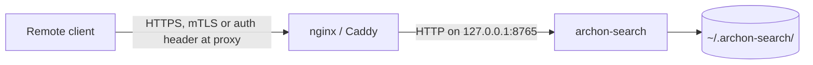

**Purpose**: Describe how `archon-search` is exposed on the network, the absence of native TLS, and how to harden a non-loopback deployment.
**Audience**: Security engineers and IT admins deploying the service on multi-user or remote-accessible hosts.
**Status**: Draft
**Last reviewed**: 2026-05-20
**Next review**: 2027-05-20

# Network Exposure and TLS

`archon-search` ships as a plain HTTP server on the loopback interface. There is no native TLS, no built-in rate limiting, and the default CORS policy is wildcard. Any deployment that exposes the port beyond `127.0.0.1` must terminate TLS and enforce origin restrictions externally.

For threat-model context, see [`01_threat_model.md`](./01_threat_model.md). For bearer auth that runs over this transport, see [`02_authentication_and_keys.md`](./02_authentication_and_keys.md).

## Principles

1. **Loopback by default.** The default `[server].host` is `127.0.0.1`.
2. **No native TLS.** Uvicorn is started without TLS arguments; the server speaks `http://`.
3. **Reverse-proxy for everything off-host.** TLS termination, CORS hardening, rate limiting, and access logging all live in front of `archon-search`, not in it.
4. **CORS wildcard is a footgun, not a feature.** It exists to make local browser tooling work; it does not survive a non-loopback bind.

## Defaults

| Setting | Default | Source |
| --- | --- | --- |
| `[server].host` | `127.0.0.1` | `archon_search/config.py` `SearchConfig.host` |
| `[server].port` | `8765` | `archon_search/config.py` `SearchConfig.port` |
| TLS | not supported natively | `archon_search/server/app.py:156` `run_server` calls `uvicorn.run(app, host=config.host, port=config.port)` with no `ssl_certfile`/`ssl_keyfile` |
| CORS allow-origin | `*` | `archon_search/server/app.py:122` `app.add_middleware(CORSMiddleware, allow_origins=["*"], allow_methods=["*"], allow_headers=["*"])` |
| CORS preflight bypass of auth | yes, by design (FastAPI `CORSMiddleware` is added *after* `APIKeyMiddleware`, so it runs first on the request path) | `tests/server/test_openapi_schema.py:79` (`test_cors_preflight_to_protected_endpoint_not_blocked`) documents the preflight contract |

A consequence of the middleware ordering: `OPTIONS /<any>` preflight requests do **not** require a bearer token. This is necessary for browsers, but it means CORS is the only layer governing whether a remote origin can attempt cross-origin requests.

## CORS — `CORS-1` risk

The current configuration accepts cross-origin requests from any origin, with any method and any headers. On the default loopback bind this is harmless: a browser on the same machine is already inside the trust boundary, and the bearer token must still be presented on the actual request.

**On any non-loopback bind, the wildcard CORS becomes a real risk.** Any web page the operator visits can issue cross-origin `POST /search` (and other) calls; the only thing stopping it is whether the page has obtained a bearer token. If a token leaks via a copy-paste into a chat, browser history, or a misrouted log, the wildcard CORS removes one of the layered defenses against ambient browser exploitation.

This risk is tracked as `CORS-1` in the debt register (see `../Architecture/530_technical_debt_refactoring_roadmap.md:39`). The entry back-references this file and notes the acceptable scope (loopback bind) and the trigger that escalates the risk (bind address moves off `127.0.0.1` without a hardening reverse proxy). #Unverified — "Security surprises" callouts in the project review (the project-review artifact is not in `Documentation/`).

**There is no config knob for CORS in v1.** The `CORSMiddleware` parameters in `app.py` are hardcoded. Hardening must therefore happen at a reverse proxy, or by editing `app.py` and rebuilding from source.

## Recommended topology for non-loopback deployments



Concrete rules for the proxy:

- **Bind `archon-search` to loopback** (`[server].host = "127.0.0.1"`). The reverse proxy is the only thing that talks to it.
- **Terminate TLS at the proxy** with a certificate from a trusted CA (or your internal PKI). Disable plaintext on the public listener.
- **Override CORS at the proxy.** Strip `Access-Control-Allow-Origin: *` from upstream responses and emit a tight allow-list, or refuse `OPTIONS` for origins you do not own.
- **Restrict origins for browser clients.** If you do not have browser clients, drop the `Access-Control-*` headers entirely at the proxy.
- **Pass the `Authorization` header through unchanged.** The bearer token must reach `archon-search`; the proxy must not strip or replace it.
- **Add rate limiting.** `archon-search` has none built in. Choose a budget that aligns with `[search].max_fanout` and reranker capacity.
- **Log at the proxy.** Server-side access logs are uvicorn's default and do not include the request body; if you need centralized audit, do it at the proxy.

### Minimal nginx example

```nginx
server {
    listen 443 ssl;
    server_name search.example.internal;
    ssl_certificate     /etc/ssl/search.crt;
    ssl_certificate_key /etc/ssl/search.key;

    # Refuse browser preflight from anything we don't own
    if ($http_origin !~* ^https://(app|tools)\.example\.internal$) {
        return 403;
    }

    location / {
        proxy_pass http://127.0.0.1:8765;
        proxy_set_header Host              $host;
        proxy_set_header X-Forwarded-For   $remote_addr;
        proxy_set_header X-Forwarded-Proto $scheme;
        # Override upstream wildcard CORS
        proxy_hide_header Access-Control-Allow-Origin;
        add_header Access-Control-Allow-Origin "https://app.example.internal" always;
    }
}
```

The exact directives will depend on the proxy and the browser-client surface. The point is that **CORS hardening and TLS both happen here, not in `archon-search`**.

## What you do not get from binding to `0.0.0.0` without a proxy

Operators occasionally set `[server].host = "0.0.0.0"` for quick remote testing. This combination has well-known problems:

- **Plaintext bearer tokens on the wire.** Every authenticated request leaks the token to any device on the network path.
- **Wildcard CORS reachable from arbitrary origins.** Any browser anywhere can attempt requests; only the bearer token gates them.
- **No rate limiting.** A single misbehaving client can saturate the reranker.
- **No isolation from neighbours.** The threat model assumes loopback; binding to `0.0.0.0` invalidates that assumption.

This configuration is documented as a footgun and is explicitly out of scope for the v1 threat model (see `01_threat_model.md` — "Out of scope").

## Verifying the network posture

```bash
# Confirm the server is bound to loopback only
ss -ltnp | grep :8765    # Linux
lsof -nP -iTCP:8765 -sTCP:LISTEN   # macOS
# Expected: 127.0.0.1:8765 (not 0.0.0.0:8765 and not [::]:8765)

# Confirm there is no listener for TLS
curl -k https://127.0.0.1:8765/health
# Expected: connection refused or SSL error — archon-search does not serve TLS.

# Confirm CORS is wildcard (and therefore must be overridden at any proxy).
# NOTE: Starlette's CORSMiddleware only treats an OPTIONS request as a CORS
# preflight (and short-circuits with 200 + CORS headers) when BOTH `Origin`
# and `Access-Control-Request-Method` are present. Omitting the latter causes
# the request to fall through to APIKeyMiddleware and return 401.
curl -i -H "Origin: https://evil.example" \
        -H "Access-Control-Request-Method: POST" \
        -X OPTIONS http://127.0.0.1:8765/search
# Expected: 2xx (not 401) with Access-Control-Allow-Origin: *
```

If the third command returns a non-wildcard origin or a `403`, a reverse proxy is already in front of the service — verify it matches your intended topology.

## Related documents

- [`01_threat_model.md`](./01_threat_model.md) — trust boundaries.
- [`02_authentication_and_keys.md`](./02_authentication_and_keys.md) — bearer auth that runs over this transport.
- [`06_hardening_checklist.md`](./06_hardening_checklist.md) — pre-production checklist.
- [`../Architecture/150_security_and_privacy_architecture.md`](../Architecture/150_security_and_privacy_architecture.md) — broader architecture.
- [`../Architecture/160_operational_readiness_monitoring_and_reliability.md`](../Architecture/160_operational_readiness_monitoring_and_reliability.md) — operational posture.
- [`../Architecture/530_technical_debt_refactoring_roadmap.md`](../Architecture/530_technical_debt_refactoring_roadmap.md) — `CORS-1` entry tracking the wildcard-CORS risk.
