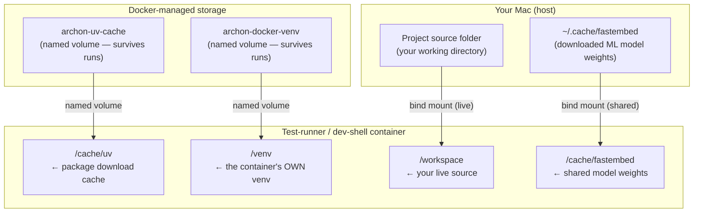
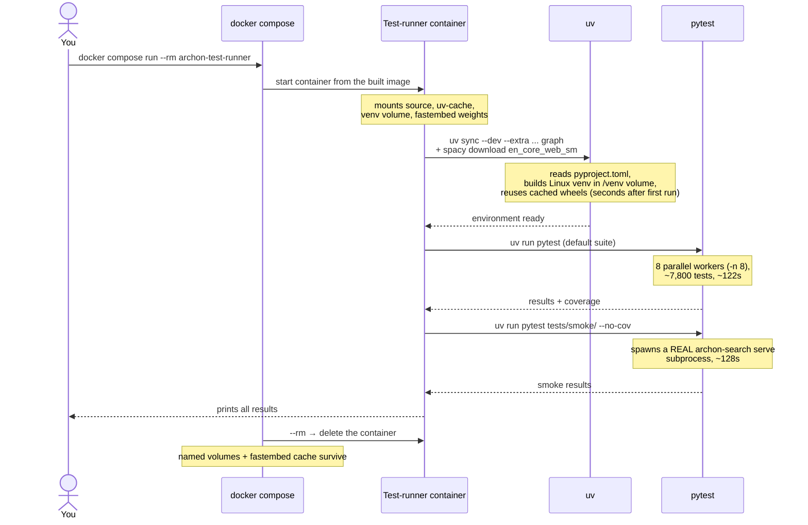
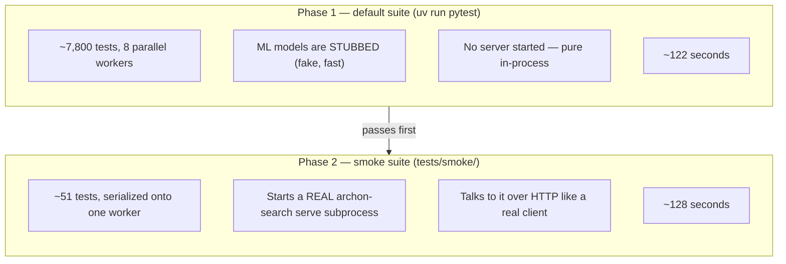

# Running the test suite in Docker

This guide explains the **Docker test runner** and the **Docker dev shell** — two throwaway/persistent containers that run the `archon-search` test suite in a clean, reproducible Linux environment, without installing anything on your machine beyond Docker itself.

You will learn what they do, how to use them, why they are built the way they are, and what actually happens under the hood when you run a single command.

---

## Who this is for

- You want to run the tests exactly the way CI runs them (Linux, Python 3.12) — even though you develop on a Mac.
- You want a **clean-room** test run: no leftover state from your local `.venv`, no "works on my machine" surprises.
- You are onboarding and don't want to install `uv`, spaCy models, or the ML weights locally just to confirm the tests pass.

You do **not** need this for everyday development. Running `uv run pytest` on your host is faster for the tight edit-test loop. The Docker runner is for confidence checks, onboarding, and reproducing CI.

---

## The 30-second version

```bash
# First time only: build the throwaway test image (takes a minute or two)
docker compose build archon-test-runner

# Run the full suite + smoke tests, then delete the container
docker compose run --rm archon-test-runner
```

That second command spins up a Linux container, installs the project (core + `hyde` + `rag-fusion` + `graph` extras and the spaCy model), runs ~7,800 tests in parallel, then runs the smoke tests, and prints the results. When it finishes, the container is thrown away (`--rm`), but the downloaded packages, the installed venv, and the ML models are kept for next time.

---

## The big picture

There are **two** container images in this project, and they exist for completely different reasons. Confusing them is the single most common mistake, so let's separate them up front. The **production image** (`Dockerfile`) copies the source *into* the image, installs with pip, excludes `tests/` and `Documentation/`, runs as a locked-down service, and ships to end users. The **test runner** (`Dockerfile.test`) mounts your source from the Mac at runtime, installs with uv, needs `tests/` present, runs as non-root uid 1000, and is disposable.

**Why can't the test runner just reuse the production image?** Because the production image is deliberately built to *not contain the tests*. The `.dockerignore` file strips `tests/`, `Documentation/`, and the dev-only compose file out of the production build so the shipped image stays small and doesn't leak test fixtures to users. A container with no test files inside it obviously can't run the tests — so the test runner is a separate, purpose-built image.

The same `Dockerfile.test` image backs **two** compose services: `archon-test-runner` (one-shot, runs the suites and exits) and `archon-dev-shell` (persistent, stays alive so you can work inside it interactively). They share the same image and the same dependency volumes — see [The dev shell](#the-dev-shell-interactive-work) below.

---

## The three files that make it work

The whole setup is just three small pieces. Here is each one and the job it does.

### 1. `Dockerfile.test` — the recipe for the test image

This is the blueprint Docker follows to build the environment your tests run inside. It is intentionally tiny.

```dockerfile
# syntax=docker/dockerfile:1.7
FROM ghcr.io/astral-sh/uv:python3.12-bookworm-slim
RUN apt-get update && apt-get install -y --no-install-recommends git && rm -rf /var/lib/apt/lists/*
RUN useradd --uid 1000 --create-home --shell /bin/sh runner && \
    mkdir -p /cache/uv /cache/fastembed /venv && \
    chown runner:runner /cache/uv /cache/fastembed /venv
USER runner
WORKDIR /workspace
ENV HOME=/home/runner \
    ARCHON_SEARCH_CONTAINER=1 \
    ARCHON_SEARCH_DATA_DIR=/tmp/archon-test \
    UV_PROJECT_ENVIRONMENT=/venv \
    UV_CACHE_DIR=/cache/uv \
    FASTEMBED_CACHE_PATH=/cache/fastembed \
    PYTHONDONTWRITEBYTECODE=1 \
    PYTHONUNBUFFERED=1
```

Line by line, in plain terms:

| Instruction | What it does | Why it matters |
|---|---|---|
| `FROM ghcr.io/astral-sh/uv:python3.12-bookworm-slim` | Starts from an official image that already has Python 3.12 and `uv` (the package manager this project uses) baked in. | You skip installing `uv` yourself — it's already there. "slim" means it's a small base with only the essentials. |
| `RUN apt-get install ... git` | Adds `git` to the image. | The project derives its version number from git tags (via `hatch-vcs`), so `git` must be present or the install step fails. The `rm -rf /var/lib/apt/lists/*` afterward deletes the package-manager download cache to keep the image small. |
| `RUN useradd ... runner` + `USER runner` | Creates a non-root user `runner` (uid 1000) and switches to it. | **This is why the permission tests pass.** The suite has tests that confirm the app *refuses* to read files whose permissions forbid it. As `root` those assertions fail (root can read anything); as a normal user they hold. Running as uid 1000 matches the test expectations. |
| `WORKDIR /workspace` | Sets the working folder inside the container to `/workspace`. | This is the folder your Mac's source code gets mounted onto (see below). |
| `ARCHON_SEARCH_CONTAINER=1` | Tells the app it's running inside a container. | This flag makes the app send its logs to standard error so `docker logs` captures them — otherwise container output can vanish. |
| `ARCHON_SEARCH_DATA_DIR=/tmp/archon-test` | Points the app's runtime data (its database, keys, job state) at a temporary folder. | Keeps test data out of the way and disposable — it lives inside the container's temp space, not your project. |
| `UV_PROJECT_ENVIRONMENT=/venv` | Tells `uv` to build its virtual environment at `/venv` *inside the container*, not at the default `/workspace/.venv`. | **This is the most important line.** `/venv` is a named volume, so the installed environment survives container restarts. See the next section. |
| `UV_CACHE_DIR=/cache/uv` | Points uv's package download cache at `/cache/uv`. | Also a named volume — downloaded wheels persist across runs, so the second `uv sync` is fast. |
| `FASTEMBED_CACHE_PATH=/cache/fastembed` | Points the ML model cache at `/cache/fastembed`. | Bind-mounted from your Mac's `~/.cache/fastembed`, so the container reuses model weights you already downloaded. |

The two remaining vars are hygiene: `PYTHONDONTWRITEBYTECODE=1` stops Python writing `.pyc` files back onto your mounted source, and `PYTHONUNBUFFERED=1` makes test progress print live instead of in a delayed burst.

Notice what is **not** here: there is no `COPY` of your source code, and no `RUN uv sync` install step. The image is just an empty, tooled-up Linux box. The source and the install both happen *later*, at run time. That is a deliberate design choice, explained next.

### 2. The `archon-test-runner` service in `docker-compose.override.yml`

`Dockerfile.test` says *how to build the box*. This service definition says *how to run it* — what to mount into it and what command to execute.

```yaml
  archon-test-runner:
    build:
      context: .
      dockerfile: Dockerfile.test
    volumes:
      - .:/workspace
      - archon-uv-cache:/cache/uv
      - archon-docker-venv:/venv
      - ~/.cache/fastembed:/cache/fastembed
    environment:
      FASTEMBED_CACHE_PATH: /cache/fastembed
    command:
      - sh
      - -c
      - >-
          uv sync --dev --extra hyde --extra rag-fusion --extra graph &&
          uv run python -m spacy download en_core_web_sm --quiet;
          uv run pytest;
          uv run pytest tests/smoke/ --no-cov

volumes:
  archon-dev-packages:
  archon-uv-cache:
  archon-docker-venv:
```

The four `volumes` lines are the heart of the whole design, so we'll give them their own section below. For now, the short version:

- **`.:/workspace`** — mount your current project folder (`.`) onto `/workspace` inside the container, live. The container reads *your* code, not a frozen copy.
- **`archon-uv-cache:/cache/uv`** — a persistent cache of downloaded Python packages, so the second run is much faster than the first.
- **`archon-docker-venv:/venv`** — a persistent copy of the installed Linux venv, so `uv sync` and the spaCy download only pay their full cost once.
- **`~/.cache/fastembed:/cache/fastembed`** — share the ML model weights already on your Mac, so the container doesn't re-download hundreds of megabytes.

The `command` runs, in sequence: install the project with the `hyde`, `rag-fusion`, and `graph` extras, download the spaCy model, run the main test suite, then run the smoke tests. See [Why the graph extra and spaCy model](#why-the-graph-extra-and-spacy-model) for what those extras buy you.

> This service lives in `docker-compose.override.yml` alongside two other services: `archon-dev` (a lean development server, unrelated to testing) and `archon-dev-shell` (a persistent version of this test runner — see below).

### 3. `.dockerignore` — the reason the test runner has to exist at all

You won't edit this file for the test runner, but it explains *why the test runner is separate*. It lists everything stripped out of the **production** image build:

```
tests/
Documentation/
...
docker-compose.override.yml
```

Because `tests/` is excluded from the production image, that image structurally cannot run the tests. Hence the dedicated `Dockerfile.test` that mounts the source (tests included) at run time instead of baking a test-free copy in.

---

## The volume architecture (the clever part)

A **volume** is a way to connect a folder to the container. Two kinds are used here, and understanding the difference is what makes the whole design click.

- A **bind mount** connects a folder *on your Mac* directly to a folder in the container. Changes flow both ways, live.
- A **named volume** is a storage area Docker manages on your behalf. It survives after the container is deleted, so it's perfect for caches and installed environments you want to keep between runs.



Three things are worth calling out. Both the `archon-test-runner` and `archon-dev-shell` services mount **the same three named volumes** (`archon-uv-cache`, `archon-docker-venv`) and the same fastembed bind mount, so a `uv sync` done by one service is immediately reused by the other.

### Why the virtual environment lives *inside* the container

This is the subtlest and most important design decision. Your Mac's `.venv` folder holds a Python interpreter and packages compiled for **macOS**. The container runs **Linux**. If the container tried to reuse your Mac's `.venv` (which sits at `/workspace/.venv` once your folder is mounted), it would find a macOS Python and Linux-incompatible native libraries — and break in confusing ways.

The line `UV_PROJECT_ENVIRONMENT=/venv` sidesteps this entirely: the container builds its **own** Linux virtual environment at `/venv`, a path *outside* the mounted `/workspace` folder. Because `/venv` is backed by the `archon-docker-venv` named volume, that Linux venv persists across container restarts — the install cost is paid once, not on every run. Your Mac's `.venv` and the container's venv never touch each other, so you can run tests on your Mac and in Docker at the same time without either corrupting the other.

### Why the package cache and venv are named volumes

The first `uv sync` downloads every dependency wheel *and* builds the venv — that takes a few minutes, and the spaCy model download adds to it. Storing the downloads in `archon-uv-cache` and the built environment in `archon-docker-venv` means Docker keeps both after the container is deleted. The **next** run reuses them, and `uv sync` finishes in a handful of seconds instead of minutes.

### Why the model weights are shared from your Mac

This project uses `fastembed`, which relies on machine-learning model files that are hundreds of megabytes. You've almost certainly already downloaded them to `~/.cache/fastembed` on your Mac during normal development. Bind-mounting that folder into the container lets the tests reuse those exact files — no re-download, saving several minutes per run. The `FASTEMBED_CACHE_PATH` environment variable tells the library where to look inside the container.

---

## Why the graph extra and spaCy model

The install command pulls in three optional extras — `hyde`, `rag-fusion`, and `graph` — and then downloads a spaCy model. The `graph` extra is the one that matters for the smoke suite:

- **`graph`** installs the graph subsystem's dependencies, including `spacy` (named-entity recognition for entity extraction) and `leidenalg` + `python-igraph` (the Leiden clustering algorithm used to build graph communities).
- **`en_core_web_sm`** is spaCy's small English model. `graph.enabled = true` needs it at runtime for entity extraction; without it the graph code path can't run.

Why bother? Because two of the smoke tests exercise the graph feature end-to-end (entity extraction plus a community rebuild via Leiden). Without `graph` + the spaCy model installed, those two tests **skip**. With them installed, they run and pass — which is why the base smoke suite (pre-DCS) reported `31 passed` rather than `29 passed, 2 skipped`. The DCS feature added `tests/smoke/docker/` with 20 additional Docker-mode CLI tests, bringing the smoke-suite total to approximately 51 tests. `hyde` and `rag-fusion` are installed for completeness of the dev/test dependency surface.

---

## The dev shell (interactive work)

The `archon-test-runner` runs the suites once and exits. When you want to *work inside* the Linux environment — iterate on a failing test, run a scoped path repeatedly, or start the server by hand — use `archon-dev-shell` instead. It uses the same image and the same dependency volumes (`.:/workspace`, `archon-uv-cache:/cache/uv`, `archon-docker-venv:/venv`, and the `~/.cache/fastembed` bind mount), but instead of running the suites and exiting, it does its one-time setup and then stays alive. Its `command`:

```yaml
    command:
      - sh
      - -c
      - >-
          if [ ! -f /venv/bin/activate ]; then
          uv sync --dev --extra hyde --extra rag-fusion --extra graph &&
          uv run python -m spacy download en_core_web_sm --quiet;
          fi;
          exec sleep infinity
```

The `command` is the whole trick: on start it checks whether `/venv/bin/activate` already exists. If the venv volume is empty (first ever start), it runs the same `uv sync` + spaCy download the test runner uses; if the venv is already populated (because either service set it up on a previous run), it skips straight to `exec sleep infinity`, which keeps the container alive doing nothing until you stop it.

### Workflow

```bash
# 1. Start it in the background. First start runs setup (~3–5 min); later starts are instant.
docker compose up -d archon-dev-shell

# 2. Open a shell inside it. Do this as many times as you like.
docker compose exec archon-dev-shell bash

#    Inside the container you have the full Linux venv. For example:
#      uv run pytest tests/test_pipeline.py --no-cov
#      uv run pytest tests/smoke/ --no-cov
#      uv run archon-search serve
#    Your Mac's source is live-mounted at /workspace, so edits on the host
#    are seen immediately inside the container — no rebuild, no re-sync.

# 3. Stop it when you're done. The dependency volumes survive for next time.
docker compose stop archon-dev-shell
```

Because the shell shares `archon-docker-venv` and `archon-uv-cache` with the test runner, whichever service you use first pays the setup cost, and the other reuses it.

---

## What happens when you run the test runner

Here is the full sequence when you type `docker compose run --rm archon-test-runner`.



The command runs, in order (`&&` and `;` chain them in the shell):

1. `uv sync --dev --extra hyde --extra rag-fusion --extra graph` — install the project and its dev/test/graph dependencies into the container's Linux venv.
2. `uv run python -m spacy download en_core_web_sm --quiet` — download the spaCy English model the graph subsystem needs.
3. `uv run pytest` — the main suite: about 7,800 tests across 8 parallel workers, roughly 122 seconds.
4. `uv run pytest tests/smoke/ --no-cov` — the smoke tests, run separately (see below), roughly 128 seconds.

---

## Why the tests run in two phases

The main suite and the smoke tests are deliberately kept apart. They test different things in fundamentally different ways.



The **default suite** replaces the heavy ML models with lightweight fakes (stubs), so thousands of tests run fast and in parallel. It never starts a real server.

The **smoke suite** does the opposite: it launches an actual `archon-search serve` process and talks to it over HTTP, exactly as a real user would. Because it starts a real server that binds a network port, you can't have eight of them fighting over the same port at once — so the smoke tests are forced onto a single worker, run one at a time. Mixing these into the fast parallel suite would cause port clashes and flaky failures, which is why they're a separate phase.

---

## Reading the results: a clean run

When you run the full suite in Docker, you should see roughly:

```
7806 passed, 41 skipped — 92% coverage        # default suite, ~122s
~51 passed                                      # smoke suite (31 base + 20 Docker CLI), ~128s
```

**Zero failures in both phases.** Because the test runner runs as a non-root user (uid 1000), the permission tests that used to fail under root now pass. And because the `graph` extra + spaCy model are installed, the two graph smoke tests run instead of skipping. The Docker CLI smoke tests (`tests/smoke/docker/`) add ~20 additional tests covering container-mode CLI behavior.

The 41 skips in the default suite are the usual markers excluded by default (`live_benchmark`, `smoke`, `live_eval`, `docling`, and `live` tests that need real infrastructure) — see `CLAUDE.md` for the marker rules. **Any actual failure — in either phase — is a real signal worth investigating.**

> **Historical note.** Earlier versions ran as `root` without the `graph` extra, producing ~9 "expected" failures (permission and service-install tests) and 2 skipped graph smoke tests. The non-root user and the graph extra fixed that; a clean run today is `0 failed`.

---

## The `tests/smoke/docker/` subdirectory

`tests/smoke/docker/` (added in DCS — Docker CLI Smoke Tests) is a subdirectory of the smoke suite that targets **container-mode CLI behavior** specifically. It runs inside the same `archon-test-runner` container alongside the rest of `tests/smoke/`, requiring no separate image or setup.

What it covers:

| Scenario | Test |
|---|---|
| `--help` / `--version` exit 0 (S1) | `test_help_exits_0`, `test_version_exits_0` |
| `serve` starts and shuts down cleanly (S2) | `test_serve_health_and_ready` |
| `status` shows HTTP telemetry when server running (S3) | `test_status_with_server_shows_http_telemetry` |
| `status` exits 0 cleanly when server unreachable (S4) | `test_status_without_server_clean_exit_0` |
| `start` / `stop` emit clean container-mode message, exit 1 (S5, S6) | `test_start_emits_clean_container_mode_message`, `test_stop_emits_clean_container_mode_message` |
| `install` / `uninstall` emit clean container-mode message, exit 1 (S7, S8) | `test_install_emits_clean_container_mode_message`, `test_uninstall_emits_clean_container_mode_message` |
| `key list` exits 0 (S9) | `test_key_list_exits_0` |
| `collection list` / `info` exits 0 (S10, S12) | `test_collection_list_exits_0`, `test_collection_info_exits_0` |
| `collection add --wait` completes (S11) | `test_collection_add_wait_completes` |
| `config show` exits 0 offline (S13) | `test_config_show_exits_0` |
| `ingest --wait` completes (S14) | `test_ingest_wait_completes` |
| `jobs status <id>` reports status (S15) | `test_jobs_status_reports_status` |
| `maintenance run` exits 0 (S16) | `test_maintenance_run_exits_0` |
| `--help` completes within 5s advisory (S18) | `test_help_completes_within_5s` |
| Telemetry field parity (T-1) | `test_docker_status_renders_telemetry_payload_fields` |

Every test in `tests/smoke/docker/` injects `ARCHON_SEARCH_CONTAINER=1` into the subprocess environment via the `_docker_env()` helper in `tests/smoke/docker/conftest.py`. All tests carry `pytestmark = [pytest.mark.smoke, pytest.mark.xdist_group("smoke_e2e")]` so they are collected under the `smoke` marker and serialize onto the same xdist worker as the rest of the smoke suite.

To run only the Docker CLI smoke tests:

```bash
docker compose run --rm archon-test-runner uv run pytest tests/smoke/docker/ --no-cov
```

---

## Command reference

All commands assume you've run the one-time build first.

```bash
# ── One-time setup ────────────────────────────────────────────
docker compose build archon-test-runner        # build the test image
                                                # (archon-dev-shell shares it)

# ── Everyday use: one-shot full run ───────────────────────────
docker compose run --rm archon-test-runner      # full suite + smoke tests

# ── Interactive dev shell ─────────────────────────────────────
docker compose up -d archon-dev-shell           # start (setup runs once)
docker compose exec archon-dev-shell bash       # shell in
docker compose stop archon-dev-shell            # stop when done

# ── Targeted one-shot runs (override the default command) ─────
# Only the smoke tests (includes tests/smoke/docker/):
docker compose run --rm archon-test-runner uv run pytest tests/smoke/ --no-cov

# Only the Docker CLI smoke tests:
docker compose run --rm archon-test-runner uv run pytest tests/smoke/docker/ --no-cov

# Only the default suite (no smoke):
docker compose run --rm archon-test-runner uv run pytest

# A single test file:
docker compose run --rm archon-test-runner uv run pytest tests/test_pipeline.py --no-cov
```

Notes:

- **`--rm`** deletes the container after it exits. Always use it for one-shot runs — otherwise stopped containers pile up. Your caches (packages, venv, models) are *not* deleted by `--rm`; they live in the named volumes and the bind mount.
- **Anything after the service name overrides the default `command`.** For example, `docker compose run --rm archon-test-runner uv run pytest tests/test_pipeline.py --no-cov` skips the `uv sync`/smoke sequence and runs just that one file. On a fresh cache the venv may not exist yet — run the default command (or start the dev shell) once first to populate it.
- **`--no-cov`** turns off coverage measurement, which is only meaningful for the whole suite. For a single file or the smoke tests, it just makes them run faster.
- For repeated targeted runs, prefer the **dev shell** — you pay setup once and then run `uv run pytest ...` inside it as many times as you like.

---

## Troubleshooting

| Symptom | Likely cause | Fix |
|---|---|---|
| First run is very slow | Downloading all dependencies, the spaCy model, and (if absent) model weights for the first time, plus building the venv. | Normal. Subsequent runs reuse the `archon-uv-cache` and `archon-docker-venv` volumes and the shared `~/.cache/fastembed` folder — expect `uv sync` to drop to a few seconds. |
| Tests can't find the ML models / try to re-download them | `~/.cache/fastembed` on your Mac is empty. | Run the project once on your host so the weights download, or just let the container download them (slower first run). |
| `ModuleNotFoundError` on a targeted single-file run | The container's venv hasn't been created yet on a fresh volume. | Run the default command (`docker compose run --rm archon-test-runner`) once, or start the dev shell once, to populate `/venv`, then targeted runs work. |
| The 2 graph smoke tests skip | `graph` extra or spaCy model missing from the venv (e.g. an old venv volume built before they were added). | Remove the stale venv volume (`docker volume rm archon-docker-venv`) and re-run so `uv sync --extra graph` + the spaCy download repopulate it. |
| Any failure in either phase | The suite is expected to be fully green. | Treat as a genuine problem and read the failure names — there are no known-good failures anymore. |
| Stopped containers accumulating | You forgot `--rm` on a one-shot run, or left `archon-dev-shell` up. | Use `--rm` for one-shot runs; `docker compose stop archon-dev-shell` when done. Clean up leftovers with `docker container prune`. |

---

## Related files and docs

- `Dockerfile.test` — the test image recipe (repo root); backs both `archon-test-runner` and `archon-dev-shell`.
- `docker-compose.override.yml` — the `archon-test-runner` and `archon-dev-shell` service definitions (and the separate `archon-dev` dev server).
- `Dockerfile` — the **production** image (different tool, different purpose — do not confuse with the test runner).
- `.dockerignore` — explains why `tests/` is absent from the production image, and therefore why this test runner exists.
- [`UserManual/08_running_with_docker.md`](UserManual/08_running_with_docker.md) → **Development and testing with Docker** — the operator-facing summary of these two services.
- `CLAUDE.md` → **Common commands** and **Repository conventions** — the authoritative rules for pytest markers, parallel-worker counts, and the smoke/default split.
